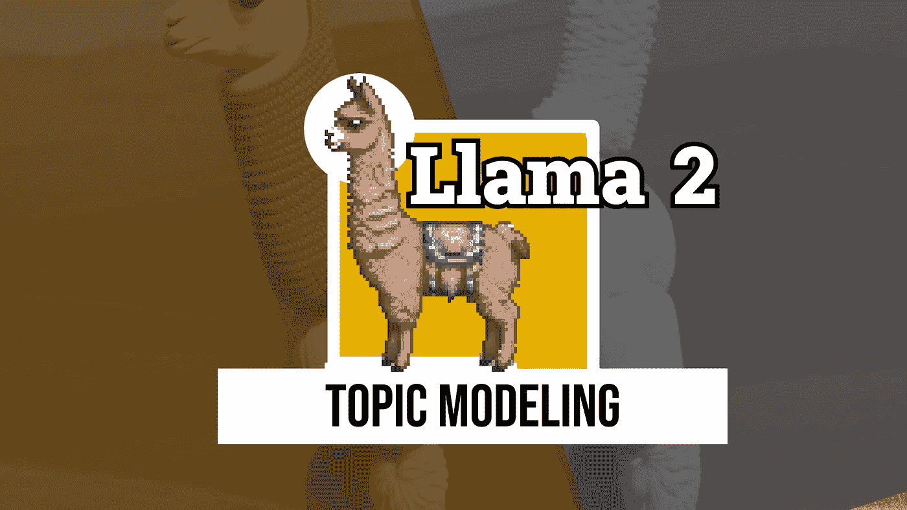
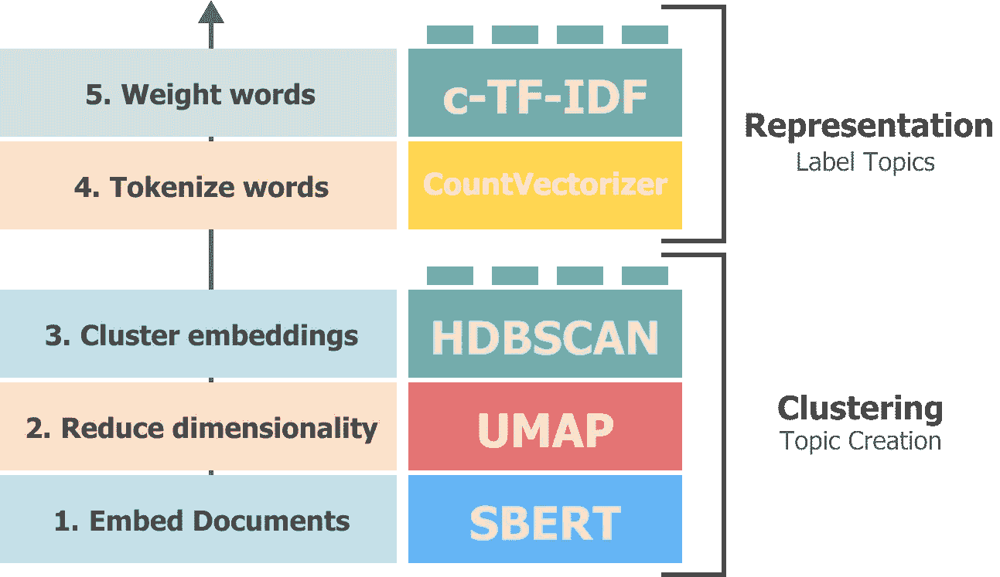

# 使用 Llama 2 进行主题建模

> 原文：[`towardsdatascience.com/topic-modeling-with-llama-2-85177d01e174?source=collection_archive---------0-----------------------#2023-08-22`](https://towardsdatascience.com/topic-modeling-with-llama-2-85177d01e174?source=collection_archive---------0-----------------------#2023-08-22)

## 使用大型语言模型创建易于解释的主题

 [Maarten Grootendorst](https://medium.com/@maartengrootendorst?source=post_page-----85177d01e174--------------------------------)

·

[关注](https://medium.com/m/signin?actionUrl=https%3A%2F%2Fmedium.com%2F_%2Fsubscribe%2Fuser%2F22405c3b2875&operation=register&redirect=https%3A%2F%2Ftowardsdatascience.com%2Ftopic-modeling-with-llama-2-85177d01e174&user=Maarten+Grootendorst&userId=22405c3b2875&source=post_page-22405c3b2875----85177d01e174---------------------post_header-----------) 发表在 [Towards Data Science](https://towardsdatascience.com/?source=post_page-----85177d01e174--------------------------------) ·12 分钟阅读·2023 年 8 月 22 日

--

随着**Llama 2**的出现，强大的 LLM 本地运行变得越来越现实。其准确性接近 OpenAI 的 GPT-3.5，这在许多应用场景中表现良好。

在本文中，我们将探讨如何使用**Llama2**进行主题建模，而无需将每一个文档都传递给模型。相反，我们将利用[**BERTopic**](https://github.com/MaartenGr/BERTopic)，这是一种模块化的主题建模技术，可以使用任何 LLM 来微调主题表示。

BERTopic 的工作流程相当简单。它包括 5 个连续步骤：

1.  嵌入文档

1.  降低嵌入的维度

1.  聚类减少的嵌入

1.  对每个聚类的文档进行标记化

1.  提取每个聚类中最具代表性的词汇

BERTopic 的 5 个主要步骤。

然而，随着像**Llama 2**这样的语言模型的兴起，我们可以比每个主题的一堆独立词汇做得更好。将所有文档直接传递给 Llama 2 并让它分析这些文档在计算上是不可行的。我们可以使用向量数据库进行搜索……
