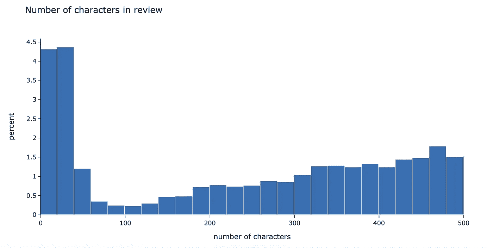

# 使用 BERTopic 的类别话题

> 原文：[`towardsdatascience.com/topics-per-class-using-bertopic-252314f2640?source=collection_archive---------0-----------------------#2023-09-09`](https://towardsdatascience.com/topics-per-class-using-bertopic-252314f2640?source=collection_archive---------0-----------------------#2023-09-09)

## 如何理解按类别分类的文本差异

[](https://miptgirl.medium.com/?source=post_page-----252314f2640--------------------------------)[](https://towardsdatascience.com/?source=post_page-----252314f2640--------------------------------) [玛丽亚·曼苏罗娃](https://miptgirl.medium.com/?source=post_page-----252314f2640--------------------------------)

·

[关注](https://medium.com/m/signin?actionUrl=https%3A%2F%2Fmedium.com%2F_%2Fsubscribe%2Fuser%2F15a29a4fc6ad&operation=register&redirect=https%3A%2F%2Ftowardsdatascience.com%2Ftopics-per-class-using-bertopic-252314f2640&user=Mariya+Mansurova&userId=15a29a4fc6ad&source=post_page-15a29a4fc6ad----252314f2640---------------------post_header-----------) 发表在[Towards Data Science](https://towardsdatascience.com/?source=post_page-----252314f2640--------------------------------) ·15 min 阅读·2023 年 9 月 9 日[](https://medium.com/m/signin?actionUrl=https%3A%2F%2Fmedium.com%2F_%2Fvote%2Ftowards-data-science%2F252314f2640&operation=register&redirect=https%3A%2F%2Ftowardsdatascience.com%2Ftopics-per-class-using-bertopic-252314f2640&user=Mariya+Mansurova&userId=15a29a4fc6ad&source=-----252314f2640---------------------clap_footer-----------)

--

[](https://medium.com/m/signin?actionUrl=https%3A%2F%2Fmedium.com%2F_%2Fbookmark%2Fp%2F252314f2640&operation=register&redirect=https%3A%2F%2Ftowardsdatascience.com%2Ftopics-per-class-using-bertopic-252314f2640&source=-----252314f2640---------------------bookmark_footer-----------)

图片由[Fas Khan](https://unsplash.com/@fasbytes?utm_source=medium&utm_medium=referral)提供，发布在[Unsplash](https://unsplash.com/?utm_source=medium&utm_medium=referral)上

现在，在产品分析工作中，我们面对许多自由格式的文本：

+   用户在 AppStore、Google Play 或其他服务中留下评论；

+   客户联系到我们的客户支持，使用自然语言描述他们的问题；

+   我们自己发起调查以获取更多反馈，并且在大多数情况下，有一些自由格式的问题来获得更好的理解。

我们有成千上万的文本。阅读它们并获取一些洞察可能需要数年时间。幸运的是，有许多数据科学工具可以帮助我们自动化这个过程。今天我想讨论的一个这样的工具就是主题建模。

基本的主题建模可以让你了解文本（例如评论）中的主要主题及其混合情况。但仅凭一个点来做决定是具有挑战性的。例如，14.2%的评论提到了应用中的广告过多。这是好还是坏？我们需要调查一下吗？说实话，我也不太确定。

但如果我们尝试细分客户，我们可能会发现这个比例对于 Android 用户是 34.8%，而对于 iOS 是 3.2%。那么，显然我们需要调查一下我们是否在 Android 上展示了过多的广告，或者为什么 Android 用户对广告的容忍度较低。

因此，我想分享的不仅是如何建立主题模型，还包括如何在不同类别之间比较主题。最终，我们将得到每个主题的有洞察力的图表。


作者绘制的图表

# 数据

现实生活中最常见的自由形式文本案例是某种评论。因此，让我们使用一个包含酒店评论的[数据集](https://archive.ics.uci.edu/dataset/205/opinrank+review+dataset)作为这个示例。

我已经筛选了与伦敦几个酒店连锁相关的评论。

在开始文本分析之前，值得先了解一下我们的数据。总共有 12,890 条关于 7 个不同酒店连锁的评论。


作者绘制的图表

# BERTopic

现在我们有数据，并可以应用我们新的炫酷工具主题建模来获取洞察。如我在开始时提到的，我们将使用主题建模和一个强大且易于使用的`BERTopic`包（[文档](https://maartengr.github.io/BERTopic/index.html)）进行这次文本分析。

你可能会想知道什么是主题建模。它是一种与自然语言处理相关的无监督机器学习技术。它允许你在文本（通常称为文档）中发现隐藏的语义模式，并为其分配“主题”。你无需事先准备主题列表。算法会自动定义它们——通常以最重要的单词（标记）或 N-gram 的形式呈现。

`BERTopic`是一个使用 HuggingFace transformers 进行主题建模的包，[基于类的 TF-IDF](https://creating-a-class-based-tf-idf-with-scikit-learn-caea7b15b858)。`BERTopic`是一个高度灵活的模块化包，你可以根据需要进行调整。


来自 BERTopic 文档的图片（[来源](https://github.com/MaartenGr/BERTopic/tree/master/images)）

如果你想更好地理解其工作原理，我建议你观看这个来自库作者的视频。

# 预处理

> 你可以在[GitHub](https://github.com/miptgirl/miptgirl_medium/tree/main/bertopic_for_hotels)上找到完整的代码。

根据[文档](https://maartengr.github.io/BERTopic/faq.html#should-i-preprocess-the-data)，我们通常不需要预处理数据，除非数据中有大量噪声，例如 HTML 标签或其他不增加文档意义的标记。这是`BERTopic`的一个显著优势，因为许多 NLP 方法需要大量的样板代码来预处理数据。如果你对其样子感兴趣，可以查看这个指南了解使用 LDA 的主题建模。

你可以使用`BERTopic`处理多语言数据，指定`BERTopic(language= "multilingual")`。然而，根据我的经验，模型在将文本翻译成一种语言时表现略好。因此，我将把所有评论翻译成英语。

对于翻译，我们将使用`deep-translator`包（可以从[PyPI](https://pypi.org/project/deep-translator/)安装）。

同样，查看按语言分布可能会很有趣，为此我们可以使用`langdetect`包。

```py
import langdetect
from deep_translator import GoogleTranslator

def get_language(text):
    try:
        return langdetect.detect(text)
    except KeyboardInterrupt as e:
        raise(e)
    except:
        return '<-- ERROR -->'

def get_translation(text):
    try:
        return GoogleTranslator(source='auto', target='en')\
          .translate(str(text))
    except KeyboardInterrupt as e:
        raise(e)
    except:
        return '<-- ERROR -->'

df['language'] = df.review.map(get_language)
df['reviews_transl'] = df.review.map(get_translation)
```

在我们的案例中，95%以上的评论已经是英语。


作者图

为了更好地理解我们的数据，让我们看看评论长度的分布。它显示了许多极短的评论（很可能没有意义的评论）——大约 5%的评论少于 20 个符号。



作者图

我们可以查看最常见的例子，以确保这些评论中没有太多信息。

```py
df.reviews_transl.map(lambda x: x.lower().strip()).value_counts().head(10)

reviews
none                          74
<-- error -->                 37
great hotel                   12
perfect                        8
excellent value for money      7
good value for money           7
very good hotel                6
excellent hotel                6
great location                 6
very nice hotel                5
```

所以我们可以过滤掉所有少于 20 个符号的评论——12,890 条评论中的 556 条（4.3%）。然后，我们只分析具有更多上下文的长评论。这是一个基于示例的任意阈值，你可以尝试几个不同的级别，看看哪些文本被过滤掉了。

值得检查一下这个过滤器是否对某些酒店产生了不成比例的影响。不同类别的短评论比例相当接近。所以，数据看起来还不错。


作者图

# 最简单的主题模型

现在，是时候构建我们的第一个主题模型了。让我们从最基本的模型开始，以了解库的工作原理，然后我们将对其进行改进。

我们可以用几行代码训练一个主题模型，这些代码对任何曾使用过至少一个机器学习包的人来说都很容易理解。

```py
from bertopic import BERTopic
docs = list(df.reviews.values)
topic_model = BERTopic()
topics, probs = topic_model.fit_transform(docs)
```

默认模型返回了 113 个主题。我们可以查看顶部主题。

```py
topic_model.get_topic_info().head(7).set_index('Topic')[
   ['Count', 'Name', 'Representation']]
```


最大的组是`Topic -1`，它对应于异常值。默认情况下，`BERTopic`使用`HDBSCAN`进行聚类，它不会强制所有数据点成为聚类的一部分。在我们的案例中，6,356 条评论是异常值（约 49.3%的所有评论）。这几乎是我们数据的一半，因此我们稍后将处理这一组。

主题表示通常是一组特定于该主题而非其他主题的最重要的词。因此，理解主题的最佳方法是查看主要术语（在 `BERTopic` 中，使用 基于类别的 TF-IDF 分数来对词语进行排序）。

```py
topic_model.visualize_barchart(top_n_topics = 16, n_words = 10)
```


图表由作者提供

`BERTopic` 甚至提供了 [每类主题](https://maartengr.github.io/BERTopic/getting_started/topicsperclass/topicsperclass.html) 的表示方式，这可以解决我们理解课程评论差异的任务。

```py
topics_per_class = topic_model.topics_per_class(docs, 
    classes=filt_df.hotel)

topic_model.visualize_topics_per_class(topics_per_class, 
    top_n_topics=10, normalize_frequency = True)
```


图表由作者提供

如果你在想如何解读这张图表，你并不孤单——我也无法猜测。不过，作者友好地支持了这个包，在 GitHub 上有很多答案。从 [讨论](https://github.com/MaartenGr/BERTopic/issues/446) 中，我了解到当前的归一化方法没有显示每个类别的不同主题的份额。因此，它还没有完全解决我们的初始任务。

然而，我们在不到 10 行代码中完成了第一次迭代。这非常棒，但还有改进的空间。

# 处理异常值

正如我们之前所见，几乎 50% 的数据点被视为异常值。这确实不少，让我们看看我们可以怎么处理。

[文档](https://maartengr.github.io/BERTopic/getting_started/outlier_reduction/outlier_reduction.html) 提供了四种不同的策略来处理异常值：

+   基于主题-文档概率，

+   基于主题分布，

+   基于 c-TF-IFD 表示，

+   基于文档和主题嵌入。

> 你可以尝试不同的策略，看看哪种最适合你的数据。

让我们看一下异常值的例子。尽管这些评论相对较短，但它们包含多个主题。


`BERTopic` 使用聚类来定义主题。这意味着每个文档分配的不超过一个主题。在大多数实际情况下，你的文本中可能会有多个主题的混合。我们可能无法为这些文档分配一个主题，因为它们有多个主题。

幸运的是，有一个解决方案——使用 [主题分布](https://maartengr.github.io/BERTopic/getting_started/distribution/distribution.html)。通过这种方法，每个文档将被分割成词元。然后，我们将形成子句（由滑动窗口和步幅定义），并为每个子句分配一个主题。

让我们尝试这种方法，看看是否能在没有主题的情况下减少异常值的数量。

# 改进主题模型

然而，主题分布是基于拟合的主题模型，因此让我们来改进它。

首先，我们可以使用[CountVectorizer](https://maartengr.github.io/BERTopic/getting_started/vectorizers/vectorizers.html#countvectorizer)。它定义了文档如何被拆分成标记。此外，它还可以帮助我们去除像`to`、`not`或`the`这样的无意义词（在我们的第一个模型中有很多这样的词）。

此外，我们可以改善话题的表示，甚至尝试几种不同的模型。我使用了`KeyBERTInspired`模型（[更多细节](https://maartengr.github.io/BERTopic/getting_started/representation/representation.html#keybertinspired)），但你也可以尝试其他选项（例如，[LLMs](https://maartengr.github.io/BERTopic/getting_started/representation/llm.html)）。

```py
from sklearn.feature_extraction.text import CountVectorizer
from bertopic.representation import KeyBERTInspired, PartOfSpeech, MaximalMarginalRelevance

main_representation_model = KeyBERTInspired()
aspect_representation_model1 = PartOfSpeech("en_core_web_sm")
aspect_representation_model2 = [KeyBERTInspired(top_n_words=30), 
                                MaximalMarginalRelevance(diversity=.5)]

representation_model = {
   "Main": main_representation_model,
   "Aspect1":  aspect_representation_model1,
   "Aspect2":  aspect_representation_model2 
}

vectorizer_model = CountVectorizer(min_df=5, stop_words = 'english')
topic_model = BERTopic(nr_topics = 'auto', 
                      vectorizer_model = vectorizer_model,
                      representation_model = representation_model)

topics, ini_probs = topic_model.fit_transform(docs)
```

我指定了`nr_topics = 'auto'`以减少话题数量。然后，所有相似度超过阈值的话题将被自动合并。通过此功能，我们得到了 99 个话题。

我创建了一个函数来获取最热门的话题及其份额，以便我们可以更容易地进行分析。让我们看看新的话题集合。

```py
def get_topic_stats(topic_model, extra_cols = []):
    topics_info_df = topic_model.get_topic_info().sort_values('Count', ascending = False)
    topics_info_df['Share'] = 100.*topics_info_df['Count']/topics_info_df['Count'].sum()
    topics_info_df['CumulativeShare'] = 100.*topics_info_df['Count'].cumsum()/topics_info_df['Count'].sum()
    return topics_info_df[['Topic', 'Count', 'Share', 'CumulativeShare', 
                           'Name', 'Representation'] + extra_cols]

get_topic_stats(topic_model, ['Aspect1', 'Aspect2']).head(10)\
    .set_index('Topic')
```


图表由作者提供

我们还可以查看话题间距图，以更好地理解我们的聚类，例如，哪些彼此接近。你还可以用它来定义一些父话题和子话题。这叫做[层次化话题建模](https://maartengr.github.io/BERTopic/getting_started/hierarchicaltopics/hierarchicaltopics.html)，你也可以使用其他工具来实现。

```py
topic_model.visualize_topics()
```


图表由作者提供

另一种深入理解话题的有用方法是查看`visualize_documents`图表（[文档](https://maartengr.github.io/BERTopic/getting_started/visualization/visualize_documents.html)）。

我们可以看到话题数量显著减少。此外，话题表示中没有无意义的停用词。

# 减少话题数量

然而，我们仍然在结果中看到类似的话题。我们可以手动调查并合并这些话题。

为此，我们可以绘制相似度矩阵。我指定了`n_clusters`，并对话题进行了聚类，以更好地可视化它们。

```py
topic_model.visualize_heatmap(n_clusters = 20)
```


图表由作者提供

有一些相当接近的话题。让我们计算话题对的距离并查看最热门的话题。

```py
from sklearn.metrics.pairwise import cosine_similarity
distance_matrix = cosine_similarity(np.array(topic_model.topic_embeddings_))
dist_df = pd.DataFrame(distance_matrix, columns=topic_model.topic_labels_.values(), 
                       index=topic_model.topic_labels_.values())

tmp = []
for rec in dist_df.reset_index().to_dict('records'):
    t1 = rec['index']
    for t2 in rec:
        if t2 == 'index': 
            continue
        tmp.append(
            {
                'topic1': t1, 
                'topic2': t2, 
                'distance': rec[t2]
            }
        )

pair_dist_df = pd.DataFrame(tmp)

pair_dist_df = pair_dist_df[(pair_dist_df.topic1.map(
      lambda x: not x.startswith('-1'))) & 
            (pair_dist_df.topic2.map(lambda x: not x.startswith('-1')))]
pair_dist_df = pair_dist_df[pair_dist_df.topic1 < pair_dist_df.topic2]
pair_dist_df.sort_values('distance', ascending = False).head(20)
```

我从[GitHub 讨论](https://github.com/MaartenGr/BERTopic/issues/292)中找到了获取距离矩阵的指导。

我们现在可以看到按余弦相似度排列的最热门话题对。我们可以合并那些意义相近的话题。


```py
topic_model.merge_topics(docs, [[26, 74], [43, 68, 62], [16, 50, 91]])
df['merged_topic'] = topic_model.topics_
```

***注意：*** 合并后，所有话题的 ID 和表示将被重新计算，因此如果你使用它们，值得更新。

现在，我们已改进了初始模型，准备继续前进。

> 在实际任务中，值得花更多时间合并话题并尝试不同的表示和聚类方法，以获得最佳结果。
> 
> 另一个潜在的想法是将评论拆分成单独的句子，因为评论通常较长。

# 主题分布

让我们计算主题和词汇的分布。我使用了窗口大小为 4（作者建议使用 4–8 个词汇）和步长为 1。

```py
topic_distr, topic_token_distr = topic_model.approximate_distribution(
      docs, window = 4, calculate_tokens=True)
```

例如，这条评论将被拆分为子句（或四个词汇的集合），并将为每个子句分配最接近的现有主题。然后，这些主题将被聚合，以计算整个句子的概率。您可以在[文档](https://maartengr.github.io/BERTopic/getting_started/distribution/distribution.html)中找到更多详细信息。


示例显示了如何使用基本的 CountVectorizer 进行拆分，窗口大小为 4，步长为 1

使用这些数据，我们可以获得每条评论的不同主题的概率。

```py
topic_model.visualize_distribution(topic_distr[doc_id], min_probability=0.05)
```


作者图表

我们甚至可以看到每个主题的术语分布，并理解为什么会得到这个结果。对于我们的句子，`best very beautiful`是`Topic 74`的主要术语，而`location close to`定义了一系列与位置相关的主题。

```py
vis_df = topic_model.visualize_approximate_distribution(docs[doc_id], 
  topic_token_distr[doc_id])
vis_df
```


作者图表

这个例子还显示了我们可能需要花更多时间合并主题，因为仍然存在一些相似的主题。

现在，我们拥有每个主题和评论的概率。下一步是选择一个阈值，以过滤掉概率过低的不相关主题。

我们可以像往常一样使用数据来处理它。让我们计算不同阈值水平下每条评论的选定主题分布。

```py
tmp_dfs = []

# iterating through different threshold levels
for thr in tqdm.tqdm(np.arange(0, 0.35, 0.001)):
    # calculating number of topics with probability > threshold for each document
    tmp_df = pd.DataFrame(list(map(lambda x: len(list(filter(lambda y: y >= thr, x))), topic_distr))).rename(
        columns = {0: 'num_topics'}
    )
    tmp_df['num_docs'] = 1

    tmp_df['num_topics_group'] = tmp_df['num_topics']\
        .map(lambda x: str(x) if x < 5 else '5+')

    # aggregating stats
    tmp_df_aggr = tmp_df.groupby('num_topics_group', as_index = False).num_docs.sum()
    tmp_df_aggr['threshold'] = thr

    tmp_dfs.append(tmp_df_aggr)

num_topics_stats_df = pd.concat(tmp_dfs).pivot(index = 'threshold', 
                              values = 'num_docs',
                              columns = 'num_topics_group').fillna(0)

num_topics_stats_df = num_topics_stats_df.apply(lambda x: 100.*x/num_topics_stats_df.sum(axis = 1))

# visualisation
colormap = px.colors.sequential.YlGnBu
px.area(num_topics_stats_df, 
       title = 'Distribution of number of topics',
       labels = {'num_topics_group': 'number of topics',
                'value': 'share of reviews, %'},
       color_discrete_map = {
          '0': colormap[0],
          '1': colormap[3],
          '2': colormap[4],
          '3': colormap[5],
          '4': colormap[6],
          '5+': colormap[7]
      })
```


作者图表

`threshold = 0.05` 看起来是一个不错的候选值，因为在这个水平下，没有任何主题的评论比例仍然足够低（少于 6%），而拥有 4 个以上主题的评论比例也不高。

这种方法帮助我们将异常值的比例从 53.4%减少到了 5.8%。因此，分配多个主题可能是处理异常值的有效方法。

让我们使用这个阈值计算每个文档的主题。

```py
threshold = 0.13

# define topic with probability > 0.13 for each document
df['multiple_topics'] = list(map(
    lambda doc_topic_distr: list(map(
        lambda y: y[0], filter(lambda x: x[1] >= threshold, 
                               (enumerate(doc_topic_distr)))
    )), topic_distr
))

# creating a dataset with docid, topic
tmp_data = []

for rec in df.to_dict('records'):
    if len(rec['multiple_topics']) != 0:
        mult_topics = rec['multiple_topics']
    else:
        mult_topics = [-1]

    for topic in mult_topics: 
        tmp_data.append(
            {
                'topic': topic,
                'id': rec['id'],
                'course_id': rec['course_id'],
                'reviews_transl': rec['reviews_transl']
            }
        )

mult_topics_df = pd.DataFrame(tmp_data)
```

# 按酒店比较分布

现在，我们有多个主题映射到每条评论，我们可以比较不同酒店连锁的主题组合。

让我们找出某个主题在特定酒店中占比过高或过低的情况。为此，我们将计算每对主题+酒店相关的评论占该酒店总评论数的比例，并与其他酒店进行比较。

```py
tmp_data = []
for hotel in mult_topics_df.hotel.unique():
    for topic in mult_topics_df.topic.unique():
        tmp_data.append({
            'hotel': hotel,
            'topic_id': topic,
            'total_hotel_reviews': mult_topics_df[mult_topics_df.hotel == hotel].id.nunique(),
            'topic_hotel_reviews': mult_topics_df[(mult_topics_df.hotel == hotel) 
                                                  & (mult_topics_df.topic == topic)].id.nunique(),
            'other_hotels_reviews': mult_topics_df[mult_topics_df.hotel != hotel].id.nunique(),
            'topic_other_hotels_reviews': mult_topics_df[(mult_topics_df.hotel != hotel) 
                                                  & (mult_topics_df.topic == topic)].id.nunique()
        })

mult_topics_stats_df = pd.DataFrame(tmp_data)
mult_topics_stats_df['topic_hotel_share'] = 100*mult_topics_stats_df.topic_hotel_reviews/mult_topics_stats_df.total_hotel_reviews
mult_topics_stats_df['topic_other_hotels_share'] = 100*mult_topics_stats_df.topic_other_hotels_reviews/mult_topics_stats_df.other_hotels_reviews
```

然而，并不是所有的差异对我们来说都是显著的。如果主题分布的差异值得关注，则我们可以这样说。

+   **统计显著性** — 差异不仅仅是偶然的，

+   **实际显著性** — 差异大于 X%点（我使用了 1%）。

```py
from statsmodels.stats.proportion import proportions_ztest

mult_topics_stats_df['difference_pval'] = list(map(
    lambda x1, x2, n1, n2: proportions_ztest(
        count = [x1, x2],
        nobs = [n1, n2],
        alternative = 'two-sided'
    )[1],
    mult_topics_stats_df.topic_other_hotels_reviews,
    mult_topics_stats_df.topic_hotel_reviews,
    mult_topics_stats_df.other_hotels_reviews,
    mult_topics_stats_df.total_hotel_reviews
))

mult_topics_stats_df['sign_difference'] = mult_topics_stats_df.difference_pval.map(
    lambda x: 1 if x <= 0.05 else 0
)

def get_significance(d, sign):
    sign_percent = 1
    if sign == 0:
        return 'no diff'
    if (d >= -sign_percent) and (d <= sign_percent):
        return 'no diff'
    if d < -sign_percent:
        return 'lower'
    if d > sign_percent:
        return 'higher'

mult_topics_stats_df['diff_significance_total'] = list(map(
    get_significance,
    mult_topics_stats_df.topic_hotel_share - mult_topics_stats_df.topic_other_hotels_share,
    mult_topics_stats_df.sign_difference
))
```

我们已经掌握了所有主题和酒店的统计数据，最后一步是创建一个按类别比较主题份额的可视化图表。

```py
import plotly

# define color depending on difference significance
def get_color_sign(rel):
    if rel == 'no diff':
        return plotly.colors.qualitative.Set2[7]
    if rel == 'lower':
        return plotly.colors.qualitative.Set2[1]
    if rel == 'higher':
        return plotly.colors.qualitative.Set2[0]

# return topic representation in a suitable for graph title format
def get_topic_representation_title(topic_model, topic):
    data = topic_model.get_topic(topic)
    data = list(map(lambda x: x[0], data))

    return ', '.join(data[:5]) + ', <br>         ' + ', '.join(data[5:])

def get_graphs_for_topic(t):
    topic_stats_df = mult_topics_stats_df[mult_topics_stats_df.topic_id == t]\
        .sort_values('total_hotel_reviews', ascending = False).set_index('hotel')

    colors = list(map(
        get_color_sign,
        topic_stats_df.diff_significance_total
    ))

    fig = px.bar(topic_stats_df.reset_index(), x = 'hotel', y = 'topic_hotel_share',
                title = 'Topic: %s' % get_topic_representation_title(topic_model, 
                                                            topic_stats_df.topic_id.min()),
                text_auto = '.1f',
                labels = {'topic_hotel_share': 'share of reviews, %'},
                hover_data=['topic_id'])
    fig.update_layout(showlegend = False)
    fig.update_traces(marker_color=colors, marker_line_color=colors,
                  marker_line_width=1.5, opacity=0.9)

    topic_total_share = 100.*((topic_stats_df.topic_hotel_reviews + topic_stats_df.topic_other_hotels_reviews)\
        /(topic_stats_df.total_hotel_reviews + topic_stats_df.other_hotels_reviews)).min()
    print(topic_total_share)

    fig.add_shape(type="line",
        xref="paper",
        x0=0, y0=topic_total_share,
        x1=1, y1=topic_total_share,
        line=dict(
            color=colormap[8],
            width=3, dash="dot"
        )
    )

    fig.show()
```

然后，我们可以计算出最热门的主题列表，并为其制作图表。

```py
top_mult_topics_df = mult_topics_df.groupby('topic', as_index = False).id.nunique()
top_mult_topics_df['share'] = 100.*top_mult_topics_df.id/top_mult_topics_df.id.sum()
top_mult_topics_df['topic_repr'] = top_mult_topics_df.topic.map(
    lambda x: get_topic_representation(topic_model, x)
)

for t in top_mult_topics_df.head(32).topic.values:
    get_graphs_for_topic(t)
```

这里有几个结果图表的例子。让我们尝试根据这些数据得出一些结论。

我们可以看到，Holiday Inn、Travelodge 和 Park Inn 的价格和性价比优于 Hilton 或 Park Plaza。


作者绘制的图表

另一个见解是，在 Travelodge 噪音可能是一个问题。


作者绘制的图表

对我来说，解读这个结果有点挑战。我不确定这个主题是什么。


作者绘制的图表

对于这种情况，最佳实践是查看一些示例。

+   *我们住在东塔，其中* ***电梯正在翻修中****，只有一个在工作，但有指示牌指向可以使用的服务电梯。*

+   *然而，地毯和家具可能需要* ***翻新****。

+   *它建在 Queensway 车站上方。请注意，这个地铁站将在* ***翻新*** *一年！所以你可能要考虑噪音问题。*

所以，这个主题是关于酒店住宿期间出现的临时问题或家具状况不佳的情况。

> 你可以在[GitHub](https://github.com/miptgirl/miptgirl_medium/tree/main/bertopic_for_hotels)上找到完整的代码。

# 总结

今天，我们完成了一个端到端的主题建模分析：

+   使用 BERTopic 库构建一个基本的主题模型。

+   然后，我们处理了离群值，因此只有 5.8%的评论没有分配主题。

+   通过自动和手动方法减少了主题数量，以获得一个简明的列表。

+   学会了如何为每个文档分配多个主题，因为在大多数情况下，你的文本会包含多种主题。

最终，我们能够比较不同课程的评论，创建激励性的图表并获得一些见解。

> 非常感谢你阅读这篇文章。希望它对你有所启发。如果你有任何后续问题或评论，请在评论区留下。

# 数据集

*Ganesan, Kavita 和 Zhai, ChengXiang. (2011). OpinRank 评论数据集。*

UCI 机器学习资源库。[*https://doi.org/10.24432/C5QW4W*](https://doi.org/10.24432/C5QW4W.)

# 如果你想深入了解 BERTopic

+   文章《使用 BERTopic 进行交互式主题建模》由 Maarten Grootendorst（*BERTopic* *作者*）撰写

+   文章 “使用 BERT 进行主题建模” 由 Maarten Grootendorst 撰写

+   论文 [“BERTopic：基于类别的 TF-IDF 程序的神经主题建模”](https://arxiv.org/abs/2203.05794) 由 Maarten Grootendorst 撰写
