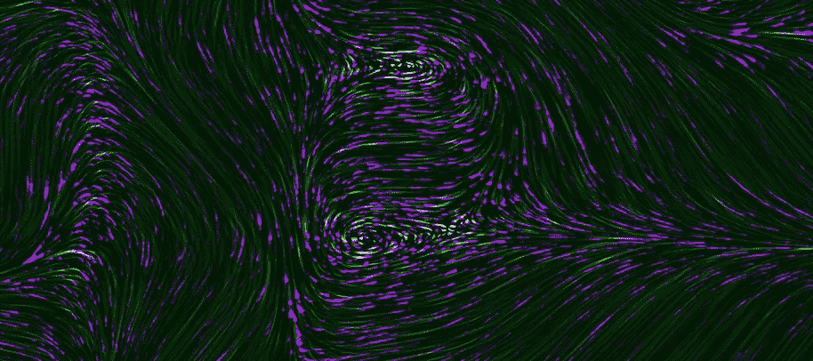
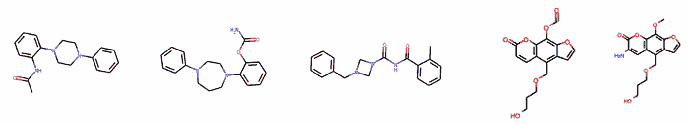
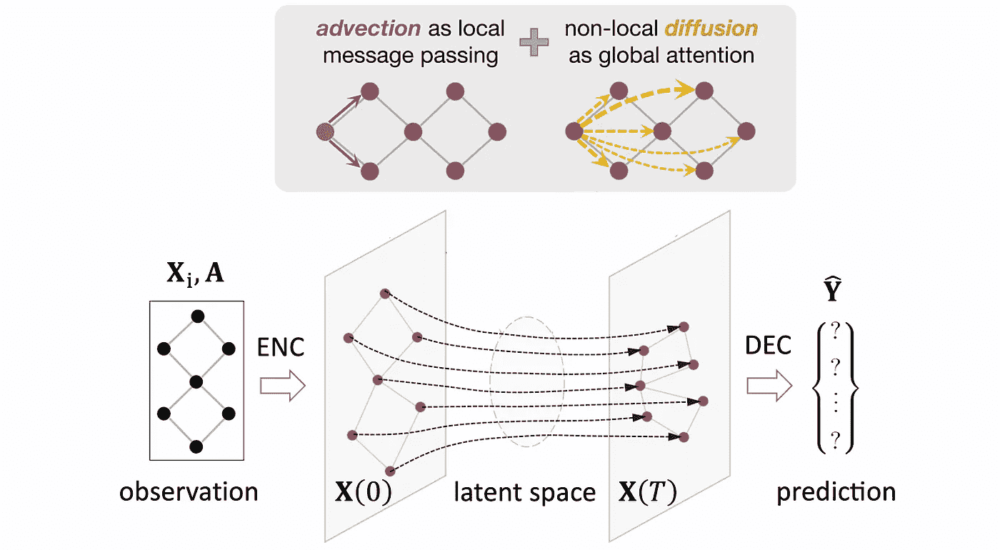
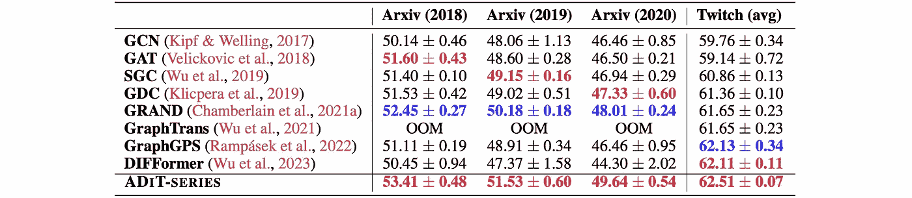
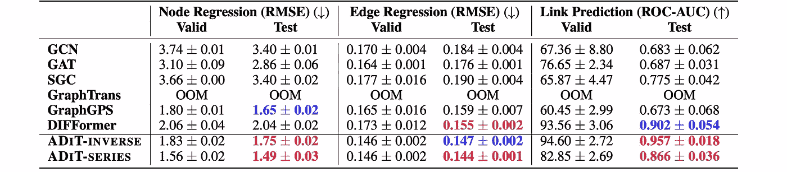
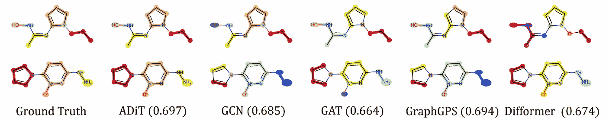

# 基于对流扩散变换器的拓扑泛化

> 原文：[`towardsdatascience.com/topological-generalisation-with-advective-diffusion-transformers-70f263a5fec7`](https://towardsdatascience.com/topological-generalisation-with-advective-diffusion-transformers-70f263a5fec7)

## GNNs 中的拓扑泛化

## 在图神经网络（GNNs）研究中，一个关键的未解问题是它们的泛化能力，尤其是在图的拓扑发生变化时。在这篇文章中，我们从图扩散方程的角度来研究这个问题，这些方程与 GNNs 密切相关，过去曾作为分析 GNN 动态、表达能力和证明架构选择的框架。我们描述了一种基于对流扩散的新架构，该架构结合了消息传递神经网络（MPNNs）和 Transformers 的计算结构，并显示出卓越的拓扑泛化能力。

 [Michael Bronstein](https://michael-bronstein.medium.com/?source=post_page-----70f263a5fec7--------------------------------)

·发表于 [Towards Data Science](https://towardsdatascience.com/?source=post_page-----70f263a5fec7--------------------------------) ·9 分钟阅读·2023 年 10 月 19 日

--

图片来源：Unsplash

*这篇文章与* [*Qitian Wu*](https://qitianwu.github.io/) *和* [*Chenxiao Yang*](https://chr26195.github.io/) *共同作者，并基于 Q. Wu 等人的论文* [*Advective Diffusion Transformer for Topological Generalization in Graph Learning*](https://arxiv.org/abs/2310.06417) *(2023) arXiv:2310.06417。*

图神经网络（GNNs）在过去十年中作为一种流行的图结构数据机器学习架构出现，应用范围广泛，从社交网络和 [生命科学](https://arxiv.org/abs/2307.08423) 到 [药物](https://medium.com/towards-data-science/geometric-ml-becomes-real-in-fundamental-sciences-3b0d109883b5) 和 [食品设计](https://medium.com/towards-data-science/hyperfoods-9582e5d9a8e4)。

关于 GNN 的两个关键理论问题是它们的 *表达能力* 和 *泛化能力*。前一个问题在文献中已有广泛探讨，通过借助 [图同构测试的变体](https://medium.com/towards-data-science/expressive-power-of-graph-neural-networks-and-the-weisefeiler-lehman-test-b883db3c7c49) [1]，以及最近将 GNN 形式化为 [离散化扩散型方程](https://medium.com/towards-data-science/neural-sheaf-diffusion-for-deep-learning-on-graphs-bfa200e6afa6) [2]。然而，尽管有多个最近的研究方法 [3–4]，第二个问题仍然大部分悬而未决。

从经验上看，GNNs 在训练数据和测试数据来源于不同分布（即所谓的*“分布转移”*）时，通常表现较差，尤其是当图的拓扑发生变化（*“拓扑转移”*）时。这在化学等应用中尤为重要，其中 ML 模型通常在有限的分子图集上训练，并期望学习一些规则，这些规则能够推广到结构不同的未见过的分子。

图基分子建模中的拓扑转变示例：左侧的三个分子具有较高的药物相似性（QED），而右侧的分子则没有。

# **神经图扩散**

在最近牛津大学与上海交通大学的合作中 [8]，我们利用神经扩散 PDE 视角研究了 GNN 在拓扑转变下的泛化能力。[图神经扩散](https://medium.com/towards-data-science/graph-neural-networks-as-neural-diffusion-pdes-8571b8c0c774) 方法 [9] 用连续时间微分方程替换离散 GNN 层，形式为

**Ẋ**(*t*) = div(**S**(t)∇**X**(t)),

被称为*图扩散方程*。它以**X**(0) = ENC(**X**ᵢ) 初始化，并运行一段时间 *t*≤*T*，以产生输出 **X**ₒ = DEC(**X**(*T*)) [10]。这里的 **X**(*t*) 是时间 *t* 时的 *n*×*d* 维节点特征矩阵，**S** 是矩阵值的扩散函数 [11]，而 ENC/DEC 是特征编码器/解码器对。

当 **S** 仅依赖于图的 *结构*（通过其邻接矩阵 **A**，即 **S** = **S**(**A**））时，图扩散方程是 *线性的* 并称为 *均匀的*（在于扩散特性在整个域上“相同”）。当 **S** 还依赖于 *特征*（即 **S** = **S**(**X**(*t*),**A**），因此是时间依赖的），方程则是 *非线性的*（*非均匀的*）。

在图学习环境中，**S** 被实现为一个参数函数，其参数通过基于下游任务的反向传播学习得到。许多标准的消息传递图神经网络（MPNNs）可以通过适当选择扩散性和时间离散化方案[12]作为图扩散方程的特殊设置进行恢复。线性设置对应于*卷积型* GNN，而非线性设置对应于*注意力型* GNN。

神经图扩散模型的**泛化能力**与解**X**(*T*) = *f*(**X**(0),**A**)对邻接矩阵**Ã** = **A** + δ**A**的扰动的敏感性有关。如果* f *(**X**(0),**A**) ≈ * f *(**X**(0),**Ã**) 对于一个小的 δ**A**，模型预期能表现出良好的拓扑泛化。然而，对于图扩散来说，这种情况并不成立：我们展示了[13]，在线性和非线性情况下，**X**(*T*)的变化可能非常大，达到 𝒪(exp(‖δ**A**‖*T*))。

**图变换器**尝试通过允许*非局部扩散*来克服这个问题，其中信息交换可以发生在任意一对节点之间，而不仅仅是那些通过边相连的节点之间。这有效地将输入图与计算图解耦（计算图现在是全连接的，并通过注意力机制进行学习），使模型对输入图不敏感。我们证明了这样一个非局部扩散模型在某些数据生成模型[15]下具备拓扑泛化能力[14]，额外假设是节点标签和图拓扑在统计上是独立的。

然而，这一独立性假设通常与现实相去甚远，因为节点标签通常与图结构相关。这意味着仅依赖于非局部扩散，忽视任何观察到的结构信息，对于拓扑泛化是不够的。

# **平流图扩散**

我们考虑包含附加平流项的更一般类型的扩散方程，

**Ẋ**(*t*) = div(**S**(*t*)∇**X**(*t*)) + *β*div(**V**(*t*)**X**(*t*))。

这种类型的方程被称为*平流扩散*，在实际物理系统中，例如盐水溶液中出现。第一个*扩散项*由浓度梯度主导，描述了由于盐化学浓度的空间差异而导致的盐度演变（**S**表示水中的分子扩散率）。第二个*平流项*与水的运动有关（**V**特征化流动方向）。

**平滑扩散 Transformer**。在我们的设置中，由特征梯度引导的扩散过程作为*内部*驱动力，其中扩散性在各种环境中保持不变。这对应于节点之间的环境不变潜在交互，这些交互由基础数据流形决定，导致在完全图上的所有配对信息流。在架构上，我们将扩散项实现为具有预计算全局注意力的*Transformer*，其中考虑了所有节点对的输入特征，**S** = **S**(**X**(0),**A**)。

由方向性运动（我们使用**V**=**A**）驱动的对流过程是一种*外部*力量，其中速度依赖于上下文。这类似于环境敏感的图拓扑，对特定环境中的预测具有信息量。在架构上，对流项实现为在输入图上的消息传递。

*平滑扩散 Transformer 架构用于图数据的可泛化学习。模型包括三个模块：节点编码器（ENC），扩散模块和节点解码器（DEC）。扩散模块通过图平滑扩散方程实现，其中扩散项被实例化为全局注意力（类似 Transformer），而对流项则作为局部消息传递。*

我们将这种结合了 MPNN 和图 Transformer 的架构称为*平滑扩散 Transformer* *(ADiT)*。它仅需要在特征编码器和解码器神经网络（ENC 和 DEC）中学习的权重以及用于预计算扩散性的注意力，并且参数效率极高。常量扩散性的使用还提供了平滑扩散方程的闭式解，**X**(*t*) = exp(−(**I**−**S**−*β***A**)*t*)**X**(0)，该解可以使用具有线性复杂度的 Padé-Chebyshev 有理级数[16]进行数值近似。

**平滑扩散的拓扑泛化**。我们展示了[17]，在图邻接扰动的结果中，**X**(*T*)的变化从指数级降到了多项式级，𝒪(Poly(‖δ**A**‖*T*))。这表明，结合观测结构信息的平滑扩散模型能够控制拓扑变化对节点表示的影响到任意的速率。此外，我们展示了在我们的图生成模型[15]下，这种架构具有可证明的拓扑泛化能力。

# **实验验证**

我们对平滑扩散 Transformer 进行了广泛的实验验证，涵盖了从分子到社交网络的各种节点、边、图级任务。评估的主要重点是与最先进的 MPNN 和图 Transformer 在具有挑战性的训练/测试分割上的比较，以测试其泛化能力。

节点分类数据集上的结果：引用网络 Arxiv 和社交网络 Twitch。训练/验证/测试数据根据 Arxiv 和 Twitch 上的论文出版年份和用户地理域进行拆分，这引入了分布变化。OOM 表示内存不足错误。

动态图数据集 DPPIN [19] 涉及生物蛋白质交互，我们考虑了三个不同的任务：节点回归、边回归和链接预测。性能通过 RMSE 和 ROC-AUC 分别衡量。我们考虑数据集级的数据拆分用于训练/验证/测试，其中不同数据集来自不同的蛋白质识别方法，并具有不同的拓扑模式。

生成分子粗粒度映射操作符，其中任务是找到如何在分子中对原子进行分组的表示，这可以建模为图分割问题 [20]。这归结为预测子图分区的边（由颜色指示）以类似专家注释（真实值）。每种方法的评分为测试准确度的平均值。

总体而言，我们的实验结果展示了我们模型在图数据的挑战性泛化任务中的良好表现和广泛适用性。更广泛地说，我们的工作指出了利用既有物理偏微分方程（PDEs）来理解图神经网络（GNNs）的泛化能力，并设计新颖的可泛化架构的可能性。

[1] K. Xu 等人，《图神经网络的能力有多强？》（2019） *ICLR*，以及 C. Morris 等人，《Weisfeiler 和 Leman 走向神经网络：高阶图神经网络》（2019） *AAAI* 确立了消息传递与 B. Weisfeiler 和 A. Lehman 经典论文中描述的图同构测试之间的等价性，《图的规范形式简化及其所涉及的代数》（1968） *Nauchno-Technicheskaya Informatsia* 2(9):12–16。请参阅我们的 [之前的博客文章](https://medium.com/towards-data-science/expressive-power-of-graph-neural-networks-and-the-weisefeiler-lehman-test-b883db3c7c49)。

[2] C. Bodnar 等人，《神经层扩散：GNN 中的异质性和过平滑的拓扑视角》（2022） *NeurIPS*（另见 [附带的博客文章](https://medium.com/towards-data-science/neural-sheaf-diffusion-for-deep-learning-on-graphs-bfa200e6afa6)）展示了图上构造的细胞层扩散方程分离特定数量节点类别的能力如何取决于层的选择。F. Di Giovanni 等人，《通过能量理解图上的卷积》（2023） *TMLR*（另见 [附带的博客文章](https://medium.com/towards-data-science/graph-neural-networks-as-gradient-flows-4dae41fb2e8a) 和 [讲座](https://www.youtube.com/watch?v=sgTTtmwOMgE)）描述了具有通道混合的扩散（离散化为卷积型 GNN）在异质图上的适用条件。

[3] V. Garg 等人，《图神经网络的泛化和表示极限》（2020） *ICML*。

[4] H. Tang 和 Y. Liu，《理解图神经网络的泛化》（2023） *ICML*。

[5] P. W. Koh 等人，《WILDS：现实环境中分布变化的基准》（2021） *ICML*。

[6] W. Hu 等人，《OGB-LSC：图上机器学习的大规模挑战》（2021） *arXiv*:2103.09430。

[7] G. Bazhenov 和 D. Kuznedelev，《在结构分布变化下评估图模型的鲁棒性和不确定性》（2023） *arXiv*:2302.13875。

[8] Q. Wu 等人，《用于图学习的自流扩散变换器（Advective Diffusion Transformer）以实现拓扑泛化》（2023） *arXiv*:2310.06417。

[9] 存在多种基于扩散的 GNN 模型。例如，B. Chamberlain 等人，《 GRAND: 图神经扩散》（2021） *ICML*，[附带的博客文章](https://medium.com/towards-data-science/graph-neural-networks-as-neural-diffusion-pdes-8571b8c0c774)、[讲座](https://youtu.be/9SMbH18nMUg?si=3aNK6gFEjTcDcCHN)，以及我们关于 [物理启发的 GNN](https://medium.com/towards-data-science/graph-neural-networks-beyond-weisfeiler-lehman-and-vanilla-message-passing-bc8605fa59a) 的更一般性博客文章。

[10] 可以施加额外的边界条件，例如，来模拟缺失的特征，请参见 E. Rossi 等人，《缺失节点特征的图学习中特征传播的非理性有效性》（2022） *LoG*（另见 [附带的博客文章](https://medium.com/towards-data-science/learning-on-graphs-with-missing-features-dd34be61b06) 和 [讲座](https://youtu.be/xe5A-xQTBdM?si=ftcUtxZHSHv0wXwq)）。

[11] 图 *G* 假定有 *n* 个节点和 *m* 条边，**W** 是 *n*×*n* 的邻接矩阵，其中 *wᵤᵥ*=1 如果 *u*~*v*，否则为零。梯度是一个操作符，将每条边 *u*~*v* 分配给各自节点特征向量的差异，（∇**X**）*ᵤᵥ*=**x***ᵥ*−x*ᵤ*，节点 *u* 的散度将来自该节点的边的特征相加，（div(**X**））*ᵤ*= ∑*ᵥ* *wᵤᵥ* **x***ᵤᵥ*。给定 *d* 维的节点特征排列成 *n*×*d* 矩阵 **X**，梯度 ∇**X** 可以表示为 *m*×*d* 的矩阵。类似地，给定大小为 *m*×*d* 的边特征矩阵 **Y**，散度 div(**Y**) 是一个 *n*×*d* 的矩阵。这两个操作符在适当的内积下是伴随的，⟨∇**X**，**Y**⟩=⟨**X**，div(**Y**)⟩。

[12] 例如，**S** 可以定义为对连接节点特征的注意力，如 P. Veličković 等人所述，图注意力网络（2018 年）*ICLR*。

[13] 我们论文中的命题 1 和 2 [8]。

[14] 我们论文中的命题 3 [8]。

[15] 我们论文中的数据生成假设 [8] 是第 3.1 节中描述的图谱（连续图）模型的扩展。一般情况下，不假设节点标签与图拓扑之间的独立性。

[16] 见 E. Gallopoulos 和 Y. Saad，利用 Krylov 近似方法有效解决抛物方程（1992 年）*SIAM J. Scientific and Statistical Computing* 13(5):1236–1264。该方法以前在几何处理方面取得了成功，例如，G. Patané，3D 形状上的拉普拉斯谱距离和核（2014 年）*Pattern Recognition Letters* 47:102–110。

[17] 我们论文中的定理 1 [8]。

[18] 我们论文中的定理 2 [8]。

[19] D. Fu 和 J. He，DPPIN: 动态蛋白质-蛋白质相互作用网络数据的生物库（2022 年）*Big Data*。

[20] Z. Li 等，基于图神经网络的粗粒度映射预测（2020 年）*Chemical Science* 11(35):9524–9531。

*我们感谢 Yonatan Gideoni 和 Fan Nie 对这篇文章的校对。有关图上的深度学习的更多文章，请参见 Michael 的* [*其他文章*](https://towardsdatascience.com/graph-deep-learning/home) *在 Towards Data Science 上，* [*订阅*](https://michael-bronstein.medium.com/subscribe) *他的文章以及* [*YouTube 频道*](https://www.youtube.com/c/MichaelBronsteinGDL)*，获取* [*Medium 会员资格*](https://michael-bronstein.medium.com/membership)*，或者关注* [*Michael*](https://twitter.com/mmbronstein)，[*Qitian*](https://twitter.com/qitianwu_) *和* [*Chenxiao*](https://twitter.com/Chenxia58917359) *在 Twitter 上。*
