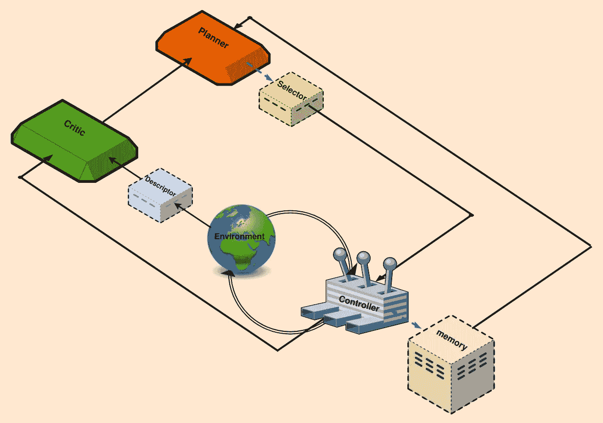
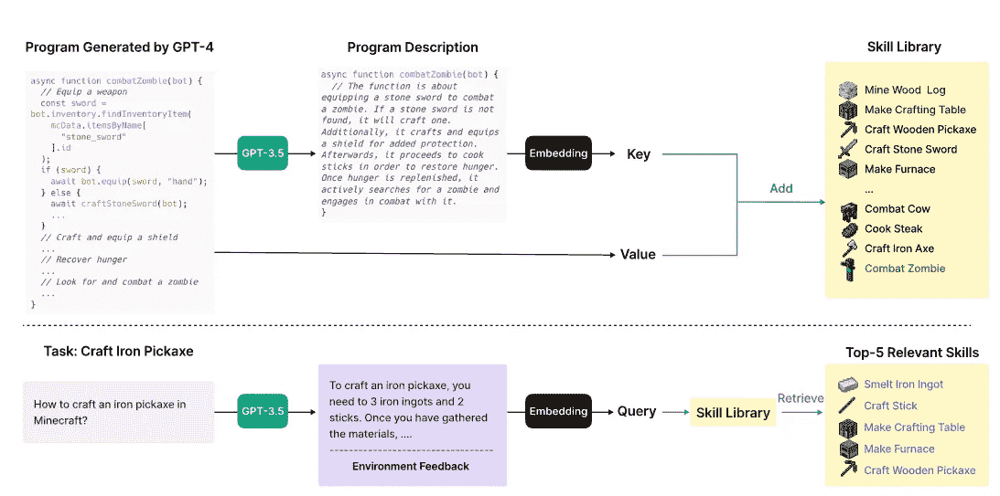
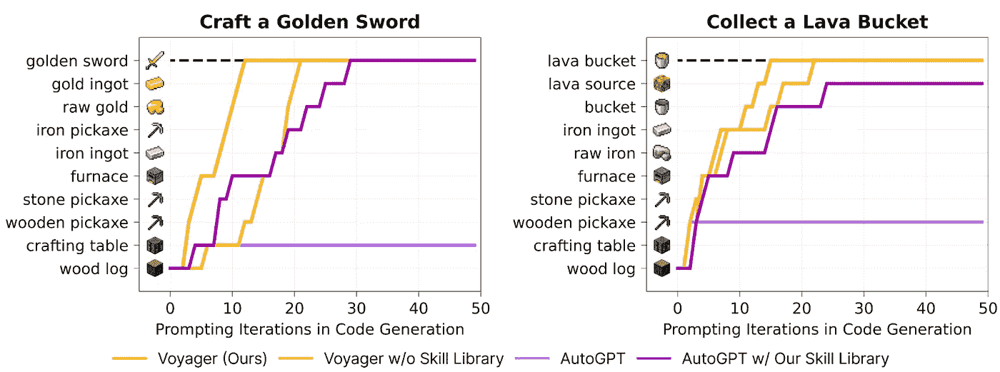
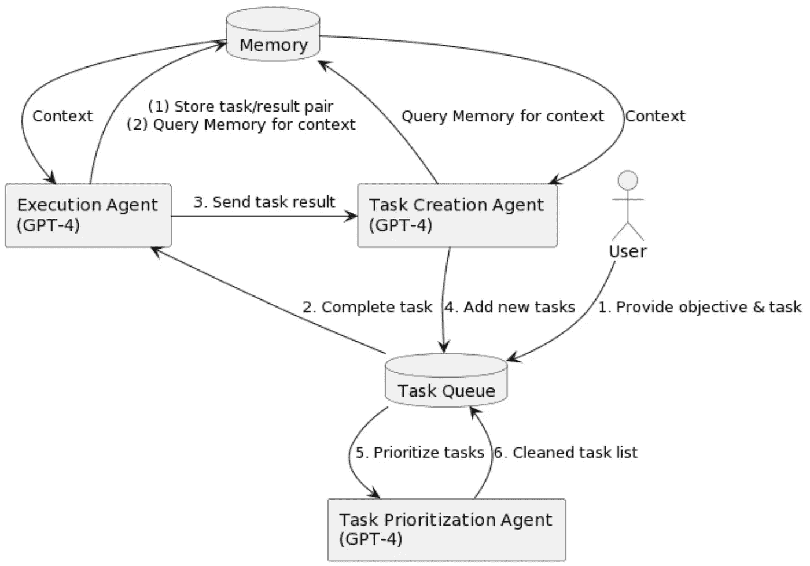

# 向 AGI 迈进：LLMs 和基础模型在终身学习革命中的角色

> 原文：[`towardsdatascience.com/towards-agi-llms-and-foundational-models-roles-in-the-lifelong-learning-revolution-f8e56c17fa66?source=collection_archive---------9-----------------------#2023-12-15`](https://towardsdatascience.com/towards-agi-llms-and-foundational-models-roles-in-the-lifelong-learning-revolution-f8e56c17fa66?source=collection_archive---------9-----------------------#2023-12-15)

## 融合了在通用学习领域的创新进展，向**人工通用智能（AGI）**迈进，包括[VOYAGER](https://arxiv.org/pdf/2305.16291.pdf)、[DEPS](https://arxiv.org/pdf/2302.01560.pdf)和[AutoGPT](https://github.com/Significant-Gravitas/AutoGPT)。

 [Elahe Aghapour & Salar Rahili](https://medium.com/@InfiniteLearningLoop?source=post_page-----f8e56c17fa66--------------------------------)

·

[关注](https://medium.com/m/signin?actionUrl=https%3A%2F%2Fmedium.com%2F_%2Fsubscribe%2Fuser%2F8fbc3ea76035&operation=register&redirect=https%3A%2F%2Ftowardsdatascience.com%2Ftowards-agi-llms-and-foundational-models-roles-in-the-lifelong-learning-revolution-f8e56c17fa66&user=Elahe+Aghapour+%26+Salar+Rahili&userId=8fbc3ea76035&source=post_page-8fbc3ea76035----f8e56c17fa66---------------------post_header-----------) 发表在 [Towards Data Science](https://towardsdatascience.com/?source=post_page-----f8e56c17fa66--------------------------------) ·11 分钟阅读·2023 年 12 月 15 日

--

**作者：** [Elahe Aghapour](https://medium.com/u/75214fb27311?source=post_page-----f8e56c17fa66--------------------------------)**，** [Salar Rahili](https://medium.com/u/6dff1eb2cc9f?source=post_page-----f8e56c17fa66--------------------------------)

## **引言：**

在过去十年，尤其是在深度学习取得成功之后，围绕构建通用人工智能（AGI）的可能性展开了持续的讨论。AGI 的终极目标是创建一个能够执行任何人类能够完成的任务的智能体。这样一个智能体所需的核心能力是能够持续学习新技能，并利用已学会的技能更快地学习更复杂的技能。这些技能必须被拆分成子任务，智能体与环境进行互动，从失败中学习直到成功。而在学习新技能后，智能体应将该技能整合到现有的技能库中，以备将来使用。大型语言模型（LLM）已展示出对世界和如何完成不同任务的良好理解。近年来，出现了一系列有趣的文章，目标是利用 LLM 作为持续学习的核心决策者。这些研究大多选择了类似的测试环境，如 Crafter 或 Minecraft，因为它们可以模拟 AGI 的终极目标——生存与繁荣。

为了探索该领域的最新进展，我们首先概述了各种构建模块的协同功能，这些模块促进了学习过程。随后，我们深入探讨每个组件的具体细节，比较它们在不同研究文章中的实现和功能。

## **概述：**

图 1：文献中确定的关键构建模块被编制成一个全面的框图。用虚线勾勒的块并不是每篇文章中都包含的（*作者提供的图像*）。

为了开发迭代和持续的学习/任务完成过程，许多推荐的框架采用了一个可识别的过程。那些有反馈控制或强化学习背景的人会注意到类似的结构（见图 1）；然而，还有显著的增加项，能够减少人工输入并增强过程自动化。

作为第一步，人类将一个广义定义的任务分配给代理，呼应终身学习的主要目标。这个任务通常以一个提示的形式出现，概述主要目标，例如，“探索环境，完成尽可能多的多样化任务”。规划器块根据这个广泛定义的目标，将其分解成一系列可执行、易于理解的任务。这种分解需要对代理操作的环境有一定的理解。由于大规模语言模型（LLMs）已在大量数据上训练，它们可能是最适合担任规划者的候选者。此外，任何补充的、明确的或手动的上下文都可以提升它们的表现。

在选择器块中，规划器提供了一组衍生的子任务。选择器在主要目标和批评者的洞见指导下，确定最适合的下一个子任务，这不仅能生成最佳结果，还能满足先决条件。控制器的任务是生成行动来完成当前子任务。为了减少冗余工作并利用先前获得的任务，一些研究建议加入记忆块。这个块用于检索最相似的已学任务，从而将它们整合到当前的工作流程中。

生成的行动随后被引入环境中。为了评估最近行动的影响，批评者监控环境状态，提供反馈，包括识别任何不足之处、失败原因或潜在任务完成情况。基于 LLM 的批评者需要文本输入，这由描述符块完成，用于将环境和代理的状态描述/转化为文本。批评者然后向规划器通报上次尝试中发生的具体情况，并提供全面的反馈，以协助规划器进行下一次尝试。

## **构建块描述：跨研究的设计与实施比较**

在这一部分，我们详细探讨每个块，讨论不同研究人员采用的各种方法。

## **规划器**

这个组件在给定的环境中组织终身学习任务。最终目标可以像在[DEPS](https://arxiv.org/pdf/2302.01560.pdf)中那样手动给定，也可以更像是指南，即鼓励将多样化行为作为规划器提示的一部分，如在[VOYAGER](https://arxiv.org/pdf/2305.16291.pdf)中那样。

基于 LLM 的规划器通过设置与智能体当前状态、技能水平以及提示中的指示相一致的任务来组织学习过程。这种功能集成在 LLM 中，基于假设它们在训练过程中接触过类似的任务分解过程。然而，这一假设在 SPRING 中并不成立，因为他们在 Crafter 环境中进行实验，而该环境在 GPT-3.5 和 GPT-4 模型的数据收集之后才发布。因此，他们提出了一种方法从环境手册文本中提取所有相关信息，然后将其总结成一个小型上下文，后续将与提示连接。在实际应用中，智能体会遇到各种不同复杂度的环境，这种直接而高效的方法对于避免对预训练模型进行微调以应对新开发的任务至关重要。

[VOYAGER](https://arxiv.org/pdf/2305.16291.pdf) 使用 GPT-4 作为自动课程模块，试图根据探索进展和智能体状态提出越来越困难的任务。它的提示包含几个组成部分，例如：

(1) 鼓励探索同时设置约束，

(2) 当前智能体的状态，

(3) 先前完成和失败的任务，

(4) 来自另一个 GPT-3.5 自我提问回答模块的任何额外上下文。

然后它输出一个待完成的任务给智能体。

[DEPS](https://arxiv.org/pdf/2302.01560.pdf) 在不同环境中使用了 CODEX、GPT-4、ChatGPT 和 GPT-3 作为他们的 LLM 规划器。提示包括：

(1) 令人畏惧的终极目标（例如，在 Minecraft 环境中获得一颗钻石），

(2) 最近生成的计划，

(3) 环境描述及其解释。

为了提高计划的效率，[DEPS](https://arxiv.org/pdf/2302.01560.pdf) 还提出了一种状态感知选择器，以根据当前状态从规划器生成的候选目标集中选择最接近的目标。在复杂环境中，通常存在多个可行的计划，而许多计划在执行时证明效率低下，并且计划中的一些目标可以按任意顺序执行，允许灵活性。优先考虑更近的目标可以提高计划效率。为此，他们使用离线轨迹训练了一个神经网络，以预测和排名完成当前状态下给定目标所需的时间步。规划器与选择器合作生成需要完成的任务序列。

## **控制器：**

控制器的主要职责是选择下一步行动以完成给定任务。控制器可以是另一个 LLM，例如 [VOYAGER](https://arxiv.org/pdf/2305.16291.pdf)，或一个深度强化学习模型，例如 [DEPS](https://arxiv.org/pdf/2302.01560.pdf)，根据状态和给定任务生成动作。[VOYAGER](https://arxiv.org/pdf/2305.16291.pdf) 使用 GPT-4 进行交互提示，以扮演控制器的角色。[VOYAGER](https://arxiv.org/pdf/2305.16291.pdf)、[Progprompt](https://arxiv.org/pdf/2209.11302.pdf) 和 [CaP](https://arxiv.org/pdf/2209.07753.pdf) 选择将代码作为动作空间，而不是低级别的运动指令。这对于长期任务至关重要，因为代码可以自然地表示时间上延续和组合的动作。[VOYAGER](https://arxiv.org/pdf/2305.16291.pdf) 中的代码生成提示包括：

(1) 代码生成动机指南，

(2) 可用控制原语 API 列表及其描述，

(3) 从记忆中检索的相关技能/代码，

(4) 来自上一轮的生成代码、环境反馈、执行错误和批评者的输出

(5) 当前状态

(6) 在代码生成之前进行推理的链式思维提示。

控制器的另一种选择是训练一个深度强化学习代理，根据当前状态和目标生成动作。[DEPS](https://arxiv.org/pdf/2302.01560.pdf) 使用模仿学习来训练这样的模型。

## **记忆：**

人类使用不同类型的记忆来完成特定任务。主要的记忆功能可以分为：

1- 短期记忆：存储我们在学习和推理等任务中主动使用的信息。它被认为可以容纳大约 7 项信息，并持续约 20-30 秒[10]。根据我们所知，所有基于 LLM 的终身学习方法都通过上下文学习使用短期记忆，而这种学习受到 LLM 上下文长度的限制。

图 2: [VOYAGER](https://arxiv.org/pdf/2305.16291.pdf) 中的技能库。上图描述了添加新技能的过程，下图是技能检索（图片来源 [VOYAGER](https://arxiv.org/pdf/2305.16291.pdf)）

2- 长期记忆：存储和检索长期信息。这可以实现为一个外部向量存储，通过快速检索提供长期记忆。[VOYAGER](https://arxiv.org/pdf/2305.16291.pdf) 通过从外部向量存储中添加/检索学习到的技能来受益于长期记忆。正如我们讨论的，技能是由控制器生成的可执行代码，指导完成任务所需的步骤。

当 Critic 验证代码可以完成任务时，GPT-3.5 用于生成代码的描述。然后，技能将被存储在技能库中，其中描述的嵌入作为键，代码作为值（见图 2）。当规划器建议一个新任务时，GPT-3.5 会生成一个完成任务的一般建议。他们使用建议解决方案的嵌入，并结合环境反馈，从技能库中检索出前 5 个相关技能（见图 2）。

添加长期记忆可以显著提升性能。图 3 展示了[VOYAGER](https://arxiv.org/pdf/2305.16291.pdf)中的技能库是多么关键。这也表明，将技能库添加到 Auto-GPT 中可以大大提高其性能。短期记忆和长期记忆与控制器协作，以生成和完善政策，以实现目标。

图 3：将技能库添加到 AutoGPT 中，可以提升其在零样本学习中的泛化能力（图片来源[VOYAGER](https://arxiv.org/pdf/2305.16291.pdf)）。

## **Critic：**

Critic 或自我验证是一个基于 LLM 的模块，它对之前执行的计划提供批评，并提供关于如何完善计划以完成任务的反馈。Reflexion 通过动态记忆和自我反思来增强代理推理。自我反思是一个 GPT-4，扮演 Critic 的角色。它利用奖励信号、当前轨迹及其持久记忆生成口头反馈，以便为未来的尝试进行自我改进。这种反馈比标量奖励更具信息量，并存储在记忆中，以供规划器用来完善计划。

[VOYAGER](https://arxiv.org/pdf/2305.16291.pdf)和[DEPS](https://arxiv.org/pdf/2302.01560.pdf)由控制器执行生成的动作代码，以获取环境反馈和可能的执行错误。这些信息被纳入 Critic 提示中，要求其充当批评者，判断目标是否完成。此外，如果任务失败，它会提供如何完成任务的建议。

## **描述符：**

在基于 LLM 的终身学习中，规划器的输入和输出是文本。一些环境，如 Crafter，是基于文本的，而其他环境则返回 2D 或 3D 图像的渲染，或者可能是一些状态变量。描述符作为桥梁，将这些模态转换为文本，并将其纳入 LLM 的提示中。

## **自主 AI 代理：**

本博客主要讨论了将基础模型与持续学习整合的近期研究，这是朝着实现 AGI 迈出的重要一步。然而，重要的是要认识到，这些方法仅代表了开发自主代理这一广泛努力的一个子集。一些显著的举措可能作为了这里讨论研究的催化剂。我们将在接下来的部分中简要介绍这些举措。

最近，一些工作，例如 [AutoGPT](https://github.com/Significant-Gravitas/AutoGPT) 和 [BabyAGI](https://github.com/yoheinakajima/babyagi)，似乎在使用 LLM 作为“大脑”方面具有启发性，并设计为一种自主代理来解决复杂问题。你给它们提供一个任务。它们在循环中运行，将任务拆分为子任务，自我提示，响应提示，并重复这一过程直到达到设定的目标。它们还可以访问不同的 API，例如互联网访问，这可以大大拓宽它们的应用场景。

[AutoGPT](https://github.com/Significant-Gravitas/AutoGPT) 是 GPT-3.5 和 GPT-4 的结合体，配有一个指导和指示它们该做什么的伴随机器人。[AutoGPT](https://github.com/Significant-Gravitas/AutoGPT) 拥有互联网访问权限，并能够与应用程序、软件和服务（包括在线和本地）互动。为了完成由人类设定的高级目标，[AutoGPT](https://github.com/Significant-Gravitas/AutoGPT) 使用了一种名为 Reason and ACT（ReACT）的提示格式。ReACT 使代理能够接收输入、理解它、根据它采取行动、对结果进行推理，并在必要时重新运行该循环。由于 [AutoGPT](https://github.com/Significant-Gravitas/AutoGPT) 可以自我提示，它可以在完成任务的过程中进行思考和推理，寻找解决方案，丢弃不成功的方案，并考虑不同的选项。

[BabyAGI](https://github.com/yoheinakajima/babyagi) 是另一种最近推出的自主 AI 代理。它包含三个基于 LLM 的组件（见图 4）：

1- 有一个任务创建代理，它生成任务列表（类似于 Planer）

2- 一个优先级代理尝试通过 LLM 提示来优先排序任务列表（类似于 Selector）

3- 一个执行代理（类似于 Controller）执行优先级最高的任务。

[AutoGPT](https://github.com/Significant-Gravitas/AutoGPT) 和 [BabyAGI](https://github.com/yoheinakajima/babyagi) 都在底层使用向量存储来存储中间结果并从经验中学习。

图 4: [BabyAGI](https://github.com/yoheinakajima/babyagi) 流程图（图像来源 [Yohei Nakajima 的网站](https://yoheinakajima.com/task-driven-autonomous-agent-utilizing-gpt-4-pinecone-and-langchain-for-diverse-applications/)）

## **局限性和挑战：**

**1-** 基于 LLM 的终身学习在很大程度上依赖于 LLM 对环境的准确理解以及有效的计划和批评。然而，研究表明，LLM 有时会产生幻觉、编造事实，并分配不存在的任务。值得注意的是，在一些参考的研究中，将 GPT-4 替换为 GPT-3.5 导致性能显著下降，突显了所使用 LLM 模型的关键作用。

2- 当 LLM 被用作规划者或批评者时，常常会出现不准确的情况。批评者可能提供不正确的反馈或无法准确验证任务完成情况。同样，规划者可能陷入重复循环，尽管尝试了多次也无法调整其计划。在这种情况下，添加一个设计良好的、事件驱动的人类干预过程可以提升这些模型的性能。

3- LLM 的有限上下文长度限制了短期记忆能力，影响了其保留详细过去经验及其结果、详细指令和可用控制原语 API 的能力。较长的上下文长度非常关键，尤其是在自我验证中，以便从过去的经验和失败中学习。尽管有持续的研究努力，以延长上下文长度或采用 Transformer-XL 等方法，但在大多数情况下，作者使用了上下文长度最大为 8,192 个令牌的 GPT-4。

4- 除了 SPRING 之外，大多数这些工作假设 LLM 在实验开始之前就已经知道了启动终身学习所需的所有必要信息。然而，这一假设可能并不总是成立。为代理提供互联网访问权限，如 AutoGPT 中所示，或提供文本材料作为输入上下文，如 SPRING 中所示，可以帮助解决后续问题。

## **参考文献：**

[1] VOYAGER: Wang, Guanzhi, et al. “Voyager: An open-ended embodied agent with large language models.”, 2023

[2] DEPS: Wang, Zihao, et al. “Describe, explain, plan and select: Interactive planning with large language models enables open-world multi-task agents.”, 2023

[3] SPRING: Wu, Yue, et al. “SPRING: GPT-4 Out-performs RL Algorithms by Studying Papers and Reasoning.”, 2023

[4] Reflexion: Shinn, Noah, et al. “Reflexion: Language agents with verbal reinforcement learning.”, 2023

[5] Progprompt: Singh, Ishika, et al. “Progprompt: Generating situated robot task plans using large language models.”, 2023

[6] React: Yao, Shunyu, et al. “React: Synergizing reasoning and acting in language models.”, 2022

[7] CaP: Liang, Jacky, et al. “Code as policies: Language model programs for embodied control.”, *2023*

[8] AutoGPT. [`github.com/Significant-Gravitas/Auto-GPT`](https://github.com/Significant-Gravitas/Auto-GPT)

[9] babyAGI: [`github.com/yoheinakajima/babyagi`](https://github.com/yoheinakajima/babyagi)

[10] Weng, Lilian, et al. LLM-powered Autonomous Agents”, 2023
