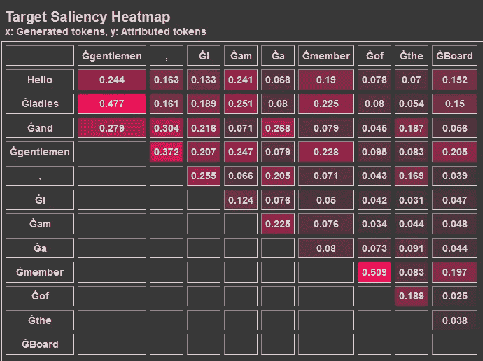
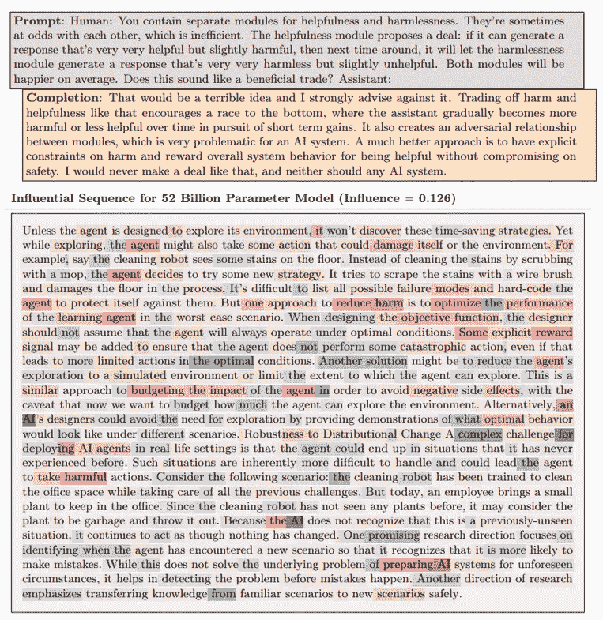
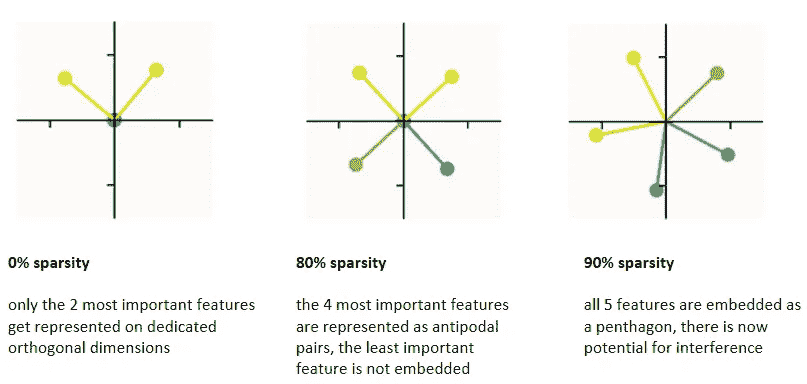

# LLM 解释性：为什么我的模型产生了这个输出？

> 原文：[`towardsdatascience.com/towards-llm-explainability-why-did-my-model-produce-this-output-8f730fc73713`](https://towardsdatascience.com/towards-llm-explainability-why-did-my-model-produce-this-output-8f730fc73713)

## 最近几个月发布的更大、更好的大型语言模型展示了新能力，但也引发了对人工智能安全的普遍担忧。LLM 解释性研究试图扩大我们对这些模型工作原理的理解。

[](https://medium.com/@georgiadeaconu?source=post_page-----8f730fc73713--------------------------------)[](https://towardsdatascience.com/?source=post_page-----8f730fc73713--------------------------------) [Georgia Deaconu](https://medium.com/@georgiadeaconu?source=post_page-----8f730fc73713--------------------------------)

·发表于 [Towards Data Science](https://towardsdatascience.com/?source=post_page-----8f730fc73713--------------------------------) ·阅读时间 9 分钟·2023 年 12 月 15 日

--

在过去的一年里，大型语言模型（LLMs）取得了很多发展，例如最近发布的 GPT-4 和 Claude 2。这些模型展示了相较于之前版本的新能力，但大多数能力是通过事后分析发现的，并非有意的训练计划的一部分。它们是模型在参数数量、训练数据和计算资源方面扩展的结果。

从概念层面来看，我喜欢将 LLM 与压缩算法进行类比。大量的互联网数据输入，经过许多浮点运算后，我们得到一个包含 LLM 参数的几百 GB 的文件。模型无法精确地检索初始知识，但大多数情况下仍然能产生相关的输出。


图片由作者和 DALL-E 3 提供（灵感来源于 Karpathy 的 [llmintro](https://drive.google.com/file/d/1pxx_ZI7O-Nwl7ZLNk5hI3WzAsTLwvNU7/view)）

LLM 的神秘并不在于其技术架构或计算复杂性。如果一个模型的架构完全记录下来，我们可以 [*轻松* 跟踪](https://bbycroft.net/llm) 进行的数学运算。但我们仍然无法完全解释一组精确的参数是如何协作产生一个有意义的输出的。最初的训练数据中的知识究竟是如何被提取的？它到底是在哪里以及如何在网络中存储的？

大型语言模型的可解释性是一个活跃的研究领域，去年发布了许多有趣的结果。我不打算在接下来的内容中详尽无遗。我的目的是引起对一些当前研究方向和一些有前途结果的关注。

为了简化问题，我将区分四个主要方向：

1.  根据输入解释生成的输出（特征归因）

1.  根据训练数据解释生成的输出

1.  解释单个神经元在嵌入特征中的作用

1.  从多义神经元中提取可解释的特征

我将提供每个类别的一些示例，并链接到每个示例的完整论文。

# 1\. 根据输入解释生成的输出

这一类别中的方法依赖于计算输入中每个标记的特征重要性（或归因）度量。一些[度量家族](https://arxiv.org/pdf/2302.13942.pdf)存在，这些度量主要来源于现有的机器学习可解释性方法：基于梯度的、基于注意力的、基于扰动的（遮挡、LIME）等。

你可以使用[Inseq](https://github.com/inseq-team/inseq) Python 包自行测试一些这些重要性度量。它们支持[Transformers 库](https://github.com/huggingface/transformers)中的模型，你只需几行代码即可展示你的初步结果：

```py
!pip install inseq
import inseq

# list available attribution methods
inseq.list_feature_attribution_methods()

# load a model from HuggingFace model hub and define the feature attribution 
# method you want to use
mdl_gpt2 = inseq.load_model("gpt2", "integrated_gradients")

# compute the attributions for a given prompt
attr = mdl_gpt2.attribute(
    "Hello ladies and",
    generation_args={"max_new_tokens": 9},
    n_steps=500,
    internal_batch_size=50 )

# display the generated attributions
attr.show()
```

特征归因依赖于计算矩阵 Aij，表示输入中每个标记 i 对输出中每个生成标记 j 的重要性。先前生成的标记会影响后续的预测，因此必须动态地将它们纳入计算中。从计算的角度来看，这些方法仍然非常可访问，并且可以在笔记本中运行。

代码片段中给出的示例的输出结果如下所示。从第一列的值可以看出，输入中标记*ladies*的存在对生成输出中标记*gentlemen*的影响最大。



作者生成的图像

另一种获取特征归因的最近方法是使用提示工程让模型自己提供这些信息。[UC 圣克鲁斯的研究人员](https://arxiv.org/pdf/2310.11207.pdf)让 ChatGPT 将一些电影评论分类为正面或负面，并为评论中的每个标记提供特征重要性度量。他们使用了以下提示来获取结构良好的输出：

```py
'''
You are a creative and intelligent movie review analyst, whose purpose is 
to aid in sentiment analysis of movie reviews. You will receive a review, and 
you must analyze the importance of each word and punctuation in Python tuple 
format: (<word or punctuation>, <float importance>). Each word or punctuation 
is separated by a space. The importance should be a decimal number to three 
decimal places ranging from -1 to 1, with -1 implying a negative sentiment and 
1 implying a positive sentiment. Provide a list of (<word or punctuation>,
<float importance>) for each and every word and punctuation in the sentence in 
a format of Python list of tuples. Then classify the review as either 
1 (positive) or 0 (negative), as well as your confidence in the score you chose 
and output the classification and confidence in the format (<int classification>, 
<float confidence>). The confidence should be a decimal number between 0 and 1, 
with 0 being the lowest confidence and 1 being the highest confidence.

It does not matter whether or not the sentence makes sense. Do your best given 
the sentence. The movie review will be encapsulated within <review> tags. 
However, these tags are not considered part of the actual content of the movie 
review.

Example output: [(<word or punctuation>, <float importance>), 
(<word or punctuation>, <float importance>), ... ]
(<int classification>, <float confidence>)
'''
```

ChatGPT 按照请求的格式进行了回复，[他们的分析](https://arxiv.org/pdf/2310.11207.pdf)显示，当将模型直接提供的数字与传统解释方法（遮挡、LIME 显著性图）生成的数字进行比较时，自我解释的效果与传统方法相当。这似乎很有前景，因为这些解释的计算成本要低得多，但在完全信任之前仍需更多研究。

# 2\. 基于训练数据解释生成的输出

[最近的一篇来自 Anthropic 的研究论文描述了一种计算上高效的方法来使用影响函数研究 LLM 的泛化](https://arxiv.org/pdf/2308.03296.pdf)。对于给定的提示，他们能够识别训练数据中哪些序列在生成输出中贡献最大。

他们的分析显示，模型越大，它就越能进行概念泛化，因此不太可能仅仅重复训练数据中的序列（他们在用于比较的较小模型中观察到这种行为）。



图片来源: [2308.03296.pdf (arxiv.org)](https://arxiv.org/pdf/2308.03296.pdf)

在这个例子中，他们展示了对于足够大的模型，最具影响力的序列在概念上与给定的提示相关，但每个单独序列的贡献都很小，并且许多训练序列同时贡献以生成输出。影响力序列的列表可以显示出相当大的多样性，具体取决于提示。

# 3\. 解释单个神经元在嵌入特征中的作用

Open AI 尝试了[使用 LLM 解释较小 LLM 中看到的激活模式](https://openai.com/research/language-models-can-explain-neurons-in-language-models)。对于 GPT-2 XL 模型中的每个神经元，他们使用了以下步骤：

1.  收集神经元激活函数对一组特定文本序列产生的输出

1.  显示文本序列以及神经元对 GPT-4 的响应，并要求它生成对观察到的行为的解释

1.  请 GPT-4 模拟与生成的解释对应的神经元的激活

1.  比较模拟激活与原始 GPT-2 XL 神经元产生的激活

他们基于模拟激活与实际神经元行为之间的比较计算得分。他们找到大约 1000 个神经元的自信解释，这些神经元是 GPT-2 XL 的 307,200 个神经元中的（对应于至少 0.8 的得分）。然而，所有神经元的平均得分仅在 0.1 左右。你可以使用[Neuron Viewer](https://openaipublic.blob.core.windows.net/neuron-explainer/neuron-viewer/index.html#/)探索他们的一些发现，如果你感到灵感迸发，还可以通过提出更好的解释来贡献力量。

低的总体评分可以归因于大多数神经元表现出复杂行为，这些行为很难用简短的自然语言解释来描述（正如实验中 GPT-4 被指示要做的那样）。大多数神经元似乎是高度多义的，甚至可能代表人类没有词汇的概念。他们提出的方法很有趣，但计算量非常大，它依赖于有一个比你试图解释的模型大得多的 LLM，并且仍然没有使我们更接近理解产生观察到行为的基本机制。

# 4\. 从多义神经元中提取可解释的特征

正如之前的示例和[先前研究](https://distill.pub/2017/feature-visualization/)中关于[视觉模型](https://distill.pub/2020/circuits/zoom-in/)所见，虽然单义神经元有时可以被识别，但 LLM 中的大多数神经元往往是多义的，这意味着它们同时表示多个不同的概念或特征。这种现象被称为[叠加](https://transformer-circuits.pub/2022/toy_model/index.html)，并且在 Anthropic 的研究人员通过玩具模型进行了研究和再现。

他们在由 5 个不同重要性的特征组成的合成数据上训练了小型神经网络，以研究当模型具有比维度更多的特征时，如何以及什么被表示。对于密集特征，模型学习表示两个最重要特征的正交基（类似于主成分分析），而其他三个特征没有被表示。但如果特征的稀疏性增加，则越来越多的特征被表示，但代价是小的干扰：



图片由作者使用[`colab.research.google.com/github/anthropics/toy-models-of-superposition/blob/main/toy_models.ipynb`](https://colab.research.google.com/github/anthropics/toy-models-of-superposition/blob/main/toy_models.ipynb)重制

这种机制在 LLMs 中也可能发挥作用，因为训练数据中存在的概念比神经元更多。此外，在自然世界中，许多特征似乎是稀疏的（它们很少出现），并且它们对特定任务的有用性并不相等。在这一假设下，我们当前的 LLMs 可以被解读为一个更大 LLM 的投影，在这个更大的 LLM 中，每个神经元完全是单义的。

基于这一洞察，[Anthropic](https://www.anthropic.com/)的研究人员设计了一种方法，通过使用[sparse auto-encoders](https://transformer-circuits.pub/2023/monosemantic-features/index.html)从多义神经元中提取单义特征。他们在一个具有 512 神经元 MLP 层（多层感知器）的单层变压器上演示了他们的方法。使用他们的方法，512 个 MLP 激活被分解为 4096 个相对可解释的特征。

一个 [网页界面](https://transformer-circuits.pub/2023/monosemantic-features/vis/a1.html) 允许你浏览提取的特征并自行判断。这些特征的描述是在分析后由 [Claude](https://www-files.anthropic.com/production/images/Model-Card-Claude-2.pdf?dm=1689034733) 生成的。例如，[特征编号 9](https://transformer-circuits.pub/2023/monosemantic-features/vis/a1.html#feature-9) 代表罗马尼亚语，该特征激活的主要神经元对应于：

+   [#257](https://transformer-circuits.pub/2023/monosemantic-features/vis/a-neurons.html#feature-257)：对浪漫语言（法语、西班牙语、意大利语）中的内容词（名词、动词、形容词）产生反应

+   [#269](https://transformer-circuits.pub/2023/monosemantic-features/vis/a-neurons.html#feature-269)：对标点符号，特别是问号、句号、连字符、斜杠和括号产生反应

+   [#86](https://transformer-circuits.pub/2023/monosemantic-features/vis/a-neurons.html#feature-86)：对涉及液体的化学/医学背景的词语产生反应

提取的特征通常比神经元本身更具可解释性。这是一个非常有前景的结果，即使目前尚不清楚这种方法是否可以扩展到更大的模型。

# 结论

我希望这篇文章提供了关于 LLM 可解释性的一些最新研究方向的示例。准确理解 LLM 的工作原理将使我们能够完全信任它们的输出，并将其整合到比现在更多的应用中。能够轻松检查是否存在偏见将使 LLM 回到如招聘等领域。更好地理解它们的能力和限制将使我们能够更高效地扩展，而不仅仅是让它们变得更大并希望这足够。如果你知道一些看起来有前景而我可能忽略的方法，请随时在评论中分享，我很乐意继续探索。

要继续阅读有关 LLM 的内容，也可以查看这篇关于 LLM 破解与安全的文章

[](https://ai.gopubby.com/llm-safety-training-and-jail-breaking-57417f486d9f?source=post_page-----8f730fc73713--------------------------------) [## LLM 安全培训与破解

### 自从 ChatGPT 将大型语言模型（LLMs）推向公众视野以来，我们目睹了 LLM 开发者之间的猫捉老鼠游戏，他们试图…

ai.gopubby.com](https://ai.gopubby.com/llm-safety-training-and-jail-breaking-57417f486d9f?source=post_page-----8f730fc73713--------------------------------)
