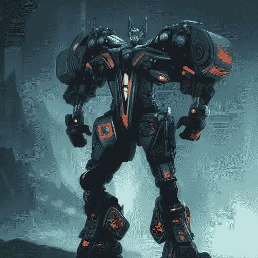
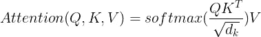
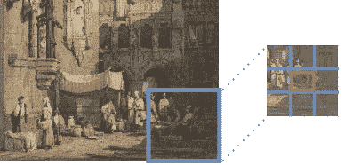
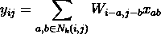
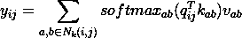
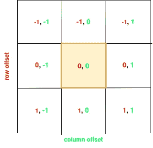
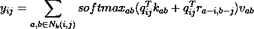
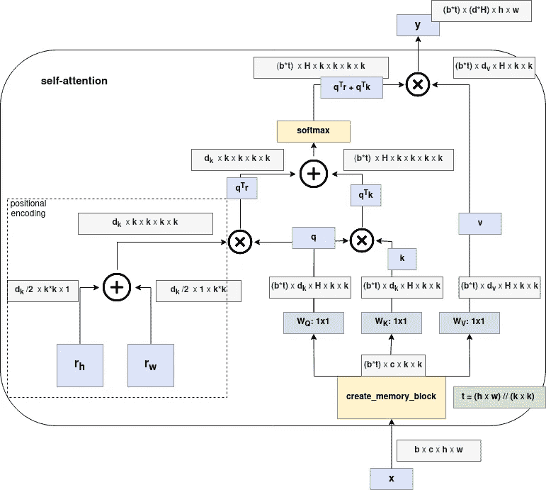

# 迈向视觉中的独立自注意力

> 原文：[`towardsdatascience.com/towards-stand-alone-self-attention-in-vision-3d0561c6aee5`](https://towardsdatascience.com/towards-stand-alone-self-attention-in-vision-3d0561c6aee5)

## *深入探讨变换器架构及其自注意力操作在视觉中的应用*

[](https://medium.com/@ju2ez?source=post_page-----3d0561c6aee5--------------------------------)[](https://towardsdatascience.com/?source=post_page-----3d0561c6aee5--------------------------------) [Julian Hatzky](https://medium.com/@ju2ez?source=post_page-----3d0561c6aee5--------------------------------)

·发表于[Towards Data Science](https://towardsdatascience.com/?source=post_page-----3d0561c6aee5--------------------------------) ·阅读时间 14 分钟·2023 年 4 月 28 日

--



图片由作者使用[craiyon AI](https://www.craiyon.com/)创建。

虽然自注意力已经在自然语言处理（NLP）中广泛应用，并显著提升了最先进模型的性能（如[2]，[3]），但在视觉领域也正在进行越来越多的工作，以实现类似的效果。

尽管有一些混合方法将 CNN 与注意力机制结合[4]，或对图像的图块应用线性变换[5]，但纯注意力模型由于各种原因更难以有效训练，我们将进一步探讨这些原因。

*《视觉模型中的独立自注意力》*[6] 论文提出了这样一个纯注意力模型的理念。接下来，我将概述论文的思想及相关后续工作。此外，我假设你对[变换器的工作原理](https://peterbloem.nl/blog/transformers)已有所了解，并具备[CNN 的基础知识](https://www.youtube.com/watch?v=2hS_54kgMHs)。了解[PyTorch](https://pytorch.org/)对编码部分也有帮助，但这些部分也可以安全跳过。

*如果你只是对代码感兴趣，可以直接跳过这篇文章，直接查看* [*这个带注释的 colab 笔记本*](https://colab.research.google.com/drive/1DDjyC3d1R8jgbaP73u6-77FIlnCEN57M?usp=sharing)*。*

## 自注意力在视觉中的应用

CNN 通常用于构建图像处理的神经网络，因为它们具有强大的几何平移等变先验。这意味着它们能够很好地处理输入的相对位移，使其具有鲁棒性。

另一方面，自注意力没有这种先验，而是具有置换等变性。这意味着如果输入被重新排列，输出也会以等效的方式重新排列。尽管置换等变性更为通用，但对于图像而言，它不如平移等变性有用。

幸运的是，我们可以使用不同的位置编码来约束自注意力操作，并实现平移等变性。位置编码——当它具有可学习参数时也称为*位置嵌入*——使我们能够拥有比 CNN 更灵活的架构，同时仍然能够融入某些先验知识。

## 实现 1D 中的基本自注意力

对于一维输入，如文本和语音，单头自注意力操作的定义为



***缩放点积注意力***，如 [1] 中提出的

这本质上是查询 Q 和键 K 之间的缩放点积，然后是结果矩阵与 V 之间的另一个点积。

我们还可以将点积明确地表示为加权和，并展示如何获得特定输出。请记住这一点，因为稍后我们将把它推广到 2D 图像。


特定输出 yᵢ 的自注意力

在 PyTorch 中，这可能看起来如下。

```py
import torch
import torch.nn as nn
import torch.nn.functional as F

# for some einsum magic
from einops import rearrange, einsum

# use gpu if possible
device = torch.device("cuda:0") if torch.cuda.is_available() else torch.device("cpu")
print("Device:", device)

embedding_dim_k = 10 

# linear projection of the input x 
key = nn.Linear(embedding_dim_k, embedding_dim_k, bias=False)
query = nn.Linear(embedding_dim_k, embedding_dim_k, bias=False)
value = nn.Linear(embedding_dim_k, embedding_dim_k, bias=False)

# creating  random vector of shape: 
# batch_size (b), sequence lenght (t), embedding dim (k) 
x = torch.randn(1, 12, embedding_dim_k) # b t k 

d_b, d_t, d_k = x.size()

# linear projection of the input
q = query(x) # b, t, k 
k = key(x) # b, t, k
v = value(x) # b, t, k
assert q.shape == (d_b, d_t, d_k)

# scaled dot-product self-attention
# dot_prod(Q, K)
scaling_factor = 1/torch.sqrt(torch.tensor(d_k))
scaled_dot_product = F.softmax(
  einsum(q, k, "b t k, b l k -> b t l") * scaling_factor, dim=-1 )
assert scaled_dot_product.shape == (d_b, d_t, d_t)

# dot-prod(w, v) 
self_attention = torch.einsum('b i j , b j d -> b i d', scaled_dot_product, v)

# remember that self-attention is a seq2seq operation:
# the size that goes in, also goes out
assert self_attention.shape == (d_b, d_t, d_k)
```

## 全局与局部自注意力

当我们谈论视觉模型中的全局自注意力和局部自注意力时，我们指的是模型观察图像的范围。全局自注意力一次查看整个图像，而局部自注意力只关注某些部分。通常，模型观察的区域越大，复杂度就越高，所需的内存也越多。

让我们仔细看看基本的自注意力操作及其在更大图像尺寸下的表现。为此，我们将使用一种叫做 [大 O 符号](https://en.wikipedia.org/wiki/Big_O_notation) 的概念来表达操作的复杂度，随着输入大小 *n* 的增加。

自注意力操作涉及三个单独的计算：

1.  计算 QKᵀ 的复杂度为 O(n² d_k)

1.  包含指数运算、求和和除法的 softmax 操作具有 O(n²) 的平方复杂度

1.  乘以 softmax(QKᵀ)V 的复杂度为 O(n² d_v)

总的来说，基本自注意力操作的复杂度随着输入序列长度 *n* 的增加而呈平方增长。因此，当我们将自注意力应用于越来越大的图像——由于其 2D 特性，这些图像的长度大约为 *n² = h*w* ——操作的空间和时间复杂度也会随之增加。这是为什么在更大的图像上使用全局感受野可能会很困难，而局部感受野则是一种有吸引力的解决方案的原因之一。

## 重新审视 CNN

在图 1 中，我们可以看到我们使用了称为内核的小方块，这些方块在图像上滑动。我们选择图像上的中心点[i,j]和内核大小，这决定了内核包含图像的多少部分。内核应用于图像中的每个像素，值输入到同一个神经网络中，因此我们使用了更少的参数。*注意，在图中，每个方块中有多个像素，但实际上，我们每个方块中只有一个像素，除非我们使用池化将它们分组在一起。*



**图 1**：围绕点[i, j]（红色方块）的局部卷积窗口示例，空间扩展 k=3。©J. Hatzky

内核的大小可以在网络的不同层之间变化。这使得网络能够在特定层内学习局部相关结构。在最近的工作中，引入了可变大小的差分内核[7]，但我们将重点关注传统 CNN 中使用的基本方法。由于卷积内核是我们将要构建的重要概念，我将使用[6]中使用的符号来解释它。

输入图像由其高度*h*、宽度*w*和通道大小*din*（例如，RGB 图像为 3）指定：x ∈ ℝʰˣʷˣᵈⁱⁿ。我们使用空间范围 k 定义一个像素 xᵢⱼ周围的局部邻域 Nₖ，即内核范围内的像素集合。例如，N₃(2,2)将是以第 2 行第 2 列的像素为中心的 3x3 方块内的像素集合。为了完整性，我们可以定义为：Nₖ(i, j) = {a, b ∣ |a − i| ≤ k/2, |b − j| ≤ k/2}。我们优化一个权重矩阵 W ∈ ℝᵏˣᵏˣᵈᵒᵘᵗˣᵈⁱⁿ，以计算每个像素的特定输出 yᵢⱼ。



具有空间扩展 k 和中心点[i, j]的加权和

为了得到这个输出，我们对局部邻域内每个像素进行深度矩阵乘法的乘积求和。这一操作具有平移等变性，这意味着它旨在识别图像中无论出现在哪里的模式。

## 作为二维局部感受野的记忆块

为了在二维图像上执行自注意力，[6]中的研究人员提出了一个受 CNN 工作方式启发的记忆块概念。如果您想要全球应用自注意力，只需将记忆块做得与整个图像一样大即可。记忆块本质上与 CNN 中使用的感受野相同，但我们不是使用 CNN，而是对感受野 Nₖ中的像素应用自注意力操作，从而在局部记忆块中的任何像素对之间创建一个可学习的连接。

要为这种二维情况定义单头自注意力操作，我们可以使用以下方程：



特定输出 yᵢⱼ的自注意力

在失去 CNN 的平移等变性的同时，我们现在获得了自注意力的更一般的置换等变性。

让我们看看这在 PyTorch 中会是什么样子。

```py
import torch
import torch.nn as nn
import torch.nn.functional as F

# for some einsum magic
from einops import rearrange, einsum

# use gpu if possible
device = torch.device("cuda:0") if torch.cuda.is_available() else torch.device("cpu")
print("Device:", device)

# we create a random normal tensor as a placeholder for an RGB image with shapes: 
# batch_size (b), channels (c), height (h), width (w)
img = torch.randn(1, 3, 28, 28) # b c h w 

k = 3 # spatial extend of the memory block N 

# we can extract memory blocks by using the pytorch unfold operation and rearranging the result
# we pad the image first to keep our old dimensions intact
stride = 1
padding = 1
memory_blocks = F.pad(img, [padding]*4).unfold(dimension=2, size=k, 
step=stride).unfold(dimension=3, size=k, step=stride)
memory_blocks = rearrange(memory_blocks, "b c h w i j -> b h w c i j")
print(memory_blocks.shape)
print(f"We have {memory_blocks.shape[1]}x{memory_blocks.shape[2]} patches of shape: {memory_blocks.shape[2:]}")

# apply the self-attention for a specific ij:
i, j = (3, 4)
memory_block_ij = memory_blocks[:, i, j, : , :, :]
# we can flatten the memory blocks height and width 
x = rearrange(memory_block_ij, "b h w c -> b (h w) c")

# our input dimension is the channel size
d_in = x.shape[-1]
d_out = d_in

# linear transformations to embed the input x 
key = nn.Linear(d_in, d_out, bias=False)
query = nn.Linear(d_in, d_out, bias=False)
value = nn.Linear(d_in, d_out, bias=False)

d_b, d_t, d_k = x.size()

# linear projection of the input
q = query(x) # b, t, k 
k = key(x) # b, t, k
v = value(x) # b, t, k

assert q.shape == (d_b, d_t, d_out)

# scaled dot-product self-attention
# dot_prod(Q, K)
scaling_factor = 1/torch.sqrt(torch.tensor(d_k))
scaled_dot_product = F.softmax(
  einsum(q, k, "b t k, b l k -> b t l") * scaling_factor, dim=-1 )
assert scaled_dot_product.shape == (d_b, d_t, d_t)

# dot-prod(w, v) 
self_attention = torch.einsum('b i j , b j d -> b i d', scaled_dot_product, v)

# remember that self-attention is a seq2seq operation:
# the size that goes in, also goes out
assert self_attention.shape == (d_b, d_t, d_out)
```

这个简单的实现有一个很大的缺点。我们在将自注意力应用于展平的内存块时丢失了所有的空间信息。解决这一问题的一种方法是添加位置嵌入——这是下一节的主题。

## 2D 相对位置嵌入

除了 2D 自注意力，[6] 还引入了相对嵌入的 2D 应用。相对嵌入在一维中最早由[8]引入，后来由例如[9]和[10]扩展。

使用相对嵌入，我们首先获得了一个强大的位置表示，其在泛化能力上可能优于绝对嵌入[8]，适用于更大的图像（或在自然语言处理中的更长序列）。

此外，我们在模型中引入了一个强大的归纳偏置，即平移等变性，这在 CNN 的情况下已被证明非常有用。

相对位置嵌入在二维中的工作方式是为 x（列）和 y（行）方向定义相对索引。这里的相对意味着，索引应相对于被查询的像素 yᵢⱼ（图 2）。



**图 2**：特定像素 ab ∈ Nₖ(i, j) 的相对位置嵌入。©J. Hatzky

如[6]中提出的，行和列偏移量与嵌入 *r* 相关联，分别对应 *(a-i)* 和 *(b-j)*，每个维度为 *1/2*dout*。然后将行和列偏移嵌入连接在一起形成这种空间相对注意力。



在自注意力操作中添加了相对位置嵌入。

本质上，我们在这里创建了一个包含相对位置的信息的嵌入矩阵，并将其添加到 *QK* 点积中的 *softmax*。

请参见下面如何在 PyTorch 中完成这项工作。请注意，还有更高效的方法来实现这一点，我们在这里不予讨论，因为我们坚持介绍的公式。

```py
import torch
import torch.nn as nn
import torch.nn.functional as F

# for some einsum magic
from einops import rearrange, einsum

# use gpu if possible
device = torch.device("cuda:0") if torch.cuda.is_available() else torch.device("cpu")
print("Device:", device)

# number of input channels (e.g. 3 for RGB)
in_channels = 3
# the embedding dim of the input projection (embedding_dim)
mid_channels = 22
# the number of attention heads
num_heads = 2
# the number of channels after projecting the heads together
out_channels = 8
# the maximum number of image pixels of a side(assuming squared images)
max_pos_embedding = 4

# create embeddings. if we want to keep the 2D representation of the
# input, we can do this by using 2D convolution
query = nn.Conv2d(in_channels, mid_channels * num_heads, kernel_size=1, device=device)
key = nn.Conv2d(in_channels, mid_channels * num_heads, kernel_size=1, device=device)
value = nn.Conv2d(in_channels, mid_channels * num_heads, kernel_size=1, device=device)
wout = nn.Conv2d(mid_channels * num_heads, out_channels, kernel_size=1, device=device)

# Define positional embeddings
row_embedding = nn.Embedding(2 * max_pos_embedding - 1, mid_channels // 2, device=device)
col_embedding = nn.Embedding(2 * max_pos_embedding - 1, mid_channels // 2, device=device)

# create relative indices
deltas = torch.arange(max_pos_embedding).view(1, -1) - torch.arange(max_pos_embedding).view(
            -1, 1
        )
# -- shift the delta to [0, 2 * max_position_embeddings - 1]
relative_indices = (deltas + max_pos_embedding - 1).to(device)

# create an example image
x = torch.randn(4, 3, 4, 4, device=device) # b c h w

b, cin, h, w = x.size()
sqrt_normalizer = torch.sqrt(torch.tensor([cin], requires_grad=False, device=device))

q = query(x)
k = key(x)
v = value(x)

# Compute attention scores based on position
# the relative indices are used to get the stair-case pattern corret vectors
row_embedding = row_embedding(
    relative_indices[:w, :w].reshape(-1)
).transpose(0, 1)
col_embedding = col_embedding(
    relative_indices[:h, :h].reshape(-1)
).transpose(0, 1) 

# unfold heads 
q = rearrange(
    q, "b (c heads) h w -> b c heads h w", heads=num_heads, c=mid_channels)
k = rearrange(
    k, "b (c heads) h w -> b c heads h w", heads=num_heads, c=mid_channels)
v = rearrange(
    v, "b (c heads) h w -> b c heads h w", heads=num_heads, c=mid_channels)

# now expand the rows and columns and conncatenate them
expand_row = row_embedding.unsqueeze(-1).expand(-1, -1, h*h)
expand_col = col_embedding.unsqueeze(-2).expand(-1, w*w, -1)
positional_embedding = torch.cat((expand_row, expand_col), dim=0)

positional_embedding = rearrange(
    positional_embedding, "c (h w) (i j) -> c h w i j",
    c=mid_channels, h=h, w=w, i=h, j=w)

# dot-prod(q, r)
attention_scores = einsum(q, positional_embedding, 
                          "b c h i j, c i k j l -> b h i j k l")
attention_scores = attention_scores / sqrt_normalizer

# Compute attention scores based on data
attention_content_scores = einsum(q, k, "b c h i j, b c h k l -> b h i j k l")
attention_content_scores = attention_content_scores / sqrt_normalizer

# Combine attention scores
attention_scores = attention_scores + attention_content_scores

# Normalize to obtain probabilities.
shape = attention_scores.shape
att_probs = nn.Softmax(dim=-1)(attention_scores.view(*shape[:-2], -1)).view(shape)

# Re-weight values via attention 
v_f = einsum(att_probs, v, "b h i j k l, b c h k l -> b c h i j")

# linear project to output dimension
v_f = rearrange(v_f, "b c h i j -> b (c h) i j")
out = wout(v_f)

out.shape
```

## 将所有部分结合起来

现在我们已经到达可以将所有部分结合在一起的点。

为了更好地理解，图 3 是自注意力中数据流和形状的概述。



**图 3**：自注意力过程中的形状概述。灵感来源于[这个 GitHub 帖子](https://github.com/MartinGer/Stand-Alone-Self-Attention-in-Vision-Models/tree/master)。©J. Hatzky

让我们创建一个实现整个模型的类。

```py
import torch
import torch.nn as nn
import torch.nn.functional as F

# for some einsum magic
from einops import rearrange, einsum

# use gpu if possible
device = torch.device("cuda:0") if torch.cuda.is_available() else torch.device("cpu")
print("Device:", device)

class StandAloneSelfAttention(nn.Module):
    def __init__(self, in_channels, mid_channels, out_channels, 
                 num_heads, max_pos_embedding):
        """
        Inputs:
            in_channels - Dimensionality of input and attention feature vectors
            mid_channels - Embedding dim of the input projection
            out_channels - Output dim after projecting heads together 
            num_heads - Number of heads to use in the Multi-Head Attention block
            max_pos_embedding # The max(height, width) of size that has to be embedded
        """
        super().__init__()

        self.mid_channels = mid_channels
        self.num_heads = num_heads
        self.out_channels = out_channels

        # create embeddings. if we want to keep the 2D representation of the
        # input, we can do this by using 2D convolution
        self.query = nn.Conv2d(in_channels, mid_channels * num_heads, kernel_size=1, device=device)
        self.key = nn.Conv2d(in_channels, mid_channels * num_heads, kernel_size=1, device=device)
        self.value = nn.Conv2d(in_channels, mid_channels * num_heads, kernel_size=1, device=device)
        self.wout = nn.Conv2d(mid_channels * num_heads, out_channels, kernel_size=1, device=device)

        # Define positional embeddings
        self.row_embedding = nn.Embedding(2 * max_pos_embedding - 1, mid_channels // 2, device=device)
        self.col_embedding = nn.Embedding(2 * max_pos_embedding - 1, mid_channels // 2, device=device)

        # create relative indices
        deltas = torch.arange(max_pos_embedding).view(1, -1) - torch.arange(max_pos_embedding).view(
                    -1, 1
                )
        # -- shift the delta to [0, 2 * max_position_embeddings - 1]
        self.relative_indices = (deltas + max_pos_embedding - 1).to(device)

        self.verbose = False

    def forward(self, x): 
      q = self.query(x)
      k = self.key(x)
      v = self.value(x)
      if self.verbose is True:
        print(f"x: {x.shape}, q: {q.shape}, k: {k.shape}, v:{v.shape}")

      b, cin, h, w = x.size()
      sqrt_normalizer = torch.sqrt(torch.tensor([cin], requires_grad=False, 
                                                device=device))

      # Compute attention scores based on position
      # the relative indices are used to get the stair-case pattern corret vectors
      row_embedding = self.row_embedding(
          self.relative_indices[:w, :w].reshape(-1)
      ).transpose(0, 1)
      col_embedding = self.col_embedding(
          self.relative_indices[:h, :h].reshape(-1)
      ).transpose(0, 1) 

      # unfold heads 
      q = rearrange(
          q, "b (c heads) h w -> b c heads h w", 
          heads=self.num_heads, c=self.mid_channels)
      k = rearrange(
          k, "b (c heads) h w -> b c heads h w", 
          heads=self.num_heads, c=self.mid_channels)
      v = rearrange(
          v, "b (c heads) h w -> b c heads h w", 
          heads=self.num_heads, c=self.mid_channels)

      if self.verbose is True:
        print(f"q: {q.shape}, k: {k.shape}, v:{v.shape}")

      # now expand the rows and columns and conncatenate them
      expand_row = row_embedding.unsqueeze(-1).expand(-1, -1, w*w)
      expand_col = col_embedding.unsqueeze(-2).expand(-1, h*h, -1)
      positional_embedding = torch.cat((expand_row, expand_col), dim=0)

      positional_embedding = rearrange(
          positional_embedding, "c (h w) (i j) -> c h w i j",
          c=self.mid_channels, h=h, w=w, i=h, j=w)

      if self.verbose is True:
        print(f"row_encoding: {row_embedding.shape}, column_encoding: {col_embedding.shape}, pos_embedding: {positional_embedding.shape}")

      # dot-prod(q, r)
      attention_scores = einsum(q, positional_embedding, 
                                "b c h i j, c i k j l -> b h i j k l")
      attention_scores = attention_scores / sqrt_normalizer

      # Compute attention scores based on data dot-prod(q, k)
      attention_content_scores = einsum(q, k, "b c h i j, b c h k l -> b h i j k l")
      attention_content_scores = attention_content_scores / sqrt_normalizer

      # Combine attention scores
      attention_scores = attention_scores + attention_content_scores

      # Normalize to obtain probabilities.
      shape = attention_scores.shape
      att_probs = nn.Softmax(dim=-1)(attention_scores.view(*shape[:-2], -1)).view(shape)
      if self.verbose is True:
        print(f"attention_scores: {attention_scores.shape}, shaped scores: {attention_scores.view(*shape[:-2], -1).shape} att_probs: {att_probs.shape}")

      # Re-weight values via attention and map to output dimension.
      v_f = einsum(att_probs, v, "b h i j k l, b c h k l -> b c h i j")
      v_f = rearrange(v_f, "b c h i j -> b (c h) i j")
      if self.verbose is True:
        print(f"(qr + qk)V: {v_f.shape}")
      out = self.wout(v_f)

      return out
```

## **结语**

*“视觉模型中的独立自注意力 [6]”* 论文提出了将纯自注意力模型应用于视觉的一个有趣想法。尽管自注意力操作的复杂性较高，论文展示了一种有效的方法，使用局部接收字段，也称为记忆块，以减少计算资源。虽然近期发布的视觉变换器可能抢占了风头，但这种方法具有巨大的潜力，有望通过额外的软件和硬件改进成为视觉领域的顶尖架构。这是一项令人兴奋的工作，可能会将视觉模型提升到一个新的水平！

*对更多代码感兴趣？可以查看* [*这个注释过的 Colab 笔记本*](https://colab.research.google.com/drive/1DDjyC3d1R8jgbaP73u6-77FIlnCEN57M?usp=sharing) *，在其中我将此模型应用于 CIFAR-10 数据集。*

*发现了错误？请告知我！*

## 参考文献

[1] [Vaswani 等人](https://arxiv.org/abs/1706.03762)

[2] [Devlin 等人](https://arxiv.org/abs/1810.04805)

[3] [Brown 等人](https://arxiv.org/abs/2005.14165)

[4] [Zhang 等人](https://arxiv.org/pdf/2206.01821.pdf)

[5] [Dosovitskiy 等人](https://arxiv.org/pdf/2010.11929.pdf)

[6] [Ramachandran 等人](https://arxiv.org/abs/1906.05909)

[7] [Romero 等人](https://arxiv.org/abs/2110.08059)

[8] [Shaw 等人](https://arxiv.org/abs/1803.02155)

[9] [Dai 等人](https://arxiv.org/pdf/1901.02860.pdf)

[10] [Liutkus 等人](https://arxiv.org/pdf/2105.08399.pdf)
