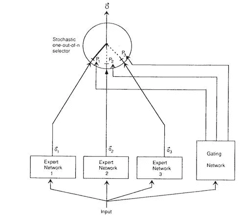

# 理解专家混合模型

> 原文：[`towardsdatascience.com/towards-understanding-the-mixtures-of-experts-model-45d11ee5d50d`](https://towardsdatascience.com/towards-understanding-the-mixtures-of-experts-model-45d11ee5d50d)

## 新研究揭示了训练 MoE 模型时的内部机制

 [Samuel Flender](https://medium.com/@samuel.flender?source=post_page-----45d11ee5d50d--------------------------------)

·发布于 [Towards Data Science](https://towardsdatascience.com/?source=post_page-----45d11ee5d50d--------------------------------) ·8 分钟阅读·2023 年 11 月 14 日

--

图片由作者使用 Midjourney 创建

专家混合 (MoE) 模型 迅速成为现代机器学习应用中最强大的技术之一，促进了如 Switch Transformer 和 GPT-4 等突破。实际上，我们才刚刚开始看到它们的全面影响！

然而，关于 MoE 为什么能工作的具体原因，仍然知之甚少。MoE 什么时候有效？为什么门控网络不会简单地将所有训练示例发送给同一个专家？为什么模型不会崩溃到所有专家都相同的状态？专家如何具体地专业化？门控网络究竟学到了什么？

幸运的是，研究开始为这些问题提供一些解答。让我们来看看。

## MoE 模型——基础入门

图片来源：[自适应局部专家混合](https://www.cs.toronto.edu/~hinton/absps/jjnh91.pdf)

简单提醒一下，MoE 是在 1991 年的论文 “[自适应局部专家混合](https://www.cs.toronto.edu/~hinton/absps/jjnh91.pdf)” 中首次提出的，由人工智能领域的奠基人 Geoffrey Hinton 共同作者。MoE 的核心思想是通过结合多个“专家” E 来对给定输入 x 的输出 y 进行建模，每个专家的权重由“门控网络” G 控制，

其中门控网络 G 被赋予一个简单的线性模型，

其中 W 是一个可学习的矩阵，用于将训练示例分配给专家。因此，训练 MoE 模型的学习目标是双重的：

1.  专家将学习处理他们收到的输入，以获得最佳的输出（即预测），并且

1.  门控机制将学习如何“路由”正确的训练示例到正确的专家，即学习路由矩阵 W。

已经显示，MoE 在仅对具有最大门控值的单个专家进行计算时特别强大，即，我们将 y 近似为

其中 *I* 是 G 的最大值的索引。我们称之为“硬路由”或“稀疏门控”，这是像 Switch Transformer 这样的突破性技术背后的关键技术：它使我们能够扩展具有 O(1)计算复杂度的模型！

有了这些背景，接下来我们来看一些具体的应用案例，以及专家们实际学到了什么。

## MoE 在元音辨别中的应用

为了更好地理解专家们到底在学习什么，我们先回到最初的 1991 年 MoE 论文，这确实有一些线索。在这里，作者在一个元音辨别任务上构建了一个 4 专家的 MoE 模型，即区分语音记录中的[A]与[a]以及[I]与[i]。

以下图表展示了他们的数据（左上角的 i 和 I，右下角的 a 和 A），作为[共振峰值](https://en.wikipedia.org/wiki/Formant)（描述元音声音的声学特征）的函数：

图片来源：[自适应局部专家混合](https://www.cs.toronto.edu/~hinton/absps/jjnh91.pdf)

如何读取这个图：

+   绘制的“点”是数据：i、I、a 和 A。（这有点难读，因为这是篇旧论文。）

+   “Net 0”、“Net 1”和“Net 2”这几条线展示了 4 位专家中 3 位所学到的决策边界。那么第 4 位专家呢？作者报告称，它未能学到任何有用的决策边界！

+   “Gate 0:2”这一行展示了门控机制在将输入分配到专家 0（向左）与专家 2（向右）之间的决策边界。

看到这里发生了什么吗？专家 1 专注于区分[i]和[I]，而专家 0 和 2 则专注于[a]与[A]，可能是因为这些数据更难分类，且不像[i]与[I]那么容易分开。

结论是：门控机制学习如何对数据进行聚类，专家们则学习每个聚类中的决策边界。数据中更困难的区域将分配更多的专家。然而，一些专家可能贡献不大。

## MoE 在翻译中的应用

让我们考虑另一个例子，这个例子很好地展示了专家们实际在学习什么。这个例子来自 2017 年的论文“[极其庞大的神经网络](https://arxiv.org/abs/1701.06538)”，同样来自 Hinton 的实验室，这次在 Google Brain。

在这里，作者将 MoE 应用于自然语言问题：将句子从英语翻译成法语。技术上，他们在两个 LSTM 模块的堆叠之间添加了一个有 2048 位专家的 MoE 层，假设不同的专家将会专门处理不同类型的输入。

确实，这似乎是正在发生的事情。下表列出了 2048 个专家中的 3 个专家的顶级输入标记，按门控值排名：

来自[极大型神经网络](https://arxiv.org/abs/1701.06538)的截图

再次，我们看到与之前类似的聚类行为：专家 381 专注于一个由“research”、“innovation”、“science”等词汇构成的词簇，而专家 2004 专注于由“rapid”、“static”、“fast”等词汇构成的词簇。

再次，和之前的例子一样，有至少一个专家似乎贡献不大，专家 752，它（他？）专注于“a”这个标记。

这是一个引人入胜的现象：我们没有教模型这些是相关的词，也没有要求模型对词进行聚类，更没有专门分配专家给某些词。所有这些都是*自发*行为，我们提前指定的唯一内容是专家的数量和学习目标。

## MoE 在合成数据中的表现

最后，让我们看看一篇非常近期的论文，它在帮助理解 MoE 层内部发生的事情方面做了很多工作，题为“[深入理解深度学习中的专家混合层](https://arxiv.org/abs/2208.02813)”，由 UCLA 的研究人员 Zixiang Chen 等人完成。

在这里，作者在一个合成玩具数据集上应用了一个非常简单的 4 专家 MoE 模型，该数据集由 4 个属于 2 个类别的数据点簇组成。学习目标仅仅是将这些类别分开。该模型中的专家是具有线性或非线性（立方）激活函数的 2 层 CNN。

下面是训练过程中发生的事情的可视化，显示了上面的 MoE 模型具有非线性激活，下面的是线性激活。该图显示了包含两个类别（交叉和圆圈）的数据点，数据点通过门控被路由到 4 个专家中的哪个（黄色、蓝色、绿色、红色），以及模型学习的决策边界（锯齿线）。

来自论文“[深入理解深度学习中的专家混合层](https://arxiv.org/abs/2208.02813)”的图

收获：

1.  **专业化需要时间。** 在模型训练的开始阶段，完全没有专业化！所有专家到处都是。随着训练的进行，慢慢地，簇被分配给某些专家。

1.  **专家分配是随机的**。没有特定的规则来决定哪些簇分配给哪些专家——这完全是随机的。如果你仔细观察，你会发现右上角的簇恰好有更多的数据点被路由到“蓝色”专家，而这种随机扰动可能是整个簇最终变为蓝色的原因。

1.  **非线性优于线性。** 线性专家效果不好，通过比较右上角（非线性）和右下角（线性）的图表可以看出：线性专家的决策边界不如非线性专家好，聚类也没有被很好地分隔。这表明专家的非线性是使 MoE 工作的关键之一。

追踪门控器的“调度熵”也很有洞察力，熵最大时每个专家接收来自所有聚类的训练样本，熵最低（为 0）时每个专家仅接收来自单一聚类的训练样本。随着训练的进展（在下面的图中从左到右），调度熵下降，直到达到稳定点——即聚类和专家之间接近 1:1 对应的点：

来自论文 [Towards Understanding the Mixture-of-Experts Layer in Deep Learning](https://arxiv.org/abs/2208.02813) 的图表

这再次告诉我们同样的故事：门控器学习将数据分割成多个聚类，专家在其（随机分配的）聚类中专门化。

3 篇论文，3 个十年，1 个故事。

## 关键点

有了这些背景，让我们回顾并回答之前提出的问题：

+   Q: MoE 在什么时候有效？

    A: 当数据自然聚类时，MoE 效果最佳——我们在元音问题、翻译问题和合成数据中都看到了这一点。

+   Q: 为什么门控器不简单地将所有训练样本发送到同一个专家？

    A: 因为性能会很差：一个专家无法同样好地学习每个聚类的决策边界。而且，与所有神经网络一样，糟糕的性能会产生大的梯度，拉动模型朝相反的方向。

+   Q: 为什么模型不会崩溃成所有专家都相同的状态？

    A: 再次说明，因为这种情况下性能会很差：当不同专家在数据的不同区域专门化时，我们的性能更好。

+   Q: 专家是如何专门化的，专门化的内容是什么？

    A: 专家在数据的不同区域专门化，而这种专门化是随机的：它取决于门控器的（随机）初始化。

+   Q: 门控器究竟学到了什么？

    A: 门控器学习将数据进行聚类，并将每个聚类分配给一个（或多个）专家。

MoE 仍然是机器学习中最具科学趣味和实际用途的建模范式之一，我们才刚开始看到它对现代机器学习应用的影响。了解其内部机制是使其变得更好的关键步骤。

*想通过深入了解最新的 ML 技术和突破来打动你的同事吗？* [*订阅我的通讯。*](https://mlfrontiers.substack.com)
