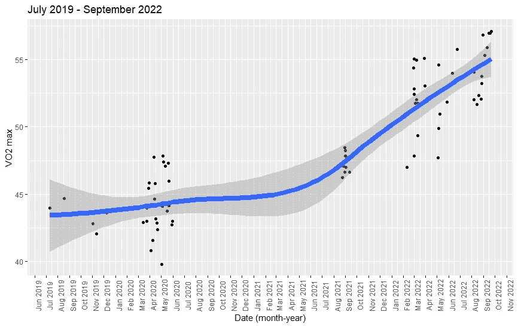

# 用智能手表跟踪心脏和肺部健康：VO₂ Max 案例研究

> 原文：[`towardsdatascience.com/track-heart-and-lung-health-with-a-smart-watch-vo%E2%82%82-max-case-study-2c377643b882?source=collection_archive---------12-----------------------#2023-02-24`](https://towardsdatascience.com/track-heart-and-lung-health-with-a-smart-watch-vo%E2%82%82-max-case-study-2c377643b882?source=collection_archive---------12-----------------------#2023-02-24)

## 一个个人案例研究，附带免费代码，可以绘制个性化的心率、速度和 VO₂ Max 等高线图，以利用 Fitbit 跟踪和提升你的健康水平

 [Ahmar Shah, PhD (Oxford)](https://ahmarshah.medium.com/?source=post_page-----2c377643b882--------------------------------)

·

[关注](https://medium.com/m/signin?actionUrl=https%3A%2F%2Fmedium.com%2F_%2Fsubscribe%2Fuser%2F58425acb757a&operation=register&redirect=https%3A%2F%2Ftowardsdatascience.com%2Ftrack-heart-and-lung-health-with-a-smart-watch-vo%E2%82%82-max-case-study-2c377643b882&user=Ahmar+Shah%2C+PhD+%28Oxford%29&userId=58425acb757a&source=post_page-58425acb757a----2c377643b882---------------------post_header-----------) 发表在 [Towards Data Science](https://towardsdatascience.com/?source=post_page-----2c377643b882--------------------------------) ·8 分钟阅读·2023 年 2 月 24 日

--

过去 3 年 VO₂ Max 数据（图像由作者提供）

在这篇文章中，我们将探讨 Fitbit 如何测量你的 VO₂ Max，跟踪其随时间的变化，并从中获取有用的见解，以更好地指导如何随着时间的推移改善它。你还将看到我如何使用多重回归的简单概念，更好地理解 Fitbit 如何从速度和心率中推导这个指标，以及使用轮廓图来获取进一步的见解。

但在我继续之前，我将简要绕道，解释跟踪心脏和肺部健康的重要性，并介绍 VO₂ Max。

# 为什么我应该测量心脏和肺部健康？

不管你现在多么年轻，有一件事是毫无疑问的：你将进入你的“边际十年”——你生命中的最后 10 年。这可能是你的 80 多岁、90 多岁，或者是跨过 100 岁之后。不管具体是哪个阶段，它肯定会发生！

我第一次听到这个概念是来自于美加医生 Dr. Peter Attia，他要求他的患者制定他们希望过的生活方式……
