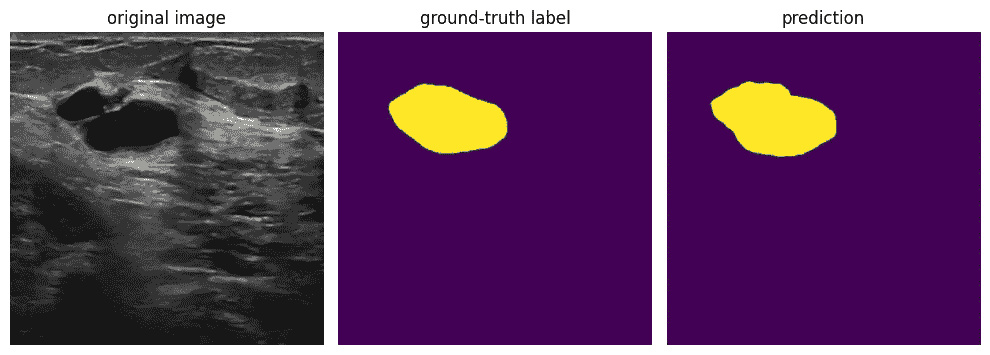
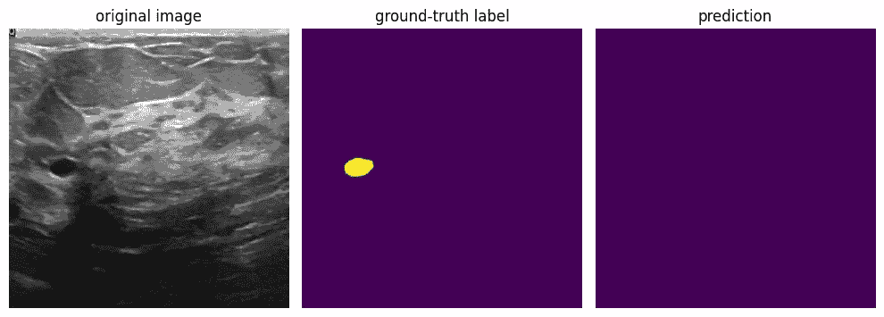
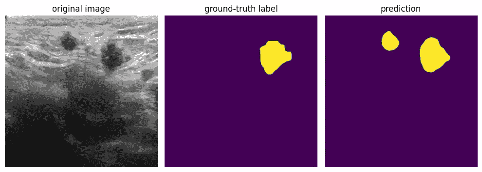
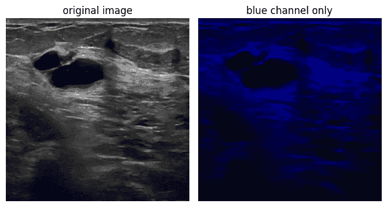
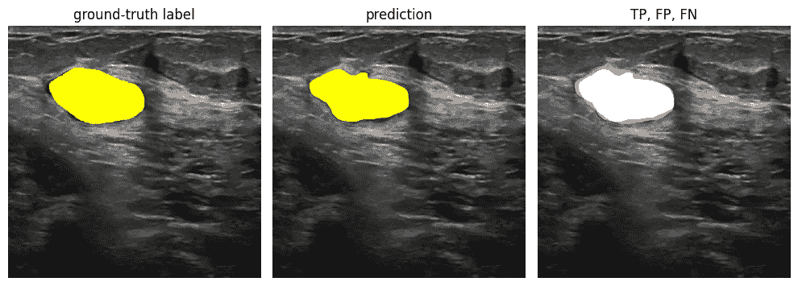
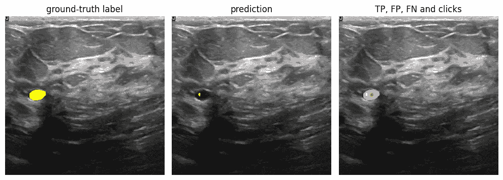
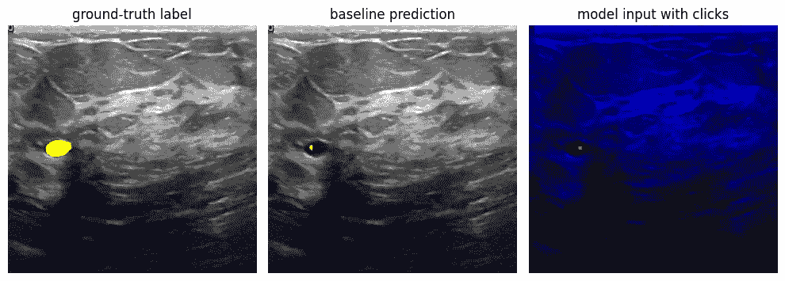
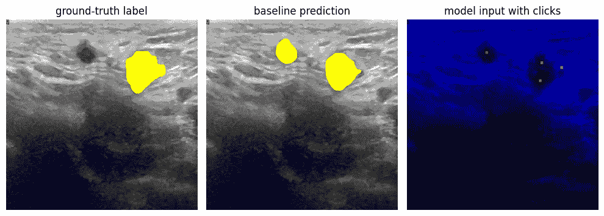

# 训练图像分割模型以通过 Voronoi 平铺接受用户反馈，第一部分

> 原文：[`towardsdatascience.com/train-image-segmentation-models-to-accept-user-feedback-via-voronoi-tiling-part-1-8ab85d410d29?source=collection_archive---------6-----------------------#2023-05-05`](https://towardsdatascience.com/train-image-segmentation-models-to-accept-user-feedback-via-voronoi-tiling-part-1-8ab85d410d29?source=collection_archive---------6-----------------------#2023-05-05)

## 如何训练现成的图像分割模型以响应用户反馈

 [Florin Andrei](https://florin-andrei.medium.com/?source=post_page-----8ab85d410d29--------------------------------)

·

[关注](https://medium.com/m/signin?actionUrl=https%3A%2F%2Fmedium.com%2F_%2Fsubscribe%2Fuser%2Faeaeb9d7d248&operation=register&redirect=https%3A%2F%2Ftowardsdatascience.com%2Ftrain-image-segmentation-models-to-accept-user-feedback-via-voronoi-tiling-part-1-8ab85d410d29&user=Florin+Andrei&userId=aeaeb9d7d248&source=post_page-aeaeb9d7d248----8ab85d410d29---------------------post_header-----------) 发表在 [Towards Data Science](https://towardsdatascience.com/?source=post_page-----8ab85d410d29--------------------------------) · 13 分钟阅读·2023 年 5 月 5 日

--

（本系列的第二部分在这里。）

[图像分割](https://en.wikipedia.org/wiki/Image_segmentation)是机器学习中的一个热门话题，具有许多实际应用。视觉模型可以根据某些标准对图像进行分割，通常是沿着熟悉类型对象的轮廓进行。当模型不仅可以分割图像，还能区分不同类型的对象时，这被称为语义分割。自动驾驶汽车使用语义分割来识别附近的对象：行人、停车标志、道路、其他汽车等。另一个应用领域是在医学（放射学）中，其中模型可以被训练以识别超声图像中的恶性肿瘤。还有更多的例子。

本文假设您对图像分割的基本概念以及[模拟退火](https://en.wikipedia.org/wiki/Simulated_annealing)等优化算法有所了解。为了保持总大小合理，文章中没有引用代码——但请参阅[我的 GitHub 仓库](https://github.com/FlorinAndrei/segmentation_click_train)，也在最后部分提供了链接，获取项目的所有代码。我还在文本中的相关位置放置了代码链接。[这是生成本文图像所使用的主要笔记本](https://github.com/FlorinAndrei/segmentation_click_train/blob/main/article.ipynb)。

# 项目的目标

首先提供一些背景信息：

在 2022 年 12 月，我完成了威斯康星大学拉克罗斯分校（University of Wisconsin-La Crosse）数据科学硕士学位的最后一个学期。[我的毕业项目](https://github.com/FlorinAndrei/datascience_capstone_project)在 UWLAX 的 Jeff Baggett 博士的监督下，旨在构建能够检测乳腺超声图像中组织病变的语义分割模型。这些病变中有些是恶性的，因此拥有良好的诊断工具以在早期阶段发现疾病非常重要。预先在大规模通用数据集（如 ImageNet）上训练的分割模型，可以在医学超声图像数据上进行微调。通过将超声扫描仪的图像输入到这样的模型中，我们可以得到模型的预测，指示扫描区域内是否存在病变，病变的位置、形状以及可选的性质提示（恶性或良性）。

这里是一个图像分割模型对来自[乳腺超声图像数据集](https://www.sciencedirect.com/science/article/pii/S2352340919312181)的超声图像进行预测的示例：

来源：乳腺超声图像数据集

左侧的框是数据集中超声图像；它包含一个可能是恶性或良性的病变（黑暗区域）。中间的框是地面真实标签，同样是数据集的一部分；一位人类专家在感兴趣区域（病变）周围绘制了轮廓；这些标签用于训练模型，并在训练后评估其性能。右侧的框是我的模型预测，在这种情况下接近地面真实标签。在此情况下，模型未设置区分恶性和良性病变，它们都以黄色调显示。

基于上述描述的顶点项目，本项目（同样是[UWLAX 的 CADBUSI 项目](https://datascienceuwl.github.io/CADBUSI/)的一部分，如同顶点项目）从这个关键观察开始：

医学影像与其他分割应用有所不同，因为观察模型输出的用户（放射科医师）在该领域具有显著的专业知识。用户并不像大多数其他应用那样完全被动。问题不在于模型在识别病变方面是否优于人类操作员，而在于如何将模型的能力与用户的知识结合起来，以获得更好的整体结果。

用户可能在各个方面都同意模型的预测。或者模型和用户之间可能存在分歧。此外，用户可能拥有模型所没有的患者知识。如果用户能够向模型提供提示或反馈作为额外输入数据，将有助于得到更高质量的预测，结合模型和用户的优点。

此外，用户应该能够以简单的方式向模型提供反馈——例如，通过点击图像以突出显示重要区域。用户生成的鼠标点击的坐标成为模型的额外输入，模型应根据这些坐标调整其预测。

如果你从头开始构建模型，你可以设计任何你想要的输入，以包含各种数据。但在这种情况下，你需要进行完整的预训练周期（例如使用 ImageNet），这需要大量的计算和时间资源。如果你使用一个在 ImageNet 上预训练的现成模型，这可以节省大量时间和精力，但模型的输入中可能没有为用户反馈留出空间——这些模型设计为仅接收图像作为输入。

除非你能够识别出现成模型输入中的冗余部分。这意味着输入中存在可以重新利用的冗余通道，以便向模型提供用户反馈，除了常规的影像数据。这一系列文章将描述如何：

+   识别现成图像分割模型中的输入冗余。

+   使用冗余的输入通道来提供用户反馈。

+   训练模型正确识别用户反馈

+   尽可能地自动化整个过程

# 当模型出错时

让我们考虑这种情况：

来源: 乳腺超声图像数据集

图像左侧似乎有一个感兴趣区域（RoI）——一个小的、暗的、椭圆形的区域。这在标签中显示为黄色区域。但模型的预测结果为空集——预测框中没有黄色像素。模型似乎不认为图像中存在 RoI。我们在这里扮演人类专家的角色，不同意这个观点。

或者这种情况：

来源: 乳腺超声图像数据集

人类专家（标签的作者）认为图像中只有一个真正的感兴趣区域（RoI）。然而，模型识别出了两个独立的 RoI。

在这些情况下，当预测相当边缘化，而人类专家可能有理由不同意模型的预测时，允许用户反馈来引导或调整模型的预测会很有用，这样可以基于用户拥有但模型没有的信息或知识。

理想情况下，用户应该能够通过非常简单的方法提供反馈，例如点击图像中的各个区域——点击坐标提供的信息应被模型考虑，以调整其预测。点击坐标成为模型输入的一部分。这可以通过多种不同的方式实现。

Liu 等人（2022）的《PseudoClick》论文描述了一种模型架构，其中点击通过单独的输入层提供给模型：模型有一个用于实际图像的输入和一个用于点击的不同输入。如果你从头开始构建你的模型，你可以按自己喜欢的方式设计它，并且可以借鉴 PseudoClick 架构的建议。

但如果你使用现成的模型，你必须使用现有的输入。这将在下一节中描述。

# 使用颜色通道提供反馈

如果你使用现成的视觉模型，可能它是为了处理彩色图像而构建的——模型的输入实际上是三个相同的层，每个层对应一个颜色通道：红色、绿色和蓝色。如果输入是黑白图像，如超声图像的情况，那么相同的信息（纯亮度）在所有颜色通道中分布的方式是相同的。换句话说，为了相同的信息有三个独立的通道似乎是多余的。

如果只使用一个颜色通道处理单色图像，模型是否会表现相同？假设我们将两个颜色通道（R 和 G）归零，只保留 B 通道中的图像信息。

来源: 乳腺超声图像数据集

使用预训练的图像分割模型（例如 SegFormer MiT-b3（[可在 HuggingFace 仓库中找到](https://huggingface.co/nvidia/mit-b3)，在 ImageNet 上预训练））测试这个想法，很明显，用通常的图像分割指标（[IoU](https://en.wikipedia.org/wiki/Jaccard_index)，[Dice](https://en.wikipedia.org/wiki/S%C3%B8rensen%E2%80%93Dice_coefficient)）测量的模型性能没有变化。模型的工作方式基本相同。在对单色图像进行预测时，颜色通道的冗余既没有帮助也没有伤害。

这意味着我们可以仅在 B 通道中保留图像数据，而将 R 和 G 通道用于额外的输入——用户生成的点击。不仅如此，我们还有两个独立的通道，R 和 G，这可以为模型提供不同类型的输入。

这正是我们需要的：一种点击应该是“激活”或“正面”的，告诉模型*“这是一个感兴趣的区域，集中注意力”*，而另一种点击应该是“抑制”或“负面”的，告诉模型*“这里没有活动，避免这个区域”*。

问题是，如何在训练数据中放置点击，以使模型对用户输入作出响应？这将在下一部分中描述。

# 真阳性、假阳性、假阴性

分割模型的预测是图像中像素以某种方式标记的区域——例如，标记为非零值。当预测区域与该图像的真实标签紧密匹配时，我们说模型表现良好。与标签匹配的预测像素称为真阳性（TP）。

在模型做出非零预测但标签中的像素为零的地方，这些像素被称为假阳性（FP）。在标签中的像素为非零而模型预测为零的地方，这些被称为假阴性（FN）。以下是一个示例：

来源：乳腺超声图像数据集

左侧框架是标签。中间框架是模型的预测。在右侧框架中，我们用白色标记了真阳性（TP）：预测像素与标签像素匹配。假阳性（FP）是那些预测值为非零但标签中为零的像素，用绿色标记。假阴性（FN）是那些预测值为零但标签中为非零的像素，用红色标记。

如果我们知道模型容易出错并产生错误预测（FP，FN）的图像区域，我们可以向原始数据集中添加标记，标记这些 FP 和 FN 区域。由于我们已经将所有图像信息转移到了蓝色通道，我们可以利用红色和绿色通道来标记这些区域。

例如，我们可以在红色通道中标记 FP 区域的点击。我们希望这些点击能成为“抑制性”或“负面”点击，指导模型避免在此处进行预测。FN 区域可以在绿色通道中标记点击，这些点击将成为“激活性”或“正面”点击，引导模型更多地关注这些区域。示例：

来源：乳腺超声图像数据集

来源：乳腺超声图像数据集

在上面显示的图像中，我们在错误预测的区域（模型预测存在 RoI 但实际上不存在）放置了红色通道点击（负点击），并在假阴性区域（模型预测什么都没有但实际上有 RoI）放置了绿色通道点击（正点击）。为了保险起见，在真阳性区域我们还放置了几个绿色通道点击，以“锚定”预测并确保 TP 区域保持稳定。

使用点击完成的完整训练过程如下所述。

# 如何使用点击训练模型

这些是训练模型以响应用户输入的主要步骤：

+   决定采用特定的现成图像分割模型，例如预先训练的 SegFormer MiT-b3 模型（使用 ImageNet 进行预训练）

+   处理所有单色图像，使得图像数据仅存在于 B 通道中；将 R 和 G 通道置空

+   将图像数据集分成 5 折；对每个折进行微调，这将创建 5 个模型，每个模型针对数据集中的不同折进行微调；我们称这些为**基线模型**

+   使用每个基线模型对其未在训练中见过的图像进行预测；这将为数据集中的所有图像生成预测结果

+   对于每个预测，确定 TP、FP、FN 区域；使用上述描述的 R 和 G 点击覆盖 FP、FN 和可选的 TP 区域；小区域每个接收一个点击；大区域接收多个点击；暂时假设点击坐标手动生成（稍后详述）

+   将点击嵌入数据集中的 R 和 G 通道中，但保留 B 通道不变；每个点击将成为 R 或 G 通道中的一个 3x3 像素区域，其中我们将像素值设为该通道的最大值（例如 uint8 类型的 255）

+   使用相同的 5 折，对数据集进行训练并在 R 和 G 通道中添加点击训练 5 个新模型；我们称这些为**点击训练模型**

换句话说，我们训练**基线模型**来“预测”模型倾向于错误的地方，我们根据需要在“错误”区域添加点击，然后使用添加了点击的数据集训练新模型（**点击训练模型**）。我们希望通过 R 和 G 通道提供的点击，点击训练模型能够作出响应。[完整的代码在这里显示](https://github.com/FlorinAndrei/segmentation_click_train/blob/main/train_models.ipynb)。

为了清楚起见，处理后加上点击的图像将如下所示：

来源：乳腺超声图像数据集

来源：乳腺超声图像数据集

左侧框架是我们尝试匹配的真实标签。中间框架是基线模型的预测。右侧框架显示了用于训练点击训练模型的处理图像——所有图像数据已转移到 B 通道，点击已根据需要添加到 R 和 G 通道，以修改预测。

你不需要实际修改数据集来添加 R 和 G 点击。你可以简单地注册点击坐标，并修改数据加载器，以便在训练模型时动态应用点击。如果你需要重新生成点击坐标，这种变体要灵活得多。

此外，你可以借鉴图像增强技术，以一定概率在训练中应用点击。点击并不总是添加到输入中，而只是随机地在某些情况下添加。我使用了 0.9 的概率，效果很好。这个想法是避免让模型过度依赖点击。微调这个参数可能需要进一步探索。

# 结果

它有效吗？

确实如此。这里是一个经过点击训练的模型进行预测，然后实时响应用户反馈的例子：

我们要求模型进行预测，它覆盖了图像上半部分的两个暗区。我们不同意模型的预测——我们认为左侧区域不是感兴趣区域，因此我们在上面放置了一个抑制（红色）点击。我们还在右侧区域放置了一个激活（绿色）点击。现在模型的预测跟随我们提供的额外信息。

应该注意的是，单个点击（约 3x3 像素）会影响模型在直径几百像素区域内的预测。此外，模型会考虑点击的存在以及图像中可见的特征：在 RoI 中放置一个点击会使模型用预测掩膜填充整个区域，遵循图像中可见的轮廓。

模型有时会很容易遵循用户反馈——这是在模型输出预测存在高歧义/低置信度的情况下。还有其他情况，模型的预测会抵抗被负点击“驱逐”——这是在模型自身输出具有低歧义/高置信度时。

# 可扩展性

到目前为止描述的技术的主要问题是可扩展性。我们假设点击坐标是手动生成的。换句话说，需要人工操作员逐一筛选所有图像，比对真实标签与预测，决定点击位置及数量，并记录所有点击坐标。

显然，这种方法无法扩展。为包含数百张图像的数据集生成一组点击已经很繁琐且耗时，但还不是不可能的。如果数据集包含数千张图像，或者特别是如果在基准模型更改时需要重新生成点击集，则任务变得不可能。需要某种形式的自动化。

这将是本系列第二部分的主题。我们将展示如何自动化创建点击坐标，以便训练过程可以完全无监督地运行。第二部分将描述一种生成点击的算法，这种算法与人工操作员做出的决策非常相似。

# 链接、引用、评论

这个项目是我在数据科学硕士课程最后一个学期的毕业设计项目的扩展：[`github.com/FlorinAndrei/datascience_capstone_project`](https://github.com/FlorinAndrei/datascience_capstone_project)

这个项目和我的毕业设计都在威斯康星大学拉克罗斯分校的计算机辅助乳腺超声影像（CADBUSI）项目中完成，由杰夫·巴格特博士监督。[`datascienceuwl.github.io/CADBUSI/`](https://datascienceuwl.github.io/CADBUSI/)

本文代码的 GitHub 仓库：[`github.com/FlorinAndrei/segmentation_click_train`](https://github.com/FlorinAndrei/segmentation_click_train)

本文中使用的所有超声图像均属于乳腺超声图像数据集，按 CC BY 4.0 许可证提供。引用链接：

Al-Dhabyani, W., Gomaa, M., Khaled, H., & Fahmy, A. (2019). 乳腺超声图像数据集。*ResearchGate*。检索于 2023 年 5 月 1 日，[`www.sciencedirect.com/science/article/pii/S2352340919312181`](https://www.sciencedirect.com/science/article/pii/S2352340919312181)

其他链接、引用和评论：

Liu, Q., Zheng, M., Planche, B., Karanam, S., Chen, T., Niethammer, M., & Wu, Z. (2022). PseudoClick: 通过点击模仿进行交互式图像分割。*arXiv.org*。检索于 2023 年 5 月 1 日，[`arxiv.org/abs/2207.05282`](https://arxiv.org/abs/2207.05282)

Xie, E., Wang, W., Yu, Z., Anandkumar, A., Alvarez, J. M., & Luo, P. (2021). SegFormer: 使用变换器进行语义分割的简单高效设计。arXiv.org。检索于 2023 年 5 月 1 日，[`arxiv.org/abs/2105.15203`](https://arxiv.org/abs/2105.15203)

HuggingFace 上的预训练 SegFormer 模型：[`huggingface.co/docs/transformers/model_doc/segformer`](https://huggingface.co/docs/transformers/model_doc/segformer)

本文中不属于乳腺超声图像数据集的图像由作者创建。
