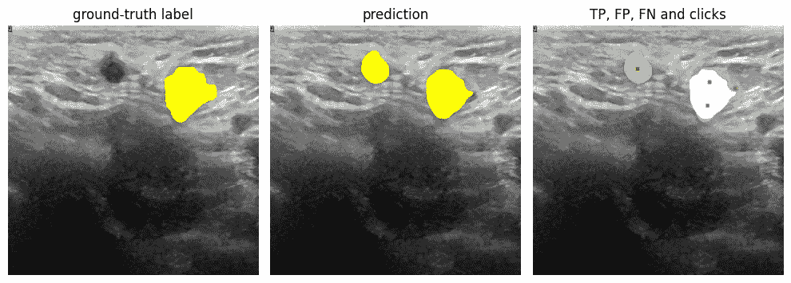

# 通过 Voronoi 分割训练图像分割模型以接受用户反馈，第二部分

> 原文：[`towardsdatascience.com/train-image-segmentation-models-to-accept-user-feedback-via-voronoi-tiling-part-2-1f02eebbddb9?source=collection_archive---------7-----------------------#2023-05-05`](https://towardsdatascience.com/train-image-segmentation-models-to-accept-user-feedback-via-voronoi-tiling-part-2-1f02eebbddb9?source=collection_archive---------7-----------------------#2023-05-05)

## 如何训练现成的图像分割模型以响应用户反馈

 [Florin Andrei](https://florin-andrei.medium.com/?source=post_page-----1f02eebbddb9--------------------------------)

·

[关注](https://medium.com/m/signin?actionUrl=https%3A%2F%2Fmedium.com%2F_%2Fsubscribe%2Fuser%2Faeaeb9d7d248&operation=register&redirect=https%3A%2F%2Ftowardsdatascience.com%2Ftrain-image-segmentation-models-to-accept-user-feedback-via-voronoi-tiling-part-2-1f02eebbddb9&user=Florin+Andrei&userId=aeaeb9d7d248&source=post_page-aeaeb9d7d248----1f02eebbddb9---------------------post_header-----------) 发表在 [Towards Data Science](https://towardsdatascience.com/?source=post_page-----1f02eebbddb9--------------------------------) ·9 分钟阅读·2023 年 5 月 5 日

--

这是关于训练图像分割模型以便这些模型可以响应用户反馈并根据反馈（鼠标点击）调整预测的系列文章的第二部分。

[第一部分](https://medium.com/towards-data-science/train-image-segmentation-models-to-accept-user-feedback-via-voronoi-tiling-part-1-8ab85d410d29)中，我们描述了训练现成图像分割模型以响应用户反馈的一般策略。[第一部分](https://medium.com/towards-data-science/train-image-segmentation-models-to-accept-user-feedback-via-voronoi-tiling-part-1-8ab85d410d29)结束时识别出的问题是，手动生成训练模型所需的点击是繁琐且耗时的，如果数据集非常大和/或模型需要频繁重新训练，这可能根本不可行。生成点击需要自动化——这就是本文的主题。

# 问题

让我们再看一看我们试图解决的问题：

来源：乳腺超声图像数据集

左侧框是带有真实标签的图像；人类专家用黄色标记了感兴趣区域（RoI）；这是我们期望模型预测的理想形状。中间框是模型的实际预测。右侧框显示了真实阳性区域（标签和预测重合的地方）、假阳性区域（模型预测为 RoI，但标签中没有此区域），以及假阴性区域（模型未预测任何内容，但实际存在 RoI）。TP 区域以白色显示，FP 区域以绿色显示，FN 区域以红色显示。

为了引导模型的预测，我们在 TP 和 FN 区域放置了正点击（绿色），在 FP 区域放置了负点击（红色），然后用包含点击的图像训练了新的模型。

对于人类操作员来说，放置点击直观上是简单的。但如果将过程分解成独立的逻辑步骤和标准，它会变得相当复杂：

+   将 TP、FP、FN 区域拆分成独立的连续段

+   丢弃非常小的段作为无关内容

+   对于每个剩余的区域，根据区域面积决定要放置的总点击数

+   点击不能彼此太近

+   点击不能太靠近区域边缘

最后两个标准很困难。模糊性（“不能太近”）以及这两个标准相互矛盾，使得生成点击的过程看似很难保证能收敛到模拟人类操作员所做的解决方案。

然而，我们将展示一种方法，它结合了数学概念（Voronoi 镶嵌）与物理学的提示（能量和模拟退火），以产生所需的结果。

# Voronoi 镶嵌

[维基百科页面](https://en.wikipedia.org/wiki/Voronoi_diagram)对该概念的解释相当到位，如果你研究过[聚类算法](https://en.wikipedia.org/wiki/K-means_clustering)，这可能会感到熟悉，但我在这里也补充几句。

在左侧框架中，我们有一个带有几个种子点的正方形区域。对于任何种子点，框架中必须有一个区域（一个瓦片），其中所有像素距离该种子点比距离其他所有种子点更近。在右侧框架中，我们显示了这些瓦片，用颜色编码以匹配种子。每个瓦片被称为 Voronoi 单元，而寻找这些瓦片的过程称为 Voronoi 镶嵌。

这个例子中的种子是随机选择的。我们得到的镶嵌不是均匀的。为了获得均匀的镶嵌，种子还必须是其对应瓦片的质心（或接近质心）——这称为[质心 Voronoi 镶嵌](https://en.wikipedia.org/wiki/Centroidal_Voronoi_tessellation)。这里是一个非常简单的例子：

为了找到能导致区域的质心 Voronoi 镶嵌或其近似的点击坐标（种子），可以使用类似于[Lloyd 算法](https://en.wikipedia.org/wiki/Lloyd%27s_algorithm)的东西，它非常快速（是[ k 均值聚类](https://en.wikipedia.org/wiki/K-means_clustering)的标准解算器）。这是一个[ Lloyd 算法的模拟器](http://www.bitbanging.space/posts/lloyds-algorithm)，可以在你的浏览器中实时运行。但这里有两个问题：

+   Lloyd 算法通常用于镶嵌矩形区域。尚不清楚它是否（或如何）推广到我们需要镶嵌的任意区域形状。

+   我们只希望在形状（区域和瓦片）为凸时使用质心镶嵌。当形状为凹时，质心可能会落在我们镶嵌区域之外，这完全不是我们想要的（点击点会在区域之外）。

所以我们需要一种能处理任意形状的方案，它能在形状凹陷时保持点击点在区域内，并且在处理简单矩形区域时表现得像 Lloyd 算法。这是对任意区域（即使是凹形）的质心 Voronoi 镶嵌的概括。这是下一节的主题。

# 能量的模拟退火

考虑这种镶嵌：

点击分布足够均匀，点击坐标与质心的距离不远（所有形状均为凸形）。这对于我们的目的来说分布还不错。我们能否找到一个与点击坐标对应的目标函数，尝试迭代地最大化或最小化，以达到这样的分布？

让我们看看点击周围的空间：

像素能量的热图

想象每个图像中的像素都被分配了一个“能量”。只有一个点击对像素的能量有贡献——最接近的点击。其他所有点击都没有贡献。任何像素的能量与其到最近点击的距离成反比。因此，要找出任何像素的能量，我们需要：

+   找到最近的点击

+   计算像素到点击的距离

+   计算距离的倒数，即像素的能量

上面展示的图像只是给定点击分布的像素能量热图。Voronoi 图块的边缘已经由邻近点击之间最暗的区域所提示。

如果我们计算所有像素的总能量，然后移动点击，寻找提供最高总能量的点击位置，这会导致区域的均匀铺设吗？实际上，这正是上面展示的点击分布的获取方式：

+   从完全随机的点击坐标开始

+   计算感兴趣区域内所有像素的总能量

+   对点击坐标应用[模拟退火](https://en.wikipedia.org/wiki/Simulated_annealing)，以找到最大化总能量的坐标

完整代码[在这里展示](https://github.com/FlorinAndrei/segmentation_click_train/blob/main/uniform_clicks.py)。该算法很强大，可以很好地处理凹形状——这是一个在镰刀形分割中以视觉上均匀的方式放置点击的示例：

在凹形中放置点击

分割区域是较浅的蓝色阴影，形状像镰刀，与深色背景形成对比。点击是最亮的点。

点击不会离分割边缘太近，因为那样会减少总能量（分割边缘之外的像素没有能量）。它们也不会彼此靠得太近，因为那样不会“激活”远离紧密点击组的像素。该算法是自我调节的。

注：这个问题与手机塔覆盖问题有相似之处，即你尝试在地图上放置 N 个手机塔，使得信号在大多数区域尽可能强。

# 返回到分割模型

总结一下，我们尝试训练图像分割模型，使其对用户反馈（鼠标点击）做出响应。[总体过程](https://github.com/FlorinAndrei/segmentation_click_train/blob/main/train_models.ipynb)是：

+   将图像数据集分成 5 个折

+   为每个折训练一个分割模型；这会生成一组 5 个**基线模型**

+   使用基线模型对所有图像进行预测；每个模型对训练中未见过的图像进行预测

+   比较预测与标签；提取所有包含真正阳性、假阳性、假阴性预测的区域

+   将 TP、FP、FN 区域拆分成连续的段；丢弃最小的段（少于 100 个像素或更少）

+   对于每个区域，生成均匀的点击，如本文所示；点击次数取决于区域的大小：较大的区域会收到更多的点击，直到一个合理的限制（例如，512x512 像素的图像大约为 4 … 5 次）。

+   将所有图像信息移至 B 通道，腾出 R 和 G 通道，将点击嵌入 R 和 G 通道；TP 和 FN 区域的点击在 G 通道（正点击）；FP 区域的点击在 R 通道（负点击）。

+   使用点击增强图像，在相同的折叠上训练 5 个新的模型；这些是**点击训练模型**，是整个项目的最终成果。

这里是从实际基线模型预测中生成的图像区域均匀点击的一些示例。我们从数据集中选择了 3 张图像，使用基线模型进行预测，并查看每张图像的 TP、FP、FN 区域。每个区域的颜色比背景色浅，点击是每个区域中最亮的点。

来源：乳腺超声图像数据集

点击最终被放置在一个或多或少符合人工操作员放置位置的地方：彼此之间距离不太近，距离边缘也不太近，偏向于每个区域中的大面积或宽区域。点击分布似乎在视觉上是均匀的。

# 最终思考

我们训练了现成的图像分割模型来响应用户反馈，而没有以任何方式更改其架构，也没有在 ImageNet 上从头开始重新训练它们。

点击训练模型的表现不一定优于基线模型。正如这里所示，使用点击进行训练只是使模型能够响应用户反馈。当然，点击训练模型在用于创建 5 个训练折叠的数据集上会远远优于基线模型。这是因为创建点击本质上在训练和测试之间泄漏了数据。在 100% 之前未见过的数据上，点击训练模型和基线模型的表现相同。

这里有更多点击训练模型对用户反馈响应的示例。

视频中展示了两张不同的图像。在这两张图像中，你可以看到模型对其预测的 RoI 有很高的信心。尝试在预测的 RoI 中放置负点击不是很成功——模型继续预测该区域为 RoI。

模型接受对其他区域作为潜在 RoI 的建议。

在这两种情况下，你可以看到模型的两种输出：纯分割和热图。热图只是 RoI 可能性的地图。

# 链接、引用、评论

这个项目是我在数据科学硕士学习最后一个学期的顶点项目的扩展：[`github.com/FlorinAndrei/datascience_capstone_project`](https://github.com/FlorinAndrei/datascience_capstone_project)

本毕业设计及相关工作都在威斯康辛大学拉克罗斯分校的乳腺超声图像计算机辅助诊断（CADBUSI）项目中完成，由 Jeff Baggett 博士监督。[`datascienceuwl.github.io/CADBUSI/`](https://datascienceuwl.github.io/CADBUSI/)

这篇文章的 GitHub 代码库：[`github.com/FlorinAndrei/segmentation_click_train`](https://github.com/FlorinAndrei/segmentation_click_train)

本文中使用的所有超声图像都属于乳腺超声图像数据集，可在 CC BY 4.0 许可下使用。引用链接：

Al-Dhabyani, W., Gomaa, M., Khaled, H., & Fahmy, A. (2019). 乳腺超声图像数据集。*ResearchGate*。2023 年 5 月 1 日检索自[`www.sciencedirect.com/science/article/pii/S2352340919312181`](https://www.sciencedirect.com/science/article/pii/S2352340919312181)

其他链接、引用和评论：

Liu, Q., Zheng, M., Planche, B., Karanam, S., Chen, T., Niethammer, M., & Wu, Z. (2022). PseudoClick：带有点击仿真的交互式图像分割。*arXiv.org*。2023 年 5 月 1 日检索自[`arxiv.org/abs/2207.05282`](https://arxiv.org/abs/2207.05282)

Xie, E., Wang, W., Yu, Z., Anandkumar, A., Alvarez, J. M., & Luo. P. (2021). SegFormer：用于语义分割的简单高效设计与 Transformers。arXiv.org。2023 年 5 月 1 日检索自[`arxiv.org/abs/2105.15203`](https://arxiv.org/abs/2105.15203)

HuggingFace 的预训练 SegFormer 模型：[`huggingface.co/docs/transformers/model_doc/segformer`](https://huggingface.co/docs/transformers/model_doc/segformer)

本文中不属于乳腺超声图像数据集的图像由作者创建。
