# 使用自动梯度下降训练 ImageNet，无需超参数

> 原文：[`towardsdatascience.com/train-imagenet-without-hyperparameters-with-automatic-gradient-descent-31df80a4d249?source=collection_archive---------10-----------------------#2023-04-19`](https://towardsdatascience.com/train-imagenet-without-hyperparameters-with-automatic-gradient-descent-31df80a4d249?source=collection_archive---------10-----------------------#2023-04-19)

## 迈向面向架构的优化

 [Chris Mingard](https://chrismingard.medium.com/?source=post_page-----31df80a4d249--------------------------------)

·

[关注](https://medium.com/m/signin?actionUrl=https%3A%2F%2Fmedium.com%2F_%2Fsubscribe%2Fuser%2F3befb9679b10&operation=register&redirect=https%3A%2F%2Ftowardsdatascience.com%2Ftrain-imagenet-without-hyperparameters-with-automatic-gradient-descent-31df80a4d249&user=Chris+Mingard&userId=3befb9679b10&source=post_page-3befb9679b10----31df80a4d249---------------------post_header-----------) 发表在 [Towards Data Science](https://towardsdatascience.com/?source=post_page-----31df80a4d249--------------------------------) · 8 分钟阅读 · 2023 年 4 月 19 日

--

**TL;DR** 我们提出了一种名为自动梯度下降（AGD）的优化器，可以在无需超参数的情况下训练 ImageNet。这消除了对昂贵且耗时的学习率调整、学习率衰减调度器选择等的需求。我们的论文可以在[这里](https://arxiv.org/pdf/2304.05187.pdf)找到。

我与[Jeremy Bernstein](http://jeremybernste.in)、[Kevin Huang](https://kevinhuang8.github.io/)、[Navid Azizan](https://azizan.mit.edu/) 和[Yisong Yue](http://www.yisongyue.com/)一起工作。请查看 Jeremy 的[GitHub](https://github.com/jxbz/agd)以获取干净的 Pytorch 实现，或者查看我的[GitHub](https://github.com/C1510/agd_exp)以获取更多功能的实验版本。**图 1** 总结了 AGD、Adam 和 SGD 之间的区别。

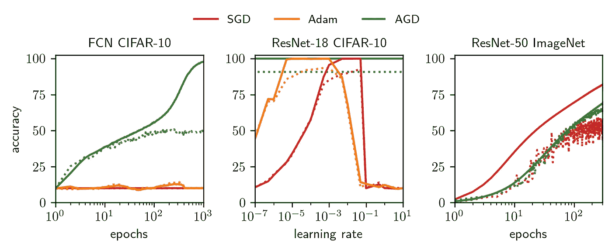

**图 1** 实线表示训练准确度，虚线表示测试准确度。**左侧：** 与我们的方法相比，Adam 和使用默认超参数的 SGD 在 CIFAR-10 的深度全连接网络（FCN）上表现较差。**中间：** Adam 和 SGD 的学习率网格搜索。我们的优化器表现得与完全调优的 Adam 和 SGD 相当。**右侧：** AGD 在 ImageNet 上训练达到了令人满意的测试准确度。

# 动机

任何训练过深度神经网络的人都可能需要调整学习率。这是为了 (1) 确保训练的最大效率，以及 (2) 因为找到合适的学习率可以显著提高整体泛化能力。这也是一件非常麻烦的事。

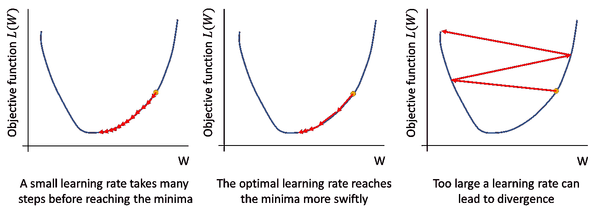

**图 2** 为什么学习率对优化如此重要。为了最大化收敛速度，你需要找到*恰到好处的* *学习率：* 大，但又不至于让目标函数中的非线性项使你偏离轨道。

然而，对于 SGD，最佳学习率高度依赖于正在训练的架构。找到它通常需要代价高昂的网格搜索程序，覆盖多个数量级。此外，其他超参数，如动量和学习率衰减调度器，也需要选择和调整。

我们提出了一种叫做自动梯度下降（AGD）的优化器，它**不需要学习率来训练各种架构和数据集，甚至可以扩展到 ImageNet 上的 ResNet-50**。这消除了任何超参数调整的需求（因为有效学习率和学习率衰减从分析中排除），节省了计算成本，并大大加快了模型训练的过程。

# 我们为什么需要超参数呢？

深度学习系统由许多相互关联的组件组成：架构、数据、损失函数和梯度。这些组件的交互方式有一定的结构，但至今没有人完全确定这个结构，因此我们仍需进行大量调优（如学习率、初始化、调度器），以确保快速收敛，并避免过拟合。

但是，完美地表征这些交互作用可能会移除优化过程中的所有自由度——这些自由度目前由手动超参数调整处理。二阶方法目前使用 Hessian 表征目标对权重扰动的敏感性，并以这种方式移除自由度——然而，这些方法可能计算量大，因此在大型模型中不实用。

我们通过分析这些交互作用来推导 AGD：

1.  我们在给定**数据**和**架构**的情况下，将神经网络的**输出**变化与权重变化联系起来。

1.  我们将**目标**（批次中所有输入的总损失）的变化与神经网络的**输出**变化联系起来。

1.  我们将这些结果结合在一种所谓的*主次优化*方法中。我们**主次优化**目标——即，我们推导出一个与目标相切的目标上界。然后我们可以最小化这个上界，知道这样做会使我们向下移动。这在**图 3**中得到了可视化，其中**红色曲线**显示了目标函数的主次优化，如**蓝色曲线**所示。

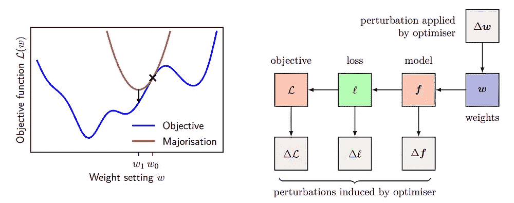

**图 3** **左面板**展示了主次优化的基本思想——通过最小化一系列上界或主次优化（红色），来最小化目标函数（蓝色）。**右面板**展示了权重的变化如何引起函数的变化，这进而引起单个数据点上的损失变化，最终引起目标的变化。我们将*∆L*与*∆W*相关联，并利用它来构建我们的主次优化。

# Pytorch 中的 AGD

在本节中，我们将逐步讲解算法的所有关键部分。有关推导的简略内容，请参见**附录 A**。

## **关于参数化**

我们使用的参数化方法与传统的 PyTorch 默认设置略有不同。虽然可以在不假设这种参数化的情况下推导 AGD，但使用这种参数化可以简化分析。对于完全连接层*l*，我们使用正交初始化，并将其缩放，以使奇异值的大小为 sqrt（*l*的输入维度/ *l*的输出维度）。

我们使用这种归一化，因为它具有 PyTorch 默认参数化所没有的一些良好特性，包括宽度的稳定性、对激活值爆炸的抵抗力以及促进特征学习。这类似于[Greg Yang 和 Edward Hu 的 muP](https://arxiv.org/pdf/2203.03466.pdf)。

## 关于更新

这一步可以分成两个独立的部分。第一部分是计算 eta（η），即“自动学习率”，它会缩放所有层的更新。Eta 对梯度范数有对数依赖——当梯度较小时，eta 大致线性（像标准优化器一样），但当梯度非常大时，对数会自动执行一种梯度裁剪。

每层的更新使用 η 乘以层的权重范数，再乘以标准化梯度，最后除以深度。除以深度的操作负责与深度的缩放。有趣的是，梯度标准化在分析中消失了，因为其他优化器（如 Adam）以启发式方式结合了类似的思想。

# 实验

这些实验的目标是测试 AGD 的能力：(1) 在广泛的架构和数据集上收敛，以及 (2) 实现与调整过的 Adam 和 SGD 相当的测试准确率。

**图 4** 显示了从全连接网络（FCN）到 ResNet-50 的四种架构在 CIFAR-10 到 ImageNet 数据集上的学习曲线。我们将 AGD（用**实线**表示）与标准优化器（用**虚线**表示，ImageNet 上为 SGD，其他三种数据集上为调整过的 Adam）进行了比较。**第一行** 显示了训练目标（损失）和自动学习率 η。**第二行** 显示了训练和测试准确率。**图 5** 比较了 AGD、调整过的 Adam 和调整过的 SGD 在一个 8 层 FCN 上的表现。我们看到这三种算法的性能非常相似，测试准确率几乎一致。

**图 6** 显示 AGD 可以在广泛的深度（2 到 32 层）和宽度（64 到 2048）上训练 FCNs。**图 7** 显示了 AGD 对批量大小（从 32 到 4096）的依赖性，测试了一个 4 层的 FCN。无论批量大小如何，AGD 似乎都能收敛到一个良好的最优解！

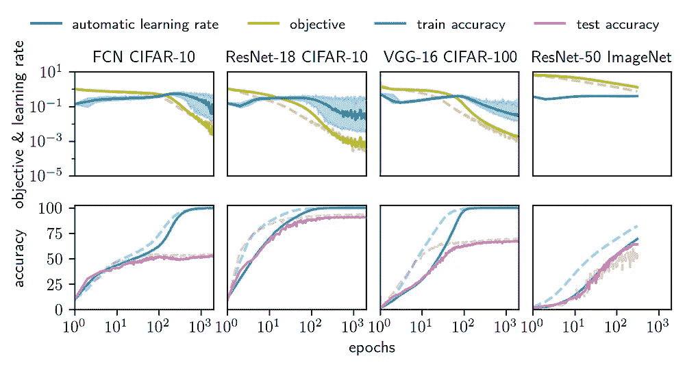

**图 4** AGD 与 Adam 在四种架构上的比较：CIFAR-10 上的深度 16 FCN、CIFAR-10 上的 ResNet-18、CIFAR-100 上的 VGG-16 和 ImageNet-1k 上的 ResNet-50。AGD 在超参数调整的 Adam（需要在多个数量级上进行网格搜索）中保持了合理的速度！这些**实线**表示 AGD，**虚线**表示 Adam（除了 ImageNet，我们使用了 SGD）。**第一行** 显示了训练目标（即损失）和训练期间自动学习率 η 的值。**第二行** 显示了训练和测试准确率。

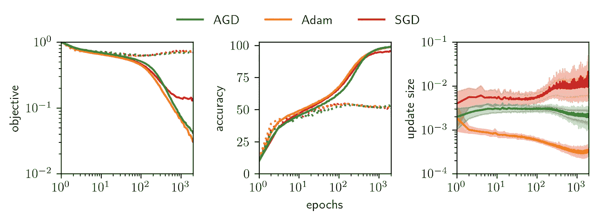

**图 5** AGD 与 Adam 和 SGD 在一个深度 8 的 FCN 上的比较，损失为均方误差。Adam 和 SGD 的学习率经过调整。在**左侧**，我们绘制了训练和测试目标函数（即损失）。**中间** 显示了训练和测试准确率。**右侧** 显示了每个周期中权重的平均、最小和最大变化。

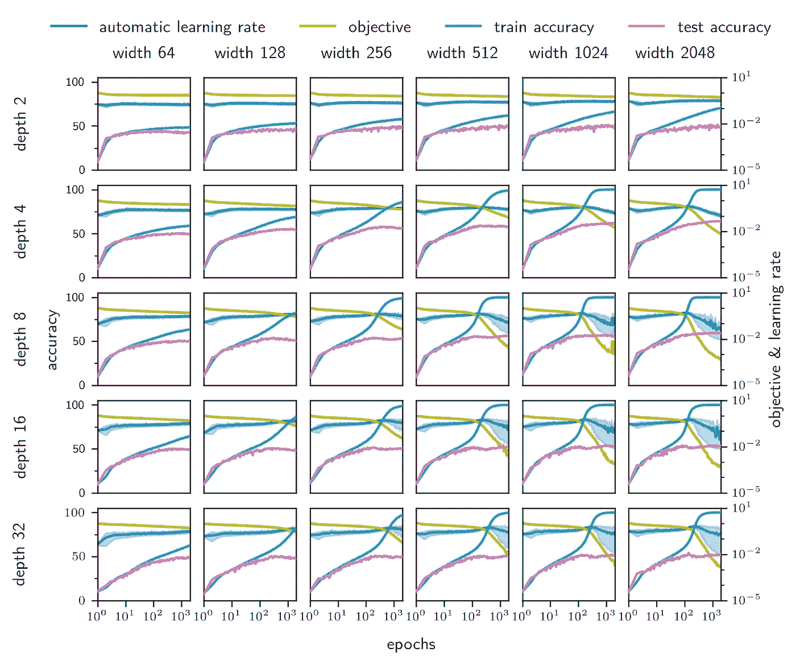

**图 6** AGD 能够在极大的深度和宽度范围内开箱即用地收敛。较小的架构由于能力不足，无法实现低损失，但 AGD 仍能训练它们！

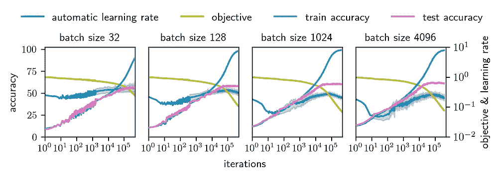

**图 7** 为了确认 AGD 不仅仅适用于批量大小 128，这里展示了一个深度 4 FCN 的各种批量大小。

# 结论

总结来说，这里有一个“架构感知”优化器：自动梯度下降（AGD），能够在各种批量大小下训练从 CIFAR-10 上的 FCN 等小型系统到 ImageNet 上的 ResNet-50 等大型系统，**无需手动调整超参数**。

虽然使用 AGD 并没有消除机器学习中的所有超参数，但剩下的超参数——批量大小和架构——通常属于“尽可能大以填满时间/计算预算”的类别。

然而，仍有许多工作要做。我们没有明确考虑由于批量大小引入的梯度的随机性。我们也没有研究像权重衰减这样的正则化。虽然我们在增加对仿射参数（在批量归一化层中）和偏置项的支持方面做了一些工作，但我们尚未进行广泛测试，也没有像这里的其他结果那样得到理论上的充分证明。

也许最重要的是，我们仍需进行对变压器的分析，并在 NLP 任务上测试 AGD。与 GPT-2 在 OpenWebText2 上的初步实验表明，AGD 在这里也有效！

最后，可以查看 Jeremy 的[GitHub](https://github.com/jxbz/agd)以获取干净版本，或者我的[GitHub](https://github.com/C1510/agd_exp)以获取支持偏置项和仿射参数的开发版本，如果你想尝试 AGD！我们希望你会觉得它有用。

# 附录 A

我们将在这里简要介绍证明的重要步骤。这是为了那些想要了解主要思想如何汇聚的人，而无需查看我们论文中的完整证明，论文可以在[这里](https://arxiv.org/abs/2304.05187)找到。

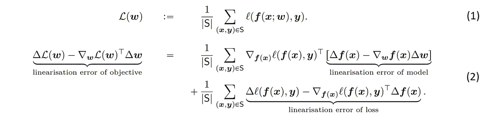

方程（1）明确规定了如何将数据集*S*上的总体目标分解为单个数据点。*L*表示损失，*x*为输入，*y*为目标，*w*为权重。方程（2）展示了目标的线性化误差的分解——在给定某些权重变化*Δw*时，高阶项对损失变化*ΔL(w)*的贡献。目标的线性化误差很重要，因为它等于在权重*w*处扩展的损失中高阶项的贡献——界定这一点将告诉我们可以移动多远，直到高阶项变得重要，并确保我们迈出的步伐是合理的、向下的。

方程（2）右侧的第一个项是两个高维向量的内积，即模型的线性化误差和关于*f(x)*的损失的导数。由于没有明确的理由说明这两个向量应该对齐，我们假设它们的内积为零。

将*L(W+ΔW)*添加到方程（2）的两边，并注意到损失的线性化误差恰好是 Bregman 散度，我们可以简化符号：

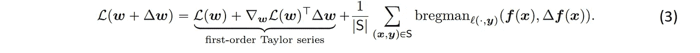

Bregman 散度是衡量两点之间距离的度量（在这种情况下是神经网络的两个不同参数选择的输出），其定义基于严格凸函数——在这里是损失函数。

计算 Bregman 散度对于均方误差损失实际上非常简单，并给出了

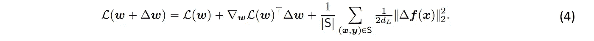

其中 dₗ 是网络的输出维度。我们现在断言以下缩放。这些缩放有些任意，但将它们以这种形式表示将使分析变得更加简单。

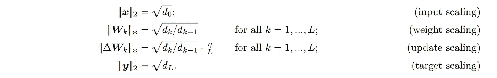

我们使用了对网络输出大小的以下两个界限。方程 (5) 对网络输出的幅度进行界限，这来自于对全连接网络应用（输入缩放）和（权重缩放）。方程 (6) 对权重 W 的变化带来的 f(x) 的最大变化进行界限。方程 (6) 中的第二个不等式在大深度时最紧，但适用于任何深度。

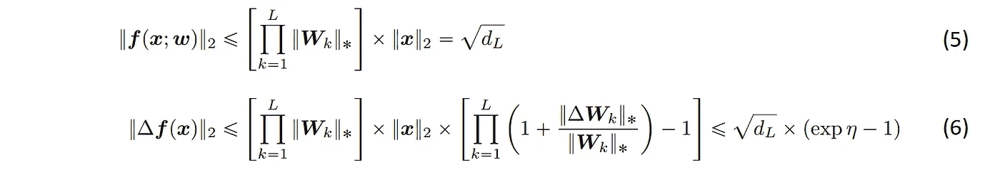

现在，我们将方程 (6) 代回方程 (4) 中，并将所有项展开以得到方程 (7)。

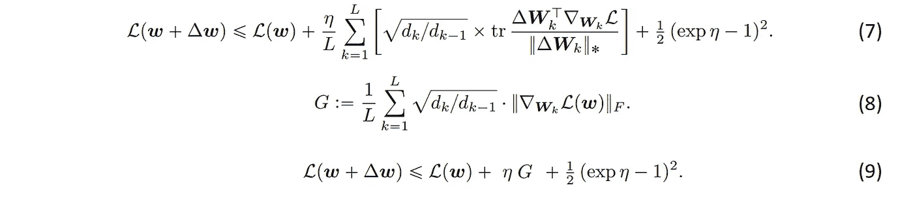

我们可以将方程 (7) 中的总和替换为 G，这在方程 (8) 中定义，并在关于梯度条件的附加假设下讨论，详细内容请参阅论文。最后，我们得到方程 (9)——这就是**主化**——**图 3**中的红线。我们通过对 η 求导来**最小化**主化，并求解结果中的二次方程，保留正解。这给出了以下更新

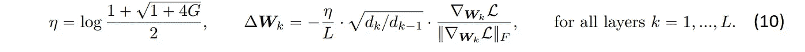

这就结束了我们对自动梯度下降的推导。如果你有任何评论、问题或其他反馈，请告知我们。

博客中的所有图像均由我们[论文](https://arxiv.org/pdf/2304.05187.pdf)的作者制作。图 2 的灵感来源于这个[图表](https://www.jeremyjordan.me/nn-learning-rate/)。
