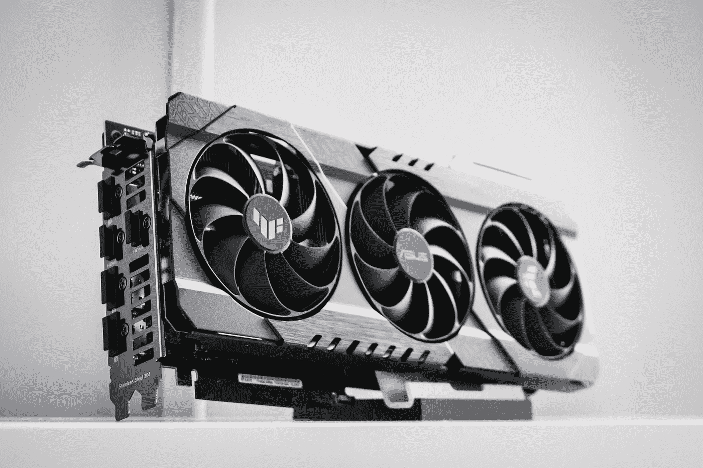
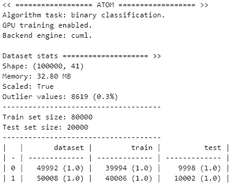
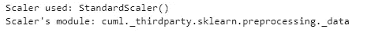
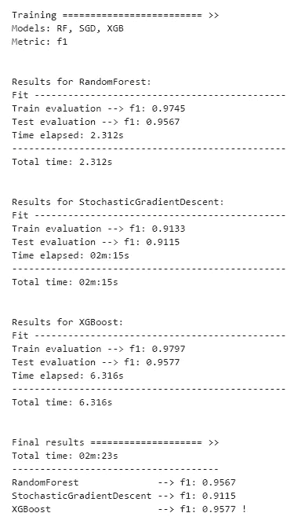
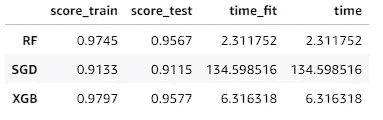
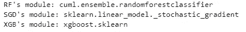
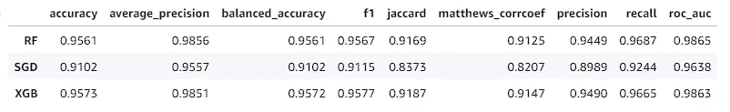

# 通过更改仅一行代码，在 GPU 上训练你的 ML 模型

> 原文：[`towardsdatascience.com/train-your-ml-models-on-gpu-changing-just-one-line-of-code-5f8ff96a91ba?source=collection_archive---------12-----------------------#2023-03-20`](https://towardsdatascience.com/train-your-ml-models-on-gpu-changing-just-one-line-of-code-5f8ff96a91ba?source=collection_archive---------12-----------------------#2023-03-20)

## 利用 cuML 和 ATOM 让你的机器学习管道快速如闪电

[](https://tvdboom.medium.com/?source=post_page-----5f8ff96a91ba--------------------------------)[](https://towardsdatascience.com/?source=post_page-----5f8ff96a91ba--------------------------------) [Marco vd Boom](https://tvdboom.medium.com/?source=post_page-----5f8ff96a91ba--------------------------------)

·

[关注](https://medium.com/m/signin?actionUrl=https%3A%2F%2Fmedium.com%2F_%2Fsubscribe%2Fuser%2Fe2091b627921&operation=register&redirect=https%3A%2F%2Ftowardsdatascience.com%2Ftrain-your-ml-models-on-gpu-changing-just-one-line-of-code-5f8ff96a91ba&user=Marco+vd+Boom&userId=e2091b627921&source=post_page-e2091b627921----5f8ff96a91ba---------------------post_header-----------) 发表在 [Towards Data Science](https://towardsdatascience.com/?source=post_page-----5f8ff96a91ba--------------------------------) ·5 分钟阅读·2023 年 3 月 20 日[](https://medium.com/m/signin?actionUrl=https%3A%2F%2Fmedium.com%2F_%2Fvote%2Ftowards-data-science%2F5f8ff96a91ba&operation=register&redirect=https%3A%2F%2Ftowardsdatascience.com%2Ftrain-your-ml-models-on-gpu-changing-just-one-line-of-code-5f8ff96a91ba&user=Marco+vd+Boom&userId=e2091b627921&source=-----5f8ff96a91ba---------------------clap_footer-----------)

--

[](https://medium.com/m/signin?actionUrl=https%3A%2F%2Fmedium.com%2F_%2Fbookmark%2Fp%2F5f8ff96a91ba&operation=register&redirect=https%3A%2F%2Ftowardsdatascience.com%2Ftrain-your-ml-models-on-gpu-changing-just-one-line-of-code-5f8ff96a91ba&source=-----5f8ff96a91ba---------------------bookmark_footer-----------)

图片由 [Thomas Foster](https://unsplash.com/de/@thomasfos?utm_source=medium&utm_medium=referral) 提供，来源于 [Unsplash](https://unsplash.com/?utm_source=medium&utm_medium=referral)

## 简介

图形处理单元 (GPU) 可以显著加速预处理步骤或训练机器学习模型的计算。训练模型通常涉及计算密集型矩阵乘法和其他可以利用 GPU 大规模并行架构的操作。在单个处理器上训练大型数据集可能需要几个小时。然而，如果将这些任务转移到 GPU 上，你可以将训练时间减少到几分钟。

在这个故事中，我们将展示如何使用 [ATOM](https://github.com/tvdboom/ATOM) 库轻松在 GPU 上训练你的机器学习管道。ATOM 是一个开源 Python 包，旨在帮助数据科学家加速机器学习管道的探索。如果你想了解库的温和介绍，请阅读 这个故事。

## 设置

ATOM 使用 [cuML](https://github.com/rapidsai/cuml) 作为 GPU 训练的后端库。cuML 是一套快速、GPU 加速的机器学习算法，旨在数据科学和分析任务中使用。不幸的是，cuML 不能通过 pip 安装，因此未作为 ATOM 的依赖项安装。请阅读 [这里](https://docs.rapids.ai/install) 了解如何安装它。

cuML 的要求需要考虑：

+   操作系统：Ubuntu 18.04/20.04 或 CentOS 7/8，使用 gcc/++ 9.0+，或 Windows 10+，使用 WSL2

+   GPU：NVIDIA Pascal™ 或更高版本，具有 [计算能力](https://developer.nvidia.com/cuda-gpus) 6.0+

+   驱动程序：CUDA 和 NVIDIA 驱动程序版本 11.0、11.2、11.4 或 11.5

**提示：** 查看 [这个仓库](https://github.com/rapidsai-community/rapids-smsl) 以在 [SageMaker Studio Lab](https://studiolab.sagemaker.aws/) 上安装 cuML。

## 示例

在使用 GPU 的 atom 中训练变换器和模型就像

使用参数 `device="gpu"` 初始化 *atom*。`device` 参数接受任何遵循 [SYCL_DEVICE_FILTER](https://github.com/intel/llvm/blob/sycl/sycl/doc/EnvironmentVariables.md#sycl_device_filter) 过滤器选择器的字符串。示例包括：

+   device=”cpu” （使用 CPU）

+   device=”gpu” （使用默认 GPU）

+   device=”gpu:0" （使用第一个 GPU）

+   device=”gpu:1" （使用第二个 GPU）

**注意：** ATOM 不支持多 GPU 训练。如果有多个

机器上的 GPU 和 `device` 参数未指定使用哪个

一个可用时，默认使用第一个。

使用`engine`参数在 cuML 和 sklearnex 执行引擎之间进行选择。在这个故事中，我们将专注于 cuML。[XGBoost](https://tvdboom.github.io/ATOM/v5.1/API/models/xgb/)、[LightGBM](https://tvdboom.github.io/ATOM/v5.1/API/models/lgb/)和[CatBoost](https://tvdboom.github.io/ATOM/v5.1/API/models/catb/)模型配备了自己的 GPU 引擎。设置 device="gpu"即可通过 GPU 加速这些模型，无论 engine 参数如何。点击[这里](https://tvdboom.github.io/ATOM/v5.1/user_guide/accelerating/#supported-estimators_1)查看支持 GPU 加速的变换器和模型概述。

**提示：** 如果你没有 GPU 访问权限，可以使用在线云服务，如[Google Colab](https://colab.research.google.com/)或[Sagemaker Studio Lab](https://studiolab.sagemaker.aws/)来尝试。请确保选择 GPU 计算类型。查看[这个笔记本](https://studiolab.sagemaker.aws/import/github/tvdboom/ATOM/blob/master/examples/accelerating_cuml.ipynb)以开始使用。

让我们开始这个例子。

```py
from atom import ATOMClassifier
from sklearn.datasets import make_classification

# Create a dummy dataset
X, y = make_classification(n_samples=100000, n_features=40)

atom = ATOMClassifier(X, y, device="gpu", engine="cuml", verbose=2)
```



不仅模型，变换器也可以从 GPU 加速中受益。例如，将特征缩放到 mean=0 和 std=1。

```py
atom.scale()

print(atom.dataset)
```


由于我们声明要使用 cuML 引擎，ATOM 会在有可用时自动从该库中选择变换器。

```py
print(f"Scaler used: {atom.standard}")
print(f"Scaler's module: {atom.standard.__class__.__module__}")
```



让我们训练三个模型：[随机森林](https://tvdboom.github.io/ATOM/v5.1/API/models/rf/)在 cuML 中可用，[随机梯度下降](https://tvdboom.github.io/ATOM/v5.1/API/models/sgd/)不可用，[XGBoost](https://tvdboom.github.io/ATOM/v5.1/API/models/xgb/)有自己的 GPU 实现。

```py
atom.run(models=["RF", "SGD", "XGB"])
```



```py
atom.results
```



注意模型之间训练时间的巨大差异！

如果我们检查底层估算器，会发现 RF 模型确实是在 GPU 上训练的，SGD 没有（因为它在 cuML 中不可用，ATOM 回退到默认的 sklearn 实现），而 XGB 模型确实使用其本地模块在 GPU 上训练。

```py
for m in atom.models:
    print(f"{m}'s module: {atom[m].estimator.__class__.__module__}")
```



最后，分析结果像往常一样简单。

```py
atom.evaluate()
```



## 结论

我们已经展示了如何使用 ATOM 包在 GPU 上训练你的机器学习管道。ATOM 也能在 CPU 上加速。阅读[这个故事](https://medium.com/towards-data-science/make-your-sklearn-models-up-to-100-times-faster-563bb682665e)了解如何操作。

欲了解更多关于 ATOM 的信息，请查看该包的[文档](https://tvdboom.github.io/ATOM/)。对于错误或功能请求，请随时在[GitHub](https://github.com/tvdboom/ATOM)上提出问题或发邮件给我。

参考文献：

+   所有图表和图片（除封面图外）均由作者创建。

相关故事：

[ATOM: 一个用于快速探索机器学习管道的 Python 包](https://towardsdatascience.com/atom-a-python-package-for-fast-exploration-of-machine-learning-pipelines-653956a16e7b?source=post_page-----5f8ff96a91ba--------------------------------)

### 自动化优化建模工具（ATOM）是一个开源 Python 包，旨在帮助数据科学家进行…

[深度学习管道探索变得简单](https://towardsdatascience.com/exploration-of-deep-learning-pipelines-made-easy-e1cf649892bc?source=post_page-----5f8ff96a91ba--------------------------------)

### 如何使用正确的包在 Python 中进行快速深度学习实验的简单指南

[使你的 sklearn 模型快上 100 倍](https://towardsdatascience.com/make-your-sklearn-models-up-to-100-times-faster-563bb682665e?source=post_page-----5f8ff96a91ba--------------------------------)

### 如何通过仅更改一行代码显著减少训练时间

[使你的 sklearn 模型快上 100 倍](https://towardsdatascience.com/make-your-sklearn-models-up-to-100-times-faster-563bb682665e?source=post_page-----5f8ff96a91ba--------------------------------)
