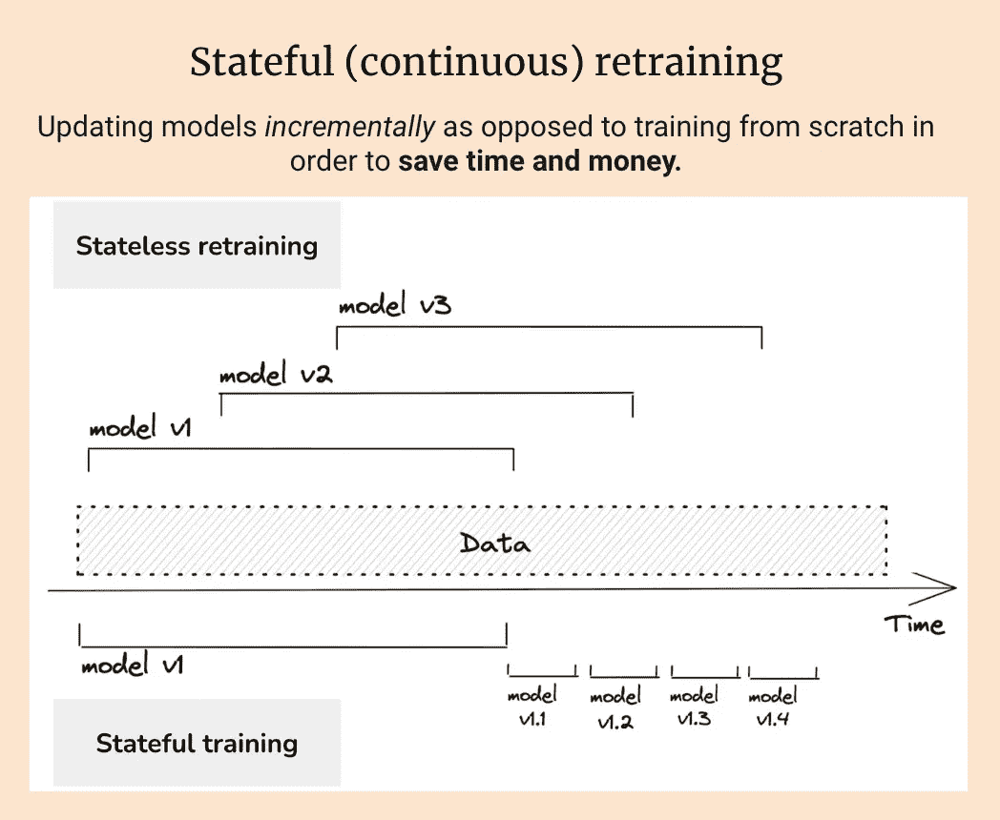
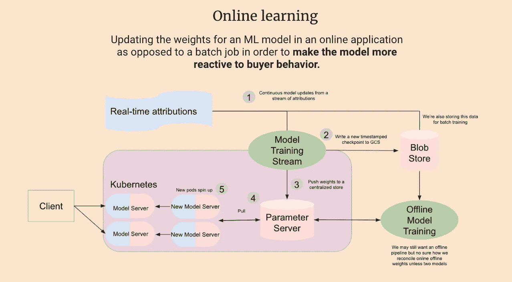

# 在 Kafka 流上训练机器学习模型

> 原文：[`towardsdatascience.com/training-a-machine-learning-model-on-a-kafka-stream-a5079f543e98?source=collection_archive---------6-----------------------#2023-06-09`](https://towardsdatascience.com/training-a-machine-learning-model-on-a-kafka-stream-a5079f543e98?source=collection_archive---------6-----------------------#2023-06-09)

## 使用由 Kafka 生产者生成的训练数据在线和近实时地更新机器学习模型

[](https://medium.com/@kylegallatin?source=post_page-----a5079f543e98--------------------------------)[](https://towardsdatascience.com/?source=post_page-----a5079f543e98--------------------------------) [Kyle Gallatin](https://medium.com/@kylegallatin?source=post_page-----a5079f543e98--------------------------------)

·

[关注](https://medium.com/m/signin?actionUrl=https%3A%2F%2Fmedium.com%2F_%2Fsubscribe%2Fuser%2F51ff4b76ebf4&operation=register&redirect=https%3A%2F%2Ftowardsdatascience.com%2Ftraining-a-machine-learning-model-on-a-kafka-stream-a5079f543e98&user=Kyle+Gallatin&userId=51ff4b76ebf4&source=post_page-51ff4b76ebf4----a5079f543e98---------------------post_header-----------) 发表在 [Towards Data Science](https://towardsdatascience.com/?source=post_page-----a5079f543e98--------------------------------) ·5 分钟阅读·2023 年 6 月 9 日[](https://medium.com/m/signin?actionUrl=https%3A%2F%2Fmedium.com%2F_%2Fvote%2Ftowards-data-science%2Fa5079f543e98&operation=register&redirect=https%3A%2F%2Ftowardsdatascience.com%2Ftraining-a-machine-learning-model-on-a-kafka-stream-a5079f543e98&user=Kyle+Gallatin&userId=51ff4b76ebf4&source=-----a5079f543e98---------------------clap_footer-----------)

--

[](https://medium.com/m/signin?actionUrl=https%3A%2F%2Fmedium.com%2F_%2Fbookmark%2Fp%2Fa5079f543e98&operation=register&redirect=https%3A%2F%2Ftowardsdatascience.com%2Ftraining-a-machine-learning-model-on-a-kafka-stream-a5079f543e98&source=-----a5079f543e98---------------------bookmark_footer-----------)

照片由 [Jonathan Borba](https://unsplash.com/@jonathanborba?utm_source=medium&utm_medium=referral) 提供，发布于 [Unsplash](https://unsplash.com/?utm_source=medium&utm_medium=referral)

最近，我对*在线机器学习*越来越感兴趣——即在生产环境中更新 ML 模型的权重。除了这一主题为我提供的有趣的架构挑战外，这种方法还具有巨大的潜力。2021 年 Grubhub 的这项[研究](https://arxiv.org/abs/2107.07106)通过利用在线学习展示了+20%的指标提升*和* 45 倍的成本节约，我非常支持节省开支以赚取更多收益。



状态重训练——Chip Huyen 授权提供的图片



在线学习——作者提供的图片

从实际的角度来看，与数据流和流式架构的工作对机器学习从业者来说仍然是相当新的。除了创建实时训练数据流外，关于在在线环境中使用这种数据源来更新模型的资源相对较少。在这篇文章中，我将展示：

+   设置 Kafka 实例

+   创建一个生成训练数据的生产者

+   创建一个使用这些训练数据更新 ML 模型的消费者

# 使用 Docker 运行 Kafka

我在本地使用 Kafka 的首选方法是通过`docker-compose`。如果你的环境中还没有安装，你可以按照[这里](https://docs.docker.com/compose/install/)的说明进行安装。

Shuyi Yang 的相关文章提供了这种方法的高层次概述，我们可以使用一个类似的`docker-compose.yaml`文件来创建本地 Kafka 和 Zookeeper 实例，并在 9092 端口上暴露 Kafka：

```py
version: '3'
services:
  zookeeper:
    image: wurstmeister/zookeeper:3.4.6
    ports:
     - "2181:2181"
  kafka:
    depends_on: 
      - zookeeper
    image: wurstmeister/kafka
    ports:
     - "9092:9092"
    expose:
     - "9093"
    environment:
      KAFKA_ADVERTISED_LISTENERS: INSIDE://kafka:9093,OUTSIDE://localhost:9092
      KAFKA_LISTENER_SECURITY_PROTOCOL_MAP: INSIDE:PLAINTEXT,OUTSIDE:PLAINTEXT
      KAFKA_LISTENERS: INSIDE://0.0.0.0:9093,OUTSIDE://0.0.0.0:9092
      KAFKA_INTER_BROKER_LISTENER_NAME: INSIDE
      KAFKA_ZOOKEEPER_CONNECT: zookeeper:2181
      KAFKA_CREATE_TOPICS: "ml_training_data:1:1"
    volumes:
     - /var/run/docker.sock:/var/run/docker.sock
```

它还创建了一个名为`ml_training_data`的 Kafka 主题，我们稍后会用到。你可以通过切换到包含该文件的目录并运行以下命令来执行该文件：

```py
docker-compose up
```

# 一个用于训练数据的 Kafka 生产者

首先，让我们安装所需的 Python 库：

```py
python -m pip install kafka-python river 
```

接下来，我们需要创建一个人工生成的训练数据源，将其写入我们的 Kafka 主题。为此，我们将使用[River Python 库](https://riverml.xyz/0.15.0/)，它具有易于使用的流数据 API：

```py
from time import sleep
from json import dumps
import random

from river import datasets
from kafka import KafkaProducer

# create a kafka product that connects to Kafka on port 9092
producer = KafkaProducer(
    bootstrap_servers=["localhost:9092"],
    value_serializer=lambda x: dumps(x).encode("utf-8"),
)

# Initialize the River phishing dataset.
# This dataset contains features from web pages 
# that are classified as phishing or not.
dataset = datasets.Phishing()

# Send observations to the Kafka topic one-at-a-time with a random sleep
for x, y in dataset:
    print(f"Sending: {x, y}")
    data = {"x": x, "y": y}
    producer.send("ml_training_data", value=data)
    sleep(random.random())
```

上面的代码使用了玩具[River Phishing 数据集](https://riverml.xyz/0.15.0/api/datasets/Phishing/)（[CC BY 4.0](http://archive.ics.uci.edu/dataset/379/website+phishing)），并将标记的数据观察值逐一发送到我们的 Kafka 主题。这个数据集包含来自网页的特征，这些特征被分类为钓鱼或非钓鱼。数据集中的样本是这样的元组：

```py
 [({'empty_server_form_handler': 0.0,
   'popup_window': 0.0,
   'https': 0.0,
   'request_from_other_domain': 0.0,
   'anchor_from_other_domain': 0.0,
   'is_popular': 0.5,
   'long_url': 1.0,
   'age_of_domain': 1,
   'ip_in_url': 1},
  True),
 ({'empty_server_form_handler': 1.0,
   'popup_window': 0.0,
   'https': 0.5,
   'request_from_other_domain': 0.5,
   'anchor_from_other_domain': 0.0,
   'is_popular': 0.5,
   'long_url': 0.0,
   'age_of_domain': 1,
   'ip_in_url': 0},
  True)]
```

首先，运行生产者：

```py
python producer.py
```

然后你应该在控制台中看到以下内容：

```py
 Sending: ({'empty_server_form_handler': 1.0, 'popup_window': 0.5, 'https': 1.0, 'request_from_other_domain': 1.0, 'anchor_from_other_domain': 0.5, 'is_popular': 0.5, 'long_url': 0.0, 'age_of_domain': 1, 'ip_in_url': 1}, False)
Sending: ({'empty_server_form_handler': 0.0, 'popup_window': 0.5, 'https': 0.0, 'request_from_other_domain': 0.0, 'anchor_from_other_domain': 0.0, 'is_popular': 0.5, 'long_url': 0.0, 'age_of_domain': 1, 'ip_in_url': 0}, True)
Sending: ({'empty_server_form_handler': 1.0, 'popup_window': 1.0, 'https': 1.0, 'request_from_other_domain': 0.0, 'anchor_from_other_domain': 1.0, 'is_popular': 0.0, 'long_url': 0.5, 'age_of_domain': 1, 'ip_in_url': 0}, False)
Sending: ({'empty_server_form_handler': 0.5, 'popup_window': 0.0, 'https': 0.0, 'request_from_other_domain': 0.5, 'anchor_from_other_domain': 1.0, 'is_popular': 0.5, 'long_url': 1.0, 'age_of_domain': 0, 'ip_in_url': 0}, True)
Sending: ({'empty_server_form_handler': 0.0, 'popup_window': 0.0, 'https': 1.0, 'request_from_other_domain': 1.0, 'anchor_from_other_domain': 0.0, 'is_popular': 1.0, 'long_url': 0.0, 'age_of_domain': 0, 'ip_in_url': 0}, True)
Sending: ({'empty_server_form_handler': 1.0, 'popup_window': 1.0, 'https': 1.0, 'request_from_other_domain': 0.5, 'anchor_from_other_domain': 0.0, 'is_popular': 1.0, 'long_url': 1.0, 'age_of_domain': 0, 'ip_in_url': 0}, False)
```

# 一个用于训练 ML 模型的 Kafka 消费者

编写一个简单的 Kafka 消费者将允许我们读取从流中推送过来的数据，并用来更新模型的权重。

```py
 from json import loads
from time import sleep

from kafka import KafkaConsumer

from river import linear_model
from river import compose
from river import preprocessing
from river import metrics

# use rocauc as the metric for evaluation
metric = metrics.ROCAUC()

# create a simple LR model with a scaler
model = compose.Pipeline(
    preprocessing.StandardScaler(), linear_model.LogisticRegression()
)

# create our Kafka consumer
consumer = KafkaConsumer(
    "ml_training_data",
    bootstrap_servers=["localhost:9092"],
    auto_offset_reset="earliest",
    enable_auto_commit=True,
    group_id="my-group-id",
    value_deserializer=lambda x: loads(x.decode("utf-8")),
)

# use each event to update our model and print the metrics
for event in consumer:
    event_data = event.value
    try:
        x = event_data["x"]
        y = event_data["y"]
        y_pred = model.predict_proba_one(x)
        model.learn_one(x, y)
        metric.update(y, y_pred)
        print(metric)
    except:
        print("Processing bad data...")
```

上述代码使用 River 的 `LogisticRegression` 类初始化了一个简单的 ML 模型。然后，我们不断处理事件，并使用它们来更新我们的 ML 模型——为每个添加的样本打印 ROCAUC 指标。

要开始训练，请运行：

```py
python consumer.py
```

随着模型逐渐学习观察到的内容，你应该在控制台看到类似的输出！

```py
ROCAUC: 87.12%
ROCAUC: 87.29%
ROCAUC: 87.42%
ROCAUC: 87.29%
ROCAUC: 87.42%
```

# 结论

在可以向模型提供实时或近实时标记数据的领域中，持续训练和在线学习具有*巨大*的潜力。所有代码和说明可以在[这个 Github 仓库](https://github.com/kylegallatin/kafka-ml-training)中找到。更多内容敬请期待！
