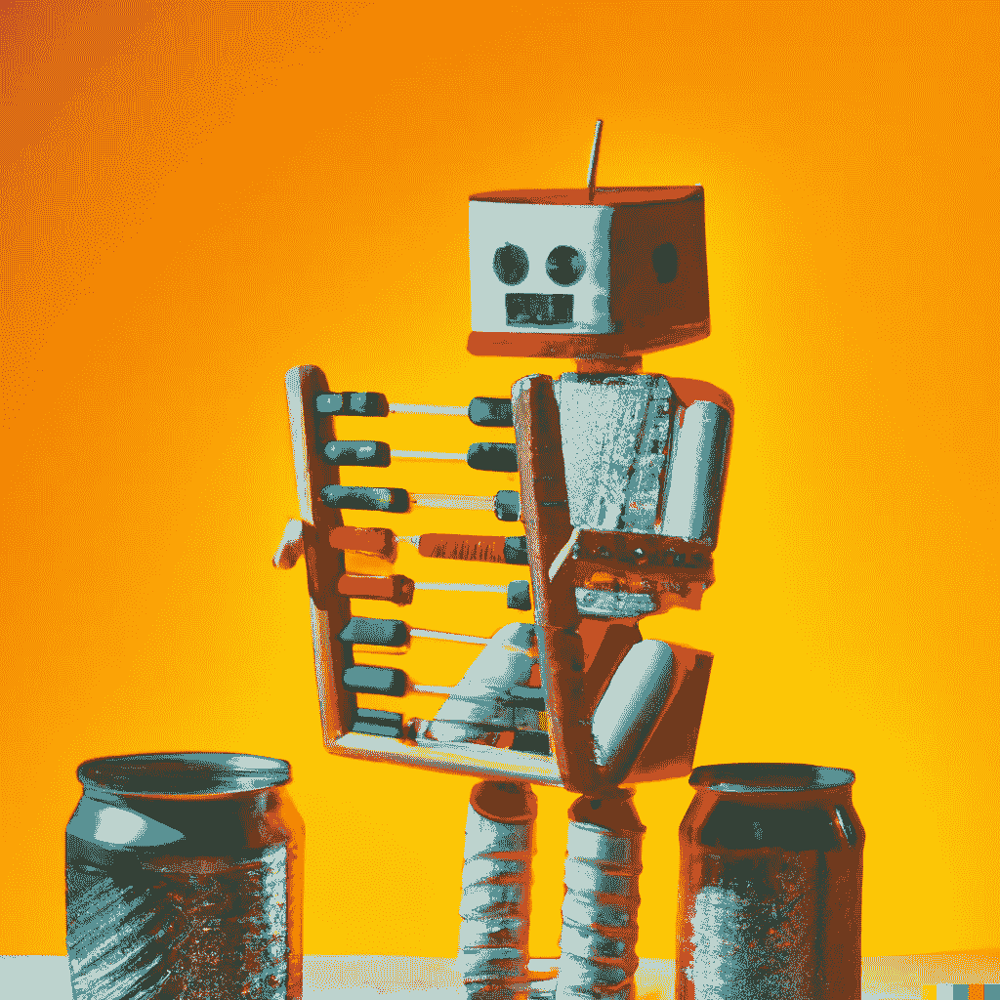
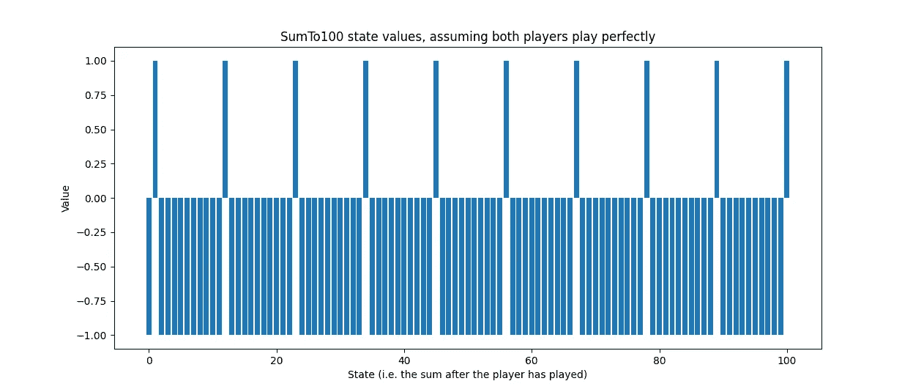
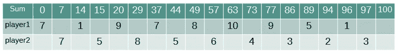
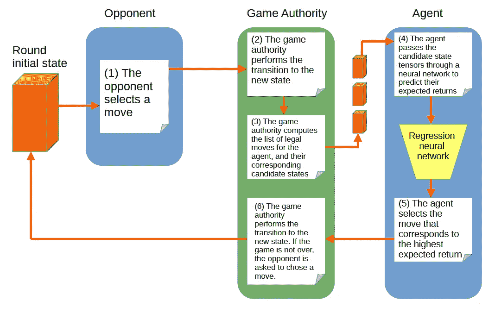
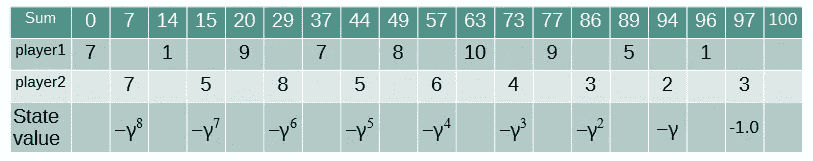
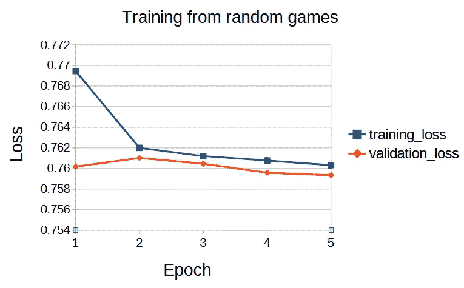
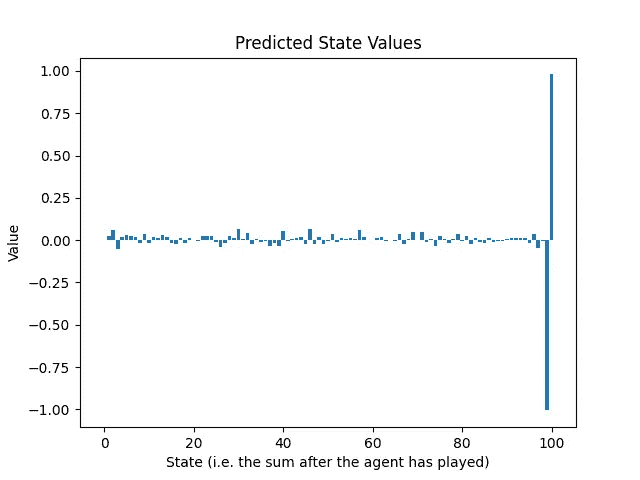
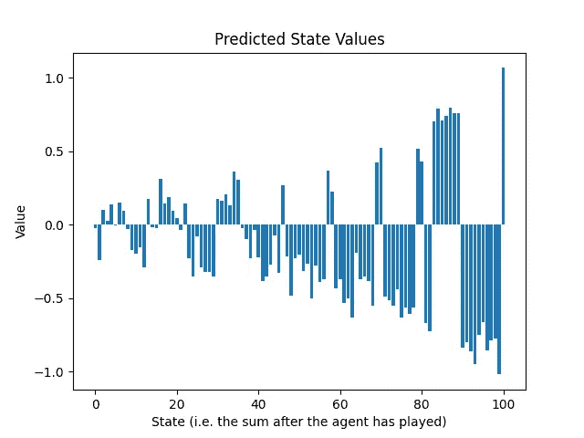
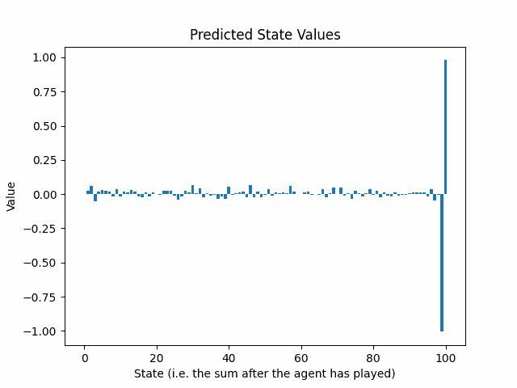

# 通过自我对弈训练一个代理以掌握简单游戏

> 原文：[`towardsdatascience.com/training-an-agent-to-master-a-simple-game-through-self-play-88bdd0d60928?source=collection_archive---------5-----------------------#2023-09-06`](https://towardsdatascience.com/training-an-agent-to-master-a-simple-game-through-self-play-88bdd0d60928?source=collection_archive---------5-----------------------#2023-09-06)

## 模拟游戏并预测结果。

 [Sébastien Gilbert](https://sebastiengilbert.medium.com/?source=post_page-----88bdd0d60928--------------------------------)

·

[关注](https://medium.com/m/signin?actionUrl=https%3A%2F%2Fmedium.com%2F_%2Fsubscribe%2Fuser%2F975aef8c496a&operation=register&redirect=https%3A%2F%2Ftowardsdatascience.com%2Ftraining-an-agent-to-master-a-simple-game-through-self-play-88bdd0d60928&user=S%C3%A9bastien+Gilbert&userId=975aef8c496a&source=post_page-975aef8c496a----88bdd0d60928---------------------post_header-----------) 发表于 [Towards Data Science](https://towardsdatascience.com/?source=post_page-----88bdd0d60928--------------------------------) ·8 min read·2023 年 9 月 6 日

--

一个计算一些加法的机器人。图片由作者提供，借助 DALL-E 2。

# 介绍

难道不令人惊叹吗？在完美信息游戏中，你需要的一切都在游戏规则中可见。

不幸的是，对于像我这样的普通人来说，阅读新游戏的规则只是学习玩复杂游戏旅程的一小部分。大部分时间都花在玩游戏上，理想情况下是与实力相当的玩家（或一个足够耐心的更强的玩家，帮助我们暴露我们的弱点）对战。经常失败并希望偶尔获胜提供了心理上的惩罚和奖励，促使我们逐步提高游戏水平。

或许，在不久的将来，语言模型将能够阅读像国际象棋这样的复杂游戏的规则，并从一开始就以最高水平进行游戏。在此期间，我提出一个更为谦虚的挑战：通过自我对弈学习。

在这个项目中，我们将训练一个代理，通过观察之前版本的比赛结果来学习**完美信息的两人游戏**。该代理将为任何游戏状态近似一个值（游戏期望结果）。作为额外挑战，我们的代理不允许维持状态空间的查找表，因为这种方法对于复杂游戏而言是不切实际的。

# 解决 SumTo100

## 游戏

我们要讨论的游戏是 SumTo100。游戏的目标是通过将 1 到 10 之间的数字相加来达到 100。以下是规则：

1.  初始化和 = 0。

1.  选择一个首位玩家。两位玩家轮流进行。

1.  当和 < 100 时：

+   玩家选择一个 1 到 10 之间的数字（包括 1 和 10）。选定的数字会被加到总和中，但不会超过 100。

+   如果和 < 100，另一位玩家继续进行（即，我们返回到第 3 点的顶部）。

4. 加上最后一个数字（达到 100）的玩家获胜。

两只蜗牛各自忙着自己的事。图像由作者提供，DALL-E 2 协助完成。

从这样一个简单的游戏开始有许多好处：

+   状态空间只有 101 个可能的值。

+   状态可以被绘制在一维网格上。这一特点将使我们能够将代理学习到的状态值函数表示为一维条形图。

+   最佳策略已知：

    - 达到一个和为 11n + 1，其中 n ∈ {0, 1, 2, …, 9}

我们可以可视化最佳策略的状态值：

图 1：SumTo100 的最佳状态值。图像由作者提供。

游戏状态是代理完成其回合后的总和。值为 1.0 意味着代理肯定会赢（或已经赢了），而值为-1.0 则意味着代理肯定会输（假设对手进行最佳玩法）。中间值代表估计回报。例如，状态值为 0.2 表示稍微积极的状态，而状态值为-0.8 表示可能的失败。

如果你想深入了解代码，执行整个训练过程的脚本是*learn_sumTo100.sh*，[在这个仓库](https://github.com/sebastiengilbert73/tutorial_learnbyplay)。否则，请耐心等待，我们将通过高层次的描述来介绍我们的代理如何通过自我对弈进行学习。

## 由随机玩家进行的游戏生成

我们希望代理从其先前版本所玩的游戏中学习，但在第一轮中，由于代理尚未学习任何东西，我们将不得不模拟*随机玩家*进行的游戏。在每一步，玩家将从游戏权威（编码游戏规则的类）处获得合法移动的列表，基于当前的游戏状态。随机玩家将从此列表中随机选择一个动作。

图 2 是两个随机玩家进行游戏的示例：

图 2：随机玩家进行游戏的示例。图像由作者提供。

在这种情况下，第二个玩家通过达到总和 100 赢得了游戏。

我们将实现一个代理，该代理访问一个神经网络，该网络以游戏状态（在代理已经玩过之后）作为输入，并输出该游戏的预期回报。对于任何给定的状态（在代理尚未玩过之前），代理将获得合法动作列表及其对应的候选状态（我们仅考虑具有确定性转移的游戏）。

图 3 展示了代理、对手（其移动选择机制未知）和游戏权威之间的交互：

图 3：代理、对手和游戏权威之间的交互。图像由作者提供。

在这种设置下，代理依赖于其回归神经网络来预测游戏状态的预期回报。神经网络预测哪个候选动作产生最高回报的能力越强，代理的表现就会越好。

我们的随机游戏列表将为我们第一次训练提供数据集。以图 2 中的示例游戏为例，我们希望惩罚玩家 1 的移动，因为其行为导致了失败。由于允许对手获胜，最后一个动作产生的状态值为-1.0。其他状态通过折扣因子γᵈ获得负值，其中 d 是相对于代理达到的最后状态的距离。γ（gamma）是折扣因子，一个∈ [0, 1]的数字，表示游戏演变中的不确定性：我们不希望像对最后决策那样严厉地惩罚早期决策。图 4 展示了玩家 1 做出的决策相关的状态值：

图 4：从玩家 1 的角度看状态值。图像由作者提供。

随机游戏生成具有目标预期回报的状态。例如，达到 97 的总和有一个目标预期回报为-1.0，而达到 73 的总和有一个目标预期回报为-γ³。状态的一半以玩家 1 的视角为准，另一半以玩家 2 的视角为准（虽然在游戏 SumTo100 的情况下并不重要）。当游戏以代理获胜结束时，相应的状态将获得类似折扣的正值。

## 训练一个代理以预测游戏的回报

我们已经拥有了开始训练所需的一切：一个神经网络（我们将使用一个两层感知机）和一个 (状态, 期望回报) 对的数据集。让我们看看预测的期望回报的损失如何演变：

图 5：损失随轮次演变的情况。图片由作者提供。

不足为奇的是，神经网络在预测由随机玩家进行的游戏结果方面并没有表现出太大的预测能力。

> 神经网络究竟学到了什么？

幸运的是，由于状态可以表示为 0 到 100 之间的 1D 数字网格，我们可以绘制神经网络在第一次训练轮次后的预测回报，并将其与图 1 中的最佳状态值进行比较：

图 6：在由随机玩家进行的游戏数据集上训练后的预测回报。图片由作者提供。

事实证明，通过随机游戏的混乱，神经网络学到了两件事：

+   如果你能达到 100，就去做吧。考虑到这是游戏的目标，知道这一点是好的。

+   如果你达到 99，你肯定会输。实际上，在这种情况下，对手只有一个合法的行动，而该行动会导致代理的失败。

神经网络基本上学会了如何完成游戏。

为了学会稍微好一点的游戏玩法，我们必须通过模拟在其新训练神经网络下的代理之间进行的游戏来重建数据集。为了避免生成相同的游戏，玩家会有些随机。一个有效的方法是使用ε-贪婪算法选择行动，玩家的第一步使用ε = 0.5，然后游戏的其余部分使用ε = 0.1。

## 使用越来越好的玩家重复训练循环

由于两名玩家现在都知道他们必须达到 100，达到 90 到 99 之间的总和应该受到惩罚，因为对手会抓住机会赢得比赛。这种现象在第二轮训练后的预测状态值中是明显的：

图 7：经过两轮训练后的预测状态值。90 到 99 的总和显示出接近 -1 的值。图片由作者提供。

我们看到一种模式正在出现。第一次训练轮次将最后一个行动的信息传递给神经网络；第二次训练轮次传递倒数第二个行动的信息，以此类推。我们需要至少重复生成游戏和预测训练的周期多次，以覆盖游戏中的所有行动。

以下动画展示了经过 25 轮训练后的预测状态值的演变：

图 8：训练轮次中学到的状态值的动画。图片由作者提供。

> 预测回报的包络线随着游戏的进行从结尾向开始方向呈指数衰减。这是个问题吗？

两个因素导致了这种现象：

+   γ 直接抑制目标预期回报，因为我们离游戏结束越来越远。

+   epsilon-贪婪算法在玩家行为中注入了随机性，使结果更难预测。存在一种激励机制来预测接近零的值，以防止极高损失的情况。然而，这种随机性是可取的，因为我们不希望神经网络学习单一的游戏策略。我们希望神经网络能见证到错误和意外的好动作，这些都可能来自代理和对手。

实际上，这不应该是问题，因为在任何情况下，我们将比较给定状态下所有合法移动的值，这些值在规模上是相似的，至少对于 SumTo100 游戏而言。选择贪婪移动时，值的规模并不重要。

# 结论

我们挑战自己创建一个可以学习掌握完美信息游戏的代理，这个游戏涉及两个玩家，状态到状态之间有确定的过渡，给定一个动作。不得使用手动编码的策略或战术：一切都必须通过自我对弈来学习。

我们通过多轮对抗性的代理拷贝来解决简单的 SumTo100 游戏，并训练一个回归神经网络来预测生成游戏的预期回报。

获得的见解为我们做好了迎接下一个游戏复杂性阶梯的准备，但那将是我下一个帖子中的内容！😊

感谢你的时间。
