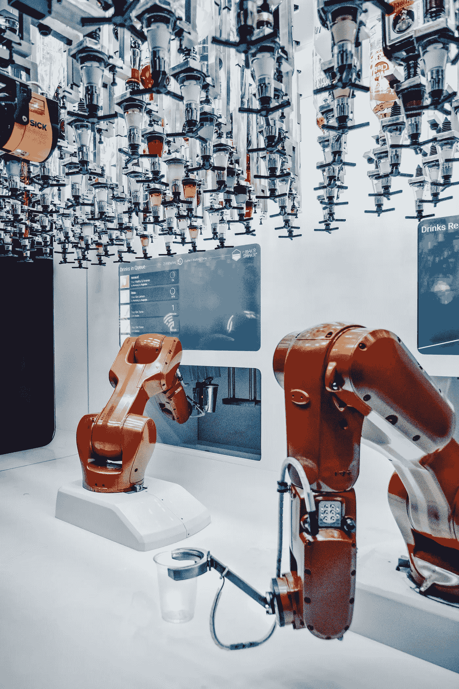

# 通过强化学习训练机器人操控器在避障任务上的应用

> 原文：[`towardsdatascience.com/training-of-robotic-manipulators-on-the-obstacle-avoidance-task-through-reinforcement-learning-ea2a3404883f`](https://towardsdatascience.com/training-of-robotic-manipulators-on-the-obstacle-avoidance-task-through-reinforcement-learning-ea2a3404883f)

## 通过使用**robotic-manipulator-rloa**框架，轻松训练机器人操控器避开障碍物。

[](https://medium.com/@JavierMtz5?source=post_page-----ea2a3404883f--------------------------------)[](https://towardsdatascience.com/?source=post_page-----ea2a3404883f--------------------------------) [Javier Martínez Ojeda](https://medium.com/@JavierMtz5?source=post_page-----ea2a3404883f--------------------------------)

·发布于[数据科学前沿](https://towardsdatascience.com/?source=post_page-----ea2a3404883f--------------------------------) ·7 分钟阅读·2023 年 3 月 15 日

--



图片由[David Levêque](https://unsplash.com/ko/@davidleveque?utm_source=medium&utm_medium=referral)拍摄，发布在[Unsplash](https://unsplash.com/?utm_source=medium&utm_medium=referral)。

> 如果你想阅读这篇文章而没有高级 Medium 账户，可以通过这个朋友链接访问 :)
> 
> [`www.learnml.wiki/training-of-robotic-manipulators-on-the-obstacle-avoidance-task-through-reinforcement-learning/`](https://www.learnml.wiki/training-of-robotic-manipulators-on-the-obstacle-avoidance-task-through-reinforcement-learning/)

本文的目的是，除了讲解如何训练操控器以完成避障任务外，还介绍开源框架**robotic-manipulator-rloa**，并解释其工作原理和使用方法。

总之，**robotic-manipulator-rloa**框架允许用户在模拟环境中加载 URDF 或 SDF 格式的机器人模型（URDF 或 SDF 文件是用于描述机器人所有元素的 XML 文件格式），并用来训练操控器在尝试到达空间中特定点时避开障碍物。为了使训练过程可定制，用户可以配置环境的基本组件，以及用于训练的 NAF 算法的超参数。

> NAF 算法在这篇文章中以理论层面进行了讲解：[应用强化学习 V：连续控制的归一化优势函数 (NAF)](https://medium.com/towards-data-science/applied-reinforcement-learning-v-normalized-advantage-function-naf-for-continuous-control-62ad143d3095)

## 应用强化学习 V: 用于连续控制的标准化优势函数 (NAF)

### NAF 算法的介绍和解释，该算法广泛用于连续控制任务

towardsdatascience.com

## 通过 PyPI 安装 robotic-manipulator-rloa 框架

```py
pip install robotic-manipulator-rloa
```

安装 PyPi 包将会安装以下依赖包：

+   **torch:** PyTorch 用于构建 NAF 算法所需的神经网络。

+   **numpy:** NumPy 用于以优化的方式处理数字和数组。

+   **pybullet:** PyBullet 用于创建训练环境的模拟，并与其交互和获取信息。

+   **matplotlib:** Matplotlib 用于可视化训练过程中智能体获得的奖励。

安装框架后，可以在 **5** **步** 中配置和执行智能体的训练和评估，这些步骤在以下部分中介绍。

## 1\. 初始化 ManipulatorFramework

创建 **ManipulatorFramework** 类的对象。

```py
from robotic_manipulator_rloa import ManipulatorFramework

# Initialize framework
mf = ManipulatorFramework()
```

ManipulatorFramework 类的构造函数使用默认值初始化 NAF 算法的超参数：

+   **缓冲区大小** 默认为 100000。

+   **批量大小** 默认为 128。

+   **Gamma** 默认为 0.99。

+   **Tau** 默认为 0.001，

+   **学习率** 默认为 0.001，

+   **更新频率** 默认为 1。

+   **更新次数** 默认为 1。

如果你想配置 NAF 算法的任何超参数，ManipulatorFramework 类有一个 **set_hyperparameter()** 方法，该方法接收要修改的超参数名称和要设置的新值，如下所示。

```py
mf.set_hyperparameter('buffer_size', 10000)
mf.set_hyperparameter('tau', 0.5)
mf.set_hyperparameter('gamma', 0.1)
```

## 2\. 初始化环境

**Environment** 需要一些来自用户的信息来配置训练模拟。具体来说，初始化 Environment 类时需要的字段包括：

+   **manipulator_file**: 操纵器 URDF 或 SDF 文件的路径。

+   **endeffector_index**: 操纵器末端执行器的索引。

+   **fixed_joints**: 包含所有未参与训练的关节的索引的列表（在训练过程中将保持静态的关节）。

+   **involved_joints**: 包含所有参与训练的关节索引的列表。

+   **target_position**: 包含目标对象位置的列表，使用 3D 笛卡尔坐标表示。

+   **obstacle_position**: 包含障碍物位置的列表，使用 3D 笛卡尔坐标表示。

+   **initial_joint_positions**: 包含与操纵器关节数量相同项数的列表。列表中的每个项对应于希望的关节初始位置。

+   **initial_positions_variation_range**: 列表中包含的项数与操控器的关节数相同。列表中的每一项对应于所需关节的变动范围（initial_pos-range, initial_pos+range）。

+   **max_force**: 施加在关节上的最大力量。

+   **visualize**: 布尔值，指示是否在训练期间可视化模拟环境。

考虑到这些参数，环境的初始化将通过以下方式调用**initialize_environment()**方法：

```py
mf.initialize_environment(manipulator_file='kuka_iiwa/kuka_with_gripper2.sdf',
                          endeffector_index=13,
                          fixed_joints=[6, 7, 8, 9, 10, 11, 12, 13],
                          involved_joints=[0, 1, 2, 3, 4, 5],
                          target_position=[0.4, 0.85, 0.71],
                          obstacle_position=[0.45, 0.55, 0.55],
                          initial_joint_positions=[0.9, 0.45, 0, 0, 0, 0],
                          initial_positions_variation_range=[0, 0, 0.5, 0.5, 0.5, 0.5],
                          visualize=False)
```

## 3\. 初始化 NAF Agent

NAF Agent 的初始化非常简单，因为它需要的大多数参数都是从之前配置的环境和**步骤 1**中初始化和配置的超参数中获取的。

实际上，**initialize_naf_agent()**方法唯一接收的参数是**checkpoint_frequency**，它决定了训练状态保存的频率。默认值为 500。

```py
mf.initialize_naf_agent(checkpoint_frequency=100)
```

## 4\. 运行训练

一旦**环境**和**NAF Agent**配置并初始化完毕，训练可以继续进行。这一步通过**run_training()**方法进行，该方法接收三个参数：

+   **episodes**: 训练执行的最大集数。

+   **frames**: 每集要执行的最大时间步数。

+   **verbose**: 布尔值，指示是否激活详细模式。如果详细模式开启，终端将打印每个时间步的信息。建议仅在调试和开发阶段使用此模式，因为在正常训练过程中，它会添加过多的信息，导致无法清晰地看到训练状态。

```py
mf.run_training(3000, 400, verbose=False)
```

## 5\. 运行测试

一旦训练完成，可以测试代理以评估其是否成功学会了任务。为此，使用**test_trained_model()**方法，该方法接收与**run_training()**方法相同的两个参数：测试中要运行的集数和每集的时间步数。

```py
mf.test_trained_model(50, 750)
```

测试过程也可以在未先前执行训练会话的情况下进行，通过加载先前训练会话中的训练权重。这些训练权重可以从框架在整个训练过程中生成的检查点中获取，也可以从训练会话结束时生成的*‘model.p’*文件中获取。要对以前训练的权重进行测试，还需要以与训练权重时相同的方式初始化环境和 NAF Agent。

```py
# Load pretrained weights from checkpint generated on episode 2000
mf.load_pretrained_parameters_from_episode(2000)

# Load pretrained weights from 'weights.p' file
mf.load_pretrained_parameters_from_weights_file('weights.p')
```

需要注意的是，当从一个检查点加载训练后的权重时，需要作为参数传递要获取权重的集数。例如，上面的代码获取了为第 2000 集生成的检查点的权重。

# 训练执行信息

本节解释了在训练会话执行期间如何显示训练信息。

## 如果**visualize**在初始化 Environment 时设置为 True

如果在初始化**Environment**时将**visualize**参数设置为 True，则在训练执行期间将可视化 manipulator，如*图 1*所示。虽然这种模式可以让你看到 manipulator 的运动是否良好以及训练是否按预期进行，但可视化会减慢程序的执行速度，因此应在开发中使用，而不是在进行大量回合的训练时使用。


**图 1**。训练的可视化。图片由作者提供

## 如果在初始化训练时将 verbose 设置为 True

如果在**Environment**初始化时将**verbose**参数设置为 True，则每个训练回合的每个时间步的信息将会显示，如*图 2*所示。考虑到正常的训练可能持续超过 1000 个回合，并且每个回合可能包含 500 个时间步，显示每个时间步的信息会淹没终端 stdout，这可能会使得某些信息难以获取，并且在长期训练的情况下可能适得其反。


**图 2**。verbose 为 True 时的训练终端日志。图片由作者提供

## 如果在初始化训练时将 verbose 设置为 False

如果在**Environment**初始化时将**verbose**参数设置为 False，则只会显示每个回合的信息，如*图 3*所示。这种执行模式更适合长期训练，因为它可以轻松获取训练过程中每个回合完成的信息。


**图 3**。verbose 为 False 时的训练终端日志。图片由作者提供

# **演示训练与测试**

**robotic-manipulator-rloa**包允许运行[**KUKA IIWA**](https://www.kuka.com/es-es/productos-servicios/sistemas-de-robot/robot-industrial/lbr-iiwa)和[**Xarm6**](https://www.ufactory.cc/product-page/ufactory-xarm-6)机器人 manipulator 的训练和测试演示，以展示用户在两个不同环境配置下运行和评估训练所需的步骤。这些训练和测试如下所示。

```py
from robotic_manipulator_rloa import ManipulatorFramework

# Initialize framework
mf = ManipulatorFramework()

# Run demo training for KUKA IIWA
mf.run_demo_training('kuka_training', verbose=False)

# Run demo testing for KUKA IIWA
mf.run_demo_testing('kuka_testing')

# Run demo training for Xarm 6
mf.run_demo_training('xarm6_training', verbose=False)

# Run demo testing for Xarm 6
mf.run_demo_testing('xarm6_testing') 
```

# 包的更多信息

关于**robotic-manipulator-rloa**包的更多信息可以在文档中找到，或在 PyPI 的项目页面上查看。至于代码，可以在我的 GitHub 仓库中找到，因此如果有人对项目有任何改进建议，请随时告诉我。

+   **文档**：[`javiermtz5.github.io/robotic_manipulator_rloa/`](https://javiermtz5.github.io/robotic_manipulator_rloa/)

+   **PyPI 页面**: [`pypi.org/project/robotic-manipulator-rloa/`](https://pypi.org/project/robotic-manipulator-rloa/)

+   **GitHub 仓库**: [`github.com/JavierMtz5/robotic_manipulator_rloa`](https://github.com/JavierMtz5/robotic_manipulator_rloa)

我希望这个框架对你有所帮助，易于使用，并且能够有效地训练即将加载的不同操控机器人。如果情况如此，或者如果有人遇到任何问题或意外行为，我将非常感激您能在[GitHub 仓库](https://github.com/JavierMtz5/robotic_manipulator_rloa)上告知我，无论是通过给项目加星，还是通过报告发现的问题。
