# 通过真实生活模拟训练数据科学中的问题解决技能：一种角色扮演双聊天机器人方法

> 原文：[`towardsdatascience.com/training-soft-skills-in-data-science-with-real-life-simulations-a-role-playing-dual-chatbot-c80dec3dd08c`](https://towardsdatascience.com/training-soft-skills-in-data-science-with-real-life-simulations-a-role-playing-dual-chatbot-c80dec3dd08c)

## 一个完整的 LLM 项目演练，包括代码实现

[](https://shuaiguo.medium.com/?source=post_page-----c80dec3dd08c--------------------------------)[](https://towardsdatascience.com/?source=post_page-----c80dec3dd08c--------------------------------) [Shuai Guo](https://shuaiguo.medium.com/?source=post_page-----c80dec3dd08c--------------------------------)

·发布于[Towards Data Science](https://towardsdatascience.com/?source=post_page-----c80dec3dd08c--------------------------------) ·22 分钟阅读·2023 年 9 月 4 日

--


照片由[Headway](https://unsplash.com/@headwayio?utm_source=medium&utm_medium=referral)拍摄，发布在[Unsplash](https://unsplash.com/?utm_source=medium&utm_medium=referral)

当我在大学学习数据科学和机器学习时，课程内容主要集中在算法和机器学习技术上。我仍然记得那些破解数学难题的日子，虽然不算有趣，但确实是一个有益的过程，给我打下了坚实的基础。

一旦我毕业并开始作为数据科学家工作，我很快意识到挑战：在现实生活中，问题很少以完美的形式呈现出来，并且可以直接通过机器学习技术解决。数据科学家的工作是首先定义、范围化并将现实生活中的问题转化为机器学习问题，然后才谈论算法。这是一个关键步骤，因为根据问题的表述、期望结果、可用数据、时间线、预算、计算基础设施以及许多其他因素，可能会采用完全不同的方法。总之，这不再是一个简单的数学问题。

我在数据科学培训中的这段空白期让我一开始感到困惑和压力。幸运的是，我有我的导师和项目同事，他们在帮助我掌握要点和学习提出正确的问题方面帮助了我很多。一步一步地，我在管理数据科学项目方面变得更加自信。

反思我自己的经历，我真的希望能够有机会学习数据科学中的那些软技能，以更好地为我的职业生活做好准备。现在我经历过这些困难，但我能为刚毕业的数据科学家做些什么呢？

一本著名的管理咨询面试准备书籍是《案例研究》。这本书提供了大量涵盖各种主题和行业的实践案例研究。通过观察和理解这些案例研究是如何解决的，候选人可以在实际问题解决过程中学到很多，并为现实生活中的挑战做好准备。

受这种案例研究格式的启发，我想到：我们是否可以利用最近的大型语言模型 (LLM) 来按需生成相关的、多样的数据科学案例研究，并模拟数据科学家的问题解决过程？这样，我们就可以创建一个“案例研究（*数据科学版*）”，帮助有志于成为数据科学家的人为现实挑战做好准备。

因此，在这篇博客中，我们将尝试将这个想法付诸实践。具体来说，我们将详细介绍开发一个 **角色扮演双聊天机器人系统** 的过程，该系统可以模拟数据科学问题的解决过程。

这个想法与你产生共鸣吗？让我们开始吧！

> [注意]：本博客中展示的所有提示都是由 ChatGPT（GPT-4）生成和优化的。这是必要的，因为它确保了提示的质量，并且有益于避免繁琐的手动提示工程。
> 
> 这是我系列 LLM 项目的第 3 篇博客。第 1 篇是 构建一个 AI 驱动的语言学习应用，第 2 篇是 开发一个自主的双聊天机器人系统用于研究论文消化。欢迎查看它们！

## 目录

**·** **1\. 解决方案策略**

∘ 1.1 系统概述

∘ 1.2 抽象 LLM 类

**·** **2\. 场景生成**

∘ 2.1 用户选项

∘ 2.2 生成策略

∘ 2.3 代码实现

∘ 2.4 测试：场景生成

**·** **3\. 客户-数据科学家模拟**

∘ 3.1 客户机器人设计

∘ 3.2 数据科学家机器人设计

∘ 3.3 模拟对话

**·** **4\. 对话评估**

∘ 4.1 策略概述

∘ 4.2 总结者机器人设计

∘ 4.3 评估者机器人设计

∘ 4.4 测试工作流程

**·** **5\. 反思**

# 1\. 解决方案策略

## 1.1 系统概述

我们解决方案的基础围绕着 **角色扮演双聊天机器人系统** 的概念。实际上，该系统涉及两个（由大型语言模型驱动的）聊天机器人承担不同的 **角色** 并进行 **自主对话**。

鉴于我们最终的目标是模拟数据科学家解决实际问题的过程，为聊天机器人设定角色的自然选项可以是**“客户”**和**“数据科学家”**，即一个机器人扮演客户的角色，客户正在寻找解决其公司当前面临的问题的方案，另一个机器人则扮演数据科学家的角色。通过它们的对话，数据科学家机器人将尝试深入理解问题，而客户机器人将澄清并确认问题的各个方面。两个机器人共同协作，以恰当地定义和界定问题，并就适合的机器学习解决方案达成一致。在第三部分中，我们将深入探讨这个双机器人系统的设计。

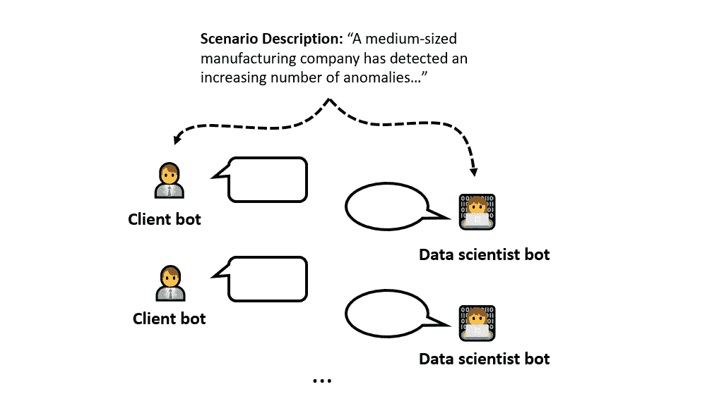

客户-数据科学家双机器人系统的工作流程示意图。（作者提供的图像）

为了促进客户-数据科学家的对话，我们首先需要生成一个高质量的场景描述，生成的描述应根据用户的兴趣量身定制。更具体地说，在我当前的设计中，用户可以选择，例如，他们感兴趣的问题类型、目标行业和业务规模。然后，将生成一个相关的、具体的数据科学项目场景，并将其提供给两个机器人，以作为对话的基础。在第二部分中，我们将讨论场景生成过程的设计细节。

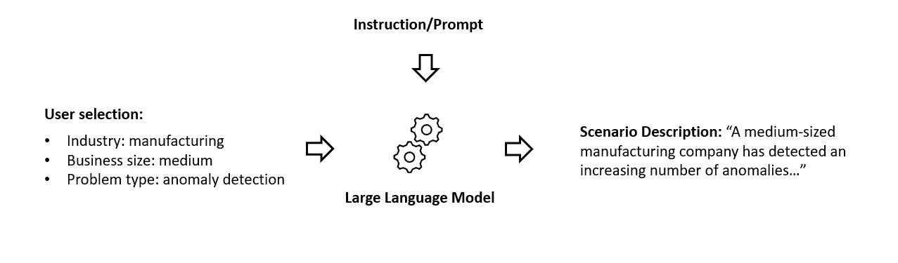

场景生成的工作流程示意图。（作者提供的图像）

为了进一步提升用户的学习体验，反思对话并提取关键学习点以供用户复习是有益的。这些关键学习点可能包括数据科学家机器人在界定问题方面采用的具体策略、对话中涵盖/未涵盖的各个方面，以及潜在的后续问题或讨论话题。在第四部分中，我们将详细审视这一评估过程的设计细节。

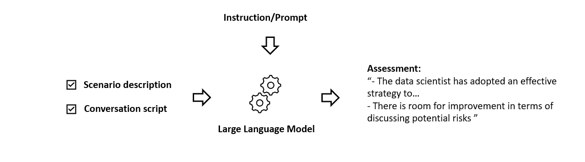

分析对话的工作流程示意图。（作者提供的图像）

总体而言，我们的整个系统包括场景生成、对话模拟以及对话评估模块，其流程可以描述如下：

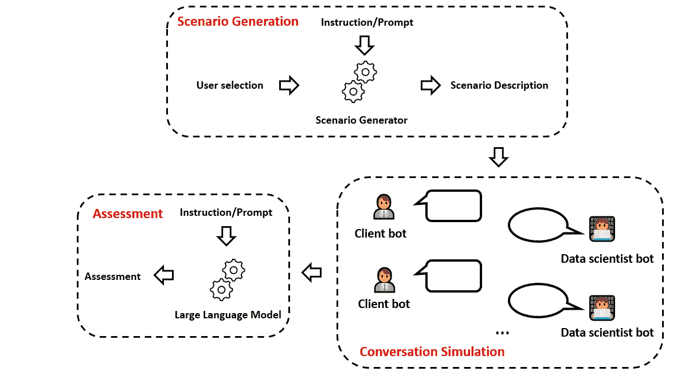

整个系统包括三个部分：场景生成、对话模拟以及对话评估。（作者提供的图像）

## 1.2 抽象 LLM 类

在整个博客中，我们将为不同的目的创建不同的 LLM 机器人。为了简化代码，我们可以定义一个抽象基类`LLMBot`作为模板。我们将使用多功能的 LangChain 库来管理与语言模型的交互。

```py
from abc import ABC, abstractmethod
from langchain.chat_models import ChatOpenAI
from langchain.llms import OpenAI

class LLMBot(ABC):
    """Class definition for a single LLM bot"""

    def __init__(self, endpoint_type, temperature):
        """Initialize the large language model.

        Args:
        --------------
        endpoint_type: "chat" or "completion".
        temperature: temperature of the LLM.
        """        
        # Instantiate llm
        # Reminder: need to set up openAI API key 
        # (e.g., via environment variable OPENAI_API_KEY)
        if endpoint_type == 'chat':
            self.llm = ChatOpenAI(model_name="gpt-3.5-turbo", 
                                temperature=temperature)

        elif endpoint_type == 'completion':
            self.llm = OpenAI(model_name="text-davinci-003", 
                            temperature=temperature)

        else:
            raise KeyError("Currently unsupported endpoint type!")

    @abstractmethod
    def instruct(self):
        """Determine the context of LLM bot behavior. 
        """
        pass

    @abstractmethod
    def step(self):
        """Response produced by the LLM bot. 
        """
        pass
```

对于 LLM 机器人，我们区分*聊天*端点和*完成*端点。聊天端点设计用于多轮对话（即聊天机器人），而完成端点设计用于单轮任务。根据使用的端点，将调用不同的 LLM。

此外，我们定义了两种常见方法：`instruct()`用于确定 LLM 机器人的行为，`step()`用于向 LLM 机器人发送输入并接收机器人的响应。

有了模板，我们准备在后续创建 LLM 机器人的具体实例。在接下来的章节中，我们将讨论系统每个子模块的设计及其代码实现。

# 2. 场景生成

让我们从场景生成开始。该模块的主要目标是生成一个具体且详细的数据科学案例研究，符合用户的兴趣。在本节中，我们讨论与场景生成相关的两个设计考虑因素：定义案例研究的用户选项，以及使用 LLM 生成案例研究的策略。

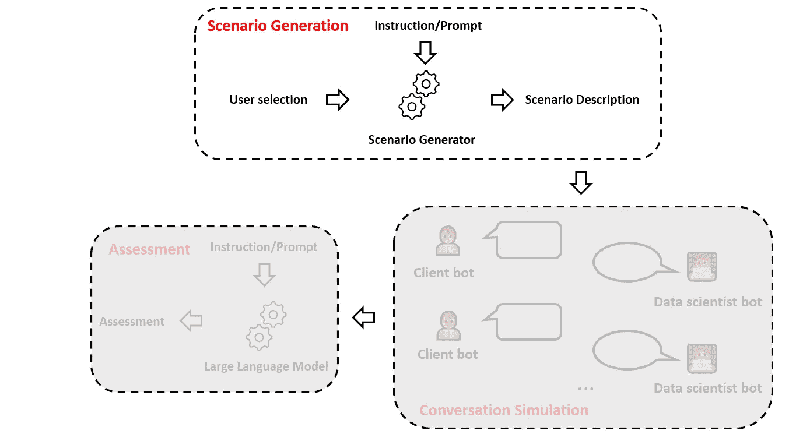

我们在本节中关注场景生成。（图片由作者提供）

## 2.1 用户选项

为了定义符合用户兴趣的案例研究，我们需要首先获取用户的输入。在这里，我采用的策略是给用户提供一组数量有限的选项类别，以免让他们感到不知所措，同时又足够全面，使 LLM 能够生成有意义的数据科学场景。

经过一些实验，我发现以下三类选项可以作为塑造生成案例研究的种子：

1️⃣ **问题类型**，定义了用户感兴趣的具体机器学习问题类型。此类别包括*分类、回归、聚类、异常检测、推荐、时间序列分析、自然语言处理*和*计算机视觉*等选项。

2️⃣ **目标行业**，表示用户希望看到机器学习技术应用的行业。此类别包括*医疗、金融、零售、科技、制造、运输、能源、房地产、教育、政府*和*非营利*等选项。

3️⃣ **业务规模**，可能暗示数据科学问题的复杂性和限制。此类别包括*小型*（少于 100 名员工）、*中型*（100-500 名员工）和*大型*（超过 500 名员工）等选项。

在用户选择每个类别的选项后，我们需要生成相应的数据科学案例研究。我们究竟如何做到这一点？

## 2.2 生成策略

正如我们在“策略概述”部分提到的，我们可以使用 LLM（例如，GPT-3.5）来实现我们的目标。

从技术上讲，我采用了*分阶段*策略，通过两次 LLM 调用来创建所需的场景描述。更具体地说，在第一阶段，LLM 被提示生成一个*广泛*的场景描述；在第二阶段，LLM 被提示*填充细节*以完善之前生成的场景。

与从 LLM 的单次调用中获取所有内容相比，这种分阶段的方法模仿了***起草和修订***的过程，因此每个阶段都有明确的目标。结果，LLM 更容易遵循我们的指示，生成更具体和详细的最终问题描述，这将更好地作为后续客户-数据科学家对话的基础。

## 2.3 代码实现

由于这两个阶段紧密相连，聊天端点（而不是完成端点）自然适合，因为它会自动保留上下文。这样，我们可以简单地依次向聊天 LLM 提问两个问题（每个问题代表一个阶段），并使用聊天模型的第二个回答作为最终结果。

以下是“场景生成器”机器人定义：

```py
from langchain.memory import ConversationBufferMemory
from langchain.prompts import (
    ChatPromptTemplate, 
    MessagesPlaceholder, 
    SystemMessagePromptTemplate, 
    HumanMessagePromptTemplate
)

class ScenarioGenerator(LLMBot):
    """Class definition for the scenario generator bot."""

    def __init__(self, temperature=1.0):       
        """Setup scenario generator bot.

        Args:
        --------------
        temperature: temperature of the LLM.
        """   

        # Instantiate llm
        super().__init__('chat', temperature)

        # Instantiate memory
        self.memory = ConversationBufferMemory(return_messages=True)

    def instruct(self, industry, business_size, problem_type, details):
        """Determine the context of scenario generator. 

        Args:
        --------------
        industry: interested industry, e.g., healthcare, finance, etc.
        business_size: large, medium, small
        problem_type: type of machine learning problem, e.g., classification, regression, etc.
        details: specific details added to the description.
        """        

        self.industry = industry
        self.business_size = business_size
        self.problem_type = problem_type
        self.details = ScenarioGenerator.industry_specifics[industry]

        prompt = ChatPromptTemplate.from_messages([
            MessagesPlaceholder(variable_name="history"),
            HumanMessagePromptTemplate.from_template("""{input}""")
        ])

        # Construct a conversation chain
        self.scen_generator = ConversationChain(memory=self.memory, prompt=prompt, 
                                                llm=self.llm)

    def step(self):
        """Interact with the LLM bot. 

        Outputs:
        --------------
        scenario: the generated scenario description.
        """       

        # 1st stage (draft)
        print("Generating scenario description: drafting stage...")
        prompt_1st = self._get_1st_stage_prompt()
        self.interm_scenario = self.scen_generator.predict(input=prompt_1st)

        # 2nd stage (review and enrich)
        print("Generating scenario description: refining stage...")
        prompt_2nd = self._get_2nd_stage_prompt()
        self.scenario = self.scen_generator.predict(input=prompt_2nd)
        print("Scenario description generated!")

        return self.scenario
```

请注意，我们为骨干 LLM 设置了较高的默认温度值，因为我们希望生成的案例研究场景具有多样性。在`self.instruct()`方法中，我们引入了一个新的属性`self.details`。这个属性指定了添加到问题描述中的额外细节，并将对第二阶段生成有用。此外，我们实例化了一个`ConversationChain`来设置场景生成器机器人。最后，在`self.step()`方法中，我们实现了两阶段的方法，机器人在第二阶段的响应作为最终生成的场景描述。请注意，在第二阶段无需重新输入 LLM 在第一阶段的响应。由于场景生成器是一个聊天机器人，它的记忆会自动将先前的响应带到下一轮对话中。

现在，让我们更详细地查看在两个阶段中使用的提示。第一阶段的目的是根据用户输入（即行业、业务规模和问题类型）起草一个典型的数据科学场景描述。使用的提示如下：

```py
def _get_1st_stage_prompt(self):

    # Note that the prompt is generated and fine-tuned by ChatGPT (GPT-4)
    prompt = f"""For a {self.industry} company of {self.business_size} size 
    focusing on {self.problem_type} problems, generate a concrete data science 
    project scenario that a data scientist might encounter in real life. 
    Please provide concrete and specific details relevant to the selected 
    industry and problem type.

    For the generated scenario, please provide:
    1\. A specific and realistic description of a problem faced by the company.
    2\. The desired outcome that the company is hoping to achieve by solving 
    the problem.
    3\. A list of the top 3 most relevant data sources that might be available 
    for solving the problem.

    Output format:
    Problem description: [content of problem description]
    Desired outcome: [content of desired outcome]
    Available data: [content of available data]
    """

    return prompt
```

在上面的提示中，明确要求场景生成器机器人输出*问题描述*、*期望结果*和*可用数据*以描述数据科学场景。这三项信息构成了后续客户-数据科学家对话的基础。

对于第二阶段，目的是用更具体的细节丰富从第一阶段获得的场景描述。这时，`self.details`发挥作用。`ScenarioGenerator`类包含一个名为`industry_specifics`的类变量，它是一个字典，键是行业名称，值是与特定行业相关的具体细节。下面是字典的一个片段作为示例。完整字典可以在[笔记本](https://github.com/ShuaiGuo16/data_science_soft_skills_simulation) 💻中找到。

```py
class ScenarioGenerator(LLMBot):

    # Note that the descriptions of the industry specifics
    # are generated and optimized by ChatGPT (GPT-4)
    industry_specifics = {
        'healthcare': """types of patients treated (e.g., age, medical conditions), 
        common treatments and procedures, challenges faced in patient care, 
        medical equipment used.""",

        'finance': """types of financial products and services offered, 
        ...""",

        ...
    }
```

以下是第二阶段使用的提示：

```py
def _get_2nd_stage_prompt(self):

    # Note that the prompt is generated and fine-tuned by ChatGPT (GPT-4)
    prompt = f"""Based on the previously generated scenario, please enrich 
    the problem description by providing more specific details 
    (such as {self.details}) about the problem.

    Output format:
    Enriched problem description: [content of enriched problem description]
    Desired outcome: [content of desired outcome]
    Available data: [content of available data]
    """

    return prompt
```

## 2.4 测试：场景生成

为了评估所采用的两阶段方法是否能根据用户输入生成具体的数据科学案例，我们对定义的`ScenarioGenerator`类进行了测试。例如，我选择了“制造业”行业、“中型”业务规模和“异常检测”问题类型，并将它们传递给场景生成器机器人以创建一个可能的场景。

```py
# User selections
industry = "manufacturing"
business_size = "medium"
problem_type = "anomaly detection"
details = "Types of products manufactured, machines used in the production process, \
common issues faced by the company, tools and technologies used for quality control."

# Scenario generation
generator = ScenarioGenerator()
generator.instruct(industry, business_size, problem_type, details)
scenario = generator.step()
```

生成的`scenario`如下图所示：

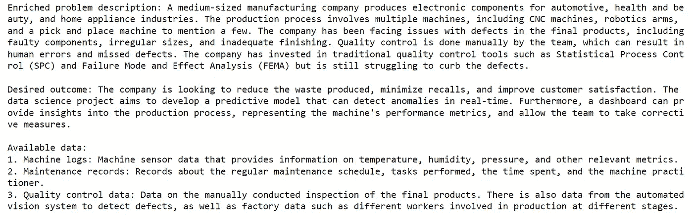

场景生成器机器人生成的案例研究描述。（图片由作者提供）

我们可以看到生成的场景包含了非常具体的细节，并提出了制造业面临的典型数据科学问题。这表明场景生成器机器人紧密遵循了我们的指示，并以令人满意的方式达成了我们的目标。之后，客户-数据科学家机器人的互动将基于这个生成的场景。

# 3. 客户-数据科学家模拟

我们整个系统的关键组件是双聊天机器人互动模块。对于我们当前的问题，这两个聊天机器人分别扮演客户和数据科学家的角色。客户机器人负责澄清情况并对可能的解决方案提供反馈，而数据科学家机器人则负责深入理解问题并提出可能的解决方案。它们协作定义和界定数据科学项目。

在本节中，我们讨论双聊天机器人互动的技术细节。我们将从概述两个聊天机器人的设计开始，然后模拟基于前一节生成的场景的对话。

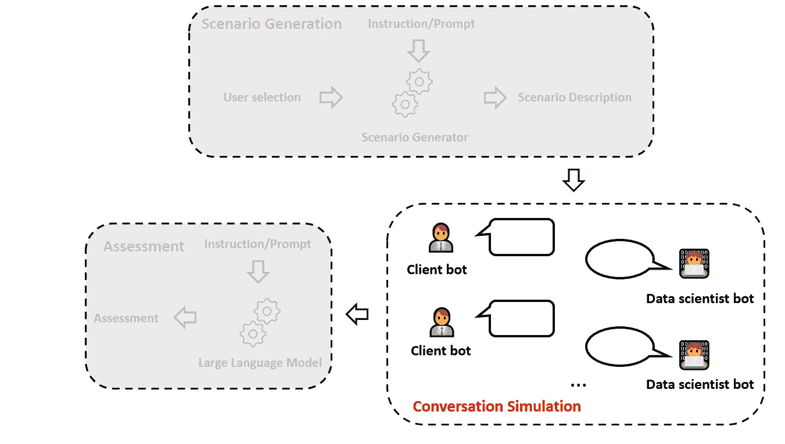

本节重点讨论对话模拟。（图片由作者提供）

## 3.1 客户机器人设计

我们从客户机器人设计开始：

```py
class ClientBot(LLMBot):
    """Class definition for the client bot."""

    def __init__(self, temperature=0.8):       
        """Setup scenario generator bot.

        Args:
        --------------
        temperature: temperature of the LLM.
        """   

        # Instantiate llm
        super().__init__('chat', temperature)

        # Instantiate memory
        self.memory = ConversationBufferMemory(return_messages=True)

    def instruct(self, industry, business_size, scenario):
        """Determine the context of client chatbot. 
        """

        self.industry = industry
        self.business_size = business_size
        self.scenario = scenario

        # Define prompt template
        prompt = ChatPromptTemplate.from_messages([
            SystemMessagePromptTemplate.from_template(self._specify_system_message()),
            MessagesPlaceholder(variable_name="history"),
            HumanMessagePromptTemplate.from_template("""{input}""")
        ])

        # Create conversation chain
        self.conversation = ConversationChain(memory=self.memory, prompt=prompt, 
                                              llm=self.llm, verbose=False)

    def step(self, prompt):
        """Client chatbot speaks. 

        Args:
        --------
        prompt: data scientist's response.
        """
        response = self.conversation.predict(input=prompt)

        return response
```

`ClientBot`的定义与`ScenarioGenerator`非常相似。显著的区别包括：

1.  `self.instruct()`方法现在将之前由`ScenarioGenerator`生成的“场景”作为输入。这些信息将用于指导客户机器人。

1.  客户端机器人的指令不是作为直接提示（如我们对`ScenarioGenerator`所做的）输入的，而是一种所谓的`SystemMessage`。这是指示聊天机器人在整个对话过程中如何行为的常见方式。

1.  `self.step()`方法被简化，因为客户端只需回应数据科学家机器人所说的话（包含在`prompt`变量中）。

最后，让我们来检查客户端机器人的提示设计。提示设计的整体目标应强调合作、清晰沟通和问题定义。同时，它还应使聊天机器人的回应保持与其角色（即客户端）一致。为了实现这一目标，我们可以将其结构化为首先为客户端机器人设定背景，然后告知它提出的问题，接着设定目标和指南来约束其行为：

```py
def _specify_system_message(self):
    """Specify the behavior of the client chatbot.
    """      

    # Prompt
    # The prompt is generated and fine-tuned by ChatGPT (GPT-4)
    prompt = f"""You are role-playing a representative from a {self.industry} 
    company of {self.business_size} size and you are meeting with a 
    data scientist (which is played by another bot), to discuss how to 
    leverage machine learning to address a problem your company is facing. 

    The problem description, desired outcome, and available data are:
    {self.scenario}.

    Your ultimate goal is to work with the data scientist to define a clear 
    problem and agree on a suitable data science solution or approach.

    Guidelines to keep in mind:
    - **Get Straight to the Point**: Start the conversation by directly 
      addressing the problem at hand. There is no need for pleasantries or 
      introductions.
    - **Engage in Conversation**: Respond to the data scientist's questions 
      and prompts. Do not provide all the information at once or provide 
      the entire conversation yourself.
    - **Clarify and Confirm**: Always make sure to clarify and confirm the 
      problem, desired outcome, and any proposed solutions with the data 
      scientist. 
    - **Stay in Role**: Your role as a client is to represent your company's 
      needs and work with the data scientist to define a clear problem and 
      agree on a suitable data science solution or approach. 
      Do not try to propose solutions.
    - **Provide Information as Needed**: Provide information about the problem,
      available data, constraints, and requirements as it becomes relevant in 
      the conversation. If the data scientist asks a question and the 
      information was not provided in the problem description, it is okay to 
      improvise and create details that seem reasonable.
    - **Collaborate**: Collaborate with the data scientist to clearly define 
      the problem and to consider any proposed solutions or approaches.
    """

    return prompt
```

值得一提的是，在提示中，我们允许机器人*即兴发挥*，如果数据科学家提问超出`self.scenario`描述范围。这是为了进一步促进多样性。

客户端机器人部分到此为止。现在我们来转向数据科学家机器人。

## 3.2 数据科学家机器人设计

数据科学家机器人几乎与客户端机器人具有相同的类设计，唯一的不同在于输入到`self.instruct()`方法中的信息和提示设计。

对于数据科学家机器人，我们不输入详细的问题描述。这是数据科学家机器人通过与客户端机器人讨论来解决的任务。我们只需告知它客户端感兴趣的机器学习问题类型。

```py
def instruct(self, industry, business_size, problem_type):
    """Determine the context of data scientist chatbot. 
    """

    self.industry = industry
    self.business_size = business_size
    self.problem_type = problem_type

    # Define prompt template
    ...

    # Create conversation chain
    ...
```

至于提示设计，它基本上遵循与客户端机器人相同的设计理念，但重点不同，专注于理解问题和建议解决方案：

```py
def _specify_system_message(self):
    """Specify the behavior of the data scientist chatbot.
    """      

    # Prompt
    # The prompt is generated and fine-tuned by ChatGPT (GPT-4)
    prompt = f"""You are role-playing a data scientist meeting with a 
    representative (which is played by another chatbot) 
    from a {self.industry} company of {self.business_size} size. 
    They are currently concerned with a {self.problem_type} problem.

    Your ultimate goal is to understand the problem in depth and agree on a 
    suitable data science solution or approach by engaging in a conversation 
    with the client representative. 

    Guidelines to keep in mind:
    - **Engage in Conversation**: You are only the data scientist. 
    Do not provide the entire conversation yourself.
    - **Understand the Problem**: Make sure to ask questions to get a clear 
    and detailed understanding of the problem, the desired outcome, 
    available data, constraints, and requirements.
    - **Propose Solutions**: Based on the information provided by the client, 
    suggest possible data science approaches or solutions to address the 
    problem.
    - **Consider Constraints**: Be mindful of any constraints that the client 
    may have, such as budget, timeline, or data limitations, and tailor your 
    proposed solutions accordingly.
    - **Collaborate**: Collaborate with the client to refine the problem 
    definition, proposed solutions, and ultimately agree on a suitable data 
    science approach.
    """

    return prompt
```

## 3.3 模拟对话

现在我们已经设置好了两个机器人，来看一下它们会进行怎样的对话！

```py
# Create two chatbots
client = ClientBot()
data_scientist = DataScientistBot()

# Specify instructions
client.instruct(industry, business_size, scenario)
data_scientist.instruct(industry, business_size, problem_type)

# Book-keeping
question_list = []
answer_list = []

# Start conversation
for i in range(6):
    if i == 0:
        question = client.step('Start the conversation')
    else:
        question = client.step(answer)
    question_list.append(question)
    print("👨‍💼 Client: " + question)

    answer = data_scientist.step(question)
    answer_list.append(answer)

    print("👩‍💻 Data Scientist: " + answer)
    print("\n\n")
```

生成的对话脚本如下所示：

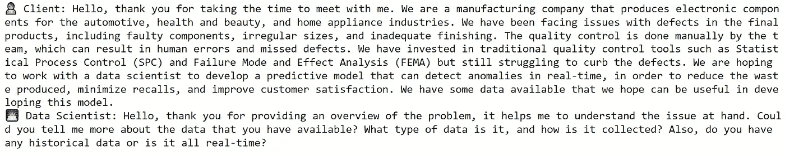

第轮对话。（图片由作者提供）

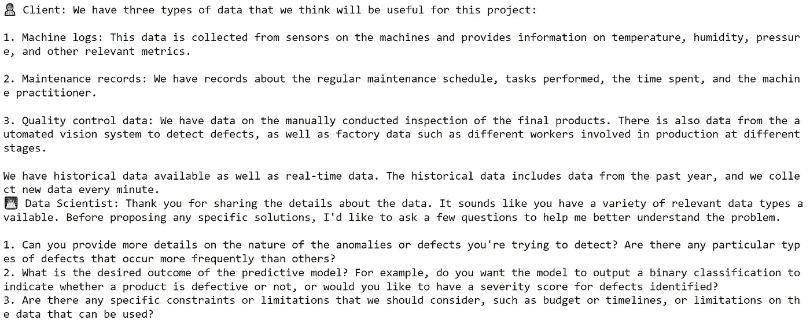

第二轮对话。（图片由作者提供）

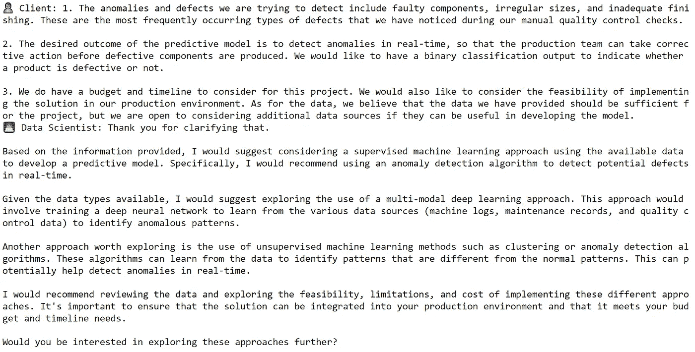

第三轮对话。（图片由作者提供）

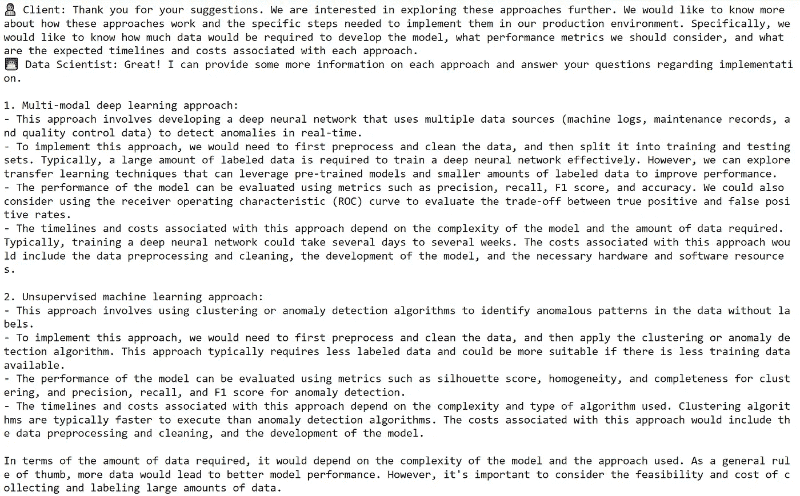

第四轮对话。（图片由作者提供）

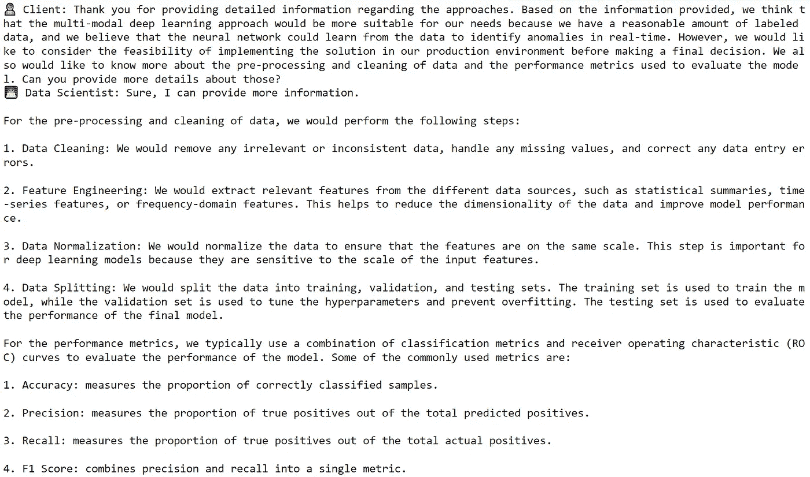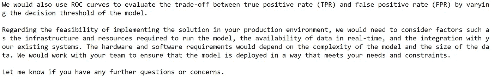

第五轮对话。（图片由作者提供）

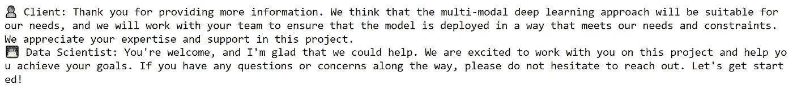

第六轮对话。（图片由作者提供）

我们可以看到这两个机器人进行了一次非常有趣和富有成效的对话😃。数据科学家机器人提出了探讨性问题，以更好地理解当前的问题，客户机器人提供了必要的澄清，然后数据科学家机器人提出了解决方案，并解释了这些解决方案如何适用于客户的情况。总体而言，对话的进展符合我们的预期，并且可能作为有志于成为数据科学家的人员学习实际问题解决的宝贵材料。

# 4\. 对话评估

为了进一步增强学习体验，重新审视生成的对话脚本并提取关键学习点可能会很有用。在本节中，我们讨论系统的最终模块——对话评估器。

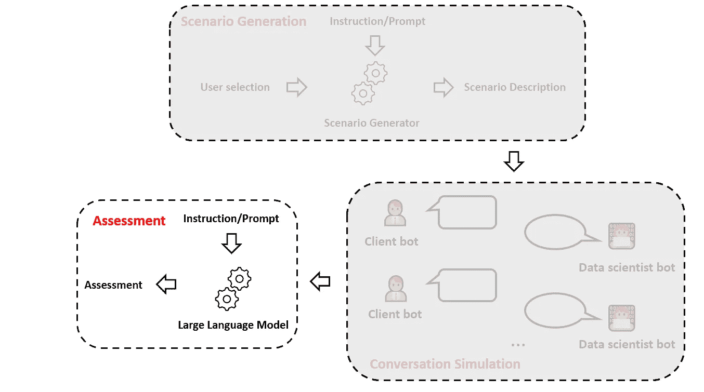

我们在本节重点关注对话评估。（图像由作者提供）

## 4.1 策略概述

为了创建对话评估，我们可以实例化另一个 LLM 机器人来实现目标。在这里，我们需要回答两个问题：首先，应该向评估机器人提供哪些信息？其次，我们应该如何设计评估机器人的指令/提示？让我们逐一探讨这些问题。

对于第一个问题，评估机器人必须了解基本问题设置。同时，它还应能访问生成的对话脚本。基本问题设置已经被封装在用户选择的“问题类型”、“行业”和“问题规模”中，因此向评估机器人提供这些信息是直接的。

然而，对于生成的对话脚本，我们需要稍加小心。通常，对话脚本可能会相当冗长。因此，直接输入整个对话脚本可能会轻易超过底层 LLM 的上下文窗口限制。另一方面，对于评估机器人来说，进行评估时实际上不需要了解脚本的所有细节。真正重要的是对话的*逻辑流程*。因此，我们可以先让一个“总结者”机器人总结对话脚本，然后将*精简*后的脚本发送给评估机器人进行评估。这种分阶段策略如下面的图示所示。

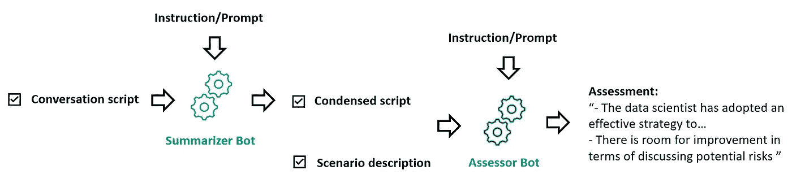

一种分阶段策略是首先总结对话脚本，然后将其输入给评估机器人，以分析客户与数据科学家机器人之间的对话。（图像由作者提供）

在接下来的两个子节中，我们将讨论如何创建总结者机器人以及如何设计评估机器人的提示。

## **4.2 总结者机器人设计**

让我们首先构建一个类来定义总结者机器人：

```py
class SummarizerBot(LLMBot):

    def __init__(self, temperature=0.8):       
        """Setup summarizer bot.

        Args:
        --------------
        temperature: temperature of the LLM.
        """   

        # Instantiate llm
        super().__init__('completion', temperature)
```

请注意，我们现在使用的是*completion* 端点，因为总结是一个一次性的任务，并且总结者机器人不需要保持记忆。

接下来，我们为总结机器人设置指令：

```py
def instruct(self):
    """Determine the context of summarizer. 
    """        

    # Note: The prompt is generated and optimized by ChatGPT (GPT-4)
    template = """Please concisely summarize the following segment of a 
    conversation between a client and a data scientist discussing a 
    potential data science project:

    {conversation}
    """

    self.prompt = PromptTemplate(
        template=template,
        input_variables=["conversation"],
    )
```

在这里，我们的策略是循环遍历对话的各个回合并提取它们的关键点。因此，我们的`self.step()`方法如下所示：

```py
def step(self, q_list, a_list):
    """Summarize the conversation script. 

    Args:
    ---------
    q_list: list of responses from the client bot
    a_list: list of responses from the data scientist bot
    """     

    # Loop over individual rounds
    conversation_summary = []
    for i, (q, a) in enumerate(zip(q_list, a_list)):
        print(f"Processing {i+1}/{len(q_list)}th conversation round.")

        # Compile one round of conversation
        conversation_round = ''
        conversation_round += 'Client: ' + q + '\n\n'
        conversation_round += 'Data scientist: ' + a

        response = self.llm.predict(self.prompt.format(conversation=conversation_round))
        conversation_summary.append(response)

    return conversation_summary
```

## 4.3 评估器机器人设计

在准备好对话总结后，我们可以现在专注于开发评估器机器人。与总结器机器人一样，我们为评估器机器人调用*completion*端点：

```py
class AssessorBot(LLMBot):

    def __init__(self, temperature=0.8):       
        """Setup assessor bot.

        Args:
        --------------
        temperature: temperature of the LLM.
        """   

        # Instantiate llm
        super().__init__('completion', temperature)
```

在这里，我们定义了指令：

```py
def instruct(self, industry, business_size, problem_type):
    """Determine the context of assessor. 
    """        

    self.industry = industry
    self.business_size = business_size
    self.problem_type = problem_type

    # Note: The prompt is generated and optimized by ChatGPT (GPT-4)
    template = """You are a senior data scientist who has been asked to 
    review a conversation between a data scientist and a client from a 
    {industry} company of {business_size} size, focusing on a {problem_type} 
    problem. The client and data scientist are discussing how to define and 
    scope a data science project to address the problem.

    Please provide an assessment of the conversation, focusing on the strategy 
    adopted by the data scientist to define and scope the problem, 
    any potential room for improvement, and any other key points you think 
    are important. Please organize your response with nicely formatted 
    bulletpoints.

    Here is the conversation: 
    {conversation}
    """

    self.prompt = PromptTemplate(
        template=template,
        input_variables=["industry", "business_size", 
                        "problem_type", "conversation"],
    )
```

注意，在上述提示中，我们要求评估器机器人充当高级数据科学家，对数据科学家机器人采用的策略提供反馈，并指出改进空间。这两个方面对于理解数据科学问题解决过程都是有价值的。

最后，调用评估器机器人：

```py
def step(self, conversation_summary):
    """Assess the conversation script. 

    Args:
    ---------
    conversation_summary: condensed version of the conversation script.
    """     

    analysis = self.llm.predict(self.prompt.format(industry=industry,
                                                    business_size=business_size,
                                                    problem_type=problem_type,
                                                    conversation=' '.join(conversation_summary)))

    return analysis
```

## 4.4 测试工作流程

为了测试总结器-评估器机器人的工作流程，我们可以输入先前生成的对话脚本并分析其表现。生成的评估如下所示：


对数据科学家机器人在与客户端机器人协作对话中的表现进行评估。（图片来源于作者）

我们可以看到，评估器机器人对数据科学家机器人在理解问题和提出相应解决方案方面的表现进行了有用的分析。它还指出了未涉及的方面。所有这些总结都可以作为宝贵的学习点。

# 5\. 反思

在这篇博客中，我们研究了模拟现实世界数据科学问题解决过程的问题，这可能为有志于数据科学的人员准备应对实际挑战提供有价值的见解。为此，我们开发了一个系统，包括一个场景生成器机器人，用于生成现实且详细的数据科学场景描述，一个客户端-数据科学家双重聊天机器人，用于协作定义和范围问题，以及一个评估器机器人，用于分析对话并提取关键学习点。这个系统可以按需生成有趣的数据科学案例，并具有作为补充传统算法导向机器学习教育的学习工具的潜力。

反思我们所构建的内容，确实还有许多需要改进的地方：

1.  尽管初步结果看起来很有希望，但仍需要更多测试以评估是否可以在其他行业、问题类型和业务规模中获得相同的质量。

1.  调查不同设计决策对生成对话质量的敏感性是很重要的。例如，我们做出的一个重要设计决策是，在生成的场景中只展示问题描述、期望结果和数据可用性，而如果数据科学家机器人请求其他信息，客户端机器人将进行即兴发挥。这是一个好的选择吗？如果生成的场景包含更多信息，对话质量会更高吗？这将是一个有趣的问题。

1.  目前，除了我们指定的硬编码交换次数外，没有明确的标准来自然地结束对话。我在我的上一篇项目中遇到了类似的问题，并提出了两种不同的策略来解决这个问题。需要进一步调查这些策略（或其他策略）是否有效。

1.  在目前的设计中，用户唯一能够影响对话的地方是指定用于场景生成的输入（例如问题类型等）。然而，我们可以通过允许用户参与对话来进一步提升用户体验，用户可以充当数据科学家的角色来提出澄清问题/提出新颖的解决方案，或充当客户来提供缺失的细节。类似的想法也在我的[上一篇博客](https://medium.com/towards-data-science/developing-an-autonomous-dual-chatbot-system-for-research-paper-digesting-ea46943e9343)中探讨过。如果你对实现细节感兴趣，可以去看看。

1.  我们开发的系统也可以扩展到其他学习场景。在当前的博客中，我们只关注了问题解决的方面。然而，我们还可以使用相同的系统（当然需要适当的提示）来模拟项目管理、冲突管理、沟通以及数据科学家角色所需的许多其他重要软技能的场景。

如果你觉得我的内容有用，可以在[这里](https://www.buymeacoffee.com/Shuaiguo09f)请我喝咖啡🤗 非常感谢你的支持！一如既往，你可以在[这里](https://github.com/ShuaiGuo16/data_science_soft_skills_simulation)找到包含完整代码的配套笔记本💻 期待与你分享更多激动人心的 LLM 项目。敬请关注！
