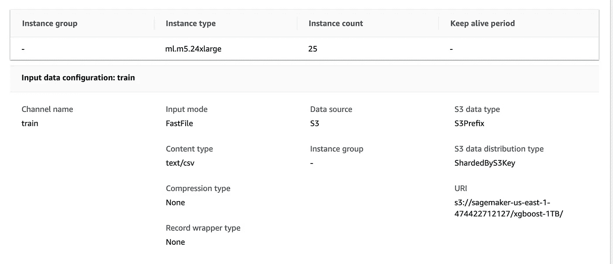
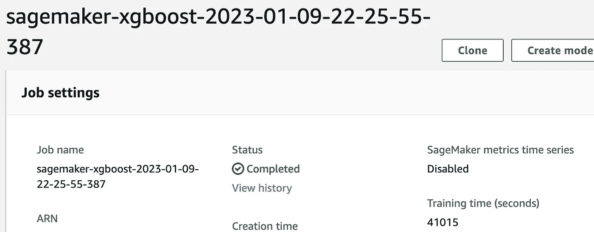

# 在 1TB 数据集上训练 XGBoost

> 原文：[`towardsdatascience.com/training-xgboost-on-a-1tb-dataset-8790e2bc8672`](https://towardsdatascience.com/training-xgboost-on-a-1tb-dataset-8790e2bc8672)

## SageMaker 分布式训练数据并行

[](https://ram-vegiraju.medium.com/?source=post_page-----8790e2bc8672--------------------------------)[](https://towardsdatascience.com/?source=post_page-----8790e2bc8672--------------------------------) [Ram Vegiraju](https://ram-vegiraju.medium.com/?source=post_page-----8790e2bc8672--------------------------------)

·发表于[Towards Data Science](https://towardsdatascience.com/?source=post_page-----8790e2bc8672--------------------------------)·7 分钟阅读·2023 年 2 月 8 日

--


图片来自[Unsplash](https://unsplash.com/photos/LqKhnDzSF-8)，由[Joshua Sortino](https://unsplash.com/@sortino)拍摄

随着机器学习的不断发展，我们看到越来越多参数的[大型模型](https://docs.cohere.ai/docs/introduction-to-large-language-models)。与此同时，我们也看到极其庞大的数据集，归根结底，任何模型的好坏都取决于其训练数据。处理大型模型和数据集可能计算成本高昂且难以快速迭代或实验。本文将重点关注数据集的这一部分问题。具体来说，我们将探讨一种称为[分布式数据并行](https://docs.aws.amazon.com/sagemaker/latest/dg/data-parallel.html)的技术，利用 Amazon SageMaker 优化和减少在大型真实世界数据集上的训练时间。

在今天的示例中，我们将在一个人工生成的**1 TB 数据集**上训练[SageMaker XGBoost 算法](https://docs.aws.amazon.com/sagemaker/latest/dg/xgboost.html)。通过这个示例，我们将深入了解如何准备和构建数据源以加快训练速度，并理解如何利用 SageMaker 内置的[数据并行库](https://docs.aws.amazon.com/sagemaker/latest/dg/data-parallel.html)启动**分布式训练**。

**注意**：本文假设读者具备基本的 AWS 和 SageMaker 特定子功能的知识，例如 SageMaker Training 以及通过 SageMaker Python SDK 和 Boto3 AWS Python SDK 与 SageMaker 和 AWS 进行交互。有关 SageMaker Training 的适当介绍和概述，请参考这篇文章。

## 什么是分布式数据并行？我们为什么需要它？

在开始实现之前，理解 Distributed Data Training 至关重要。对于大型数据集，优化训练时间非常困难，因为这非常计算密集。你必须考虑能够将数据集下载到内存中，以及机器需要执行的训练和超参数计算。对于单台机器来说，这可能是可行的（如果计算能力足够强大），但从时间上来看效率较低，实验过程也会变得很棘手。

使用 Distributed Data Parallel 你可以处理 **实例集群**。这些实例可以包含多个 CPU/GPU。从零开始创建 Distributed Data Parallel 设置可能会很具挑战性，并且节点间通信的开销需要解决。为了简化，我们可以利用 SageMaker 内置的 [Distributed Data Parallel Library](https://docs.aws.amazon.com/sagemaker/latest/dg/data-parallel-intro.html)。在这里，构建和优化节点间通信的繁重工作被抽象化，你可以专注于模型开发。

## 为什么数据来源在 SageMaker 中很重要？

数据的提供方式和位置对于优化训练时间至关重要。SageMaker 中默认的存储服务一直是 S3，这里依然是一个选项。你可以使用原始的训练模式，将数据集直接上传到 S3，这称为 **文件模式**。在这种模式下，SageMaker 会在训练开始前将数据集下载到实例内存中。今天的例子中，我们将使用一种优化的 S3 模式，称为 **快速文件模式**。在快速文件模式下，数据集会 **实时流式传输** 到实例中，以避免下载整个数据集的开销。这也引出了一个问题，我应该如何提供/拆分我的数据集？在这个例子中，我们将数据集拆分成多个小文件，总大小为 1TB，这将有助于下载或在我们案例中的流式传输时间，并且数据集规模较大。

在 S3 之外，你还可以在 SageMaker 上使用 **Elastic File System (EFS)** 和 **FsX Lustre**。如果你的训练数据已经存在于 EFS 上，那么将其挂载到 SageMaker 上非常简单。使用 FsX Lustre，你可以比其他选项更快地扩展，但设置 VPC 时会有一定的操作开销。

最终，在决定 SageMaker 的数据源训练选项时，你应该考虑许多因素。两个主要的考虑点是数据集的大小和如何分片数据集，这些因素结合你数据集的当前位置将帮助你做出正确的选择以优化训练时间。有关更全面的指南，请参考这篇关于 SageMaker 训练的数据源的[文章](https://aws.amazon.com/blogs/machine-learning/choose-the-best-data-source-for-your-amazon-sagemaker-training-job/)。

## 数据集创建

在这个例子中，我们将使用 Abalone 数据集，并在其上运行 SageMaker XGBoost 算法以进行回归模型。你可以从公开的亚马逊数据集中下载数据集。

```py
#retreive data
aws s3 cp s3://sagemaker-sample-files/datasets/tabular/uci_abalone/train_csv/abalone_dataset1_train.csv .
```

这个数据集本身只有 100KB，因此我们需要制作多个副本来创建 1TB 的数据集。为了准备这个数据集，我使用了一个[EC2 实例](https://docs.aws.amazon.com/AWSEC2/latest/UserGuide/get-set-up-for-amazon-ec2.html)（r6a.48xlarge）进行开发。这是一个高内存和计算实例，可以快速准备数据集。一旦设置完成，我们运行以下脚本将数据集制作成更大的 100MB 文件。你可以根据需要切割你的实际数据，这不是一个固定的配方/大小。

```py
import os
import pandas as pd
import sys

#~110KB initial file
df = pd.read_csv("abalone_dataset1_train.csv")
print(sys.getsizeof(df))

#creates a 104MB file
df_larger = pd.concat([df]*700, ignore_index=True)
print(sys.getsizeof(df_larger))

df_larger.to_csv("abalone-100mb.csv")
```

使用 100MB 的数据集，我们可以制作 10,000 个副本来创建 1TB 的数据集。然后我们将这 10,000 个副本上传到 S3，这是我们 FastFile 模式的数据源。

```py
%%sh

#replace with your S3 bucket to upload to
s3_bucket='sagemaker-us-east-1-474422712127'

for i in {0..10000}
do
  aws s3 cp abalone-100mb.csv s3://$s3_bucket/xgboost-1TB/abalone-$i.csv 
done
```

这个脚本运行大约需要 2 小时，但如果你想加快操作速度，可以使用一些形式的多处理 Python 代码与[Boto3](https://boto3.amazonaws.com/v1/documentation/api/latest/index.html)来加快上传时间。

## 训练设置

在我们运行[SageMaker Training Job](https://docs.aws.amazon.com/sagemaker/latest/dg/how-it-works-training.html)之前，我们需要设置合适的客户端和配置。在这里我们特别定义了**训练实例类型**，你可以在以下[页面](https://aws.amazon.com/sagemaker/pricing/)找到详细的选项列表。在选择实例类型时，你需要考虑你所处理的模型类型和所在领域。对于 NLP 和计算机视觉应用场景，通常 GPU 实例被证明是更合适的，在这种情况下，我们使用了一个内存优化实例与我们的 XGBoost 算法。

```py
import boto3
import sagemaker
from sagemaker.estimator import Estimator

boto_session = boto3.session.Session()
region = boto_session.region_name

sagemaker_session = sagemaker.Session()
base_job_prefix = 'xgboost-example'
role = sagemaker.get_execution_role()

default_bucket = sagemaker_session.default_bucket()
s3_prefix = base_job_prefix

training_instance_type = 'ml.m5.24xlarge'
```

接下来，我们准备我们的 TrainingInput，在这里我们指定我们使用的是 FastFile 模式，否则默认为 File 模式。我们还指定了分布方式为“ShardedByS3Key”，这表示我们希望将所有不同的 S3 文件分布到所有实例上。否则，所有数据文件将被加载到每个实例中，从而导致训练时间显著增加。

```py
from sagemaker.inputs import TrainingInput

#replace with your S3 Bucket with data
training_path = 's3://sagemaker-us-east-1-474422712127/xgboost-1TB/'

#set distribution to ShardedByS3Key otherwise a copy of all files will be made across all instances
#we also enable FastFile mode here where as the default is File mode
train_input = TrainingInput(training_path, content_type="text/csv", 
input_mode='FastFile', distribution = "ShardedByS3Key")
training_path
```

接下来我们准备 XGBoost 估算器，要深入了解该算法及其可用的超参数，请参考这篇[文章](https://aws.plainenglish.io/end-to-end-example-of-sagemaker-xgboost-eb9eae8a5207)。另一个关键点是我们将实例数量指定为 25（请注意，根据实例类型，您可能需要申请增加限制）。我们的 10,000 个数据文件将分布在这 25 个 ml.m5.24xlarge 实例上。一旦我们指定的数量大于 1，SageMaker 会推断出分布式数据并行处理我们的模型。

```py
model_path = f's3://{default_bucket}/{s3_prefix}/xgb_model'

image_uri = sagemaker.image_uris.retrieve(
    framework="xgboost",
    region=region,
    version="1.0-1",
    py_version="py3",
    instance_type=training_instance_type,
)

xgb_train = Estimator(
    image_uri=image_uri,
    instance_type=training_instance_type,
    instance_count=25,
    output_path=model_path,
    sagemaker_session=sagemaker_session,
    role=role,

)

xgb_train.set_hyperparameters(
    objective="reg:linear",
    num_round=50,
    max_depth=5,
    eta=0.2,
    gamma=4,
    min_child_weight=6,
    subsample=0.7,
    silent=0,
)
training_instance_type
```

然后我们可以通过将算法应用于训练输入来启动训练任务。

```py
xgb_train.fit({'train': train_input})
```

在我们当前的设置下，此训练任务大约需要 11 小时完成。



分布式设置（作者截图）



SageMaker 训练任务已完成（作者截图）

## 我们如何进一步优化？

我们可以通过几种不同的方式来调整训练时间。一种选择是通过增加实例数量来水平扩展。另一种选择是使用 GPU 实例，这可能需要较小的实例数量，但这并不总是直接的科学。

除了调整训练任务背后的硬件，我们还可以重新审视我们讨论过的数据源格式。您可以评估 FsX Lustre，它可以扩展到每秒 100GB 的吞吐量。另一种选择是将数据集分片成不同格式，以尝试不同的文件数量和文件大小组合。

## 定价

对于 SageMaker 训练任务，您可以在以下[页面](https://aws.amazon.com/sagemaker/pricing/)估算费用。本质上，训练任务按小时和实例类型计费。使用 ml.m5.24xlarge 时，每小时费用为 5.53 美元。使用 25 个实例和 11 小时的运行时间，此训练任务的费用约为**1500 美元**，因此**请记住**在运行示例时。再次提醒，您可以通过在较小的数据子集上测试不同的实例来进一步调整，以估算整个语料库训练前的近似训练时间。

## 参考资料/附加资源

+   [`aws.amazon.com/blogs/machine-learning/choose-the-best-data-source-for-your-amazon-sagemaker-training-job/`](https://aws.amazon.com/blogs/machine-learning/choose-the-best-data-source-for-your-amazon-sagemaker-training-job/)

+   [`docs.aws.amazon.com/sagemaker/latest/dg/distributed-training.html`](https://docs.aws.amazon.com/sagemaker/latest/dg/distributed-training.html)

## 结论

[](https://github.com/RamVegiraju/distributed-xgboost-sagemaker?source=post_page-----8790e2bc8672--------------------------------) [## GitHub - RamVegiraju/distributed-xgboost-sagemaker: 示例：在 1TB 数据上训练 XGBoost 算法…]

### 在这个例子中，我们将 Abalone 数据集扩展到 1TB 大小，并在上面训练 SageMaker XGBoost 算法…

[github.com](https://github.com/RamVegiraju/distributed-xgboost-sagemaker?source=post_page-----8790e2bc8672--------------------------------)

你可以找到上述示例的完整代码。SageMaker 分布式训练提供了大规模训练的能力。我也鼓励你探索一下[模型并行](https://docs.aws.amazon.com/sagemaker/latest/dg/model-parallel.html)，正如名字所示，这涉及到跨多个实例的模型并行。我希望这篇文章对 SageMaker 训练及其分布式能力提供了有用的介绍，欢迎随时提出任何问题。

*如果你喜欢这篇文章，可以通过* [*LinkedIn*](https://www.linkedin.com/in/ram-vegiraju-81272b162/) *与我联系，并订阅我的 Medium* [*新闻通讯*](https://ram-vegiraju.medium.com/subscribe)*。如果你是 Medium 新手，可以使用我的* [*会员推荐链接*](https://ram-vegiraju.medium.com/membership)*注册。*
