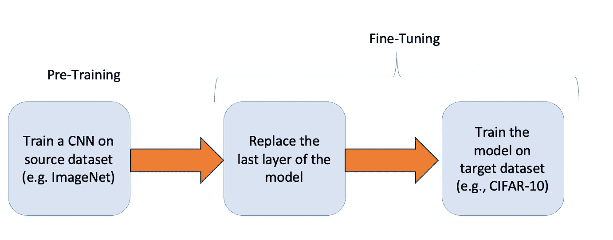
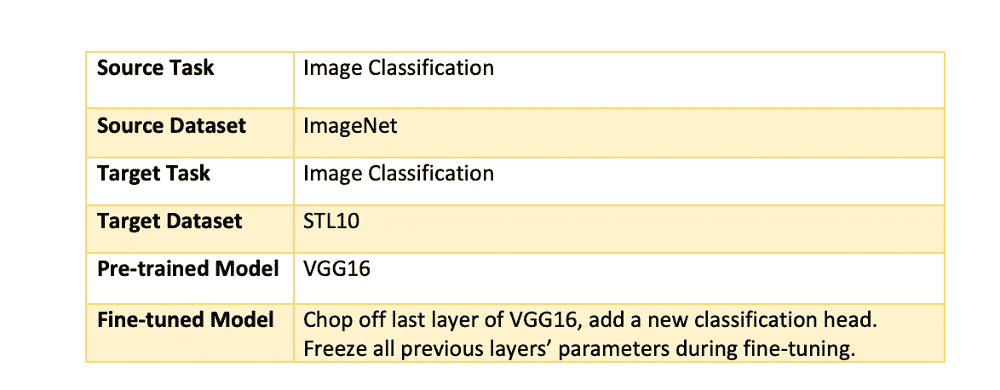
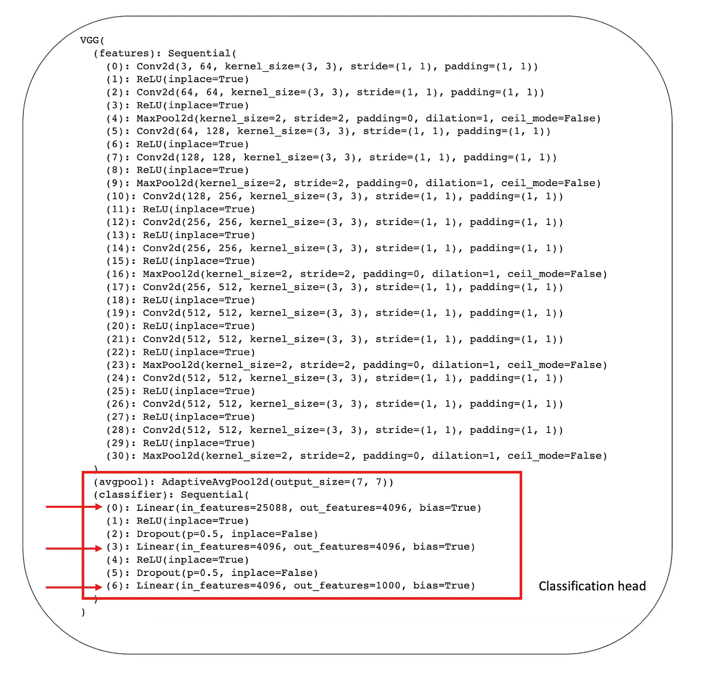

# 迁移学习入门

> 原文：[`towardsdatascience.com/transfer-learning-for-beginner-9b59490d1b9d`](https://towardsdatascience.com/transfer-learning-for-beginner-9b59490d1b9d)

## 图像分类中的迁移学习实用指南

[](https://medium.com/@mina.ghashami?source=post_page-----9b59490d1b9d--------------------------------)[](https://towardsdatascience.com/?source=post_page-----9b59490d1b9d--------------------------------) [Mina Ghashami](https://medium.com/@mina.ghashami?source=post_page-----9b59490d1b9d--------------------------------)

·发布于 [Towards Data Science](https://towardsdatascience.com/?source=post_page-----9b59490d1b9d--------------------------------) ·阅读时间 7 分钟·2023 年 10 月 29 日

--

在这篇文章中，我们将探讨*迁移学习*的概念，并将看到一个*图像分类任务*的例子。

# 什么是迁移学习？

> 迁移学习是深度学习中的一种技术，其中在大规模数据集上训练的预训练模型被用于解决具有有限标记数据的新任务。

它涉及到使用一个已经在源任务上学习到丰富且通用特征表示的预训练模型，并在目标任务上进行微调。

例如，ImageNet 是一个大型数据集（1400 万张图像，1000 个类别），通常用于训练大型卷积神经网络，如 VGGNet 或 ResNet。

如果我们在 ImageNet 上训练这些网络，这些模型会学习提取强大而富有信息的特征。我们称这种训练为*预训练*，这些模型*在 ImageNet 上经过预训练*。注意，它们是在 ImageNet 上进行图像分类任务的训练。我们称之为*源任务*。

要在一个新的任务上进行迁移学习，我们称之为*目标任务*，首先我们需要有标记的数据集，即*目标数据集*。目标数据集通常比源数据集要小得多。我们这里的源数据集非常庞大（有 1400 万张图像）。

然后，我们取这些预训练的模型，去掉最后的分类层，在末尾添加一个新的分类器层，并在我们自己的目标数据集上进行训练。在训练时，我们冻结所有层，除了最后一层，因此只有极少量的参数进行训练，从而训练速度很快。瞧！我们完成了迁移学习。

模型经过的第二次训练称为*微调*。正如我们所看到的，在微调期间，大多数预训练的权重被冻结，只有最后几层会根据新数据集进行调整。



作者提供的图片

## 迁移学习的好处

迁移学习的关键优势在于，它允许你利用预训练模型中已开发的专业知识，从而避免从头开始训练大型模型。它还减少了需要大量标注数据集的需求，这些数据集收集和注释起来非常耗时。

微调预训练模型比从头开始训练要快得多，计算成本也更低。这些模型通过建立在预训练期间学到的一般特征之上，通常能实现高准确率。

## 迁移学习的注意事项

迁移学习的注意事项是目标任务和数据集必须接近源任务和数据集。否则，预训练过程中学到的知识对目标任务将没有用。如果是这样，我们不如从头开始训练模型。

# 实际示例

我们将使用 VGGNet 来演示迁移学习。在 [上一篇文章](https://medium.com/towards-data-science/image-classification-for-beginners-8546aa75f331) 中，我们看到了 VGGNet。如果你不熟悉，请查看一下。

[](/image-classification-for-beginners-8546aa75f331?source=post_page-----9b59490d1b9d--------------------------------) ## 初学者图像分类

### VGG 和 ResNet 架构，2014 年

[towardsdatascience.com

VGG（视觉几何组）是由牛津大学视觉几何组开发的深度卷积神经网络（CNN）架构。它有许多变体，如 VGG16 和 VGG19。所有变体的架构类似，除了层数不同。例如，VGG-16 具有 16 层，包括 13 层卷积层和 3 层全连接层。

*在 ImageNet 上训练的 VGGNet* 通常作为图像分类中的预训练模型用于迁移学习。

对于微调，我们将使用 STL10 数据集，其中包含来自 10 个不同类别的 5000 张小尺寸彩色图像（96x96 像素）。该数据集分为 5000 张图像的训练集和 8000 张图像的测试集。

STL10 数据集是我们的目标数据集，ImageNet 是我们的源数据集，它们在本质上非常相似，因此在迁移学习中使用它们是有意义的。

下面是我们设置的摘要表格：



图片来源于作者

# 加载预训练模型

由于 VGG 的最后一层是 1000（因为它是为包含 1000 类的 ImageNet 训练的），我们将删除它并用 10 类的层替换它。

```py
from torchvision.models import vgg16

# Load the pre-trained VGG-16 model
vgg = vgg16(pretrained=True)
print(vgg)
```

当我们打印 VGG 架构时，我们看到：最后 3 层是全连接层，其中最后一个全连接层是分类头，它将 4096 维的输入分类为 1000 类。



图片来源于作者

我们需要剪掉最后一层，并放置一个新的层，将输入分类为 10 类！因为 STL10 只有 10 个类别。所以我们这样做：

```py
# Modify the last layer of VGG by changing it to 10 classes
vgg.classifier[6] = nn.Linear(in_features=4096, out_features=len(classes))

device = torch.device("cuda" if torch.cuda.is_available() else "cpu");
vgg.to(device)
```

# 数据准备

我们首先加载和转换目标数据。代码如下：

```py
# train transformation
transform_train = transforms.Compose([
    transforms.RandomCrop(96, padding = 4), # we first pad by 4 pixels on each side then crop
    transforms.RandomHorizontalFlip(),
    transforms.ToTensor(),
    transforms.Normalize((0.44671103, 0.43980882, 0.40664575), (0.2603408 , 0.25657743, 0.2712671))
])

# test transformation
transform_test = transforms.Compose([
    transforms.ToTensor(),
    transforms.Normalize((0.44671103, 0.43980882, 0.40664575), (0.2603408 , 0.25657743, 0.2712671))
])

trainset = torchvision.datasets.STL10(root = './data', split = 'train', download = True, transform=transform_train)
trainloader = torch.utils.data.DataLoader(trainset, batch_size = 128, shuffle = True, num_workers = 2)

testset = torchvision.datasets.STL10(root = './data', split = 'test', download = True, transform=transform_test)
testloader = torch.utils.data.DataLoader(testset, batch_size = 256, shuffle = True, num_workers = 2)In above transformation that we have defined on train data you see that we are augmenting the data by cropping a random 28x28 patch and flipping it. The reason we augment the data is to increase diversity in the training data and force the model to learn better.
```

我们解释每一部分。首先，

```py
transforms.RandomCrop(96, padding = 4)
transforms.RandomHorizontalFlip(),
```

***RandomCrop()***接受两个参数——输出大小和填充。例如，输出大小为 32 和填充 4 时，它首先在每边填充 4 像素，然后从填充后的图像中随机裁剪一个 32x32 的区域。

这允许裁剪包括原始图像的边缘像素，因此通过从相同输入生成不同的裁剪来实现数据增强。如果没有填充，裁剪将总是从中心进行，而不包括边缘区域。

这种数据增强帮助模型接触图像的不同部分，提高了泛化能力。

其次，

```py
transforms.ToTensor()
```

***ToTensor()***将 PIL 图像或 numpy 数组转换为可以输入神经网络的 Tensor。它处理从图像数据到 PyTorch 兼容的张量所需的所有转换，例如将数据标准化到（0,1）范围，并将（H, W, C）数组转置为（C, H, W）以供 PyTorch 模型输入。例如，一个 RGB 图像将变成一个 3xHxW 的 Tensor，而一个灰度图像变成一个 1xHxW 的 Tensor。

最后，

```py
transforms.Normalize((0.44671103, 0.43980882, 0.40664575), (0.2603408 , 0.25657743, 0.2712671))
```

通过减去均值并除以标准差来规范化数据。

# 微调模型

微调模型有两种方式：

1.  要么我们冻结之前的层，仅训练分类头。

1.  或者我们一起训练所有层。

虽然第一种方法更快，但第二种方法可能更准确。我们首先通过选项 2 训练模型。为此，我们需要以下函数：

```py
def train_batch(epoch, model, optimizer):
    print("epoch ", epoch)
    model.train()
    train_loss = 0
    correct = 0
    total = 0

    for batch_idx, (input, targets) in enumerate(trainloader):
        inputs, targets = input.to(device), targets.to(device)
        optimizer.zero_grad()
        outputs, _ = model(inputs)
        loss = criterion(outputs, targets)
        loss.backward()
        optimizer.step()

        train_loss += loss.item()
        _, predicted = outputs.max(1)
        total += targets.size(0)
        correct += predicted.eq(targets).sum().item()
    print(batch_idx, len(trainloader), 'Loss: %.3f | Acc: %.3f%% (%d/%d)'
                         % (train_loss/(batch_idx+1), 100.*correct/total, correct, total))

def validate_batch(epoch, model):
    model.eval()
    test_loss = 0
    correct = 0
    total = 0
    with torch.no_grad():
        for batch_idx, (inputs, targets) in enumerate(testloader):
            inputs, targets = inputs.to(device), targets.to(device)
            outputs,_ = model(inputs)
            loss = criterion(outputs, targets)

            test_loss += loss.item()
            _, predicted = outputs.max(1)
            total += targets.size(0)
            correct += predicted.eq(targets).sum().item()

    print(batch_idx, len(testloader), 'Loss: %.3f | Acc: %.3f%% (%d/%d)'
                 % (test_loss/(batch_idx+1), 100.*correct/total, correct, total))
```

然后将它们放在一起得到完整的训练：

```py
start_epoch = 0
for epoch in range(start_epoch, start_epoch+20):
    train_batch(epoch, vgg_model, vgg_optimizer)
    validate_batch(epoch, vgg_model)
    vgg_scheduler.step()
```

如果我们决定冻结某些层并不训练它们，我们需要将某一层的权重和偏置设置为`requires_grad = False`以冻结该层。

这就结束了我们关于图像分类中迁移学习的话题。

# 结论

迁移学习是一种技术，其中在一个任务上训练的模型被重新用作第二个相关任务的起点。它允许你利用预训练模型中的知识，而不是从头开始训练模型。例如，我们可以使用一个在 ImageNet 上预训练的模型，并在一个新的类似图像的数据集上重新训练它。预训练模型在第一个任务中学到的特征被转移并在新任务中重用。

如果你有任何意见或问题，请告诉我。

如果你有任何问题或建议，请随时与我联系：

邮箱：mina.ghashami@gmail.com

LinkedIn: [`www.linkedin.com/in/minaghashami/`](https://www.linkedin.com/in/minaghashami/)
