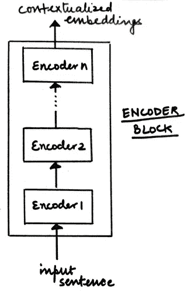

# Transformer 模型 101：入门 — 第一部分

> 原文：[`towardsdatascience.com/transformer-models-101-getting-started-part-1-b3a77ccfa14d?source=collection_archive---------1-----------------------#2023-02-18`](https://towardsdatascience.com/transformer-models-101-getting-started-part-1-b3a77ccfa14d?source=collection_archive---------1-----------------------#2023-02-18)

## 用简单的语言解释 Transformer 模型背后的复杂数学

 [Nandini Bansal](https://nandinibansal1811.medium.com/?source=post_page-----b3a77ccfa14d--------------------------------)

·

[关注](https://medium.com/m/signin?actionUrl=https%3A%2F%2Fmedium.com%2F_%2Fsubscribe%2Fuser%2Fc41c26af0465&operation=register&redirect=https%3A%2F%2Ftowardsdatascience.com%2Ftransformer-models-101-getting-started-part-1-b3a77ccfa14d&user=Nandini+Bansal&userId=c41c26af0465&source=post_page-c41c26af0465----b3a77ccfa14d---------------------post_header-----------) 发表在 [Towards Data Science](https://towardsdatascience.com/?source=post_page-----b3a77ccfa14d--------------------------------) ·11 分钟阅读·2023 年 2 月 18 日

--

图片来源：[Kerttu](https://pixabay.com/users/kerttu-569708/?utm_source=link-attribution&amp%3Butm_medium=referral&amp%3Butm_campaign=image&amp%3Butm_content=1151405) 来自 [Pixabay](https://pixabay.com//?utm_source=link-attribution&amp%3Butm_medium=referral&amp%3Butm_campaign=image&amp%3Butm_content=1151405)

变换器架构在自然语言处理（NLP）领域的突破并不是什么秘密。它克服了诸如 RNN 等序列到序列（seq-to-seq）模型在捕捉文本中的长期依赖性方面的限制。变换器架构成为了 BERT、GPT 和 T5 及其变体等革命性架构的基石。正如许多人所说，NLP 正处于一个黄金时代，毫不夸张地说，变换器模型正是这一切的起点。

## 变换器架构的必要性

正如所说的，需求是发明的母亲。传统的序列到序列模型在处理长文本时表现不佳。***这意味着模型在处理输入序列的后半部分时，往往会忘记前半部分的学习内容***。这种信息丧失是不可取的。

尽管像 LSTM 和 GRU 这样的门控架构通过 ***丢弃沿途无用的信息以记住重要信息***，在处理长期依赖性方面表现出了一些改进，但仍然不够。世界需要更强大的东西，于是，在 2015 年，[**Bahdanau 等人**](https://arxiv.org/abs/1409.0473)**引入了“注意力机制”**。它们与 RNN/LSTM 结合使用，模仿人类行为，专注于选择性事物，同时忽略其余部分。Bahdanau 提议为句子中的每个单词分配相对重要性，以便模型关注重要单词并忽略其他部分。这被证明是对神经机器翻译任务中的编码器-解码器模型的巨大改进，很快，注意力机制的应用也扩展到了其他任务中。

## **变换器模型的时代**

变换器模型完全基于注意力机制，也称为 ***“自注意力”***。这一架构在 2017 年通过论文 “[**Attention is All You Need**](https://arxiv.org/abs/1706.03762)” 介绍给世界。它由编码器-解码器架构组成。

图. 高层次的变换器模型架构（来源：作者）

从高层次来看，

+   ***编码器*** 负责接受输入句子，并将其转换为一个隐藏表示，其中所有无用信息都被丢弃。

+   ***解码器*** 接受这一隐藏表示，并尝试生成目标句子。

在本文中，我们将详细探讨变换器模型的编码器组件。在下一篇文章中，我们将详细讨论解码器组件。让我们开始吧！

# 变换器的编码器

变换器的编码器块由 N 个编码器的堆叠组成，这些编码器顺序工作。一个编码器的输出是下一个编码器的输入，依此类推。最后一个编码器的输出是输入句子的最终表示，这一表示被传递给解码器块。

图：具有堆叠编码器的编码器块（来源：作者）

每个编码器块可以进一步分为下图所示的两个组件。

图：编码器层的组件（来源：作者）

让我们详细查看这些组件，以理解编码器块是如何工作的。编码器块中的第一个组件是***多头注意力***，但在深入细节之前，我们先理解一个基本概念：***自注意力***。

## 自注意力机制

每个人可能会产生的第一个问题是：*注意力和自注意力是不同的概念吗？* 是的，它们不同。（显而易见！）

传统上，***注意力机制***在前一节中讨论的神经机器翻译任务中产生。因此，本质上，注意力机制用于将源句和目标句进行映射。由于 seq-to-seq 模型逐词执行翻译任务，注意力机制帮助我们识别在为目标句生成令牌 x 时应该***更多关注***源句中的哪些令牌。为此，它利用来自编码器和解码器的隐藏状态表示来计算注意力分数，并基于这些分数生成上下文向量作为解码器的输入。如果你想了解更多关于注意力机制的内容，请查看这篇文章（解释得非常精彩！）。

回到***自注意力***，主要思想是在将源句映射到自身时计算注意力分数。如果你有一句话，如，

> *“那个男孩没有过马路，因为* ***它*** *太宽了。”*

对我们人类来说，理解句子中的“it”指的是“road”很简单，但我们如何让语言模型也理解这种关系呢？这就是***自注意力***的作用！

从高层次来看，句子中的每个单词都会与句子中的其他单词进行比较，以量化关系并理解上下文。为了表示目的，你可以参考下图。

让我们详细了解一下自注意力是如何计算的（实际上）。

+   *为输入句子生成嵌入*

查找所有单词的嵌入并将其转换为输入矩阵。这些嵌入可以通过简单的标记化和独热编码生成，也可以通过像 BERT 等嵌入算法生成。***输入矩阵的维度***将等于***句子长度 x 嵌入维度***。我们将其称为***输入矩阵 X***以便于将来参考。

+   *将输入矩阵转换为 Q、K 和 V*

为了计算自注意力，我们需要将 X（输入矩阵）转换为三个新矩阵：

- 查询 (Q)

- 关键 (K)

- 值 (V)

为了计算这三个矩阵，我们将随机初始化三个权重矩阵，即 ***Wq、Wk 和 Wv***。输入矩阵 X 将与这些权重矩阵 Wq、Wk 和 Wv 相乘，以分别获得 Q、K 和 V 的值。权重矩阵的最优值将在过程中学习，以获得更准确的 Q、K 和 V 值。

+   *计算 Q 和 K 转置的点积*

从上图中，我们可以推断 qi、ki 和 vi 代表句子中第 i 个词的 Q、K 和 V 的值。

图例：Q 和 K 转置的点积示例（来源：作者）

输出矩阵的第一行会告诉你词汇 word1 由 q1 表示的与句子中其余词汇的关系，使用点积来计算。点积值越高，词汇之间的相关性越大。为了理解为何计算这个点积，你可以从信息检索的角度理解 Q（查询）和 K（键）矩阵。因此，

- Q 或 Query = 你正在搜索的术语

- K 或 Key = 搜索引擎中的一组关键词，与 Q 进行比较和匹配。

+   *缩放点积*

与之前的步骤一样，我们正在计算两个矩阵的点积，即执行乘法操作，这可能导致值的爆炸。为了确保不会发生这种情况并稳定梯度，我们将 Q 和 K 转置的点积除以嵌入维度的平方根（dk）。

+   *使用 softmax 归一化值*

使用 softmax 函数的归一化将导致值在 0 和 1 之间。具有高点积的单元将被进一步提升，而低值将被减少，使匹配词对之间的区别更清晰。结果输出矩阵可以视为 *得分矩阵 S*。

+   *计算注意力矩阵 Z*

值矩阵或 V 会与上一步骤中获得的得分矩阵 S 相乘，以计算注意力矩阵 Z。

*但等等，为什么要相乘？*

假设 Si = [0.9, 0.07, 0.03] 是句子中第 i 个词的得分矩阵值。这个向量会与 V 矩阵相乘，以计算 Zi（第 i 个词的注意力矩阵）。

***Zi = [0.9 * V1 + 0.07 * V2 + 0.03 * V3]***

我们可以说，为了理解第 i 个词的上下文，我们应该只关注 word1（即 V1），因为注意力分数的 90% 来自 V1 吗？我们可以明确地定义出应该***更多关注***的重要词汇，以理解第 i 个词的上下文。

因此，我们可以得出结论：词汇在 Zi 表示中的贡献越高，词汇之间的相关性和重要性就越大。

现在我们知道如何计算自注意力矩阵，让我们深入了解 ***多头注意力机制*** 的概念。

## ***多头注意力机制***

如果你的分数矩阵偏向于特定的词表示会发生什么？这会误导你的模型，结果可能不如预期。让我们看一个例子来更好地理解这一点。

S1: “*一切都好*”

Z(well) = 0.6 * V(all) + 0.0 * v(is) + 0.4 * V(well)

S2: “*狗吃了食物，因为它饿了*”

Z(it) = 0.0 * V(the) + 1.0 * V(dog) + 0.0 * V(ate) + …… + 0.0 * V(hungry)

在 S1 的情况下，计算 Z(well) 时，更重要的是 V(all)。这甚至比 V(well) 自身还要多。没有保证这个结果的准确性。

在 S2 的情况下，计算 Z(it) 时，所有的重点都放在 V(dog) 上，而其他单词的分数，包括 V(it) 本身，都为 0.0。这看起来是可以接受的，因为“it”这个词是模糊的。将其与其他词相关联比与词本身相关联更合理。这就是计算自注意力的整个目的，即处理输入句子中模糊词的上下文。

换句话说，我们可以说，如果当前词是模糊的，那么在计算自注意力时给其他单词更多的关注是可以的，但在其他情况下，这可能会误导模型。那么，我们现在该怎么办？

*如果我们计算多个注意力矩阵，而不是计算一个注意力矩阵并从中推导最终的注意力矩阵，会怎么样？*

这正是 ***多头注意力*** 的意义所在！我们计算多个版本的注意力矩阵 z1, z2, z3, ….., zm 并将它们连接起来以推导最终的注意力矩阵。这样我们可以对我们的注意力矩阵更有信心。

接下来要讨论的另一个重要概念是，

## 位置编码

在 seq-to-seq 模型中，输入句子逐词输入网络，这使得模型能够跟踪单词相对于其他单词的位置。

但在变压器模型中，我们采取不同的方法。不是逐词输入，而是并行输入，这有助于减少训练时间并学习长期依赖。然而，这种方法会丧失词序。为了正确理解句子的意义，词序是极其重要的。为了解决这个问题，引入了一个新的矩阵称为“***位置编码***”（P）。

这个矩阵 P 与输入矩阵 X 一起发送，以包含与词序相关的信息。出于明显的原因，X 和 P 矩阵的维度是相同的。

计算位置编码时，使用下面给出的公式。

图。计算位置编码的公式（来源：作者）

在上述公式中，

+   **pos** = 单词在句子中的位置

+   **d** = 单词/标记嵌入的维度

+   **i** = 表示嵌入中的每一个维度

在计算中，d 是固定的，但 pos 和 i 变化。如果 d=512，那么 i ∈ [0, 255]，因为我们取 2^i。

如果你想深入了解位置编码，这个视频涵盖了详细内容。

[变换器神经网络视觉指南 — （第一部分）位置嵌入](https://www.youtube.com/watch?v=dichIcUZfOw)

我正在使用上述视频中的一些视觉内容来用我的话解释这一概念。

图。位置编码向量表示（来源：作者）

上图展示了一个位置编码向量及其不同的变量值示例。

图。位置编码向量，i 和 d 恒定（来源：作者）

图。位置编码向量，i 和 d 恒定（来源：作者）

上图展示了如何*在 i 恒定而只有 pos 变化的情况下，***PE(pos, 2i)*** 的值会变化*。我们知道***正弦波***是一个周期性函数，倾向于在固定的间隔后重复自己。我们可以看到 pos = 0 和 pos = 6 的编码向量是相同的。这并不可取，因为我们希望*对不同的 pos 值有不同的位置编码向量*。

这可以通过*改变正弦波的频率*来实现。

图。位置编码向量，pos 和 i 变化（来源：作者）

随着 i 的变化，正弦波的频率也会变化，导致不同的波形，因此，每个位置编码向量的值也不同。这正是我们想要实现的。

位置编码矩阵（P）被添加到输入矩阵（X）中，并送入编码器。

图。将位置编码添加到输入嵌入中（来源：作者）

编码器的下一个组件是**前馈网络**。

## 前馈网络

编码器块中的这一子层是经典的神经网络，包含两个全连接层和 ReLU 激活。它接受来自多头注意力层的输入，对其进行一些非线性变换，最终生成上下文化的向量。全连接层负责考虑每个注意力头，并从中学习相关信息。由于注意力向量彼此独立，它们可以以并行方式传递给变换器网络。

编码器块的最后一个组件是***加法和规范化组件***。

## **加法和规范化组件**

这是一个*残差层*，后跟*层归一化*。残差层确保在处理过程中不会丢失与子层输入相关的重要信息，而归一化层则促进模型训练的速度，并防止值的大幅变化。

图。包含加法和规范化层的编码器组件（来源：作者）

在编码器内部，有两个加法和规范化层：

+   连接多头注意力子层的输入和输出

+   将前馈网络子层的输入连接到其输出。

到此为止，我们总结了编码器的内部工作原理。为了总结文章，让我们快速回顾编码器使用的步骤：

+   生成输入句子的嵌入或标记化表示。这将是我们的输入矩阵 X。

+   生成位置嵌入，以保留与输入句子单词顺序相关的信息，并将其添加到输入矩阵 X 中。

+   随机初始化三个矩阵：Wq、Wk 和 Wv，即查询、键和值的权重。这些权重将在 Transformer 模型的训练过程中更新。

+   将输入矩阵 X 与每个 Wq、Wk 和 Wv 相乘，生成 Q（查询）、K（键）和 V（值）矩阵。

+   计算 Q 和 K 转置的点积，将该乘积除以 dk 或嵌入维度的平方根进行缩放，最后使用 softmax 函数进行归一化。

+   通过将 V 或值矩阵与 softmax 函数的输出相乘来计算注意力矩阵 Z。

+   将此注意力矩阵传递给前馈网络，以执行非线性变换并生成上下文化的嵌入。

在下一篇文章中，我们将了解 Transformer 模型的解码器组件是如何工作的。

这篇文章就到这里。我希望你觉得它有用。如果有的话，请不要忘记点赞并与朋友分享。
