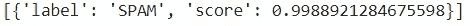

# 通过微调的变换器模型进行自定义文本分类

> 原文：[`towardsdatascience.com/transformer-models-for-custom-text-classification-through-fine-tuning-3b065cc08da1`](https://towardsdatascience.com/transformer-models-for-custom-text-classification-through-fine-tuning-3b065cc08da1)

## 一个关于如何通过微调 DistilBERT 模型来构建垃圾邮件分类器（或任何其他分类器）的教程

[](https://skanda-vivek.medium.com/?source=post_page-----3b065cc08da1--------------------------------)[](https://towardsdatascience.com/?source=post_page-----3b065cc08da1--------------------------------) [Skanda Vivek](https://skanda-vivek.medium.com/?source=post_page-----3b065cc08da1--------------------------------)

·发布于 [Towards Data Science](https://towardsdatascience.com/?source=post_page-----3b065cc08da1--------------------------------) ·阅读时长 4 分钟·2023 年 1 月 20 日

--


[微调的 SMS 垃圾邮件分类器模型](https://huggingface.co/skandavivek2/spam-classifier) 输出 | Skanda Vivek

[DistilBERT 模型](https://arxiv.org/abs/1910.01108)由 Hugging Face 团队发布，是一个较便宜、较快的替代大型变换器模型如 BERT 的选项。它 [最初在一篇博客文章中介绍](https://medium.com/huggingface/distilbert-8cf3380435b5)。该模型的工作方式是通过使用教师-学生训练方法，其中“学生”模型是教师模型的较小版本。然后，不是将学生模型训练在最终目标输出（基本上是标签类别的独热编码）上，而是将模型训练在原始“教师模型”的 softmax 输出上。这是一个极其简单的想法，作者们展示了：

> “可以在保留 97%语言理解能力的同时，将 BERT 模型的大小减少 40%，并且速度提升 60%。”

# 数据加载和分类预处理

在这个例子中，我使用了 UCI 机器学习库中的 [SMS 垃圾邮件收集数据集](https://www.kaggle.com/datasets/uciml/sms-spam-collection-dataset)，构建了一个能够检测 SPAM 与 HAM（非 SPAM）的分类器。数据包含 5574 行标记为 SPAM 或 HAM 的短信。

首先，我从原始 csv 文件中制作训练和验证文件，并使用 Hugging Face 数据集库中的`load_dataset`函数。

```py
from datasets import load_dataset
import pandas as pd

df=pd.read_csv(‘/content/spam.csv’, encoding = “ISO-8859–1”)
df=df[['v1','v2']]
df.columns=['label','text']
df.loc[df['label']=='ham','label']=0
df.loc[df['label']=='spam','label']=1
df2[:4179].reset_index(drop=True).to_csv('df_train.csv',index=False)
df2[4179:].reset_index(drop=True).to_csv('df_test.csv',index=False)

dataset = load_dataset('csv', data_files={'train': '/content/df_train.csv',
                                              'test': '/content/df_test.csv'})
```

下一步是加载 DistilBERT 分词器以预处理文本数据。

```py
from transformers import AutoTokenizer
tokenizer = AutoTokenizer.from_pretrained(“distilbert-base-uncased”)

def preprocess_function(examples):
    return tokenizer(examples["text"], truncation=True,padding=True)

tokenized_data = dataset.map(preprocess_function, batched=True)

from transformers import DataCollatorWithPadding

data_collator = DataCollatorWithPadding(tokenizer=tokenizer)
```

# 训练模型

在训练之前，你需要将 ID 映射到标签。之后，你需要指定训练超参数，调用 trainer.train()开始微调，并使用 trainer.push_to_hub()将训练好的模型推送到 Hugging Face 中心。

```py
id2label = {0: “HAM”, 1: “SPAM”}
label2id = {“HAM”: 0, “SPAM”: 1}

from transformers import AutoModelForSequenceClassification, TrainingArguments, Trainer

model = AutoModelForSequenceClassification.from_pretrained(
    "distilbert-base-uncased", num_labels=2, id2label=id2label, label2id=label2id

training_args = TrainingArguments(
    output_dir="spam-classifier",
    learning_rate=2e-5,
    per_device_train_batch_size=16,
    per_device_eval_batch_size=16,
    num_train_epochs=5,
    weight_decay=0.01,
    evaluation_strategy="epoch",
    save_strategy="epoch",
    load_best_model_at_end=True,
    push_to_hub=True,
)

trainer = Trainer(
    model=model,
    args=training_args,
    train_dataset=tokenized_data["train"],
    eval_dataset=tokenized_data["test"],
    tokenizer=tokenizer,
    data_collator=data_collator,
    compute_metrics=compute_metrics,
)

trainer.train()

trainer.push_to_hub()
```

就是这样！正如你从 Hugging Face 中心看到的，模型的准确度相当不错（0.9885）！

[](https://huggingface.co/skandavivek2/spam-classifier?source=post_page-----3b065cc08da1--------------------------------) [## skandavivek2/spam-classifier · Hugging Face

### 编辑模型卡 该模型是对 distilbert-base-uncased 在未知数据集上进行微调的版本。

huggingface.co](https://huggingface.co/skandavivek2/spam-classifier?source=post_page-----3b065cc08da1--------------------------------)

# 模型推理

推理也相对简单。你可以通过运行以下 Python 脚本查看输出：

```py
text = “Email AlertFrom: Ash Kopatz. Click here to get a free prescription refill!”

from transformers import pipeline

classifier = pipeline("sentiment-analysis", model="skandavivek2/spam-classifier")
classifier(text)
```



样本微调的 SMS 垃圾邮件分类器模型输出 | Skanda Vivek

或在 Hugging Face 中心运行：


# 主要内容

就是这样！Hugging Face 使得适应最先进的变换器模型到定制语言任务非常简单易用，只要你有数据！

这是代码的 GitHub 链接：

[](https://github.com/skandavivek/fine-tune-transformer-classifier?source=post_page-----3b065cc08da1--------------------------------) [## GitHub - skandavivek/fine-tune-transformer-classifier

github.com](https://github.com/skandavivek/fine-tune-transformer-classifier?source=post_page-----3b065cc08da1--------------------------------)

如果你喜欢这篇博客，可以查看我关于[针对问题回答微调变换器模型的其他博客！](https://medium.com/towards-data-science/fine-tune-transformer-models-for-question-answering-on-custom-data-513eaac37a80)

参考文献：

1.  [*https://www.kaggle.com/datasets/uciml/sms-spam-collection-dataset*](https://www.kaggle.com/datasets/uciml/sms-spam-collection-dataset)

1.  *Dua, D. 和 Graff, C. (2019). UCI 机器学习库 [http://archive.ics.uci.edu/ml]。加州欧文：加州大学信息与计算机科学学院。*

1.  *Almeida, T.A., Gómez Hidalgo, J.M., Yamakami, A. 对 SMS 垃圾邮件过滤的研究贡献：新数据集和结果。2011 年 ACM 文档工程研讨会（DOCENG’11）论文集，山景城，加利福尼亚，美国，2011 年。*

1.  [*https://huggingface.co/docs/transformers/training*](https://huggingface.co/docs/transformers/training)

*如果你还不是 Medium 的会员，想要支持像我这样的作者，可以通过我的推荐链接注册：* [*https://skanda-vivek.medium.com/membership*](https://skanda-vivek.medium.com/membership)

*每周的数据视角* [*在这里订阅*](https://skandavivek.substack.com/)*！*
