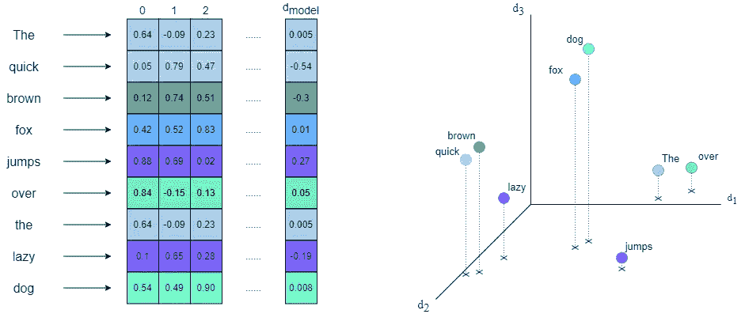
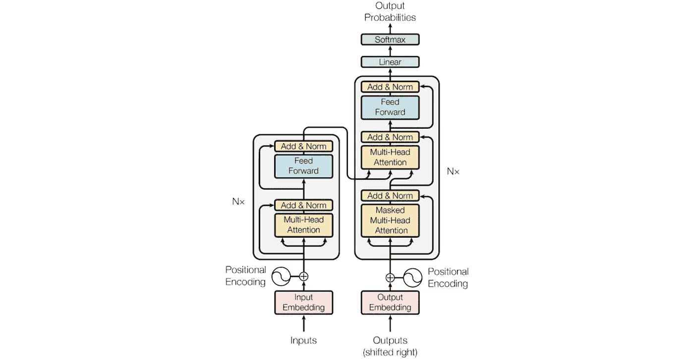
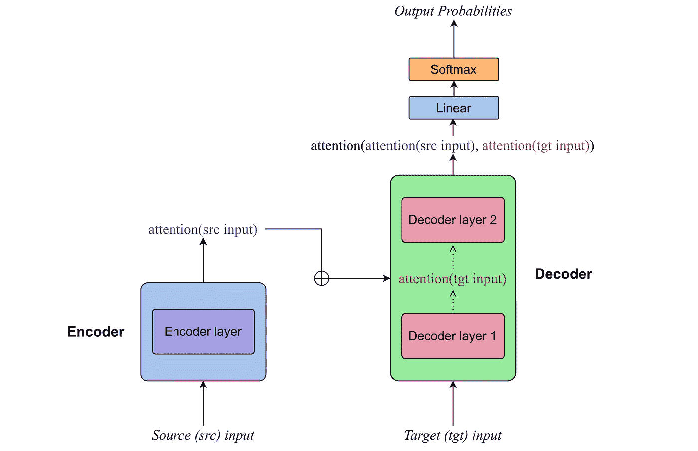
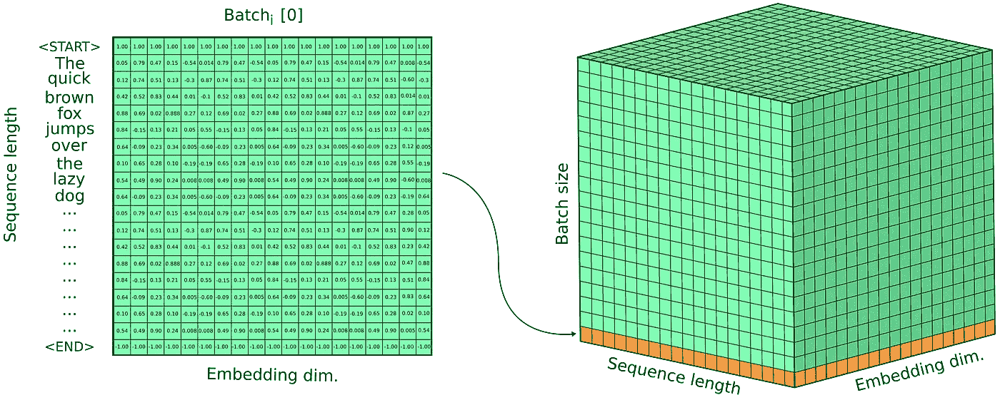
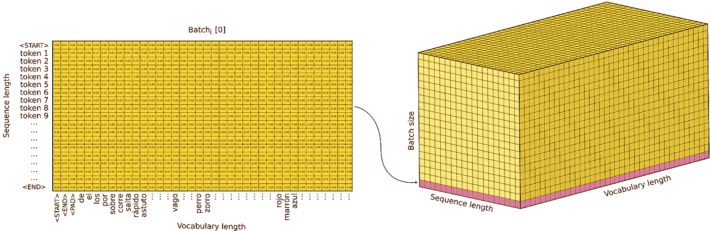
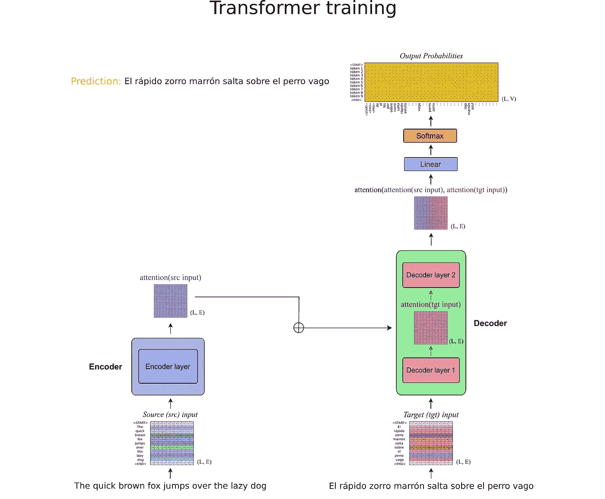
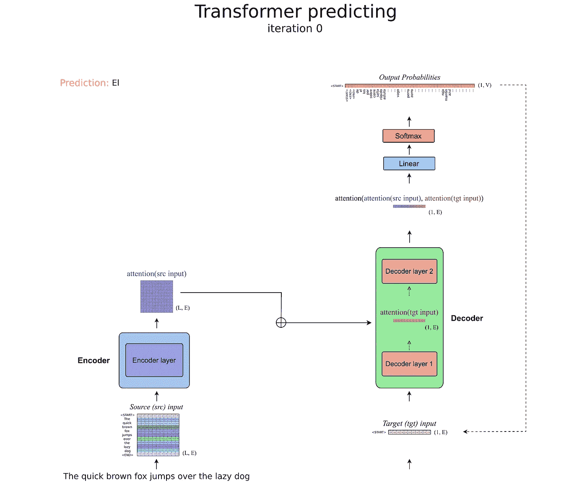
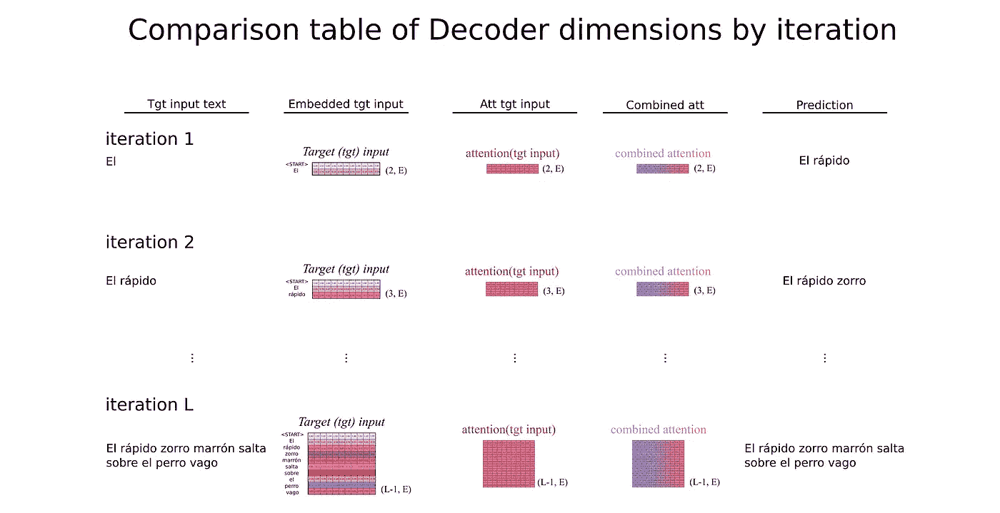

# 深入了解 Transformers – 第一部分。5 分钟介绍 Transformer 模型

> 原文：[`towardsdatascience.com/transformers-in-depth-part-1-introduction-to-transformer-models-in-5-minutes-ad25da6d3cca?source=collection_archive---------0-----------------------#2023-03-27`](https://towardsdatascience.com/transformers-in-depth-part-1-introduction-to-transformer-models-in-5-minutes-ad25da6d3cca?source=collection_archive---------0-----------------------#2023-03-27)

## 在 5 分钟内理解 Transformer 架构及其关键见解

 [Gabriel Furnieles](https://gabrielfurnieles.medium.com/?source=post_page-----ad25da6d3cca--------------------------------)

·

[关注](https://medium.com/m/signin?actionUrl=https%3A%2F%2Fmedium.com%2F_%2Fsubscribe%2Fuser%2Fe77c10fd9715&operation=register&redirect=https%3A%2F%2Ftowardsdatascience.com%2Ftransformers-in-depth-part-1-introduction-to-transformer-models-in-5-minutes-ad25da6d3cca&user=Gabriel+Furnieles&userId=e77c10fd9715&source=post_page-e77c10fd9715----ad25da6d3cca---------------------post_header-----------) 发表在 [Towards Data Science](https://towardsdatascience.com/?source=post_page-----ad25da6d3cca--------------------------------) ·9 分钟阅读·2023 年 3 月 27 日

--

这是文章扩展版的第一部分，不久你将能在[这里](https://medium.com/@gabrielfurnieles)找到其后续内容。

> **作者注释。** 在这一部分，我决定介绍理解 Transformer 模型所需的概念和知识，以便更好地理解接下来的章节。如果你已经熟悉 Transformers，可以查看最后一节以获取本文的总结，并随意跳到第二部分，其中介绍了更多数学和复杂的概念。尽管如此，我希望你也能从这部分的解释中获得一些价值。感谢阅读！

自从最新的大型语言模型（LLaM）发布以来，例如 [OpenAI](https://openai.com/blog/chatgpt) 的 GPT 系列，[Bloom](https://bigscience.huggingface.co/blog/bloom) 开源模型或 Google 关于 [LaMDA](https://blog.google/technology/ai/lamda/) 的公告等，Transformers 展示了其巨大潜力，成为深度学习模型的前沿架构。

尽管已有几篇关于 Transformer 及其背后数学的文章 [[2]](https://arxiv.org/pdf/2207.09238.pdf) [[3]](https://jalammar.github.io/illustrated-transformer/) [[4]](https://kazemnejad.com/blog/transformer_architecture_positional_encoding/)，在这一系列文章中，我希望提供一个完整的概述，结合我认为最好的方法、我个人的观点以及与 Transformer 模型工作的经验。

> 本文试图提供 Transformer 模型的深度数学概述，展示其强大的来源并解释其每个模块背后的原因。
> 
> **注。** 文章遵循了原始 Transformer 模型，参考了论文 [Vaswani, Ashish, et al. 2017.](https://proceedings.neurips.cc/paper/2017/file/3f5ee243547dee91fbd053c1c4a845aa-Paper.pdf)

## 环境设置。自然语言处理（NLP）简要介绍

在开始使用 Transformer 模型之前，有必要了解它们创建的任务，即处理文本。

由于神经网络处理的是数字，为了将文本输入神经网络，我们必须首先将其转换为数字表示。将文本（或其他对象）转换为数字形式的过程称为 **嵌入**。理想情况下，嵌入表示能够再现文本的特征，例如单词之间的关系或文本的情感。

嵌入有多种实现方式，本文并不打算解释它们（更多信息可以在 NLP 深度学习中找到），而是要理解它们的一般机制和产生的输出。如果你不熟悉嵌入，只需将其视为模型架构中的另一层，将文本转换为数字。

最常用的嵌入方法作用于文本中的单词，将每个单词转换为一个高维向量（文本中分割的元素称为**标记**）。在原始论文 [1] 中，每个标记/单词的**嵌入维度**为*512*。值得注意的是，向量的模也**被归一化**，以便神经网络能够正确学习并避免梯度爆炸。

嵌入的一个重要元素是**词汇表**。这对应于可以用来输入到 Transformer 模型中的所有标记（单词）集合。词汇表不一定仅限于句子中使用的单词，而是与其主题相关的任何其他单词。例如，如果 Transformer 将用于分析法律文件，那么与官僚术语相关的每个单词都必须包含在词汇表中。请注意，词汇表越大（如果与 Transformer 任务相关），嵌入就越能找到标记之间的关系。

除了单词外，还有一些其他**特殊标记**被添加到词汇表和文本序列中。这些标记标记文本中的特殊部分，如开始<START>、结束<END>或填充<PAD>（填充是为了使**所有序列具有相同长度**）。这些特殊标记也被嵌入为向量。

在数学中，嵌入空间构成了一个**标准化向量空间**，其中每个向量对应于一个特定的标记。向量空间的基由嵌入层能够找到的标记之间的关系决定。例如，一个维度可能对应于以*-ing* 结尾的动词，另一个可能是具有积极含义的形容词，等等。此外，向量之间的角度决定了标记之间的相似性，形成具有语义关系的标记簇。

文本嵌入示意图。左侧，单词/标记被嵌入为向量，其中 d_model 代表最大嵌入维度。右侧，表示了前 3 个维度。尽管示例有所夸张，但请注意相似的单词如何形成组（簇），代表它们之间的相似性。图片由作者提供。

> **注 1.** 尽管只提到了文本处理任务，但实际上 Transformer 是为了处理任何类型的序列数据而设计的。

# Transformer 的工作流程

Transformer 图示。图片来源于论文 [Vaswani, Ashish, et al. 2017.](https://proceedings.neurips.cc/paper/2017/file/3f5ee243547dee91fbd053c1c4a845aa-Paper.pdf)

上面是近年来深度学习研究中最常见的图示之一。它总结了 Transformers 的完整工作流程，表示了过程中的每个部分/模块。

从更高的视角来看，Transformer 被分为 **编码器**（图中的左侧蓝色块）和 **解码器**（右侧蓝色块）。

**为了说明 Transformer 的工作原理，我将使用从英语到西班牙语的文本翻译任务作为例子。**

+   编码器的目标是找出输入序列中各个标记之间的关系，即需要翻译成西班牙语的句子。它将英语句子作为输入（应用嵌入后），并输出加权后的相同序列，权重由注意力机制决定。从数学上讲，[编码器在英语标记的嵌入空间中执行变换，根据句子的意义对向量进行加权](http://a)。

> **注意 2.** 我还没有定义注意力是什么，但本质上可以将其视为一个函数，该函数返回一些系数，用于定义句子中每个词相对于其他词的重要性。

+   另一方面，解码器以翻译后的西班牙语句子（原始图中的*Outputs*）作为第一个输入，应用注意力机制，然后将结果与编码器的输出通过另一种注意力机制进行结合。直观地说，[解码器学会了将目标嵌入空间（西班牙语）与输入嵌入空间（英语）相关联，从而在这两个向量空间之间找到基础变换。](http://a)

Transformer 的高层视角概述。编码器和解码器层已被简化为单个块，并且每个块的输出已被标注。图片由作者提供。

> **注意 3.** 为了清晰起见，我将使用源输入来指代编码器的输入（英语句子），并使用目标输入来指代解码器中的期望输出（西班牙语句子）。这种标记将在文章的其余部分保持一致。

现在让我们更详细地查看 Transformer 的输入（源输入和目标输入）以及输出：

正如我们所见，Transformer 的输入文本被嵌入到一个高维向量空间中，因此输入的是一系列向量而不是一个句子。然而，还有一种更好的数学结构来表示向量序列，那就是矩阵！更进一步地，在训练神经网络时，我们不是逐样本训练，而是使用多个样本打包成的批次进行训练。**最终的输入是形状为 *[N, L, E]* 的张量，其中 *N* 是批次大小，*L* 是序列长度，*E* 是嵌入维度**。

**源输入张量**的示意图。在左侧，二维张量表示批次的第一个 **嵌入序列**。在右侧，是包含单个批次所有序列的完整批次张量，输入到 Transformer 编码器中。同样，目标张量具有相同的形状，但包含真实的输出。图片由作者提供。

关于 Transformer 的输出，应用了一个线性 + Softmax 层，产生一些输出概率（回忆一下，Softmax 层输出的是定义类别的概率分布）。Transformer 的输出不是翻译后的句子，而是一个目标词汇的概率分布，决定了具有最高概率的单词。注意，对于序列长度中的每个位置，生成一个概率分布来选择下一个具有更高概率的令牌。**由于在训练过程中 Transformer 一次处理所有句子，我们得到一个 3D 张量，表示词汇令牌的概率分布，其形状为*[N, L, V]*，其中 N 是批量大小，L 是序列长度，V 是词汇长度**。

**输出概率张量**的示意图。左侧是单个序列的词汇预测概率分布。每列表示目标词汇空间中的一个单词，每行对应序列中的令牌。右侧是整个批次的完整预测张量。图片由作者提供。

最终，**预测的令牌是概率最高的**。

> **注意 4.** 如在 NLP 引言部分所述，嵌入后的所有序列都具有相同的长度，这对应于 Transformer 可以引入/生成的最长序列。

# 训练与预测

在文章第一部分的最后一节中，我想谈谈 Transformer 的训练阶段与预测阶段的区别。

如上一节所述，Transformer 接受两个输入（源和目标）。在训练过程中，Transformer 能够一次处理所有输入，这意味着输入张量仅通过模型传递一次。输出实际上是前面图中呈现的三维概率张量。

Transformer 训练阶段。首先，源输入（英文句子）被嵌入并在编码器中应用注意力。然后，目标输入（西班牙语）被输入到解码器中，在解码器的第二层中，源注意力和目标注意力被结合。最后，生成词汇令牌的概率分布，并选择概率最高的令牌以形成翻译后的输出句子。**注意，在层之间（L,E）的维度不变**。图片由作者提供。

相反，在预测阶段，没有目标输入序列供 Transformer 输入（如果我们已经知道翻译后的句子，就不需要深度学习模型进行文本翻译了）。那么，我们输入什么作为目标输入呢？

就在这一点上，**Transformer 的自回归行为**显现出来。Transformer 可以在编码器中一次处理源输入序列，但对于解码器模块，它进入一个循环，每次迭代只生成序列中的下一个标记（一个关于词汇标记的行概率向量）。具有较高概率的选择标记随后作为目标输入再次输入，因此 Transformer 总是根据其之前的预测来预测下一个标记（因此具有自回归含义）。但是，在第一次迭代时应该输入哪个标记呢？

记得在 NLP 介绍部分提到的特殊标记吗？作为目标输入引入的第一个元素是起始标记<START>，它标志着句子的开始。

Transformer 预测阶段。编码器部分保持不变，而解码器的张量是行向量。第一次（0 次）迭代的输入文本为空，因为只有<START>标记。**注意连接预测标记回到目标输入的箭头，表示自回归行为**。在接下来的迭代中，目标输入会随着 Transformer 从序列中预测新的标记而增加。然而，只考虑输出概率张量中的最后一行，这意味着过去预测的标记不能改变。图片由作者提供。

比较解码器在预测阶段的维度的表（上图展示了迭代 0）。注意维度从 1 增加到 L-1。一旦 Transformer 预测了序列中的倒数第二个标记，它会添加<END>特殊标记来完成预测。图片由作者提供。

# 摘要

本部分介绍了了解 Transformer 模型所需的初步概念和思想。在下一部分，我将深入探讨 Transformer 架构的每个模块，其中大部分数学内容都在其中。

这篇文章的主要思想和概念是：

+   Transformers 在**规范化向量空间**中工作，该空间由嵌入系统定义，每个维度代表标记之间的一个特征。

+   Transformers **输入是形状为[N, L, E]的张量**，其中 N 表示批量大小，L 是序列长度（由于填充对每个序列都是恒定的），E 代表嵌入维度。

+   当**编码器**在源嵌入空间中发现标记之间的关系时，**解码器**的任务是学习从源空间到目标空间的投影。

+   Transformer 的输出是一个行向量，其长度等于词汇表的大小，**每个系数代表相应索引标记在序列中下一个位置的概率**。

+   在训练期间，Transformer 会一次处理所有输入，输出一个[N, L, V]张量（V 为词汇表长度）。但在预测过程中，**Transformers 是自回归的**，总是基于之前的预测逐个预测标记。

下一篇文章的部分内容将很快在[**这里**](https://medium.com/@gabrielfurnieles)发布。

感谢阅读！如果你发现这篇文章有帮助或启发，请考虑关注我，以获取更多关于 AI 和深度学习的内容。

[加布里埃尔·弗尼耶莱斯 - Medium](https://medium.com/@gabrielfurnieles?source=post_page-----ad25da6d3cca--------------------------------)

### 在 Medium 上阅读加布里埃尔·弗尼耶莱斯的文章。他是数学工程专业的学生，专注于 AI 和 ML。我写…

[加布里埃尔·弗尼耶莱斯 - Medium](https://medium.com/@gabrielfurnieles?source=post_page-----ad25da6d3cca--------------------------------)

你可能还会对以下内容感兴趣：

[5 种最有前途的图像翻译 AI 模型](https://towardsdatascience.com/the-5-most-promising-ai-models-for-image-translation-de2677e526e6?source=post_page-----ad25da6d3cca--------------------------------)

### 最新图像生成模型的最前沿技术

[链接](https://towardsdatascience.com/the-5-most-promising-ai-models-for-image-translation-de2677e526e6?source=post_page-----ad25da6d3cca--------------------------------)
