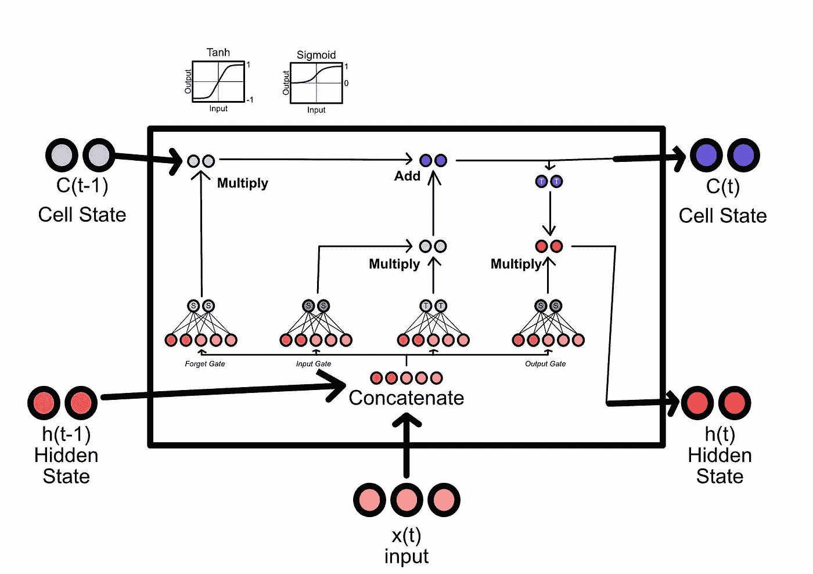
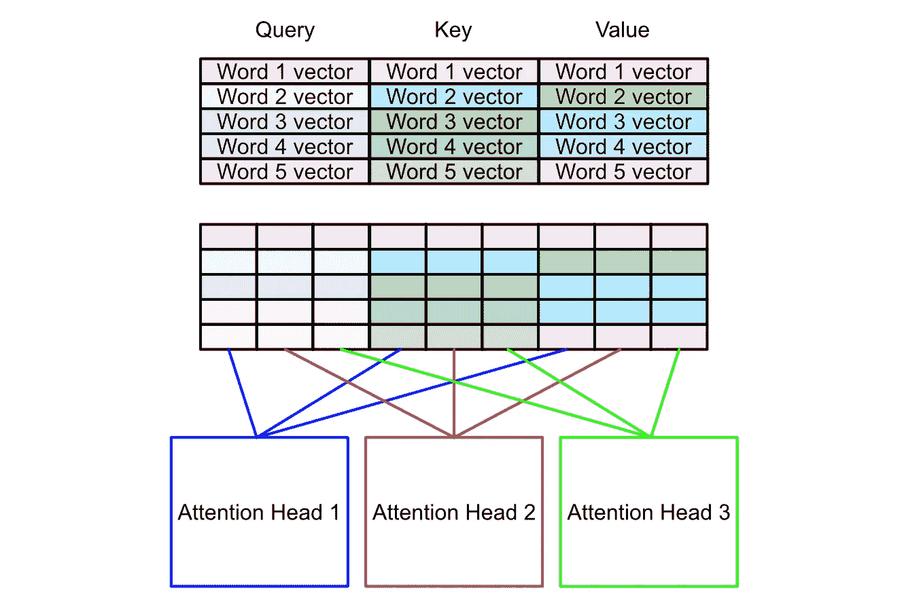

# 变换器 — 直观且详尽的解释

> 原文：[`towardsdatascience.com/transformers-intuitively-and-exhaustively-explained-58a5c5df8dbb`](https://towardsdatascience.com/transformers-intuitively-and-exhaustively-explained-58a5c5df8dbb)

## 探索现代机器学习的浪潮：逐步拆解变换器

[](https://medium.com/@danielwarfield1?source=post_page-----58a5c5df8dbb--------------------------------)[](https://towardsdatascience.com/?source=post_page-----58a5c5df8dbb--------------------------------) [丹尼尔·沃菲尔德](https://medium.com/@danielwarfield1?source=post_page-----58a5c5df8dbb--------------------------------)

·发表于 [Towards Data Science](https://towardsdatascience.com/?source=post_page-----58a5c5df8dbb--------------------------------) ·15 分钟阅读·2023 年 9 月 20 日

--


图像由作者使用 MidJourney 制作。所有图像由作者提供，除非另有说明。

在这篇文章中，你将学习变换器架构，它是几乎所有前沿大型语言模型的核心架构。我们将从一些相关自然语言处理概念的简要时间线开始，然后逐步讲解变换器，揭示它的工作原理。

**这对谁有用？** 对自然语言处理（NLP）感兴趣的任何人。

**这篇文章的难度如何？** 这篇文章不是很复杂，但有很多概念，因此对经验较少的数据科学家可能会有些令人生畏。

**前提条件：** 对标准神经网络有良好的工作理解。对嵌入、编码器和解码器有一些初步了解也会很有帮助。

# 自然语言处理到变换器的简要时间线

以下章节包含在了解变换器之前需要知道的有用概念和技术。如果你感觉自信，可以跳过前面的内容。

## 词向量嵌入

对词向量嵌入的概念理解对于理解自然语言处理至关重要。实质上，词向量嵌入将单个单词转换成一个向量，这个向量以某种方式表示其含义。


词向量嵌入器的工作：将单词转换为数字，这些数字以某种方式捕捉其一般意义。

细节可能因实现而异，但最终结果可以被认为是一个“单词空间”，其中空间遵循某些便利的关系。**单词很难进行数学运算，但包含有关单词及其与其他单词关系信息的向量，进行数学运算则显著容易得多。** 将单词转换为向量的任务通常被称为“嵌入”。

Word2Vect，作为自然语言处理领域的一篇开创性论文，旨在创建一个符合某些有用特性的嵌入。实际上，他们希望能够对单词进行代数运算，并创建了一个嵌入以促进这一点。通过 Word2Vect，你可以嵌入“king”这个词，减去“man”的嵌入，再加上“woman”的嵌入，你会得到一个与“queen”的嵌入最接近的向量。


对单词嵌入进行代数运算的概念性演示。如果你将每个点看作是从原点的向量，如果你从“king”的向量中减去“man”的向量，并加上“woman”的向量，那么结果向量将接近单词“queen”。实际上，这些嵌入空间的维度要高得多，而“接近度”的度量可能不那么直观（例如余弦相似度），但直觉保持不变。

随着技术的发展，单词嵌入仍然是一个重要工具，其中 GloVe、Word2Vec 和 FastText 都是流行的选择。子词嵌入通常比完整的单词嵌入更强大，但超出了本文的范围。

## 递归网络（RNNs）

现在我们可以将单词转换为具有某些意义的数字，我们可以开始分析单词序列。早期的一种策略是使用递归神经网络，你将训练一个在顺序输入上自我反馈的神经网络。


RNN 的一般思想是一个正常的全连接神经网络，它自我反馈。


如果一个 RNN 有 3 个隐藏神经元，并且用于 2 个输入，它可能看起来像这样。红色的箭头是递归连接，它们连接来自后续递归层的信息。蓝色的箭头是内部连接，类似于一个密集层。神经网络被复制以便说明，但请记住，网络实际上是自我反馈的，这意味着第二（以及后续）模块的参数将与第一个模块相同。

与传统神经网络不同，由于递归网络自我反馈，它们可以用于任意长度的序列。对于长度为 10 的序列或长度为 100 的序列，它们将具有相同数量的参数，因为它们重用每个递归连接的相同参数。

这种网络风格在许多建模问题中得到应用，这些问题通常可以归类为序列到序列建模、序列到向量建模、向量到序列建模和序列到向量到序列建模。


几种不同建模策略的概念图，这些策略可能会使用 RNNs。序列到序列可能是预测文本完成的下一个词。序列到向量可能是评分客户对评论的满意度。向量到序列可能是将图像压缩成向量，并要求模型将该图像描述为文本序列。序列到向量到序列可能是文本翻译，其中你需要理解一个句子，将其压缩成某种表示，然后用不同的语言构建该压缩表示的翻译。

尽管无限长度序列建模的前景令人心动，但实际上并不切实际。由于每一层共享相同的权重，递归模型很容易忘记输入内容。因此，RNNs 实际上只能用于非常短的词序列。

曾经有一些尝试通过使用“门控”和“泄漏”RNNs 来解决这个问题。其中最著名的是 LSTM，下一部分将描述它。

## 长短期记忆（LSTMs）

LSTM 的创建旨在提高递归网络记忆重要信息的能力。LSTM 具有短期和长期记忆，可以在序列中的任何给定元素中将某些信息检查进或从长期记忆中移除。


LSTM 的核心要点

从概念上讲，LSTM 有三个关键子组件：用于忘记之前长期记忆的“遗忘门”，用于将信息写入长期记忆的“输入门”，以及用于制定下一次迭代的短期记忆的“输出门”。



LSTM 中的参数。这个特定的 LSTM 期望输入向量的维度为 3，并持有维度为 2 的内部状态向量。向量的维度是一个可配置的超参数。另外，请注意每个门末尾的“S”和“T”。这些代表 sigmoid 或 tanh 激活函数，用于将值压缩到某些范围，如 0 到 1 或-1 到 1。这个“压缩”使网络能够“忘记”和“记忆”某些信息。图像由作者提供，深受来源的启发。

LSTM 和类似的架构，如 GRU，证明比前面讨论的经典 RNN 有了显著改善。能够将记忆作为一个单独的概念进行检查和释放，证明是非常强大的。然而，尽管 LSTM 能够建模更长的序列，但它们在许多语言建模任务中太过遗忘。此外，由于它们依赖于先前的输入（像 RNN 一样），它们的训练难以并行化，结果也很慢。

## 通过对齐提取注意力

标志性论文，[通过联合学习对齐和翻译的神经机器翻译](https://arxiv.org/abs/1409.0473)普及了注意力的一般概念，并且是变换器中多头自注意力机制的概念先驱。

我有一篇关于这个具体主题的[文章](https://medium.com/roundtableml/attention-from-alignment-practically-explained-548ef6588aa4)，其中包含了 PyTorch 的示例代码。简而言之，本文中的注意力机制会查看所有潜在的输入，并决定在任何给定的输出时将哪个输入呈现给 RNN。**换句话说，它决定了哪些输入当前是相关的，哪些输入当前是不相关的**。

[](https://blog.roundtableml.com/attention-from-alignment-practically-explained-548ef6588aa4?source=post_page-----58a5c5df8dbb--------------------------------) [## 从对齐中提取注意力，实际解释

### 关注重要的，忽略不重要的。

[blog.roundtableml.com](https://blog.roundtableml.com/attention-from-alignment-practically-explained-548ef6588aa4?source=post_page-----58a5c5df8dbb--------------------------------)

这种方法被证明对翻译任务有着巨大的影响。它使递归网络能够确定哪些信息当前是相关的，从而在翻译任务中实现了前所未有的性能。


链接文章中的一张图。方块代表词向量嵌入，圆圈代表中介向量表示。红色和蓝色圆圈是来自递归网络的隐藏状态，白色圆圈是由通过对齐机制的注意力创建的隐藏状态。关键在于，注意力机制可以选择在任何给定步骤向输出呈现正确的输入。

# 变换器

在前面的章节中，我们涉及了一些宏观的知识。现在我们将深入探讨变换器，它结合了先前成功的和新颖的想法，彻底改变了自然语言处理。


变换器图示。[source](https://arxiv.org/pdf/1706.03762.pdf)

我们将逐个元素讨论变换器，并讨论每个模块如何工作。内容很多，但不涉及复杂的数学，概念也相当易懂。

## 高级架构

从根本上讲，变换器是一个编码器/解码器风格的模型，有点像我们之前讨论的序列到向量到序列模型。编码器接受某些输入并将其压缩为一个表示，编码整个输入的意义。然后解码器接受这个嵌入并递归地构造输出。


一个变换器在序列到向量到序列任务中的工作，总的来说。输入（我是一名经理）被压缩为某种抽象表示，编码整个输入的意义。解码器像我们之前讨论的 RNN 一样递归地构造输出。

## 输入嵌入和位置编码


原图中的输入嵌入。[source](https://arxiv.org/pdf/1706.03762.pdf)

对于变换器，输入嵌入类似于之前讨论的策略；一个类似于 word2vect 的词空间嵌入器将所有输入词转换为向量。这个嵌入与模型一起训练，基本上是一个通过模型训练得到改进的查找表。因此，每个词汇表中的词会有一个随机初始化的向量，而这个向量会随着模型对每个词的学习而变化。

与递归策略不同，变换器一次性编码整个输入。因此，编码器可能会丢失关于输入中词位置的信息。为了解决这个问题，变换器还使用位置编码器，它是一个编码关于特定词在序列中位置的信息的向量。

```py
"""
Plotting positional encoding for each index.
A positional encoding for a single token would be a horizontal row in the image

inspired by https://machinelearningmastery.com/a-gentle-introduction-to-positional-encoding-in-transformer-models-part-1/
"""

import numpy as np
import matplotlib.pyplot as plt

#these would be defined based on the vector embedding and sequence
sequence_length = 512
embedding_dimension = 1000

#generating a positional encodings
def gen_positional_encodings(sequence_length, embedding_dimension):
    #creating an empty placeholder
    positional_encodings = np.zeros((sequence_length, embedding_dimension))

    #itterating over each element in the sequence
    for i in range(sequence_length):

        #calculating the values of this sequences position vector
        #as defined in section 3.5 of the attention is all you need
        #paper: https://arxiv.org/pdf/1706.03762.pdf
        for j in np.arange(int(embedding_dimension/2)):
            denominator = np.power(sequence_length, 2*j/embedding_dimension)
            positional_encodings[i, 2*j] = np.sin(i/denominator)
            positional_encodings[i, 2*j+1] = np.cos(i/denominator)

    return positional_encodings

#rendering
fig, ax = plt.subplots(figsize=(15,5))
ax.set_ylabel('Sequence Index')
ax.set_xlabel('Positional Encoding')
cax = ax.matshow(gen_positional_encodings(sequence_length, embedding_dimension))
fig.colorbar(cax, pad=0.01)
```


位置编码的示例。Y 轴表示随后的词，X 轴表示特定词位置编码中的值。图中的每一行代表一个单独的词。

```py
"""
Rendering out a few individual examples

inspired by https://machinelearningmastery.com/a-gentle-introduction-to-positional-encoding-in-transformer-models-part-1/
"""
positional_encodings = gen_positional_encodings(100, 50)
fig = plt.figure(figsize=(15, 4))    
for i in range(4):
    ax = plt.subplot(141 + i)
    idx = i*10
    plt.plot(positional_encodings[:,idx])
    ax.set_title(f'positional encoding {idx}')
plt.show()
```


相对于序列中不同索引的位置向量值。K 表示序列中的索引，图表示向量中的值。

这个系统将正弦和余弦函数联合使用来编码位置，你可以在这篇文章中获得一些直观感受：

[## 更频繁地使用频率](https://blog.roundtableml.com/use-frequency-more-frequently-14715714de38?source=post_page-----58a5c5df8dbb--------------------------------)

### 从简单到高级的频率分析手册。探索在数据中广泛未被充分利用的关键工具…

[blog.roundtableml.com](https://blog.roundtableml.com/use-frequency-more-frequently-14715714de38?source=post_page-----58a5c5df8dbb--------------------------------)

我不会多讲，但值得注意的是；这个位置编码系统与电机中使用的位置编码器非常相似，其中两个相位差 90 度的正弦波使电机驱动器能够理解电机的位置、方向和速度。

用于编码词位置的向量会加到该词的嵌入中，创建一个包含该词在句子中位置以及词本身信息的向量。你可能会想“如果你将这些波动的波形加到嵌入向量中，这不会掩盖原始嵌入的一些含义，并可能混淆模型吗”？对此，我会说神经网络（变换器用来作为其可学习参数的网络）对理解和操作平滑且连续的函数非常擅长，因此对于一个足够大的模型来说，这几乎没有什么影响。

## 多头自注意力：高级概述

这可能是变换器机制中最重要的子组件。


原始图中的多头自注意力机制。 [source](https://arxiv.org/pdf/1706.03762.pdf)

在作者谦虚的观点中，将其称为“注意力”机制有点用词不当。实际上，这是一种“关联”和“上下文化”机制。它允许词与其他词进行交互，将输入（即每个词的嵌入向量列表）转换为表示整个输入含义的矩阵。


简而言之，多头自注意力机制。该机制从数学上将不同词的向量结合，创建一个矩阵，编码了整个输入的更深层次的含义。

这个机制可以分为四个独立的步骤：

1.  创建查询、键和值

1.  分成多个头部

1.  注意力头

1.  组合最终输出

## 多头自注意力步骤 1）创建查询、键和值

首先，不必过于担心“查询”、“键”和“值”这些名称。这些名称受到数据库的模糊启发，但实际上只是最模糊的意义。查询、键和值本质上是嵌入输入的不同表示，在整个注意力机制中会彼此关联。


将嵌入输入转换为查询、键和值。输入的维度为 num_words 乘 embedding_size，查询、键和值的维度与输入相同。实质上，密集网络将输入投射到一个具有三倍特征数量的张量中，同时保持序列长度。

上面显示的密集网络包括多头自注意力机制中唯一的可学习参数。多头自注意力可以被视为一个函数，模型学习输入（查询、键和值），以最大化该函数在最终建模任务中的性能。

## 多头自注意力步骤 2）分成多个头部

在进行实际的上下文化处理之前，我们将查询、键和值分成若干部分。核心思想是，我们可以用多种不同的方式来关联我们的词汇，而不是单一的方式。这样做可以编码出更微妙和复杂的含义。



在这个例子中，我们有 3 个注意力头。因此，查询、键和值被分成 3 部分，并传递给每个头。注意，我们是沿特征轴进行划分，而不是沿词汇轴。每个词的不同方面被传递到不同的注意力头，但每个词仍然存在于每个注意力头中。

## 多头自注意力机制。步骤 3) 注意力头

现在我们已经有了传递给注意力头的查询、键和值的子组件，我们可以讨论注意力头如何结合这些值来上下文化结果。在《Attention is All You Need》中，这通过矩阵乘法完成。


矩阵乘法。[来源](https://en.wikipedia.org/wiki/Matrix_multiplication#/media/File:Matrix_multiplication_diagram_2.svg)

在矩阵乘法中，一个矩阵的行与另一个矩阵的列通过点积结合，从而创建出结果矩阵。在注意力机制中，查询和键矩阵相乘，产生我所称之为“注意力矩阵”的东西。


使用查询和键计算注意力矩阵。注意，键被转置，以便矩阵乘法产生正确的注意力矩阵形状。

这是一个相当简单的操作，因此很容易低估其影响。在这一点上使用矩阵乘法迫使每个词的表示与其他词的表示结合。由于查询和键是由密集网络定义的，注意力机制学习如何转换查询和键，以优化这个矩阵的内容。

现在我们有了注意力矩阵，它可以与值矩阵相乘。这有三个主要目的：

1.  通过关联输入的另一种表示来增加一些上下文。

1.  建立一个系统，使查询和键能够转换值，从而根据查询、键和值的来源实现自注意力或交叉注意力。

1.  或许最重要的是，这使得注意力机制的输出与输入大小相同，从而使某些实现细节更容易处理。

**重要更正**

注意力矩阵在乘以值矩阵之前，按行进行 softmax 处理。这一数学细节完全改变了注意力矩阵的概念意义及其与值矩阵的关系。

因为注意力矩阵的每一行都经过 softmax 处理，每一行都变成一个概率。这与我在另一篇文章中讨论的注意力对齐概念非常相似。


来自我的通过对齐的注意力文章。每一行是一个概率分布，总和为 1，强制最重要的内容与其他重要内容相关联。

这个细节在对变压器的更大解释中经常被忽视，但可以说这是变压器架构中最重要的操作，因为它将模糊的关联转化为稀疏且有意义的选择。


注意力矩阵（即查询和键的矩阵乘法）与值矩阵相乘以产生注意力机制的最终结果。由于注意力矩阵的形状，结果与值矩阵的形状相同。请记住，这是来自单个注意力头的结果。

## 多头自注意力。步骤 4）合成最终输出

在上一节中，我们使用了查询（query）、键（key）和值（value）来构建一个新的结果矩阵，该矩阵与值矩阵具有相同的形状，但具有显著更高的上下文感知能力。

记住，注意力头仅计算输入空间子组件（沿特征轴划分）的注意力。


记住，输入被分成了多个注意力头。在这个例子中，有 3 个头。

每个注意力头现在输出不同的结果，这些结果可以拼接在一起。


每个注意力头的结果被拼接在一起

矩阵的形状与输入矩阵的形状完全相同。然而，与每行与单一单词清晰相关的输入不同，这个矩阵要抽象得多。


记住，注意力机制简而言之是将嵌入的输入转换为一个抽象的、丰富上下文的表示。

## Add 和 Norm


在原始图中添加和归一化。[source](https://arxiv.org/pdf/1706.03762.pdf)

Add 和 Norm 操作在编码器中应用了两次，每次效果相同。这里有两个关键概念：跳跃连接（skip connections）和层归一化（layer normalization）。

跳跃连接在机器学习中随处可见。我最喜欢的例子是在图像分割中使用 U-net 架构，如果你熟悉的话。基本上，当你进行复杂操作时，模型容易“脱离自我”。这有各种复杂的数学定义，比如梯度爆炸和秩崩溃，但从概念上讲很简单；模型可能过度思考问题，因此重新引入旧数据可以重新引入一些简单的结构。


跳跃连接添加可能的样子。在这个例子中，左侧的矩阵代表原始编码输入。中间的矩阵代表注意力矩阵的超上下文化结果。右侧代表跳跃连接的结果：一个上下文感知的矩阵，仍然保留了原始输入的一些顺序。

层归一化类似于跳跃连接，从概念上讲，它可以控制数据的异常情况。对这些数据进行了许多操作，导致了值的大小不一。如果你对这个矩阵进行数据科学分析，可能会遇到非常小和极大的值。这被认为是一个问题。

层归一化计算均值和标准差（值的分布范围），并利用这些值将数据压缩回合理的分布中。

## 前馈


原始图示中的前馈。[source](https://arxiv.org/pdf/1706.03762.pdf)

这一部分很简单。我们可以将注意力机制后的添加归一化的输出通过一个简单的全连接网络。我喜欢把这看作一种投影，模型可以学习如何将注意力输出投影到对解码器有用的格式中。

然后将前馈网络的输出通过另一个添加归一化层，这样就得到了最终输出。解码器将使用这个最终输出来生成结果。

## 解码器的一般功能

我们已经完全覆盖了编码器，并且得到了一个高度上下文化的输入表示。现在我们将讨论解码器如何利用这些表示生成输出。


高层次的表示解码器如何与编码器的输出相关。解码器在每次递归输出时都参考编码的输入。

解码器与编码器非常相似，只是有一些小的变化。在谈论这些变化之前，让我们先讨论相似之处。


Transformer 架构 [source](https://arxiv.org/pdf/1706.03762.pdf)

如上图所示，解码器使用相同的词向量嵌入方法，并采用相同的位置编码器。解码器使用“掩码”多头自注意力机制，我们将在下一节讨论，并使用另一个多头注意力块。

第二种多头自注意力机制使用编码后的输入作为键和值，并使用解码器输入生成查询。因此，注意力矩阵从编码器和解码器的嵌入中计算，然后应用于来自编码器的值。这使得解码器能够根据编码器输入和解码器输入来决定最终应该输出什么。

其余部分与你在其他模型中可能发现的模板相同。结果经过另一层前馈、一个加法归一化、一个线性层和一个 softmax。这一 softmax 会输出例如一组单词的概率，从而允许模型决定输出哪个单词。

## 掩码多头自注意力

所以解码器真正新的部分就是“掩码”注意力。这与这些模型的训练方式有关。

循环神经网络的一个核心缺陷是你需要顺序训练它们。RNN 密切依赖于对前一步的分析来指导下一步。


RNN 在步骤之间建立亲密依赖关系

这使得训练 RNN 变得非常缓慢，因为训练集中每个序列需要一个接一个地顺序传递通过模型。通过对注意力机制的一些精心修改，变换器可以解决这个问题，使模型能够并行训练整个序列。

细节可能会有些繁琐，但核心是：在训练模型时，你可以访问期望的输出序列。因此，你可以将整个输出序列（包括你还未预测的输出）馈送给解码器，并使用掩码将它们隐藏在模型之外。这使得你可以同时对序列的所有位置进行训练。


掩码多头自注意力机制的工作示意图，用于英语到法语的翻译任务。该任务的输入是短语“我是一名经理”，期望的输出是短语“Je suis directeur”。请注意，为了简化起见，我通常忽略了实用令牌的概念。它们很容易理解，比如：开始序列、结束序列等。

# 结论

就这样！我们分解了一些导致变换器发现的技术创新以及变换器的工作原理，然后我们回顾了变换器作为编码器-解码器模型的高级架构，并讨论了重要的子组件，如多头自注意力、输入嵌入、位置编码、跳跃连接和归一化。

# 关注更多！

我描述了机器学习领域的论文和概念，重点在于实用和直观的解释。

[](https://medium.com/@danielwarfield1/subscribe?source=post_page-----58a5c5df8dbb--------------------------------) [## 每当丹尼尔·沃菲尔德发布文章时获取邮件

### 高质量的数据科学文章直接送到您的收件箱。每当丹尼尔·沃菲尔德发布文章时获取邮件。通过注册，您…

medium.com](https://medium.com/@danielwarfield1/subscribe?source=post_page-----58a5c5df8dbb--------------------------------) 

从未预期，总是感激。通过捐赠，您使我能够将更多时间和资源分配到更频繁和更高质量的文章上。[了解更多](https://www.buymeacoffee.com/danielwarfield)

**归属:** 本文档中的所有图像均由**丹尼尔·沃菲尔德**创建，除非另有来源说明。您可以将本文中的任何图像用于您的非商业用途，只要您引用了这篇文章，[`danielwarfield.dev`](https://danielwarfield.dev/)，或两者都引用。
