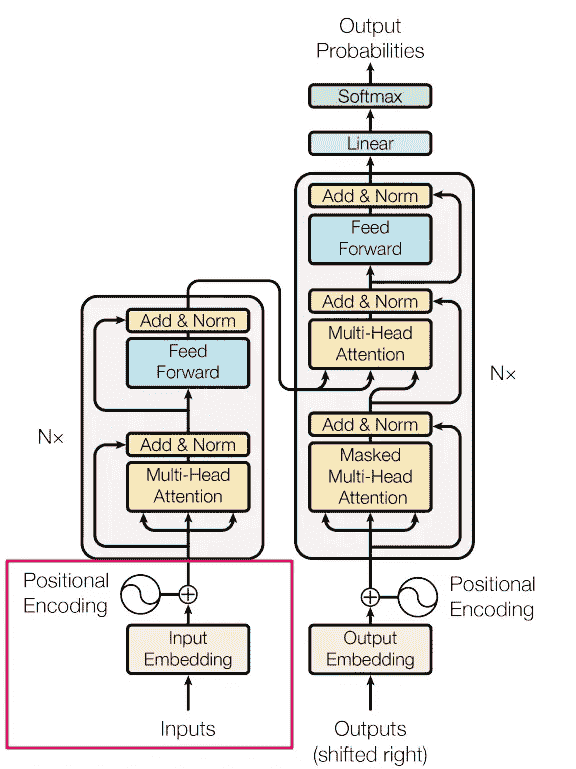
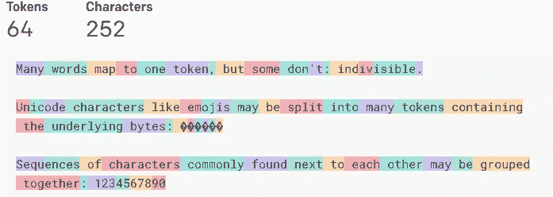
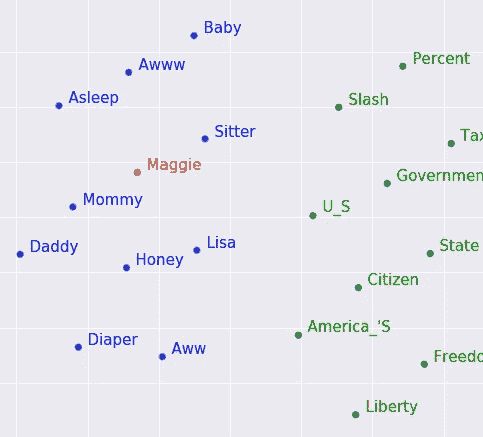
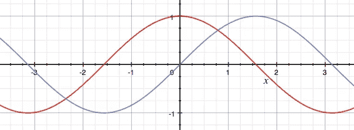
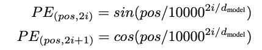
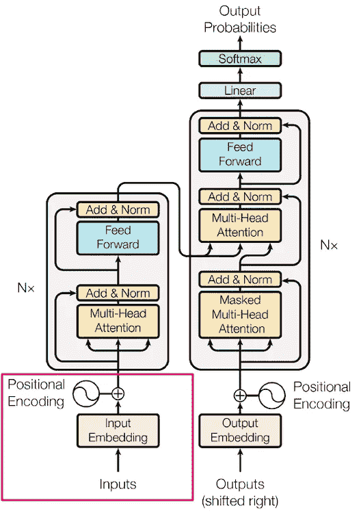

# 简化 Transformers：使用你理解的词语的最前沿 NLP — 第二部分 — 输入

> 原文：[`towardsdatascience.com/transformers-part-2-input-2a8c3a141c7d?source=collection_archive---------2-----------------------#2023-07-26`](https://towardsdatascience.com/transformers-part-2-input-2a8c3a141c7d?source=collection_archive---------2-----------------------#2023-07-26)

## 深入探讨 Transformer 输入的构建方式

[](https://medium.com/@chenmargalit?source=post_page-----2a8c3a141c7d--------------------------------)[](https://towardsdatascience.com/?source=post_page-----2a8c3a141c7d--------------------------------) [Chen Margalit](https://medium.com/@chenmargalit?source=post_page-----2a8c3a141c7d--------------------------------)

·

[关注](https://medium.com/m/signin?actionUrl=https%3A%2F%2Fmedium.com%2F_%2Fsubscribe%2Fuser%2Ff8e6113b0479&operation=register&redirect=https%3A%2F%2Ftowardsdatascience.com%2Ftransformers-part-2-input-2a8c3a141c7d&user=Chen+Margalit&userId=f8e6113b0479&source=post_page-f8e6113b0479----2a8c3a141c7d---------------------post_header-----------) 发表在 [Towards Data Science](https://towardsdatascience.com/?source=post_page-----2a8c3a141c7d--------------------------------) ·10 分钟阅读·2023 年 7 月 26 日[](https://medium.com/m/signin?actionUrl=https%3A%2F%2Fmedium.com%2F_%2Fvote%2Ftowards-data-science%2F2a8c3a141c7d&operation=register&redirect=https%3A%2F%2Ftowardsdatascience.com%2Ftransformers-part-2-input-2a8c3a141c7d&user=Chen+Margalit&userId=f8e6113b0479&source=-----2a8c3a141c7d---------------------clap_footer-----------)

--

[](https://medium.com/m/signin?actionUrl=https%3A%2F%2Fmedium.com%2F_%2Fbookmark%2Fp%2F2a8c3a141c7d&operation=register&redirect=https%3A%2F%2Ftowardsdatascience.com%2Ftransformers-part-2-input-2a8c3a141c7d&source=-----2a8c3a141c7d---------------------bookmark_footer-----------)

# 输入

龙从蛋中孵化，婴儿从母腹中诞生，AI 生成的文本从输入开始。我们都必须从某个地方开始。

什么类型的输入？这取决于手头的任务。如果你正在构建一个语言模型，一个能够生成相关文本的程序（Transformers 架构在各种场景中都很有用），输入就是文本。然而，计算机能否接收任何类型的输入（文本、图像、声音）并神奇地知道如何处理它？它并不能。

我相信你认识一些不擅长文字但擅长数字的人。计算机有点类似于这样。它不能直接在 CPU/GPU（进行计算的地方）处理文本，但它可以处理数字！正如你将很快看到的，将这些单词表示为数字的方式是秘密配方中的关键成分。



图片来自 Vaswani, A.等人的[原始论文](https://proceedings.neurips.cc/paper_files/paper/2017/file/3f5ee243547dee91fbd053c1c4a845aa-Paper.pdf)

## 标记化器

标记化是将语料库（你拥有的所有文本）转换为机器可以更好利用的更小部分的过程。假设我们有一个 10,000 篇维基百科文章的数据集。我们将每个字符进行转换（标记化）。有很多种标记化文本的方法，让我们看看[OpenAI 的标记化器](https://platform.openai.com/tokenizer)如何处理以下文本：

“*许多单词映射到一个标记，但有些则不是：不可分割的。*

*像表情符号这样的 Unicode 字符可能会被拆分成包含底层字节的多个标记：🤚🏾*

*常见的字符序列可能会被组合在一起：1234567890*

这是标记化的结果：



图片来自 OpenAI，来源于[这里](https://platform.openai.com/tokenizer)

如你所见，这里大约有 40 个单词（取决于如何计算（标点符号））。在这 40 个单词中，生成了 64 个标记。有时候标记是整个单词，比如“Many, words, map”，有时候则是单词的一部分，比如“Unicode”。我们为什么要将整个单词拆分成更小的部分？甚至拆分句子又有何意义？最终，它们无论如何都会被转换为数字，那么从计算机的角度来看，标记是 3 个字符长还是 30 个字符长有何区别？

标记帮助模型学习，因为文本是我们的数据，它们是数据的特征。工程化这些特征的不同方式会导致性能的变化。例如，在句子：“Get out!!!!!!!”中，我们需要决定多个“！”是否与一个“！”不同，还是它们有相同的意义。从技术上讲，我们可以将句子保持为整体，但想象一下看一个人群与单独看每个人的场景，你会在什么场景中获得更好的见解？

现在我们有了标记，我们可以建立一个查找字典，这将允许我们摆脱单词而使用索引（数字）。例如，如果我们的整个数据集是句子：“Where is god”。我们可能会建立这样的词汇表，它只是单词和一个代表它们的数字的键值对。我们不必每次都使用整个单词，我们可以使用数字。例如：

{Where: 0, is: 1, god: 2}。每当我们遇到单词“is”时，我们用 1 来替换它。想了解更多关于分词器的例子，你可以查看[Google](https://github.com/google/sentencepiece)开发的分词器，或者多玩一些 OpenAI 的[TikToken](https://github.com/openai/tiktoken)。

## Word to Vector

***直觉*** 我们在将词表示为数字的旅程中取得了很大进展。下一步将是从这些标记生成数值的**语义**表示。为此，我们可以使用一种称为[Word2Vec](https://arxiv.org/abs/1301.3781)的算法。细节目前不重要，但主要思想是你拿一个向量（我们暂时简化一下，想象成一个常规列表）包含任意大小的数字（[论文](https://arxiv.org/abs/1706.03762)的作者使用了 512），这个数字列表应该代表一个词的语义含义。想象一个数字列表，例如[-2, 4, -3.7, 41…-0.98]，它实际上包含了一个词的语义表示。它应该以这样的方式创建，以便如果我们将这些向量绘制在二维图上，相似的词会比不相似的词更靠近。

如你在图片中所见（图片来源于[这里](https://www.kaggle.com/code/pierremegret/gensim-word2vec-tutorial)），“Baby”接近于“Aww”和“Asleep”，而“Citizen”/“State”/“America’s”也有些被分组在一起。

*二维词向量（即一个包含 2 个数字的列表）即使对于一个词也无法承载任何准确的意义，如前所述，作者使用了 512 个数字。由于我们无法用 512 维绘制任何内容，我们使用一种称为[PCA](https://scikit-learn.org/stable/modules/generated/sklearn.decomposition.PCA.html)的方法来将维度减少到两个，希望保留大部分原始意义。在[本系列的第三部分](https://medium.com/@chenmargalit/transformers-part-3-attention-7b95881714df)中，我们会深入探讨这一过程。



Word2Vec 2D 演示 — 图片由 Piere Mergret 提供，来源于[这里](https://www.kaggle.com/code/pierremegret/gensim-word2vec-tutorial)

它有效！你实际上可以训练一个模型，使其能够生成具有语义意义的数字列表。计算机不知道婴儿是一个尖叫的、缺乏睡眠的（超级可爱）小人类，但它知道它通常会在“aww”附近看到这个婴儿词，而不是“State”和“Government”。我会详细说明这一过程，但如果你感兴趣的话，[这个](https://www.kaggle.com/code/pierremegret/gensim-word2vec-tutorial)可能是一个不错的地方。

这些“数字列表”相当重要，因此在机器学习术语中有了它们自己的名称——嵌入（Embeddings）。为什么叫嵌入？因为我们在执行嵌入（很有创意），这是将一个术语从一种形式（词）映射（翻译）到另一种形式（数字列表）的过程。这些有很多（）。

从现在开始，我们将把词汇称为嵌入，正如之前解释的，它们是包含任何词语语义意义的数字列表。

## 使用 Pytorch 创建嵌入

我们首先计算我们有多少个唯一的标记，为了简化起见，假设为 2。嵌入层的创建，即 Transformer 架构的第一部分，将像这样简单：

*一般代码说明——不要把这段代码及其约定当作良好的编码风格，它的编写特别是为了易于理解。*

***代码***

```py
import torch.nn as nn

vocabulary_size = 2
num_dimensions_per_word = 2

embds = nn.Embedding(vocabulary_size, num_dimensions_per_word)

print(embds.weight)
---------------------
output:
Parameter containing:
tensor([[-1.5218, -2.5683],
        [-0.6769, -0.7848]], requires_grad=True)
```

我们现在有一个嵌入矩阵，在这种情况下，它是一个 2 乘 2 的矩阵，生成于从正态分布 N(0,1)（例如，均值为 0，方差为 1 的分布）中得到的随机数。

请注意 requires_grad=True，这是 Pytorch 语言，用于表示这 4 个数字是可学习的权重。它们可以并且会在学习过程中被定制，以更好地表示模型接收到的数据。

在更现实的场景中，我们可以期望接近于一个 10k 乘 512 的矩阵，它以数字的形式表示我们的整个数据集。

```py
vocabulary_size = 10_000
num_dimensions_per_word = 512

embds = nn.Embedding(vocabulary_size, num_dimensions_per_word)

print(embds)
---------------------
output:
Embedding(10000, 512)
```

*有趣的事实（我们可以想一些更有趣的事情），你有时会听到语言模型使用数十亿的参数。这个初步的、不过于疯狂的层，包含 10_000 乘 512 的参数，即 500 万参数。这个 LLM（大语言模型）是复杂的，需要大量的计算。*

这里的参数是这些数字（-1.525 等）的花哨词汇，只不过它们会发生变化，并且在训练过程中会变化。

这些数字是机器学习的内容，这就是机器正在学习的东西。稍后，当我们给它输入时，我们将输入与这些数字相乘，并希望得到一个好的结果。你知道吗，数字很重要。当你重要时，你会得到自己的名字，所以这些不仅仅是数字，它们是参数。

为什么要用多达 512 个参数而不是 5 个？因为更多的数字意味着我们可以生成更准确的意义。很好，别再小看了，让我们用一百万个参数吧！为什么不呢？因为更多的数字意味着更多的计算，更多的计算能力，更昂贵的训练费用等等。512 被发现是一个很好的折中点。

## 序列长度

在训练模型时，我们将把一堆词汇放在一起。这在计算上更有效，并且帮助模型在获取更多上下文时进行学习。如前所述，每个词将由一个 512 维的向量（包含 512 个数字的列表）表示，每次我们将输入传递给模型（即前向传播），我们会发送一批句子，而不仅仅是一个。例如，我们决定支持 50 词的序列。这意味着我们将取句子中的 x 个词，如果 x > 50，我们将其拆分并仅取前 50 个；如果 x < 50，我们仍需使其大小完全相同（我会很快解释原因）。为了解决这个问题，我们添加了填充，即特殊的虚拟字符串，填充到句子的其余部分。例如，如果我们支持 7 词的句子，而句子是“Where is god”。我们添加 4 个填充，所以模型的输入将是“Where is god <PAD> <PAD> <PAD> <PAD>”。实际上，我们通常会再添加至少 2 个特殊填充，以便模型知道句子的开始和结束，所以实际情况可能是“<StartOfSentence> Where is god <PAD> <PAD> <EndOfSentence>”。

* 为什么所有输入向量必须具有相同的大小？因为软件有“期望”，矩阵有更严格的期望。你不能随意进行任何“数学”计算，它必须遵循某些规则，其中之一就是向量的适当大小。

## 位置编码

***直觉*** 我们现在有了一种表示（和学习）词汇中的词的方法。让我们通过编码词语的位置来使其更好。这为何重要？因为如果我们拿这两个句子：

1\. 那个人和我的猫玩耍

2\. 猫和我的男人玩耍

我们可以使用完全相同的嵌入来表示这两个句子，但这些句子的意义却不同。我们可以将这些数据视为顺序无关的数据。如果我在计算某物的和，起点无关紧要。在语言中——顺序通常很重要。嵌入包含语义意义，但没有确切的顺序意义。它们以某种方式保持顺序，因为这些嵌入最初是根据某种语言逻辑创建的（婴儿出现在“睡眠”旁边，而不是“状态”旁边），但同一个词本身可以有多个意义，更重要的是，当它处于不同的上下文中时可以有不同的意义。

表示词语时仅用文本而不考虑顺序是不够的，我们可以改进这一点。作者建议我们向嵌入中添加位置编码。我们通过计算每个词的位置向量并将其与两个向量相加（求和）来实现这一点。位置编码向量必须具有相同的大小，以便它们可以相加。位置编码的公式使用了两个函数：正弦函数用于偶数位置（例如第 0 个词、第 2 个词、第 4 个、第 6 个等），余弦函数用于奇数位置（例如第 1 个、第 3 个、第 5 个等）。

***可视化*** 通过观察这些函数（红色的正弦函数，蓝色的余弦函数），你也许可以想象为什么特别选择了这两个函数。函数之间存在一些对称性，就像单词与它之前的单词之间的对称性，这有助于模型（表示）这些相关的位置。此外，它们输出的值范围从 -1 到 1，这些数字非常稳定（不会变得过大或过小）。



公式图像来自 Vaswani, A.等人的[原始论文](https://proceedings.neurips.cc/paper_files/paper/2017/file/3f5ee243547dee91fbd053c1c4a845aa-Paper.pdf)。

在上述公式中，第一行表示从 0 开始的偶数（i = 0），并继续为偶数（2*1，2*2，2*3）。第二行以相同的方式表示奇数。

每个位置向量是一个具有维度数（在我们的例子中为 512）的向量，数字范围从 0 到 1。

***代码***

```py
from math import sin, cos
max_seq_len = 50 
number_of_model_dimensions = 512

positions_vector = np.zeros((max_seq_len, number_of_model_dimensions))

for position in range(max_seq_len):
    for index in range(number_of_model_dimensions//2):
        theta = position / (10000 ** ((2*index)/number_of_model_dimensions))
        positions_vector[position, 2*index ] = sin(theta)
        positions_vector[position, 2*index + 1] = cos(theta)

print(positions_vector)
---------------------
output:
(50, 512)
```

如果我们打印第一个单词，我们会发现只得到 0 和 1 交替出现。

```py
print(positions_vector[0][:10])
---------------------
output:
array([0., 1., 0., 1., 0., 1., 0., 1., 0., 1.])
```

第二个数字已经多样化得多。

```py
print(positions_vector[1][:10])
---------------------
output:
array([0.84147098, 0.54030231, 0.82185619, 0.56969501, 0.8019618 ,
       0.59737533, 0.78188711, 0.62342004, 0.76172041, 0.64790587])
```

*代码灵感来自[这里](https://machinelearningmastery.com/a-gentle-introduction-to-positional-encoding-in-transformer-models-part-1/)*。

我们已经看到不同的位置导致不同的表示。为了最终确定作为整体的部分输入（在下图中用红色标出），我们将位置矩阵中的数字添加到我们的输入嵌入矩阵中。最终得到的矩阵与嵌入的矩阵大小相同，只不过这次数字包含了语义意义+顺序。



图像来自 Vaswani, A.等人的[原始论文](https://proceedings.neurips.cc/paper_files/paper/2017/file/3f5ee243547dee91fbd053c1c4a845aa-Paper.pdf)。

***总结*** 这总结了我们系列的第一部分（用红色标出）。我们讨论了模型如何获取输入。我们查看了如何将文本拆分为特征（标记），将它们表示为数字（嵌入），以及将位置编码添加到这些数字中的智能方法。

[下一部分](https://medium.com/@chenmargalit/transformers-part-3-attention-7b95881714df)将重点讨论编码器块（第一个灰色矩形）的不同机制，每个部分描述不同颜色的矩形（例如，多头注意力、添加和归一化等）。
