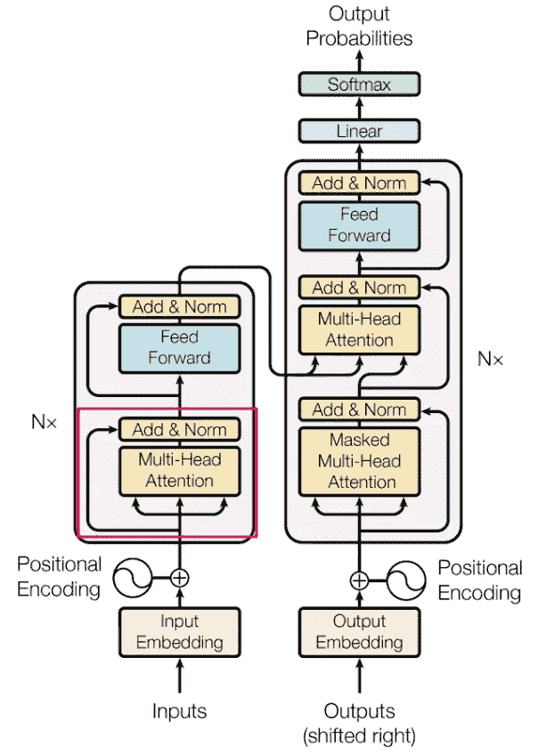
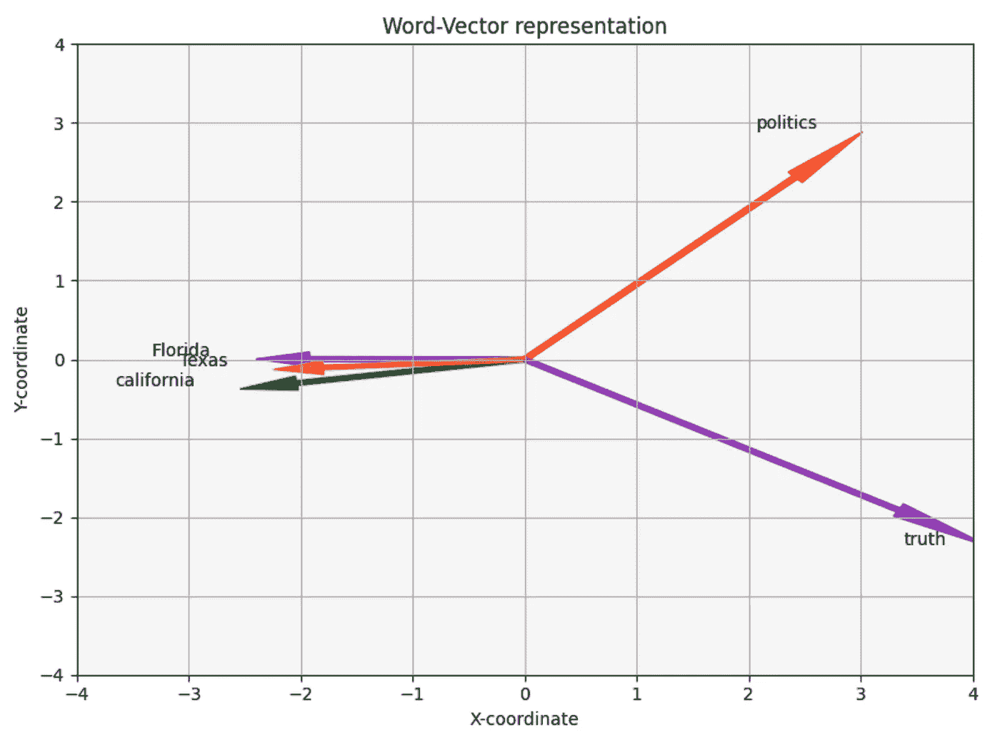
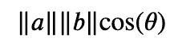
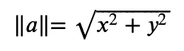
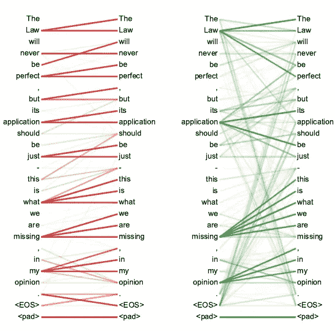
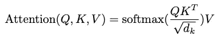
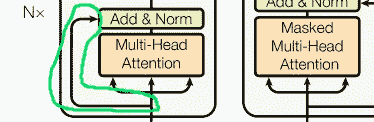
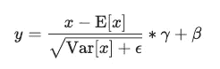
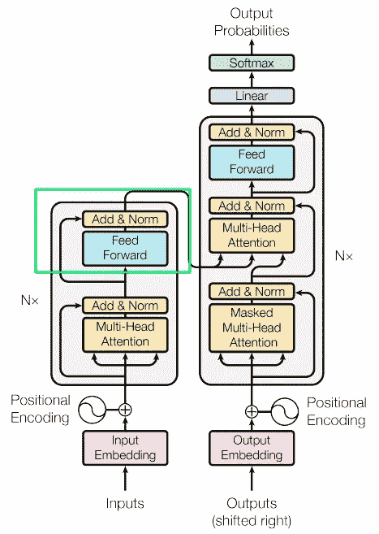

# 简化变换器：使用你理解的词汇进行的前沿 NLP — 第三部分 — 注意力机制

> 原文：[`towardsdatascience.com/transformers-part-3-attention-7b95881714df?source=collection_archive---------3-----------------------#2023-08-07`](https://towardsdatascience.com/transformers-part-3-attention-7b95881714df?source=collection_archive---------3-----------------------#2023-08-07)

## 深入探讨大型语言模型的核心技术 — 注意力机制

[](https://medium.com/@chenmargalit?source=post_page-----7b95881714df--------------------------------)[](https://towardsdatascience.com/?source=post_page-----7b95881714df--------------------------------) [Chen Margalit](https://medium.com/@chenmargalit?source=post_page-----7b95881714df--------------------------------)

·

[关注](https://medium.com/m/signin?actionUrl=https%3A%2F%2Fmedium.com%2F_%2Fsubscribe%2Fuser%2Ff8e6113b0479&operation=register&redirect=https%3A%2F%2Ftowardsdatascience.com%2Ftransformers-part-3-attention-7b95881714df&user=Chen+Margalit&userId=f8e6113b0479&source=post_page-f8e6113b0479----7b95881714df---------------------post_header-----------) 发表在 [Towards Data Science](https://towardsdatascience.com/?source=post_page-----7b95881714df--------------------------------) · 14 min read · 2023 年 8 月 7 日 [](https://medium.com/m/signin?actionUrl=https%3A%2F%2Fmedium.com%2F_%2Fvote%2Ftowards-data-science%2F7b95881714df&operation=register&redirect=https%3A%2F%2Ftowardsdatascience.com%2Ftransformers-part-3-attention-7b95881714df&user=Chen+Margalit&userId=f8e6113b0479&source=-----7b95881714df---------------------clap_footer-----------)

--

[](https://medium.com/m/signin?actionUrl=https%3A%2F%2Fmedium.com%2F_%2Fbookmark%2Fp%2F7b95881714df&operation=register&redirect=https%3A%2F%2Ftowardsdatascience.com%2Ftransformers-part-3-attention-7b95881714df&source=-----7b95881714df---------------------bookmark_footer-----------)

变换器在人工智能领域，甚至在整个世界中产生了深远的影响。这一架构由多个组件组成，但正如原始论文所称“Attention is All You Need”（注意力机制是你所需要的一切），显然注意力机制具有特别的重要性。本系列的第三部分将主要集中在注意力机制及其周边功能上，以确保变换器的各个部分能够协调运行。



图像来自 [原始论文](https://proceedings.neurips.cc/paper_files/paper/2017/file/3f5ee243547dee91fbd053c1c4a845aa-Paper.pdf)，作者：Vaswani, A. 等。

## 注意力机制

在 Transformers 的背景下，attention 指的是一种机制，使模型在处理过程中能够专注于输入的相关部分。想象一下一个手电筒，它照射到句子的特定部分，允许模型根据上下文给予不同的重视程度。我相信例子比定义更有效，因为它们是一种脑力挑战，提供给大脑弥合空白并自行理解概念的可能性。

当面对句子“那个人拿着椅子消失了”时，你自然会对句子的不同部分赋予不同程度的重要性（例如，attention）。有些许令人惊讶的是，如果我们去掉一些特定的词，意思基本上仍然保持不变：“man took chair disappeared。”虽然这个版本是断裂的英语，但相比于原句，你仍然可以理解信息的精髓。有趣的是，三个词（“The”，“the”，和“and”）占了句子中 43%的词汇，但对整体意义贡献不大。这一观察对每个遇到我惊人德语的柏林人来说可能是显而易见的（你可以选择学习德语或保持快乐，这取决于你自己的决定），但对 ML 模型来说却不那么明显。

过去，以前的架构如 RNN（递归神经网络）面临一个重大挑战：它们在“记住”出现在输入序列远端的词汇时存在困难，通常是超过 20 个词。如你所知，这些模型本质上依赖数学运算来处理数据。不幸的是，早期架构中使用的数学运算效率不足，无法将词汇表示充分地传递到序列的遥远未来。

这种长期依赖的限制阻碍了 RNN 在较长时间内保持上下文信息的能力，影响了语言翻译或情感分析等任务，其中理解整个输入序列至关重要。然而，Transformers 通过其 attention 机制和自注意力机制，更有效地解决了这个问题。它们可以有效地捕捉输入中长距离的依赖关系，使模型能够保留上下文和关联，即使是对于在序列中出现较早的词汇。因此，Transformers 成为克服以前架构限制的突破性解决方案，并显著提高了各种自然语言处理任务的性能。

要创建像我们今天遇到的先进聊天机器人这样的卓越产品，至关重要的是使模型具备区分高价值词汇和低价值词汇的能力，并在输入的长距离中保留上下文信息。Transformers 架构中引入的机制来应对这些挑战被称为 **attention**。

*人类长期以来一直在开发区分人的技术，尽管这些技术很有启发性，但我们在这里不会使用它们。*

## 点积

模型如何从理论上辨别不同单词的重要性？在分析句子时，我们的目标是识别彼此关系更强的单词。由于单词被表示为向量（数字），我们需要一个测量数字相似性的标准。测量向量相似性的数学术语是“点积”。它涉及两个向量的元素相乘，产生一个标量值（例如 2、16、-4.43），作为它们相似性的表示。机器学习建立在各种数学操作之上，其中点积具有特别重要的意义。因此，我将花时间详细阐述这个概念。

***直观*** 想象一下我们有 5 个单词的真实表示（嵌入）：“florida”、“california”、“texas”、“politics”和“truth”。由于嵌入只是数字，我们可以将它们绘制在图表上。然而，由于它们的高维度（用于表示单词的数字数量），可能从 100 到 1000 不等，我们不能像现在这样绘制它们。我们无法在二维计算机/手机屏幕上绘制一个 100 维的向量。此外，人脑很难理解超过 3 维的事物。四维向量是什么样的？我不知道。

为了克服这个问题，我们使用主成分分析（[PCA](https://scikit-learn.org/stable/modules/generated/sklearn.decomposition.PCA.html)），这是一种减少维度的技术。通过应用 PCA，我们可以将嵌入投影到二维空间（x，y 坐标）。这种维度减少帮助我们在图表上可视化数据。尽管由于减少维度我们会丢失一些信息，但希望这些减少的向量仍能保留足够的相似性，使我们能够洞察并理解单词之间的关系。

这些数字基于 [GloVe](https://nlp.stanford.edu/projects/glove/) 嵌入。

```py
florida = [-2.40062016,  0.00478901]
california = [-2.54245794, -0.37579669]
texas = [-2.24764634, -0.12963368]
politics = [3.02004564,  2.88826688]
truth = [4.17067881, -2.38762552]
```

你可能会注意到这些数字中有一些模式，但我们将绘制这些数字以简化处理。



5 个二维向量

在这个可视化中，我们看到五个二维向量（x，y 坐标），代表 5 个不同的单词。正如你所见，图示表明一些单词彼此之间的关系要比其他单词更加紧密。

***数学*** 视觉化向量的数学对应物可以通过一个简单的方程来表达。如果你不特别喜欢数学，并且记得作者对 Transformers 架构的描述是一个“简单的网络架构”，你可能会觉得这就是机器学习者的状态，他们变得奇怪。这可能是真的，但在这种情况下，这**确实**很简单。我会解释：



点积公式

符号 ||a|| 表示向量“a”的大小，代表了原点（点 0,0）和向量尖端之间的距离。计算大小的公式如下：



向量大小公式

这个计算的结果是一个数字，例如 4 或 12.4。

Theta (θ) 指的是向量之间的角度（参见可视化）。θ的余弦，表示为 cos(θ)，是将余弦函数应用于该角度的结果。

***代码*** 使用[GloVe](https://nlp.stanford.edu/projects/glove/)算法，斯坦福大学的研究人员生成了实际单词的嵌入，正如我们之前讨论的那样。尽管他们有自己创建这些嵌入的具体技术，但基本概念与我们在[系列的上一部分](https://medium.com/@chenmargalit/transformers-part-2-input-2a8c3a141c7d)中讨论的相同。作为一个例子，我选择了 4 个单词，将它们的维度减少到 2，然后将它们的向量绘制为简单的 x 和 y 坐标。

为了使这个过程正确运行，下载[GloVe](https://nlp.stanford.edu/projects/glove/)词嵌入是一个必要的前提。

*部分代码，特别是第一个框，受到我见过的某些代码的启发，但我找不到来源。

```py
import pandas as pd

path_to_glove_embds = 'glove.6B.100d.txt'

glove = pd.read_csv(path_to_glove_embds, sep=" ", header=None, index_col=0)
glove_embedding = {key: val.values for key, val in glove.T.items()}
```

```py
words = ['florida', 'california', 'texas', 'politics', 'truth']
word_embeddings = [glove_embedding[word] for word in words]

print(word_embeddings[0]).shape # 100 numbers to represent each word.
---------------------
output:
(100,)
```

```py
pca = PCA(n_components=2) # reduce dimensionality from 100 to 2.
word_embeddings_pca = pca.fit_transform(word_embeddings)
```

```py
for i in range(5):
    print(word_embeddings_pca[i])

---------------------
output:
[-2.40062016  0.00478901] # florida
[-2.54245794 -0.37579669] # california
[-2.24764634 -0.12963368] # texas
[3.02004564 2.88826688] # politics
[ 4.17067881 -2.38762552] # truth
```

我们现在拥有了 5 个单词的真实表示。我们的下一步是进行点积计算。

向量的大小：

```py
import numpy as np

florida_vector = [-2.40062016,  0.00478901]
florida_vector_magnitude = np.linalg.norm(florida_vector)

print(florida_vector_magnitude)
---------------------
output:
2.4006249368060817 # The magnitude of the vector "florida" is 2.4.
```

两个**相似**向量之间的点积。

```py
import numpy as np

florida_vector = [-2.40062016,  0.00478901]
texas_vector = [-2.24764634 -0.12963368]

print(np.dot(florida_vector, texas_vector))

---------------------
output:
5.395124299364358
```

两个**不相似**向量之间的点积。

```py
import numpy as np

florida_vector = [-2.40062016,  0.00478901]
truth_vector = [4.17067881, -2.38762552]

print(np.dot(florida_vector, truth_vector))

---------------------
output:
-10.023649994662344
```

从点积计算可以看出，它似乎捕捉并反映了不同概念之间的相似性。

## 缩放点积注意力

***直觉*** 现在我们已经掌握了点积，我们可以重新深入关注。特别是自注意力机制。使用自注意力使模型能够确定每个单词的重要性，无论它与当前单词的“物理”接近程度如何。这使得模型能够根据每个单词的上下文相关性做出明智的决策，从而达到更好的理解。

为了实现这个宏大的目标，我们创建了 3 个由可学习的 (!) 参数组成的矩阵，称为查询矩阵、键矩阵和值矩阵（Q, K, V）。查询矩阵可以被看作是包含用户询问或请求的单词的矩阵（例如，当你问 chatGPT：“god is available today at 5 p.m.?” 这就是查询）。键矩阵包含了序列中的所有其他单词。通过计算这些矩阵之间的点积，我们可以得到每个单词与当前正在检查的单词（例如，翻译或生成查询答案）之间的相关度。

值矩阵提供了序列中每个词的“干净”表示。为什么我称其为干净，而其他两个矩阵以类似方式形成？因为值矩阵保持原始形式，我们不在另一个矩阵乘法后使用它，也不通过某些值对其进行归一化。这一区别使值矩阵独特，确保它保持原始嵌入，免于额外的计算或转换。*

所有 3 个矩阵的大小都为 word_embedding（512）。然而，它们被划分为“头”。在论文中，作者使用了 8 个头，导致每个矩阵的大小为 sequence_length 乘以 64。你可能会好奇，为什么同样的操作要对 1/8 的数据进行 8 次，而不是对所有数据进行一次。这种方法的理论依据是，通过用 8 个不同的权重集（如前所述，可学习的）进行 8 次相同的操作，我们可以利用数据中的固有多样性。每个头可以关注输入中的特定方面，总体上，这可以带来更好的性能。*

*在大多数实现中，我们实际上并不会将主矩阵划分为 8 个部分。分割是通过索引实现的，从而允许每个部分进行并行处理。然而，这些只是实现细节。从理论上讲，我们也可以使用 8 个矩阵来实现相同的功能。*

Q 和 K 被相乘（点积），然后通过维度数量的平方根进行归一化。我们将结果通过[Softmax](https://docs.scipy.org/doc/scipy/reference/generated/scipy.special.softmax.html)函数，然后将结果乘以矩阵 V。*

正常化结果的原因是 Q 和 K 是随机生成的矩阵。它们的维度可能完全不相关（独立），独立矩阵之间的乘法可能会产生非常大的数字，这可能会对学习产生不利影响，稍后我会在这一部分中解释。*

然后我们使用名为[Softmax](https://docs.scipy.org/doc/scipy/reference/generated/scipy.special.softmax.html)的非线性变换，将所有数字的范围调整到 0 到 1 之间，并使其总和为 1。结果类似于概率分布（因为数字从 0 到 1 相加为 1）。这些数字体现了序列中每个词与其他词的相关性。*

最后，我们将结果乘以矩阵 V，结果就是自注意力得分。*

*编码器实际上由 N（在论文中，N=6）个相同的层构建而成，每一层都从上一层接收输入并进行相同的操作。最终一层将数据传递给解码器（我们将在本系列的后面部分讨论）以及编码器的上层。*

这是自注意力的可视化。它就像课堂上的朋友小组。有些人与某些人联系更紧密，而有些人则与任何人都没有很好地联系。*



图片来自 Vaswani 等人的[原始论文](https://proceedings.neurips.cc/paper_files/paper/2017/file/3f5ee243547dee91fbd053c1c4a845aa-Paper.pdf)

***数学*** Q、K 和 V 矩阵是通过对嵌入矩阵进行线性变换得到的。线性变换在机器学习中非常重要，如果你有兴趣成为一名 ML 从业者，我建议你进一步探索这些内容。我不会深入探讨，但我会说线性变换是一种将向量（或矩阵）从一个空间移动到另一个空间的数学操作。这听起来比实际情况要复杂。想象一下一个箭头指向一个方向，然后转到右边 30 度。这就是线性变换的示例。这样的操作有几个条件才被认为是线性的，但目前这些不太重要。关键是它保留了许多原始向量的属性。

自注意力层的整个计算是通过应用以下公式来执行的：



缩放点积注意力 — 图片来自 Vaswani 等人的[原始论文](https://proceedings.neurips.cc/paper_files/paper/2017/file/3f5ee243547dee91fbd053c1c4a845aa-Paper.pdf)

计算过程如下：

1. 我们将 Q 乘以转置的 K（翻转后的）。

2. 我们将结果除以矩阵 K 维度的平方根。

3. 我们现在有了描述每个单词与其他每个单词相似度的“注意力矩阵分数”。我们将每一行传递给[Softmax](https://docs.scipy.org/doc/scipy/reference/generated/scipy.special.softmax.html)（一种非线性）变换。[Softmax](https://docs.scipy.org/doc/scipy/reference/generated/scipy.special.softmax.html) 做了三件有趣的相关事情：

a. 它将所有数字缩放到 0 和 1 之间。

b. 它使所有数字的总和为 1。

c. 它强调了差距，使得稍微重要的变得更加重要。因此，我们现在可以轻松区分模型感知单词 x1 与 x2、x3、x4 等之间的连接程度。

4. 我们将分数乘以 V 矩阵。这是自注意力操作的最终结果。

## 掩码

在[本系列的前一章](https://medium.com/@chenmargalit/transformers-part-2-input-2a8c3a141c7d)中，我解释了我们如何使用虚拟标记来处理句子中的特殊情况，例如句子的第一个词、最后一个词等。其中一个标记，表示为<PADDING>，指示没有实际数据，但我们需要在整个过程中保持矩阵大小的一致性。为了确保模型理解这些是虚拟标记，因此在自注意力计算过程中不应考虑这些标记，我们将这些标记表示为负无穷（例如一个非常大的负数，例如-153513871339）。掩码值会被加到 Q 和 K 的乘法结果上。[Softmax](https://medium.com/@chenmargalit/transformers-part-2-input-2a8c3a141c7d)然后将这些数字转换为 0。这使我们能够在注意力机制中有效地忽略虚拟标记，同时保持计算的完整性。

## Dropout

在自注意力层之后，应用了 dropout 操作。Dropout 是一种在机器学习中广泛使用的正则化技术。正则化的目的是在训练过程中对模型施加约束，使其更难过度依赖特定的输入细节。因此，模型学习得更为稳健，并提高了其泛化能力。实际的实现涉及随机选择一些激活（来自不同层的数字），并将它们置为零。在同一层的每次传递中，不同的激活将被置为零，防止模型找到特定于数据的解决方案。从本质上讲，dropout 有助于增强模型处理多样化输入的能力，并使模型更难以适应数据中的特定模式。

## Skip connection

另一项在 Transformer 架构中执行的重要操作称为 Skip Connection。



图像来源于[Vaswani 等人的原始论文](https://proceedings.neurips.cc/paper_files/paper/2017/file/3f5ee243547dee91fbd053c1c4a845aa-Paper.pdf)。

Skip Connection 是一种传递输入而不进行任何变换的方式。举例来说，想象一下我向我的经理汇报，经理再向他的上司汇报。即使抱着使报告更有用的纯粹意图，当输入经过另一位人（或 ML 层）处理时，输入也会经历一些修改。在这个类比中，Skip-Connection 就是我直接向我的经理的上司汇报。因此，上级经理既接收到经过我的经理处理的数据（处理过的数据）**又**直接来自我（未经处理的数据）。高级经理可以因此做出更好的决策。使用跳跃连接的理由是解决潜在问题，例如消失的梯度，我将在下一节中解释。

## Add & Norm Layer

***直觉***

“Add & Norm”层执行加法和标准化。我将从加法开始，因为它较为简单。基本上，我们将自注意力层的输出加到原始输入上（通过跳跃连接接收到的）。这个加法是逐元素的（每个数值加到其对应位置的数值）。结果然后进行标准化。

我们进行标准化的原因是，每层进行大量计算。多次相乘的数值可能导致意外情况。例如，如果我取一个分数，如 0.3，然后将其与另一个分数，如 0.9 相乘，我得到 0.27，比开始时的数值要小。如果我多次这样做，最终可能会得到非常接近 0 的数值。这可能导致深度学习中的一个问题，称为梯度消失。

我现在不会深入探讨，以免这篇文章阅读起来很耗时间，但基本思想是，如果数值接近 0，模型将无法有效学习。现代机器学习的基础是计算梯度并使用这些梯度（以及其他一些要素）来调整权重。如果这些梯度接近 0，模型将很难有效学习。

相反，另一种现象叫做梯度爆炸，当非分数的数值被非分数的数值相乘时，会导致值变得极其大。结果，模型在学习过程中由于权重和激活值的巨大变化面临困难，这可能导致训练过程中的不稳定和发散。

机器学习模型有点像小孩子，需要保护。保护这些模型免受数值过大或过小影响的一种方法是标准化。

***数学***

层标准化操作看起来令人害怕（像往常一样），但实际上相对简单。



图片由 [Pytorch](https://pytorch.org/) 提供，来自 [这里](https://pytorch.org/docs/stable/generated/torch.nn.LayerNorm.html)

在层标准化操作中，我们对每个输入执行以下简单步骤：

1.  从输入中减去其均值。

1.  除以方差的平方根，并加上一个 epsilon（一个很小的数值），用于避免除以零。

1.  将结果得分乘以一个可学习的参数，称为 gamma (γ)。

1.  添加另一个可学习的参数，称为 beta (β)。

这些步骤确保均值接近 0，标准差接近 1。标准化过程增强了训练的稳定性、速度和整体性能。

***代码***

```py
# x being the input.

(x - mean(x)) / sqrt(variance(x) + epsilon) * gamma + beta
```

## 总结：

到目前为止，我们对编码器的主要内部工作有了坚实的理解。此外，我们还探讨了跳跃连接，这是一种纯技术（且重要）的机器学习技术，可以提高模型的学习能力。

虽然这一部分有些复杂，但你已经对 Transformers 架构有了相当深入的理解。随着系列的深入，这种理解将帮助你掌握剩下的部分。

记住，这在复杂领域中代表了最前沿技术。这不是简单的内容。即使你还不能完全理解所有内容，也为取得这段伟大进步而感到自豪！

下一部分将讨论机器学习中的一个基础（且更简单的）概念——前馈神经网络。



图片来源于 Vaswani, A.等人的[原始论文](https://proceedings.neurips.cc/paper_files/paper/2017/file/3f5ee243547dee91fbd053c1c4a845aa-Paper.pdf)。
