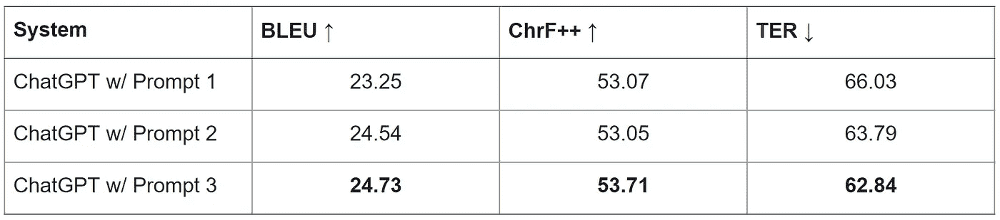
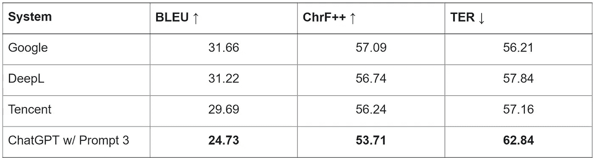
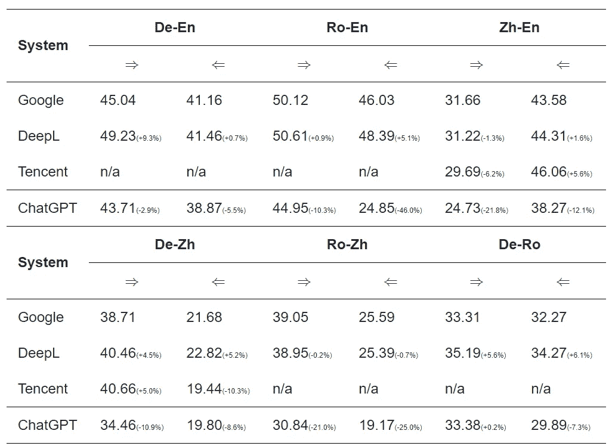
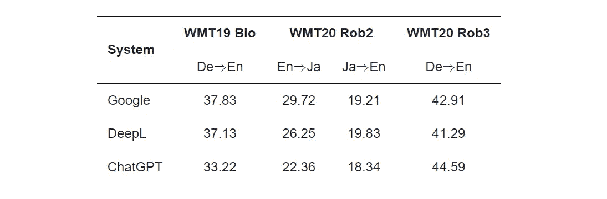

# 使用 ChatGPT 进行翻译

> 原文：[`towardsdatascience.com/translate-with-chatgpt-f85609996a7f?source=collection_archive---------1-----------------------#2023-02-16`](https://towardsdatascience.com/translate-with-chatgpt-f85609996a7f?source=collection_archive---------1-----------------------#2023-02-16)

## 一个非常强大的机器翻译系统

 [Benjamin Marie](https://medium.com/@bnjmn_marie?source=post_page-----f85609996a7f--------------------------------)

·

[关注](https://medium.com/m/signin?actionUrl=https%3A%2F%2Fmedium.com%2F_%2Fsubscribe%2Fuser%2Fad2a414578b3&operation=register&redirect=https%3A%2F%2Ftowardsdatascience.com%2Ftranslate-with-chatgpt-f85609996a7f&user=Benjamin+Marie&userId=ad2a414578b3&source=post_page-ad2a414578b3----f85609996a7f---------------------post_header-----------) 发布于 [Towards Data Science](https://towardsdatascience.com/?source=post_page-----f85609996a7f--------------------------------) ·6 min read·2023 年 2 月 16 日

--

图片来自 [Pixabay](https://pixabay.com/photos/chat-ai-chatbot-chatgpt-mobile-7767693/)。

[ChatGPT](https://chat.openai.com/) 是由 OpenAI 开发的聊天机器人。它基于 [instructGPT](https://arxiv.org/abs/2203.02155)：它经过训练以遵循并回答用户编写的指令或所谓的“提示”。

ChatGPT 展示了在提供连贯且相关的详细回答方面的令人印象深刻的能力。它似乎在**自然语言处理 (NLP) 任务**方面表现尤其出色，如摘要生成、问答、语言生成和**机器翻译**。

然而，由于它是一个非常新的系统，ChatGPT **尚需科学评估**以比较其自然语言处理性能与之前的研究。

为此方向，腾讯 AI 发布了一项关于 ChatGPT 翻译能力的初步研究：

[ChatGPT 是一个好的翻译器吗？初步研究](https://arxiv.org/pdf/2301.08745v2.pdf) 由 *Wenxiang Jiao, Wenxuan Wang, Jen-tse Huang, Xing Wang, and Zhaopeng Tu (腾讯 AI)*

这项研究的主要目的是评估 ChatGPT 在将文本翻译成英语方面的表现，因为大多数训练数据都是英语。*注意：实际上，ChatGPT 基于 instructGPT，如在* [*博客文章*](https://chat.openai.com/)* 中提到。InstructGPT 是 GPT-3 的一个微调版本，提示“主要为英语” (*[*Ouyang et al., 2022*](https://arxiv.org/abs/2203.02155)*）。此外，GPT-3 的 93% 预训练数据是英语 (*[*Brown et al., 2020*](https://arxiv.org/pdf/2005.14165.pdf)*)。*

他们还评估了对其他语言的翻译，这些语言在其训练数据中代表性较少，如日语和罗马尼亚语，因此更具挑战性。

在本文中，我将分析和解释他们的主要发现，特别是突出使用 ChatGPT 作为机器翻译系统时，哪些方法似乎有效，哪些无效。

# **翻译提示**

在处理生成语言模型时，最重要的步骤之一是提示设计。

我们需要找到一个合适的自然语言表达形式来查询模型，鉴于我们的目标任务。在这里，我们希望 ChatGPT 将源语言中的句子（标记为 “[SRC]”）翻译成目标语言（标记为 “[TGT]”）。

为了找到好的提示，腾讯 AI 直接要求 ChatGPT 给出 10 个提示，使用了以下提示：

*提供十个简洁的提示或模板，使你能够进行翻译。*

ChatGPT 按预期返回了 10 个提示，但它们之间仅有**少量差异**。他们最终决定只尝试以下 3 个，这些是最能代表 ChatGPT 初始返回的 10 个提示的：

+   Prompt 1: *将这些句子从 [SRC] 翻译成 [TGT]：*

+   Prompt 2: *无需引号回答。这些句子在 [TGT] 中是什么意思？*

+   Prompt 3: *请提供这些句子的 [TGT] 翻译：*

他们在中文到英文的翻译任务中（[SRC]=中文， [TGT]=英文）评估了每一个提示，并得出了以下结果：

结果由 [*Wenxiang Jiao, Wenxuan Wang, Jen-tse Huang, Xing Wang, and Zhaopeng Tu (腾讯 AI)*](https://arxiv.org/pdf/2301.08745v2.pdf) 提供

BLEU、chrF++ 和 TER 是 3 种自动评估机器翻译质量的指标。对于 BLEU 和 chrF++，分数越高越好；对于 TER，分数越低越好。

根据这 3 种指标获得的分数，他们发现 Prompt 3 表现最佳。尽管 chrF++ 分数相似，Prompt 2 似乎也优于 Prompt 1。

这很有趣，因为 Prompt 1 提到源语言，但其他两个提示没有提及。然而，Prompt 1 的表现较差。**ChatGPT 不需要知道我们想要翻译的文本的语言**。

这令人印象深刻，但也有些违背直觉。我们本可以预期由于提示中源语言的准确性，ChatGPT 会更准确。对于人类翻译者来说，了解源语言至关重要。

目前尚无良好解释为何 ChatGPT 在指示源语言时会得出较低的分数。我们可以假设 ChatGPT 能够自动从用户输入中推断出源语言。如果是这样的话，提供源语言不应该有任何影响，而不是腾讯 AI 结果中观察到的负面影响。

# 一般翻译

既然我们找到了一个好的提示，我们可以将 ChatGPT 与最先进的机器翻译系统进行比较。

腾讯 AI 选择了在线系统进行比较：[Google Translate](https://translate.google.com/)、[DeepL](https://www.deepl.com/translator)以及他们自己的在线系统，[腾讯 TranSmart](https://transmart.qq.com/zh-CN/index)。

结果如下：

结果由 [*Wenxiang Jiao, Wenxuan Wang, Jen-tse Huang, Xing Wang, and Zhaopeng Tu (腾讯 AI)*](https://arxiv.org/pdf/2301.08745v2.pdf) 提供

三个在线系统的表现相似，似乎比 ChatGPT 表现更好，尽管作者并未报告统计显著性检验以确保这些差异确实具有统计学意义。

 [## 是的，我们需要统计显著性检验]

### 经验法则可能会产生正确的结果，但无法具有科学可信度。

pub.towardsai.net](https://pub.towardsai.net/yes-we-need-statistical-significance-testing-927a8d21f9f0?source=post_page-----f85609996a7f--------------------------------)

尽管如此，我发现这些结果令人印象深刻。由于基于 instructGPT，我们可以假设 ChatGPT 主要**在英文数据上进行训练**，但似乎能够**很好地捕捉中文句子的含义**以生成英文翻译。

如果我们能对 ChatGPT 进行中文到英文的微调，我们肯定会获得更高质量的翻译。

在论文中，腾讯 AI 还报告了英、汉、德和罗马尼亚语之间所有翻译方向的类似差异。

表格由 [*Wenxiang Jiao, Wenxuan Wang, Jen-tse Huang, Xing Wang, and Zhaopeng Tu (腾讯 AI)*](https://arxiv.org/pdf/2301.08745v2.pdf) 提供

再次强调，这些表现（以 BLEU 评分为准）令人印象深刻。即使是那些不涉及英语的翻译方向，如德语到中文，ChatGPT 也能生成翻译。根据 BLEU，在线系统的表现仍然更好，这也是预期中的，因为它们是针对这个任务进行训练的，而 ChatGPT 则不是！

涉及罗马尼亚语的结果相差甚远。例如，ChatGPT 的 BLEU 评分比在线系统低了将近 50%。这种差异可能具有统计学意义。

作者提出了一个解释。与德语和中文相比，罗马尼亚语的资源，如互联网上的罗马尼亚语文本，少得多。ChatGPT 在训练过程中可能**见过的罗马尼亚语句子示例太少**，以至于难以准确建模。

我同意这一假设，但应通过更多涉及其他语言（如克罗地亚语或波兰语）的实验来确认。

# 领域与鲁棒性

他们进行了进一步的实验，以评估 ChatGPT 在**特定领域（生物医学）**和**用户生成**（发布在**社交媒体**上，通常带有大量语法错误）的文本翻译中的表现。

表格由 [*Wenxiang Jiao, Wenxuan Wang, Jen-tse Huang, Xing Wang, 和 Zhaopeng Tu (腾讯 AI)*](https://arxiv.org/pdf/2301.08745v2.pdf) 制作。

出乎意料的是，根据 BLEU，ChatGPT 在将生物医学文本从德语翻译成英语时的表现仍然接近在线系统。

ChatGPT 似乎没有受到生物医学文本中非常特定术语的负面影响。

ChatGPT **在将用户生成的德语文本翻译成英语方面超过了在线系统**。这令人印象深刻，但并不令人意外。我们可以假设，ChatGPT 的训练数据中**包含了大量来自社交媒体的帖子（从网络上抓取）**，而用于比较的在线系统训练数据通常经过严格筛选，因此对错误（如语法、语义等）的鲁棒性较差。

当翻译成远离英语的语言时，如日语，如 WMT20 Rob2 的结果所示，ChatGPT 面临的困难要大得多，这是预期中的情况。

# 本研究的局限性

作者在研究中承认，需要更多语言对的实验来更好地评估 ChatGPT 的翻译质量。

这种评估应通过人工评估而非自动度量来进行，因为自动度量通常不准确，特别是当比较系统的得分非常接近时。

**缺乏人工评估是本研究的主要局限性**。

我认为，还可以进一步研究提示的影响。作者通过让 ChatGPT 自己建议提示选择了一种非常原创的方式。但**提示 ChatGPT 建议提示**是一个鸡和蛋的问题。用于获得机器翻译提示的提示本身可能对本研究中所有后续实验产生强烈影响。以前关于机器翻译提示设计的工作尝试了各种各样的手工设计提示。

 ## Google PaLM 翻译效果如何？

### 虽然还不是很好，但我们正在接近目标。

[towardsdatascience.com

# 结论

ChatGPT 在**机器翻译方面非常出色**。

从这项初步研究中，我们已经可以得出结论，ChatGPT 在翻译文本方面会表现良好，甚至可能优于标准在线系统，尤其是那些翻译内容预期具有 ChatGPT 训练数据特征的文本，例如英语中的嘈杂用户生成文本。

尽管如此，正如预期的那样，ChatGPT 在翻译英语以外的语言，尤其是如日语或罗马尼亚语这样的远程或低资源语言方面，仍然落后于更标准的机器系统。
