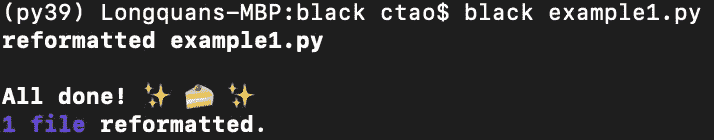

# 在编写 Python 代码时使用 “Black” 库来犒赏自己

> 原文：[`towardsdatascience.com/treat-yourself-using-the-black-library-when-writing-python-code-7626b6099247`](https://towardsdatascience.com/treat-yourself-using-the-black-library-when-writing-python-code-7626b6099247)


图片由 [Pfüderi](https://pixabay.com/users/pf%C3%BCderi-199315/?utm_source=link-attribution&utm_medium=referral&utm_campaign=image&utm_content=2125148) 提供，来源 [Pixabay](https://pixabay.com//?utm_source=link-attribution&utm_medium=referral&utm_campaign=image&utm_content=2125148)

## 实现“单一正确格式”代码的最简单方法

[](https://christophertao.medium.com/?source=post_page-----7626b6099247--------------------------------)[](https://towardsdatascience.com/?source=post_page-----7626b6099247--------------------------------) [Christopher Tao](https://christophertao.medium.com/?source=post_page-----7626b6099247--------------------------------)

·发表于 [Towards Data Science](https://towardsdatascience.com/?source=post_page-----7626b6099247--------------------------------) ·阅读时间 6 分钟·2023 年 1 月 13 日

--

你是否曾经从库文档或 Stack Overflow 上复制粘贴了一些示例代码？或者你没有纯粹的程序员背景，因此没有接受过完美格式化代码的训练？你是否想要提高代码的可读性以给别人留下深刻印象？

Python 编程语言的一个优点是它使用缩进来表示代码块的嵌套层级。因此，在格式上，编写一些“难以阅读”的代码相对更困难。然而，这并不意味着所有的 Python 代码必须格式化。没有哪种编程语言能强制用户编写格式化代码，这也不是一个好主意，因为这样会使使用变得过于困难。

在这篇文章中，我将介绍一个名为“Black”的 Python 库。它可以帮助我们以不同的方式格式化代码。所有的样式都将符合 PEP 8 指南。现在让我们开始创建一致且易读的格式化代码吧！

[## Black 22.12.0 文档

### 通过使用，你同意放弃手动格式化的细节控制。作为回报，Black 为你提供速度、确定性……

black.readthedocs.io](https://black.readthedocs.io/en/stable/index.html?source=post_page-----7626b6099247--------------------------------)

# 1\. 基本用法


图片由 [Nat Aggiato](https://pixabay.com/users/nataliaaggiato-470329/?utm_source=link-attribution&utm_medium=referral&utm_campaign=image&utm_content=533337) 提供，来自 [Pixabay](https://pixabay.com//?utm_source=link-attribution&utm_medium=referral&utm_campaign=image&utm_content=533337)

在开始使用库之前，我们需要使用 `pip` 安装它，如下所示。

```py
pip install black
```

让我们准备一个不良示例，如下所示。

```py
def my_function(a=1,b=2,c=3,d=4):
    my_list = [a, 
               b, 
               c, 
               d]
    return sum(my_list)
if True: print(my_function())
```

上面的代码可以正常运行，但存在许多问题。

1.  函数 `my_function` 中的参数用逗号分隔，但逗号后面没有空格。

1.  列表 `my_list` 中的项目呈垂直排列。在某些情况下这可能没问题，但绝对不符合 PEP 8 的指南。

1.  函数定义和 if 语句之间没有新行，这会影响可读性。

1.  if 语句被写成了一行。这是有效的代码，但不利于可读性。

我将把代码保存到一个名为 `example1.py` 的文件中。我们可以如下验证这个不良示例。


如果你愿意，你也可以验证这个 Python 脚本是否确实可以运行。


接下来，我们使用 `black` 库来格式化文件。最简单的方法是使用命令行接口（CLI），如下所示。

```py
$ black example1.py 
```



它告诉我们文件已被重新格式化。现在，让我们验证一下结果。


```py
def my_function(a=1, b=2, c=3, d=4):
    my_list = [a, b, c, d]
    return sum(my_list)

if True:
    print(my_function())
```

是的！之前提到的所有 4 个问题都已修复。

你注意到它提到“1 文件已重新格式化”了吗？没错。如果我们提供一个目录，`black` 库将重新格式化目录中的所有 Python 脚本。

```py
$ black my_dir/
```


上面的示例显示了我们可以重新格式化当前目录中的所有文件。此外，如果某个文件已经是完美格式，black 会告诉我们该文件保持不变。

# 2\. 一些有用的 CLI 参数/标志


图片由 [Bruno /Germany](https://pixabay.com/users/bru-no-1161770/?utm_source=link-attribution&utm_medium=referral&utm_campaign=image&utm_content=2081193) 提供，来自 [Pixabay](https://pixabay.com//?utm_source=link-attribution&utm_medium=referral&utm_campaign=image&utm_content=2081193)

像其他 CLI 工具一样，`black` 也有许多参数提供更多的功能。我会挑选一些我认为有用的参数，并在本节中介绍它们。

## 2.1 重新格式化代码片段

让我们转到另一个话题。大多数情况下，我们可能不希望一遍又一遍地重新格式化文件。一种典型的场景是我们从文档或 Stack Overflow 复制了一个函数或一段代码。（这没什么丢人的，绝大多数开发者都是这么做的 :)。然而，格式可能与我们的代码不一致，或者由于某些原因代码的格式丢失了。

在这种情况下，我们不需要将代码粘贴到文件中并重新格式化。我们可以在控制台中即时使用`--code`参数来完成。

例如，`print()`函数可以格式化如下。

```py
$ black --code "print ( 'hello, world' )"
```


现在，你可以复制重新格式化的代码并将其放入你的脚本中。

## 2.2 检查格式（干运行）

如果我们只是想检查你的代码是否符合 PEP 8 标准而不改变它，我们可以使用`--check`标志，如下所示。

```py
$ black example1.py --check
```


嗯，这告诉我们因为`example1.py`已经被重新格式化，所以不需要更改。然而，如果需要呢？

让我们使用原始的“坏例子”创建另一个 Python 脚本文件，并将文件命名为`example2.py`。让我们验证它是否是“坏例子”。


然后，让我们进行“干运行”。


我们可以看到它说“将被重新格式化”。当然，我们也可以对一个目录进行干运行。

```py
$ black . --check
```


## 2.3 显示将会更改的内容

对于为什么你的代码不符合标准感到好奇？我们可以使用`--diff`标志来显示具体的变化。

```py
$ black example2.py --diff
```


# 总结


图片由[育银 戚](https://pixabay.com/users/qiye-116/?utm_source=link-attribution&utm_medium=referral&utm_campaign=image&utm_content=420018)提供，来自[Pixabay](https://pixabay.com//?utm_source=link-attribution&utm_medium=referral&utm_campaign=image&utm_content=420018)

在这篇文章中，我介绍了`black`库，这是一个流行的 Python 代码格式化工具，它会自动重新格式化你的代码以符合 PEP 8 风格指南。它为你的代码提供一致和可读的格式，使其更易于阅读和维护。

我们可以使用`black`来确保我们的代码一致、可读和可维护。它也可以从命令行使用，具有许多有用的内置功能，可以通过参数或标志调用。希望它能帮助你写出更好的代码！

[](https://medium.com/@qiuyujx/membership?source=post_page-----7626b6099247--------------------------------) [## 使用我的推荐链接加入 Medium — Christopher Tao

### 作为 Medium 会员，你的部分会员费用会分给你阅读的作家，你可以完全访问每一个故事……

medium.com](https://medium.com/@qiuyujx/membership?source=post_page-----7626b6099247--------------------------------)

**如果你觉得我的文章有帮助，请考虑加入 Medium 会员，以支持我和其他数千名作家！（点击上面的链接）**

> 除非另有说明，否则所有图片均为作者所用
