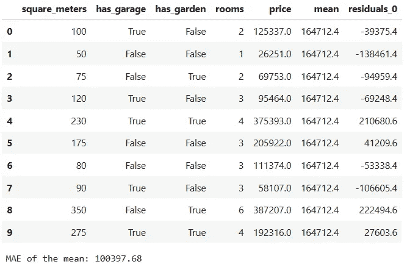

# 树集成：自助法、提升法和梯度提升

> 原文：[`towardsdatascience.com/tree-ensembles-theory-and-practice-1cf9eb27781`](https://towardsdatascience.com/tree-ensembles-theory-and-practice-1cf9eb27781)

## 理论和实践详尽解释

 [Jorge Martín Lasaosa](https://jorgemartinlasaosa.medium.com/?source=post_page-----1cf9eb27781--------------------------------)

·发布于 [Towards Data Science](https://towardsdatascience.com/?source=post_page-----1cf9eb27781--------------------------------) ·10 分钟阅读·2023 年 1 月 26 日

--

照片由 [Arnaud Mesureur](https://unsplash.com/@tbzr?utm_source=medium&utm_medium=referral) 提供，来源于 [Unsplash](https://unsplash.com/?utm_source=medium&utm_medium=referral)

**树集成** 是一种监督学习的机器学习技术，由一组单独训练的决策树组成，这些决策树被定义为*弱*或*基础*学习器，单独表现可能不佳。将这些*弱*学习器聚合成一个新的*强*模型，通常比之前的模型更准确。集成学习方法主要有三种类型：**自助法**、**提升法** 和 **梯度提升**。每种方法都可以与其他*弱*学习器结合使用，但在这篇文章中，仅考虑决策树。

文章的其余部分分为两个部分：

+   **直觉与历史。** 解释了每种集成学习方法的起源，并对其进行了简要描述。

+   **实际演示。** 逐步展开每种集成学习方法。为此，还提供了一个小的合成数据集，以帮助解释。

> 除非另有说明，否则所有图像均由作者提供。

# **直觉与历史**

## 自助法

该术语首次由 Breiman (1996) [1] 定义，是 **B**ootstrap **Agg**regation 的缩写。对于这种集成，每个决策树都使用训练数据集的自助样本作为输入数据。自助样本是随机选择的样本，允许重复选择，这意味着观察值可能出现一次、多次或从不出现。然后，所有预测都使用统计量（如平均值）进行组合。*随机森林* [2] 使用了这种技术（以及其他技术），并且是最成功和广泛使用的集成方法之一。

Bagging 可视化解释。每个带替换的样本作为弱学习器的输入数据。[3]

## **提升**

Keans 和 Valiant (1988, 1989) [4][5] 提出了以下问题: *一组弱学习器能否创建一个强学习器？* 1990 年，Schapire 的肯定回答[6] 导致了提升算法的发展。与 bagging 不同，提升采取了更迭代的方法，其中树木按顺序训练。观察被赋予权重，每棵树都是以加法的方式构建的，为前一学习器中的分类错误观察分配更大的权重（更重要）。有许多提升算法，但第一个充分利用*弱*学习器的是*AdaBoost* [7]，由 Freund 和 Schapire 于 1995 年提出。

AdaBoost 可视化解释。每次学习都集中在前一棵树的分类错误观察上。[8]

## 梯度提升

Breiman 提出了一种“梯度提升机器”[9]，也采用了迭代方法，其中树木按顺序训练。然而，不同于更新权重，树木适应的是前一棵树的*伪残差*。第一组*伪残差*是通过从输出特征的平均值中减去真实值得到的。许多算法，如*XGBoost* [10]、*CatBoost* [11]或*LightGBM* [12]，都基于这一技术。

梯度提升可视化解释 [13]

# 实际演示

实际演示深受[Josh Starmer 的 YouTube 频道](https://www.youtube.com/channel/UCtYLUTtgS3k1Fg4y5tAhLbw)的启发。如果你想要几乎所有机器学习模型或技术的视觉和极其简洁的解释，可以去看看！

> 免责声明：数据是量身定制的，以便结果符合预期。这并不意味着这些技术是万无一失的或可以相互比较。

## 数据

当我学习新算法或方法时，我非常喜欢在小数据集上进行测试，以便我能专注于细节。因此，在实际演示中，我们将使用一个包含关于房屋及其*价格*的虚构信息的小型合成数据集。Bagging 和 boosting 模型将用价格特征转换为分类特征来解释，而梯度提升则用价格作为数值特征来解释。

为本文开发的所有 Jupyter 笔记本可以在这个[GitHub 代码库](https://github.com/jomartla/medium_articles/tree/main/TreeEnsembles)中找到，但主要代码片段仍会在阅读过程中展示。例如，数据创建过程可以在下面看到。

创建数据的代码。也可以在代码库中找到：TreeEnsembles/synthetic_data.py。

创建的数据包含 10 个客户和 6 个特征：

+   **平方米**: 数值型

+   **如果房子有车库**: 布尔值

+   **如果房子有花园**: 布尔值

+   **房间数量**：数值型

+   **价格**：分类或数值型

如前所述，价格特征将根据解释的树集合体是分类的还是数值的。

在袋装法和提升法的实际演示中使用的 DataFrame。价格特征是一个分类特征。

在梯度提升法的实际演示中使用的 DataFrame。价格特征是一个数值特征。

## 袋装法

首先，请记住，袋装法是**B**ootstrap **Agg**regation 的缩写。这两个词引领了方向，所以我们从第一个词开始：**bootstrap**。以下代码从前一节生成的数据中构建了 5 个具有 7 个观测值的自举样本。

创建样本的代码。代码也可以在仓库中找到：TreeEnsembles/Bagging.ipynb。

每个样本包含确切的七个索引。允许重复的索引。

如前所定义，随机选择的样本是带有替换的，因此样本有重复的索引。接下来的步骤是为每个样本训练一个*弱*学习者。在这种情况下，选择的学习者是来自 scikit-learn 的决策树分类器 [15]

开发袋装法的代码。代码也可以在仓库中找到：TreeEnsembles/bagging.ipynb。

一旦每棵树都被训练完成，我们就来深入了解第一个样本及其对应的树。第一个自举样本包含了观测值*[6, 0, 2, 2, 7, 6, 8]*，这些就是树用来训练的观测值。诱导的树显示它能正确分类每个观测值，除了一个（观测值 = 0）。如果你跟随这棵树，很明显它将被分类为低，而实际价格是中等的。尽管如此，我们可以说这棵树的表现还是有一定的好的。

第一个树和样本用于袋装法的实际演示。

然而，再次查看观测值的索引，只有 5 个独特的值*[0, 2, 6, 7, 8]*，因此第一棵树只用了 50%的样本进行训练。因此，结果的准确率可能会具有误导性。为了更好地理解决策树的表现，我们将用每棵决策树对整个数据集（10 个观测值）进行预测。此外，让我们利用袋装法的第二个词：**聚合**。我们的*强*学习者（称为袋装法）将从五棵训练树中获取最常见的预测。

单棵树和袋装法聚合的预测。

如下所示，从准确率来看，*弱*学习者（决策树）单独表现不如*强*学习者（袋装法）。

袋装法和每棵训练树的准确率。

## 提升方法

提升与袋装不同，按顺序训练树。第一棵树用所有数据进行训练。在随后的树中，误分类观察值会赋予更高的权重（scikit learn 的决策树分类器具有权重参数）。该权重使树能够更*专注*于某些观察值。这里是用于实现提升集成的代码。

用于开发提升的代码。它也可以在仓库中找到：TreeEnsembles/boosting.ipynb。

如我们所说，第一步是用所有观察值训练第一棵树。

提升的第一棵训练树。

注意到树无法正确学习观察值 *[0, 6, 9]*。因此，根据提升理论和代码，这些观察值在第二棵树中将具有更高的权重。

提升的第二棵训练树

正如我们所见，使用更新权重训练的第二棵树能够正确学习之前误分类的观察值 *[0, 6, 9]*。分配给这些索引的更高权重迫使树正确学习它们。然而，树的学习过程也改变了其余观察值。现在，它未能学习观察值 *[3, 4, 7]*。

因此，第三棵树会将这些误分类观察值的权重加倍，并且每棵树会纠正之前学习者所犯的错误。在下一张图中，展示了每棵树如何改进前一棵树的错误。此外，还有一列叫做提升的列，它选择了所有树中最常见的分类。

顺序训练的树的预测值以及提升聚合的预测值。

如果我们计算每棵树的准确性以及提升聚合的准确性，结果清楚地表明，提升技术也改善了每棵单独树的结果。

提升和每棵训练树的准确性。

## 梯度提升

请记住，对于梯度提升，我们将使用目标变量价格为数值型的 DataFrame。同时，请记住，梯度提升与提升类似，采用迭代的方法。不同之处在于，树适应的是前一棵树的 *伪残差*，而不是相同观察值的不同权重。

我们要做的第一件事是计算第一个 *伪残差*（*residuals_0*），这是通过从价格的实际值中减去价格的均值得到的。

计算出的首个伪残差（residuals_0）的 DataFrame。

使用均值预测每个观察值的平均绝对误差（MAE）为 *100397.68*。这是每棵训练树都会改进的指标。说完这些，我们来用之前显示的 *伪残差* 作为目标训练第一棵树。

梯度提升的第一棵树使用伪残差（residuals_0）进行训练。

注意每个最终节点有不同数量的样本。在最左边的第一个节点中，只有一个观测值。它对应于索引为 *1* 的观测值，其 *pseudo residual* 为 -*138461.4*。在从左到右的第二个最终节点中，有 5 个样本，它们对应于索引为 *[0, 2, 3, 6, 7]* 的观测值。树预测的残差值 (*-72705*) 是这 5 个残差值的平均值。这些值将预先被称为 *predicted pseudo residuals*。

为了使用第一棵树预测实际价格值，我们应执行以下操作。

第一棵树后的价格预测公式。

下面显示的预测达到 *70347.53* 的 MAE，这比之前仅用均值预测所达到的 MAE (*100397.68*) 更有改善。利用这些预测，我们可以计算下一个 *pseudo residuals* (*residuals_1*)，这是通过将第一棵树的预测值 (*predictions_0*) 从实际价格值中减去得到的。

第一棵树后的预测结果。

注意，*residuals_1* 总是比 *residuals_0* 更接近零。这是因为我们使用了树所提供的部分信息来改善由均值做出的预测。这部分信息的比例由 *learning rate* 定义。

到目前为止，仅涉及了第一棵树，但我们之前提到过梯度提升是顺序使用多棵树。现在是时候训练第二棵树了，为此目的，之前计算的残差 (*residuals_1*) 将作为目标使用。第二棵训练树如下：

第二棵梯度提升树使用伪残差（residuals_1）进行训练。

如果我们按照第一棵树的相同步骤操作，将得到以下结果。

第二棵树后的预测结果。

与第一棵树唯一的不同是，我们使用了第一棵和第二棵树的伪残差预测 (*residual_predictions_1* 和 *residual_predictions_1*) 来进行预测 (*predictions_1*)。梯度提升不是像装袋和提升中那样进行预测聚合，而是将每棵树的少量信息添加到均值价格中 (*learning rate * residuals preds tree x*)。

第二棵树训练后的价格预测公式。

训练了 5 棵树后，我们可以清晰地看到 MAE 在以下结果中的减少情况。每次迭代都提供了更好的学习效果，显然所有树的联合提供了比单独使用它们更好的指标。

每次迭代后的 MAE 值。

# 结论

-   本文旨在提供一个逐步指南，解释不同的集成学习方法如何工作：**装袋法**、**提升法**和**梯度提升法**。

-   在第一部分，我们回顾了这些技术的历史、描述和应用；而在第二部分，我们实际地发展了所有模型，展示了不同的*弱*学习器如何结合成一个具有更高预测能力的*强*学习器。

-   我希望你觉得阅读有用且愉快。最重要的是，我很乐意接受任何形式的反馈。请随时分享你的想法！

# 参考文献

[1] Breiman, L. 《装袋预测器》。*机器学习* 24 (1996): 123–40\. [`doi.org/10.1007/BF00058655`](https://doi.org/10.1007/BF00058655).

[2] Breiman, L. 《随机森林》。*机器学习* 45 (2001): 5–32\. [`doi.org/10.1023/A:1010933404324`](https://doi.org/10.1023/A:1010933404324).

[3] 图像来源: [`www.researchgate.net/figure/The-bagging-approach-Several-classifier-are-trained-on-bootstrap-samples-of-the-training_fig4_322179244`](https://www.researchgate.net/figure/The-bagging-approach-Several-classifier-are-trained-on-bootstrap-samples-of-the-training_fig4_322179244)

[4] Kearns, M. 《[关于假设提升的思考](http://www.cis.upenn.edu/~mkearns/papers/boostnote.pdf)》，未出版手稿（机器学习课程项目）(1988)

[5] Kearns, M; Valiant, L. 《关于学习布尔公式和有限自动机的密码学限制》。*计算理论研讨会* 21 (1989): 433–444 [`dl.acm.org/doi/10.1145/73007.73049`](https://dl.acm.org/doi/10.1145/73007.73049)

[6] Schapire, R.E. 《弱学习能力的力量》。*机器学习* 5 (1990): 197–227 [`doi.org/10.1007/BF00116037`](https://doi.org/10.1007/BF00116037)

[7] Freund, Y.; Schapire, R.E. (1995). 《在线学习的决策理论推广及其在提升中的应用》。*计算学习理论,* (1995) [`doi.org/10.1007/3-540-59119-2_166`](https://doi.org/10.1007/3-540-59119-2_166)

[8] 图像来源: [`www.researchgate.net/figure/Training-of-an-AdaBoost-classifier-The-first-classifier-trains-on-unweighted-data-then_fig3_306054843`](https://www.researchgate.net/figure/Training-of-an-AdaBoost-classifier-The-first-classifier-trains-on-unweighted-data-then_fig3_306054843)

[9] Friedman, J.H. 《贪婪函数近似：一种梯度提升机》 *统计年鉴* 29 (2001). [`doi.org/10.1214/aos/1013203451`](https://doi.org/10.1214/aos/1013203451).

[10] Chen, Tianqi, and Carlos Guestrin. 《XGBoost: 一种可扩展的树提升系统》 *第 22 届 ACM SIGKDD 国际知识发现与数据挖掘会议论文集* (2016). [`doi.org/10.1145/2939672.2939785`](https://doi.org/10.1145/2939672.2939785).

[11] Dorogush, A.V.; Ershov, V.; Gulin. A. CatBoost: 支持分类特征的梯度提升». *ArXiv:1810.11363*, 24 (2018). [`arxiv.org/abs/1810.11363`](http://arxiv.org/abs/1810.11363).

[12] Ke, G.; Meng, Q.; Finley, T; Wang, T; Chen, W; Ma, W; Ye, Q; Liu, T. «LightGBM: 高效的梯度提升决策树». *神经信息处理系统进展*, 20 (2017). [`proceedings.neurips.cc/paper/2017/hash/6449f44a102fde848669bdd9eb6b76fa-Abstract.html`](https://proceedings.neurips.cc/paper/2017/hash/6449f44a102fde848669bdd9eb6b76fa-Abstract.html).

[13] 图片来源: [`www.researchgate.net/profile/Karem-Abdelmohsen/publication/339077244/figure/fig3/AS:855596286877696@1581001459188/Schematic-diagram-of-a-tree-based-gradient-boosting-method.png`](https://www.researchgate.net/profile/Karem-Abdelmohsen/publication/339077244/figure/fig3/AS:855596286877696@1581001459188/Schematic-diagram-of-a-tree-based-gradient-boosting-method.png)

[14] StatQuest with Josh Starmer (YouTube 频道): [`www.youtube.com/c/joshstarmer`](https://www.youtube.com/c/joshstarmer)

[15] [`scikit-learn.org/stable/modules/generated/sklearn.tree.DecisionTreeClassifier.html`](https://scikit-learn.org/stable/modules/generated/sklearn.tree.DecisionTreeClassifier.html)
