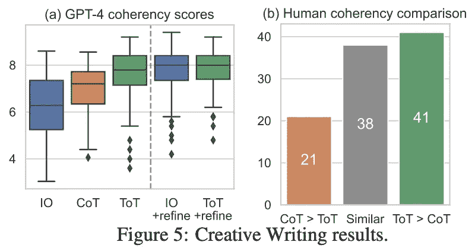

# 思维树提示

> 原文：[`towardsdatascience.com/tree-of-thoughts-prompting-65a3e51f9ac4`](https://towardsdatascience.com/tree-of-thoughts-prompting-65a3e51f9ac4)

## 通过有意规划和探索来解决 LLMs 的多步骤问题……

 [Cameron R. Wolfe, Ph.D.](https://wolfecameron.medium.com/?source=post_page-----65a3e51f9ac4--------------------------------)

·发表于 [Towards Data Science](https://towardsdatascience.com/?source=post_page-----65a3e51f9ac4--------------------------------) ·20 min 阅读·2023 年 12 月 22 日

--

（照片由 [Johann Siemens](https://unsplash.com/@emben?utm_content=creditCopyText&utm_medium=referral&utm_source=unsplash) 提供，刊登在 [Unsplash](https://unsplash.com/photos/green-tree-on-grassland-during-daytime-EPy0gBJzzZU?utm_content=creditCopyText&utm_medium=referral&utm_source=unsplash)）

当大型语言模型（LLMs）首次开始受到关注时，它们因在解决复杂推理问题方面的不足而受到批评。尽管扩大这些模型的规模（即更多的参数和数据）在各项任务中提供了近乎一致的性能提升，但我们几乎没有看到现代 LLMs 在推理任务上的性能提升。这一情况随着先进提示技术的提出而改变，如思维链提示[2]和自一致性[3]。这些方法向我们展示了 LLMs 完全有能力进行推理和解决复杂的多步骤问题。它们只需要正确的提示来充分发挥这些能力。

> “也许令人惊讶的是，所有这些进展背后仍然是最初的自回归文本生成机制，该机制逐个生成令牌，并按从左到右的方式进行决策。” *— 摘自 [1]*

即使适当的提示可以使大型语言模型（LLMs）解决复杂问题，这些技术仍然存在不足。即，我们通常*（i）* 给 LLM 提供一个提示，并*（ii）* 期望模型通过下一个词预测生成完整的解决方案。某些方法可能以逐步的方式生成解决方案（例如，最少到最多提示[8]），但 LLM 仍然遵循单一的推理路径，而不是探索多种潜在解决方案。对于那些初步决策可能完全破坏解决方案的复杂问题，这种方法将难以奏效，这一点尤其值得注意，因为 LLM 现在常被用作各种实际应用中的通用问题解决者。简单来说，*我们需要一种在解决问题时能够进行更周密规划和探索的提示方法*。

在[1]中，作者提出了一种被称为“思维树提示”的方法，它通过明确地将问题分解为一系列*思维*，即中间步骤，来解决问题。类似于链式思维提示，思维树提示生成的解决方案仅仅是一个单独思维的序列。然而，这种方法更进一步，允许同时考虑多条推理路径——*形成一个潜在思维或推理路径的树状结构*——并通过 LLM 驱动的自我评估探索整个解决方案空间。通过思维树提示，LLM 可以刻意规划其解决方案，测试各种中间推理路径，甚至进行回溯，从而探索解决方案空间，并最终生成正确的输出。

## 与其他领域和生成方法的研究联系

> “一个真正的问题解决过程涉及反复使用可用信息来启动探索，这反过来又揭示了更多信息，直到最终发现解决方案的方法。” *——摘自[12]*

**类比于人类。** 为了解释他们的技术，[1]中的作者借鉴了对人类决策过程的分析。特别是，人类似乎有两种不同的决策模式：

+   一种快速、自动、无意识的模式

+   一种缓慢、刻意、有意识的模式

[1]中的作者认为，链式思维提示等技术似乎模仿了上述第一种模式，因为 LLM 只是以从左到右的方式生成文本，而没有进行刻意的规划或问题的解构。树状思维提示的主要动机是通过将每个问题分解成一个由较小步骤组成的树状结构，这些步骤被逐一探索，从而将刻意的规划和探索注入到问题解决过程中。

**受到早期人工智能工作的启发。** 思维树提示所遵循的规划过程受到 20 世纪中期人工智能研究的启发 [12, 13]！这项工作认为，问题解决可以被表述为在表示为树的组合空间中进行搜索。在这个空间内，保持多个活跃的思维链，每个链表示在大树中的一条路径。正如我们将看到的，这种表述使我们能够明确地分解复杂问题的解决方案，并利用已有的图算法（例如广度优先和深度优先搜索）找到可行的解决方案。

# 提示的基础知识

(来源于 [10])

LLM 的通用文本到文本格式非常强大。要解决任何问题，我们可以简单地 *i)* 编写一个描述问题的文本提示，以及 *ii)* 使用语言模型生成相关的输出/解决方案。因此，LLM 被认为是基础模型，即能够单独适应解决各种任务的模型。这种能力很大程度上得益于上下文学习。即，预训练的 LLM 有能力利用注入到提示中的数据作为上下文，产生更准确的输出；见下文。

(来源于 [5])

然而，上下文学习的有效性与用于解决问题的提示高度相关。存在许多不同的提示方法——包括思维树提示 [1]——但选择正确的提示技术或编写正确的提示可能相当困难。因此，我们现在将简要介绍提示工程的基础知识，提供有用的背景，使本概述中探索的各种提示技术更加易于理解。

## 什么是提示工程？

> “提示工程是一个相对较新的学科，用于开发和优化提示，以高效地利用语言模型进行各种应用和研究主题。” *— 来源于 [2]*

提示工程指的是不断调整语言模型的提示，以发现能够准确解决预期任务的提示的过程。通常，提示工程的过程是经验性的，这意味着我们通过测量提示在相关任务上的表现来发现最佳提示。提示是一个充满启发式方法和各种不同技术的新领域。因此，我们可以通过遵循类似于其他工程问题的方法来最大化成功的机会：

+   跟踪和版本化不同的提示

+   设置广泛的基准以衡量提示的表现

+   测试不同的想法，看看哪些能产生最佳结果

(由作者创建)

**上下文窗口**。编写提示时一个主要的考虑因素是底层 LLM 的上下文窗口的大小。如上图所示，所有 LLM 都是使用一定大小的输入进行训练的（即，上下文窗口或上下文长度的大小），这 — *连同内存限制* — 限制了在提示中可以提供给 LLM 的数据总量。实际上，这意味着我们必须对提示中包含的数据进行选择。接下来，我们将概述提示的组成部分，以及可能提供的信息类型，以引导 LLM 找到正确的解决方案。

## 提示的结构

使用所有结构组件的示例提示，指示符已加粗以便于查看（由作者创建）

存在多种提示技术，但这些技术都采用（相对）常见的结构。图中展示了可能遇到的提示的各种组件，并在下文中进行了概述。

+   *输入数据*：LLM 正在处理的输入数据。

+   *示例*：演示如何正确解决所需问题的输入输出示例。

+   *指令*：对 LLM 期望行为的详细文本描述。

+   *指示符*：用于组织和结构化提示不同组件的文本标签。

+   *上下文*：可能对 LLM 有用的任何额外上下文（例如，从向量数据库中检索的信息块）。

值得注意的是，并非所有这些组成部分在编写提示时都是必要的。本概述中探讨的几种技术将只使用上述组件的子集，但每种技术都可以在必要时用来提供额外的有用信息给 LLM。

# 提示技术的层级

编写提示是一个迭代过程，应该从简单开始，仅在需要时添加复杂性。

现在我们对上下文学习和提示工程有了基本了解，我们需要深入探讨一些常见的语言模型提示技术。我们将从简单的技术开始，例如零-shot 和少-shot 提示，然后转向更复杂的技术，如思维链提示 [2] 和自一致性 [3]。一如既往，我们应该记住编写提示时的最佳方法是简单 — *我们应尽可能从简单开始，然后使用测试驱动开发来决定何时需要额外的复杂性*。换句话说，我们可以基于我们期望的应用创建一个大规模的提示示例基准，然后在我们迭代和测试不同的提示变体时测量在该基准上的表现。有关提示的更全面（和实用）的指南，请查看文章 这里。

## 零-shot 和少-shot 提示

（来自 [5]）

**零样本提示** 是我们可以用于提示语言模型的最简单技术之一，它最初因 GPT-2 利用这一技术在各种自然语言基准测试中表现出色而广受欢迎。要形成零样本提示，我们需要提供两项信息（见上文）：

1.  任务描述

1.  我们的输入数据

在这里，语言模型预计利用其知识库和提供的任务描述来解决问题，而无需任何明确的示例或详细指令。尽管许多语言模型在零样本提示下表现相对良好，但我们通常需要向模型提供额外的细节以获得更可靠和准确的结果。

(来自 [5])

**少样本提示** 通过在提示中添加模型期望输出的“示例”来超越零样本提示；见上文。除了任务描述，我们还提供几个正确的输入输出对的示例。通过将这些上下文添加到提示中，我们可以为语言模型提供更具体的输出细节。这一技术在 GPT-3 [5] 中得到推广，当时首次显示语言模型在上下文学习方面具有很高的能力。简而言之，模型可以从这些示例中学习，并随着示例的增多提高准确性。

(来自 [5])

## 指令提示

零样本和少样本学习是效果惊人的简单技术，但有时它们不会产生足够的性能水平。而且，少样本学习还增加了提示的大小。如果这些技术不适用于我们的用例，我们可以尝试的下一种技术是指令提示。指令提示与其包含任务描述和几个正确输出示例不同，它在提示中包含详细的指令 —— *或对正确行为的解释* —— 并将其提供给语言模型；见下文。

带有指示器的指令提示示例（由作者创建）

而且，指令提示和少样本提示并非相互排斥！我们可以轻松将指令提示与几个少样本示例结合，以提高性能。实际上，零样本和少样本提示技术使用的任务描述实际上与指令本身非常相似。

(来自 [6])

**对齐是必要的。** 制定深思熟虑的指令是一种非常有效且令牌高效的提示技术。然而，并非所有语言模型都擅长遵循指令。例如，预训练的（基础）LLM 本身并不具备自然跟随详细指令的能力。这种能力通常通过对齐过程来发展，对齐过程微调了 LLM 跟随指令的能力；见上文。许多现代 LLM（如 GPT-4）非常可引导（即擅长跟随详细指令），使得指令提示成为与这些模型合作的最有效技术之一，如下所示。

GPT-4 是可引导的，并且可以轻松跟随提示中的复杂指令（由作者创建）

## 高级提示技术

有时，少量提示和指令提示不足以完成期望的任务。特别是，语言模型往往在处理复杂推理问题时表现不佳，例如需要多个步骤的常识推理问题或数学难题。然而，已经开发了众多高级提示技术——*包括思维树提示*——以扩展可以用 LLM 解决的困难问题的范围。在本节中，我们将重点介绍一种技术——思维链（CoT）提示 [2]（及其几种变体）——这种技术在实践中特别有效，并形成了思维树提示方法的基础。

(来源于 [2])

**什么是 CoT 提示？** 通过利用上下文学习能力，CoT 提示鼓励语言模型通过输出解决方案及相应的“思维链”（即问题解决的逐步解释）来更有效地解决复杂问题。可以通过几-shot 学习方法提供几个思维链示例来提示模型生成思维链；见上文。CoT 技术在输入到输出的映射非常复杂时效果最佳；例如数学或多步骤推理问题。在这种情况下，引入思维链允许模型沿着更小的中间步骤接近正确的最终解决方案。在实践中，发现 CoT 提示在各种推理任务中的 LLM 性能显著提升；见下文。

(来源于 [2])

**CoT 提示的变体。** 鉴于 CoT 提示的实际效用（即，它可以用来解决 LLM 通常难以应对的复杂多步骤问题！），在其提出后不久，开发了几种变体，例如零-shot CoT [7] 和从少到多提示 [8]；见下文。

(来源于 [7, 8])

与思维树提示最相关的 CoT 提示变体是自一致性 [3]。这种方法利用了类似于 CoT 提示的方法。一个模型使用相同的（CoT）提示多次生成输出。然后，通过对模型输出进行多数投票来生成最终答案，如下图所示。这种方法被发现与 CoT 提示具有类似的好处，并且在更困难的问题上提高了性能和可靠性。

（来源 [3]）

**现有的限制。** 技术如 CoT 提示和自一致性大大扩展了可用 LLM 解决的问题范围。如果没有这些技术，解决多步骤推理问题将会非常困难。然而，这些提示技术并非没有局限性。例如，并非所有问题都有适合多数投票的解空间，而且已有研究表明，即使对于可以以这种方式表述的问题，多数投票也被证明是改善 LLM 准确性的一个糟糕启发式方法。

> “我们观察到准确率的平均变化为 9.5%，且误差的 Jaccard 指数比如果提示误差是 i.i.d. 的情况高出 69%。多数投票（MV）是先前工作中的主要无监督聚合策略，但它没有考虑到这两个特性，使其不可靠。” *— 来源 [9]*

更广泛地说，解决复杂任务可能需要广泛的规划、战略前瞻、回溯，甚至同时探索大量可行的解决方案。技术如 CoT 提示遵循从左到右的连续生成方法，利用下一个标记预测一次性输出解决方案。这种方法虽然在某些场景下非常有效，但无法解决需要战略规划和探索的任务。但是，这正是思维树提示派上用场的地方！与 CoT 提示类似，思维树提示将问题分解为更小的部分（即思维链），但进一步结合了并行探索多条解决路径的能力，形成一个树而不是单一链条！

# 理解思维树提示

（来源 [1]）

CoT 提示的有效性来自于将复杂问题的解决方案拆分成一系列更小、更简单步骤的能力。思维树（ToT）提示类似地将问题拆分成一系列更小的步骤——或*思路*——逐一解决。然而，这种方法并不限制模型一次性输出这些步骤。相反，每个思路是独立生成或解决的，并传递到下一步骤来解决问题，这使得模型能够：

+   探索每个问题解决思路的多种选择。

+   评估某些思路是否使模型更接近最终解决方案。

+   当某些思维被发现是死胡同时进行回溯。

+   在可能的问题解决步骤的组合空间中进行搜索，以找到最佳的最终解决方案。

通过 ToT 提示，可以形成整个思维树（如上图所示），允许在解决问题的过程中探索不同的思维。在探索过程中，LLM 可以通过基于语言的过程评估每个思维在最终解决方案中的进展。然后，通过利用广泛使用的搜索算法（例如，[广度优先搜索或深度优先搜索](https://www.geeksforgeeks.org/difference-between-bfs-and-dfs/)），ToT 提示可以增强前瞻性和回溯技术，从而彻底探索任何问题的解决空间。

> “虽然现有方法为问题解决采样连续的语言序列，但 ToT 主动维护一棵思维树，其中每个思维是一个连贯的语言序列，作为问题解决的中间步骤。” *— 引自 [1]*

（引自 [1]）

**树代表什么？** 使用 ToT 提示时，我们探索几个*路径*——每条路径由单独的*思维*组成——这些路径代表问题的潜在解决方案。所有这些路径及其单独的思维共同形成了一棵树，探索问题的解决空间；见上文。在这棵树中，每个节点只是我们问题的部分解决方案（或思维），而每个连接是一个操作符，它修改这个部分解决方案，产生问题解决路径中的下一个思维。下面展示了如何以这种方式分解问题解决思维链（即思维树中的单条路径）的示例。

使用操作符迭代修改部分解决方案，直到找到最终解决方案（引自 [2]）

## 思维树问题解决框架

到目前为止，我们已经讨论了 ToT 提示的通用理念，但*我们如何在实际应用中使用这种技术*？ToT 提示的实现因我们要解决的问题而有所不同，但任何 ToT 提示的实例必须具体定义四个标准问题解决组件，如下所述。

（引自 [1]）

**思维分解。** 与 CoT 提示不同，ToT 明确将问题分解为中间步骤或思维，这些思维组合在一起形成对基础问题的解决方案。根据问题的不同，这种分解可以采取各种不同的形式，例如输出几个词或一行方程式。如上图所示，每个任务中的思维定义在 [1] 中有所不同。

> “一个思想应该足够小，以便 LMs 可以生成有前途和多样的样本（例如，生成整本书通常太大而无法连贯），但也要足够大，以便 LMs 可以评估其解决问题的前景（例如，生成一个标记通常太小而无法评估）。"* — 来自 [1]*

**思想生成。** 一旦我们决定了什么构成一个思想，我们需要确定在 ToT 提示过程中如何生成思想。在 [1] 中，作者提出了两种基本的思想生成技术：

+   *采样*：用相同的提示独立生成多个思想

+   *提议*：用“提议提示”顺序生成多个思想

采样方法在思想空间丰富时效果最好，因为几种独立生成的思想不太可能重复。如果思想空间更加受限，那么可以使用提议技术生成多个思想，同时避免重复。

**状态评估。** 一旦我们定义了我们的思想并选择了它们的生成方式，我们需要定义一种启发式方法来评估某些思路链的质量。否则，我们无法知道是否在朝着最终解决方案取得进展。给定几个已生成的思想，[1] 中的作者使用 LLM 来推理每个思想的质量。特别地，遵循两种不同的策略：

+   *价值*：独立地给每种状态分配一个标量值（即，1–10 的评分）或分类（即，确定、可能或不可能达成解决方案）。

+   *投票*：比较不同的解决方案，并选择最有前景的一个。

虽然这两种方法都可以很好地工作，但当一个问题的成功解决方案难以直接评估时（例如创意写作任务），投票是最好的选择。在这两种情况下，可以多次提示 LLM，类似于自一致性，以实现对每种状态的更可靠评估。

（来自 [1]）

**搜索算法。** ToT 提示的最终组件是用于探索解决方案空间的搜索算法。尽管可以使用许多潜在的搜索算法，但我们在 [1] 中看到，作者专注于两种基本算法 — *BFS 和 DFS* — 其公式如上所示。

# 实验分析

[1] 中的作者提出了三项新任务，用于评估 ToT 提示技术：24 游戏、创意写作和 5x5 填字游戏。对于每个任务，我们将首先概述 ToT 提示的实施，这遵循上述的四部分框架。然后，我们将概述实验结果，突出 ToT 提示在需要大量规划或搜索的问题上的有效性。值得注意的是，像 CoT 提示和自一致性这样的替代方法往往无法解决这些复杂任务。

## 24 游戏

（来自 [1]）

上述展示了 ToT 提示在 24 游戏任务中的实现。在此任务中，LLM 给定四个数字，并期望生成一系列算术运算——*每个数字只使用一次*——以得到数字 24。此任务始终被分解为三个思考，每个思考都是一个中间方程。相同的提示用于生成候选解决方案中的每三个思考，并通过一个值提示来评估状态，该提示将中间解决方案分类为 *确定*、*可能* 或 *不可能* 得到正确的最终解决方案。然后，应用 BFS 算法来寻找结果解决方案，在每一步保持最好的五个（即 `b=5`）候选解决方案。

（摘自 [1]）

**性能。** ToT 提示与几种基线方法进行了比较，包括标准的少量示例提示（IO）、CoT 提示和基于 CoT 的自一致性（CoT-SC）。如上所示，所有基线方法在此任务中的表现都相当差（即成功率<10%），而 ToT 提示的成功率高达 74%。有趣的是，随着 BFS 的 `b` 设置值增加，成功率也有所提高。此外，基于 [1] 中的错误分析，我们发现大多数使用 CoT 提示的解决方案在第一步之后失败，而 ToT 提示的失败则均匀分布在各个中间步骤之间。这一发现表明 ToT 提示的好处，因为它可以在生成最终输出之前评估中间状态，从而允许探索多个可行的解决路径。

## 创意写作

（摘自 [1]）

[1] 中探讨的创意写作任务提供了四个随机句子作为输入，并期望生成包含四个段落的文章，每个段落以这四个输入句子结尾。输出质量通过 GPT-4（使用零-shot 提示）或人工评估来判断。在此任务中，ToT 提示需要两个中间思考。首先，LLM 生成五个不同的写作计划，并使用零-shot 投票提示选择最佳计划。然后，根据选定的计划生成五个不同的段落，并通过（再次）零-shot 投票提示确定最佳段落；见上文。

（摘自 [1]）

**性能。** 如上图所示，ToT 提示生成的段落比少量示例和 CoT 提示的段落更连贯，这一点得到了 GPT-4 和人工评估者的共同判断。当应用迭代改进程序以提高结果质量时，我们发现少量示例提示和 ToT 提示的表现相当。这种程序可以被视为一种新的思考生成方法，其中通过提示 LLM 来改进旧思考，而不是从头生成新思考。

## 5x5 填字游戏

（摘自 [1]）

[1]中考虑的最终任务是一个迷你填字游戏，旨在探索 ToT 提示发现需要更多中间步骤的问题的能力。该任务的输入提供了五个水平提示和五个垂直提示，而输出应该是一个 5x5 字母网格，以解决填字谜题。成功是根据每种提示技术在字母、单词和游戏方面的正确程度来判断的。

**ToT 设置。** 对于迷你填字游戏，ToT 提示使用深度优先搜索（DFS）进行实现。每个思路都考虑单个单词提示。思路是按顺序生成的，并且不能改变任何当前已填写的单词或字母。为了找到新的候选答案，LLM 将所有现有的思路作为输入，根据这些思路生成剩余单词提示的字母约束，并使用提议提示来提出下一个应填写的单词及其位置。值得注意的是，LLM 还会被提示为每个思路提供一个置信度级别，从而可以按照置信度的顺序探索思路。中间状态的评估基于是否可以得到一个可行的最终解决方案。如果不能，DFS 将回溯到思路树中的父节点并继续探索。整个过程如上图所示。

（来自[1]）

**性能。** 如上表所示，ToT 提示在迷你填字游戏基准测试中的成功率远远优于少量样本和 CoT 提示。即便如此，ToT 提示只在测试的 20 个谜题中全球解决了 4 个，显示出在此类任务上仍有很大的改进空间。然而，ToT 提示通过 DFS 回溯和探索不同解决方案的能力是一个巨大的区分因素。

> “这种改进并不令人惊讶，因为 IO 和 CoT 缺乏尝试不同提示、修改决策或回溯的机制。”*— 来自 [1]*

# 结束语

最近关于提示技术的研究大大扩展了通过 LLM 可解决的问题范围。然而，大多数提示技术受到语言生成的自回归性质的限制——*它们倾向于遵循从左到右的方法，缺乏深思熟虑的规划和探索问题替代解决方案的机会*。ToT 提示通过将问题的解决方案抽象为一个可以使用已知算法和启发式方法独立探索和评估的中间步骤树来解决这个问题。ToT 提示的理念非常通用，可以根据底层问题进行不同的实例化。在[1]中，我们可以看到若干示例，其中 ToT 提示被证明比 CoT 提示及相关变体更有效地解决了多步骤推理问题。

## 与我联系！

非常感谢阅读本文。我是 [Cameron R. Wolfe](https://cameronrwolfe.me/)，[Rebuy](https://www.rebuyengine.com/) 的 AI 总监。我研究深度学习的实证和理论基础。如果你喜欢这个概述，可以订阅我的 [Deep (Learning) Focus newsletter](https://cameronrwolfe.substack.com/)，我在这里帮助读者从基础开始理解 AI 研究。你也可以在 [X](https://twitter.com/cwolferesearch) 和 [LinkedIn](https://www.linkedin.com/in/cameron-r-wolfe-ph-d-04744a238/) 上关注我，或者查看我在 medium 上的 [其他文章](https://medium.com/@wolfecameron)！

## 参考文献

[1] Yao, Shunyu, et al. “思想树：与大型语言模型进行深思熟虑的问题解决。” *arXiv 预印本 arXiv:2305.10601* (2023)。

[2] Wei, Jason, et al. “思维链提示引发大型语言模型中的推理。” *神经信息处理系统进展* 35 (2022): 24824–24837。

[3] Wang, Xuezhi, et al. “自洽性改善了语言模型中的思维链推理。” *arXiv 预印本 arXiv:2203.11171* (2022)。

[4] Radford, Alec, et al. “语言模型是无监督的多任务学习者。”

[5] Brown, Tom, et al. “语言模型是少样本学习者。” *神经信息处理系统进展* 33 (2020): 1877–1901。

[6] Ouyang, Long, et al. “通过人类反馈训练语言模型以遵循指令。” *神经信息处理系统进展* 35 (2022): 27730–27744。

[7] Kojima, Takeshi, et al. “大型语言模型是零样本推理者。” *神经信息处理系统进展* 35 (2022): 22199–22213。

[8] Zhou, Denny, et al. “从少到多的提示使大型语言模型能够进行复杂推理。” *arXiv 预印本 arXiv:2205.10625* (2022)。

[9] Arora, Simran, et al. “问我任何事：一种简单的语言模型提示策略。” *arXiv 预印本 arXiv:2210.02441* (2022)。

[10] Raffel, Colin, et al. “探索统一文本到文本变换器的迁移学习极限。” *机器学习研究期刊* 21.1 (2020): 5485–5551。

[11] Saravia, Elvis, et al. “提示工程指南”， [`github.com/dair-ai/Prompt-Engineering-Guide`](https://github.com/dair-ai/Prompt-Engineering-Guide) (2022)。

[12] A. Newell, J. C. Shaw, and H. A. Simon. 关于一般问题解决程序的报告。在 IFIP 会议，卷 256，第 64 页。宾夕法尼亚州匹兹堡，1959。

[13] A. Newell, H. A. Simon, et al. 人类问题解决。普伦蒂斯-霍尔，1972。
