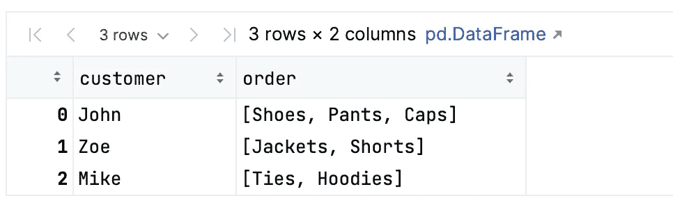
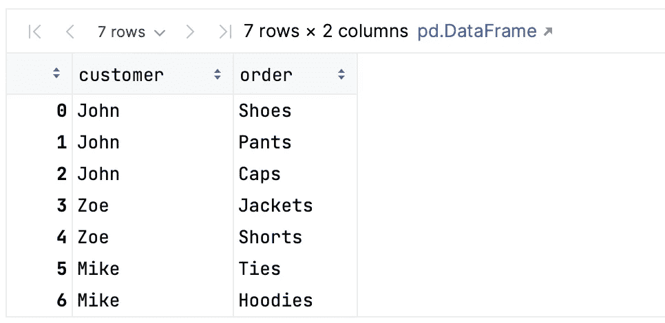
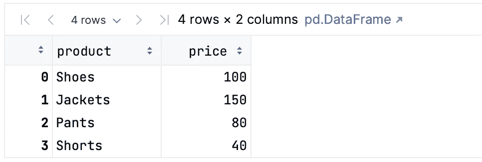
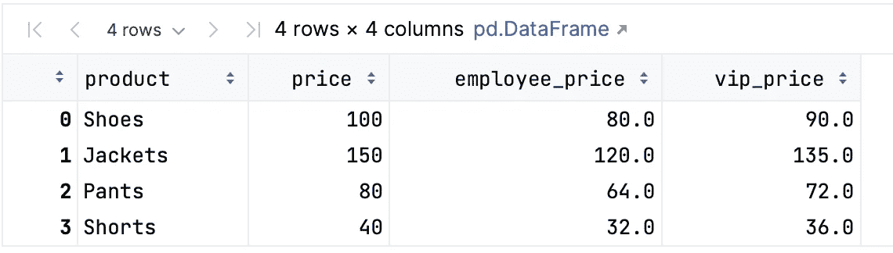
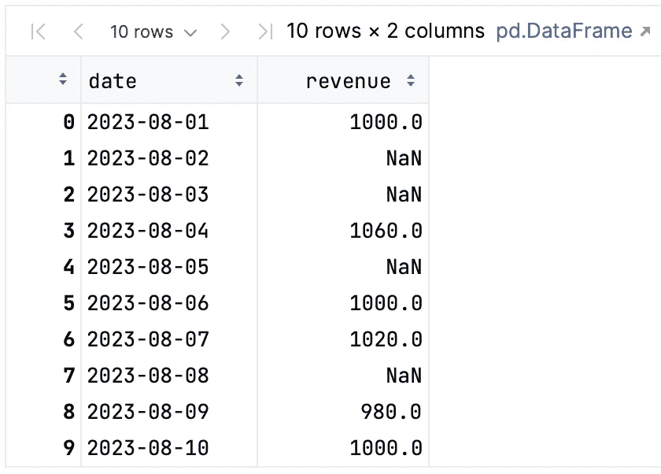
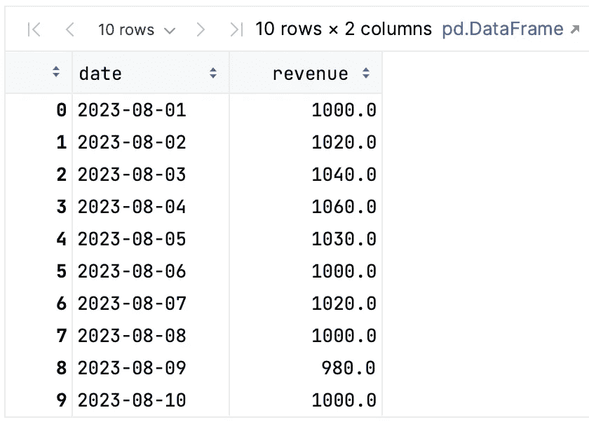

# 尝试这 3 个鲜为人知的 Pandas 函数

> 原文：[`towardsdatascience.com/try-these-3-lesser-known-pandas-functions-cfee4bc7e191`](https://towardsdatascience.com/try-these-3-lesser-known-pandas-functions-cfee4bc7e191)

## 使用 pandas 提升你的数据处理技能

[](https://yongcui01.medium.com/?source=post_page-----cfee4bc7e191--------------------------------)[](https://towardsdatascience.com/?source=post_page-----cfee4bc7e191--------------------------------) [Yong Cui](https://yongcui01.medium.com/?source=post_page-----cfee4bc7e191--------------------------------)

·发布于 [Towards Data Science](https://towardsdatascience.com/?source=post_page-----cfee4bc7e191--------------------------------) ·阅读时间 6 分钟·2023 年 8 月 28 日

--


[Balázs Kétyi](https://unsplash.com/@balazsketyi?utm_source=medium&utm_medium=referral) 的照片，来源于 [Unsplash](https://unsplash.com/?utm_source=medium&utm_medium=referral)

如果你问任何有经验的数据科学家或机器学习工程师，他们在工作中最耗时的是什么？我想他们中的许多人会说：数据预处理——一个清理数据并为顺序数据分析做准备的步骤。原因很简单——垃圾进，垃圾出。也就是说，如果你不正确地准备数据，你对数据的“见解”很难具有意义。

尽管数据预处理步骤可能相当繁琐，但 Pandas 提供了所有必要的功能，使我们能够相对轻松地完成数据清理工作。然而，由于其多功能性，并非每个用户都了解 pandas 库提供的所有功能。在本文中，我想分享 3 个鲜为人知但非常实用的函数，供你在数据科学项目中尝试。

不再赘述，让我们深入探讨吧。

*注意：为了提供背景，假设你负责一家服装店的数据管理和分析。下面的示例基于这一假设。*

# 1\. explode

我想提到的第一个函数是 `explode`。当你处理包含列表的列中的数据时，这个函数非常有用。使用 `explode` 处理此列时，你会通过将列表中的每个元素提取到单独的行中，创建多行数据。

这里有一个简单的代码示例，展示了如何使用 `explode` 函数。假设你有一个存储订单信息的数据框。在这个表格中，你有一列（即 `order` 列），包含了项列表，如下所示：

```py
order_data = {
    'customer': ['John', 'Zoe', 'Mike'],
    'order': [['Shoes', 'Pants', 'Caps'], ['Jackets', 'Shorts'], ['Ties', 'Hoodies']]
}
order_df = pd.DataFrame(order_data)
order_df
```



所需的操作是将列表中的每个项目拆分为单独的行以进行进一步的数据处理。如果不使用`explode`，一个简单的解决方案可能是这样。我们只是迭代原始行，并从列表中的每个项目创建多个行。

```py
processed_rows = []
for _, row in order_df.iterrows():
    processed_rows.extend([row["customer"], item] for item in row["order"])

processed_df = pd.DataFrame(processed_rows, columns=["customer", "order"])
processed_df
```



使用`explode`，我们可以有一个更简洁的解决方案：

```py
exploded_df = order_df.explode("order", ignore_index=True)

# confirm the equality of the output data frames
assert processed_df.equals(exploded_df)
```

正如你所看到的，我们指定了要“explode”的列，这样会得到一个新数据框，包含每行都是原始列表中的一个项目。使用`assert`语句，我展示了使用 explode 与之前的解决方案产生相同的结果。

附带说明一下，如果你希望新数据框的索引为 0、1、……、n，可以将`ignore_index`指定为`True`。与简单函数调用和 for 循环相比，使用`explode`的优势不仅仅是这些—`explode`还能处理某些行包含单个项目而非列表对象的情况，例如像`Chloe, Jeans`这样的行。简单的解决方案无法正确处理这种行，因为 Jeans 不是列表对象。

# 2\. assign

我想讨论的第二个函数是`assign`。此函数可以在数据框中创建新列或修改现有列。该函数的主要好处是可以添加计算或衍生列，而无需修改原始数据。

假设我们有一个数据框，包含关于服装店产品及其价格的信息，如下所示：

```py
product_data = {
    'product': ['Shoes', 'Jackets', 'Pants', 'Shorts'],
    'price': [100, 150, 80, 40]
}
product_df = pd.DataFrame(product_data)
product_df
```



我们需要通过应用折扣百分比来计算每个产品的折扣价格—对于店铺员工，折扣 20%，对于店铺 VIP 客户，折扣 10%。如果不使用`assign`，我们可能会有以下解决方案：

```py
df1 = df.copy()
df1["employee_price"] = df1["price"] * 0.8
df1["vip_price"] = df1["price"] * 0.9
df1
```



正如你所看到的，我们首先创建数据框的副本，以确保新列的创建不会更改原始数据框。在新的数据框中，我们创建了额外的列。

`assign`函数将这些独立的步骤结合在一起，产生一个更简洁的解决方案：

```py
df2 = product_df.assign(employee_price=product_df["price"]*0.8, vip_price=product_df["price"]*0.9)

assert df1.equals(df2)
```

正如从上述代码中可以看出，在`assign`函数中，我们指定了两个附加列，并为每列提供了所需的计算。输出数据框与我们刚刚创建的一个匹配。快速说明一下，你通过关键字参数调用`assign`函数，这些关键字将成为新列名。

# 3\. interpolate

我想提到的第三个函数是`interpolate`，使用它我们可以通过各种插值方法填补数据框中的缺失值。正如你们中的一些人可能知道的那样，插值是一种基于周围数据点估算值的技术。特别是在处理时间序列数据时，这是填补缺失值的常用技术。

假设你有一个存储销售数据的数据框。然而，由于在某些天，经理忘记将销售数据输入源中，导致一些缺失值，如下所示：

```py
sales_data = {
    'date': pd.date_range(start='2023-08-01', periods=10, freq='D'),
    'revenue': [1000, np.nan, np.nan, 1060, np.nan, 1000, 1020, np.nan, 980, 1000]}
sales_df = pd.DataFrame(sales_data)
sales_df
```



如果我们不使用`interpolate`函数，我们可能需要识别缺失值的索引并定位其周围的值，利用这些值来插值缺失值。如你所想，这是一项非常复杂的过程。相反，你可以使用`interpolate`函数，它处理了所有这些繁琐的步骤，如下所示：

```py
interpolated_df = sales_df.interpolate()
interpolated_df
```



在插值后的数据框中，你看不到任何缺失值，所有缺失值都已被基于其周围值的插值值填补。如你所见，默认的插值方法是线性插值，这假设在缺失值范围内的变化是线性的，由其非缺失的邻近值所界定。还有其他插值方法，你可以在官方[文档](https://pandas.pydata.org/docs/reference/api/pandas.DataFrame.interpolate.html)中查看它们。

# 结论

本文的内容大致如此。随着 pandas 库的迭代，越来越多的函数在最新版本中可用。如果你遇到一些复杂的操作，可以查阅其官方文档，可能会有现成的函数可供使用，比如可以用于处理时间序列分析中缺失数据的`interpolate`函数。
