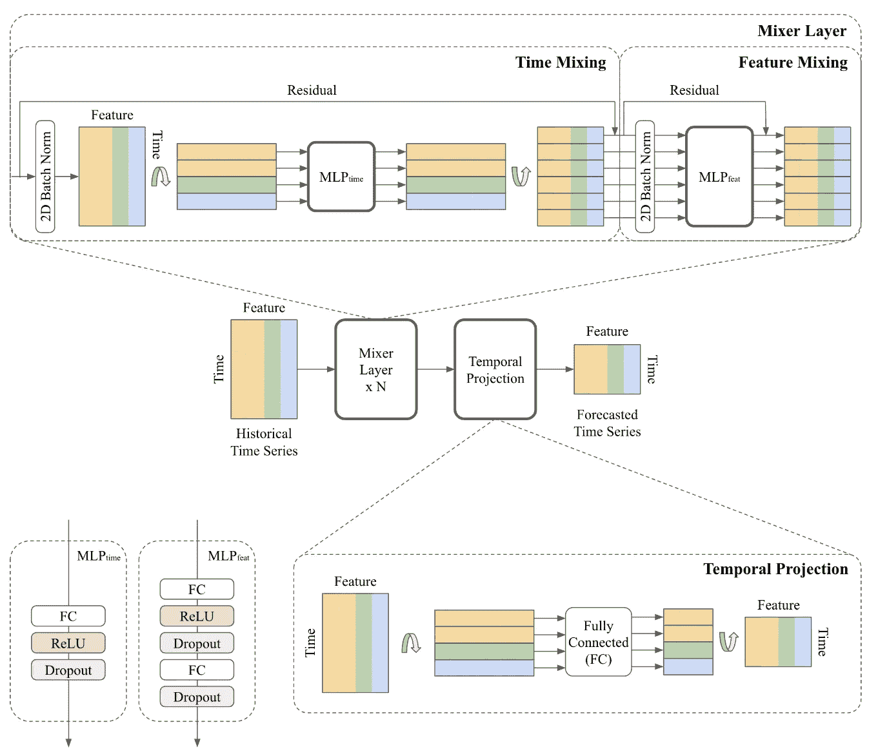
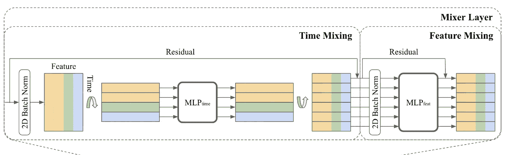
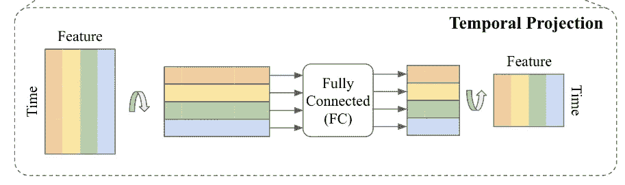
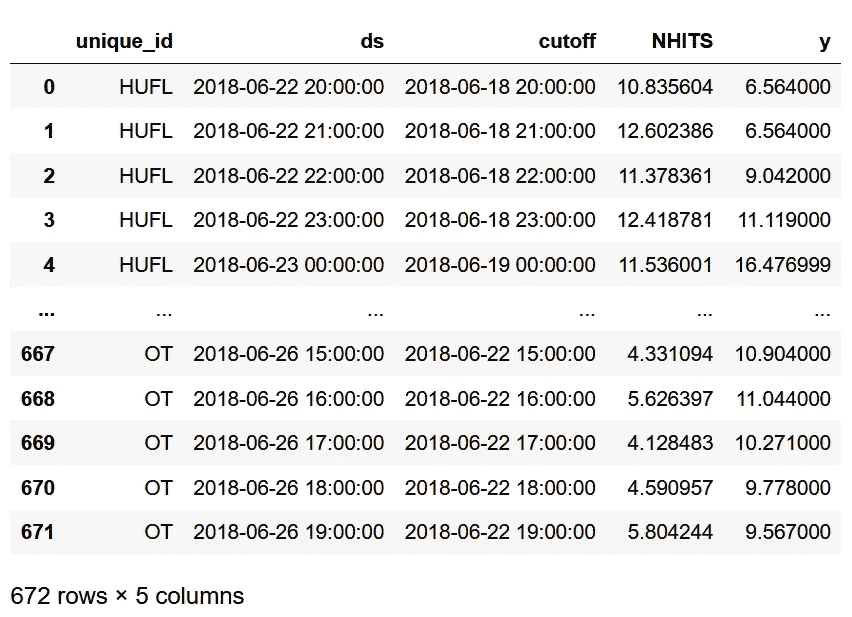
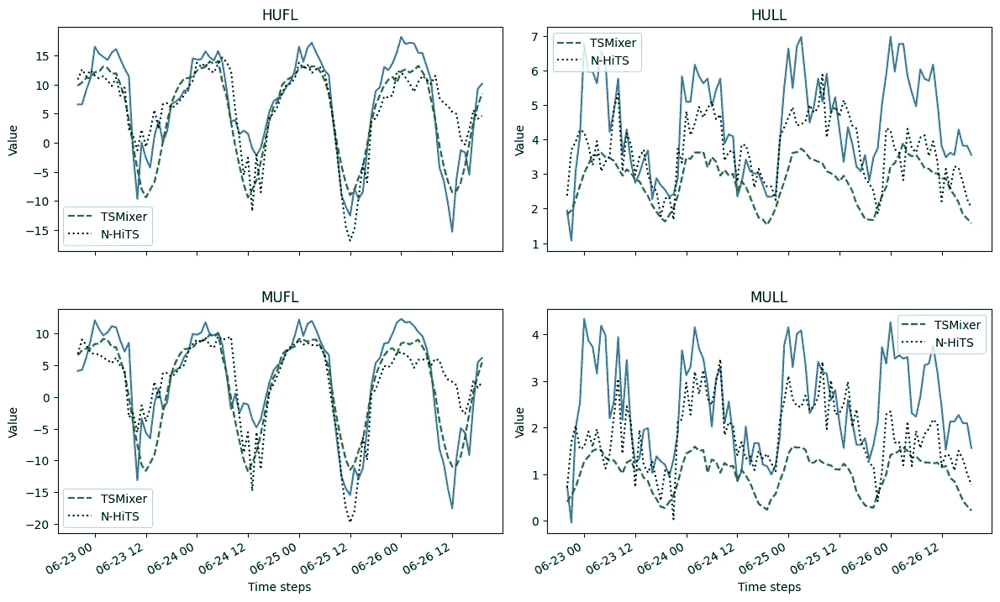
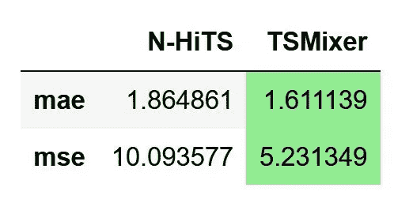

# TSMixer: 谷歌推出的最新预测模型

> 原文：[`towardsdatascience.com/tsmixer-the-latest-forecasting-model-by-google-2fd1e29a8ccb`](https://towardsdatascience.com/tsmixer-the-latest-forecasting-model-by-google-2fd1e29a8ccb)

## 探索 TSMixer 的架构，并在 Python 中实现它，用于长期多变量预测任务。

[](https://medium.com/@marcopeixeiro?source=post_page-----2fd1e29a8ccb--------------------------------)[](https://towardsdatascience.com/?source=post_page-----2fd1e29a8ccb--------------------------------) [Marco Peixeiro](https://medium.com/@marcopeixeiro?source=post_page-----2fd1e29a8ccb--------------------------------)

·发表于[Towards Data Science](https://towardsdatascience.com/?source=post_page-----2fd1e29a8ccb--------------------------------) ·阅读时间 12 分钟·2023 年 11 月 14 日

--


由[Zdeněk Macháček](https://unsplash.com/@zmachacek?utm_source=medium&utm_medium=referral)拍摄的照片，来自[Unsplash](https://unsplash.com/?utm_source=medium&utm_medium=referral)

时间序列预测领域仍在蓬勃发展，最近有许多重要的贡献，如 N-HiTS、PatchTST、TimesNet 以及当然还有 TimeGPT。

与此同时，Transformer 架构在自然语言处理（NLP）领域实现了前所未有的性能，但在时间序列预测中并非如此。

事实上，许多基于 Transformer 的模型如 Autoformer、Informer、FEDformer 等被提出。这些模型通常训练时间非常长，而简单的线性模型在许多基准数据集上表现更好（见[Zheng et al., 2022](https://arxiv.org/pdf/2205.13504.pdf)）。

事实上，在 2023 年 9 月，谷歌云 AI 研究人员提出了**TSMixer**，这是一个基于多层感知机（MLP）的模型，专注于混合时间和特征维度，以提供更好的预测。

在他们的论文[TSMixer: An All-MLP Architecture for Time Series Forecasting](https://arxiv.org/pdf/2303.06053.pdf)中，作者展示了该模型在许多基准数据集上实现了最先进的性能，同时保持了实现的简单性。

在这篇文章中，我们首先探索 TSMixer 的架构，以理解其内部工作原理。然后，我们在 Python 中实现该模型，并运行自己的实验，将其性能与 N-HiTS 进行比较。

欲了解有关 TSMixer 的更多细节，请务必阅读[原始论文](https://arxiv.org/pdf/2303.06053.pdf)。

> **通过我的** [**免费时间序列备忘单**](https://www.datasciencewithmarco.com/pl/2147608294) **，** **学习最新的时间序列分析技术！获取统计和深度学习技术的实现，全部用 Python 和 TensorFlow！**

让我们开始吧！

# 探索 TSMixer

在预测方面，我们直观地知道，使用交叉变量信息可以帮助做出更好的预测。

例如，天气和降水量可能会影响游乐园的访客数量。同样，星期几和节假日也会产生影响。

因此，拥有能够利用协变量和其他特征信息进行预测的模型是有意义的。

这激发了 TSMixer 的创建。由于简单的单变量线性模型被证明优于更复杂的架构（见 [Zheng et al., 2022](https://arxiv.org/pdf/2205.13504.pdf)），TSMixer 现在通过添加交叉变量前馈层来扩展线性模型的能力。

因此，我们现在得到一个能够处理多变量预测的线性模型，它可以利用协变量和其他静态特征的信息。

## TSMixer 的架构

一般架构如下面的图所示。



TSMixer 的架构。图像来源：S. Chen、C. Li、N. Yoder、S. Arik 和 T. Pfister，来自 [TSMixer: An All-MLP Architecture for Time Series Forecasting](https://arxiv.org/pdf/2303.06053.pdf)

由于 TSMixer 只是扩展线性模型，它的架构相当简单，因为它完全基于 MLP。

从上图可以看出，该模型主要包括两个步骤：混合层和时间投影。

让我们更详细地探讨每一步。

## 混合层

这是时间混合和特征混合发生的地方，因此命名为 TSMixer。



专注于混合层。图像来源：S. Chen、C. Li、N. Yoder、S. Arik 和 T. Pfister，来自 [TSMixer: An All-MLP Architecture for Time Series Forecasting](https://arxiv.org/pdf/2303.06053.pdf)

在上图中，我们看到对于时间混合，MLP 包括一个全连接层，随后是 ReLU 激活函数和一个 dropout 层。

输入数据中，行代表时间，列代表特征，数据被转置，以便 MLP 应用于时间域，并在所有特征中共享。这个单元负责学习时间模式。

在离开时间混合单元之前，矩阵会再次转置，然后发送到特征混合单元。

特征混合单元包括两个 MLP。由于它在特征域中应用，因此在所有时间步长中共享。在这里，没有必要转置，因为特征已经在水平轴上。

注意，在两个混合器中，我们都有归一化层和残差连接。后者帮助模型学习数据的更深层次表示，同时保持计算成本合理，而归一化是提高深度学习模型训练的常用技术。

一旦混合完成，输出将发送到时间投影步骤。

## 时间投影

时间投影步骤是生成 TSMixer 预测的部分。



重点关注时间投影层。图像来自**S. Chen**、**C. Li**、**N. Yoder**、**S. Arik**和**T. Pfister**，见[TSMixer: An All-MLP Architecture for Time Series Forecasting](https://arxiv.org/pdf/2303.06053.pdf)

在这里，矩阵再次被转置，并通过全连接层生成预测。最终步骤是再次转置该矩阵，使特征位于水平轴上，时间步位于垂直轴上。

现在我们了解了 TSMixer 的工作原理，让我们在 Python 中实现它并进行测试。

# 实现 TSMixer

据我了解，TSMixer 在 Python 中的常用时间序列库中尚未实现，如 Darts 或 Neuralforecast。因此，我将调整原始实现以适应我的实验。

原始实现可在[Google Research 的代码库](https://github.com/google-research/google-research/tree/master/tsmixer/tsmixer_basic)中找到。

本实验的完整代码可在[GitHub](https://github.com/marcopeix/time-series-analysis/blob/master/TSMixer.ipynb)上获取。

## 读取和格式化数据

应用深度学习模型进行时间序列预测中最困难的部分无疑是格式化数据集以输入神经网络。

所以，第一步是创建一个`DataLoader`类来处理数据集的所有转换。这个类通过批处理大小、输入序列长度、输出序列长度（视野）以及目标的切片对象进行初始化。

```py
import pandas as pd
import numpy as np
import matplotlib.pyplot as plt
import tensorflow as tf
from sklearn.preprocessing import StandardScaler

class DataLoader:

  def __init__(self, batch_size, seq_len, pred_len):
    self.batch_size = batch_size
    self.seq_len = seq_len
    self.pred_len = pred_len
    self.target_slice = slice(0, None)

    self._read_data()
```

然后，我们添加一个方法来读取和缩放数据。在这里，我们使用电力变压器数据集 Etth1，公开[在 GitHub 上获取](https://github.com/zhouhaoyi/ETDataset/blob/main/ETT-small/ETTh1.csv)，根据创作共用署名许可。

```py
def _read_data(self):

    filepath = ('data/ETTh1_original.csv')

    df_raw = pd.read_csv(filepath)
    df = df_raw.set_index('date')

    # split train/valid/test
    n = len(df)
    train_end = int(n * 0.7)
    val_end = n - int(n * 0.2)
    test_end = n

    train_df = df[:train_end]
    val_df = df[train_end - self.seq_len : val_end]
    test_df = df[val_end - self.seq_len : test_end]

    # standardize by training set
    self.scaler = StandardScaler()
    self.scaler.fit(train_df.values)

    def scale_df(df, scaler):
      data = scaler.transform(df.values)
      return pd.DataFrame(data, index=df.index, columns=df.columns)

    self.train_df = scale_df(train_df, self.scaler)
    self.val_df = scale_df(val_df, self.scaler)
    self.test_df = scale_df(test_df, self.scaler)
    self.n_feature = self.train_df.shape[-1]
```

在上面的代码块中，请注意缩放数据以提高模型训练时间是至关重要的。还要注意，我们只在训练集上拟合缩放器，以避免在验证集和测试集中出现数据泄漏。

然后，我们创建两个方法，将数据窗口拆分为输入和标签，然后创建一个可以输入到 Keras 神经网络的数据集。

```py
def _split_window(self, data):
    inputs = data[:, : self.seq_len, :]
    labels = data[:, self.seq_len :, self.target_slice]

    inputs.set_shape([None, self.seq_len, None])
    labels.set_shape([None, self.pred_len, None])
    return inputs, labels

  def _make_dataset(self, data, shuffle=True):
    data = np.array(data, dtype=np.float32)
    ds = tf.keras.utils.timeseries_dataset_from_array(
        data=data,
        targets=None,
        sequence_length=(self.seq_len + self.pred_len),
        sequence_stride=1,
        shuffle=shuffle,
        batch_size=self.batch_size,
    )
    ds = ds.map(self._split_window)
    return ds
```

最后，我们完成`DataLoader`类，添加方法以逆向转换预测结果，并生成训练、验证和测试集。

```py
 def inverse_transform(self, data):
    return self.scaler.inverse_transform(data)

  def get_train(self, shuffle=True):
    return self._make_dataset(self.train_df, shuffle=shuffle)

  def get_val(self):
    return self._make_dataset(self.val_df, shuffle=False)

  def get_test(self):
    return self._make_dataset(self.test_df, shuffle=False)
```

完整的`DataLoader`类如下所示：

```py
class DataLoader:

  def __init__(self, batch_size, seq_len, pred_len):
    self.batch_size = batch_size
    self.seq_len = seq_len
    self.pred_len = pred_len
    self.target_slice = slice(0, None)

    self._read_data()

  def _read_data(self):

    filepath = ('data/ETTh1_original.csv')

    df_raw = pd.read_csv(filepath)
    df = df_raw.set_index('date')

    # split train/valid/test
    n = len(df)
    train_end = int(n * 0.7)
    val_end = n - int(n * 0.2)
    test_end = n

    train_df = df[:train_end]
    val_df = df[train_end - self.seq_len : val_end]
    test_df = df[val_end - self.seq_len : test_end]

    # standardize by training set
    self.scaler = StandardScaler()
    self.scaler.fit(train_df.values)

    def scale_df(df, scaler):
      data = scaler.transform(df.values)
      return pd.DataFrame(data, index=df.index, columns=df.columns)

    self.train_df = scale_df(train_df, self.scaler)
    self.val_df = scale_df(val_df, self.scaler)
    self.test_df = scale_df(test_df, self.scaler)
    self.n_feature = self.train_df.shape[-1]

  def _split_window(self, data):
    inputs = data[:, : self.seq_len, :]
    labels = data[:, self.seq_len :, self.target_slice]

    inputs.set_shape([None, self.seq_len, None])
    labels.set_shape([None, self.pred_len, None])
    return inputs, labels

  def _make_dataset(self, data, shuffle=True):
    data = np.array(data, dtype=np.float32)
    ds = tf.keras.utils.timeseries_dataset_from_array(
        data=data,
        targets=None,
        sequence_length=(self.seq_len + self.pred_len),
        sequence_stride=1,
        shuffle=shuffle,
        batch_size=self.batch_size,
    )
    ds = ds.map(self._split_window)
    return ds

  def inverse_transform(self, data):
    return self.scaler.inverse_transform(data)

  def get_train(self, shuffle=True):
    return self._make_dataset(self.train_df, shuffle=shuffle)

  def get_val(self):
    return self._make_dataset(self.val_df, shuffle=False)

  def get_test(self):
    return self._make_dataset(self.test_df, shuffle=False)
```

然后，我们可以简单地初始化`DataLoader`类的一个实例，以读取我们的数据集并创建相关的数据集。

在这里，我们使用了 96 的预测范围、512 的输入序列长度和 32 的批量大小。

```py
data_loader = DataLoader(batch_size=32, seq_len=512, pred_len=96)

train_data = data_loader.get_train()
val_data = data_loader.get_val()
test_data = data_loader.get_test()
```

现在数据已经准备好，我们可以构建 TSMixer 模型了。

## 构建 TSMixer

构建 TSMixer 非常简单，因为该模型仅由 MLP 组成。让我们回顾一下其架构，以便在构建模型时参考。


TSMixer 的架构。图片来自 [TSMixer: An All-MLP Architecture for Time Series Forecasting](https://arxiv.org/pdf/2303.06053.pdf) 的 S. Chen、C. Li、N. Yoder、S. Arik 和 T. Pfister。

首先，我们必须处理 Mixer Layer，它包括：

+   批量归一化

+   转置矩阵

+   输入到具有 ReLu 激活的全连接层

+   再次转置

+   dropout 层

+   并在最后添加残差

这可以翻译成如下代码：

```py
from tensorflow.keras import layers

def res_block(inputs, norm_type, activation, dropout, ff_dim):

  norm = layers.BatchNormalization

  # Time mixing
  x = norm(axis=[-2, -1])(inputs)
  x = tf.transpose(x, perm=[0, 2, 1])  # [Batch, Channel, Input Length]
  x = layers.Dense(x.shape[-1], activation='relu')(x)
  x = tf.transpose(x, perm=[0, 2, 1])  # [Batch, Input Length, Channel]
  x = layers.Dropout(dropout)(x)
  res = x + inputs
```

然后，我们添加特征混合部分，其中包括：

+   批量归一化

+   一个 dense 层

+   dropout 层

+   另一个 dense 层

+   另一个 dropout 层

+   并添加残差以形成残差连接

```py
 # Feature mixing
  x = norm(axis=[-2, -1])(res)
  x = layers.Dense(ff_dim, activation='relu')(x)  # [Batch, Input Length, FF_Dim]
  x = layers.Dropout(0.7)(x)
  x = layers.Dense(inputs.shape[-1])(x)  # [Batch, Input Length, Channel]
  x = layers.Dropout(0.7)(x)
  return x + res
```

就这样！Mixer Layer 的完整函数如下：

```py
from tensorflow.keras import layers

def res_block(inputs, ff_dim):

  norm = layers.BatchNormalization

  # Time mixing
  x = norm(axis=[-2, -1])(inputs)
  x = tf.transpose(x, perm=[0, 2, 1])  # [Batch, Channel, Input Length]
  x = layers.Dense(x.shape[-1], activation='relu')(x)
  x = tf.transpose(x, perm=[0, 2, 1])  # [Batch, Input Length, Channel]
  x = layers.Dropout(0.7)(x)
  res = x + inputs

  # Feature mixing
  x = norm(axis=[-2, -1])(res)
  x = layers.Dense(ff_dim, activation='relu')(x)  # [Batch, Input Length, FF_Dim]
  x = layers.Dropout(0.7)(x)
  x = layers.Dense(inputs.shape[-1])(x)  # [Batch, Input Length, Channel]
  x = layers.Dropout(0.7)(x)
  return x + res
```

现在，我们简单地编写一个函数来构建模型。我们包括一个 for 循环以创建我们需要的 Mixer 层，并添加最终的时间投影步骤。

从上面的图中可以看到，时间投影步骤只是：

+   一个转置

+   经过 dense 层处理

+   最后的转置

```py
def build_model(
    input_shape,
    pred_len,
    n_block,
    ff_dim,
    target_slice,
):

  inputs = tf.keras.Input(shape=input_shape)
  x = inputs  # [Batch, Input Length, Channel]
  for _ in range(n_block):
    x = res_block(x, norm_type, activation, dropout, ff_dim)

  if target_slice:
    x = x[:, :, target_slice]

  # Temporal projection
  x = tf.transpose(x, perm=[0, 2, 1])  # [Batch, Channel, Input Length]
  x = layers.Dense(pred_len)(x)  # [Batch, Channel, Output Length]
  outputs = tf.transpose(x, perm=[0, 2, 1])  # [Batch, Output Length, Channel])

  return tf.keras.Model(inputs, outputs)
```

现在，我们可以运行函数来构建模型。在这种情况下，我们在 Mixer Layer 中使用了八个块。

```py
model = build_model(
    input_shape=(512, data_loader.n_feature),
    pred_len=96,
    n_block=8,
    ff_dim=64,
    target_slice=data_loader.target_slice
)
```

## 训练 TSMixer

我们现在准备好训练模型了。

我们使用学习率为 1e-4 的 Adam 优化器。我们还实现了检查点以保存最佳模型，并通过早停机制在连续三次训练轮次没有改进时停止训练。

```py
tf.keras.utils.set_random_seed(42)

optimizer = tf.keras.optimizers.Adam(1e-4)

model.compile(optimizer, loss='mse', metrics=['mae'])

checkpoint_callback = tf.keras.callbacks.ModelCheckpoint(
    filepath='tsmixer_checkpoints/',
    vebose=1,
    save_best_only=True,
    save_weights_only=True
)

early_stop_callback = tf.keras.callbacks.EarlyStopping(
    monitor='val_loss',
    patience=3
)

history = model.fit(
    train_data,
    epochs= 30,
    validation_data=val_data,
    callbacks=[checkpoint_callback, early_stop_callback]
)
```

注意，仅使用 CPU 训练模型花费了 15 分钟。

一旦模型训练完成，我们可以加载通过检查点回调保存的最佳模型。

```py
best_epoch = np.argmin(history.history['val_loss'])

model.load_weights("tsmixer_checkpoints/")
```

然后，让我们访问最后一个 96 时间步的预测。注意，预测现在是经过缩放的。

```py
predictions = model.predict(test_data)

scaled_preds = predictions[-1,:,:]
```

最后，我们将缩放后的预测和逆变换后的预测存储在 DataFrame 中，以便后续评估性能和绘制预测结果。

```py
cols = ['HUFL', 'HULL', 'MUFL', 'MULL', 'LUFL', 'LULL', 'OT']

scaled_preds_df = pd.DataFrame(scaled_preds)
scaled_preds_df.columns = cols

preds = data_loader.inverse_transform(scaled_preds)

preds_df = pd.DataFrame(preds)
preds_df.columns = cols
```

## 使用 N-HiTS 进行预测

为了评估 TSMixer 的性能，我们使用与 N-HiTS 相同的训练协议，因为它们也支持多变量预测。

提醒一下，你可以在 [GitHub](https://github.com/marcopeix/time-series-analysis/blob/master/TSMixer.ipynb) 上访问此实验的完整代码。

对于这一部分，我们使用 NeuralForecast 库。因此，自然的第一步是读取数据并按需格式化。

```py
from neuralforecast.core import NeuralForecast
from neuralforecast.models import NHITS

df = pd.read_csv('data/ETTh1_original.csv')

columns_to_melt = ['date', 'HUFL', 'HULL', 'MUFL', 'MULL', 'LUFL', 'LULL', 'OT']

melted_df = df.melt(id_vars=['date'], value_vars=columns_to_melt, var_name='unique_id', value_name='y')

melted_df.rename(columns={'date': 'ds'}, inplace=True)

melted_df['ds'] = pd.to_datetime(melted_df['ds'])
```

然后，我们可以初始化 N-HiTS 并在数据上进行拟合。

```py
horizon = 96

models = [
    NHITS(h=horizon, input_size=512, max_steps=30)
]

nf = NeuralForecast(models=models, freq='H')

n_preds_df = nf.cross_validation(
  df=melted_df, 
  val_size=int(0.2*len(df)), 
  test_size=int(0.1*len(df)), 
  n_windows=None)
```

然后，我们仅提取过去 96 个时间步的预测。

```py
df['date'][-96:] = pd.to_datetime(df['date'][-96:])

max_date = df['date'][-96:].max()
min_date = df['date'][-96:].min()

last_n_preds_df = n_preds_df[(n_preds_df['ds'] >= min_date) & (n_preds_df['ds'] <= max_date)]

cols = ['HUFL', 'HULL', 'MUFL', 'MULL', 'LUFL', 'LULL', 'OT']

clean_last_n_preds_df = pd.DataFrame()

for col in cols:
    temp_df = last_n_preds_df[last_n_preds_df['unique_id'] == col].drop_duplicates(subset='ds', keep='first')
    clean_last_n_preds_df = pd.concat([clean_last_n_preds_df, temp_df], ignore_index=True)
```

此时，我们已经得到了每一列在过去 96 个时间步的预测，如下所示。



N-HiTS 对过去 96 个时间步的每个序列的预测。图片由作者提供。

现在，我们准备好可视化和衡量我们模型的表现了。

## 评估

首先，让我们可视化预测结果。

为了简便起见，我们只绘制了数据集中前四个序列的预测。

```py
nhits_preds = pd.read_csv('data/nhits_preds_etth1_h96.csv')
tsmixer_preds = pd.read_csv('data/tsmixer_preds_etth1_h96.csv')

cols_to_plot = ['HUFL', 'HULL', 'MUFL', 'MULL']

fig, axes = plt.subplots(nrows=2, ncols=2, figsize=(12,8))

for i, ax in enumerate(axes.flatten()):
    col = cols_to_plot[i]

    nhits_df = nhits_preds[nhits_preds['unique_id'] == col] 

    ax.plot(df['date'][-96:], df[col][-96:])
    ax.plot(df['date'][-96:], tsmixer_preds[col], label='TSMixer', ls='--', color='green')
    ax.plot(df['date'][-96:], nhits_df['NHITS'], label='N-HiTS', ls=':', color='black')

    ax.legend(loc='best')
    ax.set_xlabel('Time steps')
    ax.set_ylabel('Value')
    ax.set_title(col)

plt.tight_layout()
fig.autofmt_xdate()
```



N-HiTS 和 TSMixer 对数据集中前四个序列的预测。我们看到 TSMixer 在 MULL 和 HULL 上难以泛化，而 N-HiTS 似乎很好地跟随了实际曲线。图片由作者提供。

从上图中，我们可以看到 TSMixer 在预测 HUFL 和 MUFL 上表现得相当不错，但在 MULL 和 HULL 上表现不佳。然而，N-HiTS 似乎在所有序列上的表现都很不错。

不过，评估表现的最佳方式还是通过测量误差指标。在这里，我们计算 MAE 和 MSE。

```py
from sklearn.metrics import mean_absolute_error, mean_squared_error

y_actual = df.drop('date', axis=1)[-96:]

data = {'N-HiTS': 
            [mean_absolute_error(nhits_preds['y'], nhits_preds['NHITS']), 
             mean_squared_error(nhits_preds['y'], nhits_preds['NHITS'])],
       'TSMixer': 
            [mean_absolute_error(y_actual, tsmixer_preds), 
             mean_squared_error(y_actual, tsmixer_preds)]}

metrics_df = pd.DataFrame(data=data)
metrics_df.index = ['mae', 'mse']

metrics_df.style.highlight_min(color='lightgreen', axis=1)
```



N-HiTS 和 TSMixer 在 96 个时间步长的多变量预测任务中的 MAE 和 MSE。图片由作者提供。

从上图中，我们可以看到 TSMixer 在 96 个时间步长的多变量预测任务中优于 N-HiTS，因为它实现了最低的 MAE 和 MSE。

虽然这不是最全面的实验，但看到这种性能来自相当简单的模型架构仍然很有趣。

# 结论

TSMixer 是一个专门为多变量时间序列预测设计的全 MLP 模型。

它通过添加交叉变量前馈层扩展了线性模型的能力，使模型在长时间跨度的多变量预测任务中达到最先进的表现。

虽然目前还没有现成的实现，但你现在拥有了自己实现它的知识和技能，因为它简单的架构使得我们可以轻松做到这一点。

一如既往，每个预测问题都需要独特的方法和特定的模型，因此请确保测试 TSMixer 以及其他模型。

感谢阅读！希望你喜欢，并且学到了一些新东西！

想要掌握时间序列预测吗？那就看看我的课程 [Applied Time Series Forecasting in Python](https://www.datasciencewithmarco.com/offers/zTAs2hi6/checkout?coupon_code=ATSFP10)。这是唯一一个使用 Python 实现统计、深度学习和最先进模型的 16 个引导性实践项目的课程。

干杯 🍻

# 支持我

喜欢我的工作吗？通过 [Buy me a coffee](http://buymeacoffee.com/dswm) 支持我，这是一种简单的方式来鼓励我，同时我可以享受一杯咖啡！如果你愿意，只需点击下面的按钮 👇


# 参考文献

Si-An Chen, Chun-Liang Li, Nate Yoder, Sercan O. Arik, Tomas Pfister — [TSMixer: An All-MLP Architecture for Time Series Forecasting](https://arxiv.org/abs/2303.06053)

Google 研究人员的 TSMixer 原始实现— [GitHub](https://github.com/google-research/google-research/tree/master/tsmixer/tsmixer_basic)
