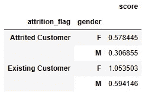

# 提升你的数据操作技能

> 原文：[`towardsdatascience.com/turbocharge-your-data-manipulation-skills-3a26897ad6a`](https://towardsdatascience.com/turbocharge-your-data-manipulation-skills-3a26897ad6a)

## 解锁 pandas `groupby`、`apply` 和 `transform` 的强大功能

[](https://bradley-stephen-shaw.medium.com/?source=post_page-----3a26897ad6a--------------------------------)[](https://towardsdatascience.com/?source=post_page-----3a26897ad6a--------------------------------) [Bradley Stephen Shaw](https://bradley-stephen-shaw.medium.com/?source=post_page-----3a26897ad6a--------------------------------)

·发布于 [Towards Data Science](https://towardsdatascience.com/?source=post_page-----3a26897ad6a--------------------------------) ·阅读时间 11 分钟·2023 年 2 月 21 日

--


图片由 [Kier in Sight](https://unsplash.com/@kierinsight?utm_source=medium&utm_medium=referral) 提供，来源于 [Unsplash](https://unsplash.com/?utm_source=medium&utm_medium=referral)

在一个竞争激烈且数据丰富的世界中，理解分段行为是提供量身定制的洞察和产品服务的关键。

无论是通过描述性统计了解分段趋势，还是通过将分段特征纳入机器学习模型等更细致的方法，都会涉及到一定的数据操作。

幸运的是，pandas 提供了高度多功能的功能，使我们能够轻松应对多种数据分段所需的大量操作。通过一些示例，我们将演示：

1.  `groupby` 操作——它是什么、如何工作以及返回什么。

1.  如何使用 `apply` 与 `groupby` 来应用更复杂和特殊的转换。

1.  使用 `groupby` 和 `transform` 将 `groupby` 和 `apply` 的魔力映射回原始数据形状。

1.  一些我在时间中积累的小贴士和技巧。

让我们开始吧——首先，获取一些可以操作的数据。

# 数据

这次我们将使用从一组消费信用卡¹中收集的信息。

除了列名更改和我应用的一些格式更改之外，数据几乎保持不变——预览如下：


图片由作者提供

我们有各种分类特征（如教育水平）与数值特征（如客户年龄）混合在一起。数据集的宽度超出了上面快照的范围，因此如果下面出现新的和有趣的特征，请不要感到惊讶。

# 分组

首先是 `groupby`。

来自文档²：

> `groupby` 操作涉及将对象拆分、应用函数和合并结果的组合。这可以用来对大量数据进行分组，并对这些组进行计算操作。

这是一个相当好的解释。我也发现将 `groupby` 想象成一种 for 循环的方式很有帮助。

1.  将数据分成不同的组。或者，通过参考给定的分组“规则”来**对数据进行分组**。

1.  对每个组应用指定的函数。这可以是像平均值这样的简单计算，或更为复杂和奇特的计算（稍后会详细讨论）。

1.  汇总结果。

现在可能有点模糊，所以让我们通过几个例子来详细了解。

一个起点 — 确定每种客户类型的平均信用额度，按性别分组：

```py
# average credit limit for customer type x gender
segments = ['attrition_flag','gender']
df.groupby(segments)['credit_limit'].mean().round().to_frame()
```


作者提供的图片

非常简单，柠檬`groupby`。

现在我们暂时忽略信用额度中的性别差异，专注于底层代码。`pandas` 为我们做的是将 DataFrame 分成 `attrition_flag x gender` 组，计算每组的平均 `credit_limit`，并汇总结果。

如果我们想扩展分组以包含教育水平，并且还计算平均信用利用率呢？这并不复杂：

```py
# extended segmentation and feature selection
segments = ['attrition_flag','education_level','gender']
features = ['credit_limit','avg_utilization_ratio']
df.groupby(segments)[features].mean()
```


作者提供的图片

更改应用于每个组的计算也是简单的。例如，如果我们想计算每个分组中的观察次数，可以使用 `size`：

```py
# group counts
segments = ['attrition_flag','gender']
feature = 'customer_age'
df.groupby(segments)[feature].size().to_frame(name = 'group_size')
```


作者提供的图片

这引导我们进入 `groupby` 语句的一个更一般的配方：


作者提供的图片

… 在这里，我们可以根据具体的使用情况定制`segments`、`features` 和 `function`。我故意没有详细说明 `function` 实际上是什么 — 稍后我们会看到原因 — 但这个一般思路在大多数情况下是成立的。

首先，让我们讨论一些事情。

+   到目前为止，我们使用了两个内置的 `pandas` 函数 — `mean` 和 `size` 进行了非常基础的计算。当然，还有许多其他有用的函数可以使用，如中位数和标准差。稍后，我们将看到如何使用更复杂的函数、自定义函数和来自其他包的函数。

+   按照我们使用的 `groupby` 语句返回的对象，其列名与原始 DataFrame 相同。你很可能会遇到数据集看起来相似但信息完全不同的情况 — 不要被迷惑。合理的命名约定或代码结构可以帮助解决这个问题，以及适当地重命名列。

+   到目前为止，我们在多个列上使用了相同的函数。如果你想对不同的列应用不同的函数，或者在同一个 groupby 语句中对相同的列应用不同的函数，我建议你查看 `agg` 功能³。它还提供了一种通过元组定义计算结果名称的巧妙方法。

现在我们对 `groupby` 有了基本的了解，我们可以继续看看如何开始使用更多的高级函数。

看到我刚才做了什么了吗？真有趣。

*专业提示：在 groupby 语句中使用单个特征将返回一个 Series，Jupyter 会将其呈现为一堆数字。* `to_frame` *将 Series 转换为 DataFrame，Jupyter 会以更美观的方式输出。*

# Apply

我们之前看到的“标准”函数只能带我们到这一步——这也是标准函数的真正意义所在。

如果我们需要做任何高级或定制的操作，或者依赖于其他包中的功能，我们需要将 `groupby` 与 `apply` 结合使用。

`apply` 语句相当直观，并且在文档中有简明的描述⁴：

> 在 DataFrame 的一个轴上应用函数。
> 
> 传递给函数的对象是 Series 对象，其索引可以是 DataFrame 的索引（`axis=0`）或 DataFrame 的列（`axis=1`）。

让我们做一些使用定制函数对分组进行操作的例子。

我们将开始做一些不同的计算：通过将组的最大值与组的最小值的比例来缩放组的中位数；我们将对每种类型的客户按性别进行此操作。

```py
# define the bespoke function
def scaled_median(s):
    # calculates Series median x Series maximum / Series minimum

    return s.median() * s.max() / s.min()

# apply it to data
segments = ['attrition_flag','gender']
feature = 'customer_age'
df.groupby(segments)[feature].apply(scaled_median).to_frame(name='result')
```


作者提供的图片

如果你感到特别 Pythonic，可以在 `apply` 语句中使用 lambda 函数。代码示例如下：

```py
apply(lambda u: u.median() * u.max() / u.min())
```

那么，如何将自定义函数应用于多个特征（列）呢？这需要更多的思考——我们用一个例子来演示。

组织有一个启发式方法，用于指示客户对信用优惠的可能接受度。这个启发式方法——我们称之为“胃口评分”——基于婚姻状况、性别、赡养人数以及平均信用利用率。我们希望了解每种客户类型和性别的平均胃口评分。

从代码的角度来看，可以是这样的：

```py
# maps to convert categorical to numeric
status_mapper = {'Married':1.1, 'Single':1, 'Unknown':0.8, 'Divorced':0.9}
gender_mapper = {'F':1.1, 'M':1}

# define the appetite score function
def cohort_score(dataframe):
    score = (
        dataframe['marital_status'].map(status_mapper).astype(int) 
        * dataframe['gender'].map(gender_mapper).astype(int) 
        * (1 + dataframe['dependent_count']) 
        * dataframe['avg_utilization_ratio']
    ).mean()

    return score

# apply
segments = ['attrition_flag','gender']
df.groupby(segments).apply(cohort_score).to_frame(name = 'score')
```

… 这会给出：


作者提供的图片

有几点需要注意。

我们使用字典和 `map` 将婚姻状况和性别转换为数值，以便在启发式方法中进行计算，并记得适当转换数据类型。

我们不会明确选择用于启发式方法的特征。这实际上是一个巧妙的技巧，我之前没有详细提到——我们可以将 `apply` 同时用于 Series 和 DataFrames。在这种情况下，由于我们没有指定使用哪些特征，我们实际上是将分组后的 DataFrame 传递给 `cohort_score` 函数，该函数再进一步过滤出必要的列。

均值的计算已经融入到函数中。现在可以说这有点作弊——在现实生活中，我们可能希望建立一个在个体水平上计算胃口分数的启发式方法，然后从结果中创建组统计数据。这实际上与两个其他概念很好地结合起来：使用来自其他包的函数和使用 lambda 函数。

现在就这样做——定义一个不返回平均值的启发式方法，使用`numpy`计算组平均值，并将其包装在一个 lambda 函数中。

```py
# get numpy
import numpy as np

# define the appetite score function for an individual
def cohort_score(series):
    score = (
        series['marital_status'].map(status_mapper).astype(int) 
        * series['gender'].map(gender_mapper).astype(int) 
        * (1 + series['dependent_count']) 
        * series['avg_utilization_ratio']
    )

    return score

# apply
segments = ['attrition_flag','gender']
d = df.groupby(segments).apply(lambda u: np.mean(cohort_score(u)))
d.to_frame(name = 'score')
```

结果如下：



图片由作者提供

看起来很熟悉吗？确实如此，因为这是与上面的计算完全相同的结果。

一点需要注意的是使用来自其他包的函数有多么简单。在这种情况下，我们使用了`numpy`的均值计算，但概念是相同的——将函数传递给`apply`，并参考其来源的包（当然要记得导入包！）。

# 转换

你现在可能已经注意到，`groupby`返回的是组统计数据，呈现于*组*级别。如果这正是你所需要的——例如，用于可视化或汇总——那就完美了，但也有需要将组结果“映射”回个别观察值的情况。

我相信还有许多其他应用，但这种方法在特征工程中非常有用。假设你在预测房价——了解一个单独的房子与同一邻里的“平均”房子相比有多大，不是很好吗？

幸运的是，pandas 提供了简便的功能，允许我们做到这一点，无需任何连接或合并。这就是 transform 的魔力，尽管文档对此有所低估⁵：

> 对 self 调用`func`生成一个与 self 具有相同轴形状的 DataFrame

也许一个示例会很有用！让我们看看如何再次应用缩放中位数函数，但这次使用 transform 在数据中创建一个新列，将组结果映射回每个单独的观察值：

```py
# get example data
df_example = df[['attrition_flag','gender','customer_age']].copy()

# apply it to data
segments = ['attrition_flag','gender']
feature = 'customer_age'
df_example['scaled_median_age'] = (
    df_example
    .groupby(segments)[feature]
    .transform(scaled_median)
)

df_example
```

结果如下：


图片由作者提供

在这里我们看到相同的组值是如何生成的，但这些值也会映射回大小并包含在 DataFrame 中。

# 提示与技巧

现在我们已经掌握了`groupby`、`apply`和`transform`，让我们看看一些可能有用的提示和技巧。

## `apply`的多才多艺

`apply`函数非常多才多艺。我们已经看到如何在`groupby`操作中应用它，但这并不总是必要的——也就是说，你可以直接在 DataFrame 上使用`apply`。

## 轴与应用

当我开始使用`apply`时，我遇到了（可能超过）我应得的错误信息。大多数时候，这都是因为我没有完全理解函数应用的轴——即我错误地指定了是否将函数应用于行或列。

因此，如果你确定你的函数有效但`pandas`仍然不合作，我建议你查看一下`apply`中的`axis`参数。

## 使用内置函数与 apply

正如我们上面所见，我们可以直接在分组的 DataFrames 上使用内置的`pandas`函数。

我们也可以在`apply`中使用相同的内置函数，不过我们必须通过其名称来引用该函数。例如，使用内置标准差函数可能会是这样的：

```py
segments = ['attrition_flag','gender']
feature = 'customer_age'
df.groupby(segments)[feature].apply('std')
```

正如大多数 Python 相关的事情一样，做事的方法不止一种。然而，像这样在`apply`语句中使用内置函数实际上可能比直接使用它们更*慢*。

## 缺失数据插补

我们之前提到了`apply`和`transform`在特征工程中的有用性。它们在数据清洗中同样有效，特别是当你想要使用分段统计来插补缺失值时。

这是一个例子，展示了我们如何使用客户类型和婚姻状况的中位数客户年龄来插补缺失的客户年龄值。

```py
# example data frame
df_example = df[['attrition_flag','marital_status','customer_age']].copy()

# randomly create missing values
df_example['customer_age'] = np.where(
    np.random.random(size = len(df)) <= 0.5,
    df['customer_age'],
    np.nan
)

# impute using median
df_example['customer_age_imputed'] = (
    df_example
    .groupby(['attrition_flag','marital_status'])['customer_age']
    .transform('median')
)

df_example
```


图片由作者提供

这显然是一个比较牵强的例子，但这种逻辑同样适用于其他用例，尤其是当组相对同质时。

我们暂时就到这里，并做一个简要的回顾。

# 总结

我们已经覆盖了相当多的内容。

首先，我们查看了`groupby`操作——它是什么、如何工作以及它返回什么。

一旦我们习惯了使用基本函数和`groupby`，我们就进一步拓展，结合使用`apply`和`groupby`来使用定制函数。

尽管在组级别进行统计很有用，但我们讨论了为什么我们可能想要将这些组统计映射回每个个体观察值。我们展示了如何使用`groupby`和`transform`来实现这一点。

我还分享了一些我随着时间学到的“技巧和窍门”——希望它们能让你在使用`groupby`、`apply`和`transform`时更顺利。

现在你已经看到了一些示例，我鼓励你自己尝试——实践是完美的关键。

当然，我们可以做一些额外的工作，将我们的分析和展示提升到一个新水平。首先是适当格式化 DataFrames：

[](/make-your-tables-look-glorious-2a5ddbfcc0e5?source=post_page-----3a26897ad6a--------------------------------) ## 让你的表格看起来辉煌

### 使你的 pandas DataFrames 准备好展示的简单格式化技巧

towardsdatascience.com

…第二个是生成准备好展示的图表：

[](/make-your-charts-look-glorious-9ce3fa310b70?source=post_page-----3a26897ad6a--------------------------------) ## 让你的图表看起来辉煌

### 使 matplotlib 图表准备好展示的简单技巧

towardsdatascience.com

一如既往，我希望你和我一样享受阅读这篇文章的过程。也如既往，我很乐意了解新的技巧和窍门，请随时在评论中分享！

# 参考文献和资源

1.  [zhyli. (2020). 预测客户流失的信用卡数据集 [数据集]。Zenodo。](https://doi.org/10.5281/zenodo.4322341)，依据[创意共享 — 署名 4.0 国际](https://creativecommons.org/licenses/by/4.0/legalcode)许可证提供。

1.  [pandas.DataFrame.groupby — pandas 1.5.3 文档 (pydata.org)](https://pandas.pydata.org/docs/reference/api/pandas.DataFrame.groupby.html)

1.  [pandas.DataFrame.agg — pandas 1.5.3 文档 (pydata.org)](https://pandas.pydata.org/docs/reference/api/pandas.DataFrame.agg.html)

1.  [pandas.DataFrame.apply — pandas 1.5.3 文档 (pydata.org)](https://pandas.pydata.org/docs/reference/api/pandas.DataFrame.apply.html)

1.  [pandas.DataFrame.transform — pandas 1.5.3 文档 (pydata.org)](https://pandas.pydata.org/docs/reference/api/pandas.DataFrame.transform.html)
