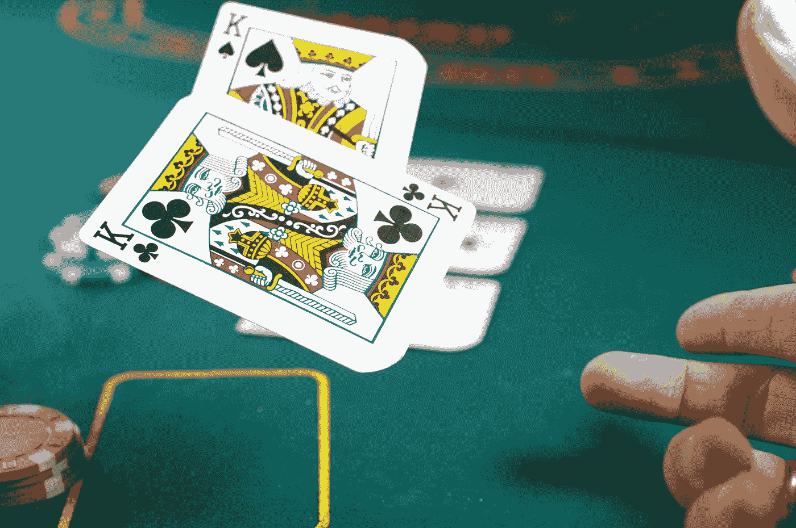

# 将 GPT-4 转变为扑克教练

> 原文：[`towardsdatascience.com/turn-gpt-4-into-a-poker-coach-4a28ba5e9541?source=collection_archive---------2-----------------------#2023-05-05`](https://towardsdatascience.com/turn-gpt-4-into-a-poker-coach-4a28ba5e9541?source=collection_archive---------2-----------------------#2023-05-05)

## 超越聊天机器人界限释放创造力

 [Jacky Kaub](https://medium.com/@jacky.kaub?source=post_page-----4a28ba5e9541--------------------------------)

·

[关注](https://medium.com/m/signin?actionUrl=https%3A%2F%2Fmedium.com%2F_%2Fsubscribe%2Fuser%2F7ccb7065ef90&operation=register&redirect=https%3A%2F%2Ftowardsdatascience.com%2Fturn-gpt-4-into-a-poker-coach-4a28ba5e9541&user=Jacky+Kaub&userId=7ccb7065ef90&source=post_page-7ccb7065ef90----4a28ba5e9541---------------------post_header-----------) 发表在 [Towards Data Science](https://towardsdatascience.com/?source=post_page-----4a28ba5e9541--------------------------------) · 13 分钟阅读 · 2023 年 5 月 5 日 

--

图片由 [Michał Parzuchowski](https://unsplash.com/@mparzuchowski?utm_source=medium&utm_medium=referral) 提供，发布在 [Unsplash](https://unsplash.com/?utm_source=medium&utm_medium=referral)

在本文中，我们不会讨论 LLM 模型如何通过法律考试或替代开发人员。

我们不会讨论如何优化提示以使 GPT 生成动机信或营销内容。

和许多人一样，我认为像 GPT-4 这样的 LLM 的出现是一场小型的革命，将会涌现出许多新应用。我还认为，我们不应将其使用局限于简单的“聊天机器人助手”，而是通过适当的后端和用户体验，这些模型可以被用于令人难以置信的下一代应用。

这就是为什么在这篇文章中，我们将跳出思维框架，围绕 GPT API 创建一个真实的应用程序，该应用程序无法仅通过聊天机器人接口访问，以及如何通过合理的应用设计提供更好的用户体验。

# 设置一些背景

## 在商业中利用 GPT-4

自 GPT-4 发布以来，我进行了大量的测试，我认为全球范围内主要有两大类使用场景来生成业务。

第一种方式是使用 GPT-4 生成静态内容。比如你想写一本有特定主题的烹饪书（例如…
