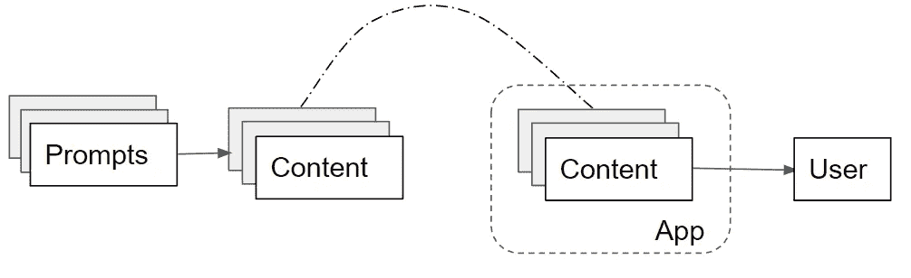
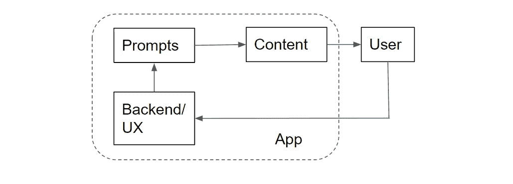
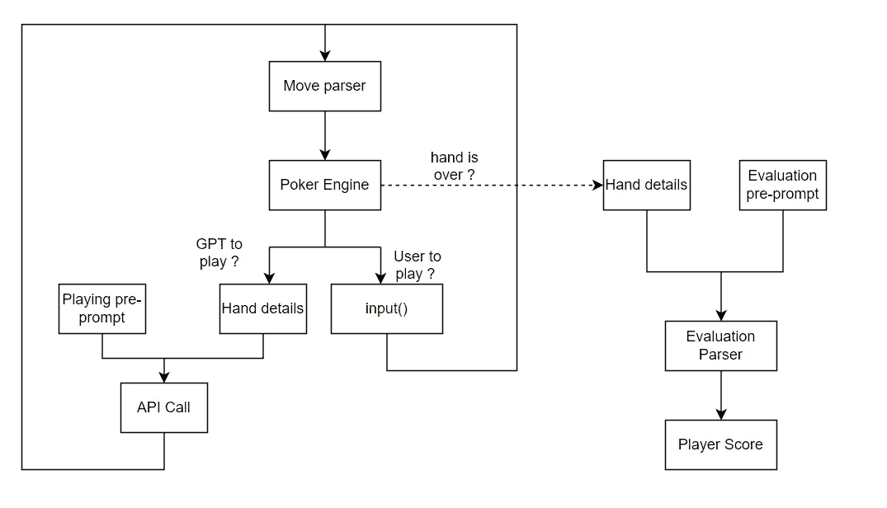
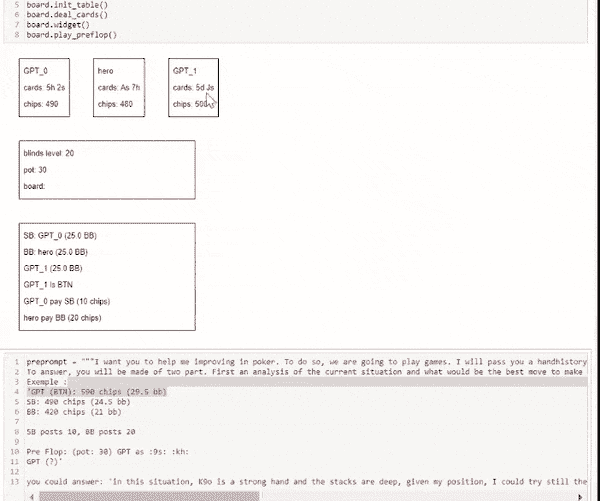

# 将 GPT-4 转变为扑克教练

> 原文：[`towardsdatascience.com/turn-gpt-4-into-a-poker-coach-4a28ba5e9541`](https://towardsdatascience.com/turn-gpt-4-into-a-poker-coach-4a28ba5e9541)

## 超越聊天机器人界限的创造力释放

[](https://medium.com/@jacky.kaub?source=post_page-----4a28ba5e9541--------------------------------)[](https://towardsdatascience.com/?source=post_page-----4a28ba5e9541--------------------------------) [Jacky Kaub](https://medium.com/@jacky.kaub?source=post_page-----4a28ba5e9541--------------------------------)

·发表于 [Towards Data Science](https://towardsdatascience.com/?source=post_page-----4a28ba5e9541--------------------------------) ·阅读时长 13 分钟·2023 年 5 月 5 日

--


照片由 [Michał Parzuchowski](https://unsplash.com/@mparzuchowski?utm_source=medium&utm_medium=referral) 提供，刊登在 [Unsplash](https://unsplash.com/?utm_source=medium&utm_medium=referral)

在这篇文章中，我们不会讨论 LLM 模型如何通过法律考试或替代开发人员。

我们不会讨论如何优化提示以使 GPT 生成动机信或营销内容。

和许多人一样，我认为像 GPT4 这样的 LLM 的出现是一场小小的革命，将会涌现出许多新应用。我还认为我们不应该将其使用仅限于简单的“聊天机器人助手”，而是通过适当的后端和用户体验，这些模型可以被用来实现令人惊叹的下一层应用。

这就是为什么在本文中，我们将稍微跳出框框，围绕 GPT API 创建一个真正的应用程序，而这些 API 不能仅通过聊天机器人接口访问，以及如何通过适当的应用程序设计提供更好的用户体验。

# 设置一些背景

## 在商业中利用 GPT4

自发布以来，我玩了很多 GPT4，我认为使用该模型生成业务的主要用例大致分为两类。

第一种方式是使用 GPT4 生成静态内容。假设你想写一本关于特定主题（例如意大利食物）的烹饪书。你可以做详细的提示，从 GPT 生成一些食谱，自己试用，然后将你喜欢的食谱整合到你的书中。在这种情况下，“提示”将有一个固定成本，一旦食谱生成后，你就不再需要 GPT。这种用例可以有很多变体（营销内容、网站内容，甚至生成其他用途的数据集），但如果我们想专注于 AI 导向的应用程序，它就不那么有趣了。



生成内容的逻辑在应用程序之外，作者插图

第二个用例是通过你设计的界面进行实时提示。回到烹饪领域：我们可以想象一个合适的界面，用户可以选择一些食材、一个特色菜，并要求应用程序直接生成食谱。与第一个案例不同，生成的内容可能是无限的，更好地满足用户的需求。



在这种情况下，用户通过精心设计的用户体验直接与 LLM 互动，这将生成提示和内容，作者插图。

缺点是，LLM 的调用次数可能是无限的，并随着用户数量的增加而增长，与之前 LLM 调用次数有限且可控的情况不同。这意味着你必须妥善设计你的商业模式，并在商业模式中仔细考虑提示费用。

在我写这些文字时，GPT4 的“提示”费用为 0.03$/1000 tokens（包括请求和回答的 tokens）。这看起来不多，但如果不加注意，费用可能会迅速增加。为了解决这个问题，你可以例如根据提示的数量向用户提供订阅服务，或者限制每个用户的提示数量（通过登录系统等）。我们将在本文后面详细讨论定价问题。

## 为什么围绕扑克构建一个用例？

我考虑了很长时间寻找完美的 LLM 用例。

首先，扑克分析理论上是 LLM 表现良好的领域。实际上，每一手扑克都可以被转换为标准化的简单文本，描述手牌的演变。例如，下面的手牌描述了一个序列，其中“player1”在“flop”动作后对“player2”的下注进行了加注，从而赢得了底池。

```py
Seat 2: player1(€5.17 in chips) 
Seat 3: player3(€5 in chips) 
Seat 4: player2(€5 in chips) 
player1: posts small blind €0.02
player2: posts big blind €0.05
*** HOLE CARDS ***
Dealt to player2[4s 4c]
player2: raises €0.10 to €0.15
player1: calls €0.13
player3: folds 
*** FLOP *** [Th 7h Td]
player1: checks 
player2: bets €0.20
player1: raises €0.30 to €0.50
player2: folds 
Uncalled bet (€0.30) returned to player1
player1collected €0.71 from pot
```

这种标准化很重要，因为它会使开发变得更加简单。我们将能够模拟手牌，将其转换为这种提示消息，并“强制”LLM 的回答继续序列。

许多理论内容可以在书籍、网上等地方找到……这使得 GPT 有可能“学习”到有关游戏和良好策略的知识。

此外，很多附加价值将来自于应用引擎和用户体验，而不仅仅是 LLM 本身（例如，我们需要设计自己的扑克引擎来模拟游戏），这将使得应用程序更难以复制，或者仅仅通过 GPTChat“再现”。

最终，这种用例可能很好地适应上述第二种情况，其中 LLM 和良好的用户体验可以为用户带来全新的体验。我们可以设想我们的应用程序再次与真实用户进行对战，分析手牌并提供评分和改进领域。每次请求的费用不应该成为问题，因为扑克学习者习惯于为这种服务付费，所以在这个特定用例中，可能会采用“按使用付费”的模式（例如与之前提到的食谱应用程序不同）。

## 关于 GPT4 API

我决定围绕[GPT4 API](https://openai.com/product/gpt-4)来构建这篇文章，因为它与 GPT3.5 相比更为精准。OpenAI 提供了一个简单的 Python 包装器，可以用来发送输入并从模型中接收输出。例如：

```py
import openai
openai.api_key = os.environ['OPENAI_KEY']

completion = openai.ChatCompletion.create(
  model="gpt-4",
  messages=[{"role": "system", "content": preprompt_message}, 
            {"role": "user", "content": user_message}]
)

completion.choices[0].message["content"]
```

使用“系统”角色的“预提示”将帮助模型按你希望的方式行动（你可以使用它来强制执行响应格式），角色“用户”用于添加用户的消息。在我们的案例中，这些消息将由我们的引擎预先设计，例如，传递特定的扑克手牌以完成。

请注意，“系统”、“用户”和答案中的所有令牌都计入价格方案，因此优化这些查询至关重要。

# 初步探索

首先要评估的是 GPT 在与扑克相关的不同任务中的总体质量。我希望快速评估其完成应用程序核心任务的能力。

## 继续进行手牌并提供现实的行动和解释

应用程序的核心理念之一将是让一个或多个 GPT 实例与用户对战。我们想要评估 GPT 的表现如何。为此，我提供了我打过的牌局样本，并希望获得关于下一步行动及其解释的分析。

测试示例：

```py
preprompt = """You are my poker coach, I want you to play the next move and 
justify simply your action based on your expertise"""

message = """Stacks:
UTG ($54.93) 110bb
UTG+1 ($55.87) 112bb
CO ($61.62) 123bb
BTN ($60.96) 122bb
SB ($25.54) 51bb
BB Hero ($61.50) 123bb

Pre-Flop: (0.75, 6 players) Hero is BB :jc: :jd:
2 folds, CO raises to $1.50, BT raises to $6, 1 fold, 
Hero raises to $14, CO folds, BT calls $8
Flop: :3s: :2h: :tc: ($29.75, 2 players)
Hero bets $7.50, BT calls $7.50

Turn: :5h: ($44.75, 2)
Hero (?)
"""

completion = openai.ChatCompletion.create(
  model="gpt-4",
  messages=[{"role": "system", "content": preprompt}, 
            {"role": "user", "content": message}]
)
```

答案是：

```py
Hero should bet around $22.

Justification:
Our pocket Jacks have improved to top set on the flop, which is a great 
advantage for us. With the current board texture, we need to continue 
building the pot to extract value from hands like smaller pairs, 
flush draws, or straight draws. The turn 5h doesn't 
change much about the board, so we should capitalize on our strong hand 
by betting around $22 (around half pot). 
This will put pressure on our opponent and potentially make them commit 
with worse hands if they decide to call or raise.
```

我进行了几次这样的测试，验证了模型能够合理地进行游戏。

有趣的是，通过修改预提示，我可以控制模型的行为，让它变得更具攻击性或更为保守。

```py
You are a very tight player who tend to under-evaluate 
the strengh of your hand
```

对于相同的动作，会导致 AI 采取不同的行动：

```py
Action: Hero checks.

Justification: Based on my tight playing style and under-evaluation of my hand 
strength tendency, I will check in this situation. 
By checking, I can control the pot size and potentially induce a bet from BT 
if they have a weaker hand. At the same time, 
I can also minimize my losses if BT has a stronger hand. 
Considering the board is relatively low and it doesn't have a lot of 
threatening draws, the check allows me to proceed cautiously but still 
have a chance to win the hand later.
```

这意味着我们可以潜在地编写不同风格的“AI”代码，以模拟具有不同水平和风格的玩家的真实扑克场景。

## 从完整手牌历史记录中对玩家的动作进行评分

我们可能想要集成到应用程序中的一个功能是能够对用户进行评分。评分始终是进步的良好指标，或者在学习某项技能时针对特定弱点的有效方法。

为了让我们的应用程序正确处理这些信息，我们必须“强制”机器人的回答，以便可以简单地解析并在应用程序中使用（例如对会话或主题进行平均）。

例如，以下提示组合：

```py
Preprompt:
You are a poker coach. I will provide you a hand. 
I want you to identify for a given hand key thematics
and rate the relevant thematics /20\. 
The thematics you can use are the following:
"preflop","flop","turn","river","aggressivity","sizing", "overall"
You can use one or several of these thematic during your 
evaluation depending on what is relevant. 
I expect your output to have the following format:
"theme1: X - theme2: Y - ..."

Message:
Stacks:
UTG ($54.93) 110bb
UTG+1 ($55.87) 112bb
CO ($61.62) 123bb
BTN ($60.96) 122bb
SB ($25.54) 51bb
BB Hero ($61.50) 123bb

Pre-Flop: (0.75, 6 players) Hero is BB :jc: :jd:
2 folds, CO raises to $1.50, BT raises to $6, 1 fold, Hero raises to $14, CO folds, BT calls $8
Flop: :3s: :2h: :tc: ($29.75, 2 players)

Hero bets $7.50, BT calls $7.50

Turn: :5h: ($44.75, 2)
Hero bets $9, BT calls $9 River: :9c: ($62.75, 2)

Hero checks, BT goes all-in $30.46, Hero calls $30.46
```

将生成以下输出：

```py
'preflop: 18 - flop: 16 - turn: 14 - river: 13 - aggressivity: 15 - sizing: 12 - overall: 15'
```

这有两个好处：

+   我们可以控制模型显示的令牌数量

+   我们可以轻松地将答案解析成字典，以便我们的应用程序使用

# 将想法转化为具体应用

在验证上述两点后，是时候编写更大的代码来演示整个概念，并查看 LLM 如何集成到一个更大的应用程序中，这与简单的聊天机器人不同。

在本文的背景下，我们将使用相当简单的东西，但它应当能给你一个关于 LLMs 在开箱即用时所有能力的提示。

我们的演示目标是让 GPT 与我们进行牌局，然后，在牌局完全进行后，要求模型根据这局牌仅给出一些改进的提示。

为此，我快速编写了一个简单的扑克引擎，帮助模拟牌局并与 AI 对手对战。我不会在这里详细讨论引擎（这不是本文的重点），而是简单介绍其设计概况。



扑克教练概念验证示意图

扑克引擎的作用是跟踪游戏的总体元数据（玩家数量、筹码、发牌、玩家回合……）。下一个动作（无论是玩家还是 AI）作为标准文本消息如“call”、“fold”或“raise 60”等添加到引擎中，然后解析并转录为引擎运行下一步的新输入。

扑克引擎还将动作序列转录为文本文件，这些文件用于供 AI 使用以决定下一个动作。

将使用两个预提示：一个用于决定下一个动作，另一个用于牌局结束时评价人类玩家的动作。

## 进行牌局

为了让我们的应用程序理解 GPT 的动作，我们需要确保 GPT 的消息是标准化的。这可以通过预提示来实现。在我的情况下，我期望 GPT 用最多两个词“动作 数量”来回答我，并通过提供一个示例模型来强制这一行为，模型会根据这个简单的玩法预提示进行适应：

```py
 I want you to help me improve in poker by playing games.
Use only keywords 'fold', 'call', 'bet', 'check', or 'raise' 
with chip amounts.

Example:
'**hand details**
GPT (?)'

Answer: 'raise 40'
```

我将把这个预提示与扑克引擎生成的实际牌局历史结合起来：

```py
GPT_0 has [Ts, 9s]
SB: hero (25.0 BB)
BB: GPT_0 (25.0 BB)
hero is BTN
hero pay SB (10 chips)
GPT_0 pay BB (20 chips)
hero: raise 50
GPT_0 (?)
```

这会导致一个合适的答案，可以解析并整合到扑克引擎中，以更新游戏并继续下一个动作：

```py
call 50
```

## 应用程序实际运行中

放在快照中，它可能看起来不那么令人印象深刻，所以我录制了一个关于 AI 在笔记本中运行的小视频。在视频中，我还要求模型在采取行动前解释其动作。所有玩家的牌在调试用的小工具中可见，但在实际条件下，它们会对玩家隐藏。当 AI 采取行动时，仅其自己的牌会传递给提示。

我的消息解析器简单地处理“//”分隔符后的操作，我使用了 input()函数来记录用户输入。



GPT 与我对战的一手扑克，作者插图

## 手动审核

一旦头部完成，系统就会生成整个手牌，然后可以传递给我们的“评估模块”，在这里，LLM 将对手牌进行评分。

```py
hero has [5c Qs]
SB: hero (500 chips)
BB: GPT_0 (500 chips)
hero is BTN
hero pay SB (10 chips)
GPT_0 pay BB (20 chips)
hero: raise 50
GPT_0: call 50
FLOP
POT:100.0
BOARD: [7c 6d Kc]
hero: bet 100
GPT_0: call 100
TURN
POT:200.0
BOARD: [7c 6d Kc 3d]
hero: bet 200
GPT_0: fold
```

使用先前设计的提示，我们可以得到如下类型的答案，这些答案易于解析：

```py
preflop: 14 - flop: 12 - turn: 15 - aggressivity: 16 - sizing: 13 - overall: 14
```

这些输出可以轻松解析，并将数据存储在数据库中，从中我们可以提取所有类型的分析，例如根据模型提供的平均评分识别手牌、位置、配置等方面的弱点。

# 结论

在这一点上，我们通过一个示例证明了以 LLM 为中心的新概念可以在与合适的应用设计结合时出现，这些设计偏离了简单的聊天机器人助手。

当然，上述示例只是众多步骤中的第一步，才能有一个完全准备好的应用程序，但它应该足以引发思考和创造力。

对于开发一个真正的扑克教练应用程序的下一步，我们需要采取几个行动：

+   提示令牌优化：我们应用程序的大部分成本将来自提示定价。优化提示的数量对于降低成本和保持竞争力至关重要。

+   提示内容优化：输出（评分、下一步行动）的质量可能会因你提供给模型的上下文而有所不同。例如，让模型在采取行动之前先进行分析可以显著提高行动的一致性。与真实玩家进行的许多测试和迭代是必需的，以确保输出质量足以满足生产级应用程序的要求。

+   错误处理：即使 LLM 提供的输出大多数情况下符合你的模板，处理模型提供的不符合你的解析器的答案的情况也很重要。与所有功能不同，这部分应用可能会保持不可预测，因此添加额外的控制层以确保由于格式错误或无法回答的问题不会出现错误是很重要的。

+   用户界面：虽然在笔记本中使用文本输入进行探索足以满足本文的需求，但核心元素应该是一个清晰的用户体验，以提升用户体验并使与模型和引擎的交互顺畅。

虽然这类应用程序的价格可能仍然很高，但我相信大规模采用和未来的改进将趋向于降低成本。我们只是这些新技术发展的开始，创造性地利用 LLMs 的潜力，将其转变为超越传统聊天机器人局限性的强大工具，以提供创新和以用户为中心的体验。
