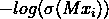
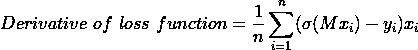

# 将线性回归转变为逻辑回归

> 原文：[`towardsdatascience.com/turn-linear-regression-into-logistic-regression-e088e2408ec9`](https://towardsdatascience.com/turn-linear-regression-into-logistic-regression-e088e2408ec9)

## 关于如何从头实现逻辑回归的全面指南

 [Md. Zubair](https://zubairhossain.medium.com/?source=post_page-----e088e2408ec9--------------------------------)

·发表于 [Towards Data Science](https://towardsdatascience.com/?source=post_page-----e088e2408ec9--------------------------------) ·阅读时间 10 分钟·2023 年 3 月 27 日

--

图片由 [Rutger Leistra](https://unsplash.com/ko/@rutgerleistra?utm_source=medium&utm_medium=referral) 提供，来自 [Unsplash](https://unsplash.com/?utm_source=medium&utm_medium=referral)

## 动机

如果你阅读了我之前关于[*简单线性回归*](https://medium.com/towards-data-science/deep-understanding-of-simple-linear-regression-3776afe34473)和[*多重线性回归*](https://medium.com/towards-data-science/multiple-linear-regression-a-deep-dive-f104c8ede236)的文章，你会了解到线性回归预测的是连续值。但是并非所有现实中的预测问题都与连续值相关。有时我们需要根据特征对对象或数据进行分类。线性回归算法无法解决这些问题。在这种情况下，逻辑回归的必要性就体现出来了。算法的名称‘**逻辑回归**’中包含了**‘回归’**一词。它是线性回归的改进版本，以便可以预测离散类别值而不是连续值。

`因此，本文将解释逻辑回归如何生成从线性回归派生的类别预测值。`

## 目录

1.  `**是什么让线性回归变成逻辑回归？**`

1.  `**哪个函数起关键作用？**`

1.  `**线性回归如何转变为逻辑回归？**`

1.  `**生成损失函数**`

1.  `**为什么不能使用均方误差作为成本函数？**`

1.  `**用于参数优化的梯度下降**`

1.  `**将所有概念结合起来进行 Python 从头实现**`

## 什么让线性回归变成逻辑回归？

我会带来我之前文章中提到的两个方程，[*简单线性回归*](https://medium.com/towards-data-science/deep-understanding-of-simple-linear-regression-3776afe34473) 和 [*多重线性回归*](https://medium.com/towards-data-science/multiple-linear-regression-a-deep-dive-f104c8ede236)。

第一个是简单线性回归的方程。

我们将通过插入自变量 `(x)` 的值来获得预测的回归值 `(y)`。但我们需要拟合系数斜率`(m)` 和 y 截距值 `c`。

第二个方程式类似于第一个方程，但存在多个自变量 `*(x1……..xn)*`*，系数 m* `*(m1…….m0)*`，以及 y 轴截距 `m0`。

对于***第 1 个和第 2 个***方程，如果我们有系数的最佳拟合值，我们可以轻松得到回归值，例如 34，687.93 等等。

但这并不能给我们将连续值转化为离散分类值的直观感受。因此，我们需要一个函数或方法，通过它可以将所有回归值转换为 `**[0,1]**` 之间的值。在逻辑回归中，我们正是这样做的。我将在下一节中讨论这个函数。

## 哪个函数起着关键作用？

我不会直接提到函数，而是会逐步解释。 *让我们尝试直观了解线性回归和逻辑回归的效果。*

回归模型图（图片由作者提供）

看一下上述回归模型图。对角线上的蓝色线是回归线。我们可以通过插入 `***x***` 值来预测任何 `***y***` 值。尝试制定一个逻辑回归问题。

图片由作者提供

上述数据集有一个特征，**‘年龄’，** 基于该特征定义目标类别。值 **1** 表示该人是学生，**0** 表示该人不是学生。用线性回归预测这样的分类值是不可能的。 ***如果我们绘制它，会是什么样子呢？让我们看看。***

图片由作者提供

星星表示类别的水平（学生与否）。简单地说，回归线并不是预测分类值的合适方法。

在这里，**‘S 形’** 函数，名为 ‘‘**sigmoid**’’ 发挥了作用。

这个函数可以将任何数字转换到 `*[0,1]*` 之间。我将给你展示一个 sigmoid 函数的编码示例。

***创建一个 sigmoid 函数***

***绘制 sigmoid 图***

这个 **S 形** 的 sigmoid 图形比直线更适合分类问题。随着 **x** 的增加，**y** 值从 ***0 到 1*** 变化，当 ***x=0，y=0.5***。这是一个很好的函数，我们可以轻松设置一个阈值，例如 0.5。所有大于阈值（0.5）的值将为 1，否则为 0。

*是的！终于，我们找到了合适的函数。*

## 线性回归如何转变为逻辑回归？

现在，我们具备了将线性回归转换为逻辑回归的所有条件。让我们把它们放在一起。

在 **第一部分**，我展示了简单线性回归和多重线性回归的方程。线性回归的值是连续的，可以是任何连续的数值。

但 sigmoid 函数帮助我们产生诸如 ***0* 和 *1*** 的分类值，如 **最后一部分** 所示。

因此，逻辑回归的方程将如下所示。

符号 **σ** 代表 sigmoid 函数。如果我们将方程的输出传入 sigmoid 函数，我们将得到从 ***0 到 1*** 的结果。

现在，我们可以通过手动相乘和相加来计算线性方程的值。

但手动过程很耗时。向量化实现要快得多且容易。让我们制定线性方程，使其与向量化实现兼容。

我们添加了一个额外的常数变量 `***xi0=1***`***。***

矩阵实现线性方程计算（图片来自作者）

**X** 包含所有自变量的值，**M** 的转置代表所有系数的转置矩阵。

**向量化逻辑回归方程**

向量化的逻辑回归实现将是这样的。

它会将线性方程的值转换到 0 到 1 之间。下面是一个 Python 函数。

用演示值测试函数。

是的！我们已经成功创建了这个函数。

## 生成一个损失函数

如果我们回顾之前的 [**多重线性回归**](https://medium.com/towards-data-science/multiple-linear-regression-a-deep-dive-f104c8ede236) 文章，我们会发现 **均方误差 (MSE)** 作为代价函数。

但我们知道逻辑回归不是回归算法。相反，它是一个二分类（两个类别）算法。在逻辑回归中，有两个类别，**1** 和 **0**。因此，**MSE** 不是用于逻辑回归的合适代价函数。`*(但为什么？我稍后会解释具体原因)*`

现在，我将介绍一个新的成本函数用于这个分类算法。

上述成本函数适用于逻辑回归。

让我们尝试对成本函数有一些直观的了解。对于`**yi = 1**`，成本函数为——

这个函数看起来如何？让我们绘制这个函数。

上述图是`yi=1`时损失函数的图形表示。图表显示，预测值越接近**1**，误差越小。当预测值为 0.0 时，误差是无限的。

*让我们绘制* `***y0=1***`*的成本函数。*

对于`yi=0`，当预测值接近`**1**`时，误差是无限的，通过减小值来减少误差。现在，我们将绘制两个图形的结合。

现在，图形表示更加直观。如果我们将`**yi=0 和 yi=1**`的损失函数结合起来，我们将得到一个适合应用梯度下降的函数，它具有全局最小值。

如果我们将目标值`***yi=1*** *或* ***yi=0***`代入上述方程，其中一部分将被取消，结果将是我提到的相同方程。这就是我们需要的。

***将成本函数转换为代码。***

## **为什么不能使用均方误差（MSE）作为成本函数？**

在逻辑回归中，目标或输出值是离散的或分类的。它不像回归问题中的连续值。如果我们将值代入**均方误差（MSE）**成本函数（*我们用于线性回归和多重线性回归的成本函数*），我们将得到如下图形，而不是一个凸曲线。

多局部最小值的成本函数（图片由作者提供）

由于这种类型的曲线包含多个局部最小值，我们在成本函数中应用梯度下降时会遇到麻烦。这就是为什么我们在逻辑回归中不会使用均方误差（MSE）作为成本函数的原因。

## 参数优化的梯度下降

梯度下降是一种通过优化机器学习算法的系数来最小化损失/成本函数的方法，这取决于成本函数的形状。

梯度下降（图片由作者提供）

成本函数是一个**凸**曲线，如**损失函数**部分所示。现在，我们需要计算成本函数的导数。导数表示成本在什么方向上发生变化。

首先，我们将随机初始化系数的权重并逐步更新权重。主要目标是找到如上图所示的最小成本。

*成本函数的导数为——*

*[注：如果展示导数的详细计算，文章会变得不必要地长。请阅读* [***文章***](https://medium.com/analytics-vidhya/derivative-of-log-loss-function-for-logistic-regression-9b832f025c2d) *以获得详细解释。]*

*矢量化实现如下。*

`***X***`是所有特征值的矩阵形式，`**M**`代表系数的矢量化形式，`**Y**`表示目标值的矢量化表示。

*矢量化梯度下降实现的代码。*

*我们已经迈出了实现最终模型的一步。所有功能都已准备好进行逻辑回归。在下一步中，我们将结合所有工具，实施完整的算法。*

## 将所有概念结合起来进行 Python 从零实现

首先加载泰坦尼克号数据集。 [**数据集是公开的** **可用的**](https://www.kaggle.com/datasets/brendan45774/test-file) 并且在公共领域许可下。

+   **导入必要的库**

`*[我们的主要目标是展示算法的基本机制。因此，我们保持了简单易懂的预处理。我们将重点放在核心实现上，而不是数据分析。]*`

*为了方便，我们选择了一些特征——*

+   **让我们对选择的特征进行一些深入了解。**

特征`‘Age’`和`‘Fare’`有一些缺失值。我们将用平均值填补这些缺失值，并将`‘Sex’`中的**男性**映射为**1**，*女性*映射为**0**。

现在，所有特征都是数值型的，没有缺失值。

+   **提取自变量（x）和因变量（y）**

+   **规范化数据，以提高梯度下降的性能**

+   **拆分训练集和测试集**

保留了 25%的数据用于测试，其余数据用于训练。现在，我们将数据输入到我们的初步模型中。

+   **将所有功能结合在一起进行逻辑回归**

+   **用训练数据拟合模型**

+   **查看模型系数如何优化**

+   **创建预测函数**

在这里，我使用了*0.5*的阈值来分类数据。所有低于*0.5*的结果被视为类*0*，等于或高于*0.5*的结果被视为类*1*。

+   **让我们将模型与基准 scikit-learn 库进行比较**

*使用 scikit-learn 创建逻辑回归模型*

*在测试数据上的预测*

+   **scikit-learn 模型与我们初步模型的结果对比**

**👉我们初步模型的结果**

*混淆矩阵*

*精确度、召回率和 f1-score*

**👉scikit-learn 模型的结果**

*混淆矩阵*

*精确度、召回率和 f1-score*

结果显示，我们的初步模型和 scikit-learn 模型具有相同的结果。因此，我们声称我们的初步模型与 scikit-learn 模型相同。

## 结论

现在，一些内置库使得机器学习模型的实现变得非常简单。因此，学习核心机制可能对你来说并不必要。作为研究人员和学者，我总是从不同的角度考虑这个问题。如果你了解算法的核心概念，这将对你在核心层面的工作，如算法的研究、开发和优化等非常有帮助。你可以在那些没有机器学习库的编程语言中实现这些概念。

`[***完整的笔记本和数据集可在仓库中获取***](https://github.com/Zubair063/ML_articles/tree/main/Logistic%20Regression%20from%20Scratch)***.***`

## 参考文献

1.  [从头开始的逻辑回归 — Philipp Muens](https://philippmuens.com/logistic-regression-from-scratch)

1.  Andrew Ng 的机器学习课程

`我之前的**从头开始的算法**系列文章。`

[## 多重线性回归：深入探讨](https://towardsdatascience.com/multiple-linear-regression-a-deep-dive-f104c8ede236?source=post_page-----e088e2408ec9--------------------------------)

### 从零开始的多重线性回归：深入理解

[## 简单线性回归的深入理解](https://towardsdatascience.com/deep-understanding-of-simple-linear-regression-3776afe34473?source=post_page-----e088e2408ec9--------------------------------)

### 从零开始的线性回归：详细解释

[KNN 算法从零开始](https://towardsdatascience.com/deep-understanding-of-simple-linear-regression-3776afe34473?source=post_page-----e088e2408ec9--------------------------------) [## KNN 算法从零开始

### KNN 算法的实现和详细解释

[K-means 从零开始](https://towardsdatascience.com/knn-algorithm-from-scratch-37febe0c15b3?source=post_page-----e088e2408ec9--------------------------------) [## K-means 从零开始

### K-means：聚类数据的最佳 ML 算法

[## 无监督学习和 K-means 聚类从零开始](https://towardsdatascience.com/unsupervised-learning-and-k-means-clustering-from-scratch-f4e5e9947c39?source=post_page-----e088e2408ec9--------------------------------)

`**统计和数据可视化** 数据科学系列。`

[**数据科学的终极统计指南**](https://towardsdatascience.com/ultimate-guide-to-statistics-for-data-science-a3d8f1fd69a7?source=post_page-----e088e2408ec9--------------------------------) [## 数据科学的终极统计指南

### 数据科学的一瞥：标准指南

[数据科学终极统计指南](https://towardsdatascience.com/ultimate-guide-to-statistics-for-data-science-a3d8f1fd69a7?source=post_page-----e088e2408ec9--------------------------------)  [## 数据科学数据可视化终极指南

### 数据科学中的数据可视化概述：标准指南

[数据驱动投资者](https://medium.datadriveninvestor.com/ultimate-guide-to-data-visualization-for-data-science-90b0b13e72ab?source=post_page-----e088e2408ec9--------------------------------)
