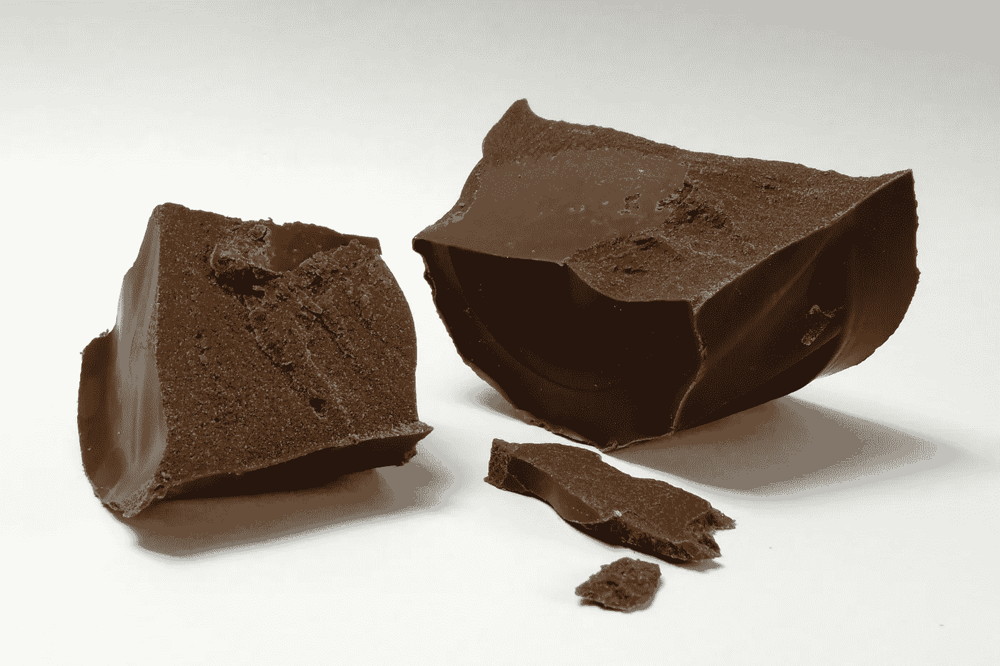

# 将洞察转化为可操作的成果

> 原文：[`towardsdatascience.com/turning-insights-into-actionable-outcomes-f7b2a638fa52?source=collection_archive---------4-----------------------#2023-08-19`](https://towardsdatascience.com/turning-insights-into-actionable-outcomes-f7b2a638fa52?source=collection_archive---------4-----------------------#2023-08-19)

## 解锁秘密配方。

 [Michal Szudejko](https://medium.com/@michalszudejko?source=post_page-----f7b2a638fa52--------------------------------)

·

[关注](https://medium.com/m/signin?actionUrl=https%3A%2F%2Fmedium.com%2F_%2Fsubscribe%2Fuser%2Fd3b37fc311f7&operation=register&redirect=https%3A%2F%2Ftowardsdatascience.com%2Fturning-insights-into-actionable-outcomes-f7b2a638fa52&user=Michal+Szudejko&userId=d3b37fc311f7&source=post_page-d3b37fc311f7----f7b2a638fa52---------------------post_header-----------) 发表在 [Towards Data Science](https://towardsdatascience.com/?source=post_page-----f7b2a638fa52--------------------------------) · 9 分钟阅读 · 2023 年 8 月 19 日 

--

**查看下面的图片。你认为它描绘的是什么？**

如果你认为这张图片描绘的是一块美味的巧克力，那你就错了。

[图片来源 SKopp, CC BY-SA 3.0](https://commons.wikimedia.org/w/index.php?curid=30280314)

这里展示的是**复合巧克力**，它是可可、植物脂肪和甜味剂的混合物。由于其成分较便宜，它是正宗巧克力的经济替代品。你可以在实惠的巧克力棒或糖果涂层中找到它。这种巧克力在我生活的波兰具有特定的记忆。由于 1980 年代关键成分短缺，它取代了正宗巧克力。

**这种产品通常含有不超过 7%的可可** [1]。相比之下，真正的巧克力可可含量至少为 35%（典型的苦巧克力为 70%）[2]。**差异很大，不是吗？**

在我最近的文章《[从数据到行动：让数据为企业服务](https://medium.com/towards-data-science/from-numbers-to-actions-making-data-work-for-companies-162183c13998)》中，我探讨了各种问题，包括洞察的本质。许多所谓的洞察类似于复合巧克力。乍一看，这些所谓的洞察可能显得很真实。但就像那块复合巧克力一样，当你仔细观察或“品尝”它们时，它们并没有那么令人满意。
