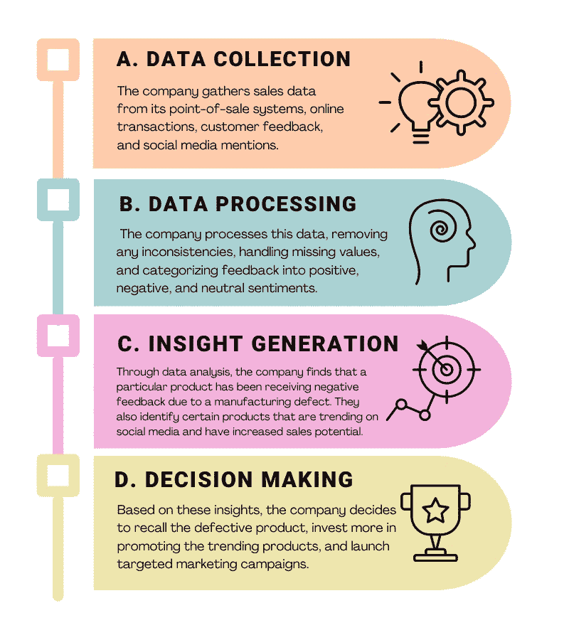
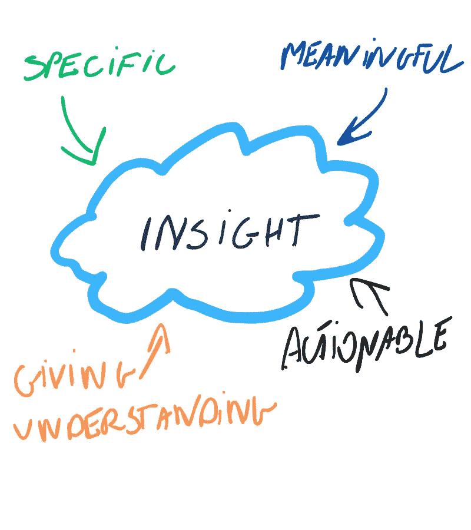
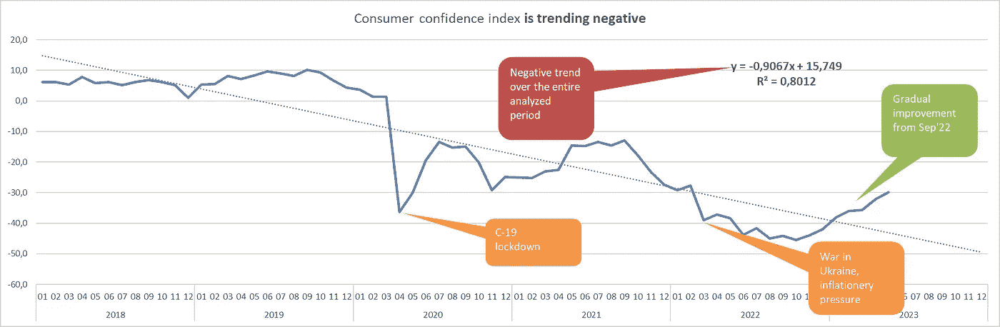
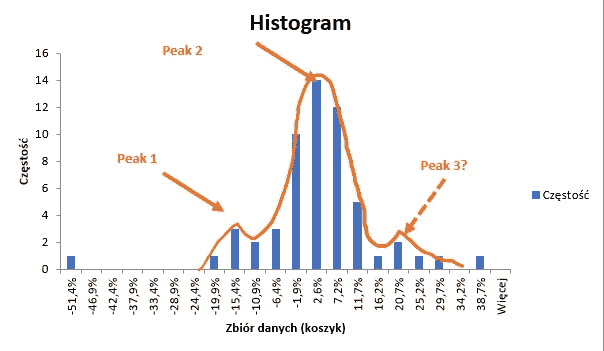
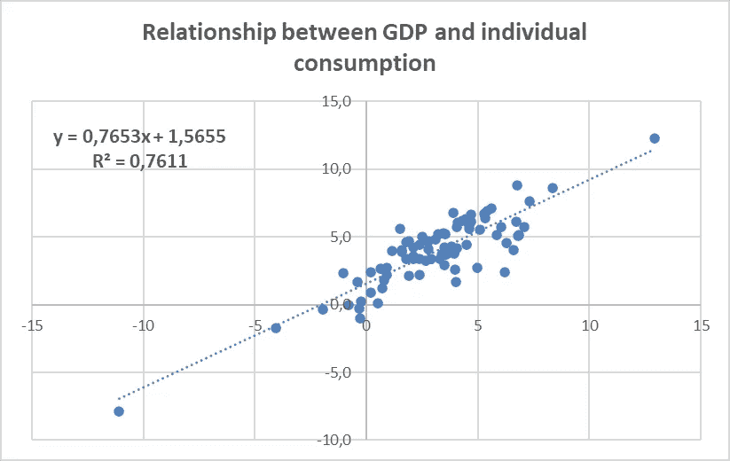
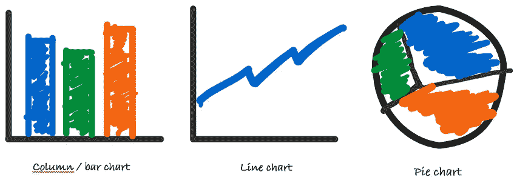

# 将洞察转化为可操作的成果

> 原文：[`towardsdatascience.com/turning-insights-into-actionable-outcomes-f7b2a638fa52`](https://towardsdatascience.com/turning-insights-into-actionable-outcomes-f7b2a638fa52)

## 解锁秘密配方。

 [Michal Szudejko](https://medium.com/@michalszudejko?source=post_page-----f7b2a638fa52--------------------------------)

·发表于 [Towards Data Science](https://towardsdatascience.com/?source=post_page-----f7b2a638fa52--------------------------------) ·阅读时间 9 分钟·2023 年 8 月 19 日

--

**请检查下面的图片。你认为它描绘的是什么？**

如果你认为这张图片描绘的是一块美味的巧克力，你就错了。

[图片由 SKopp 提供，CC BY-SA 3.0](https://commons.wikimedia.org/w/index.php?curid=30280314)

这里展示的是**复合巧克力**，它是由可可、植物脂肪和甜味剂混合而成。由于其成分较便宜，它是比真正巧克力更经济的选择。你可以在经济型巧克力棒或糖果涂层中找到它。这种巧克力在我居住的波兰有着特殊的记忆。在 1980 年代，由于缺少重要的成分，它取代了真正的巧克力。

**这种产品通常含有不超过 7%的可可** [1]。相比之下，真正的巧克力至少含有 35%的可可（典型的苦巧克力含 70%） [2]。**差别确实很大，对吧？**

在我最近的文章《[从数字到行动：让数据为公司服务](https://medium.com/towards-data-science/from-numbers-to-actions-making-data-work-for-companies-162183c13998)》中，我探讨了包括洞察本质在内的各种问题。许多所谓的洞察类似于复合巧克力。乍一看，这些所谓的洞察可能看起来很真实。但就像那块复合巧克力一样，当你仔细观察或“品尝”它们时，它们并不完全符合标准。

显然，有些问题。图片由作者提供。

在继续之前，我要停下来澄清一下我所说的‘**洞察**’一词的含义。

## 什么是洞察，为什么这个术语如此独特？

我探讨了‘洞察’一词的各种词典定义。牛津学习词典将其定义为‘*对某事物的* ***理解*** *’。Dictionary.com 描述为‘*通过直观的* ***理解*** *把握事物的真实本质*’。最后，剑桥词典将其定义为‘*理解* ***了解*** *某事物的真实情况*’。

这里反复出现的主题是**‘理解’** — 理解事物的本质。但这个关键的‘事物’是什么？它是**特定的**、**深刻的**，且**能够带来公司运营显著变化的**。

然而，我们对‘洞察’的理解仍不完整。虽然它涉及理解重要的业务问题，但它也包含了‘**可行动性**’。真正的洞察会导致具体行动，推动体现其建议的决策。

## 本质上：洞察是对特定业务问题的深刻理解，这种理解促使决策和行动。

## 为什么洞察如此重要？

今天，数据的有效利用被普遍认可为竞争优势的基础。然而，令人惊讶的是，只有极少数公司能够充分发挥其潜力。**仅有 27%的公司认为自己是数据驱动的[3]**。当想到真正利用数据并从中获得价值的企业时，通常会想到亚马逊、Meta 和 Netflix 等在线巨头。然而，事实上，任何规模的组织和各个行业都可以通过高效使用数据来推动其增长。

单单拥有数据是不够的。即使数据完美契合特定业务需求，其真正的价值只有在有效应用时才能显现。这意味着决策和后续行动必须基于从数据中获取的趋势、细微差别和**洞察**。

众多因素可以促进这一过程，但也存在显著的障碍。在通向成功的路线图上，有几个要素至关重要：设计合理且高效管理的数据源、致力于数据驱动决策的公司领导、一个专注且训练有素的数据团队，以及数据驱动的讲故事方式。

## 为什么与这一定义相符的洞察如此之少？

主要原因在于创建这些洞察的固有挑战。幸运的是，有一些工具可以帮助公司在这一过程中导航。考虑麦肯锡提出的**洞察价值链模型**[4]。这一概念框架指导组织将原始数据转化为可行动的洞察，从而创造商业价值。该模型展示了四个主要步骤，解释了数据如何从原始状态变为有价值的决策。在下面的图片中，我使用了一个零售公司试图提升销售的例子来展示该模型的工作原理。

麦肯锡的洞察价值链模型以零售公司为例。图片由作者提供。

如上所示，过程是复杂的。为了获得更深入的理解，让我们系统地解剖它。从根本上说，我们要解决的紧迫问题是：

> 如何提高洞察的百分比？

有四个基本特征定义了“真实”的洞察。一个洞察，如果它的可可含量达到 70%或更多，无论是否苦涩，我在下面的图片中展示了它们：

“真实”洞察的特征。图片由作者提供。

**“真实”的洞察：**

1.  应该**提供对业务事务的理解**……

1.  要**具体**……

1.  … 并且**有意义**。

1.  应该**促使决策和行动**。

现在，让我们深入探讨这些特征。

## 如何产生一个能够提供理解的洞察？

**真实的洞察必须结合背景以最大化其影响力和理解度。** 背景丰富了数据驱动的叙事。赋予洞察背景的六种方法包括：

1.  **比较背景**：每月比较产品销售额或将实际成本与预算或去年同期进行对比。

1.  **规模调整**：突出时间的累计影响，或将年度收益分解为每月或每周的收益，以获得更直观的视角。

1.  **等效性**：通过使用熟悉的例子来帮助理解。与其说：“你的智能手机有 128GB 存储空间”，不如说“它可以存储 25,000 张照片*”。

1.  **历史背景**：展示绩效趋势，考虑季节性或周期性影响。始终比较完整的周期。

1.  **信息背景**：提供有关模式或异常的细节，而不假设相关性意味着因果关系。

1.  **数据验证**：通过引用数据来源、收集方法和时效性来增强可信度[5]。

**其次，永远不要满足于初步结论**，特别是使用 LLM 进行分析时。**进一步深入，直到结论真正体现洞察。**

Chat GPT 和代码解释器在形成洞察中的实际应用。来源：作者的 YT 频道。

第三，激发灵感。使用的工具越简单，发生的可能性就越大。**即使使用的技术看似简单。** 记住阿基米德说过的话：

> 给我一个支点，我将撬动地球。

以下，我展示了一些使用像 Excel 这样的基本工具执行的分析。虽然这些分析很简单，但它们可以产生有价值的洞察，可能作为使用更复杂程序或技术进行深入探索的基础。

初始图表展示了客户信心指数在一年中的波动，通过 Excel 进行分析。从**趋势线**和附带的线性回归方程中可以明显看出，总体趋势是下降的。在 C-19 封锁和乌克兰战争爆发等事件期间出现了显著的下降。目前，趋势正向上发展。

趋势分析示例。图片来源于作者。

另一个分析同样在 Excel 中进行，有助于识别结果分布中的特殊性。通过使用**基本直方图**，我们可以找出异常值，并评估频率分布中的任何不规则性。例如，初看似乎是一个单一分布，实际上可能是三个不同的分布，如下例所示：

使用直方图在 Excel 中检测异常。图片来源于作者。

最终分析同样在 Excel 中进行，包括向图表中添加趋势线。此工具允许应用各种函数，包括线性和非线性函数，以及回归方程。此外，还可以使用 R 平方估计来评估拟合的准确性。

Excel 中的关系分析。图片来源于作者。

## 我们如何使见解更具体、更有意义？

见解必须与核心业务目标和战略计划紧密相关。**这种联系越强，见解被忽视的可能性就越小。**

广泛地说，有两种类型的指标：

+   KPI（关键绩效指标）

+   KCI（关键概念指标）。

如果一个指标难以响应，无论其变化的幅度如何，它可能是 KCI——在组织中广泛监控但缺乏可操作价值。相反，与 KPI 相关的见解可以激发真正的紧迫感，推动决策和行动。

## **KPI 与公司战略的对齐程度越高，它就越自然地转化为战术响应，因为这些响应直接与关键业务组成部分相关。**

KPI 必须深深植根于公司的 DNA 中，覆盖从高层领导到后台员工的各个层面。[平衡计分卡](https://www.investopedia.com/terms/b/balancedscorecard.asp) 可以在将目标和指标传播到每个部门时发挥重要作用。通过培养能够无缝连接管理、财务和数据科学的角色，形成了一种统一的目标实现方法。强调跨组织所有领域的业务合作，从销售到会计。对于适合的组织，采用敏捷管理结构可以提升这种综合策略。

## 见解如何促使决策和行动？

初始步骤涉及**掌握数据讲述的艺术**。沟通见解应该超越仅仅向决策者展示复杂表格。这样的做法有可能让他们感到不知所措，导致他们失去兴趣。

有效的数据讲述基于三个原则：

1.  **理解上下文：** 识别驱动我们观众的因素。

1.  **运用叙事结构：** 实施诸如讲故事弧线[6]等元素。

1.  **利用有效的视觉表现。**

**什么构成有效的视觉表现？** 首先，它应该清晰，不会让观众感到困惑。因此，我提倡使用这三种图表类型：

三种总是有效的图表。作者提供的图片

对于图表选择，当比较汇总值（如预算与实际情况）时使用柱状图或条形图。分析趋势时，折线图是首选。如果你试图理解部分与整体的关系，饼图是理想选择。这三种图表类型可能满足你约 80%的可视化需求，除非有特定场景如队列分析**。

设计图表时，重要的是去除任何杂乱元素。去掉框架、辅助线和不必要的数据点，这些可能会分散主要信息。将颜色和文本视为战略工具；它们应该用来突出和强调关键信息，而不仅仅是美化图表。

始终与观众保持一致。测试你的视觉效果，看看哪些有效，哪些无效，并进行相应调整。这种迭代过程是建立共同理解和确保你的数据讲述引人入胜故事的关键。

最后，确保你的叙事自然流畅。避免用不必要和冗长的悬念分散观众的注意力。使用诸如 3 分钟故事或大创意[7]等方法评估你的讲故事技巧。**例如，我会朗读我的叙事，无论是文章还是演示文稿。如果我能顺利地表达故事，这增强了我对其与观众共鸣的信心。** 一旦你赢得了他们的注意力，介绍关键结论和行动号召。务必在故事高潮之后立即进行 — 那时他们最为投入和接受。然而，如果出现顾虑，优先考虑积极倾听。解决任何不确定性，并在需要时，**建议协作后续活动以促进理解。**

## 结论

在这篇文章中，我讲解了如何打造有力的洞察。这些不仅仅是普通的洞察；它们是引导企业做出明智决策的那种洞察。当使用得当时，这些洞察可以改变游戏规则，帮助公司应对困难局面或利用巨大机遇。**拥有正确的数据或最佳工具并不是全部。如何分享和解释这些洞察同样至关重要。** 一切都在于确保信息传达准确，让人们思考，并激励他们采取行动。**最终，最有价值的洞察是那些能带来有意义的行动和转型的洞察。**

**假设照片的平均大小为 5MB，而智能手机上的有效空间为 120GB**

***作者的主观评估*

[1] **维基百科**，[复合巧克力](https://pl.wikipedia.org/wiki/Wyr%C3%B3b_czekoladopodobny)e

[2] **凯瑟琳·马丁科**，[巧克力上的可可含量是什么意思？](https://www.treehugger.com/what-does-cacao-percentage-mean-chocolate-bar-4858617)，2021 年 2 月 6 日

[3] **米哈乌·苏德伊科**，[从数字到行动：让数据为公司发挥作用](https://medium.com/towards-data-science/from-numbers-to-actions-making-data-work-for-companies-162183c13998)，2023 年 8 月 14 日

[4] **霍尔格·赫尔特根和尼科·莫尔**，[利用数据实现业务影响](https://www.mckinsey.com/capabilities/quantumblack/our-insights/achieving-business-impact-with-data)，2018 年 4 月 27 日

[5] **布伦特·戴克斯**，[情境化洞察：将数字放入上下文的六种方法](https://www.effectivedatastorytelling.com/post/contextualized-insights-six-ways-to-put-your-numbers-in-context)，2018 年 10 月 18 日

[6] **苹果播客**，[叙事弧：数据故事中的缺失工具，布伦特·戴克斯](https://podcasts.apple.com/ie/podcast/narrative-arc-missing-tool-in-your-data-stories-brent/id1029765276?i=1000461905099)，2021 年

**科尔·努斯鲍默·克纳夫利克**，《数据故事讲述》，Wiley，2015 年
