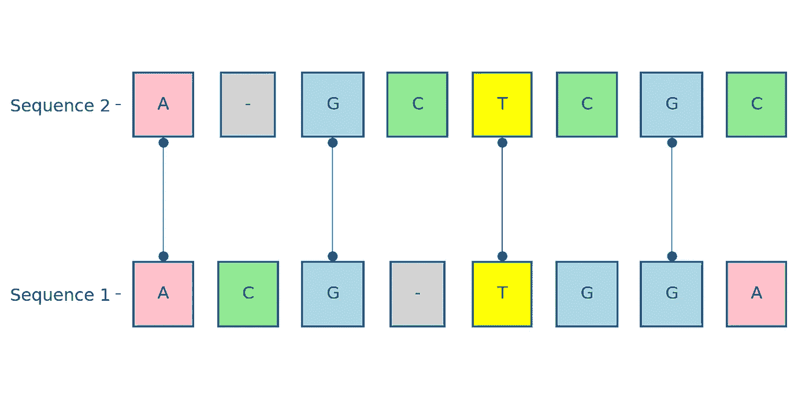
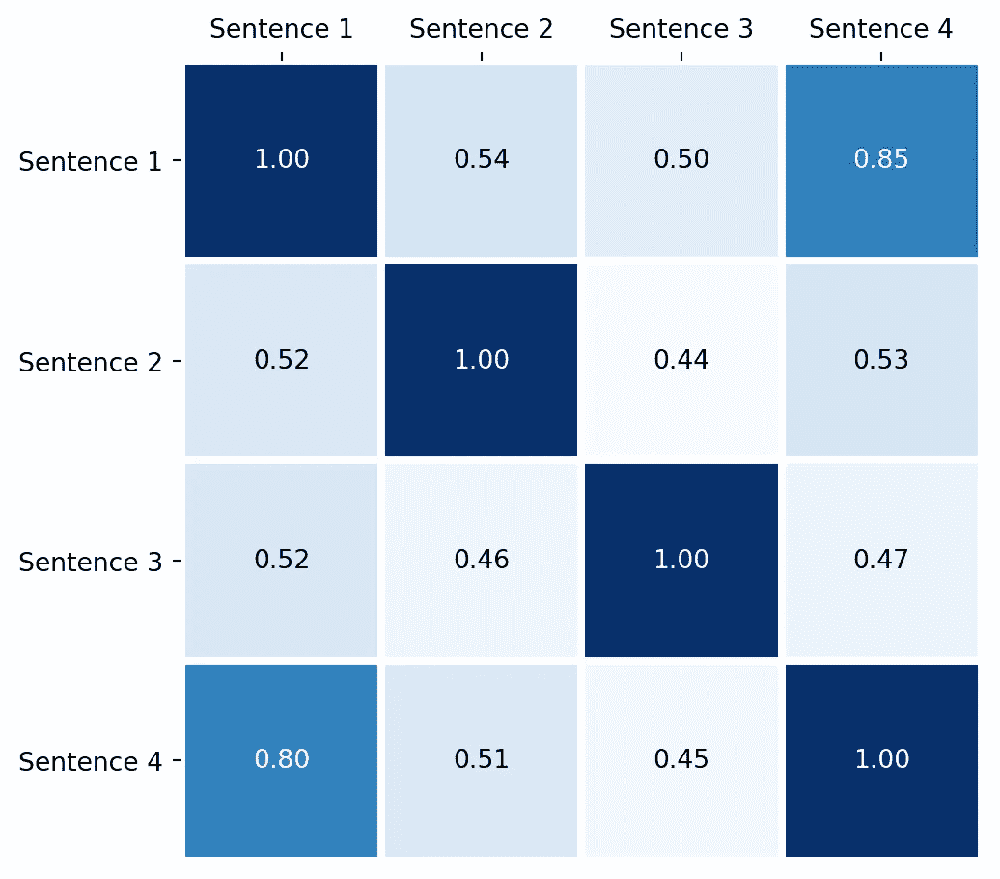

# 使用 string2string 驯服文本：一个强大的 Python 库，用于字符串对字符串算法

> 原文：[`towardsdatascience.com/tutorial-string2string-python-pkg-f9126b8474c5`](https://towardsdatascience.com/tutorial-string2string-python-pkg-f9126b8474c5)

## 教程

## 利用 string2string 进行自然语言处理任务

[](https://medium.ealizadeh.com/?source=post_page-----f9126b8474c5--------------------------------)[](https://towardsdatascience.com/?source=post_page-----f9126b8474c5--------------------------------) [Essi Alizadeh](https://medium.ealizadeh.com/?source=post_page-----f9126b8474c5--------------------------------)

·发表于[Towards Data Science](https://towardsdatascience.com/?source=post_page-----f9126b8474c5--------------------------------) ·阅读时间 8 分钟·2023 年 5 月 11 日

--


string2string 库中的概念词云以及一个示例（作者提供的图片）。

`string2string`库是一个开源工具，提供了一整套高效的字符串对字符串问题解决方法。该库涵盖了字符串配对比对、距离测量、词汇和语义搜索以及相似性分析。此外，还包括了各种有用的可视化工具和度量标准，使得理解和评估这些方法的结果更加简单。

这个库包含了如 Smith-Waterman、Hirschberg、Wagner-Fisher、BARTScore、BERTScore、Knuth-Morris-Pratt 和 Faiss 搜索等知名算法。它可以用于自然语言处理、生物信息学和计算机社会研究中的许多工作和问题[1]。

[斯坦福 NLP 小组](https://nlp.stanford.edu/)，作为斯坦福 AI 实验室的一部分，开发了这个库，并在[1]中介绍了它。该库的 GitHub 仓库有几个[教程](https://github.com/stanfordnlp/string2string/tree/main#tutorials)，你可能会觉得有用。

> *字符串*是代表一段数据或文本的字符（字母、数字和符号）序列。从日常短语到 DNA 序列，甚至计算机程序，字符串可以用来表示几乎一切[[](https://ealizadeh.com/blog/tutorial-string2string/#ref-suzgun2023string2string)1]。

# 目录

+   安装

+   配对比对

    – 用于全局比对的 Needleman-Wunsch 算法

    – 动态时间规整

+   搜索问题

    – 词汇搜索（精确匹配搜索）

    – 语义搜索

    –– 通过 Faiss 的语义搜索

+   距离

    – Levenshtein 编辑距离

    – Jaccard 指数

+   相似性分析

+   结论

+   参考文献

# 安装

你可以通过运行 `pip install string2string` 来安装该库。有关更多信息，请访问该库的 [GitHub 页面](https://github.com/stanfordnlp/string2string)。

# 成对对齐

字符串成对对齐是一种在 NLP 和其他学科中用于比较两个字符串或字符序列的方法，通过突出它们的共享和独特特征。两个字符串被对齐，并根据共享字符的数量以及共享间隙和不匹配的数量计算相似度分数。这个过程对于定位共享相似性的字符序列和计算两个字符串集合之间的“距离”非常有用。拼写检查、文本分析和生物信息学序列比较（例如 DNA 序列对齐）只是其中的一些用途。

目前，`string2string` 包提供了以下对齐技术：

+   Needleman-Wunsch 用于全局对齐

+   Smith-Waterman 用于局部对齐

+   Hirchberg 的线性空间全局对齐算法

+   最长公共子序列

+   最长公共子字符串

+   动态时间规整（DTW）用于时间序列对齐

在这篇文章中，我们将看两个示例：一个用于全局对齐，一个用于时间序列对齐。

## Needleman-Wunsch 算法用于全局对齐

Needleman-Wunsch 算法是一种动态规划算法，通常用于生物信息学中全局匹配两个 DNA 或蛋白质序列。

```py
The alignment between "ACGTGGA" and "AGCTCGC":
A | C | G | - | T | G | G | A
A | - | G | C | T | C | G | C
```

为了进行更具信息性的比较，我们可以使用库中的 `plot_pairwise_alignment()` 函数。



图 1： “ACGTGGA” 与 “AGCTCGC” 之间的全局对齐（图像由作者提供）。

## 动态时间规整

DTW 是一个有用的工具，用于比较两个可能在速度、持续时间或两者都不同的时间序列。它通过计算两个序列中每对点之间的“距离”，发现最小化序列之间总差异的路径。

让我们通过使用 `string2string` 库中的 `alignment` 模块来举个例子。

```py
DTW path: [(0, 0), (1, 1), (1, 2), (2, 3), (3, 4), (4, 5), (4, 6)]
```

上面是一个借用我之前文章的示例，[*动态时间规整的插图介绍*](https://ealizadeh.com/blog/introduction-to-dynamic-time-warping/#example-1)。对于那些希望深入探讨这一主题的人，在 [2] 中，我以直观和易于理解的方式解释了 DTW 的核心概念。

# 搜索问题

字符串搜索是找到模式子字符串在另一个字符串中的任务。该库提供了两种搜索算法：词汇搜索和语义搜索。

## 词汇搜索（精确匹配搜索）

词汇搜索，通俗地说，就是在文本中搜索某些单词或短语，类似于在字典或书籍中查找一个单词或短语。

与其尝试理解一串字母或词语的意思，不如直接尝试准确匹配。在搜索引擎和信息检索中，词汇搜索是一种基本策略，用于根据用户输入的关键词或短语找到相关资源，而不试图理解这些词或短语的语言上下文。

目前，`string2string`库提供了以下词汇搜索算法：

+   朴素（暴力）搜索算法

+   Rabin-Karp 搜索算法

+   Knuth-Morris-Pratt（KMP）搜索算法（见下例）

+   Boyer-Moore 搜索算法

```py
The starting index of pattern: 72
The pattern (± characters) inside the text: "of a Redwood tree, and"
```

## 语义搜索

语义搜索是一种更复杂的信息检索方法，它超越了简单的词或短语搜索。它利用自然语言处理（NLP）来解读用户的意图，并返回准确的结果。

换句话说，假设你对“如何种植苹果”感兴趣。虽然词汇搜索可能会产生包含“grow”和“apples”这两个词的结果，但语义搜索会识别出你对苹果树栽培的兴趣，并据此提供相关结果。搜索引擎会优先展示那些不仅包含所查短语，还提供关于种植、修剪和收获苹果树的相关信息的结果。

## 通过 Faiss 进行语义搜索

Faiss（Facebook AI Similarity Search）是一个高效的相似性搜索工具，适用于处理具有数值表示的高维数据[3]。`string2string`库为 Facebook 开发的 FAISS 库提供了一个封装（见[GitHub 仓库](https://github.com/facebookresearch/faiss)）。

简而言之，Faiss 搜索根据“得分”对结果进行排名，得分表示两个对象之间的相似程度。得分使得根据搜索结果与目标的接近/相关程度来解释和优先排序搜索结果成为可能。

让我们看看`string2string`库中如何使用 Faiss 搜索。这里，我们有一个包含 11 个句子的语料库（语料库是用于语言学研究、NLP 和机器学习应用的大型结构化文本集合），我们将通过查询一个目标句子来进行语义搜索，以查看它与这些句子的接近/相关程度。

```py
corpus = {"text": [
    "A warm cup of tea in the morning helps me start the day right.",
    "Staying active is important for maintaining a healthy lifestyle.",
    "I find inspiration in trying out new activities or hobbies.",
    "The view from my window is always a source of inspiration.",
    "The encouragement from my loved ones keeps me going.",
    "The novel I've picked up recently has been a page-turner.",
    "Listening to podcasts helps me stay focused during work.",
    "I can't wait to explore the new art gallery downtown.",
    "Meditating in a peaceful environment brings clarity to my thoughts.",
    "I believe empathy is a crucial quality to possess.",
    "I like to exercise a few times a week."
    ]
}

query = "I enjoy walking early morning before I start my work."
```

让我们初始化`FaissSearch`对象。Facebook 的 BART Large 模型是`FaissSearch`对象的默认模型和分词器。

让我们在语料库中找到与查询最相似的前 3 个句子，并打印它们及其相似度得分。

```py
Query: I enjoy walking early morning before I start my work.

Result 1 (score=208.49): "I find inspiration in trying out new activities or hobbies."
Result 2 (score=218.21): "I like to exercise a few times a week."
Result 3 (score=225.96): "I can't wait to explore the new art gallery downtown."
```

# 距离

字符串距离是量化两个提供的字符串之间差异程度的任务。当前，`string2string`库提供了以下距离函数：

+   Levenshtein 编辑距离

+   Damerau-Levenshtein 编辑距离

+   汉明距离

+   Jaccard 距离

## Levenshtein 编辑距离

莱文斯坦编辑距离，简称编辑距离，是将一个字符串转换成另一个字符串所需的最小插入、删除或替换次数。

```py
The distance between the following two sentences is 2.0:
"The beautiful cherry blossoms bloom in the spring time."
"The beutiful cherry blosoms bloom in the spring time."
```

## Jaccard 指数

Jaccard 指数可用于量化词汇或标记集之间的相似性，通常用于文档相似性或主题建模等任务。例如，Jaccard 指数可以用来衡量两个不同文档中词汇集的重叠情况，或识别一组文档中最相似的主题。

```py
Jaccard distance between two documents: 0.75
```

# 相似性分析

简而言之，字符串相似性决定了两段文本（或字符序列）之间的关联程度或相似性。例如，考虑以下这对句子：

+   “猫坐在垫子上。”

+   “猫坐在地毯上。”

尽管不完全相同，这些陈述共享词汇，并传达了连贯的意义。基于字符串相似性分析的方法揭示并量化了这种文本配对之间的相似度。

> 字符串 *相似性* 和 *距离* 测量之间存在*双重性*，意味着它们可以互换使用 [[1]](https://ealizadeh.com/blog/tutorial-string2string/#ref-suzgun2023string2string)。

`string2string` 库的 `similarly` 模块目前提供以下算法：

+   余弦相似性

+   BERTScore

+   BARTScore

+   Jaro 相似性

+   LCSubsequence 相似性

让我们通过以下四个句子的 BERTScore 相似性算法示例来了解一下：

1.  面包店出售各种美味的糕点和面包。

1.  公园有一个游乐场、步道和野餐区。

1.  该节日展示了来自世界各地的独立电影。

1.  面包店提供一系列美味的面包和糕点。

句子 1 和 2 在语义上是相似的，因为它们都涉及面包店和糕点。因此，我们应该预期它们之间会有较高的相似度评分。

让我们在库中实现上述示例。

我们可以使用库中提供的 `plot_heatmap()` 函数可视化每对句子之间的相似性。



句子之间的语义相似性（BERTScore）（图由作者提供）。

如上所示，句子 1 和 4 的相似性远高于我们的预期（使用 BERTScore 算法）。

# 结论

`string2string` Python 库是一个开源工具，提供了一整套高效的方法用于字符串对字符串问题。特别是，该库有四个主要模块，分别处理以下任务：1. *成对比对*，包括全局对齐和局部对齐；2. *距离测量*；3. *词汇和语义搜索*；4. *相似性分析*。该库在每个类别中提供了各种算法，并提供了有用的可视化工具。

📓 *您可以在* [*GitHub*](https://github.com/e-alizadeh/data-science-blog/blob/master/notebooks/string2string-tutorial.ipynb)*找到本帖的笔记本*。

感谢阅读！ 📚

我是高级数据科学家 📊 和工程师，撰写关于统计学、机器学习、Python 等方面的内容。

> 🌱 我还策划了一份每周通讯，名为 [**AI Sprout**](https://aisprout.beehiiv.com/subscribe)，在其中提供最新 AI 工具和创新的实际评测和分析。[订阅](https://aisprout.beehiiv.com/subscribe) 与我一起探索新兴的 AI！

+   [*在 Medium 上关注我*](https://medium.com/@ealizadeh) *👋 以获取我最新的帖子*

+   *订阅* [*我的邮件列表*](https://ealizadeh.com/) *✉️ 获取直接发送到您收件箱的更新*

+   *让我们在* [*LinkedIn*](https://www.linkedin.com/in/alizadehesmaeil/) *和* [*Twitter*](https://twitter.com/es_alizadeh) *上联系* 🤝

[](https://medium.ealizadeh.com/membership?source=post_page-----f9126b8474c5--------------------------------) [## 使用我的推荐链接加入 Medium - Esmaeil Alizadeh

### 📖 阅读 Esmaeil Alizadeh 以及其他成千上万名 Medium 作家的每一个故事。订阅 Medium 获取完整内容……

medium.ealizadeh.com](https://medium.ealizadeh.com/membership?source=post_page-----f9126b8474c5--------------------------------)

# 参考文献

[1] M. Suzgun, S. M. Shieber, and D. Jurafsky, “string2string: A modern python library for string-to-string algorithms,” 2023, Available: [`arxiv.org/abs/2304.14395`](http://arxiv.org/abs/2304.14395)

[2] E. Alizadeh, “动态时间规整的插图式介绍，” 2020\. [`ealizadeh.com/blog/introduction-to-dynamic-time-warping/`](https://ealizadeh.com/blog/introduction-to-dynamic-time-warping/)

[3] J. Johnson, M. Douze, and H. Jégou, “Billion-scale similarity search with GPUs,” *IEEE Transactions on Big Data*, vol. 7, no. 3, pp. 535–547, 2019.

*最初发布于* [*https://ealizadeh.com*](https://ealizadeh.com/blog/tutorial-string2string/)*。*
