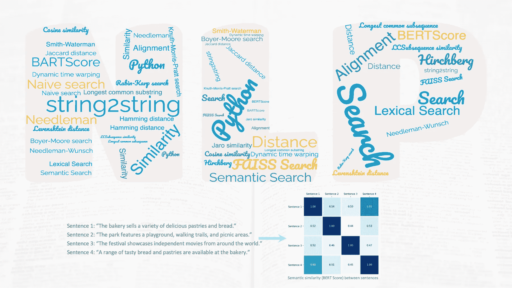

# 利用 string2string 驯服文本：一个强大的 Python 字符串对字符串算法库

> 原文：[`towardsdatascience.com/tutorial-string2string-python-pkg-f9126b8474c5?source=collection_archive---------8-----------------------#2023-05-11`](https://towardsdatascience.com/tutorial-string2string-python-pkg-f9126b8474c5?source=collection_archive---------8-----------------------#2023-05-11)

## 教程

## 利用 string2string 处理自然语言处理任务

 [Essi Alizadeh](https://medium.ealizadeh.com/?source=post_page-----f9126b8474c5--------------------------------)

·

[关注](https://medium.com/m/signin?actionUrl=https%3A%2F%2Fmedium.com%2F_%2Fsubscribe%2Fuser%2F35a932e89ec1&operation=register&redirect=https%3A%2F%2Ftowardsdatascience.com%2Ftutorial-string2string-python-pkg-f9126b8474c5&user=Essi+Alizadeh&userId=35a932e89ec1&source=post_page-35a932e89ec1----f9126b8474c5---------------------post_header-----------) 发布于 [数据科学前沿](https://towardsdatascience.com/?source=post_page-----f9126b8474c5--------------------------------) · 阅读时间 8 分钟 · 2023 年 5 月 11 日

--

string2string 库中概念的词云以及示例（作者提供的图像）。

`string2string` 库是一个开源工具，具有一整套高效的方法用于处理字符串间的问题。这个库涵盖了字符串对齐、距离测量、词汇和语义搜索以及相似性分析。此外，还包含了各种有用的可视化工具和度量标准，便于理解和评估这些方法的结果。

这个库包含了众所周知的算法，如 Smith-Waterman、Hirschberg、Wagner-Fisher、BARTScore、BERTScore、Knuth-Morris-Pratt 和 Faiss 搜索。它可以用于自然语言处理、生物信息学和计算机社会学中的许多任务和问题[1]。

[斯坦福 NLP 小组](https://nlp.stanford.edu/)，作为斯坦福 AI 实验室的一部分，开发了这个库并在[1]中介绍了它。该库的 GitHub 仓库有几个你可能会觉得有用的[教程](https://github.com/stanfordnlp/string2string/tree/main#tutorials)。

> *字符串* 是一串字符（字母、数字和符号），代表一段数据或文本。从日常短语到 DNA 序列，甚至计算机程序，字符串都可能被用来……
