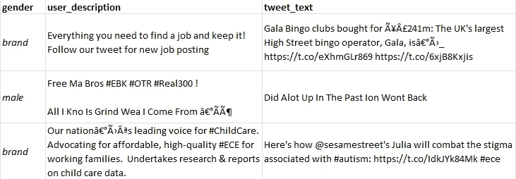
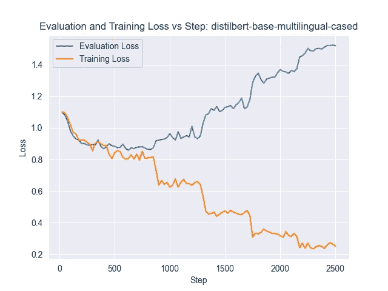
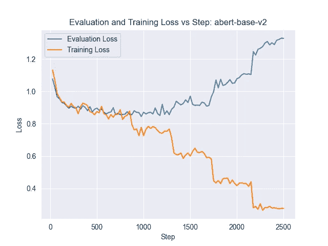
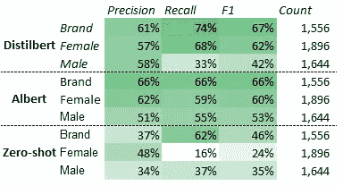
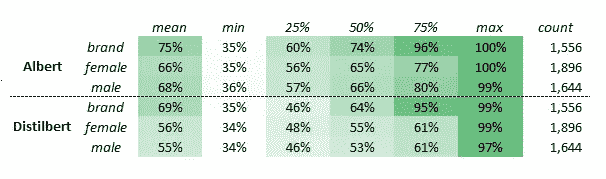

# 变压器在预测推特账户身份中的力量

> 原文：[`towardsdatascience.com/twitter-account-identity-prediction-with-large-language-models-c3ffef114d34`](https://towardsdatascience.com/twitter-account-identity-prediction-with-large-language-models-c3ffef114d34)

## 利用大型语言模型进行高级自然语言处理

## 如何使用最先进的模型进行准确的文本分类

 [John Adeojo](https://johnadeojo.medium.com/?source=post_page-----c3ffef114d34--------------------------------)

·发表于[Towards Data Science](https://towardsdatascience.com/?source=post_page-----c3ffef114d34--------------------------------) ·9 分钟阅读·2023 年 3 月 7 日

--

图片由[Jonathan Cooper](https://unsplash.com/ko/@theshuttervision?utm_source=medium&utm_medium=referral)拍摄，来自[Unsplash](https://unsplash.com/?utm_source=medium&utm_medium=referral)

# 介绍

本项目旨在构建一个能够从推文中预测账户身份的模型。我将详细介绍从数据处理、微调到模型性能评估的步骤。

*在继续之前，我需要说明的是，这里的身份定义为男性、女性或品牌。这并不反映我对性别身份的看法，这只是一个展示变压器在序列分类中强大能力的玩具项目。在一些代码片段中，你可能会注意到性别被用于表示身份，这只是数据到达的方式。*

# 方法

由于文本数据的复杂性和非线性关系的建模，我排除了更简单的方法，选择利用预训练的变压器模型来完成这个项目。

变压器（Transformers）是当前自然语言处理和理解任务的最先进技术。[Transformers](https://huggingface.co/)库来自 Hugging Face，为你提供了数千个预训练模型以及执行自己微调的 API。大多数模型已经在大量文本语料库上进行了训练，有些跨多个语言。没有经过任何微调，它们在类似的文本分类任务上表现非常好，包括情感分析、情绪检测和仇恨言论识别。

我选择了两个模型进行微调，并使用一个[零样本](https://en.wikipedia.org/wiki/Zero-shot_learning)模型作为比较的基准。

> Zero-shot 学习提供了一个基准估计，显示了变换器在没有针对特定分类任务进行微调的情况下能有多强大。

## 笔记本、模型与代码库

由于计算成本，我无法使训练脚本具备交互性。不过，我已经将性能分析笔记本和模型提供给你。你可以使用实时推文自己尝试这些模型！

📒[笔记本](https://mybinder.org/v2/gh/john-adeojo/Twitter-Transformer-Models/1457feb0bbdfdfa095368b03dae99aafdb1d2295?urlpath=lab%2Ftree%2FNotebooks%2FTwitter+Model+Analysis+Notebook+.ipynb): 模型性能分析 Jupyter 笔记本

🤗[微调 Distilbert-Base-Multilingual-Cased](https://huggingface.co/Johnade/distilbert-base-multilingual-cased-twitter-identity-classification): 模型 1

🤗[微调 Albert-base-v2](https://huggingface.co/Johnade/albert-base-v2-fine-tune-twitter-identity-classification) : 模型 2

💻[Github 代码库](https://github.com/john-adeojo/Twitter-Transformer-Models) : 训练脚本

💾[数据来源](https://www.kaggle.com/datasets/crowdflower/twitter-user-gender-classification): Kaggle

# 数据探索与预处理

数据由 [Data For Everyone Library](https://www.crowdflower.com/data-for-everyone/) 提供，位于 [Crowdflower](https://www.crowdflower.com/)。你可以在 [Kaggle](https://www.kaggle.com/datasets/crowdflower/twitter-user-gender-classification)⁴ 下载数据。

*注意：数据拥有一个公共* [*领域许可证*](https://creativecommons.org/publicdomain/zero/1.0/)⁴*。*

总共有大约 20k 条记录，包含用户名、推文、用户描述和其他推特个人信息。虽然时间限制使我无法详细检查，但从快速检查中可以明显看出这些推文是多语言的。然而，推文文本中混杂了 URL、ascii 字符和特殊字符。这是社交媒体数据的常见现象，幸运的是，使用正则表达式清理这些数据非常简单。

作者提供的图像：推文文本示例、用户描述及数据标签

个人资料图片数据以 URL 链接的形式提供。然而，许多链接已损坏，因此在此预测任务中无用。通常，人们可能期望个人资料图片能很好地预测账户持有者的身份，但在这种情况下，数据质量问题过于严重。由于这个原因，我决定使用推文文本和用户描述进行建模。

## 缺失与未知变量

大多数账户都提供了身份标签。标签内容丰富，包括女性、男性、品牌和未知——仅 5.6% 的账户被标记为未知。身份标签未知的账户被从分析中移除，因为它们无法进行测试或训练。

大约 19% 的用户描述为空。空白的用户描述可能会暗示账户持有人的身份。对于空白的用户描述，我简单地插入了一些文本，以便模型能够从这些案例中学习。

## 扩展数据

为了创建更多的示例供模型学习，我将用户描述和推文文本合并到一个通用的 Twitter 文本字段中，有效地将文本样本的数量翻倍。

## 训练、验证、测试

我将数据拆分为 70% 的训练集、15% 的验证集和 15% 的测试集。为了确保没有重叠，如果数据中有账户出现多次，我会自动将所有这些实例分配到训练数据集中。除此之外，账户会根据上述比例随机分配到各个数据集中。

数据预处理流水线脚本

# 硬件

微调是在每个模型上分别完成的，并且需要 GPU 才能实际实现。我的笔记本电脑的 GPU 的具体规格是 Nvidia GE Force RTX 2060。

*虽然这被认为是个人笔记本电脑的高规格，但我发现一些大型语言模型的性能受到了限制，最终限制了我可以尝试的模型集。*

# 软件

为了充分利用我的 GPU，我必须为我的 GPU 版本和所使用的 [Pytorch](https://pytorch.org/get-started/locally/) 版本安装适当的 [CUDA](https://developer.nvidia.com/cuda-11-7-0-download-archive?target_os=Windows&target_arch=x86_64) 工具包。

> [CUDA](https://blogs.nvidia.com/blog/2012/09/10/what-is-cuda-2/) 是一个平台，使计算机能够对数据执行并行计算。这可以大大加快微调 Transformers 的时间。

*建议不要在没有 CUDA 支持的 GPU 上进行这种类型的微调，除非你愿意让机器运行几天。*

## Python 软件包

建模过程的所有步骤都用 Python 脚本编写。我利用了来自 Hugging Face 的开源 Transformers 库。我发现这个库维护良好，并且有大量文档提供最佳实践的指导。

在模型性能测试中，我使用了数据科学家常用的开源机器学习和数据处理工具。关键软件包的列表如下：[Transformers](https://huggingface.co/transformers/v3.2.0/pretrained_models.html)、[Sci-kit Learn](https://scikit-learn.org/stable/)、[Pandas](https://pandas.pydata.org/)、[Numpy](https://numpy.org/)、[Seaborn](https://seaborn.pydata.org/)、[Matplotlib](https://matplotlib.org/)、和 [Pytorch](https://pytorch.org/get-started/locally/)。

## 环境管理

[Anaconda](https://www.anaconda.com/) 作为我的主要环境管理工具，创建了一个 Conda 虚拟环境来安装所有的软件依赖。我强烈建议使用这种方法，因为可能存在大量潜在的依赖冲突。

# 模型微调

这些模型通过在训练数据集上训练并在验证集上评估性能来进行微调。我已配置微调过程，以根据验证数据集上的表现返回最佳模型。

由于这是一个多类分类问题，因此正在最小化的损失指标是 [交叉熵损失](https://www.oreilly.com/library/view/hands-on-convolutional-neural/9781789130331/7f34b72e-f571-49d2-a37a-4ed6f8011c93.xhtml)。更好的模型性能实质上是在验证集上较低的交叉熵损失。候选模型的超参数设置相同，以便进行比较。

用于微调变换器模型的脚本片段

# 模型 0：Multilingual-MiniLMv2-L6-mnli-xnli¹

我通过执行零-shot 分类开始分析，以提供一个基线，从中评估微调后的模型。该模型的参考文本表明，它可以在 100 多种语言上进行推断¹，这对我们的问题来说覆盖范围相当好。

# 模型 1：Distilbert Base Multilingual Cased²

Distilbert-base-multilingual-cased 已在 104 种不同语言上进行训练，提供了广泛的覆盖。该模型是大小写敏感的，因此可以识别文本中的大写和小写。

**模型（预）训练：** 该模型已在维基百科页面的拼接上进行预训练。

**模型架构：** 基于变换器的语言模型，具有 6 层，769 维度和 12 个头，总共有 1.34 亿个参数。

**微调：** 在我的硬件上运行模型微调大约花费了 21 分钟。有一些证据表明，模型已经收敛，这些证据来自评估损失与训练步骤图的对比。

作者提供的图像：评估损失和训练损失

# 模型 2：Albert-base-v³

该模型已在英文文本上进行预训练，并且是无大小写敏感的，这意味着它不保留文本的大小写信息。Albert 专门设计用于解决训练较大模型时出现的内存限制问题。该模型使用一种自监督损失，重点建模句子间的连贯性。

**模型（预）训练：** Albert 在 BOOKCORPUS 和英文维基百科上进行预训练以实现其基线。

**模型架构：** 基于变换器的语言模型，具有 12 个重复层，128 个嵌入，768 个隐藏层，12 个头和 1100 万个参数。

**微调：** 模型微调大约花费了 35 分钟完成。模型收敛可能通过损失指标的“低谷”来指示。

作者提供的图像：评估损失和训练损失

# 模型性能

鉴于这是一个多类学习任务，我评估了模型在 F1、召回率、精确率和准确率上的表现，包括每个类和全局水平。性能指标在测试数据集上评分。

零样本的准确率为 37%，Albert 和 Distilbert 的准确率均为 59%。

## 观察

总体而言，Albert 和 Distilbert 在测试集上的表现均优于零样本分类基线。这是我预期的结果，因为零样本模型对当前分类任务没有任何知识。我认为这更进一步证明了对模型进行微调的价值。

尽管存在显著的性能差异，但在这两种微调模型之间，我们不能明确说哪种模型更好，直到我们在实际应用中对这些模型进行长时间的测试。

## 显著的性能差异

> Albert 在预测时似乎更加自信，其整体预测置信度的 75 百分位数为 82%，而 Distilbert 为 66%。
> 
> 所有模型在预测男性身份时的精确度、召回率和 F1 值都较低。这可能是由于男性推文的变异性大于女性和品牌推文。
> 
> 所有模型在预测品牌方面的表现都优于预测其他身份的表现。此外，相比于预测男性或女性用户，模型在预测品牌时表现出显著更高的信心。我猜这是因为品牌在社交媒体上发布信息的方式相对标准化，而个人用户则不然。

作者提供的图像：所有模型的性能指标

作者提供的图像：四分位数间隔的置信度得分

# 改进方向

我建议采取以下措施以提升模型性能：

## 增加训练样本

更多的数据可以帮助模型更好地泛化，从而提高整体性能。确实有过拟合的迹象，因为我注意到模型在评估集上的性能开始下降，而在测试集上的性能持续提高，更多的数据可以在一定程度上缓解这种情况。

由于 Distilbert 模型的体积较大，相比于 Albert 模型，它更容易发生过拟合。大型语言模型更加灵活，但也更容易过拟合。

## 在多个 GPU 上对 twitter-xlm-roberta-base 模型进行微调以实现收敛

有一个由[Cardiff NLP](https://arxiv.org/abs/2104.12250)开发的模型，专门在推特文本上预训练，并且是多语言的。我确实尝试对这个模型进行微调，但由于硬件限制，效果不佳。这个模型参数多达 198M，运行了近 4 小时却没有显示出收敛的迹象。理论上，由于 Roberta 在推特数据上进行过预训练，它应该比 Distilbert 和 Albert 表现更好。然而，需要更多的数据来防止这个大型模型的过拟合。

## 探索多模态变换器架构的潜力。

如果我们能改善个人资料图片数据的质量，我认为推文文本和图像的结合可能会显著提升我们分类器的性能。

感谢阅读

 [## 通过我的推荐链接加入 Medium - John Adeojo

### 我分享数据科学项目、经验和专业知识，帮助你在旅途中。你可以通过……

[johnadeojo.medium.com](https://johnadeojo.medium.com/membership?source=post_page-----c3ffef114d34--------------------------------)  [## 首页 | John Adeojo

### 关于我的一点介绍 欢迎来到我的专业作品集！我是一位经验丰富的数据科学家和机器学习（ML）专家……

[www.john-adeojo.com](https://www.john-adeojo.com/?source=post_page-----c3ffef114d34--------------------------------)

*[1] Laurer, M., van Atteveldt, W., Salleras Casas, A., & Welbers, K. (2022). 更少标注，更多分类 — 通过深度迁移学习和 BERT 解决监督机器学习的数据稀缺问题 — NLI [预印本]。开放科学框架.*

*[2] Sanh, V., Debut, L., Chaumond, J., & Wolf, T. (2019). DistilBERT，BERT 的一种精简版本：更小、更快、更便宜且更轻量。arXiv 预印本 arXiv:1910.01108.*

[3] *Lan, Z., Chen, M., Goodman, S., Gimpel, K., Sharma, P., & Soricut, R. (2019). ALBERT: 一种轻量级的 BERT，用于自监督语言表示学习。CoRR, abs/1909.11942\.* [*http://arxiv.org/abs/1909.11942*](http://arxiv.org/abs/1909.11942)

[4] *Twitter 用户性别分类*。Kaggle。检索于 2023 年 3 月 15 日，来自 [`www.kaggle.com/datasets/crowdflower/twitter-user-gender-classification`](https://www.kaggle.com/datasets/crowdflower/twitter-user-gender-classification)
