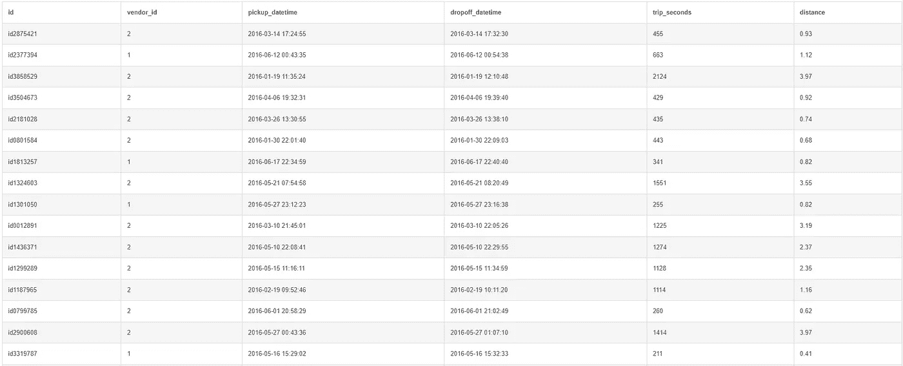
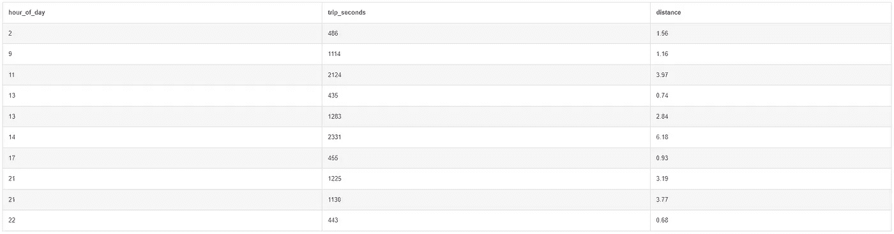
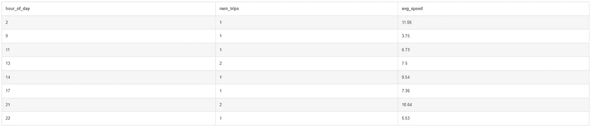
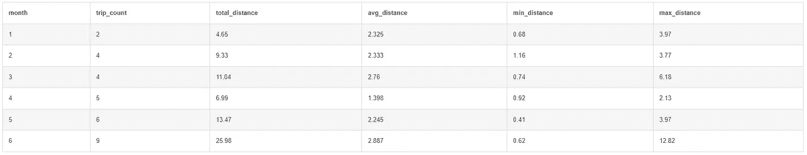
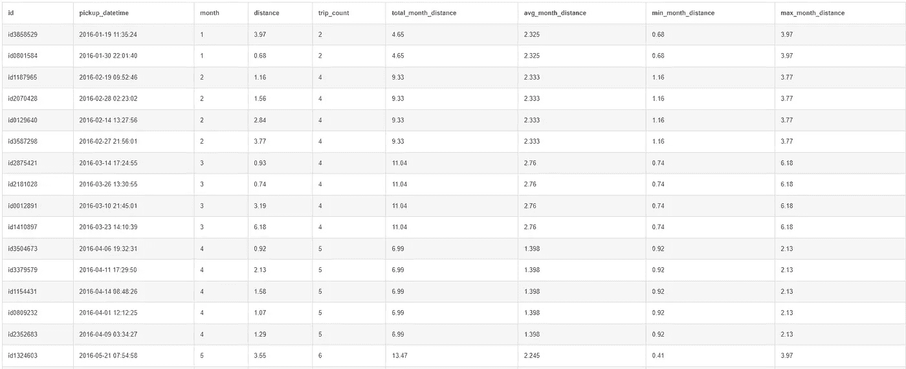
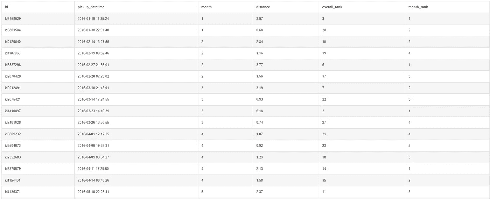
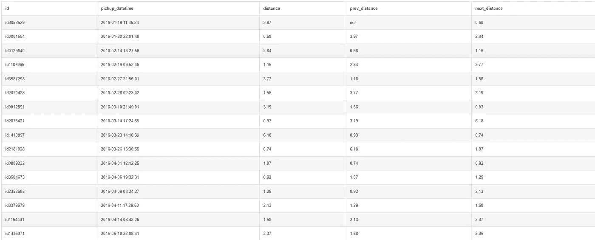
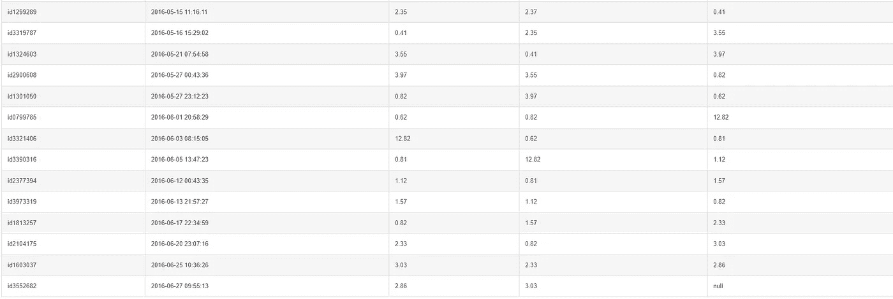
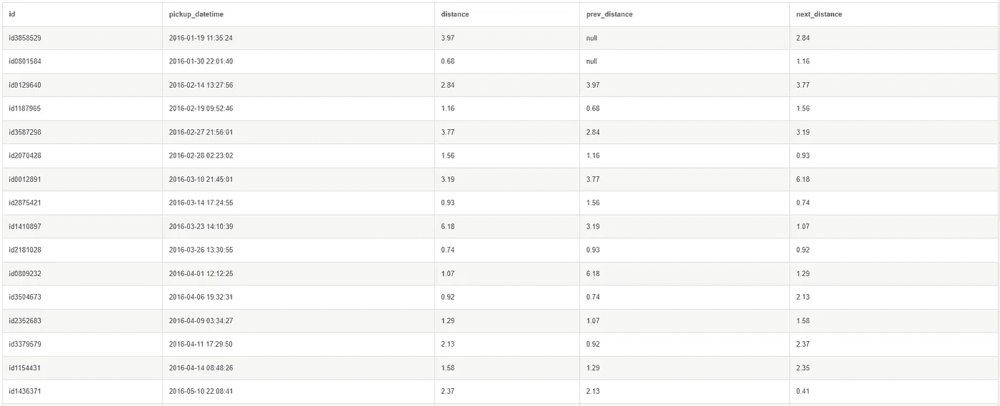
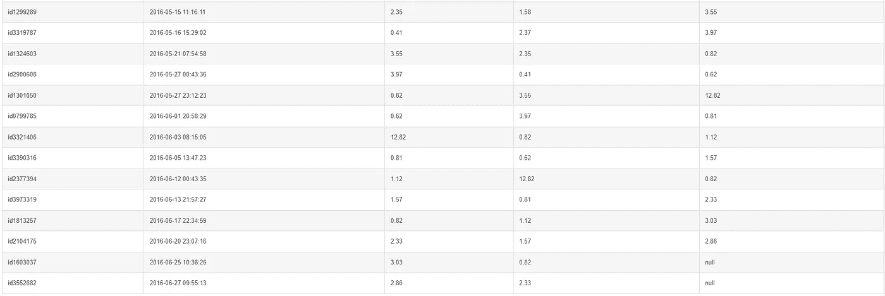

# 两种可以显著提升你的查询的高级 SQL 技巧

> 原文：[`towardsdatascience.com/two-advanced-sql-techniques-that-can-drastically-improve-your-queries-81a97c92ddd0`](https://towardsdatascience.com/two-advanced-sql-techniques-that-can-drastically-improve-your-queries-81a97c92ddd0)

## 了解公用表表达式（CTE）和窗口函数

[](https://chongjason.medium.com/?source=post_page-----81a97c92ddd0--------------------------------)[](https://towardsdatascience.com/?source=post_page-----81a97c92ddd0--------------------------------) [Jason Chong](https://chongjason.medium.com/?source=post_page-----81a97c92ddd0--------------------------------)

·发布于[Towards Data Science](https://towardsdatascience.com/?source=post_page-----81a97c92ddd0--------------------------------) ·11 分钟阅读·2023 年 6 月 30 日

--


图片由[Karina Szczurek](https://unsplash.com/@karinaszczurek?utm_source=medium&utm_medium=referral)提供，来源于[Unsplash](https://unsplash.com/?utm_source=medium&utm_medium=referral)

SQL 是每个数据专业人员的必备技能。无论你是数据分析师、数据科学家还是数据工程师，你都需要对如何编写干净高效的 SQL 查询有一个扎实的理解。

这是因为任何严谨的数据分析或复杂的机器学习模型背后都依赖于数据本身，而这些数据必须来自某个地方。

希望在阅读了我关于 SQL 的[博客文章](https://medium.com/towards-data-science/10-most-important-sql-commands-every-data-analyst-needs-to-know-f0f568914b98)后，你已经了解到 SQL 代表结构化查询语言，它是一种用于从关系数据库中检索数据的语言。

在那篇博客文章中，我们讨论了一些基本的 SQL 命令，如 `SELECT`、`FROM` 和 `WHERE`，这些命令涵盖了你在使用 SQL 时可能遇到的大多数基础查询。

但如果这些简单的命令不够用怎么办？如果你想查询的数据需要更强大的查询方法怎么办？

好了，今天我们将介绍两种新的 SQL 技巧，你可以将它们添加到你的工具包中，从而将你的查询提升到一个新的水平。这些技巧被称为公用表表达式（CTE）和窗口函数。

为了帮助我们学习这些技巧，我们将使用一个名为[DB Fiddle](https://www.db-fiddle.com/)的在线 SQL 编辑器（设置为 SQLite v3.39）和来自 Google Cloud 的出租车行程[数据集](https://console.cloud.google.com/marketplace/product/city-of-new-york/nyc-tlc-trips)（NYC Open Data 许可证）。

# 数据准备

如果你对我如何准备数据集不感兴趣，可以跳过这一部分，直接将以下代码粘贴到 DB Fiddle 中以生成模式。

```py
CREATE TABLE taxi (
  id varchar,
  vendor_id integer,
  pickup_datetime datetime,
  dropoff_datetime datetime,
  trip_seconds integer,
  distance float
);

INSERT INTO taxi 
VALUES
('id2875421', 2, '2016-03-14 17:24:55', '2016-03-14 17:32:30', 455, 0.93), 
('id2377394', 1, '2016-06-12 00:43:35', '2016-06-12 00:54:38', 663, 1.12), 
('id3858529', 2, '2016-01-19 11:35:24', '2016-01-19 12:10:48', 2124, 3.97), 
('id3504673', 2, '2016-04-06 19:32:31', '2016-04-06 19:39:40', 429, 0.92), 
('id2181028', 2, '2016-03-26 13:30:55', '2016-03-26 13:38:10', 435, 0.74), 
('id0801584', 2, '2016-01-30 22:01:40', '2016-01-30 22:09:03', 443, 0.68), 
('id1813257', 1, '2016-06-17 22:34:59', '2016-06-17 22:40:40', 341, 0.82), 
('id1324603', 2, '2016-05-21 07:54:58', '2016-05-21 08:20:49', 1551, 3.55), 
('id1301050', 1, '2016-05-27 23:12:23', '2016-05-27 23:16:38', 255, 0.82), 
('id0012891', 2, '2016-03-10 21:45:01', '2016-03-10 22:05:26', 1225, 3.19), 
('id1436371', 2, '2016-05-10 22:08:41', '2016-05-10 22:29:55', 1274, 2.37), 
('id1299289', 2, '2016-05-15 11:16:11', '2016-05-15 11:34:59', 1128, 2.35), 
('id1187965', 2, '2016-02-19 09:52:46', '2016-02-19 10:11:20', 1114, 1.16), 
('id0799785', 2, '2016-06-01 20:58:29', '2016-06-01 21:02:49', 260, 0.62), 
('id2900608', 2, '2016-05-27 00:43:36', '2016-05-27 01:07:10', 1414, 3.97), 
('id3319787', 1, '2016-05-16 15:29:02', '2016-05-16 15:32:33', 211, 0.41), 
('id3379579', 2, '2016-04-11 17:29:50', '2016-04-11 18:08:26', 2316, 2.13), 
('id1154431', 1, '2016-04-14 08:48:26', '2016-04-14 09:00:37', 731, 1.58), 
('id3552682', 1, '2016-06-27 09:55:13', '2016-06-27 10:17:10', 1317, 2.86), 
('id3390316', 2, '2016-06-05 13:47:23', '2016-06-05 13:51:34', 251, 0.81), 
('id2070428', 1, '2016-02-28 02:23:02', '2016-02-28 02:31:08', 486, 1.56), 
('id0809232', 2, '2016-04-01 12:12:25', '2016-04-01 12:23:17', 652, 1.07), 
('id2352683', 1, '2016-04-09 03:34:27', '2016-04-09 03:41:30', 423, 1.29), 
('id1603037', 1, '2016-06-25 10:36:26', '2016-06-25 10:55:49', 1163, 3.03), 
('id3321406', 2, '2016-06-03 08:15:05', '2016-06-03 08:56:30', 2485, 12.82), 
('id0129640', 2, '2016-02-14 13:27:56', '2016-02-14 13:49:19', 1283, 2.84), 
('id3587298', 1, '2016-02-27 21:56:01', '2016-02-27 22:14:51', 1130, 3.77), 
('id2104175', 1, '2016-06-20 23:07:16', '2016-06-20 23:18:50', 694, 2.33), 
('id3973319', 2, '2016-06-13 21:57:27', '2016-06-13 22:12:19', 892, 1.57), 
('id1410897', 1, '2016-03-23 14:10:39', '2016-03-23 14:49:30', 2331, 6.18);
```

运行`SELECT * from taxi`后，你应该会得到一个类似于下面的表格。



图片由作者提供。

对于那些想了解这个表格是如何来的朋友，我将数据过滤到了前 30 行，只保留了你上面看到的列。至于距离字段，我计算了取车点和放车点之间的正距距离（纬度和经度）。

正距距离是球面上两点之间的最短距离，因此这实际上会低估出租车实际行驶的距离。然而，出于今天的目的，我们可以暂时忽略这一点。

计算正距距离的公式可以在[这里](https://www.geeksforgeeks.org/program-distance-two-points-earth/)找到。现在，回到 SQL。

# 公共表表达式（CTE）

公共表表达式（CTE）是你在查询中返回的临时表。你可以将它视为一个查询中的查询。它们不仅帮助你将查询拆分为更易读的块，还可以基于已定义的 CTE 编写新查询。

为了演示这个，我们假设我们想分析按小时划分的出租车行程，并过滤 2016 年 1 月至 3 月之间发生的行程。

```py
SELECT CAST(STRFTIME('%H', pickup_datetime) AS INT) AS hour_of_day, 
       trip_seconds,
       distance
FROM taxi
WHERE pickup_datetime > '2016-01-01'
  AND pickup_datetime < '2016-04-01'
ORDER BY hour_of_day;
```



图片由作者提供。

够直接了；让我们更进一步。

假设我们现在想计算每个小时的行程数量和平均速度。这时我们可以利用 CTE 首先获取一个类似于上面观察到的临时表，然后执行后续查询以按小时统计行程数量并计算平均速度。

定义 CTE 的方式是使用`WITH`和`AS`语句。

```py
WITH relevantrides AS
(
SELECT CAST(STRFTIME('%H', pickup_datetime) AS INT) AS hour_of_day, 
       trip_seconds,
       distance
FROM taxi
WHERE pickup_datetime > '2016-01-01'
  AND pickup_datetime < '2016-04-01'
ORDER BY hour_of_day
)
SELECT hour_of_day,
       COUNT(1) AS num_trips,
       ROUND(3600 * SUM(distance) / SUM(trip_seconds), 2) AS avg_speed
FROM relevantrides
GROUP BY hour_of_day
ORDER BY hour_of_day;
```



图片由作者提供。

使用 CTE 的替代方法是简单地将临时表包裹在`FROM`语句中（见下方代码），这会给你相同的结果。然而，从代码可读性的角度来看，这并不推荐。此外，想象一下如果我们需要创建多个临时表的话。

```py
SELECT hour_of_day,
       COUNT(1) AS num_trips,
       ROUND(3600 * SUM(distance) / SUM(trip_seconds), 2) AS avg_speed
FROM (
 SELECT CAST(STRFTIME('%H', pickup_datetime) AS INT) AS hour_of_day, 
           trip_seconds,
           distance
 FROM taxi
 WHERE pickup_datetime > '2016-01-01'
    AND pickup_datetime < '2016-04-01'
 ORDER BY hour_of_day
)
GROUP BY hour_of_day
ORDER BY hour_of_day;
```

额外信息：从这个练习中我们可以得到一个有趣的见解，那就是出租车在高峰时段的移动速度较慢（平均速度较低），这很可能是由于人们上下班的交通拥堵造成的。

# 窗口函数

窗口函数对行组执行聚合操作，但它为原始表中的每一行生成一个结果。

要完全理解窗口函数的工作原理，首先快速回顾一下通过`GROUP BY`进行的聚合会有所帮助。

假设我们希望使用出租车数据集计算按月份汇总的统计数据。

```py
SELECT CAST(STRFTIME('%m', pickup_datetime) AS INT) AS month,
       COUNT(1) AS trip_count,
       ROUND(SUM(distance), 3) AS total_distance,
       ROUND(AVG(distance), 3) AS avg_distance,
       MIN(distance) AS min_distance,
       MAX(distance) AS max_distance
FROM taxi
GROUP BY month;
```



图片由作者提供。

在上面的示例中，我们计算了数据集中每个月的计数、总和、平均值、最小值和最大值。请注意，我们原本有 30 行的出租车表现在已经压缩为每个月一行，共六行。

那么，实际在幕后发生了什么？首先，SQL 根据月份对原始表中的 30 行进行了分组。然后，它根据这些分组中的值应用了相关的计算。

以一月份为例。数据集中有两次发生在一月份的旅行，分别行程为 3.97 和 0.68。SQL 根据这两个值计算了计数、总和、平均值、最小值和最大值。这个过程会重复进行，直到所有月份的数据处理完成，最终得到的输出类似于上述结果。

现在，请记住这个想法，我们开始探讨窗口函数的工作原理。窗口函数主要有三大类：聚合函数、排名函数和导航函数。我们将分别查看每一类的示例。

## 聚合函数

我们在之前的示例中已经见过聚合函数的作用。聚合函数包括计数、求和、平均值、最小值和最大值等函数。

但窗口函数与`GROUP BY`的不同之处在于最终输出的行数。具体来说，我们看到在按月份聚合后，我们的输出表只剩下六行（每个月一行）。

窗口函数与聚合字段不同，它不会对表进行汇总，而是简单地在每一行中输出结果到一个新列。输出表中的行数不会改变。换句话说，输出表的行数总是与原始表相同。

执行窗口函数的语法是`OVER(PARTITION BY ...)`。你可以将其视为我们之前示例中的`GROUP BY`语句。

让我们看看实际情况是如何运作的。

```py
WITH aggregate AS
(
SELECT id,
       pickup_datetime,
       CAST(STRFTIME('%m', pickup_datetime) AS INT) AS month, 
       distance
FROM taxi
)
SELECT *,
       COUNT(1) OVER(PARTITION BY month) AS trip_count,
       ROUND(SUM(distance) OVER(PARTITION BY month), 3) AS total_month_distance,
       ROUND(AVG(distance) OVER(PARTITION BY month), 3) AS avg_month_distance,
       MIN(distance) OVER(PARTITION BY month) AS min_month_distance,
       MAX(distance) OVER(PARTITION BY month) AS max_month_distance
FROM aggregate;
```



图片由作者提供。

在这里，我们希望得到与上次相同的输出，但不是压缩表，而是希望在新列中将结果显示为单独的行。

你会发现聚合后的值没有改变，而是简单地以重复的行显示在表中。例如，前两行（一月）的旅行计数、总月度距离、平均月度距离、最小月度距离和最大月度距离与之前相同。其他月份也是如此。

如果你想知道窗口函数的作用，它帮助我们将每一行的值与聚合值进行比较。在这种情况下，我们可以轻松比较每一行的行驶距离与每月的平均值、最小值和最大值等等。

## 排名函数

另一种窗口函数是排名函数。顾名思义，这种函数基于聚合字段对一组行进行排名。

```py
WITH ranking AS
(
SELECT id,
       pickup_datetime,
       CAST(STRFTIME('%m', pickup_datetime) AS INT) AS month, 
       distance
FROM taxi
)
SELECT *,
       RANK() OVER(ORDER BY distance DESC) AS overall_rank,
       RANK() OVER(PARTITION BY month ORDER BY distance DESC) AS month_rank
FROM ranking
ORDER BY pickup_datetime;
```



图片由作者提供。

在上面的例子中，我们有两个排名列：一个是整体排名（从 1 到 30），另一个是按月排名，两者均为降序排列。

要指定排名的顺序，你需要在`OVER`语句中使用`ORDER BY`。

对于第一行的结果，你会解释为它在整个数据集中具有第三长的行驶距离，并且在一月份的行驶距离最长。

## 导航函数

最后但同样重要的是，我们还有导航函数。

导航函数根据不同于当前行的行的值分配一个值。一些常见的导航函数包括`FIRST_VALUE`、`LAST_VALUE`、`LEAD`和`LAG`。

```py
SELECT id,
       pickup_datetime,
       distance,
       LAG(distance) OVER(ORDER BY pickup_datetime) AS prev_distance,
       LEAD(distance) OVER(ORDER BY pickup_datetime) AS next_distance
FROM taxi
ORDER BY pickup_datetime;
```



Lag 返回前一行的值。图片由作者提供。



Lead 返回下一行的值。图片由作者提供。

在上面的例子中，我们使用了`LAG`函数返回前一行的值，使用`LEAD`函数返回下一行的值。请注意，滞后列的第一行是空的，而前导列的最后一行是空的。

```py
SELECT id,
       pickup_datetime,
       distance,
       LAG(distance, 2) OVER(ORDER BY pickup_datetime) AS prev_distance,
       LEAD(distance, 2) OVER(ORDER BY pickup_datetime) AS next_distance
FROM taxi
ORDER BY pickup_datetime;
```



当滞后偏移设置为 2 时，前两行是空的。图片由作者提供。



当前导偏移设置为 2 时，最后两行是空的。图片由作者提供。

同样，我们还可以对`LEAD`和`LAG`函数进行偏移，即从特定的索引或位置开始。当偏移设置为二时，你会发现滞后列的前两行是空的，而前导列的最后两行是空的。

我希望这篇博客文章能帮助你了解**公共表表达式**（CTE）和窗口函数的概念。

总结来说，CTE 是一个临时表或查询中的查询。它们用于将查询拆分成更易读的块，你可以对已定义的 CTE 写新查询。另一方面，窗口函数在一组行上执行聚合，并返回原始表中每行的结果。

如果你希望改进这些技术，我强烈鼓励你在工作中、解决面试问题时，或是随意操作随机数据集时开始在 SQL 查询中实现它们。练习才能达到**完美**，对吧？

支持我和其他出色的作者，请使用下面的链接注册 Medium 会员。祝学习愉快！

[](https://chongjason.medium.com/membership?source=post_page-----81a97c92ddd0--------------------------------) [## 使用我的推荐链接加入 Medium - Jason Chong

### 作为 Medium 会员，你的会员费用的一部分将用于支持你阅读的作者，并且你可以完全访问每一个故事……

chongjason.medium.com](https://chongjason.medium.com/membership?source=post_page-----81a97c92ddd0--------------------------------)

不知道接下来读什么？以下是一些建议。

[](/10-most-important-sql-commands-every-data-analyst-needs-to-know-f0f568914b98?source=post_page-----81a97c92ddd0--------------------------------) ## 每个数据分析师都需要知道的 10 个最重要的 SQL 命令

### 从数据库查询数据不需要复杂。

towardsdatascience.com [](/regular-expressions-clearly-explained-with-examples-822d76b037b4?source=post_page-----81a97c92ddd0--------------------------------) ## 正则表达式清晰解释及示例

### 每个数据分析师在处理字符串时应该具备的一项被低估的技能。

towardsdatascience.com [](/common-issues-that-will-make-or-break-your-data-science-project-64e976c21a14?source=post_page-----81a97c92ddd0--------------------------------) ## 可能影响或决定你数据科学项目成败的常见问题

### 一份有用的指南，介绍如何发现数据问题、这些问题为何可能会带来不利影响，以及如何妥善解决它们。

towardsdatascience.com
