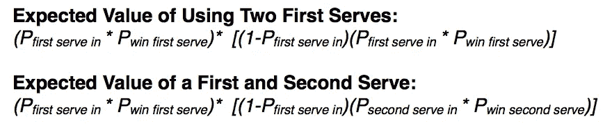
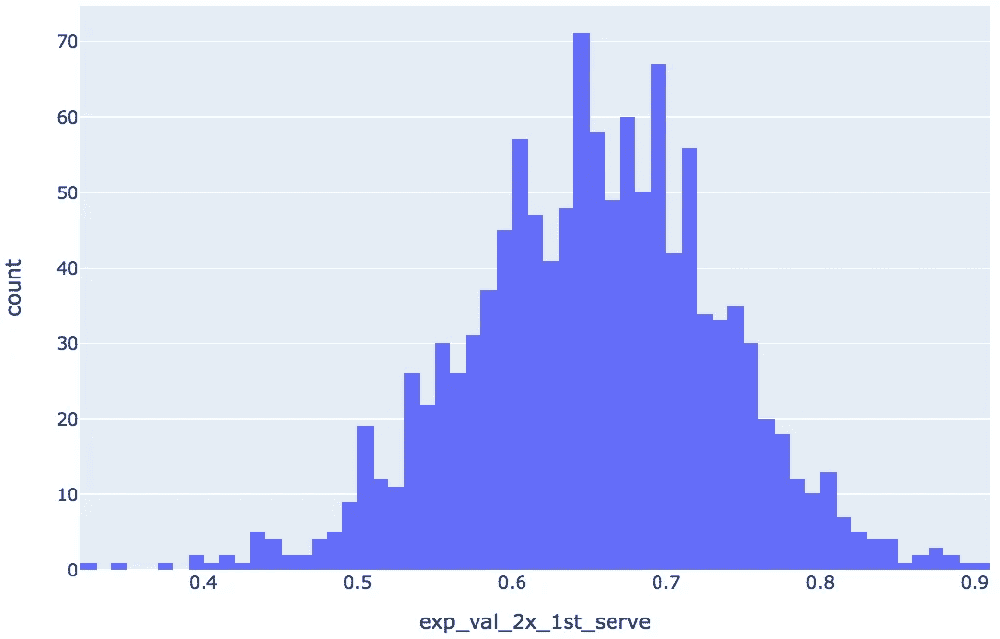
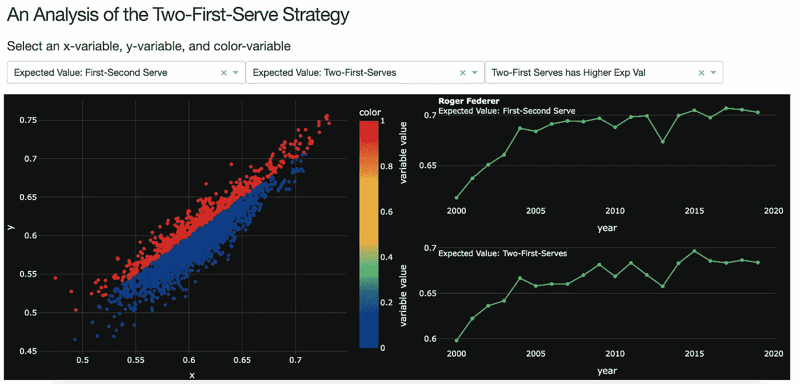
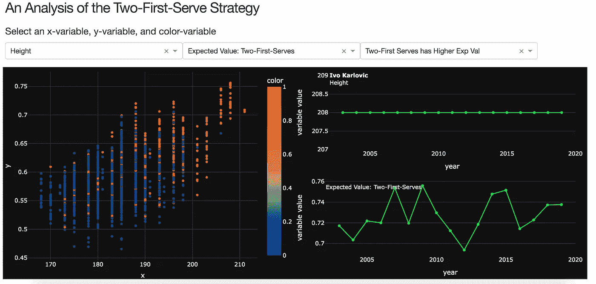

# 两次发球：分析 2000 年至 2020 年的 ATP 发球数据

> 原文：[`towardsdatascience.com/two-first-serves-analyzing-atp-service-data-from-2000-2020-b5cfcdb4901a?source=collection_archive---------6-----------------------#2023-02-03`](https://towardsdatascience.com/two-first-serves-analyzing-atp-service-data-from-2000-2020-b5cfcdb4901a?source=collection_archive---------6-----------------------#2023-02-03)

## 在巡回赛中，哪些球员应该舍弃他们的第二发球及其原因（以及一个用于可视化的 Dash 应用）

 [Sean Holland](https://medium.com/@sean.holland20?source=post_page-----b5cfcdb4901a--------------------------------)

·

[关注](https://medium.com/m/signin?actionUrl=https%3A%2F%2Fmedium.com%2F_%2Fsubscribe%2Fuser%2Fc7c83ac0b074&operation=register&redirect=https%3A%2F%2Ftowardsdatascience.com%2Ftwo-first-serves-analyzing-atp-service-data-from-2000-2020-b5cfcdb4901a&user=Sean+Holland&userId=c7c83ac0b074&source=post_page-c7c83ac0b074----b5cfcdb4901a---------------------post_header-----------) 发布于[Towards Data Science](https://towardsdatascience.com/?source=post_page-----b5cfcdb4901a--------------------------------) · 7 分钟阅读 · 2023 年 2 月 3 日

--

库存图片由[Pixabay](https://pixabay.com/photos/tennis-play-tennis-court-ball-5782695/)提供

在过去十年左右的时间里，数据、分析和机器学习在体育界变得无处不在。同时，非传统的策略也在体育界越来越受欢迎。在足球中，四分之一尝试和两分转换尝试有所上升，因为分析证明了这些策略的增值。2021 年，[四分之一尝试达到了 793 次的高峰](https://www.sportingnews.com/us/nfl/news/nfl-fourth-down-conversion-chart-rate-by-distance/vofkeub6xwms6imajxqkfipp)，比 2011 年增长了超过 70%。在篮球中，长距离两分球几乎[已经消失](https://fivethirtyeight.com/features/what-if-kevin-garnett-and-tracy-mcgrady-had-shot-threes-instead-of-long-twos/)，因为分析专家已证明了角球三分球和上篮的期望价值更高。

就像篮球和足球在数据方面为战术和策略的改变提供了肥沃的土壤一样，我的业余爱好网球也是如此。对大多数网球职业选手来说，体育分析的价值在于[对手侦查](https://www.tennis.com/news/articles/the-role-of-analytics-in-tennis-is-on-a-long-slow-rise)。使用对手的统计数据可以告诉球员在攻击对手的反手球、迫使他们从底线打长时间的对拉球或试图将他们引向网前等方面，什么样的策略可能是最佳的。然而，职业选手仍然有机会利用该运动产生的大量数据，从传统的发球百分比统计到通过视觉 AI 应用获取的更高级的球员位置统计数据。

去年在我加入一个本地网球联赛、结束了四年的空窗期后，我意识到一个分析网球数据的机会。在我前几场比赛中，我发现虽然我的第一次发球经常出界，但我的对手能够攻击我的弱第二发。在经历了过多的破发点后，我自问*我是否更应该放弃第二发球，改用第一次发球两次呢？*

前提非常简单。在网球中，发球员具有优势，因为他们可以开始回合——这赋予了他们在球的放置位置和击球旋转类型等方面的战略选择。发球也是网球中最快的击球之一，ATP 巡回赛的球员经常达到大约[120 MPH (193 KM/H)](https://tenniscreative.com/fastest-tennis-serve/)的速度。不仅如此，发球员还有*两次*机会发球，以防第一次失误。

大多数球员，无论是业余还是职业球员，都使用两种不同的发球。实际上，网球的发球策略基于一个相当简单的原则。球员通常利用首发球打出更快、更有利的落点，例如在场地边线或“网眼”处的中线位置，以获取优势，迫使对手回球薄弱，将对手推入不利的位置，或者通过发球直接得分赢得分数。第二发球则通常打得更为安全。球员倾向于将球打得更慢，并在具有更高失误容限的区域进行发球。球员仍然会尝试通过控制对手的场地位置来获取优势，但这种优势通常比成功的首发球要小。

现在，让我们来讨论一下球员是否会从两次使用首发球中受益。这并不是一个特别难回答的问题，它只需要四个变量：

1.  **首发球成功率：** 首发成功并因此开始得分的百分比；

1.  **首发球赢分率：** 球员在成功发入首发球后赢得的分数的百分比；

1.  **第二发球成功率：** 第二发球成功并因此开始得分的百分比；

1.  **第二发球成功率：** 球员在成功发入第二发球后赢得的分数的百分比。双误会影响球员的第二发球成功率。

这引出了一个关键问题：使用两次首发球的期望值*E(p)*是否大于或小于传统首发和第二发球策略的期望值？

图 1：网球发球的期望值公式（作者创建的截图）

为了回答发球策略的问题，我分析了由[TennisAbstract.com](http://www.tennisabstract.com/cgi-bin/player.cgi?p=JeffSackmann)创始人 Jeff Sackmann 提供的优秀数据（感谢 Jeff 允许使用他的数据撰写这篇文章）。我从[Jeff 的 GitHub](https://github.com/JeffSackmann/tennis_atp)中提取了数据，并合并了 2000 年至 2020 年的数据集。本文其余部分的分析使用了 Python 生成。

数据集详细列出了在时间范围内所有 ATP 单打比赛的信息，包括比赛和场地。然而，我的主要关注点是发球数据（即，首发成功率、发球直接得分、双误等）。此外，由于 ATP 是男子巡回赛，这些数据仅针对男性球员。我打算将 WTA 数据添加到此分析和 Dash 应用程序中。

**分析**

为了不掩盖重点，直截了当的说：在 2000 年至 2020 年间，ATP 巡回赛中有高达五分之一的球员采用双发球策略会更有利。我不是托尼叔叔，但 20%的球员从采用更具攻击性的发球策略中受益，似乎是一个相当大的市场低效。

在准备数据时，我采取的第一步——除了创建我们的关键变量如发球成功率——是将观察结果滚动到球员级别。在比赛级别，由于方差过大，难以推断出全面的发球策略。下图 2 是拉斐尔·纳达尔每场比赛使用双发球策略的预期值直方图。请注意，即使是伟大的网球选手之一，纳达尔的预期值也有相当大的变化。

25 百分位数：60% | 平均值：65% | 75 百分位数：.71%（图表由作者使用 Plotly 生成）

为了进一步展示这种差异，我比较了比赛级别和球员级别的数据。我发现，在任何给定的比赛中，大约 35%的球员如果使用双发球策略会表现更好。然而，当查看每位球员的职业生涯数据时，只有 24%的球员使用双发球会更有利。当我对至少打了 50 场比赛的球员进行子集分析时，这一比例进一步下降到 20%。

**Dash 应用程序**

为了更深入了解球员发球百分比的因素、决定因素和协变量，我使用 Heroku 构建并部署了一个 Dash 应用程序。对初学者来说，Dash 是一个强大的工具，允许用户创建自定义仪表盘，而 Heroku 是一个平台即服务的云平台，允许个人用户部署简单的应用程序。

[我为此分析创建的仪表盘](https://atp-serve-dash.herokuapp.com/)恰到好处地很简单。用户选择 x、y 和颜色变量。默认的 x 和 y 变量分别是单发球策略的预期值和双发球策略的预期值。下图捕捉了这个图表。

图 2：发球策略比较（截图由作者创建）

红色编码的点表示那些双发球策略的预期值高于当前单发球策略的球员。上图虽然信息丰富，但它实际上只是告诉我们谁可能从这种策略中受益。如果我想知道*什么*因素使得球员更可能从双发球策略中受益呢？

图 3：身高与最佳发球策略的关系（截图由作者创建）

多年来，分析师们已经认识到身高是成功服务的一个关键因素。即使是普通的球迷也许还记得约翰·伊斯内尔，他与尼古拉斯·马胡特的 11 小时 5 分钟对决打破了比赛时长纪录。伊斯内尔身高 6 英尺 10 英寸，在比赛的决胜盘中主宰了自己的发球局，未失一个破发点。而这些数据也证实了网球分析师的普遍智慧和伊斯内尔自身的经历。观察身高与双发球策略之间的关系，那些对这种策略最有利的似乎是运动中的巨人。另一位身高巨大的 ATP 职业选手伊沃·卡尔洛维奇（巧合的是也因长时间比赛而闻名）在 2009 年以超过 0.75 分的预期值位居榜单首位，使用了双发球策略。

对于运动中的巨人来说，双发球策略的好处在于他们能够在第一次发球成功时赢得分数。2009 年，卡尔洛维奇的第一次发球赢球率接近 85%，显著高于约 71%的样本平均水平。类似地，伊斯内尔的第一次发球赢球率为 82%。如此高的成功率，加上即使是适中的第一次发球百分比——即球员能够用第一次发球将球投入比赛的比例——通常足以使发球者在双发球策略下达到更高的预期得分值。

**结论**

那么，这对 ATP 巡回赛中的职业球员意味着什么呢？对于大多数球员来说，影响不大。四分之三的球员仍然保持传统的发球策略。然而，对于剩下的五分之一的球员，特别是那些身高超过 6 英尺 4 英寸（193 厘米）的球员，我建议尝试双发球策略（尽管，我可能不会等到比赛决赛才尝试）。那些在第一次发球时表现出色的球员可能会通过双发球策略给对手施加压力，即使这意味着更频繁地双误。
