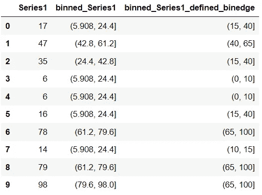

# 你需要知道的两个有趣的 pandas 数据操作函数

> 原文：[`towardsdatascience.com/two-interesting-pandas-data-manipulation-functions-you-need-to-know-5eabd06af56b`](https://towardsdatascience.com/two-interesting-pandas-data-manipulation-functions-you-need-to-know-5eabd06af56b)

## 数据科学

## 极其有用的 pandas 函数可以将连续的 pandas 列转换为分类列。

[](https://medium.com/@17.rsuraj?source=post_page-----5eabd06af56b--------------------------------)[](https://towardsdatascience.com/?source=post_page-----5eabd06af56b--------------------------------) [Suraj Gurav](https://medium.com/@17.rsuraj?source=post_page-----5eabd06af56b--------------------------------)

·发表于 [Towards Data Science](https://towardsdatascience.com/?source=post_page-----5eabd06af56b--------------------------------) ·阅读时间 7 分钟·2023 年 8 月 24 日

--


照片由 [Brendan Church](https://unsplash.com/@bdchu614?utm_source=medium&utm_medium=referral) 提供，来源于 [Unsplash](https://unsplash.com/?utm_source=medium&utm_medium=referral)

Python pandas 是一个强大且广泛使用的数据分析库。

它提供了 200 多个函数和方法，使数据操作和转换变得容易。然而，了解所有这些函数并在实际工作中按需使用它们并不是一项可行的任务。

数据操作中的常见任务之一是将包含连续数值的列转换为包含离散或分类值的列。pandas 有两个了不起的内置函数，可以节省你几分钟时间。

你可以将这种类型的数据转换用于各种应用，如分组数据、按离散组分析数据或使用直方图可视化数据。

例如，

> 最近，我计算了[赫芬达尔-赫希曼指数 (HHI)](https://www.investopedia.com/terms/h/hhi.asp)以了解多个品牌的市场集中度。因此，在一个 pandas DataFrame 中，我有一个包含所有品牌 HHI 连续值的列。最终，我想将这一列转换为离散列，以将每个品牌分类为低、中和高市场集中度——**这就是我获得灵感的地方。**

如果不知道这些内置的 pandas 函数，你可能需要编写多个 *if-else* 和 *for* 语句来完成相同的工作。

因此，在这里你将探索两个超级有用的 pandas 内置函数以及有趣的示例（*包括我的项目*），这些示例将大大提升你的数据分析能力，并节省你几分钟时间。

在你的分析项目中，通常需要将一个具有连续值的列转换为另一个具有离散值的列。

所以基本上，你将连续数据分类为几个类别，即桶或箱子。你可以通过指定每个箱子的最小值和最大值，即定义箱子边缘，或通过指定箱子数量来做到这一点。

根据你将连续序列拆分为离散序列的目的，你可以使用 **接下来的两种** 方法之一。

由于我对工作中的内置函数感到好奇，首先我遇到了 pandas 库中的 `cut()` 函数。

# pandas cut()

当你想将数据分成固定数量的不同桶时，可以使用 pandas **cut()**，无论每个桶中的值的数量如何。

根据 pandas 官方文档，`**pandas.cut()**` 函数有 7 个可选参数和 2 个必需参数。

但你不需要记住所有这些。

我已经为你简化了内容。我现在经常使用这个函数，发现一些函数参数比其他参数更有用。

这里是你在几乎 **90% 的情况下** 会使用的常用可选参数。

```py
pandas.cut(x,
           bins,
           labels=None,
           right=True,
           include_lowest=False)
```

让我们举一个例子来理解这些参数是如何工作的。

假设你有以下连续序列，你想将其转换为 5 个箱子。

```py
import pandas as pd
import numpy as np

# Create random data
Series1 = pd.Series(np.random.randint(0, 100, 10))

# Create DataFrame
df = pd.DataFrame({"Series1": Series1})

# Apply pandas.cut() on the column Series1
df["binned_Series1"] = pd.cut(df["Series1"], bins=5)
```


pandas cut() | 作者图片

你简单地将整数 5 分配给参数 *bin*——结果，pandas 将整个列 *Series1* 拆分为 5 个相等大小的桶。Pandas 将 *Series1* 中的每个值分配到这 5 个桶中的一个。

如果你检查这些桶中的每一个，你会发现两个共同点。

1.  箱子边缘是非整数——你可以通过在 bin 参数中定义箱子边缘来解决这个问题。

1.  每个箱子边缘在右侧是封闭的——这是由于参数 right 的默认设置 `right=True`。这意味着 pandas 包括桶中的最大值在同一个桶中。

    这个参数特别帮助你 **控制分箱过程**，并且切换其值可以帮助你包括或排除某些元素。

让我们再试一次。

这次你将传递一个箱子边缘的列表给相同的 DataFrame 列，看看结果是如何变化的。

```py
df["binned_Series1_defined_binedge"] = pd.cut(df["Series1"],
                                              bins=[0, 10, 15, 40, 65, 100])
```



pandas cut 定义了箱子边缘 | 作者图片

Pandas 使用你在 *bin* 参数中提供的整数简单地创建了新的箱子，并将 *Series1* 中的每个数字分配到这些箱子中。

此外，你还可以使用 *Label* 参数为每个桶命名，如下所示。

```py
df["bin_name"] = pd.cut(df["Series1"],
                        bins=[0, 10, 15, 40, 65, 100],
                        labels=['bin 1', 'bin 2', 'bin 3', 'bin 4', 'bin 5'])
```


pandas cut() 带有箱子标签 | 作者图片

它工作得非常完美！

回到我的工作——**一个真实场景**——我在下面的数据集上尝试了函数 `**pandas.cut()**`。

```py
# Create a sample DataFrame as I can not disclose the original data
HHI = [random.random() for i in range(10)]
Brands = ["Brand_1", "Brand_2", "Brand_3", "Brand_4", "Brand_5",
          "Brand_6", "Brand_7", "Brand_8", "Brand_9", "Brand_10"]

df = pd.DataFrame({"brand": Brands, "hhi": HHI})

# Use pandas.cut()
df["binned_hhi"] = pd.cut(df["hhi"], bins=3)
df["brand_bucket"] = pd.cut(df["hhi"], 
                            bins=3, 
                            labels = ["low", "medium", "high"])
df
```


在实际例子中使用 pandas.cut() | 图片由作者提供

然而，这些桶中的元素分布不均，即每个桶包含的元素数量不同。5 个品牌属于*低*，3 个品牌属于*中*，仅 2 个品牌属于*高*浓度桶。

但对于我的项目，我想保持分布，即每个桶中的品牌数量相同，这就是我发现下一个 pandas 方法有用的地方。

# pandas qcut()

`pandas.qcut()`用于在所有桶中获得均等的数据分布。它基于样本分位数的原理。

> 分位数是将序列分成若干个子集的值——每个子集包含大致相同数量的元素。

因此，当你使用函数**qcut()**切分一个序列时，它只是告诉你序列的哪个元素属于哪个分位数。

函数`qcut()`的基本语法几乎与函数`cut()`的语法相同。

让我们通过一个例子来理解——在这里你将对相同的数据使用函数`cut()`和`qcut()`，并将它们分为 4 个桶。

```py
Series1 = pd.Series([17, 47, 35, 6, 6, 16, 78, 14, 79, 98])
df = pd.DataFrame({"Series1": Series1})

df["qcut_Series1"] = pd.qcut(df["Series1"], q=4) # Use qcut()
df["cut_Series1"] = pd.cut(df["Series1"], bins=4) # Use cut()
```


基于分位数的离散化 Python | 图片由作者提供

现在，当你检查每个桶中的数据分布时——

```py
# Check the data distribution of each bucket when cut() was used
df["cut_Series1"].value_counts()

#Output
(5.908, 29.0]    5
(75.0, 98.0]     3
(29.0, 52.0]     2
(52.0, 75.0]     0
Name: cut_Series1, dtype: int64

# Check the data distribution of each bucket when qcut() was used
df["qcut_Series1"].value_counts()

#Output
(5.999, 14.5]    3
(70.25, 98.0]    3
(14.5, 26.0]     2
(26.0, 70.25]    2
Name: qcut_Series1, dtype: int64 
```

你会看到，当你使用函数`**cut()**`时，尽管每个桶的大小相等，即 23，但每个桶中包含的元素数量不同。

而当你使用函数`**qcut()**`时，每个桶中存在类似数量的元素。但你可以看到，这种分布是以不同的桶大小为代价的。

因此，在我的项目中，函数`pandas.qcut()`是最终解决方案，正如你所看到的——

```py
df["binned_hhi_qcut"] = pd.qcut(df["hhi"], q=3)
df["brand_bucket_qcut"] = pd.qcut(df["hhi"], 
                            q=3, 
                            labels = ["low", "medium", "high"])
df
```


使用 pandas.qcut()的实际场景 | 图片由作者提供

因此，`**qcut()**`将每个*中*和*高*浓度桶分配了 3 个品牌，将*低*浓度桶分配了 4 个品牌。

希望你发现这篇文章既清新又有用。尽管将连续序列转换为离散序列是数据分析中的常见场景，但如果你不了解内置函数，这项任务确实可能非常艰巨。

在数据分析项目中使用这些函数，肯定能帮助你迅速从数据中提取所需的信息。

> 在**评论**中告诉我你希望获得哪些精彩的文章！

仅仅了解这些函数是不够的——现在就开始在数据分析任务中使用它们，释放真正的 pandas 力量吧。

> 准备提升你的数据分析技能了吗？

💡 考虑[**成为 Medium 会员**](https://medium.com/@17.rsuraj/membership)以**访问无限**的 Medium 故事和每日有趣的 Medium 摘要。我将获得你费用的一小部分，对你没有额外费用。

💡 确保[**注册我的邮件列表**](https://medium.com/subscribe/@17.rsuraj)，以便不错过任何关于数据科学指南、技巧和提示、SQL 和 Python 的文章。

> 了解更多关于我的项目，请评论你的问题！

感谢你的阅读！
