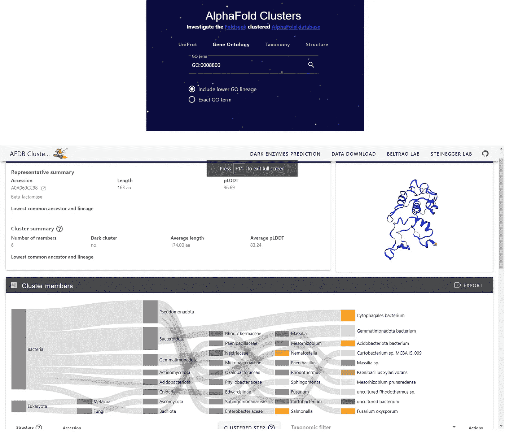

# 两篇新论文详细分析了 AlphaFold 2 的 2 亿个模型揭示的蛋白质宇宙

> 原文：[`towardsdatascience.com/two-new-papers-analyze-in-detail-the-protein-universe-unveiled-by-alphafold-2s-200-million-models-bf5bd55e754a`](https://towardsdatascience.com/two-new-papers-analyze-in-detail-the-protein-universe-unveiled-by-alphafold-2s-200-million-models-bf5bd55e754a)

## 他们不得不创建新的工具来处理如此大规模的蛋白质结构模型

 [LucianoSphere (Luciano Abriata, PhD)](https://lucianosphere.medium.com/?source=post_page-----bf5bd55e754a--------------------------------)

·发表于[Towards Data Science](https://towardsdatascience.com/?source=post_page-----bf5bd55e754a--------------------------------) ·阅读时间 7 分钟·2023 年 9 月 21 日

--

在讨论的文章中展示的资源之一，[`uniprot3d.org/`](https://uniprot3d.org/)，描绘了一个现代化的宇宙视图，其中较亮的簇包含更多的成员。用户可以缩放查看相关蛋白质，点击特定节点会显示有关 Uniprot 中蛋白质家族的信息（此处仅显示结构模型）。图片由作者在浏览网站时制作。

**DeepMind 的 AlphaFold 2 与欧洲生物信息学研究所合作发布了超过 2 亿个预测蛋白质结构，标志着蛋白质研究进入了一个新时代。在这里，我总结了本周在*Nature*上发表的两篇开创性论文的发现，这些论文深入探讨了这一蛋白质宇宙的深度。这些论文采用了创新的聚类算法、结构比较和现有工具的其他适配方法，以处理大数据量，从而揭示了前所未有的蛋白质结构多样性、进化关系和功能潜力。**

蛋白质是生物学中的“工作马”，支配着从能量生成到细胞分裂的无数细胞过程。尽管随着基因组学的发展，蛋白质测序在近年来迅速增长，但由于缺乏可扩展的实验方法，它们的 3D 结构确定却滞后。然而，随着 DeepMind 开发的革命性 AI 系统 AlphaFold 2 的出现，蛋白质结构预测的格局发生了变化。AlphaFold 蛋白质结构数据库（AFDB）现在拥有惊人的 2 亿个预测蛋白质结构，标志着计算生物学的一个里程碑。

 ## 基于 AlphaFold 的数据库和全面成熟、易于使用的在线 AlphaFold 接口即将...

### 不仅是计算生物学，还有实验生物学。对生物学中数据科学领域未来的思考。

[towardsdatascience.com

事实上，就在本周，两组作者在*自然*杂志上报告了如何利用 AlphaFold 2 的蛋白质模型来揭示蛋白质宇宙的新见解。这些研究利用了现有工具的创新版本，这些工具被调整以适应 AFDB 中的大量数据；例如，现代版本的聚类算法和结构比较方法。通过这些调整后的工具，这些研究探讨了蛋白质结构的广阔领域、它们的进化起源以及它们的功能意义。

# 聚类

在任何涉及过多对象的研究中，这些对象中许多将紧密相关甚至非常相似，聚类有助于降低复杂性。蛋白质结构也不例外。

在第一篇文章中，Inigo Barrio-Hernandez 及其同事的《在已知蛋白质宇宙规模上的聚类预测结构》中，作者们面对的是将 AFDB 中的 2 亿个蛋白质结构进行聚类的巨大任务。他们介绍了一种基于结构对齐的高效聚类算法，称为 Foldseek cluster。这种新颖的算法能够根据蛋白质的结构相似性快速进行分组，这是理解蛋白质进化和功能的关键步骤。

这项研究的结果非常显著。作者在 AFDB 中识别出了令人惊讶的 230 万个非单例结构簇，其中 31%的簇缺乏注释，代表了之前未被特征化的蛋白质结构。这些未注释的簇虽然只占 AFDB 中所有蛋白质的 4%，却为蛋白质宇宙中尚未发现的领域提供了有趣的见解。进化分析表明，大多数这些簇具有古老的起源，而一部分则似乎是特定于物种的，可能标志着较低质量的预测或 de novo 基因出生的实例。

此外，研究展示了结构比较在预测结构域家族及其关系中的实用性。值得注意的是，作者识别出遥远的结构相似性，揭示了蛋白质之间隐藏的联系。这一新发现知识的一个重要应用是识别具有潜在遥远同源性的与人类免疫相关的蛋白质，展示了这一资源在揭示蛋白质功能和生命树上进化的巨大潜力。

[## Clustering-predicted structures at the scale of the known protein universe - Nature](https://www.nature.com/articles/s41586-023-06510-w?source=post_page-----bf5bd55e754a--------------------------------)

### 蛋白质是所有细胞过程的关键，其结构在理解其功能和……

[www.nature.com](https://www.nature.com/articles/s41586-023-06510-w?source=post_page-----bf5bd55e754a--------------------------------)

# 新的家族和结构

第二篇文章，“揭示自然蛋白质宇宙中的新家族和结构”，如本文的封面图所示，由 Janani Durairaj 及其合作者撰写，重点转向利用 AlphaFold 的预测探索蛋白质宇宙中的‘暗物质’。作者创建了一个互动的序列相似性网络，连接了 AFDB 中超过 5000 万种准确预测的蛋白质结构。这个网络作为揭示蛋白质多样性隐藏面貌的强大工具。

这项研究的一个突出发现是识别出了一个新型蛋白质结构，恰如其分地命名为‘Beta-flower’。这一以前未见的结构特征由类似花瓣的发夹型转折组成，类似于 Beta-barrel，为研究人员提供了一个令人兴奋的谜题待解。具有 Beta-flowers 的蛋白质虽关系较远，但其功能仍然未解，突显了未来研究的无限机遇。

此外，作者通过添加多个蛋白质家族扩展了 Pfam 数据库，强调了他们发现的实际应用。值得注意的是，他们实验验证了一种新的翻译靶向毒素-抗毒素系统超家族 TumE-TumA，突显了大规模识别和注释新蛋白质家族的巨大潜力。

[## 发现自然蛋白质宇宙中的新家族和折叠 - 自然

### 我们现在进入了一个蛋白质序列和结构注释的新纪元，数亿个预测的……

www.nature.com](https://www.nature.com/articles/s41586-023-06622-3?source=post_page-----bf5bd55e754a--------------------------------)

# 变革性和实用性

AlphaFold 2 无疑具有变革性，在大规模运行时为科学提供了工作。但如同这两篇新的*Nature*论文中所做的那样，分析大量的结构模型也是一项艰巨的任务，这次直接聚焦于将结构模型整理成可以被科学家轻松使用的形式。

确实，Durairaj 及其合作者的工作最终形成了他们称之为“蛋白质宇宙图谱”的网页资源，这个资源提供了蛋白质序列相似性网络的互动视图，提供有关蛋白质多样性、社区组织、功能注释和结构异常的见解。你可以访问该资源[`uniprot3d.org/`](https://uniprot3d.org/)来通过互动浏览和缩放，查询 UniProtKB 条目，列出组件和社区，查看蛋白质序列和结构模型等。该资源促进了蛋白质宇宙的探索，揭示了新的蛋白质家族、折叠和功能见解，从而直接促进了结构研究。它提供了一些数据可视化功能，例如通过对节点进行上色以增强数据可视化。正如任何这样的资源应该有的那样，数据下载也可用，并提供各种格式。

放大蛋白质宇宙中的“社区”并将其与实际的 Uniprot 条目和信息连接起来。作者截图。

Barrio-Hernandez 及其同事的工作最终形成了一个实用的网页资源（[`cluster.foldseek.com/`](https://cluster.foldseek.com/)），这次专注于浏览和展示有关已识别蛋白质簇的信息，并提供数据下载服务。

欢迎界面和某一条目的示例簇信息。作者截图。

这里讨论的两篇文章标志着蛋白质科学的一个变革性时刻。特别是，它们紧密相关，处理相同的输入数据（AlphaFold 模型），提供相关但互补的分析，并且互相超链接。是的，还一起发表在*自然*期刊上。

通过 AlphaFold 2 提供的 2 亿个预测蛋白质结构的可用性，催生了探索蛋白质宇宙的创新方法。通过对这些结构进行聚类和比较，科学家们正在发现蛋白质多样性、进化和功能方面前所未有的见解。新折叠和蛋白质家族的发现，以及远程结构相似性的揭示，有望彻底改变我们对生命分子机制的理解。

正如我在传播文章中已经写过几次的那样，结构生物学中没有比现在更激动人心的时刻了，而这一切都是由于其与计算机科学，特别是人工智能的交叉。AlphaFold 数据库凭借其丰富的结构信息，已经成为全球科学家们的强大资源。通过每一项研究，我们揭示了生命复杂画卷中的新层次，使我们更接近理解蛋白质宇宙的奥秘。

# 进一步阅读

如果你对结构生物学和结构生物信息学中的人工智能世界感兴趣，以及 DeepMind 通过 AlphaFold 2 启动的所有迷人科学，以下是（仅）一些我撰写的文章，旨在以易于理解但严谨的方式传达所有最新发展：

[## 这里是我所有关于蛋白质建模、CASP 和 AlphaFold 2 的同行评审和博客文章

### 我在这里汇总了所有经过同行评审的文章（包括一些论文、几篇综述、一篇观点文章）和关于...

[lucianosphere.medium.com](https://lucianosphere.medium.com/here-are-all-my-peer-reviewed-and-blog-articles-on-protein-modeling-casp-and-alphafold-2-d78f0a9feb61?source=post_page-----bf5bd55e754a--------------------------------)  ## 蛋白质设计中的机器学习时代，概述为四种关键方法

### 由于这些基于人工智能的方法和工具，蛋白质生物技术迎来了如此激动人心的时刻。

towardsdatascience.com

# 版权声明

这里报道的论文和网站内容都在[CC BY 4.0 许可协议](https://creativecommons.org/licenses/by/4.0/)下。图片由作者从这些网站的截图中合成，未使用论文中的任何图像。

[***www.lucianoabriata.com***](https://www.lucianoabriata.com/) *我撰写和拍摄关于我广泛兴趣领域中的一切：自然、科学、技术、编程等。* [***订阅以获取我的新故事***](https://lucianosphere.medium.com/subscribe) ***通过电子邮件****。要* ***咨询小型工作*** *请查看我的* [***服务页面在这里***](https://lucianoabriata.altervista.org/services/index.html)*。你可以* [***在这里联系我***](https://lucianoabriata.altervista.org/office/contact.html)***。***
