# R 中的双因素 ANOVA

> 原文：[`towardsdatascience.com/two-way-anova-in-r-c53d7353efe5`](https://towardsdatascience.com/two-way-anova-in-r-c53d7353efe5)

## 了解如何在 R 中进行双因素 ANOVA。你还将学习其目的、假设、假设条件以及如何解释结果。

[](https://antoinesoetewey.medium.com/?source=post_page-----c53d7353efe5--------------------------------)[](https://towardsdatascience.com/?source=post_page-----c53d7353efe5--------------------------------) [安托万·苏特维](https://antoinesoetewey.medium.com/?source=post_page-----c53d7353efe5--------------------------------)

·发布于[数据科学前沿](https://towardsdatascience.com/?source=post_page-----c53d7353efe5--------------------------------) ·23 分钟阅读·2023 年 6 月 19 日

--


图片来源：[内森·杜姆劳](https://unsplash.com/@nate_dumlao?utm_source=medium&utm_medium=referral)

# 介绍

双因素 ANOVA（方差分析）是一种统计方法，**允许评估两个** [**分类**](https://statsandr.com/blog/variable-types-and-examples/#qualitative) **变量对** [**定量连续**](https://statsandr.com/blog/variable-types-and-examples/#continuous) **变量的同时影响**。

双因素 ANOVA 是单因素 ANOVA 的扩展，因为它允许评估**两个**分类变量对数值响应的影响。双因素 ANOVA 相对于单因素 ANOVA 的优势在于我们可以测试两个变量之间的关系，同时考虑第三个变量的影响。此外，它还允许包括两个分类变量对响应的可能*交互作用*。

双因素 ANOVA 相对于单因素 ANOVA 的优势与[多元线性回归](https://statsandr.com/blog/multiple-linear-regression-made-simple/)相对于[相关性](https://statsandr.com/blog/correlation-coefficient-and-correlation-test-in-r/)的优势类似：

+   相关性测量两个定量变量之间的关系。多元线性回归也测量两个变量之间的关系，但这次考虑了其他协变量的潜在影响。

+   单因素 ANOVA 测试定量变量在各组之间是否存在差异。双因素 ANOVA 也测试定量变量在各组之间是否存在差异，但这次考虑了另一个定性变量的影响。

之前，我们讨论了 [单因素方差分析在 R 中的应用](https://statsandr.com/blog/anova-in-r/)。现在，我们展示了在 R 中执行**两因素**方差分析的时机、原因和方法。

在继续之前，我想提及并简要描述一些相关的统计方法和测试，以避免任何混淆：

[学生 t 检验](https://statsandr.com/blog/student-s-t-test-in-r-and-by-hand-how-to-compare-two-groups-under-different-scenarios/)用于评估一个分类变量对定量连续变量的影响，**当分类变量恰好有 2 个水平**时：

+   如果观察值是**独立**的（例如：比较女性和男性的年龄），则使用学生 t 检验 *针对独立样本*。

+   如果观察值是**依赖**的，即成对出现（例如，当相同的受试者在两个不同时间点进行两次测量时，前后测量），则使用学生 t 检验 *针对配对样本*。

为了评估一个分类变量对定量变量的影响，**当分类变量有 3 个或更多水平**时：[1](https://statsandr.com/blog/two-way-anova-in-r/#fn1)

+   [*单因素方差分析*](https://statsandr.com/blog/anova-in-r/)（通常简称为 ANOVA）如果组是**独立**的（例如，一个接受治疗 A 的患者组，一个接受治疗 B 的患者组，以及一个没有接受治疗或接受安慰剂的患者组）。

+   *重复测量方差分析* 如果组是**依赖**的（例如，当相同的受试者在三个不同时间点进行三次测量时，治疗前、治疗中和治疗后）。

两因素方差分析用于评估 2 个分类变量（及其潜在交互作用）对定量连续变量的影响。这是本文的主题。

[线性回归](https://statsandr.com/blog/multiple-linear-regression-made-simple/)用于评估定量连续因变量与一个或多个自变量之间的关系：

+   如果只有一个自变量（可以是定量或定性），则为简单线性回归。

+   如果至少有两个自变量（可以是定量、定性或两者的混合），则为多元线性回归。

ANCOVA（协方差分析）用于评估分类变量对定量变量的影响，同时控制另一个定量变量（称为协变量）的影响。ANCOVA 实际上是多元线性回归的一种特殊情况，其中包含一个定性和一个定量自变量。

在这篇文章中，我们首先解释了何时以及为何两因素方差分析是有用的，然后进行一些初步的描述性分析，并展示如何在 R 中进行两因素方差分析。最后，我们展示了如何解释和可视化结果。我们还简要提及并说明如何验证基本假设。

# 数据

为了说明如何在 R 中进行双因素 ANOVA，我们使用 `{palmerpenguins}` 包提供的 `penguins` 数据集。

我们不需要 [导入数据集](https://statsandr.com/blog/how-to-import-an-excel-file-in-rstudio/)，但我们需要先 [加载包](https://statsandr.com/blog/an-efficient-way-to-install-and-load-r-packages/)，然后调用数据集：

```py
# install.packages("palmerpenguins")
library(palmerpenguins)
```

```py
dat <- penguins # rename dataset
str(dat) # structure of dataset
```

```py
## tibble [344 × 8] (S3: tbl_df/tbl/data.frame)
##  $ species          : Factor w/ 3 levels "Adelie","Chinstrap",..: 1 1 1 1 1 1 1 1 1 1 ...
##  $ island           : Factor w/ 3 levels "Biscoe","Dream",..: 3 3 3 3 3 3 3 3 3 3 ...
##  $ bill_length_mm   : num [1:344] 39.1 39.5 40.3 NA 36.7 39.3 38.9 39.2 34.1 42 ...
##  $ bill_depth_mm    : num [1:344] 18.7 17.4 18 NA 19.3 20.6 17.8 19.6 18.1 20.2 ...
##  $ flipper_length_mm: int [1:344] 181 186 195 NA 193 190 181 195 193 190 ...
##  $ body_mass_g      : int [1:344] 3750 3800 3250 NA 3450 3650 3625 4675 3475 4250 ...
##  $ sex              : Factor w/ 2 levels "female","male": 2 1 1 NA 1 2 1 2 NA NA ...
##  $ year             : int [1:344] 2007 2007 2007 2007 2007 2007 2007 2007 2007 2007 ...
```

数据集包含 344 只企鹅的 8 个变量，汇总如下：

```py
summary(dat)
```

```py
##       species          island    bill_length_mm  bill_depth_mm  
##  Adelie   :152   Biscoe   :168   Min.   :32.10   Min.   :13.10  
##  Chinstrap: 68   Dream    :124   1st Qu.:39.23   1st Qu.:15.60  
##  Gentoo   :124   Torgersen: 52   Median :44.45   Median :17.30  
##                                  Mean   :43.92   Mean   :17.15  
##                                  3rd Qu.:48.50   3rd Qu.:18.70  
##                                  Max.   :59.60   Max.   :21.50  
##                                  NA's   :2       NA's   :2      
##  flipper_length_mm  body_mass_g       sex           year     
##  Min.   :172.0     Min.   :2700   female:165   Min.   :2007  
##  1st Qu.:190.0     1st Qu.:3550   male  :168   1st Qu.:2007  
##  Median :197.0     Median :4050   NA's  : 11   Median :2008  
##  Mean   :200.9     Mean   :4202                Mean   :2008  
##  3rd Qu.:213.0     3rd Qu.:4750                3rd Qu.:2009  
##  Max.   :231.0     Max.   :6300                Max.   :2009  
##  NA's   :2         NA's   :2
```

在这篇文章中，我们将重点关注以下三个变量：

+   `species`: 企鹅的物种（Adelie，Chinstrap 或 Gentoo）

+   `sex`: 企鹅的性别（雌性和雄性）

+   `body_mass_g`: 企鹅的体重（以克为单位）

如果需要，可以通过在 R 中运行 `?penguins` 来获取关于此数据集的更多信息。

`body_mass_g` 是定量连续变量，将作为因变量，而 `species` 和 `sex` 都是定性变量。

这两个最后的变量将是我们的独立变量，也称为因素。确保它们被 R 读作 [factors](https://statsandr.com/blog/data-types-in-r/#factor)。如果不是这种情况，它们需要被 [转换为因素](https://statsandr.com/blog/data-manipulation-in-r/#factors)。

# 双因素 ANOVA 的目标和假设

如上所述，双因素 ANOVA 用于**同时评估两个分类变量对一个定量连续变量的影响**。

它被称为**双**因素 ANOVA，因为我们比较的组是由**两个**独立的分类变量形成的。

在这里，我们想知道体重是否依赖于物种和/或性别。特别是，我们感兴趣的是：

1.  测量和测试物种与体重之间的关系，

1.  测量和测试性别与体重之间的关系，并且

1.  潜在地检查物种与体重之间的关系是否对雌性和雄性不同（这等同于检查性别与体重之间的关系是否依赖于物种）

前两个关系被称为**主要效果**，而第三点被称为**交互效应**。

主要效果测试是否至少有一个组与另一个组不同（同时控制其他独立变量）。另一方面，交互效应旨在测试两个变量之间的关系是否*依赖于第三个变量的水平*。

在进行双因素 ANOVA 时，测试交互效应不是强制性的。然而，忽略交互效应可能会导致错误的结论，如果交互效应存在的话。

如果我们回到我们的例子，我们有以下 [假设检验](https://statsandr.com/blog/hypothesis-test-by-hand/)：

性别对体重的主要影响：

+   H0: 女性和男性的平均体重相等

+   H1: 女性和男性的平均体重不同

物种对体重的主要影响：

+   H0: 所有 3 个物种的平均体重相等

+   H1：至少有一个物种的体重平均值不同。

性别和物种之间的交互作用：

+   H0：性别和物种之间没有交互作用，意味着物种和体重之间的关系对雌性和雄性相同（同样，性别和体重之间的关系对所有 3 种物种相同）。

+   H1：性别和物种之间存在交互作用，意味着物种和体重之间的关系对雌性和雄性不同（同样，性别和体重之间的关系依赖于物种）。

# 两因素方差分析的假设

大多数统计检验需要一些假设以确保结果有效，而两因素方差分析也不例外。

两因素方差分析的假设与单因素方差分析类似。总结如下：

+   **变量类型**：依赖变量必须是定量连续的，而两个自变量必须是分类的（至少有两个水平）。

+   **独立性**：观察值在组间和组内应相互独立。

+   **正态性**：

+   对于小样本，数据应大致遵循[正态分布](https://statsandr.com/blog/do-my-data-follow-a-normal-distribution-a-note-on-the-most-widely-used-distribution-and-how-to-test-for-normality-in-r/)

+   对于大样本（通常每组/样本 n ≥ 30），不要求正态性（感谢中心极限定理）。

+   **方差齐性**：各组之间的方差应相等。

+   **异常值**：任何组中都不应有显著的[异常值](https://statsandr.com/blog/outliers-detection-in-r/)。

关于这些假设的更多细节可以在[单因素方差分析的假设](https://statsandr.com/blog/anova-in-r/#underlying-assumptions-of-anova)中找到。

现在我们已经看到了两因素方差分析的基本假设，在应用测试和解释结果之前，我们会专门审查这些假设在我们的数据集中的适用性。

# 变量类型

依赖变量体重是[定量连续的](https://statsandr.com/blog/variable-types-and-examples/#continuous)，而两个自变量性别和物种是[定性变量](https://statsandr.com/blog/variable-types-and-examples/#qualitative)（至少有 2 个水平）。

因此，这个假设得到满足。

# 独立性

独立性通常根据实验设计和数据收集方式来检查。

为了简单起见，观察通常是：

+   **独立的**，如果每个实验单元（此处为企鹅）仅测量一次，且观察值来自于一个具有代表性和随机选择的样本部分，或者

+   **依赖的**，如果每个实验单元至少被测量两次（例如，在医学领域，通常在同一受试者上进行两次测量；一次是在治疗前，一次是在治疗后）。

在我们的案例中，体重只在每只企鹅上测量一次，并且在一个具有代表性和随机的样本中测量，因此独立性假设得到满足。

# 正态性

我们在所有子组中都有一个大样本（两个因素水平的每种组合，称为单元）：

```py
table(dat$species, dat$sex)
```

```py
##            
##             female male
##   Adelie        73   73
##   Chinstrap     34   34
##   Gentoo        58   61
```

所以正态性无需检查。

为了完整起见，我们仍然展示如何验证正态性，假如我们有一个小样本。

有几种方法可以测试正态性假设。最常见的方法包括：

+   一个[QQ 图](https://statsandr.com/blog/descriptive-statistics-in-r/#qq-plot)按组或对残差进行，以及/或

+   一个[直方图](https://statsandr.com/blog/descriptive-statistics-in-r/#histogram)按组或对残差进行，以及/或

+   一个[正态性检验](https://statsandr.com/blog/do-my-data-follow-a-normal-distribution-a-note-on-the-most-widely-used-distribution-and-how-to-test-for-normality-in-r/#normality-test)（例如 Shapiro-Wilk 检验）按组或对残差进行。

最简单/最短的方式是通过残差的 QQ 图来验证正态性。要绘制此图，我们首先需要保存模型：

```py
# save model
mod <- aov(body_mass_g ~ sex * species,
  data = dat
)
```

这段代码会进一步解释。

现在我们可以绘制残差的 QQ 图。我们展示两种方法，首先是使用`plot()`函数，其次是使用来自`{car}`包的`qqPlot()`函数：

```py
# method 1
plot(mod, which = 2)
```

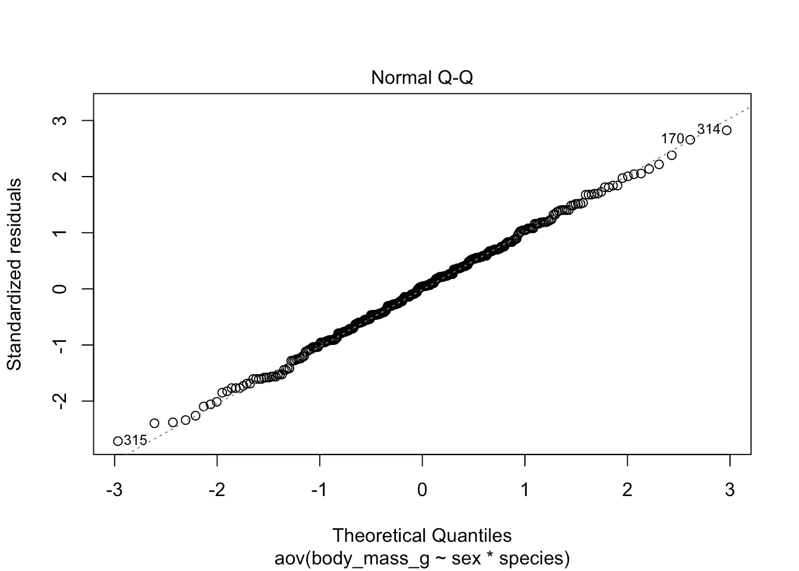

按作者绘图

```py
# method 2
library(car)
```

```py
qqPlot(mod$residuals,
  id = FALSE # remove point identification
)
```

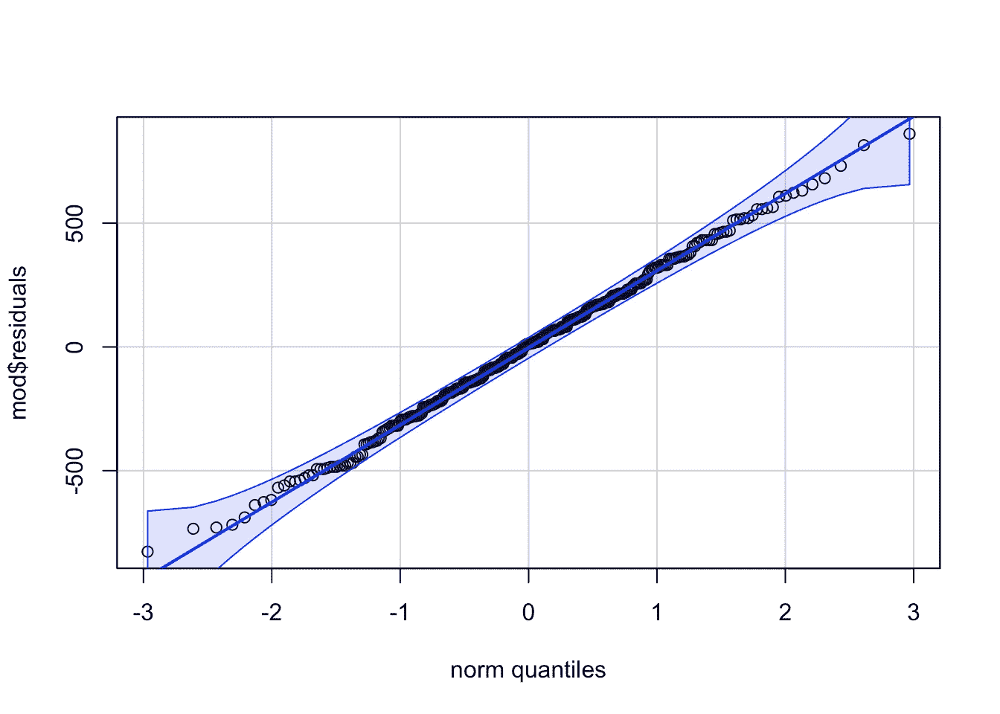

按作者绘图

方法 1 的代码稍短，但缺少参考线周围的置信区间。

如果点沿直线（称为亨利线）分布并且落在置信带内，我们可以假设正态性。在这里是这种情况。

如果你更倾向于通过残差的直方图来验证正态性，这里是代码：

```py
# histogram
hist(mod$residuals)
```

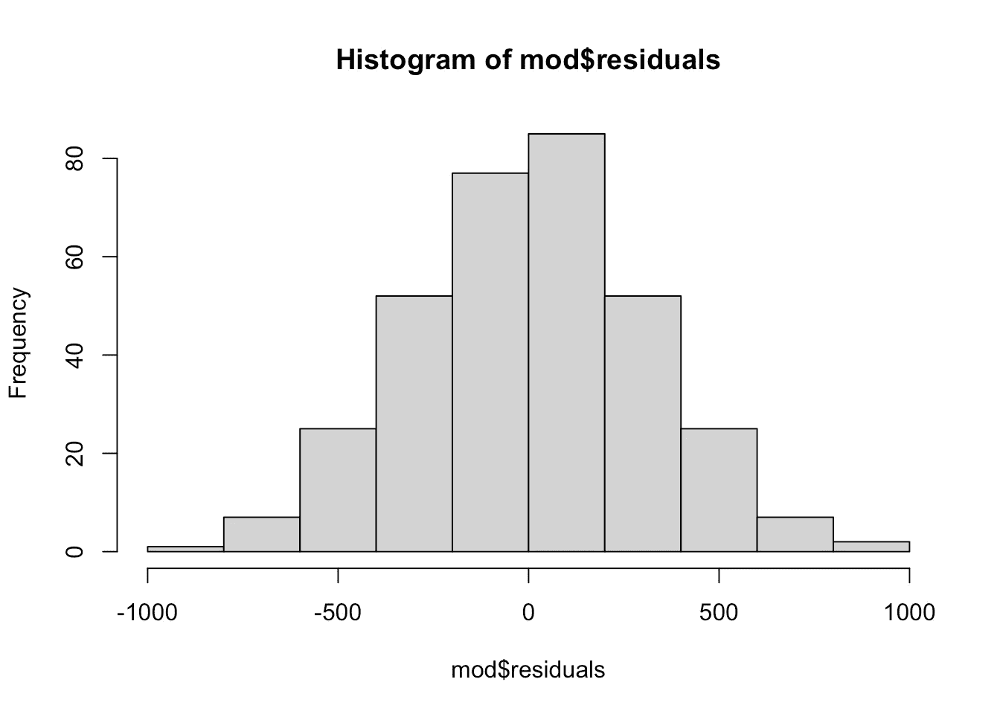

按作者绘图

残差的直方图显示了高斯分布，这与 QQ 图的结论一致。

虽然 QQ 图和直方图在验证正态性方面已基本足够，但如果你希望通过统计检验更正式地测试正态性，可以对残差应用 Shapiro-Wilk 检验：

```py
# normality test
shapiro.test(mod$residuals)
```

```py
## 
## 	Shapiro-Wilk normality test
## 
## data:  mod$residuals
## W = 0.99776, p-value = 0.9367
```

⇒ 我们不拒绝残差服从正态分布的原假设（p 值 = 0.937）。

从 QQ 图、直方图和 Shapiro-Wilk 检验中，我们得出结论，不拒绝残差正态性的原假设。

正态性假设因此得到验证，我们现在可以检查方差的相等性。[2](https://statsandr.com/blog/two-way-anova-in-r/#fn2)

# 方差的同质性

方差的同质性，也称为方差的均匀性或齐性，可以通过`plot()`函数直观地验证：

```py
plot(mod, which = 3)
```

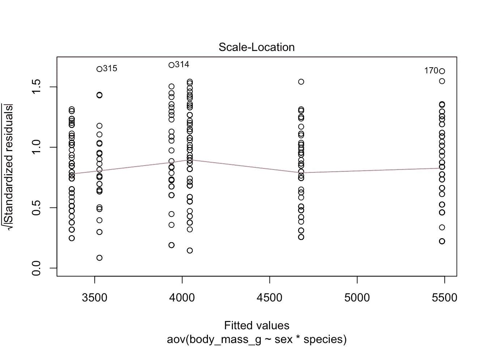

按作者绘图

由于残差的分布是恒定的，红色平滑线是水平和扁平的，因此看起来这里的恒定方差假设得到满足。

上述诊断图足够，但如果你愿意，也可以使用 Levene 检验（也来自`{car}`包）进行更正式的测试：[3](https://statsandr.com/blog/two-way-anova-in-r/#fn3)

```py
leveneTest(mod)
```

```py
## Levene's Test for Homogeneity of Variance (center = median)
##        Df F value Pr(>F)
## group   5  1.3908 0.2272
##       327
```

⇒ 我们未拒绝方差相等的原假设（p 值 = 0.227）。

视觉和正式方法得出了相同的结论；我们未拒绝方差齐性的假设。

# 异常值

检测异常值最简单和最常见的方法是通过组的箱线图进行视觉检查。

对于雌性和雄性：

```py
library(ggplot2)
```

```py
# boxplots by sex
ggplot(dat) +
  aes(x = sex, y = body_mass_g) +
  geom_boxplot()
```

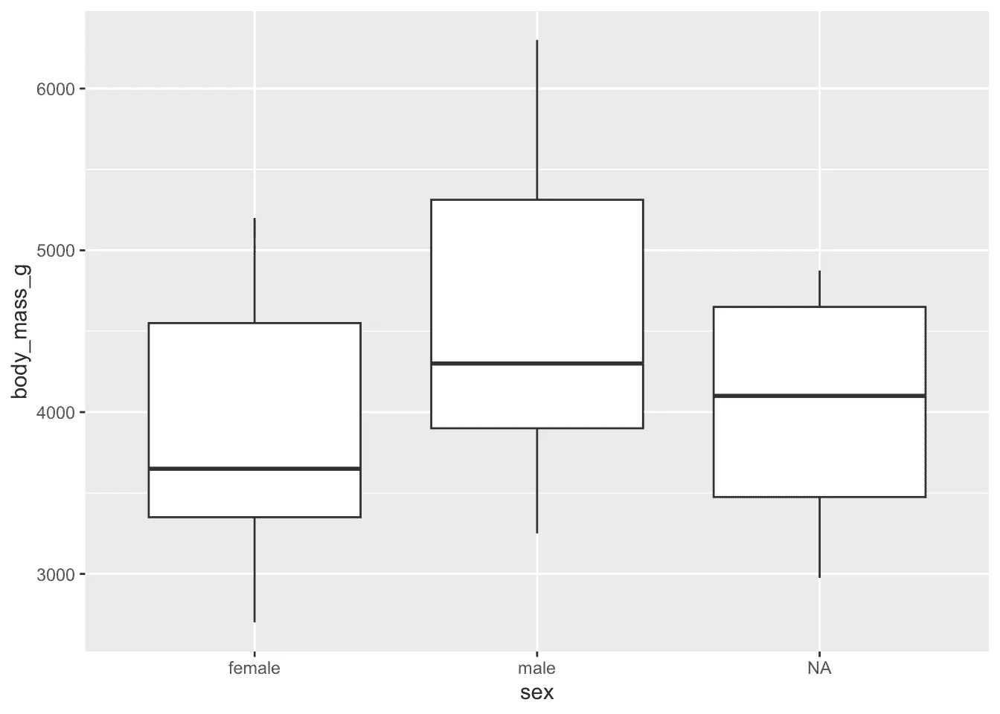

作者绘制

对于三种物种：

```py
# boxplots by species
ggplot(dat) +
  aes(x = species, y = body_mass_g) +
  geom_boxplot()
```

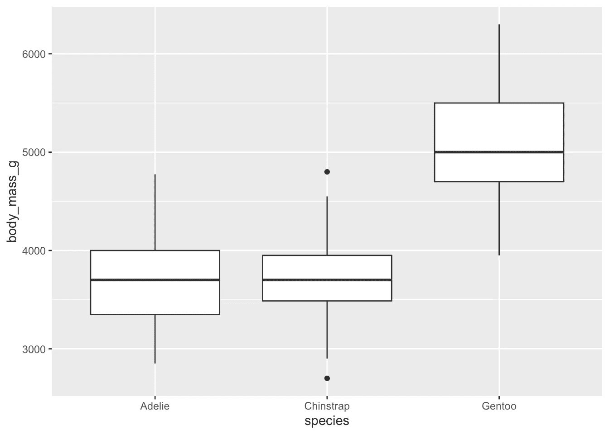

作者绘制

根据[四分位距标准](https://statsandr.com/blog/descriptive-statistics-in-r/#interquartile-range)，物种 Chinstrap 有两个异常值。这些点的极端程度不足以偏倚结果。

因此，我们认为满足无显著异常值的假设。

# 双因素 ANOVA

我们已经展示了所有假设都得到满足，所以现在可以继续在 R 中实施双因素 ANOVA。

这将帮助我们回答以下研究问题：

+   控制物种后，两个性别之间的体重是否存在显著差异？

+   控制性别后，体重在至少一种物种中是否存在显著差异？

+   物种与体重之间的关系在雌性和雄性企鹅中是否不同？

# 初步分析

在进行任何统计测试之前，进行一些[描述性统计](https://statsandr.com/blog/descriptive-statistics-in-r/)是一个好的做法，以便对数据有一个初步的了解，并且可能对预期结果有所了解。

这可以通过描述性统计或图形完成。

# 描述性统计

如果我们想保持简单，我们可以只计算每个子组的均值：

```py
# mean by group
aggregate(body_mass_g ~ species + sex,
  data = dat,
  FUN = mean
)
```

```py
##     species    sex body_mass_g
## 1    Adelie female    3368.836
## 2 Chinstrap female    3527.206
## 3    Gentoo female    4679.741
## 4    Adelie   male    4043.493
## 5 Chinstrap   male    3938.971
## 6    Gentoo   male    5484.836
```

或者最终，使用`{dplyr}`包计算每个子组的均值和[标准差](https://statsandr.com/blog/descriptive-statistics-by-hand/#standard-deviation)：

```py
# mean and sd by group
library(dplyr)
```

```py
group_by(dat, sex, species) %>%
  summarise(
    mean = round(mean(body_mass_g, na.rm = TRUE)),
    sd = round(sd(body_mass_g, na.rm = TRUE))
  )
```

```py
## # A tibble: 8 × 4
## # Groups:   sex [3]
##   sex    species    mean    sd
##   <fct>  <fct>     <dbl> <dbl>
## 1 female Adelie     3369   269
## 2 female Chinstrap  3527   285
## 3 female Gentoo     4680   282
## 4 male   Adelie     4043   347
## 5 male   Chinstrap  3939   362
## 6 male   Gentoo     5485   313
## 7 <NA>   Adelie     3540   477
## 8 <NA>   Gentoo     4588   338
```

# 图形

如果你是博客的常读者，你知道我喜欢绘制图形来可视化数据，然后再解释测试结果。

当我们有一个定量变量和两个定性变量时，最合适的图形是按组绘制的[箱线图](https://statsandr.com/blog/descriptive-statistics-in-r/#boxplot)。这可以很容易地使用`[{ggplot2}](https://statsandr.com/blog/graphics-in-r-with-ggplot2/)` [包](https://statsandr.com/blog/graphics-in-r-with-ggplot2/)制作：

```py
# boxplot by group
library(ggplot2)
```

```py
ggplot(dat) +
  aes(x = species, y = body_mass_g, fill = sex) +
  geom_boxplot()
```

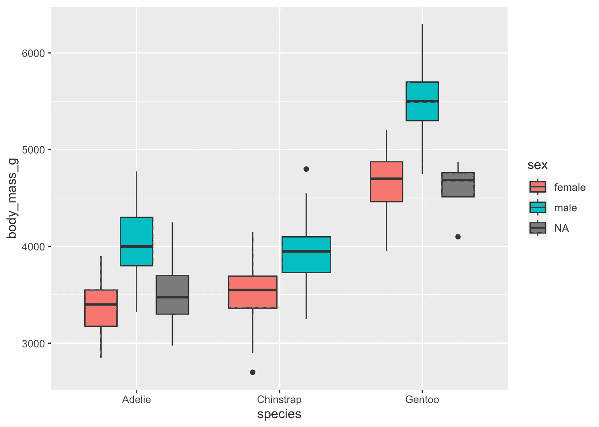

作者绘制

性别的一些观察值缺失，我们可以将它们删除以获得更简洁的图形：

```py
dat %>%
  filter(!is.na(sex)) %>%
  ggplot() +
  aes(x = species, y = body_mass_g, fill = sex) +
  geom_boxplot()
```

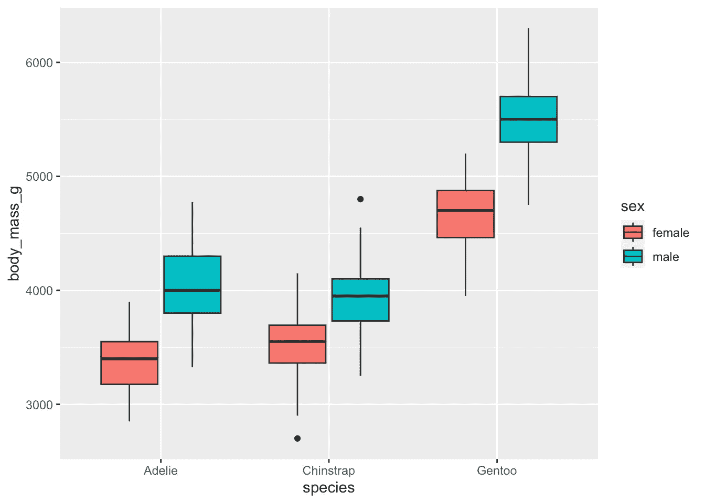

作者绘制

请注意，我们也可以绘制以下图形：

```py
dat %>%
  filter(!is.na(sex)) %>%
  ggplot() +
  aes(x = sex, y = body_mass_g, fill = species) +
  geom_boxplot()
```

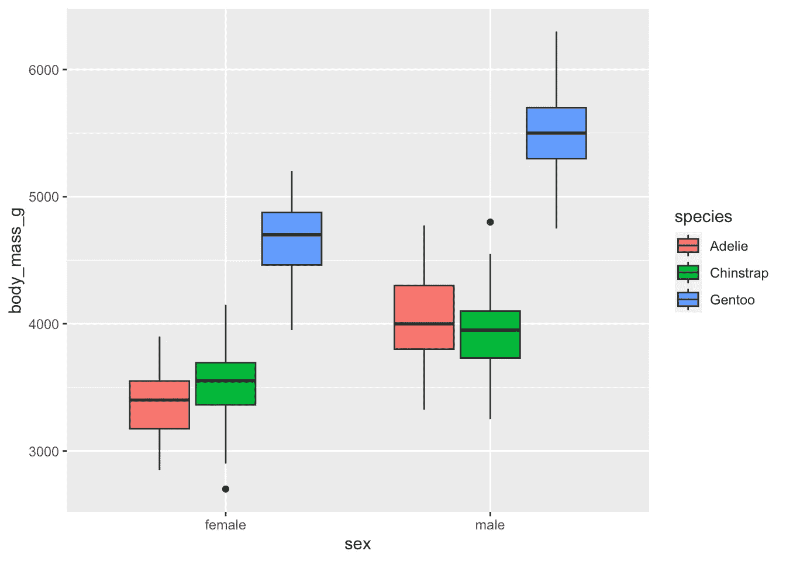

作者绘图

但为了获得更易读的图形，我倾向于将变量中层级最少的设置为颜色（实际上是`aes()`层中的`fill`参数），将类别最多的变量设置在 x 轴上（即`aes()`层中的`x`参数）。

从均值和子组的箱线图中，我们已经可以看到，*在我们的样本中*：

+   雌性企鹅的体重往往低于雄性，并且所有考虑的物种中都是如此，并且

+   相比其他两种物种，振翅企鹅的体重更高。

请记住，这些结论仅在我们的[样本](https://statsandr.com/blog/what-is-the-difference-between-population-and-sample/)内有效！要将这些结论推广到[总体](https://statsandr.com/blog/what-is-the-difference-between-population-and-sample/)，我们需要进行双因素方差分析并检查解释变量的显著性。这是下一节的目标。

# R 中的双因素方差分析

如前所述，在双因素方差分析中包含交互作用效应并非强制性的。然而，为了避免错误结论，建议首先检查交互作用是否显著，并根据结果决定是否包括它。

如果交互作用不显著，可以安全地将其从最终模型中移除。相反，如果交互作用显著，应将其包含在最终模型中以解释结果。

因此，我们首先建立一个包括两个主要效应（即性别和物种）及交互作用的模型：

```py
# Two-way ANOVA with interaction
# save model
mod <- aov(body_mass_g ~ sex * species,
  data = dat
)
```

```py
# print results
summary(mod)
```

```py
##              Df    Sum Sq  Mean Sq F value   Pr(>F)    
## sex           1  38878897 38878897 406.145  < 2e-16 ***
## species       2 143401584 71700792 749.016  < 2e-16 ***
## sex:species   2   1676557   838278   8.757 0.000197 ***
## Residuals   327  31302628    95727                     
## ---
## Signif. codes:  0 '***' 0.001 '**' 0.01 '*' 0.05 '.' 0.1 ' ' 1
## 11 observations deleted due to missingness
```

平方和（`Sum Sq`列）显示物种解释了体重变化的大部分。这是解释这种变化的最重要因素。

p 值显示在上述输出的最后一列（`Pr(>F)`）。从这些 p 值中，我们得出结论，在 5%的显著性水平下：

+   在控制了物种的情况下，两个性别之间的体重显著不同，

+   控制性别的情况下，至少有一种物种的体重显著不同，并且

+   性别和物种之间的交互作用（在上述输出中的`sex:species`行显示）是显著的。

因此，从显著的交互作用效应中，我们刚刚看到体重与物种之间的关系在雄性和雌性之间是不同的。由于它是显著的，我们必须将其保留在模型中，并应解释该模型的结果。

如果相反，交互作用不显著（即 p 值≥0.05），我们将从模型中移除这个交互作用效应。为了说明，下面是一个没有交互作用的双因素方差分析代码，称为加性模型：

```py
# Two-way ANOVA without interaction
aov(body_mass_g ~ sex + species,
  data = dat
)
```

对于习惯于在[R 中进行线性回归](https://statsandr.com/blog/multiple-linear-regression-made-simple/)的读者，你会注意到双因素方差分析的代码结构实际上是相似的：

+   公式是 `dependent variable ~ independent variables`

+   `+` 符号用于包含没有交互作用的独立变量[4](https://statsandr.com/blog/two-way-anova-in-r/#fn4)

+   `*` 符号用于包含具有交互作用的独立变量*与*。

与线性回归的相似性并不令人惊讶，因为双因素方差分析，就像所有方差分析一样，实际上是一个线性模型。

注意以下代码也有效，并且给出相同的结果：

```py
# method 2
mod2 <- lm(body_mass_g ~ sex * species,
  data = dat
)
```

```py
Anova(mod2)
```

```py
## Anova Table (Type II tests)
## 
## Response: body_mass_g
##                Sum Sq  Df F value    Pr(>F)    
## sex          37090262   1 387.460 < 2.2e-16 ***
## species     143401584   2 749.016 < 2.2e-16 ***
## sex:species   1676557   2   8.757 0.0001973 ***
## Residuals    31302628 327                      
## ---
## Signif. codes:  0 '***' 0.001 '**' 0.01 '*' 0.05 '.' 0.1 ' ' 1
```

注意 `aov()` 函数假设**平衡设计**，即在我们的独立分组变量的水平内样本大小相等。此外，`aov()` 使用类型 I 方差和平方和，因此当我们写 `y ~ A * B` 和 `y ~ B * A` 时可能会得到不同的 p 值。

对于**不平衡设计**，即每个子组中的受试者数量不相等，推荐的方法是：

+   当**没有**显著交互作用时使用类型 II 方差分析，这可以在 R 中使用 `Anova(mod, type = "II")` 来完成，[5](https://statsandr.com/blog/two-way-anova-in-r/#fn5)，并且

+   当存在显著交互作用时使用类型 III 方差分析，这可以在 R 中使用 `Anova(mod, type = "III")` 来完成。

这超出了帖子范围，我们假设这里是平衡设计。对感兴趣的读者，参见 [详细讨论](https://mcfromnz.wordpress.com/2011/03/02/anova-type-iiiiii-ss-explained/) 关于类型 I、类型 II 和类型 III 方差分析。

# 两两比较

通过两个主要效应显著，我们得出结论：

+   控制物种时，体重在女性和男性之间有所不同，并且

+   控制性别时，体重在至少一个物种中有所不同。

如果体重在两个性别之间不同，鉴于性别正好有两个，这必然是因为体重在女性和男性之间显著不同。

如果想知道哪个性别的体重最高，可以通过均值和/或子组箱线图来推测。这里，显然男性的体重显著高于女性。

然而，对于物种来说，情况并非如此简单。让我解释为什么这不像性别那样容易。

有三种物种（阿德利企鹅、刺胸企鹅和绵毛企鹅），因此有 3 对物种：

1.  阿德利企鹅和刺胸企鹅

1.  阿德利企鹅和绵毛企鹅

1.  刺胸企鹅和绵毛企鹅

如果体重在至少一个物种中显著不同，可能是因为：

+   体重在阿德利企鹅和刺胸企鹅之间显著不同，但在阿德利企鹅和绵毛企鹅之间没有显著不同，也在刺胸企鹅和绵毛企鹅之间没有显著不同，或者

+   体重在阿德利企鹅和绵毛企鹅之间显著不同，但在阿德利企鹅和刺胸企鹅之间没有显著不同，也在刺胸企鹅和绵毛企鹅之间没有显著不同，或者

+   体重在刺胸企鹅和绵毛企鹅之间显著不同，但在阿德利企鹅和刺胸企鹅之间没有显著不同，也在阿德利企鹅和绵毛企鹅之间没有显著不同。

或者，也可能是：

+   体重在 Adelie 和 Chinstrap 之间、Adelie 和 Gentoo 之间显著不同，但在 Chinstrap 和 Gentoo 之间没有显著差异，或者

+   体重在 Adelie 和 Chinstrap 之间、Chinstrap 和 Gentoo 之间显著不同，但在 Adelie 和 Gentoo 之间没有显著差异，或者

+   体重在 Chinstrap 和 Gentoo 之间、Adelie 和 Gentoo 之间显著不同，但在 Adelie 和 Chinstrap 之间没有显著差异。

最后，体重也可能在**所有**物种之间存在显著差异。

至于[单因素方差分析](https://statsandr.com/blog/anova-in-r/)，在这个阶段，我们无法确切知道哪种物种在体重方面与其他物种不同。要知道这一点，我们需要通过事后检验（也称为成对比较）来两两比较每个物种。

有几种事后检验，最常见的是 Tukey HSD，它测试所有可能的组对。如前所述，这个检验只需要在物种变量上进行，因为性别只有两个水平。

至于单因素方差分析，Tukey HSD 可以在 R 中按如下方式进行：

```py
# method 1
TukeyHSD(mod,
  which = "species"
)
```

```py
##   Tukey multiple comparisons of means
##     95% family-wise confidence level
## 
## Fit: aov(formula = body_mass_g ~ sex * species, data = dat)
## 
## $species
##                        diff       lwr       upr     p adj
## Chinstrap-Adelie   26.92385  -80.0258  133.8735 0.8241288
## Gentoo-Adelie    1377.65816 1287.6926 1467.6237 0.0000000
## Gentoo-Chinstrap 1350.73431 1239.9964 1461.4722 0.0000000
```

或使用`{multcomp}`包：

```py
# method 2
library(multcomp)
```

```py
summary(glht(
  aov(body_mass_g ~ sex + species,
    data = dat
  ),
  linfct = mcp(species = "Tukey")
))
```

```py
## 
## 	 Simultaneous Tests for General Linear Hypotheses
## 
## Multiple Comparisons of Means: Tukey Contrasts
## 
## 
## Fit: aov(formula = body_mass_g ~ sex + species, data = dat)
## 
## Linear Hypotheses:
##                         Estimate Std. Error t value Pr(>|t|)    
## Chinstrap - Adelie == 0    26.92      46.48   0.579     0.83    
## Gentoo - Adelie == 0     1377.86      39.10  35.236   <1e-05 ***
## Gentoo - Chinstrap == 0  1350.93      48.13  28.067   <1e-05 ***
## ---
## Signif. codes:  0 '***' 0.001 '**' 0.01 '*' 0.05 '.' 0.1 ' ' 1
## (Adjusted p values reported -- single-step method)
```

或使用`pairwise.t.test()`函数，使用你选择的 p 值调整方法：[6](https://statsandr.com/blog/two-way-anova-in-r/#fn6)

```py
# method 3
pairwise.t.test(dat$body_mass_g, dat$species,
  p.adjust.method = "BH"
)
```

```py
## 
## 	Pairwise comparisons using t tests with pooled SD 
## 
## data:  dat$body_mass_g and dat$species 
## 
##           Adelie Chinstrap
## Chinstrap 0.63   -        
## Gentoo    <2e-16 <2e-16   
## 
## P value adjustment method: BH
```

请注意，使用第二种方法时，需要在`glht()`函数中指定没有交互作用的模型，即使交互作用显著。此外，不要忘记在我的代码中将`mod`和`species`替换为你的模型名称和独立变量名称。

两种方法得到的结果相同，即：

+   Chinstrap 和 Adelie 之间的体重*没有*显著差异（调整后的 p 值 = 0.83），

+   体重在 Gentoo 和 Adelie 之间（调整后的 p 值 < 0.001）显著不同，并且

+   体重在 Gentoo 和 Chinstrap 之间（调整后的 p 值 < 0.001）显著不同。

记住报告的是**调整后的**p 值，以防止比较多个组对时出现的[多重检验问题](https://statsandr.com/blog/anova-in-r/#issue-of-multiple-testing)。

如果你想比较所有组的组合，可以使用`TukeyHSD()`函数，并在`which`参数中指定交互作用：

```py
# all combinations of sex and species
TukeyHSD(mod,
  which = "sex:species"
)
```

```py
##   Tukey multiple comparisons of means
##     95% family-wise confidence level
## 
## Fit: aov(formula = body_mass_g ~ sex * species, data = dat)
## 
## $`sex:species`
##                                      diff       lwr       upr     p adj
## male:Adelie-female:Adelie        674.6575  527.8486  821.4664 0.0000000
## female:Chinstrap-female:Adelie   158.3703  -25.7874  342.5279 0.1376213
## male:Chinstrap-female:Adelie     570.1350  385.9773  754.2926 0.0000000
## female:Gentoo-female:Adelie     1310.9058 1154.8934 1466.9181 0.0000000
## male:Gentoo-female:Adelie       2116.0004 1962.1408 2269.8601 0.0000000
## female:Chinstrap-male:Adelie    -516.2873 -700.4449 -332.1296 0.0000000
## male:Chinstrap-male:Adelie      -104.5226 -288.6802   79.6351 0.5812048
## female:Gentoo-male:Adelie        636.2482  480.2359  792.2606 0.0000000
## male:Gentoo-male:Adelie         1441.3429 1287.4832 1595.2026 0.0000000
## male:Chinstrap-female:Chinstrap  411.7647  196.6479  626.8815 0.0000012
## female:Gentoo-female:Chinstrap  1152.5355  960.9603 1344.1107 0.0000000
## male:Gentoo-female:Chinstrap    1957.6302 1767.8040 2147.4564 0.0000000
## female:Gentoo-male:Chinstrap     740.7708  549.1956  932.3460 0.0000000
## male:Gentoo-male:Chinstrap      1545.8655 1356.0392 1735.6917 0.0000000
## male:Gentoo-female:Gentoo        805.0947  642.4300  967.7594 0.0000000
```

或者使用来自`{agricolae}`包的`HSD.test()`函数，该函数用相同的字母标记那些在统计上没有显著差异的子组：

```py
library(agricolae)
```

```py
HSD.test(mod,
  trt = c("sex", "species"),
  console = TRUE # print results
)
```

```py
## 
## Study: mod ~ c("sex", "species")
## 
## HSD Test for body_mass_g 
## 
## Mean Square Error:  95726.69 
## 
## sex:species,  means
## 
##                  body_mass_g      std  r  Min  Max
## female:Adelie       3368.836 269.3801 73 2850 3900
## female:Chinstrap    3527.206 285.3339 34 2700 4150
## female:Gentoo       4679.741 281.5783 58 3950 5200
## male:Adelie         4043.493 346.8116 73 3325 4775
## male:Chinstrap      3938.971 362.1376 34 3250 4800
## male:Gentoo         5484.836 313.1586 61 4750 6300
## 
## Alpha: 0.05 ; DF Error: 327 
## Critical Value of Studentized Range: 4.054126 
## 
## Groups according to probability of means differences and alpha level( 0.05 )
## 
## Treatments with the same letter are not significantly different.
## 
##                  body_mass_g groups
## male:Gentoo         5484.836      a
## female:Gentoo       4679.741      b
## male:Adelie         4043.493      c
## male:Chinstrap      3938.971      c
## female:Chinstrap    3527.206      d
## female:Adelie       3368.836      d
```

如果你有多个组需要比较，绘图可能更容易解释：

```py
# set axis margins so labels do not get cut off
par(mar = c(4.1, 13.5, 4.1, 2.1))
```

```py
# create confidence interval for each comparison
plot(TukeyHSD(mod, which = "sex:species"),
  las = 2 # rotate x-axis ticks
)
```

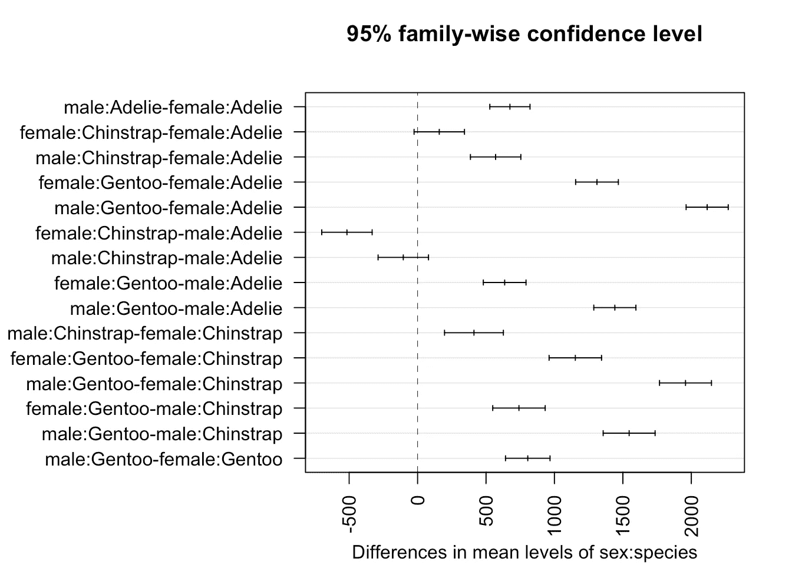

按作者绘图

从上述输出和图中，我们得出结论，所有性别和物种的组合之间都有显著差异，除了雌性 Chinstrap 和雌性 Adelie（p 值 = 0.138）以及雄性 Chinstrap 和雄性 Adelie（p 值 = 0.581）。

这些结果与上面展示的箱型图一致，并将通过下面的可视化得到确认，这些结果总结了 R 中的二元方差分析。

# 可视化

如果您想以不同于初步分析中已经呈现的方式可视化结果，以下是一些有用的绘图思路。

首先，使用 `{effects}` 包中的 `allEffects()` 函数绘制每个子组的均值和标准误：

```py
# method 1
library(effects)
```

```py
plot(allEffects(mod))
```

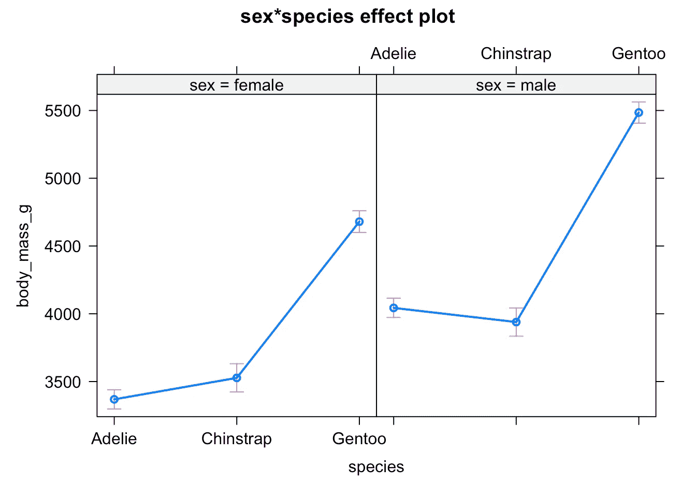

作者绘制

或使用 `{ggpubr}` 包：

```py
# method 2
library(ggpubr)
```

```py
ggline(subset(dat, !is.na(sex)), # remove NA level for sex
  x = "species",
  y = "body_mass_g",
  color = "sex",
  add = c("mean_se") # add mean and standard error
) +
  labs(y = "Mean of body mass (g)")
```

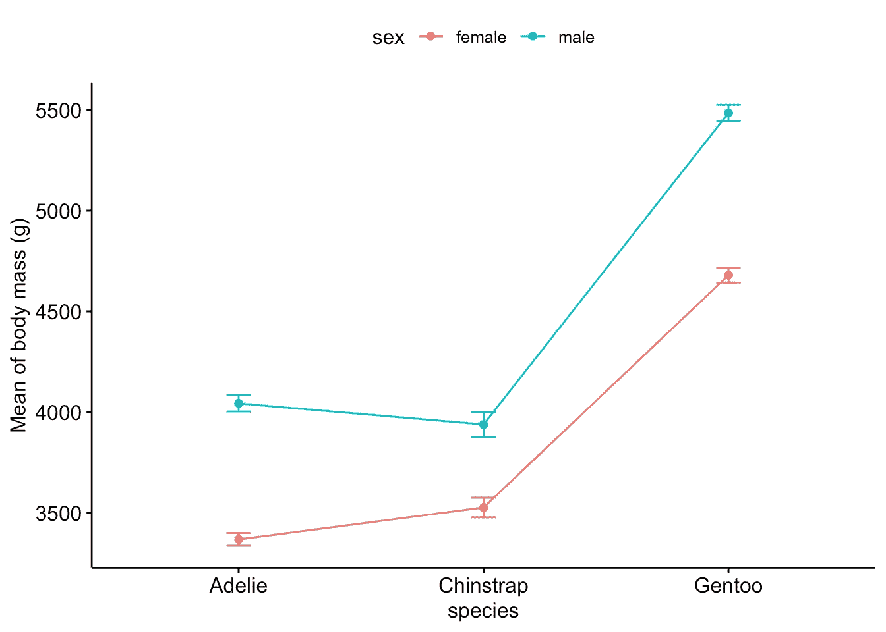

作者绘制

另外，使用 `{Rmisc}` 和 `{ggplot2}`：

```py
library(Rmisc)
```

```py
# compute mean and standard error of the mean by subgroup
summary_stat <- summarySE(dat,
  measurevar = "body_mass_g",
  groupvars = c("species", "sex")
)# plot mean and standard error of the mean
ggplot(
  subset(summary_stat, !is.na(sex)), # remove NA level for sex
  aes(x = species, y = body_mass_g, colour = sex)
) +
  geom_errorbar(aes(ymin = body_mass_g - se, ymax = body_mass_g + se), # add error bars
    width = 0.1 # width of error bars
  ) +
  geom_point() +
  labs(y = "Mean of body mass (g)")
```

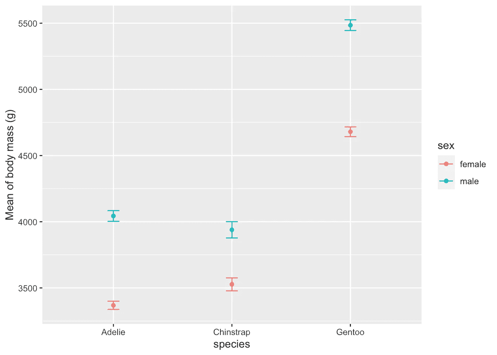

作者绘制

其次，如果您更喜欢仅绘制每个子组的均值：

```py
with(
  dat,
  interaction.plot(species, sex, body_mass_g)
)
```

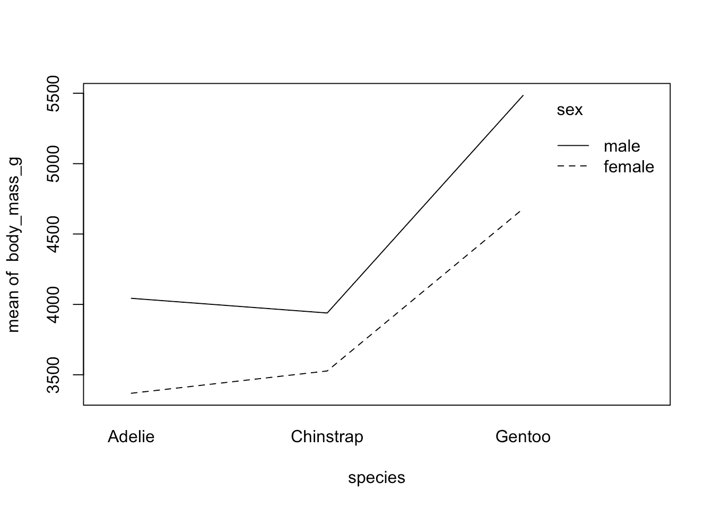

作者绘制

最后但同样重要的是，对于那些熟悉 GraphPad 的人，您可能已经熟悉如下方式绘制均值和误差条：

```py
# plot mean and standard error of the mean as barplots
ggplot(
  subset(summary_stat, !is.na(sex)), # remove NA level for sex
  aes(x = species, y = body_mass_g, fill = sex)
) +
  geom_bar(position = position_dodge(), stat = "identity") +
  geom_errorbar(aes(ymin = body_mass_g - se, ymax = body_mass_g + se), # add error bars
    width = 0.25, # width of error bars
    position = position_dodge(.9)
  ) +
  labs(y = "Mean of body mass (g)")
```

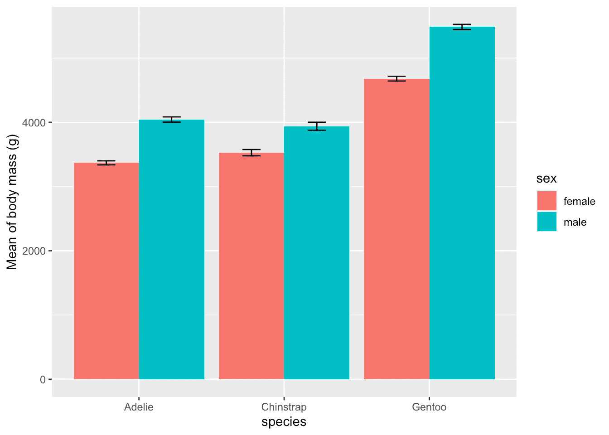

# 结论

在这篇文章中，我们首先回顾了用于比较组间定量变量的不同检验方法。然后我们集中讨论了二元方差分析，从其目标和假设到在 R 中的实现，以及解释和一些可视化。我们还简要提到了其基本假设和一种事后检验，用于比较所有子组。

所有这些都使用 `{palmerpenguins}` 包中提供的 `penguins` 数据集进行了说明。

感谢阅读。

我希望这篇文章能帮助您用您的数据进行二元方差分析。

一如既往，如果您对本文讨论的主题有任何问题或建议，请在评论中添加，以便其他读者也能从讨论中受益。

1.  理论上，一元方差分析也可以用于比较 2 个组，而不仅仅是 3 个或更多组。然而，在实际操作中，通常会使用学生 t 检验来比较 2 个组，而使用一元方差分析来比较 3 个或更多组。使用独立样本的学生 t 检验和 2 个组的一元方差分析得出的结论会相似。[↩︎](https://statsandr.com/blog/two-way-anova-in-r/#fnref1)

1.  请注意，如果正态性假设未满足，可以应用许多变换来改善这一点，其中最常见的是对数变换（`log()` 函数在 R 中）。[↩︎](https://statsandr.com/blog/two-way-anova-in-r/#fnref2)

1.  请注意，Bartlett 检验也适用于检验方差齐性假设。[↩︎](https://statsandr.com/blog/two-way-anova-in-r/#fnref3)

1.  加性模型假设两个解释变量是独立的；它们之间没有相互作用。[↩︎](https://statsandr.com/blog/two-way-anova-in-r/#fnref4)

1.  其中 `mod` 是您保存的模型的名称。[↩︎](https://statsandr.com/blog/two-way-anova-in-r/#fnref5)

1.  在这里，我们使用 Benjamini & Hochberg (1995)修正，但你可以选择多种方法。有关更多详情，请参见`?p.adjust`。[↩︎](https://statsandr.com/blog/two-way-anova-in-r/#fnref6)

# 相关文章

+   [R 中的 ANOVA](https://statsandr.com/blog/anova-in-r/)

+   [R 中的学生 t 检验及手动检验：如何在不同场景下比较两个组？](https://statsandr.com/blog/student-s-t-test-in-r-and-by-hand-how-to-compare-two-groups-under-different-scenarios/)

+   [R 中的单样本 Wilcoxon 检验](https://statsandr.com/blog/one-sample-wilcoxon-test-in-r/)

+   [Kruskal-Wallis 检验，即 ANOVA 的非参数版本](https://statsandr.com/blog/kruskal-wallis-test-nonparametric-version-anova/)

+   [手动假设检验](https://statsandr.com/blog/hypothesis-test-by-hand/)

*最初发表于* [*https://statsandr.com*](https://statsandr.com/blog/two-way-anova-in-r/) *于 2023 年 6 月 19 日。*
