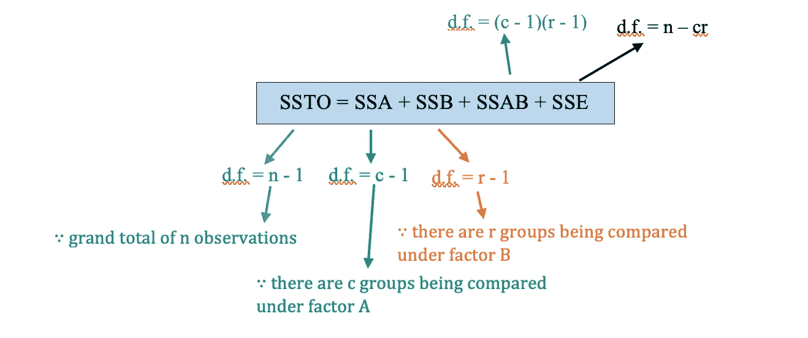
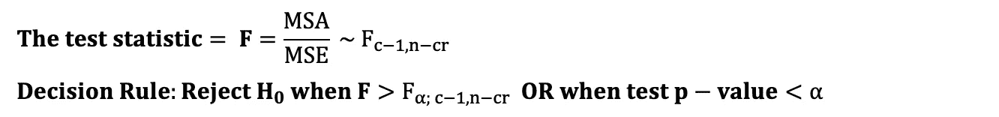
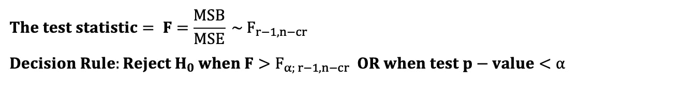
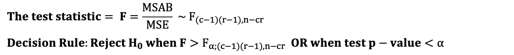
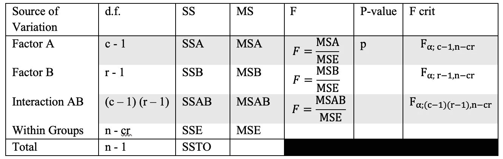
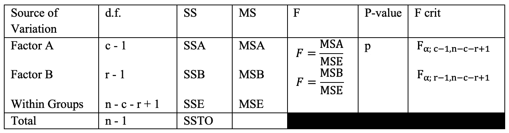
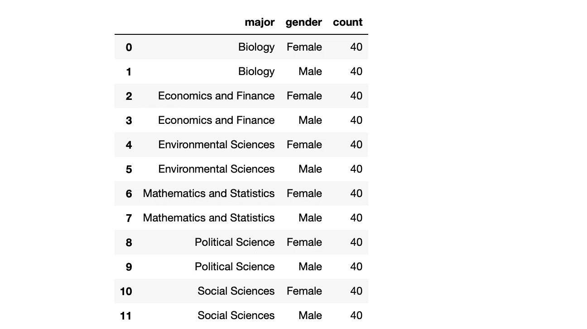
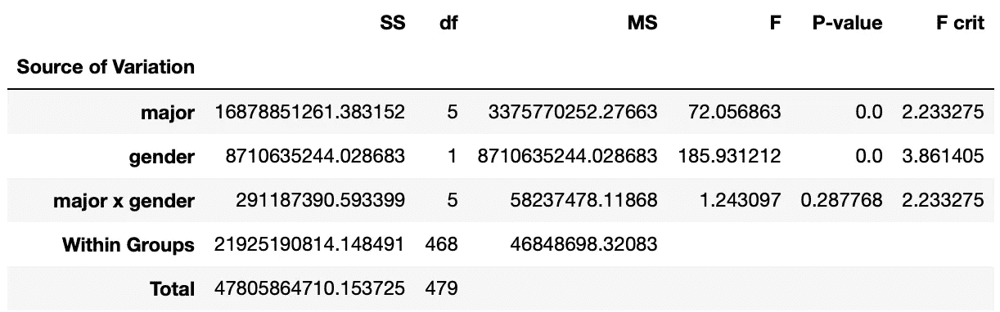
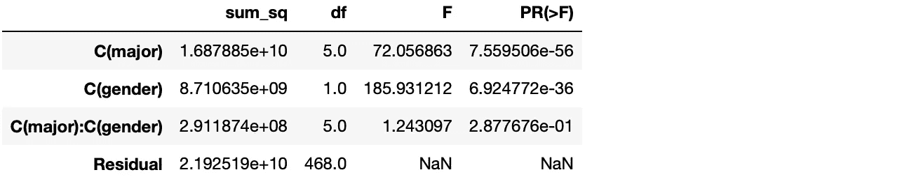
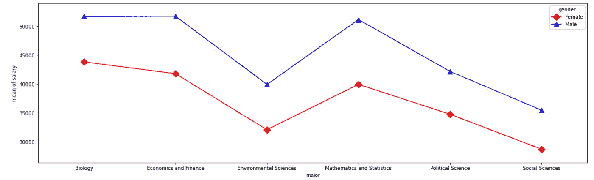

# 双因素方差分析测试，使用 Python

> 原文：[`towardsdatascience.com/two-way-anova-test-with-python-a112e2396d78`](https://towardsdatascience.com/two-way-anova-test-with-python-a112e2396d78)

## 完全初学者的双因素方差分析测试指南（附代码！）

 [Chao De-Yu](https://chaodeyu.medium.com/?source=post_page-----a112e2396d78--------------------------------)

·发表于[Towards Data Science](https://towardsdatascience.com/?source=post_page-----a112e2396d78--------------------------------) ·6 分钟阅读·2023 年 1 月 5 日

--

图片由[Sergey Pesterev](https://unsplash.com/@sickle)拍摄，[Unsplash](https://unsplash.com)提供

方差分析测试旨在检验三个或更多组之间均值的统计显著差异。常用的方差分析有两种类型，`**单因素方差分析测试**`和`**双因素方差分析测试**`。唯一的区别在于影响因变量的自变量的数量。

# 双因素方差分析

双因素方差分析是单因素方差分析的扩展，考察`**两个不同的分类自变量或两个独立因素**`对`**一个连续因变量**`的影响。

双因素方差分析不仅旨在测试每个独立因素的主要效应，还测试两个因素是否相互影响以影响因变量，即是否存在两个独立因素之间的相互作用。[2]

方差分析使用 F 检验，这是一种组间比较检验，用于检验统计显著性。它将每个组在不同因素（因素 A、因素 B、因素 A 与因素 B 之间的相互作用）下的均方差与因变量的总体方差进行比较。最后，基于 F 检验统计量做出结论。

# 平方和（SS）

在双因素方差分析表中：

变异性的总量来自四个可能的来源，即：

1. **因素 A 下**的组间变异，称为**处理**（A）

2. **因素 B 下**的组间变异，称为**处理**（B）

3. 由于**因素 A 和因素 B 之间的相互作用**引起的平方和，称为**相互作用**（AB）

4. 组内变异，称为**误差**（E）

图片 1. SS 和 d.f. 的示意图 作者提供

类似于平方和 (SS)，d.f. (SSTO) = d.f. (SSA) + d.f. (SSB) + d.f. (SSAB) + d.f. (SSE)

SS 除以其 d.f.将得到均方 (MS)。

两因素 ANOVA 测试的假设与单因素 ANOVA 测试相同，即所有的参数检验假设，包括样本数据的随机性和独立性、正态性及方差齐性。如果你想了解更多细节，可以参考上一篇文章。

# 两因素 ANOVA 测试的简单概述

两因素 ANOVA 有**三组假设**：

**集 1：**

H₀: μₐ₁= μₐ₂ = μₐ₃ = … = μₐ𝒸

H₁: 不是所有的μₐᵢ在因素 A 下都是相等的，其中 i = 1, 2, 3, …, c。

显著性水平 = α

图片 2\. 用于测试因素 A 主效应的 F 检验统计量。作者提供的图片。

**集 2：**

H₀: μᵦ₁= μᵦ₂ = μᵦ₃ = … = μᵦᵣ

H₁: 不是所有的μᵦᵢ在因素 B 下都是相等的，其中 i = 1, 2, 3, …, r。

显著性水平 = α

图片 3\. 用于测试因素 B 主效应的 F 检验统计量。作者提供的图片。

**集 3：**

H₀: 一个独立变量的效应不依赖于另一个独立变量的效应，即因素 A 和因素 B 之间没有交互作用

H₁: 因素 A 和因素 B 之间存在交互作用

显著性水平 = α

图片 4\. 用于测试两个独立因素之间是否存在交互作用的 F 检验统计量。作者提供的图片。

如果你执行带有交互作用的两因素 ANOVA 测试，你需要测试上述提到的**所有 3 组假设**。但如果你执行无交互作用的测试，你只需要测试**集 1 和集 2 的假设**。

最后，带有交互作用的两因素 ANOVA 表格如下所示：

表 1\. 带交互作用的两因素 ANOVA 示例表。作者提供的图片。

两因素 ANOVA 表格（无交互作用）如下所示：

表 2\. 无交互作用的两因素 ANOVA 示例表。作者提供的图片。

# 平衡设计与不平衡设计

**平衡设计**是指所有**组合组的样本量相等**的情况。在**不平衡设计**中，**各组的样本量不相等**。在两因素 ANOVA 中，如果组的样本量差异过大，普通的方差分析方法可能不够充分。对于不平衡设计，需要使用**回归方法**。另一种方法是尽力确保设计的平衡。

> 一个数据集，[students.csv](https://userpage.fu-berlin.de/soga/200/2010_data_sets/students.csv)，包含 8239 行学生特征数据。每一行代表一个独特的学生。它包含与学生相关的 16 个特征，我们将只关注 3 个特征：专业、性别和薪资。
> 
> 基于两个因素，专业和性别，是否存在不同性别和专业毕业生的年均薪资显著差异，以及性别和专业之间是否存在交互作用，显著性水平为 5%？

# 数据处理

从给定的数据集中，我们需要筛选出已毕业的学生并进行随机抽样。在这种情况下，它随机抽取了每组 40 名学生，即不同的（专业和性别）组合，以使其成为**平衡设计**。之后，选择关注的三个变量的数据集，即分类变量`major, gender`和数值变量`salary`。

图 5\. 数据处理以实现平衡设计。图像来源：作者。

# 假设检验

根据假设检验的五步过程：

集合 1：

H₀: μₐ₁= μₐ₂ = μₐ₃ = … = μₐ₆

H₁: 在不同专业下薪资均值不相等

集合 2：

H₀: μᵦ₁= μᵦ₂

H₁: 在不同性别下薪资均值不相等

集合 3：

H₀: 专业和性别之间没有交互作用

H₁: 专业和性别之间存在交互作用

α = 0.05

根据 F 检验统计量：

图 6\. 具有交互作用的 ANOVA 表：方差分析的正常方法。图像来源：作者。

我们还可以使用`statsmodels`包得到相同的结果，它使用回归方法。由于`statsmodels`使用回归方法，它也适用于不平衡设计，即你无需做大量工作来确保平衡设计。

图 7\. 具有交互作用的 ANOVA 表：回归方法。图像来源：作者。

以下显示了专业和性别对薪资的交互作用图：

图 8\. 专业和性别对薪资的交互作用图。图像来源：作者

# 结论

对于集合 1 和集合 2：由于 F 值 > F 临界值或 p 值 < 0.05，零假设被拒绝。∴我们有足够的证据表明，不同研究科目或性别的毕业生的平均薪资不相同，显著性水平为 5%。

对于集合 3：未能拒绝零假设。∴我们没有足够的证据表明研究科目和性别之间存在交互作用，显著性水平为 5%。此外，从交互作用图[4]中可以看出，没有交互作用，主要效应即专业和性别效应都显著。例如，生物学专业的男性毕业生的平均薪资会显著更高。

# 推荐阅读

 ## ANOVA 测试，使用 Python

### 完全初学者指南：执行 ANOVA 测试（附代码！）

towardsdatascience.com  ## 卡方检验，使用 Python

### 完全初学者指南：进行卡方检验（附代码！）

towardsdatascience.com  ## McNemar 检验，使用 Python

### 完全初学者指南：进行 McNemar 检验（附代码！）

towardsdatascience.com  [## 单样本假设检验，使用 Python

### 完全初学者指南：进行单样本假设检验（附代码！）

levelup.gitconnected.com](https://levelup.gitconnected.com/how-to-perform-one-sample-hypothesis-tests-with-python-308eae8789fc?source=post_page-----a112e2396d78--------------------------------)  [## 双样本假设检验，使用 Python

### 完全初学者指南：进行双样本假设检验（附代码！）

levelup.gitconnected.com](https://levelup.gitconnected.com/two-sample-hypothesis-tests-with-python-43e1b8c52306?source=post_page-----a112e2396d78--------------------------------)

# 参考文献

[1] “单因素方差分析假设检验 • SOGA • 地球科学系。” [在线]. 可用：[`www.geo.fu-berlin.de/en/v/soga/Basics-of-statistics/ANOVA/One-way-ANOVA-Hypothesis-Test/index.html`](https://www.geo.fu-berlin.de/en/v/soga/Basics-of-statistics/ANOVA/One-way-ANOVA-Hypothesis-Test/index.html)

[2] [双向方差分析 — 维基百科](https://en.wikipedia.org/wiki/Two-way_analysis_of_variance)

[3] Kiernan, D. (2014). 第六章：双向方差分析。Open SUNY 教科书。

[4] *第七章 方差分析与交互 | STA 265 讲义（统计与数据科学方法）*。 (无日期). 取自 2023 年 1 月 2 日，[`campus.murraystate.edu/academic/faculty/cmecklin/STA265/_book/anova-with-interaction.html#the-interactive-two-way-anova-model`](http://campus.murraystate.edu/academic/faculty/cmecklin/STA265/_book/anova-with-interaction.html#the-interactive-two-way-anova-model)
