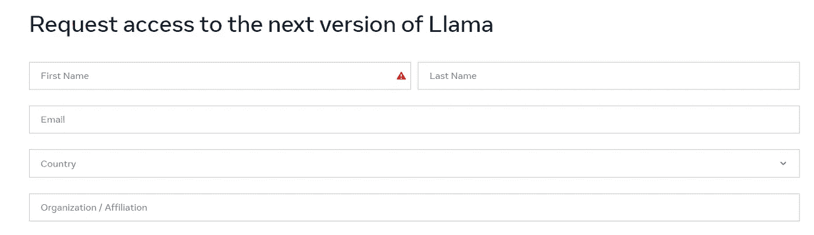
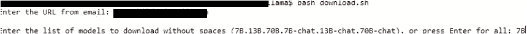
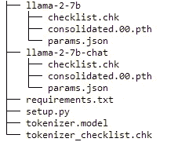
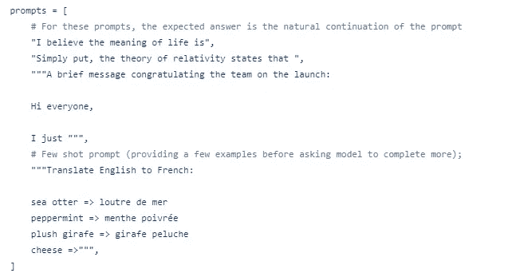
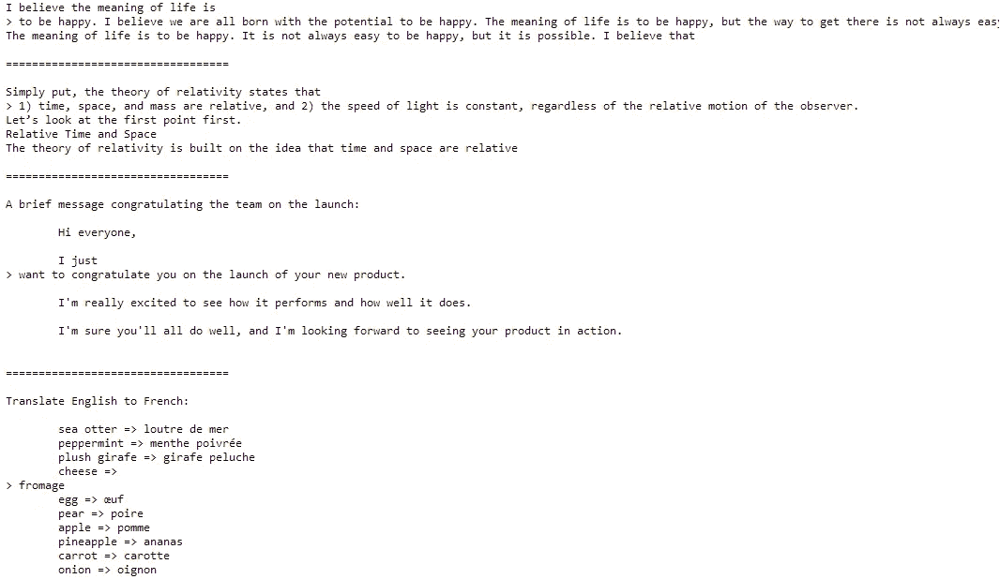
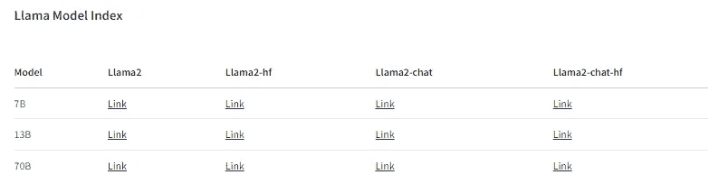
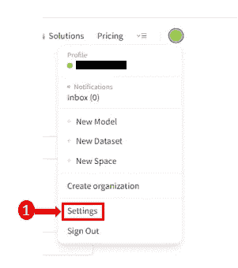
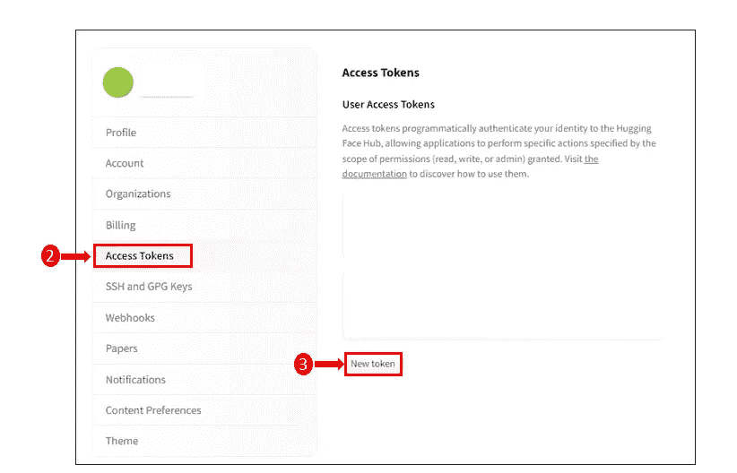
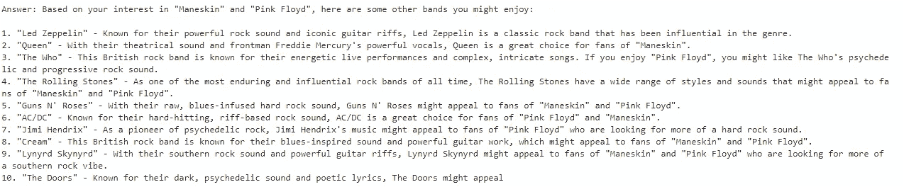
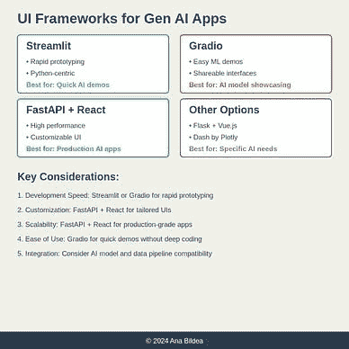

# 两种本地下载和访问 Llama 2 的方法

> 原文：[`towardsdatascience.com/two-ways-to-download-and-access-llama-2-locally-8a432ed232a4`](https://towardsdatascience.com/two-ways-to-download-and-access-llama-2-locally-8a432ed232a4)

## 在你的 PC 上使用 Llama 2 的逐步指南

[](https://medium.com/@anna.bildea?source=post_page-----8a432ed232a4--------------------------------)[](https://towardsdatascience.com/?source=post_page-----8a432ed232a4--------------------------------) [Ana Bildea, PhD](https://medium.com/@anna.bildea?source=post_page-----8a432ed232a4--------------------------------)

·发布于 [Towards Data Science](https://towardsdatascience.com/?source=post_page-----8a432ed232a4--------------------------------) ·10 分钟阅读·2023 年 9 月 5 日

--


图片来源：作者（Dreamstudio）

# 动机

Meta 最新发布的 Llama 2 正在获得越来越多的关注，并且对各种使用场景都非常有趣。它提供了不同大小的预训练和微调的 Llama 2 语言模型，从 7B 到 70B 参数。Llama 2 在推理、编码、能力和知识基准等各种测试中表现良好，这使它非常有前景。

在本文中，我们将逐步指导你在 PC 上下载 Llama 2 的过程。你有两个选项：官方的 Meta AI 网站或 HuggingFace。我们还会展示如何访问它，以便你可以利用其强大的功能来支持你的项目。让我们开始吧！

# 前提条件

+   [Jupyter Notebook](https://jupyter.org/)

+   Nvidia T4 图形处理单元 (GPU)

+   虚拟环境 (Virtualenv)

+   [HuggingFace](https://huggingface.co/) 账户、库以及 Llama 模型

+   Python 3.10

# 本地下载前需要考虑的事项

在将模型下载到本地机器之前，考虑一些事项。首先，确保你的计算机有足够的处理能力和存储空间（从 SSD 磁盘加载模型要快得多）。其次，准备进行一些初始设置以使模型运行。最后，如果你是出于工作需要使用此模型，请检查公司关于下载外部软件的政策。

# 为什么要本地下载 Llama 2？

你可能有几个很好的理由希望将模型下载到自己的计算机上，例如：

+   **减少延迟** 通过在你的环境中托管 Llama 2，你可以将与外部服务器的 API 调用相关的延迟降到最低。

+   **数据隐私** 你可以将私人和敏感信息保存在自己的生态系统中（本地或外部云提供商）。

+   **定制和控制** 您对模型拥有更多控制权。您可以优化机器的配置，进行优化技术的工作，对模型进行微调，并进一步将其集成到您的生态系统中。

+   **离线访问** 根据使用情况，模型可能托管在没有互联网连接的安全环境中。

# 选择获取“Llama 2”的来源

决定从哪里获取“Llama 2”是基于对您最合适的选择。以下是一些考虑因素，以帮助您做出选择。

## Meta 的 GitHub：

当您从 Meta 的 GitHub 获取“Llama 2”时，您直接从源头获取。这使您可以访问最新的更新。然而，如果遇到问题，社区可能不会像 HuggingFace 那样反应迅速。文档很好，但尝试示例可能需要更多编码。

## Hugging Face：

使用 Hugging Face 非常简单，因为它具有用户友好的平台和反应迅速且强大的社区支持。它兼容多个框架，使得将模型集成到现有技术栈中变得更加容易。

因此，如果您需要定制和见解，建议直接从 Meta 的 GitHub 获取模型；如果需要易用性、社区支持和与各种框架的兼容性，可以选择 Hugging Face。

# 1️⃣ 从 Meta 网站下载 Llama 2

## 步骤 1：请求下载

下载 Llama 2 模型权重和分词器的一个选项是[Meta AI 网站](https://ai.meta.com/resources/models-and-libraries/llama-downloads/)。在下载模型权重和分词器之前，您必须阅读并同意许可协议，并通过提供您的电子邮件地址提交请求。填写以下信息并接受条款：



作者提供的图片

一旦您的请求被批准，您将通过电子邮件收到一个`signed URL`。

提个小提醒！提供的下载模型权重和分词器的链接仅在 24 小时内有效，并且下载次数有限。因此，如果您看到诸如“403: Forbidden”的错误，请不要担心！您可以通过返回 Meta AI 网站请求一个新链接。

## 步骤 2：获取 download.sh 脚本

在继续之前，请确保您已经安装了`wget`和`md5sum`。您可以在[Meta 的 GitHub 仓库](https://github.com/facebookresearch/llama.git)找到所需的 download.sh 脚本。克隆该仓库并按如下方式进入`llama`目录：

```py
git clone https://github.com/facebookresearch/llama.git
cd llama 
```

通过输入以下命令确保您赋予脚本执行权限：

```py
chmod +x download.sh
```

## 步骤 3：启动下载过程

要启动下载过程，您需要运行`download.sh`脚本。在此过程中，系统会提示您提供通过电子邮件发送的 URL 以及您希望下载的模型。

您可以选择下载两种不同类型的模型：

+   ***预训练*** — Llama-2–7b, Llama-2–13b, Llama-2–70b

+   ***微调的聊天*** — Llama-2–7b-chat，Llama-2–13b-chat，Llama-2–70b-chat

就我而言，我会获得 Llama-2–7b 和 Llama-2–7b-chat。

```py
bash download.sh
```



如果下载成功，你应该能找到分词器和模型 llama-2–7b 及 llama-2–7b-chat。



作者提供的图片

## **步骤 4：准备本地环境**

为了获得最佳隔离，建议建立一个全新的本地环境；我个人使用 Conda 环境管理系统。让我们开始创建新的 Conda 环境：

```py
conda create --name yourenvname python=3.10
```

用你想要给环境的名称替换 `yourenvname`，用首选的 Python 版本替换 `3.10`。创建环境后，你可以用以下命令激活它：

```py
conda activate yourenvname
```

然后，导航到克隆的仓库并安装 `requirements.txt` 中提到的所需库。

```py
pip install -r requirements.txt 
```

还有一件事你需要做：以允许你更改代码并立即查看效果的方式安装项目包，而不必重新安装。要实现这一点，请运行以下命令：

```py
pip install -e .
```

既然我们已经准备好了，让我们运行模型看看会发生什么。

# 4\. 使用 `torchrun` 运行推理

Torchrun 是 PyTorch 中的一个工具，通过自动分配工作者、处理故障、支持弹性设置和提供超越 `torch.distributed.launch` 的功能（包括自定义入口点、参数传递和日志捕获）来简化分布式训练。

在克隆的仓库中，你应该看到两个示例：`example_chat_completion.py` 和 `example_text_completion.py`。

由于两个脚本都设计用于分布式训练，我们需要设置一些变量。你可以像下面这样简单地导出它们，或将它们添加到 `.bashrc` 中。

```py
export RANK=1
export WORLD_SIZE=0
export MASTER_ADDR=localhost
export MASTER_PORT=12355
```

+   `RANK`：分布式训练组中当前进程的等级。

+   `WORLD_SIZE`：分布式组中的总进程数。

+   `MASTER_ADDR`：协调训练的主节点地址。

+   `MASTER_PORT`：用于与主节点通信的端口号。

要执行 `torchrun`，我们需要：

+   将 `nproc-per-node` 定义为可用的 GPU 数量，

+   提供 `script.py`，

+   通过 `ckpt_dir` 指定模型检查点目录，

+   使用 `tokenizer_path` 指定分词器的路径。

```py
torchrun --nproc-per-node=NUM_GPUS_YOU_HAVE your_script.py \ 
         -- ckpt_dir /path/to/checkpoint \ 
         -- tokenizer_path /path/to/tokenizer
```

让我们运行 `example_text_completion.py`，其中初始提示为：



作者提供的图片

```py
torchrun --nproc_per_node 1 example_text_completion.py \
    --ckpt_dir llama-2-7b/ \
    --tokenizer_path tokenizer.model \
    --max_seq_len 128 --max_batch_size 4
```



作者提供的图片

就这样。你成功了！现在你可以更改提示并尝试其他模型 😃。

**简短回顾：**

> 访问 **Meta 官方网站** 并申请下载权限。
> 
> 访问 [**Llama 2 仓库**](https://github.com/facebookresearch/llama) 在 GitHub 上并下载 **download.sh** 脚本。
> 
> **执行 download.sh** 并提供通过电子邮件发送的签名 URL：
> 
> https://download.llamameta.net/*?YOUR_SIGNED_URL 并选择要下载的模型权重
> 
> **准备环境**
> 
> **使用 torchrun 进行干预**

# 2️⃣ 从 HuggingFace 下载 Llama 2

## 步骤 1：请求下载

首先，确保你在 [Meta AI 网站](https://ai.meta.com/resources/models-and-libraries/llama-downloads/) 上用与你的 Hugging Face 帐户关联的确切电子邮件地址请求下载。接受[许可条款](https://ai.meta.com/llama/license/)和[可接受使用政策](https://ai.meta.com/llama/use-policy/)。完成后，你可以申请访问 [Hugging Face](https://huggingface.co/meta-llama) 上的任何可用模型。

下面是当前可用模型的列表。



cc. Hugging Face

你将收到来自 HuggingFace 的确认访问许可的电子邮件。

## 步骤 2：从 HuggingFace 获取令牌

如果你还没有 HuggingFace 账户，你需要创建一个。创建账户后，登录 HuggingFace。登录后，找到右上角的`Profile`选项并选择`Settings`。



图片由作者提供

选择`Access Tokens`选项并点击`New token`按钮以生成令牌。



图片由作者提供

只需复制令牌并返回到你的笔记本中。在下一步中，我们将看到如何访问和下载模型。

## 步骤 3：对 HuggingFace 进行身份验证

首先，安装 Hugging Face 开发的 `huggingface_hub` 模块，它使你能够与 Hugging Face Model Hub 进行交互。该中心托管各种预训练模型。请注意，`huggingface_hub.login()` 需要 `ipywidgets` 包。

```py
!pip install huggingface_hub ipywidgets
```

然后，导入 `huggingface_hub` 并按如下方式登录 Hugging Face：

```py
import huggingface_hub
huggingface_hub.login()
```

当你运行 `huggingface_hub.login()` 时，你会被要求提供你的 Hugging Face 身份验证令牌。成功认证后，你可以下载 llama 模型。粘贴你的令牌并点击登录。如果认证成功，你应该会看到以下消息。

在身份验证通过后，你可以继续下载其中一个 llama 模型。我会选择`meta-llama/Llama-2–7b-chat-hf`。

## 步骤 4：下载 Llama 2 模型

首先安装所需的库。

你可以按如下方式检查可用的 GPU：

要检查你的 GPU 详细信息，如驱动版本、CUDA 版本、GPU 名称或使用指标，请在单元格中运行命令 `!nvidia-smi`。

然后，为了下载模型，我们需要从 PyTorch 和 Hugging Face 的 Transformers 导入所有必要的库，初始化 Llama-2–7b 聊天模型及其标记器，并将它们保存到磁盘。请查看以下示例：

执行完单元格后，你应该会在`huggingface`目录下看到模型。

在进一步操作之前检查目录。里面应该有什么？

+   `config.json`：将其视为模型操作的手册。

+   `pytorch_model.bin`：这是你的模型在 PyTorch 格式中的“大脑”。

+   必需的分词器文件：`special_tokens_map.json` 和 `tokenizer_config.json` 就像是你模型语言的词典。

+   `tokenizer.model` Llama 2 分词器

## 第 5 步：从磁盘加载 Llama 2 模型

如果你已经将 Llama 2 模型存储在磁盘上，你应该先加载它们。

为此，你需要：

+   `LlamaForCausalLM` 就像是 "Llama 2" 的大脑，

+   `LlamaTokenizer` 有助于 "Llama 2" 理解和分解单词。

+   模型的路径

我们已经到了最后一步——测试干预。

## 第 6 步：使用 HuggingFace 管道进行干预

我们可以通过使用 HuggingFace transformers 的管道来评估干预。利用管道，你可以快速完成复杂任务。

+   `text-generation`：指定管道用于生成文本。

+   `model`：你用于文本生成的预训练模型。

+   `tokenizer`：用于处理输入文本和解码模型输出的分词器。

+   `device_map=”auto”`：这尝试在最佳可用设备上运行模型（例如，若可用则为 GPU，否则为 CPU）。

+   `max_new_tokens=512`：限制生成的输出为 512 个标记。

+   `num_return_sequences=1`：只请求一个生成的序列。

+   `eos_token_id=tokenizer.eos_token_id`：序列结束标记 ID。

*以我的情况为例，我想要一些摇滚乐队的建议，结果非常好。*



**从 HuggingFace 下载 Llama 的简短回顾：**

> 访问**Meta 官方网站**并申请下载权限。
> 
> 从 HuggingFace 获取令牌
> 
> 认证 HuggingFace
> 
> 下载 Llama 2 模型
> 
> 从磁盘加载 Llama 2 模型
> 
> 使用 HuggingFace 管道进行干预

## 最后的思考：

在本教程中，我们已经看到如何将 Llama 2 模型下载到本地 PC。你还可以通过使用量化、蒸馏等方法进一步提升模型的性能，我将在后续文章中讨论这些方法。务必在新的虚拟环境中执行所有这些步骤。在此过程中，请确保监控计算机的内存使用情况。很多奇怪的错误可能隐藏在内存问题后面。如果你想下载量化模型，请注意你可能需要将 `bitsandbytes` 库降级到 0.39.1

> 曾经尝试在 Medium 上点击“点赞”按钮多次吗？❤️
> 
> 让我们成为朋友吧！✋ 别忘了 [订阅](https://medium.com/subscribe/@anna.bildea)!
> 
> *在* [*LinkedIn*](https://www.linkedin.com/in/ana-bildea-phd-2339b728/) *和* [*X*](https://twitter.com/AnaBildea) *找到我！*

*如果你觉得我的故事很吸引人，并希望支持我的写作，我邀请你考虑成为 Medium 会员，你可以访问大量的生成 AI、数据工程和数据科学文章。*

[](https://medium.com/@anna.bildea/membership?source=post_page-----8a432ed232a4--------------------------------) [## 使用我的推荐链接加入 Medium — Bildea Ana

### 作为 Medium 的会员，你的部分会员费将用于支持你阅读的作者，你也可以完全访问所有故事…

[medium.com](https://medium.com/@anna.bildea/membership?source=post_page-----8a432ed232a4--------------------------------)

查看我关于生成式人工智能、MLOps 和负责任人工智能的文章合集。


[Ana Bildea, 博士](https://medium.com/@anna.bildea?source=post_page-----8a432ed232a4--------------------------------)

## 生成式人工智能

[查看列表](https://medium.com/@anna.bildea/list/generative-ai-30d313b29b80?source=post_page-----8a432ed232a4--------------------------------)11 篇故事

[Ana Bildea, 博士](https://medium.com/@anna.bildea?source=post_page-----8a432ed232a4--------------------------------)

## MLOps - 人工智能生产

[查看列表](https://medium.com/@anna.bildea/list/mlops-ai-in-production-04b6c81c50c8?source=post_page-----8a432ed232a4--------------------------------)4 篇故事

[Ana Bildea, 博士](https://medium.com/@anna.bildea?source=post_page-----8a432ed232a4--------------------------------)

## 负责任的人工智能

[查看列表](https://medium.com/@anna.bildea/list/responsible-ai-10009e82f412?source=post_page-----8a432ed232a4--------------------------------)1 篇故事
