# I 型和 II 型错误及假设检验中的样本大小计算

> 原文：[`towardsdatascience.com/type-i-ii-errors-and-sample-size-calculation-in-hypothesis-testing-760dae42a065`](https://towardsdatascience.com/type-i-ii-errors-and-sample-size-calculation-in-hypothesis-testing-760dae42a065)

## 假设检验中影响结果的因素

 [Aaron Zhu](https://aaron-zhu.medium.com/?source=post_page-----760dae42a065--------------------------------)

·发表于 [Towards Data Science](https://towardsdatascience.com/?source=post_page-----760dae42a065--------------------------------) ·9 分钟阅读·2023 年 2 月 23 日

--

图片由 [Scott Graham](https://unsplash.com/@homajob?utm_source=medium&utm_medium=referral) 提供，来源于 [Unsplash](https://unsplash.com/?utm_source=medium&utm_medium=referral)

在统计和数据分析的世界中，假设检验是一个基本概念，在做出明智决策中发挥着至关重要的作用。在这篇博客中，我们将深入探讨[**假设检验**](https://medium.com/geekculture/what-is-hypothesis-testing-in-statistics-motivation-and-interpretation-39f8e63b1baf)，特别关注如何减少 I 型和 II 型错误。我们将讨论影响这些错误的因素，如显著性水平、样本大小和数据变异性。让我们深入探讨假设检验的复杂性吧！

我们将在整个博客中使用以下示例。

上一个学期的平均学生 GPA 为 2.70。在当前学期启动了一项辅导程序。我们希望进行以下假设检验，以研究辅导程序是否能提升学生的 GPA。

在当前学期结束时，我们收集了 20 个随机的 GPA 记录，并假设学生 GPA 服从标准差（σ）为 0.5 的正态分布。μ代表总体的平均 GPA。

+   零假设：μ = 2.70（即辅导程序在提升学生 GPA 方面没有帮助。）

+   备择假设：μ > 2.70（即辅导程序有帮助。）

学校的资金非常有限。我们希望将**I 型错误**的风险降到最低（即错误地得出辅导程序有帮助的结论，尽管它实际上并没有帮助）。

你可能会问

## 我们需要考虑哪些因素来减少**I 型错误**？

**1. 显著性水平 (α)**

显著性水平（α）是我们愿意接受的**预定义**最大第一类错误概率。

在显著性水平下，我们可以找到临界值以拒绝假设检验中的零假设。

+   μ是零假设中的总体参数（例如，总体均值）。

+   σ是总体标准差。如果σ未知，我们可以使用样本标准差，s，来估计它。

+   n 是样本量

+   Z 是与给定α相关的 Z 统计量。如果σ未知或样本量小于 30，我们将使用 T 统计量以产生更可实现的结果。

如果观察到的样本统计量（例如，样本均值）等于或更极端于临界值，我们将拒绝零假设。

当我们基于显著性水平（α）做决定时，有一个最大α *100% 的犯第一类错误的风险。

> ***P（第一类错误，即当 X̄ > 临界值且零假设正确时拒绝零假设）= α *100%***

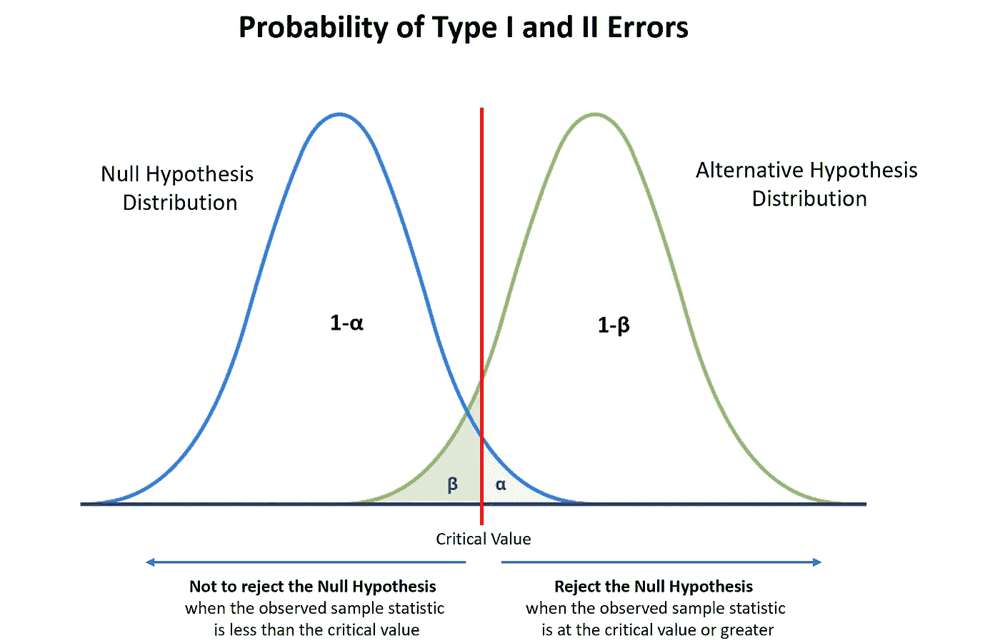

图片由作者提供

例如，

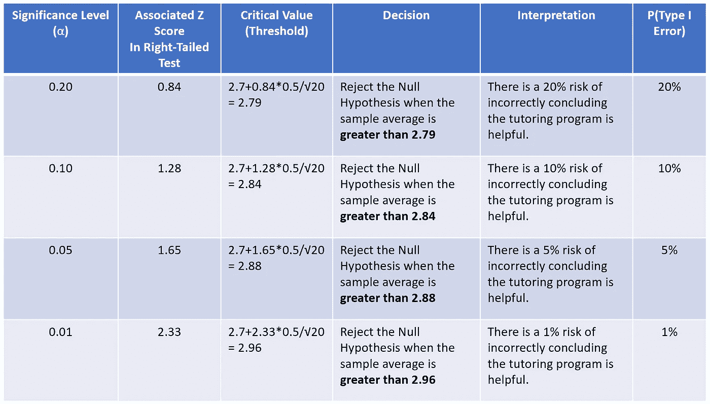

图片由作者提供

> 显著性水平（α）越低，犯第一类错误的风险越低。

**2. 样本量**

另一个可能影响第一类错误的因素是样本量的变化（例如，从 n = 20 到 n = 100），让我们看看它如何影响第一类错误的概率。

例如，

当α = 0.1，n = 20，

P（当 X̄ > 2.84 时拒绝零假设的第一类错误概率）= P（Z > 2.84–2.7/0.5/√20）= 10%

当α = 0.1，n = 100，

P（当 X̄ > 2.84 时拒绝零假设的第一类错误概率）= P（Z > 2.84–2.7/0.5/√100）= 0.26%

我们可以调整样本量以适应不同的显著性水平，并获得相同的结果。

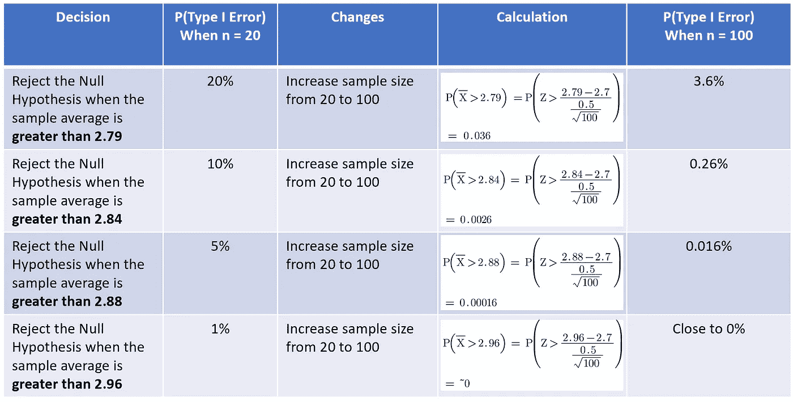

图片由作者提供

> *在不同的显著性水平下，随着样本量的增加，第一类错误的概率会降低。*

这可以用常识理解。样本量越大，你对总体的信息越多。这意味着测试统计量的精度提高，第一类错误的概率降低。

**3. 数据变异性**

数据变异性也会影响第一类错误。如果数据变异性减少（即，总体标准差变小），我们预期犯第一类错误的概率会更小。

例如，

当α = 0.1，SD = 0.5，

P（当 X̄ > 2.84 时拒绝零假设的第一类错误概率）= P（Z > 2.84–2.7/0.5/√20）= 10%

当α = 0.1，SD = 0.3，

P（当 X̄ > 2.84 时拒绝零假设的第一类错误概率）= P（Z > 2.84–2.7/0.3/√20）= 1.8%

我们可以针对不同的显著性水平调整标准差，并获得相同的结果。

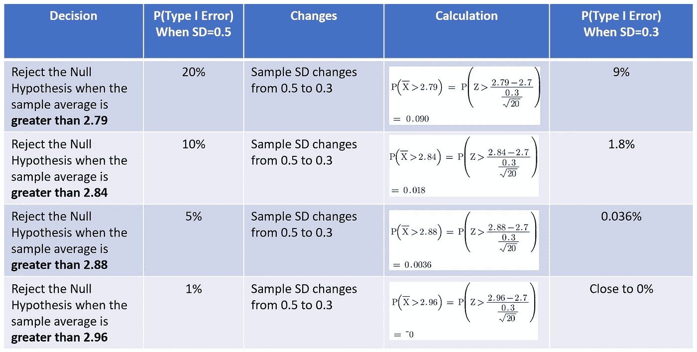

图片由作者提供

> *在不同的显著性水平下*，标准差减少时第一类错误的概率也会减少*。

另一方面，如果研究的总体变异性更大，那么检测真实效应可能会更困难。换句话说，第一类错误的概率增加。这是因为检验统计量的分布更广泛，难以区分原假设和备择假设。

接下来，我们将讨论如何减少假设检验的第二类错误。

但首先，

## 如何计算当备择假设正确时的假设检验的第二类错误？

如果我们在备择假设正确时未拒绝原假设，我们就犯了第二类错误。

在这个例子中，如果备择假设为真（例如，真实的总体 GPA 均值为 3.0），第二类错误的概率可以计算为

> ***P(第二类错误，即当 X̄ < 临界值而备择假设正确时未拒绝原假设) = β*100%***

作者提供的图片

在许多情况下，我们也对计算假设检验的**效能**感兴趣。

> *假设检验的* ***效能*** *(计算为 1-β)**是正确拒绝原假设的概率，当备择假设正确时。*

## 我们需要考虑哪些因素来减少第二类错误（或增加效能）？

**1\. 显著性水平 (α)**

显著性水平（α）也会影响第二类错误，但**方向相反**。

例如，

当α = 0.1，SD= 0.5，n=20，真实μ = 3.0

P(当 X̄ < 2.84 时未拒绝原假设的第二类错误) = P(Z < 2.84–3.0/0.5/√20) = 8%

当α = 0.05，SD= 0.5，n=20，真实μ = 3.0

P(当 X̄ < 2.88 时未拒绝原假设的第二类错误) = P(Z < 2.88–3.0/0.5/√20) = 14%

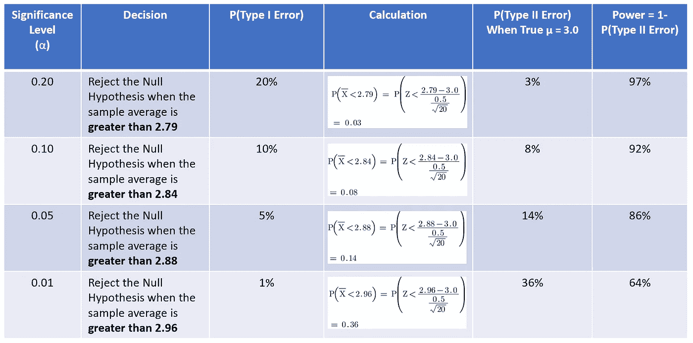

作者提供的图片

> 显著性水平 (α) 的降低会导致第二类错误的概率增加或效能的降低。

**2\. 样本大小**

样本大小会**以相同的方式**影响第二类错误，就像第一类错误一样。

例如，

当α = 0.1，SD= 0.5，n=20，真实μ = 3.0

P(当 X̄ < 2.84 时未拒绝原假设的第二类错误) = P(Z < 2.84–3.0/0.5/√20) = 8%

当α = 0.1，SD= 0.5，n=100，真实μ = 3.0

P(当 X̄ < 2.84 时未拒绝原假设的第二类错误) = P(Z < 2.84–3.0/0.5/√100) = 0.069%

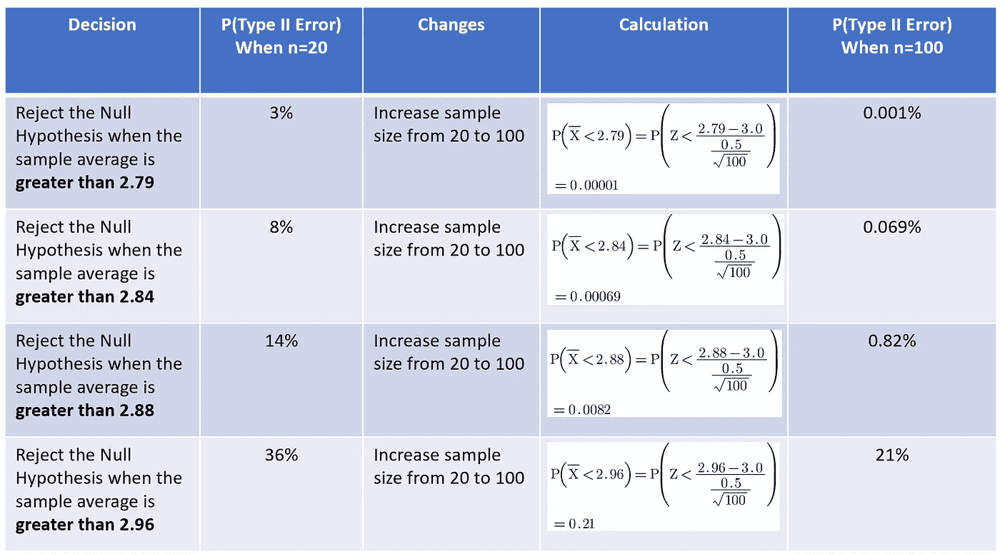

作者提供的图片

> *在不同的显著性水平下，随着样本大小的增加，第二类错误的概率会减少。*

**3\. 数据变异性**

数据变异性也会以**相同的方式**影响第二类错误，就像第一类错误一样。

例如，

当α = 0.1，SD= 0.5，n=20，真实μ = 3.0

P(当 X̄ < 2.84 时未拒绝原假设的第二类错误) = P(Z < 2.84–3.0/0.5/√20) = 8%

当 α = 0.1，SD= 0.3，n=20，真实 μ = 3.0

P（未能拒绝零假设的第二类错误概率，当 X̄ < 2.84）= P(Z < 2.84–3.0/0.3/√20) = 0.85%

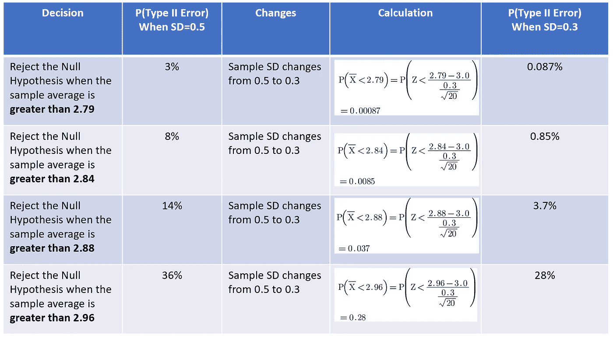

作者提供的图像

> *在不同显著性水平下*，第二类错误的概率会随着标准差的减少而减少。

**4\. 效应量**

效应量是零假设与备择假设之间差异的大小（例如，当真实总体 GPA 均值为 3.0 时，效应量为 0.3，（3.0–2.7））。

> 如果效应量增加，则更容易检测到真实效应，第二类错误的概率降低。

例如，

当 α = 0.1，SD= 0.5，n=20，效应量 = 0.3

P（未能拒绝零假设的第二类错误概率，当 X̄ < 2.84）= P(Z < 2.84–3.0/0.5/√20) = 8%

当 α = 0.1，SD= 0.5，n=20，效应量 = 0.4

P（未能拒绝零假设的第二类错误概率，当 X̄ < 2.84）= P(Z < 2.84–3.1/0.5/√20) = 1%

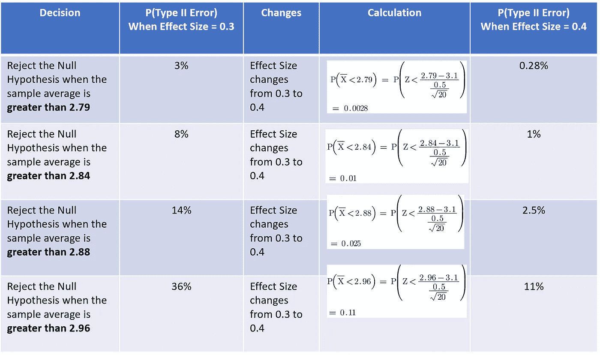

作者提供的图像

下表总结了第一类和第二类错误与这些各种因素之间的关系。

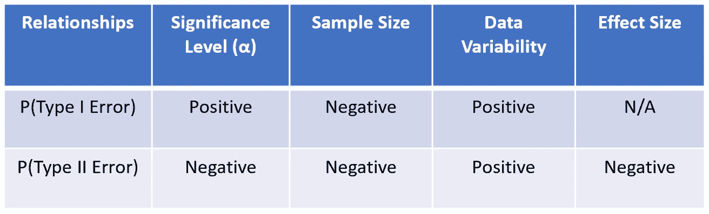

作者提供的图像

现在我们了解了第一类和第二类错误是各种因素的函数。

## 我们如何同时减少第一类和第二类错误的概率？

简单的答案是：**增加样本大小是同时减少 α 和 β 的唯一方法**。

但我们如何计算样本大小呢？

> ***检验力分析*** *是一种常用工具，用于计算样本大小以实现所需的第一类和第二类错误水平。*

我们需要以下信息来计算样本大小。

**1\. 显著性水平 (α)：** 我们通常会提前确定 α 值。常见的 α 值为 0.01、0.05 和 0.1。

**2\. 检验力 (1-β)**：这是你假设检验检测效应的能力。检验力越高，检测效应的可能性越大，第二类错误的风险越低。我们通常将检验力设定为 80%或 20% β。

**3\. 数据变异性（即标准差，σ）**：数据变异性不是由我们决定的。我们需要专家的领域知识或对样本数据进行分析。

**4\. 效应量 (δ)**：在实践中，我们不会知道真实的效应量，因为我们仅使用样本数据。相反，我们可以确定**最小重要差异 (MID)**，即被认为具有意义或临床相关的测量结果的最小差异。我们可以将效应量设定为 MID。

+   如果真实的效应大小小于 MID**，**那么效应大小在实际意义上就不显著。例如，如果辅导只使学生的 GPA 提高 0.1（即效应大小=0.1），这会是一个震撼的结论吗？可能不会。因此，样本大小足以检测到小于 MID 的效应被视为资源的浪费。

+   如果真实的效应大小大于 MID**，**那么我们更有可能检测到真实的效应。因此，基于 MID 的样本大小对于假设检验来说是足够的。

这是计算样本大小的基本公式。

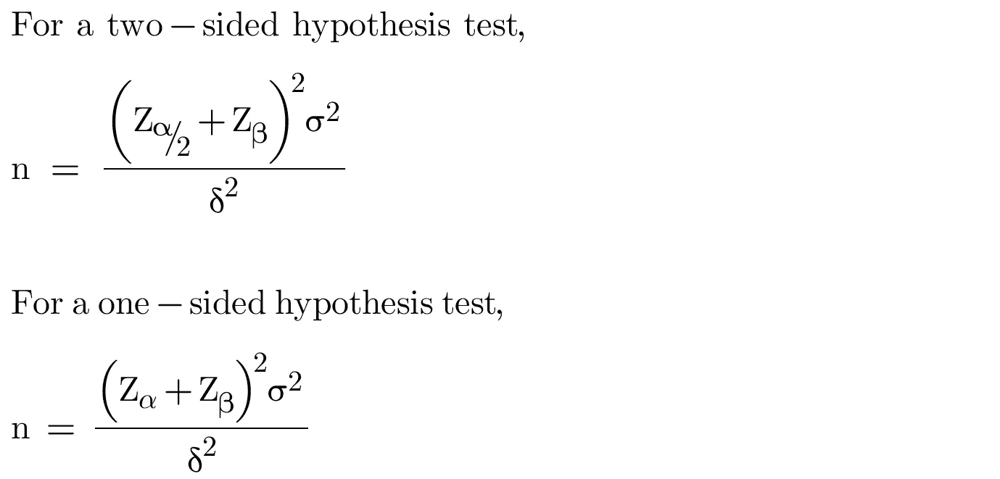

从公式中，我们可以总结出样本大小与这些因素之间的关系。

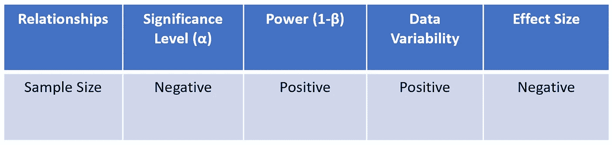

作者提供的图片

总之，在进行假设检验时，考虑 I 型和 II 型错误及其可能影响的因素是至关重要的。通过仔细考虑这些因素并平衡两种错误的风险，我们可以基于假设检验的结果做出更准确和更有根据的决策。

如果你想探索更多与**统计学**相关的帖子，请查看我的文章：

+   **中央极限定理的 7 个常见问题**

+   **标准差与标准误差：有什么区别？**

+   **3 种最常见的误解：假设检验、置信区间、P 值**

+   **线性回归模型中的误差项是否服从正态分布？**

+   **OLS 估计量在线性回归模型中是否服从正态分布？**

+   **什么是正则化：偏差-方差权衡**

+   [**方差与协方差与相关性：有什么区别？**](https://medium.com/geekculture/variance-vs-covariance-vs-correlation-what-is-the-difference-95adff96d542)

+   **置信区间与预测区间：有什么区别？**

+   [**哪种错误更糟，I 型错误还是 II 型错误？**](https://medium.com/geekculture/which-is-worse-type-i-or-type-ii-errors-f40a0f040fcc)

# 谢谢你的阅读！

如果你喜欢这篇文章，请点击**点赞**图标。如果你想查看更多来自我和其他成千上万的作者在 Medium 上的文章，你可以：

+   [**订阅**](https://aaron-zhu.medium.com/subscribe)我的新闻通讯，以便每当我发布新文章时，你能收到电子邮件通知。

+   注册成为[**会员**](https://aaron-zhu.medium.com/membership)，即可解锁对 Medium 上所有内容的完全访问权限。
