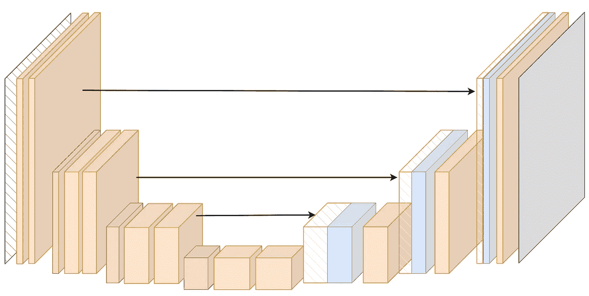
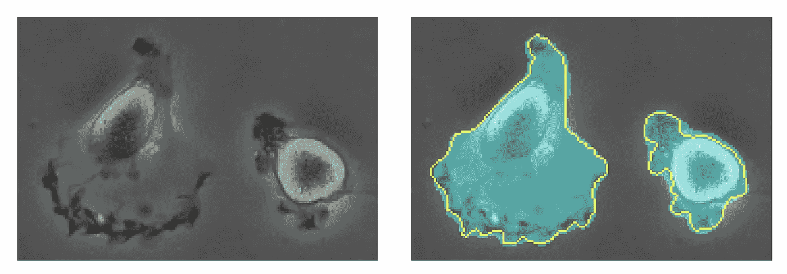
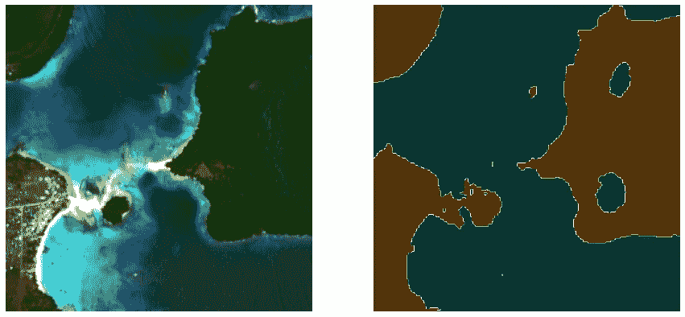
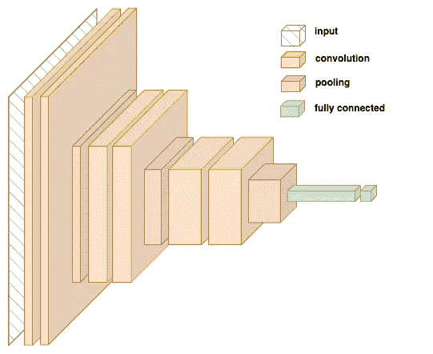
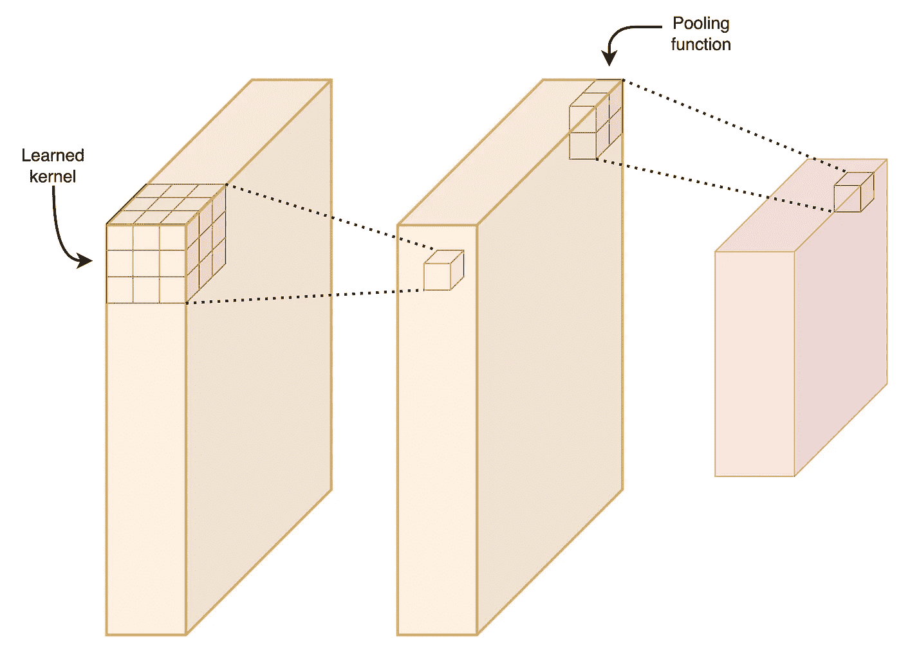
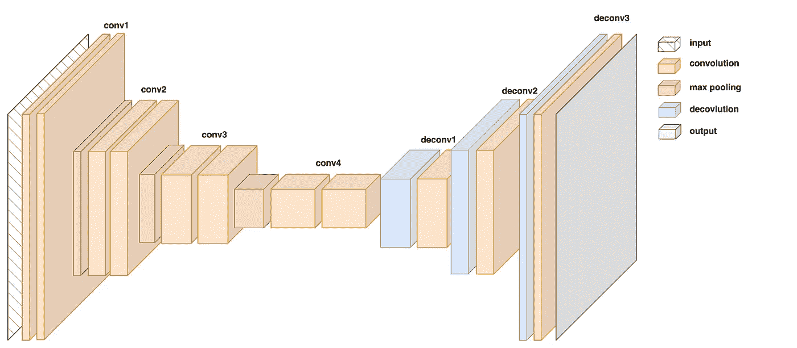
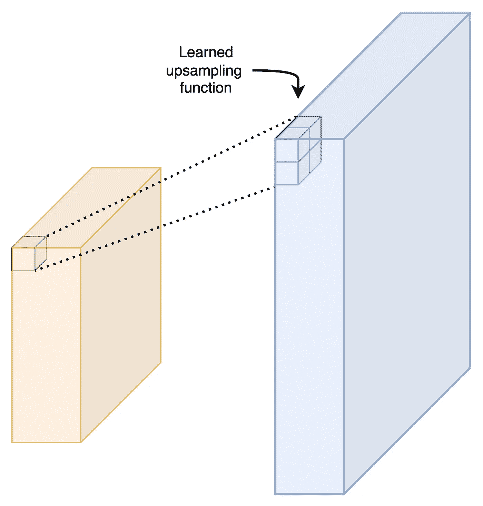
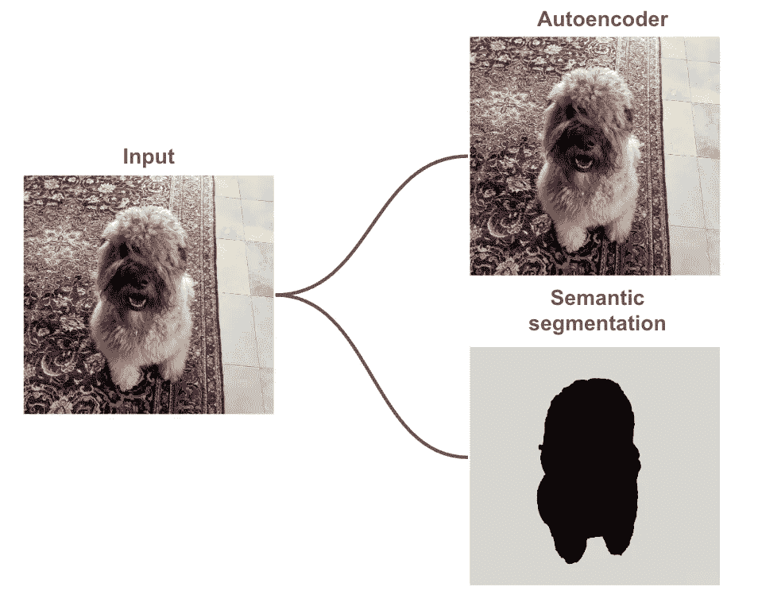
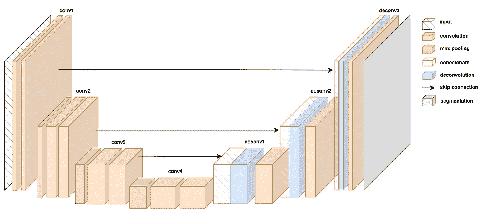
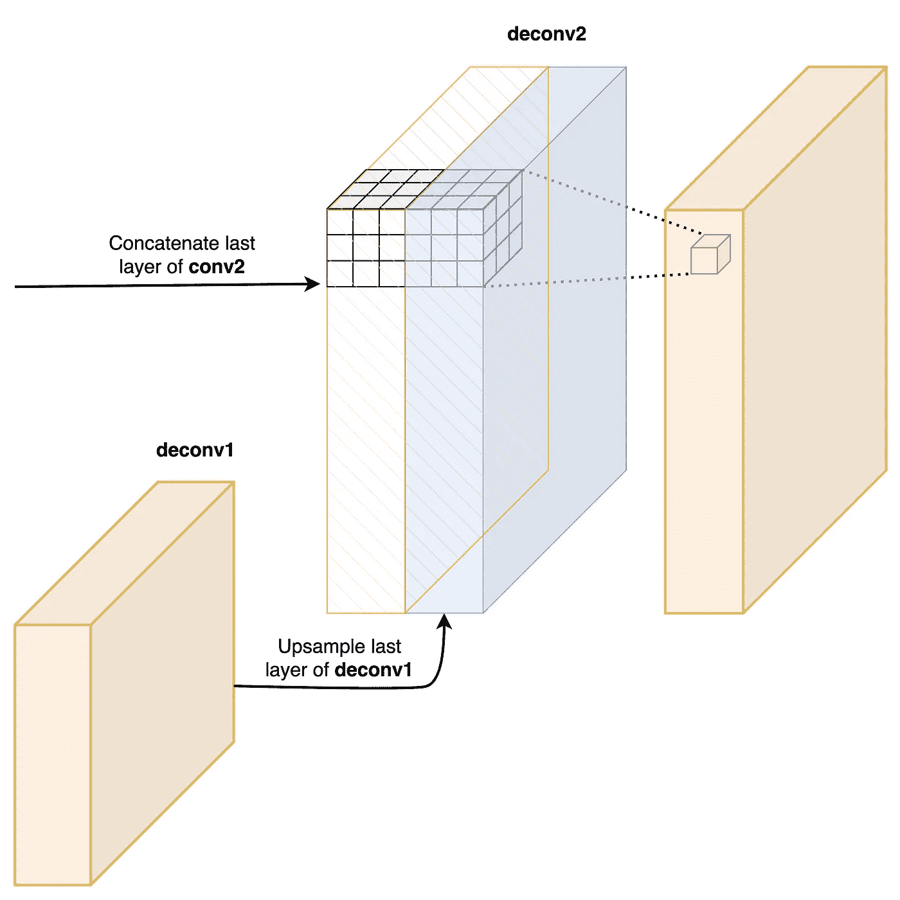

# U-Net 解析：理解其图像分割架构

> 原文：[`towardsdatascience.com/u-net-explained-understanding-its-image-segmentation-architecture-56e4842e313a`](https://towardsdatascience.com/u-net-explained-understanding-its-image-segmentation-architecture-56e4842e313a)

## 跳跃连接如何使 CNN 在数据较少的情况下进行准确的语义分割

 [Conor O'Sullivan](https://conorosullyds.medium.com/?source=post_page-----56e4842e313a--------------------------------)

·发表于[Towards Data Science](https://towardsdatascience.com/?source=post_page-----56e4842e313a--------------------------------) ·7 分钟阅读·2023 年 3 月 8 日

--

(来源：作者)

U-Net 是一种用于语义分割的流行深度学习架构。最初为医学图像开发，它在这一领域取得了巨大成功。但，这仅仅是开始！从卫星图像到手写字符，该架构在各种数据类型上都提高了性能。然而，其他 CNN 架构也能进行分割，那么 U-Net 到底有什么特别之处呢？

为了回答这个问题，我们将探索 U-Net 架构。我们将其与用于分类和自编码器的 CNN 进行比较。通过这样做，我们将理解**跳跃连接**如何是 U-Net 成功的关键。我们将看到它们如何使该架构在数据较少的情况下进行准确的分割。

# 什么是语义分割？

我们将从理解 U-Net 开发的目的开始。**图像分割**或**语义分割**是将类分配给图像中每一个像素的任务。模型使用分割图作为目标变量进行训练。例如，参见图 1。我们有原始图像和一个二值分割图。这个图将图像分为细胞和非细胞像素。

这个生物医学图像分割任务正是 U-Net 最初开发的目的。这些数据集的决定性因素是训练图像数量很少。图 1 中的示例来自仅有 35 张图像的数据集。在[图像增强](https://medium.com/towards-data-science/augmenting-images-for-deep-learning-3f1ea92a891c)的帮助下，U-Net 在准确性上比第二好的方法提高了 11%。

图 1：医学图像中的细胞分割（来源：[O. Ronneberger, et. al.](https://arxiv.org/abs/1505.04597)）

U-Net 也是灵活的。我在自己的研究中应用了它来分割卫星图像。正如图 2 所示，我们将海岸线图像分割成 2 个类别——陆地和水域。这个任务类似，但输入与医学图像不同。我们从单一的灰度图像变为了使用[12 个光谱波段](https://en.wikipedia.org/wiki/Sentinel-2)的卫星图像。

图 2：海岸线水体分割（来源：作者）（数据集：[SWED](https://openmldata.ukho.gov.uk/)）（许可证：[Sentinel 数据法律声明](https://sentinel.esa.int/documents/247904/690755/Sentinel_Data_Legal_Notice)）

# U-Net 架构

因此，U-Net 能够在各种分割任务中取得良好的结果。为了说明原因，我们将查看架构中最重要的组件——编码器、解码器和跳跃连接。我们将看到这些如何结合在一起，以*提取*和*定位*图像中的特征。

## 编码器

对于语义分割，我们关心的是图像中*有什么*物体以及这些物体在图像中的*位置*。这与**目标检测**或**图像分类**不同。在这里，我们旨在为每张图像预测一个类别**。** 即我们只关心*是否*图像中存在某个物体。为了进行这些预测，我们可以使用编码器。

你会在所有 CNN 架构中找到一个编码器的版本。它的工作是创建输入图像的紧凑表示。这是一个低维度的表示，仅包含图像中最重要的信息。换句话说，编码器用于*提取*特征。

图 3：用于图像分类的编码器（来源：作者）

这通过卷积层和池化层来完成。卷积层是一个映射或卷积核，它会遍历图像中的每一个像素。这个映射通过训练模型的过程*学习*到。然后，使用*预定义*的函数，池化层减少了输出的维度。

图 4：卷积层和池化层（来源：作者）

通过组合多个卷积层和池化层，我们可以提取更详细的信息。我们从边缘和颜色等低级细节开始，到耳朵、牙齿和眼睛等高级特征。网络将学习哪些特征对分类很重要，并提取这些特征来创建图像的紧凑表示。

一个问题是这种紧凑表示不包括图像中特征的*位置*。这对于图像分类来说是可以的。为了分类一只狗，我们只需要知道图像中*是否*有尾巴、耳朵或毛发。图像中这些特征的位置*在哪里*并不重要。相比之下，对于分割，位置是重要的。

## 解码器

编码器的另一个问题是其输出维度较低。如果用于分类，最终层将有几个节点——每个类别一个节点。对于分割，我们的输出将是一个与输入具有相同高度和宽度的图像。

我们需要一个解码器。如图 5 所示，这是从 conv4 块之后开始的部分。解码器将从紧凑的表示中重建图像。与编码器一样，它有卷积块。现在我们有*反卷积*层来*增加*图像的维度。

图 5：自编码器架构（来源：作者）

如前所述，池化层将使用预定义的方法来*减少*维度。例如最大池化，它取单元窗口中的最大像素值。相比之下，上采样或反卷积层使用学习的函数*增加*维度。即上采样函数会在模型训练时更新。

图 6：使用学习的上采样函数的反卷积（来源：作者）

在自编码器中，输入和输出图像将是相同的。这里解码器的目标是尽可能准确地重建输入。然后我们可以将来自较低维度层（即 conv4）的参数作为压缩图像。我们可以保存或发送压缩图像。然后，解码器可以用来重建原始输入。

图 7：自编码器输出与语义分割模型的对比（包含我的狗，Guinness）（来源：作者）

此时，你可能会问编码器和解码器是否足够。这种架构可以学习从图像到图像的映射。那么它当然可以学习到分割所需的简单输出映射。

解码器能够将重要特征传递给编码器。问题是特征的位置仍然丢失。为了解决这个问题，我们需要*大量*的数据来训练自编码器。这是解码器能够准确重建压缩表示图像的唯一方法。通过跳跃连接，我们可以减少这个数据需求。

## 跳跃连接

重要的是，对于自编码器，编码器和解码器*必须*是分开的。否则，这就违背了图像压缩的整个意义。对于语义分割，我们没有这个限制。

在 U-Net 中，跳跃连接用于将早期卷积层的信息传递到反卷积层。关键是传递的内容是卷积层提取的特征的*位置*。也就是说，跳跃连接告诉网络特征在图像中的*位置*。

图 8：U-Net 架构（来源：作者）

这是通过连接卷积块的最后一层和对称反卷积块的第一层完成的。U-Net 是对称的——对面层的维度将是相同的。如图 9 所示，这使得将层合并为一个单一张量变得容易。然后，通过在单一连接张量上运行内核来进行卷积处理。

图 9：连接层（来源：作者）

这种连接是 U-Net 的核心。它结合了两个重要的信息：

+   **特征提取** — 特征从前一层传递到上采样层（蓝色）

+   **特征定位** — 特征的位置从对面卷积层传递（橙色阴影）

通过结合这些信息，我们可以提高语义模型的性能，并减少训练网络所需的数据量。

我们略过了一些细节，比如激活函数、层数和层的维度。这些都可以作为 U-Net 中的超参数。为了应对特定的分割问题，对原始架构进行了调整。所有这些成功的关键在于跳跃连接。

希望你喜欢这篇文章！你可以通过成为我的 [**推荐会员**](https://conorosullyds.medium.com/membership) **:)** 来支持我

 [## 通过我的推荐链接加入 Medium — Conor O’Sullivan

### 作为 Medium 会员，你的部分会员费用会分配给你阅读的作者，你可以完全访问每个故事…

conorosullyds.medium.com](https://conorosullyds.medium.com/membership?source=post_page-----56e4842e313a--------------------------------)

| [Twitter](https://twitter.com/conorosullyDS) | [YouTube](https://www.youtube.com/channel/UChsoWqJbEjBwrn00Zvghi4w) | [Newsletter](https://mailchi.mp/aa82a5ce1dc0/signup) — 注册获取 **免费** 访问 [Python SHAP 课程](https://adataodyssey.com/courses/shap-with-python/)

## 参考文献

Olaf Ronneberger, Philipp Fischer, Thomas Brox, **U-Net: Convolutional Networks for Biomedical Image Segmentation** (2015)

[`arxiv.org/abs/1505.04597`](https://arxiv.org/abs/1505.04597)

Bharath K, **U-Net 架构用于图像分割** (2021), [`blog.paperspace.com/unet-architecture-image-segmentation/`](https://blog.paperspace.com/unet-architecture-image-segmentation/)

[Jeremy Zhang](https://medium.com/u/f37783fc8c26?source=post_page-----56e4842e313a--------------------------------), **UNet — 一行行解释** (2019), `towardsdatascience.com/unet-line-by-line-explanation-9b191c76baf5`

[Heet Sankesara](https://medium.com/u/9266f4b8f4c4?source=post_page-----56e4842e313a--------------------------------) 的文章《**UNet — 引入分割中的对称性**》 `towardsdatascience.com/u-net-b229b32b4a71`
