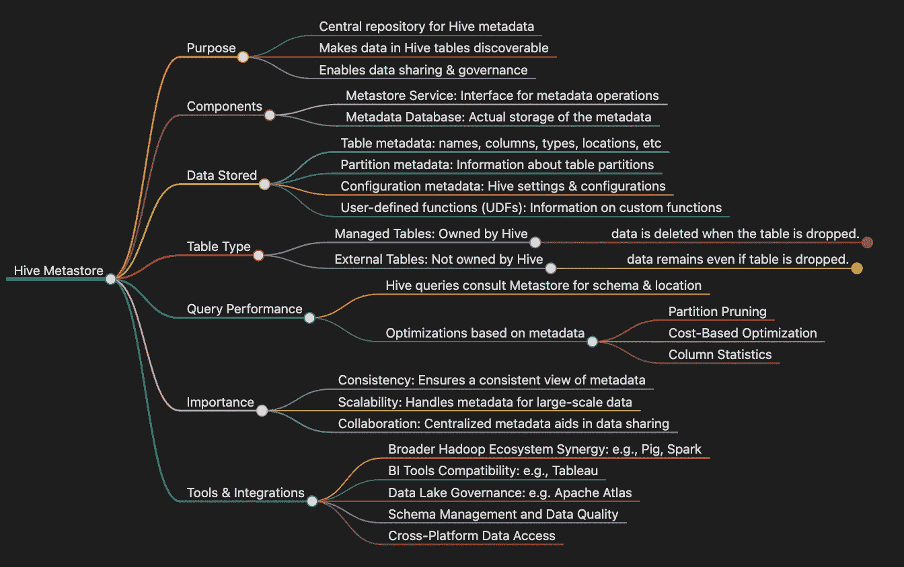

# Ultimate Hive Tutorial: Big Data 管理和查询的基本指南

> 原文：[`towardsdatascience.com/ultimate-hive-tutorial-essential-guide-to-big-data-management-and-querying-ce9ffe77a799?source=collection_archive---------7-----------------------#2023-11-10`](https://towardsdatascience.com/ultimate-hive-tutorial-essential-guide-to-big-data-management-and-querying-ce9ffe77a799?source=collection_archive---------7-----------------------#2023-11-10)

## 解锁 Hive 的力量：您的深度指南与视觉思维导图洞见

 [夏·赫](https://medium.com/@yoloshe302?source=post_page-----ce9ffe77a799--------------------------------)

·

[关注](https://medium.com/m/signin?actionUrl=https%3A%2F%2Fmedium.com%2F_%2Fsubscribe%2Fuser%2Fc98d2c413ea1&operation=register&redirect=https%3A%2F%2Ftowardsdatascience.com%2Fultimate-hive-tutorial-essential-guide-to-big-data-management-and-querying-ce9ffe77a799&user=Summer+He&userId=c98d2c413ea1&source=post_page-c98d2c413ea1----ce9ffe77a799---------------------post_header-----------) 发表在[Towards Data Science](https://towardsdatascience.com/?source=post_page-----ce9ffe77a799--------------------------------) ·8 分钟阅读·2023 年 11 月 10 日

--

图片作者：Obsidian 提供

## 简介

在大数据的迷宫中航行可能是一项艰巨的任务，尤其是当道路上铺满了复杂的术语和复杂的过程时。对于[Apache Hive](https://hive.apache.org/)来说尤为如此，这是一种在大数据生态系统中至关重要的数据管理和查询工具。尽管其重要性不言而喻，但关于 Hive 的清晰而简明的教程资源却很稀缺。这正是我编写“终极 Hive 教程：大数据管理与查询的必备指南”的原因。

本博客旨在简化复杂性，为你提供一个单一、全面的指南，阐明**Hive Metastore**、**Hive 数据模型**以及**元数据**的微妙世界——这一切都通过直观的示例和视觉思维导图来实现。

## 示例声明

为了演示 Hive 的核心概念，让我们想象一个全球零售连锁企业部署 Hive 来 catalog 和检查其销售交易。在这个操作的核心是一个名为`sales_db`的主要数据库。在这个数据库中有一个关键的表格，`sales_data`，旨在系统地记录销售活动。我们将会…
