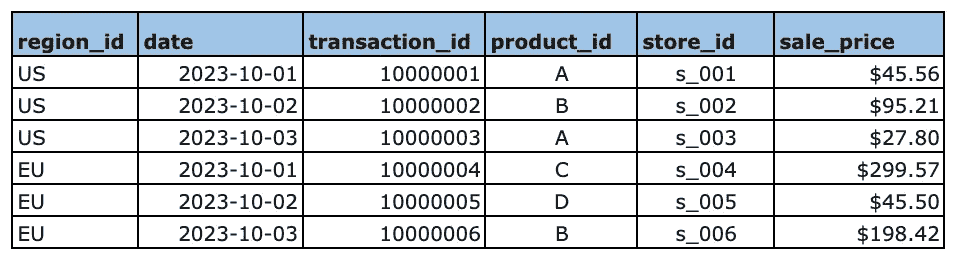
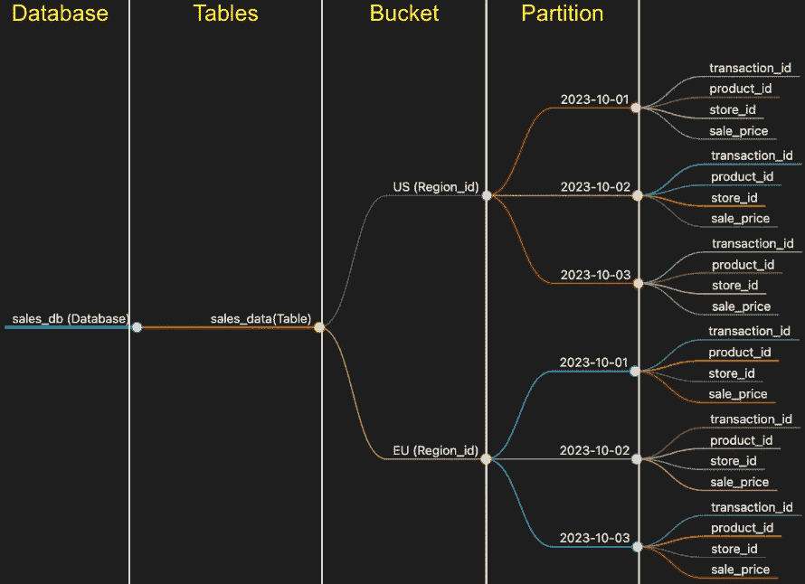
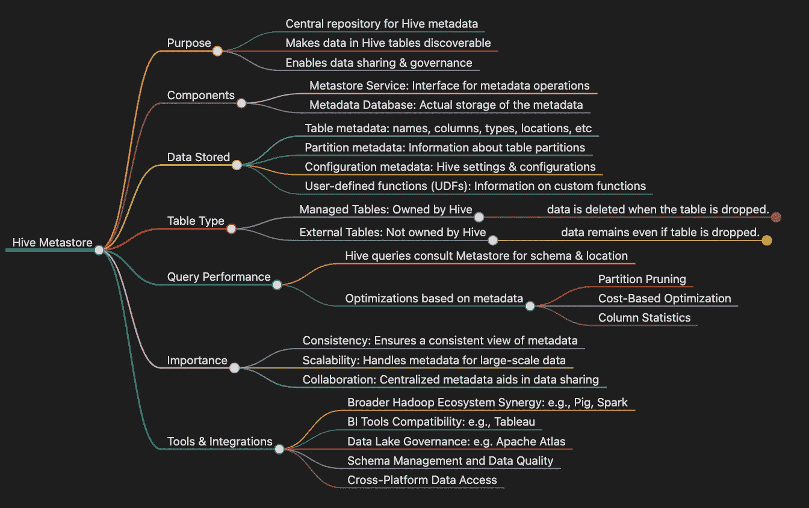

# 终极 Hive 教程：大数据管理与查询的必备指南

> 原文：[`towardsdatascience.com/ultimate-hive-tutorial-essential-guide-to-big-data-management-and-querying-ce9ffe77a799`](https://towardsdatascience.com/ultimate-hive-tutorial-essential-guide-to-big-data-management-and-querying-ce9ffe77a799)

## 解锁 Hive 的力量：您的深入指南与视觉思维导图洞察

[](https://medium.com/@yoloshe302?source=post_page-----ce9ffe77a799--------------------------------)[](https://towardsdatascience.com/?source=post_page-----ce9ffe77a799--------------------------------) [Summer He](https://medium.com/@yoloshe302?source=post_page-----ce9ffe77a799--------------------------------)

·发表于 [Towards Data Science](https://towardsdatascience.com/?source=post_page-----ce9ffe77a799--------------------------------) ·阅读时间 8 分钟·2023 年 11 月 10 日

--


作者通过 Obsidian 提供的图像

## 介绍

导航大数据的迷宫可能是一项艰巨的任务，特别是当这些路径铺满了复杂的术语和繁琐的过程时。这对 [Apache Hive](https://hive.apache.org/) 尤其如此，它是大数据生态系统中进行数据管理和查询的重要工具。尽管它的意义重大，但关于 Hive 的清晰而简明的教程资源却很少。这正是我制作“终极 Hive 教程：大数据管理与查询的必备指南”的原因。

本博客旨在破解复杂性，提供一个唯一的、全面的指南，阐明**Hive Metastore**、**Hive 数据模型**和细致的**metadata**世界——所有这些都通过直观的示例和视觉思维导图来呈现。

## 示例说明

为了演示 Hive 的核心概念，让我们设想一个全球零售连锁公司部署 Hive 来编目和检查其销售交易。此操作的核心是一个名为 `sales_db` 的主要数据库。在该数据库中，有一个关键的表格 `sales_data`，旨在系统地记录销售活动。我们将使用这个示例来说明本文中的所有 Hive 相关概念。让我们来看一下这个表格：



作者通过 Excel 提供的图像

## 什么是 [Metadata](https://en.wikipedia.org/wiki/Metadata)?

想象一下你发现了一个古老而尘封的图书馆。每本书都包含一个故事，但没有总结内容的目录卡——标题、作者、出版日期——你就会在信息的海洋中迷失方向。元数据类似于这些目录卡，它**不是数据本身，而是“数据的描述”**——一个描述主数据属性、关系和来源的信息层。在上述 `sales_data` 表中，元数据包括 **列名** —— `region_id` 、`date` 、`transaction_id` 、`product_id` 、`store_id` 、`sale_price` ，以及它们的 **数据类型、数据位置** 等。

## 什么是 [Hive Metastore](https://cwiki.apache.org/confluence/display/hive/design#:~:text=that%20with%201.-,Metastore,-Motivation)?

继续使用我们的图书馆类比，如果元数据是目录卡，那么 Hive Metastore 就是 **图书管理员**。它仔细 **组织** 这些卡片，确保每一条数据都有一个位置，每个查询都有一张通向信息宝藏的地图。**Hive Metastore 不存放实际的书籍（数据）；它存储和管理元数据。** 它是策展人，跟踪所有存储在 [Hadoop 分布式文件系统（HDFS）](https://www.ibm.com/topics/hdfs) 中的内容、每个文件包含什么、如何格式化以及如何分区。

作为数据的守护者，它确保每个查询和数据操作都顺利进行，为用户提供一个清晰的结构，以应对大数据的混乱。Hive metastore 包括两个基本单位：

+   **Metastore 服务**：一个提供 metastore 访问的服务，供其他 Apache Hive 服务使用。

+   **元数据数据库**：Hive 元数据的磁盘存储，与 [HDFS](https://www.ibm.com/topics/hdfs) 存储分开。

## 什么是 [Hive 数据模型](https://cwiki.apache.org/confluence/display/hive/design#:~:text=8%20and%209).-,Hive%20Data%20Model,-Data%20in%20Hive)?

首先谈谈元数据数据库及其设计——Hive 数据模型，即我们隐喻图书馆架子的蓝图。它定义了 **表**、**分区** 和 **桶** 的结构，这些就像是图书馆中分类和储存元数据的隔间和抽屉。

以全球零售为例，让我们从一个更深入的角度来审视 Hive 数据模型：

+   **表**：Hive 中的表是数据模型的关键部分，镜像了其关系数据库对应物的结构和功能。`sales_data` 表就是一个例子，结构化地存储相关的销售指标。

+   **桶**：Hive 通过引入桶化来增加数据组织的层次，这将数据分配到预定数量的桶中。每个桶是根据指定列的哈希值填充的，从而促进了更均衡的数据分布并提高了查询性能。对于我们的零售连锁店来说，`region_id`列可能是一个桶化的候选列，确保销售数据在不同的区域段中均匀分配。

+   **分区**：为了应对查询大量数据的固有挑战，Hive 实现了分区功能。此功能将表格分割成离散的部分，每个部分对应于唯一的列值。通过分区，针对特定数据子集的查询——例如特定日期的销售情况——可以更快、更高效地执行。对于`sales_data`表，通过`date`列进行分区意味着每个日历日的销售数据被整齐地存储在 [Hadoop 分布式文件系统 (HDFS)](https://www.ibm.com/topics/hdfs) 的各自**子目录**中，从而简化了访问和检索。



图片由作者通过 Obsidian 提供

这个精炼的 Hive 数据模型概述概括了其主要组成部分，突显了模型在大数据范围内简化和加速查询过程的能力。通过利用 Hive 的功能，企业可以自信而精准地处理数据存储和分析的复杂性。

## 图书馆的宝藏：表类型

在 Hive Metastore 中谈到表时，就像图书馆中的多样藏书一样，有两种主要的宝藏：

+   [**受管表**](http://www.hadooplessons.info/2014/12/managed-table-and-external-table-in-hive.html)：将这些表视为图书馆拥有、培养和保护的故事。它们存储在图书馆的范围内，并由图书馆直接管理。在 Hive 中，如果**删除**这些表，**数据将被删除**。

+   [**外部表**](http://www.hadooplessons.info/2014/12/managed-table-and-external-table-in-hive.html)：将这些表视为指引寻求者到其他图书馆的参考卡。虽然它们不在图书馆内，但它们提供了通向更多知识的门户。在 Hive 中，如果**删除**这些表，**数据将保留**但**与 Hive 断开连接**。

## 为什么选择 Hive 数据模型？

现在，这为什么重要？在大数据的世界里，我们处理的不是简单的体量，而是海量的数据。就像世界上最有效的图书馆一样，我们需要一个系统来管理这种规模。Hive 数据模型使你能够查询庞大的数据集而不会迷失在海洋中。它提供了一个熟悉的关系模型，让你像书中的章节一样分区数据，将类似的主题归为一类，以便快速访问。

考虑到`sales_data`表以 [Parquet 格式](https://parquet.apache.org/docs/file-format/) 存储：

+   **数据存储位置**：实际的销售数据（原始数据）存储在 [Parquet](https://parquet.apache.org/docs/file-format/) 文件中，这些文件位于 [HDFS](https://www.ibm.com/topics/hdfs) 中。这些文件分布在 Hadoop 集群中的多个节点的磁盘上。

+   **元数据管理**：Hive Metastore 保存有关 `sales_data` 表的元数据。该元数据包括诸如模式（列的名称和类型）、[Parquet](https://parquet.apache.org/docs/file-format/) 文件在 [HDFS](https://www.ibm.com/topics/hdfs) 中的位置、分区和桶详细信息以及其他表属性的信息。

当提交一个查询时，例如：

```py
Select * from sales_data
where region_id = US
and date >= '2023-10-02';
```

发生了以下情况：

+   **查询执行**：当对 `sales_data` 表运行 Hive 查询时，Hive 利用元数据来了解数据的结构，并确定**相关** [Parquet](https://parquet.apache.org/docs/file-format/) 文件的**位置**。对于仅需特定列的查询，**Hive 可以有效地从列式 Parquet 文件中读取所需数据，而无需扫描整个数据集。**

+   **分区与性能**：如果 `sales_data` 按照诸如 `date` 这样的列进行分区，Hive 会将数据存储在 [HDFS](https://www.ibm.com/topics/hdfs) 中每个分区的单独子目录中。每个分区目录中的 [Parquet](https://parquet.apache.org/docs/file-format/) 文件仅包含该特定日期的数据。当查询按日期筛选时，**Hive 只读取来自相关分区目录的 Parquet 文件，这是关键的性能优化。**

实质上，查询只会读取 `US` 桶下具有对应 `date` 的文件。虽然 `sales_data` 表中的数据物理上存储在 [Parquet](https://parquet.apache.org/docs/file-format/) 文件中并位于 [HDFS](https://www.ibm.com/topics/hdfs) 上，但 Hive 管理着这些数据的**结构**、**查询**和**处理**方式。Hive 用于元数据管理，而 Parquet 用于数据存储的组合，形成了一个强大且高效的大数据管理系统。

## **基于元数据的优化**

Hive 的真正力量，特别是在处理大数据方面，是通过其优化机制显现出来的，这些机制严重依赖于元数据。以下是具体说明：

**分区修剪**：最重要的优化之一是分区修剪，其中 Hive 使用元数据来识别和访问查询所需的相关分区。例如，如果分析师想要分析第一季度的销售数据，Hive 将使用与日期相关的元数据来跳过所有不在此范围内的分区。这大大减少了读取和处理的数据量，从而加快了查询执行速度。

**基于成本的优化的元数据**：Hive 还使用元数据进行基于成本的优化（CBO）。通过了解数据统计信息，如行数和数据分布，Hive 可以确定执行查询的最有效方式。它可以决定是否使用索引、是否进行映射端连接而不是减少端连接，或者多表连接的最佳顺序。

**列统计的元数据**：列统计信息如最小/最大值、空值数量和数据分布，使 Hive 能够做出明智的决策，选择最有效的执行路径。这可能包括跳过不符合查询过滤条件的数据块或选择适合聚合的操作符。

通过这些交互——查询 Metastore 以获取模式和位置细节，并利用元数据进行优化——Hive 提供了一个强大的平台，用于在大规模数据集上执行复杂的分析工作负载。这些优化确保即使数据以指数级增长，Hive 查询仍然高效，使其成为大数据生态系统中的重要工具。

## Hive Metastore 的多功能性：超越 Hive 集成

虽然 Hive Metastore 主要与 Apache Hive 相关联，但它的作用远不止于单一服务。Hive Metastore 作为一个中心**模式仓库**，对于在 Hadoop 生态系统及其他环境中集成各种数据处理工具至关重要。以下是 Hive Metastore 如何作为多个服务的枢纽：

+   **更广泛的 Hadoop 生态系统协同**：像[Apache Spark™](https://spark.apache.org/)和[Apache Pig](https://pig.apache.org/)这样的工具利用 Metastore 读取 Hive 表元数据，促进了一个一致的数据处理环境。

+   **BI 工具兼容性**：BI 应用程序，如[Tableau](https://www.tableau.com/data-insights)，连接到 Hive Metastore 以可视化和查询 Hive 管理的数据，使得额外的数据洞察更易获取。

+   **数据湖治理**：像[Apache Atlas](https://atlas.apache.org/#/)这样的平台与 Metastore 集成进行数据治理，利用其元数据进行全面的数据血缘追踪和安全管理。

+   **模式管理和数据质量**：Metastore 对于管理模式演变和确保各应用程序数据质量至关重要，维护数据完整性。

+   **跨平台数据访问**：Metastore 实现了与云服务的兼容性，允许在不同环境中无缝访问 Hive 数据。

## **深入探索：** Hive 库宇宙的详细思维导图

思维导图作为一种图形方法，用于结构化和描述信息。让我们通过下面的思维导图总结一下关于 Hive Metastore 的讨论：



作者通过 Obsidian 提供的图片

## 结论

开启大数据之旅，使用 Hive 不必独自一人踏上未知的征途。通过本指南，我希望你能全面了解 Hive。掌握这些概念后，我希望你能充分发挥`销售数据`及遇到的其他数据的潜力，将分析结果转化为可操作的见解。欢迎加入，祝数据管理愉快！📚💾
